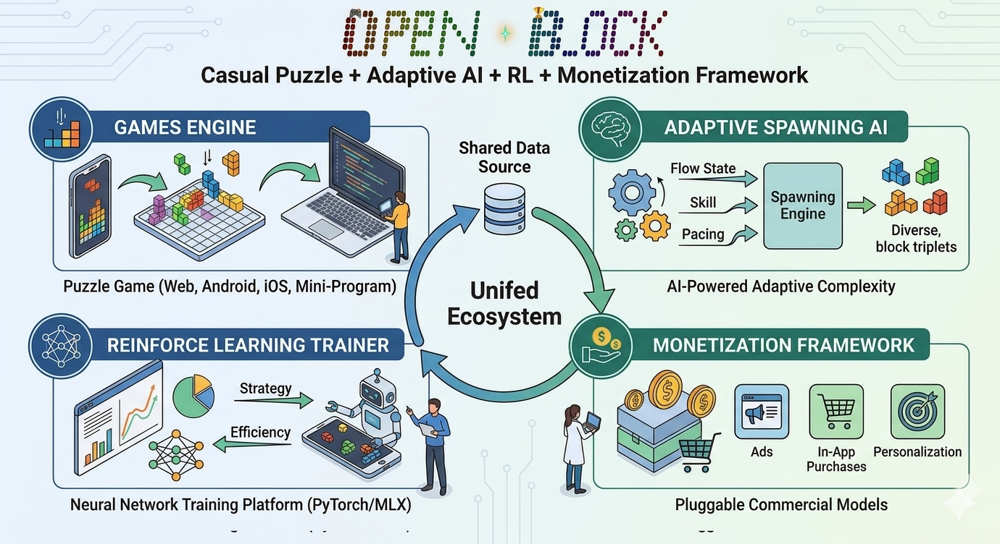
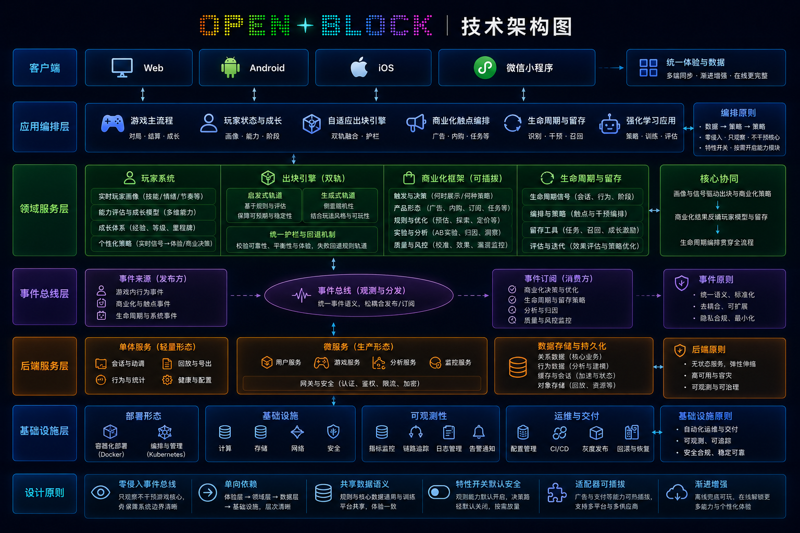
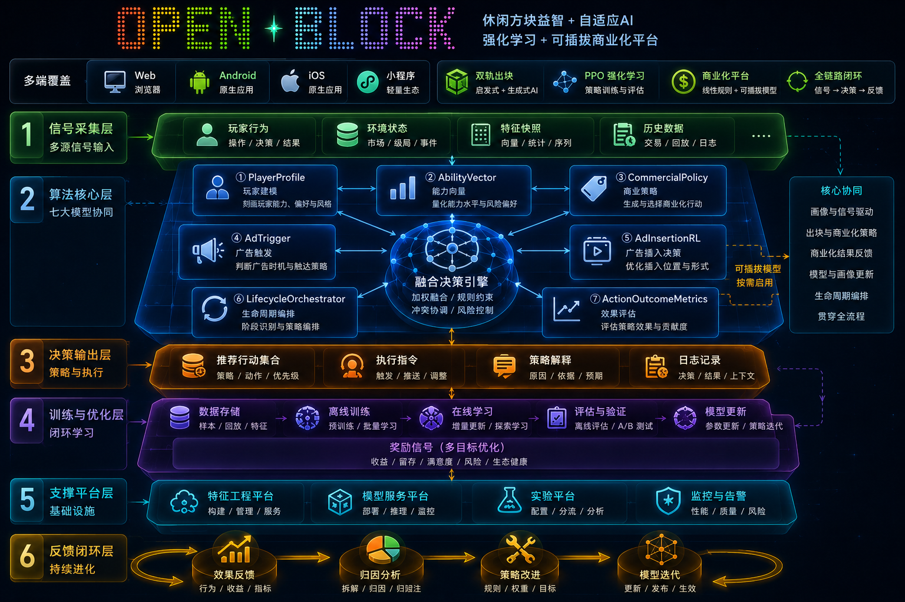

# OpenBlock 文档中心

> 面向开源协作的统一入口：先理解领域与方法论，再进入架构、算法、工程实现和测试验证。
> 在线查阅：[文档中心](http://localhost:5000/docs)（服务运行时可用）。
> 根目录入口：[README.md](../README.md) · [ARCHITECTURE.md](../ARCHITECTURE.md) · [CONTRIBUTING.md](../CONTRIBUTING.md)

## 项目定位

**OpenBlock 是一套以方块益智为最小可玩内核的开源参考实现，把玩法、玩家画像、强化学习、商业化四件事写在同一份代码、同一组特征、同一根事件总线之下。**

它面向的是这一类研发场景：

- **难度不再依靠固定关卡**：需要按玩家瞬时能力与跨局画像逐回合调控；
- **变现不再以广告 / IAP 二选一定型**：需要按生命周期阶段（S0–S4）与成熟度档位（M0–M4）做精细分群与触达；
- **算法不只服务玩法**：需要与商业化共享同一份玩家事实，避免体验团队与增长团队各持一套用户标签；
- **跨端不靠各自维护**：Web / Android / iOS / 微信小程序需要共用一套玩法逻辑、特征向量与语言资源。

OpenBlock 把上述场景所需的支柱——自适应出块、双层玩家画像（生命周期 + 成熟度）、PyTorch + MLX 双训练栈、5×5（25 格）双轴运营策略矩阵、四端同步底座——一次性放在同一个仓库里，并用契约文档锁住模块间的依赖方向。下面三张架构图分别从**业务、系统、算法**三个视角展开：业务视角看四支柱如何串起完整玩家旅程；系统视角看跨端、可观测、合规、安全如何被前置为架构默认值；算法视角看从信号采集到 RL 自博弈的六层工序如何共享同一组特征定义。

---

## 一、业务视角：四支柱共生于同一份玩家事实

> **写给经营决策者、业务负责人、产品总监与公众读者**——
> 帮助你判断：这套体验生态可以解决什么样的业务问题？它能在哪些品类、哪些市场被复用？它如何把"玩家时长"沉淀为"经营成果"，而不是单向地损耗它？



OpenBlock 的业务结构由 **四大产品支柱** 通过 **一份共享的玩家事实** 串成持续的正反馈闭环：

| 支柱 | 业务定位 | 经营杠杆 |
|---|---|---|
| 🎮 **游戏引擎** | 留存与活跃的入口，承担玩家时长与社交延展 | 难度 / 节奏 / 爽感 / 皮肤 / 彩蛋 |
| 🧠 **自适应出块 AI** | 个性化体验中枢，让难度跟着每个玩家走 | 心流匹配、挫败救济、爽感兑现 |
| 🤖 **强化学习训练** | 体验质量与算法迭代的科研闭环 | 自博弈策略改进、解空间探索、模型蒸馏 |
| 💰 **商业化框架** | 把体验转化为可持续经营，且不损耗体验本身 | 分群、IAA-IAP 切换、LTV 出价、触达节奏 |

**产品形态**：四支柱可整体接入，也可逐项复用。

- **整体接入**：四支柱覆盖玩家旅程的四类典型场景——首日体验由游戏引擎 + 自适应出块承接，留存与流失救济由生命周期 toast + 挫败检测承接，付费与签到由商业化分群 + LTV 出价承接，长期策略迭代由 RL 自博弈承接。
- **逐项复用**：玩家画像（生命周期 + 成熟度）可移植到其他休闲品类的难度调控场景；商业化分群矩阵可移植到其他玩法的运营触达场景；RL 训练栈（PyTorch + MLX 双轨）只需替换 `shared/game_rules.json` 与状态编码即可承接其他对局型任务。

**业务穿透性**：体验侧与商业侧共享**同一份玩家事实**——同一组生命周期阶段（S0–S4）与成熟度档位（M0–M4），既输入到 `adaptiveSpawn` 决定下一回合的出块难度，也输入到商业化分群矩阵决定下一次触达的内容与节奏。体验团队与增长团队据此读同一张玩家画像表，而非各自维护一套用户标签。

**经营回报**——决策层视角下落到三项具体收益：

- **变现以画像触发，而非按量级粗放投放**：广告频次、IAP 弹出、签到奖励均按 5×5（生命周期 × 成熟度）双轴策略矩阵的当前格位决定；玩家在体验劣化时不会被叠加变现压力，避免以损耗体验换取单局收入。
- **每一项 KPI 可回溯到 SQL 口径**：配置归 `shared/`、事件归 `MonetizationBus`、数据归 SQLite `user_stats` 表；运营看板字段与 SQL 查询逐项对齐，决策层与合规团队可独立复核，不依赖团队自证。
- **换皮 / 换品类不重建数据中台**：算法栈与玩法逻辑共用同一份特征定义；玩家画像、商业化分群、训练栈在新品类里改皮肤、改奖励、改盘面规则即可复用，无需重新设计画像表或重训分群模型。

详见 [生命周期与成熟度蓝图](./operations/PLAYER_LIFECYCLE_MATURITY_BLUEPRINT.md) 与 [商业化系统全景](./operations/MONETIZATION.md)。

---

## 二、系统视角：边界清晰、契约先行的全栈一体

> **写给系统架构师与业务负责人**——
> 帮助你判断：这套架构能否承载业务的长期演进？在团队扩张、品类扩展、跨端发布、合规上线、技术债治理等环节，它能为业务提供怎样的运营杠杆？



系统按 **「容器 → 组件 → 事件 → 部署」** 四个粒度自顶向下展开，每一层都遵循同一条工程纪律：**边界由契约描述，不由心照不宣的默契描述**。

| 层 | 关键约束 | 代码入口 |
|---|---|---|
| **容器层** | Web SPA / Flask 单体（多 Blueprint 编排） / Capacitor 壳（Android + iOS） / 微信小程序 / PyTorch + MLX 双训练栈，五容器各自可独立部署，统一通过 REST + 事件契约通信 | `web/`、`server.py`、`mobile/{android,ios}/`、`miniprogram/`、`rl_pytorch/`、`rl_mlx/` |
| **组件层** | 玩法引擎、玩家画像、自适应出块、商业化、留存、可观测——每个组件**严格单向依赖** `shared/game_rules.json`，禁止反向耦合 | `web/src/`、`web/src/monetization/`、`web/src/retention/` |
| **事件层** | `MonetizationBus` 是商业化与生命周期的**唯一总线**，事件全集与 payload 由契约文档兜底 | [MonetizationBus 事件契约](./architecture/MONETIZATION_EVENT_BUS_CONTRACT.md) |
| **部署层** | 单体 → K8s 微服务 mesh 平滑演进，配套 Prometheus + OpenTelemetry 与 Argon2id / Fernet / JWT 三件套安全加固 | [部署指南](./operations/DEPLOYMENT.md) · [K8s 部署](./operations/K8S_DEPLOYMENT.md) · [可观测性](./operations/OBSERVABILITY.md) |

**该架构把以下典型运营摩擦点前置为架构默认值**：

- **跨端发布同频**：Web 为核心实现，Android / iOS / 微信小程序经 `SYNC_CONTRACT` 同步玩法逻辑、特征向量与语言资源；同一次玩法 / 皮肤 / 活动改动经 `bash scripts/sync-core.sh`（小程序）与 `npm run mobile:sync`（移动端）下发到四端，规避「同一规则在四端各写四遍、版本错位」类问题。
- **单体起步、微服务收口**：起步阶段单台 Flask 单体（`server.py` 多 Blueprint）即可承载；规模上量后按 `k8s/base/` 提供的 manifest 与 Helm chart 拆分为微服务 mesh，业务代码与玩法配置无需改动。
- **可观测、合规、安全自起步即在仓库内**：Prometheus `/metrics` + OpenTelemetry trace、Argon2id 密码哈希、Fernet 字段加密、JWT 旋转、敏感字段掩码、隐私同意管理与数据导出 / 删除 SOP 自第一版即被布线，规避「上量后才补埋点 / 补合规」的版本债。

**契约先行带来的长线迭代具体回报**：

- **新成员的入手路径是「读契约 → 改契约 → 提 PR」**：配置归 `shared/`、事件归 `MonetizationBus`、跨端规则归 `SYNC_CONTRACT`、模块边界由专项契约文档逐项声明；新成员无需先理解作者历史脉络即可定位修改点。
- **品类扩展不需要新搭基础设施**：换一款玩法时，沿用同一份生命周期、商业化分群、训练栈与四端同步底座，仅需新增玩法逻辑与皮肤资源。
- **技术债以契约违反计票**：CI 与契约文档共同校验事件 payload、跨端字段、API 路由、特征维度的一致性；新引入的偏差在 PR 阶段被定位，不积累为后续版本的隐性回归。
- **AI 协作工具按契约阅读仓库**：契约文档（`SYNC_CONTRACT.md`、`MONETIZATION_EVENT_BUS_CONTRACT.md` 等）为 LLM 提供了稳定的语义入口，AI 辅助开发工具可在补全、重构、回归测试生成时直接引用，而非依赖人工 prompt 注入背景。

横向参照：[系统架构图（业务架构 + 全栈分层 + 6 子图）](./architecture/SYSTEM_ARCHITECTURE_DIAGRAMS.md) 提供这张图的详细分解（业务架构总览、容器视图、组件视图、事件总线、双轨算法、后端路由、部署拓扑共 8 张子图）。

---

## 三、算法视角：六层工序串起一条从信号到训练的连续链路

> **写给算法架构师与业务负责人**——
> 帮助你判断：这套算法栈在合理性、领先性、高效率三个维度是否过硬？它能否真正支撑留存、ARPU、LTV 等业务核心指标的稳定改善？



算法栈按 **六层（信号采集 → 玩家画像 → 自适应决策 → 内容生成 → 强化学习 → 训练监控）** 组织，每层都对应一个具体子模型与一个明确的契约：

| 层 | 子模型 / 算法 | 一句话作用 |
|---|---|---|
| 1. 信号采集 | 落子样本 EMA、盘面拓扑分析、节奏相位识别 | 把玩家行为与盘面状态压缩为可建模的连续特征 |
| 2. 玩家画像 | 局内能力向量、生命周期阶段、跨局成熟度、商业价值四套指标 | 把"瞬时能力 / 跨局画像 / 商业价值"解耦但共存 |
| 3. 自适应决策 | `adaptiveSpawn` 多信号 stress 合成 + 跨局画像调制 | 输出难度三元组，指挥下一回合出块 |
| 4. 内容生成 | 启发式规则引擎 + 生成式 SpawnTransformer 双轨 | 在硬约束（机动性 / 序贯可解性 / 解法数量）下采样三连块 |
| 5. 强化学习 | PPO + GAE + AlphaZero 风格搜索蒸馏 | 自博弈持续刷新策略上限，并通过 API 接入在线推理 |
| 6. 训练监控 | RL 训练面板与商业化漂移监控 | 把"模型能不能用"提到与"模型有没有训"同等优先级 |

算法栈按**合理性、领先性、高效率**三项工程性保证组织，每一项均对应可在仓库与文档中验证的具体事实。

**合理性**：每条算法路径在手册中都有可被双向复核的依据。

- **理论根据 → 落点对齐**：心流理论 → `flowDeviation`；近失效应 → `nearMissAdjust` / `nearMissCount`；节奏张弛 → 节奏相位识别 + `pickToPlaceMs` 反应曲线；首局保护 → `firstSessionStressOverride` + `firstSessionSpawns` 钳制；贝叶斯快速收敛 → `historicalSkill` 后验更新；挫败检测 → 连失序列识别 + `frustrationRelief` 兑现。
- **三栏标注**：算法手册（[ALGORITHMS_HANDBOOK](./algorithms/ALGORITHMS_HANDBOOK.md)）逐项写明「心理学根据 / 行业基准 / 可调参面」，调参时不必猜量纲。
- **可还原**：任意策略调整可从手册原理回到 `shared/` 配置、再回到代码路径，PR 评审能定位到具体心理学命题或基准命中点。

**领先性**：核心算法路径不止于单模型实现，而以"模型 + 共享契约"组合形态出现。

- **四模型共享同一特征定义**：启发式 / 生成式 SpawnTransformer / PyTorch RL / 浏览器 RL 共用 `shared/game_rules.json` 与同一份特征向量，避免训-推漂移；任一模型上线后可被其他三个模型回归校验。
- **双层调制严格分流**：跨局画像（S0–S4 × M0–M4，由 [LIFECYCLE_STRESS_CAP_MAP](./operations/PLAYER_LIFECYCLE_MATURITY_BLUEPRINT.md) 定义）与局内能力（瞬时 stress / spawnHints）走两条信号通路，命名相近指标在源码顶部 docstring 中互相警示，规避指标错位代入。
- **AlphaZero 风格 MCTS + 蒸馏**：训练侧由 PPO + GAE 与 MCTS 搜索协同，搜索结果蒸馏回轻量策略网络，最终经 `/api/rl` 接入浏览器侧推理；改进路径不依赖外部 SaaS。

**高效率**：迭代成本被工程层面前置压低。

- **配置即调参**：策略级调优（stress 权重、分群边界、奖励曲线、挫败救济触发）多数只需改 `shared/` 下的 JSON，经同步脚本即在四端生效，无需重新发版。
- **端侧推理与课程训练**：浏览器侧可独立完成推理与训练课程，云端 RL 训练为可选项；本地开发 / 培训 / 演示均不需要 GPU 集群。
- **CI 与契约共同充当回归门禁**：`npm test` + `npm run lint` + `npm run build` 与契约文档（`MONETIZATION_EVENT_BUS_CONTRACT`、`SYNC_CONTRACT` 等）双重把关；命名相近指标错位、跨端字段漂移、事件 payload 缺字段在 PR 阶段即被拦截。

**业务指标到算法路径的可追溯映射**：

- **留存改善**：由 stress 调制 + 生命周期 toast + 挫败救济兑现；触发与降级路径在 [自适应出块 §5.1.2](./algorithms/ADAPTIVE_SPAWN.md#512-生命周期--成熟度-stress-调制v132) 与 [生命周期与成熟度蓝图](./operations/PLAYER_LIFECYCLE_MATURITY_BLUEPRINT.md)。
- **ARPU / LTV 改善**：由 5×5 双轴策略矩阵 + IAA-IAP 切换 + LTV 出价 + 触达节奏调度兑现；规则与默认值在 [商业化算法手册](./algorithms/ALGORITHMS_MONETIZATION.md)。
- **下一个增长点探索**：由 RL 自博弈与商业化 bandit 实验供给；训练管线与回归方法在 [RL 算法手册](./algorithms/ALGORITHMS_RL.md) 与 [商业化模型架构设计](./algorithms/COMMERCIAL_MODEL_DESIGN_REVIEW.md)。

横向参照：[算法架构图（设计参考 + 紧凑概念图 + 8 子图）](./algorithms/ALGORITHM_ARCHITECTURE_DIAGRAMS.md) 给出这张图的 8 张子图分解（信号采集、算法核心、决策策略、训练监控、商业化算法、玩家模型、RL 闭环、反馈链路）。

---

## 设计取舍：产品 / 算法 / 架构层面的非默认选择

> 上节三张架构图说明"它由什么构成"。本节列出三处**与行业默认做法不同的具体选择**，并标注随之而来的代价与回报，便于读者判断这些取舍是否适合自己的项目。

**产品层：把心流 / 挫败 / 节奏 / 爽感落到具体特征通路，而非留作策划口头形容词**

- **非默认选择**：四类体验感受不再以关键词形式出现在策划文档里，而是分别落到 flowDeviation（心流）、`spawnHints` + 挫败检测（挫败）、节奏相位识别（节奏）、消行计分曲线 + 同色 / 同 icon bonus（爽感）四条特征通路；每条通路有明确的输入信号与可调参面。
- **代价**：策划写"我希望玩家此处产生什么体验"时，需要选择一条已经存在的通路或显式新增一条；初期沟通成本上升，对策划的工程素养有要求。
- **回报**：体验需求可在 PR 评审中被双向校验（"调了什么、为什么调"），避免「调了几次手感都说不清原因」的反复迭代；详见 [体验设计基石](./player/EXPERIENCE_DESIGN_FOUNDATIONS.md)。

**算法层：四模型强制共享同一组特征定义，而非各自维护**

- **非默认选择**：启发式 / 生成式 SpawnTransformer / 训练侧 RL（PyTorch + MLX）/ 推理侧 RL（浏览器）四个模型共享 `shared/game_rules.json` 与同一份特征向量；跨局画像与局内能力分流为两条信号通路并在源码顶部 docstring 互相警示。
- **代价**：新增任何一个算法时必须先扩展共享特征定义、再做模型本身；不能为追求局部指标自带特征。
- **回报**：消除 ML 项目最常见的训-推漂移；命名相近的指标（如两套 `SkillScore`）不会被无意识代入彼此位置；任一模型上线后可被其他三个模型在共享特征上做回归校验。详见 [四模型系统设计](./algorithms/MODEL_SYSTEMS_FOUR_MODELS.md)。

**架构层：跨端走"单核多端 + 配置事实源单一"，而非各端独立维护**

- **非默认选择**：Web 为唯一玩法实现，Android / iOS / 微信小程序经 `SYNC_CONTRACT` 同步玩法逻辑、特征向量与语言资源；玩法 / 算法 / 商业化的所有可调常量集中于 `shared/`，禁止分散到各端代码。
- **代价**：需要维护跨端同步脚本（`scripts/sync-core.sh`、`npm run mobile:sync`）与契约文档；新增字段需走契约扩展流程而非直接落到端上代码。
- **回报**：跨端发布天然同频；任一端的事故可由其他三端的契约比对快速定位偏差；新成员只需理解 Web + 契约即可贡献到所有端。详见 [四端同步契约](./platform/SYNC_CONTRACT.md)。

---

## 四、面向四类核心读者的阅读建议

| 角色 | 它对你的价值 | 推荐起点 |
|---|---|---|
| **经营决策层 / 商业化** | 一份把"玩家画像 → 体验调控 → 商业化触达 → 经营 KPI"完整闭环开放出来的参考实现，让经营策略与体验策略第一次共享同一组事实 | [生命周期与成熟度蓝图](./operations/PLAYER_LIFECYCLE_MATURITY_BLUEPRINT.md) → [商业化系统全景](./operations/MONETIZATION.md) |
| **游戏策划 / 体验设计** | 一套把"心流、挫败、节奏、爽感"翻译为可调参面与心理学根据的工程语言，让设计意图能够落到代码而不是停留在脑海 | [体验设计基石](./player/EXPERIENCE_DESIGN_FOUNDATIONS.md) → [自适应出块](./algorithms/ADAPTIVE_SPAWN.md) |
| **算法 / ML 工程师** | 一个启发式、生成式、强化学习三栈共存且共享特征定义的工程模板，把"算法漂移"与"训-推不一致"作为可被预防的工程问题处理 | [算法与模型手册](./algorithms/ALGORITHMS_HANDBOOK.md) → [RL 算法手册](./algorithms/ALGORITHMS_RL.md) |
| **架构 / 平台工程师** | 一种 Web 核心 + 跨端真共享的单核多端架构，把"四端各写一份"的常见困境转化为一份契约管理问题 | [架构总览](../ARCHITECTURE.md) → [二次开发指南](./engineering/DEV_GUIDE.md) → [四端同步契约](./platform/SYNC_CONTRACT.md) |

下方「[角色导航](#角色导航)」给出每个角色更细的"先读 / 再读"双跳路径，帮助你按职责走完这套体验设计基础设施。

---

## 如何阅读

文档中心按三层组织，跨领域文档只保留一个权威位置，在其他章节通过链接引用；阶段性 sprint 文档收敛在 `docs/archive/`：

1. **领域知识**：为什么要这样设计（休闲游戏心理、心流、挫败、留存、变现、品类研究）
2. **方法论与算法**：如何建模（出块、玩家画像、RL、商业化推断、计分与难度）
3. **工程框架**：如何落地（前后端架构、扩展点、配置、平台适配、验证流程）

## 目录结构

```text
docs/
├── README.md          # 文档中心总入口
├── algorithms/        # 出块、RL、玩家模型、商业化模型等算法手册
├── architecture/      # 跨模块架构契约（事件总线、生命周期分层）
├── archive/           # 已归档的历史方案与早期 sprint 文档
├── domain/            # 领域知识、品类研究、竞品与架构对比
├── engineering/       # 工程指南、测试、i18n、性能、Cursor Skills
├── integrations/      # 广告 / IAP / 企业 API 接入
├── operations/        # 商业化、运营、训练面板、运维与合规
├── platform/          # Android / iOS 客户端、小程序适配、四端同步
├── player/            # 玩家画像、面板参数、实时策略、玩法风格
└── product/           # 玩法、难度、计分、留存、皮肤、惊喜系统
```

## 角色导航

| 角色 | 先读 | 再读 | 目标 |
|------|------|------|------|
| 产品 / 玩法策划 | [体验设计基石](./player/EXPERIENCE_DESIGN_FOUNDATIONS.md) → [领域知识](./domain/DOMAIN_KNOWLEDGE.md) → [休闲游戏品类分析](./domain/CASUAL_GAME_ANALYSIS.md) | [难度模式](./product/DIFFICULTY_MODES.md) → [彩蛋与惊喜](./product/EASTER_EGGS_AND_DELIGHT.md) → [策略定制指南](./engineering/STRATEGY_GUIDE.md) | 理解体验曲线、心流、奖励节奏与玩法可调面 |
| 算法工程师 | [算法架构图（六层 + 七子模型设计参考 + 8 子图）](./algorithms/ALGORITHM_ARCHITECTURE_DIAGRAMS.md) → [算法与模型手册](./algorithms/ALGORITHMS_HANDBOOK.md) → [四模型系统设计](./algorithms/MODEL_SYSTEMS_FOUR_MODELS.md) | [出块算法手册](./algorithms/ALGORITHMS_SPAWN.md) → [玩家画像算法](./algorithms/ALGORITHMS_PLAYER_MODEL.md) → [RL 手册](./algorithms/ALGORITHMS_RL.md) → [商业化模型架构设计](./algorithms/COMMERCIAL_MODEL_DESIGN_REVIEW.md) | 统一符号、公式、模型结构、训练 / 推理链路 |
| 架构 / 平台工程师 | [架构总览](../ARCHITECTURE.md) → [技术总览](./engineering/PROJECT.md) | [二次开发指南](./engineering/DEV_GUIDE.md) → [Android / iOS 客户端外壳](./platform/MOBILE_CLIENTS.md) → [微信小程序适配](./platform/WECHAT_MINIPROGRAM.md) → [四端同步契约](./platform/SYNC_CONTRACT.md) | 理解模块边界、数据流、扩展接口与跨端同步 |
| 运营 / 商业化 | [商业化系统全景](./operations/MONETIZATION.md) → [商业化系统综合报告](./operations/COMMERCIAL_STRATEGY_REVIEW.md) → [生命周期与成熟度蓝图](./operations/PLAYER_LIFECYCLE_MATURITY_BLUEPRINT.md) | [商业化算法](./algorithms/ALGORITHMS_MONETIZATION.md) → [训练面板](./operations/MONETIZATION_TRAINING_PANEL.md) → [能力对照表](./operations/COMMERCIAL_IMPROVEMENTS_CHECKLIST.md) | 理解分群、触发策略、运营面板、KPI 与企业落地项 |
| 测试 / QA | [测试指南](./engineering/TESTING.md) | [PROJECT 测试章节](./engineering/PROJECT.md#测试) → [RL 数值稳定](./algorithms/RL_TRAINING_NUMERICAL_STABILITY.md) → [训练看板趋势](./algorithms/RL_TRAINING_DASHBOARD_TRENDS.md) | 建立功能 / 算法 / 回归 / 数据一致性验证清单 |
| 开源贡献者 | [README](../README.md) → [贡献指南](../CONTRIBUTING.md) | [二次开发指南](./engineering/DEV_GUIDE.md) → 本页"文档维护规范" | 快速跑起来、找到任务边界、提交可审查改动 |
| AI 辅助开发 | [Cursor Skills 索引](./engineering/CURSOR_SKILLS.md) | [休闲游戏构建 Skill](./engineering/CASUAL_GAME_BUILD_SKILL.md) → [ARCHITECTURE](../ARCHITECTURE.md) → [TESTING](./engineering/TESTING.md) | 选用 Project / Personal Skills |

## 权威文档地图

### 项目与架构

| 文档 | 何时阅读 | 维护定位 |
|------|----------|----------|
| [README](../README.md) | 第一次了解项目、安装与快速启动 | 项目门面，保持短而稳定 |
| [ARCHITECTURE](../ARCHITECTURE.md) | 理解系统边界、模块关系、核心数据流 | 架构事实来源 |
| [技术总览](./engineering/PROJECT.md) | 快速定位前端 / 后端 / RL / 商业化模块 | 工程地图 |
| [二次开发指南](./engineering/DEV_GUIDE.md) | 新增模块、接入 SDK、扩展 API | 开发流程与扩展约定 |
| [i18n](./engineering/I18N.md) | 修改文案、语言包、RTL 支持 | 国际化规范 |
| [测试指南](./engineering/TESTING.md) | 提交前验证、写测试、排查回归 | 质量门禁 |
| [SQLite 数据库模式](./engineering/SQLITE_SCHEMA.md) | 表字段、用途、`/api` 映射 | 后端、数据、运维 |
| [黄金事件字典](./engineering/GOLDEN_EVENTS.md) | `GAME_EVENTS` / behaviors 命名与版本约定 | 数据、商业化、测试 |
| [Canvas 转换索引](./engineering/CANVAS_ARTIFACTS.md) | 已从 Cursor Canvas 转换为 Markdown 的文档入口 | 产品、算法、运营、AI 协作 |
| [Cursor Skills 索引](./engineering/CURSOR_SKILLS.md) | 仓库内 Project Skills、个人可选 Skill、维护约定 | AI 协作、贡献者 |
| [休闲游戏构建 Skill](./engineering/CASUAL_GAME_BUILD_SKILL.md) | 从核心循环到商业化与 CI 的阶段化清单 | 架构、全栈、AI 协作 |
| [性能优化说明](./engineering/PERFORMANCE.md) | rAF 合并绘制、懒加载 chunk、可见性定时器 | 前端、架构 |

### 跨模块架构契约

| 文档 | 核心问题 | 适合角色 |
|------|----------|----------|
| [系统架构图（业务架构 + 全栈分层 + 6 子图）](./architecture/SYSTEM_ARCHITECTURE_DIAGRAMS.md) | 业务四支柱 / 容器 / 组件 / 事件总线 / 双轨算法 / 后端路由 / 部署拓扑 | 全角色 |
| [算法架构图（设计参考 + 紧凑概念图 + 8 子图）](./algorithms/ALGORITHM_ARCHITECTURE_DIAGRAMS.md) | 六层结构 + 七子模型 + 反馈闭环（设计参考） / 信号采集 + 算法核心 + 决策策略 + 训练监控（紧凑概念） | 算法、商业化、留存、新成员 |
| [MonetizationBus 事件契约](./architecture/MONETIZATION_EVENT_BUS_CONTRACT.md) | 商业化 / 生命周期 / 广告事件全集、payload、订阅方 | 架构、商业化、广告 |
| [生命周期数据→策略分层](./architecture/LIFECYCLE_DATA_STRATEGY_LAYERING.md) | 数据层 + 编排层 + 策略层三段式架构与单向依赖约束 | 架构、商业化、留存 |
| [架构图生成 Prompt（系统侧）](./architecture/ARCHITECTURE_DIAGRAM_PROMPT.md) | 重生成系统架构图的可复用 prompt 模板与事实包 | 架构、AI 协作 |
| [架构图生成 Prompt（算法侧）](./algorithms/ALGORITHM_DIAGRAM_PROMPT.md) | 重生成算法架构图的可复用 prompt 模板与事实包 | 算法、AI 协作 |

### 领域知识与产品方法论

| 文档 | 核心问题 | 适合角色 |
|------|----------|----------|
| [领域知识](./domain/DOMAIN_KNOWLEDGE.md) | 方块益智、心流、挫败、RL、商业化的基础概念 | 全角色 |
| [休闲游戏品类分析](./domain/CASUAL_GAME_ANALYSIS.md) | 竞品、能力模型、体验缺口、系统机会 | 产品、运营、算法 |
| [全球休闲游戏个性化策略与调研](./domain/GLOBAL_CASUAL_GAME_RESEARCH.md) | 全球市场、地区文化、人口学分层、个性化边界 | 产品、运营、合规、算法 |
| [竞品与用户分析](./domain/COMPETITOR_USER_ANALYSIS.md) | 目标用户、竞品机制、差异化方向 | 产品、运营 |
| [架构对比](./domain/ARCHITECTURE_COMPARISON.md) | 不同实现路线的取舍 | 架构、技术负责人 |

### 玩法、难度与玩家系统

| 文档 | 核心问题 | 适合角色 |
|------|----------|----------|
| [难度模式](./product/DIFFICULTY_MODES.md) | Easy / Normal / Hard 与自适应难度如何协作 | 产品、算法、测试 |
| [消行计分](./product/CLEAR_SCORING.md) | `baseUnit * c²`、多消、同色 / 同 icon bonus | 产品、算法、测试 |
| [玩家能力评估接入说明](./player/PLAYER_ABILITY_EVALUATION.md) | 玩家能力输出如何被产品和策略消费 | 产品、运营、测试 |
| [玩家面板参数](./player/PANEL_PARAMETERS.md) | UI 指标含义、异常解读、调参提示 | 产品、运营、测试 |
| [体验设计基石](./player/EXPERIENCE_DESIGN_FOUNDATIONS.md) | 顶层方法论：心理学根基 + 5 轴体验结构 + 设计审查清单 | 产品、设计、算法、架构、测试 |
| [实时策略系统](./player/REALTIME_STRATEGY.md) | 指标字典、压力体系、L1–L4 管线、策略卡生成 | 产品、算法、架构、测试 |
| [策略体验栈](./player/STRATEGY_EXPERIENCE_MODEL.md) | 通用四层模型、单一意图、几何门控、叙事职责分离 | 产品、算法、架构、测试 |
| [玩法风格检测](./player/PLAYSTYLE_DETECTION.md) | 玩家风格识别与策略微调 | 产品、算法 |

### 出块算法与建模

| 文档 | 核心问题 | 适合角色 |
|------|----------|----------|
| [四模型系统设计](./algorithms/MODEL_SYSTEMS_FOUR_MODELS.md) | 启发式出块 / 生成式出块 / PyTorch RL / 浏览器 RL 的设计与损失 | 算法、架构、测试 |
| [模型工程总览](./algorithms/MODEL_ENGINEERING_GUIDE.md) | 把全部模型放在同一张工程地图，统一假设、特征、网络与训练流程 | 算法、架构 |
| [出块算法手册](./algorithms/ALGORITHMS_SPAWN.md) | 规则 + SpawnTransformer 的形式化与训练 / 推理 | 算法 |
| [出块三层架构](./algorithms/SPAWN_ALGORITHM.md) | Layer 1/2/3 如何从盘面到体验生成三连块 | 算法、架构、测试 |
| [自适应出块](./algorithms/ADAPTIVE_SPAWN.md) | 多信号 stress、心流、爽感兑现、spawnHints | 产品、算法 |
| [候选块概率图鉴](./algorithms/CANDIDATE_BLOCKS_PROBABILITY_ATLAS.md) | 28 个候选块、类别权重、基础概率、难度档位 | 产品、算法、测试 |
| [出块建模](./algorithms/SPAWN_BLOCK_MODELING.md) | 规则引擎与 ML 出块模型的设计 rationale | 算法、架构 |
| [解法数量难度](./algorithms/SPAWN_SOLUTION_DIFFICULTY.md) | DFS 解空间计数、`solutionCount` 区间软过滤、`orderRigor` 顺序刚性 | 算法、测试 |

### 强化学习

| 文档 | 核心问题 | 适合角色 |
|------|----------|----------|
| [RL 文档导航](./algorithms/RL_README.md) | RL 栏目的权威手册、专题补充和历史实验如何阅读 | 算法、后端、测试 |
| [RL 算法手册](./algorithms/ALGORITHMS_RL.md) | PPO / GAE、网络结构、奖励、探索、推理 API 的权威事实 | 算法 |
| [玩法与 RL 解耦](./algorithms/RL_AND_GAMEPLAY.md) | 真人玩法、训练环境、共享配置和特征维度边界 | 算法、架构 |
| [PyTorch RL 服务与评估](./algorithms/RL_PYTORCH_SERVICE.md) | 在线 `/api/rl`、离线训练、search replay 和贪心评估 | 算法、后端 |
| [RL 训练数值稳定](./algorithms/RL_TRAINING_NUMERICAL_STABILITY.md) | 训练时的梯度 / 数值稳定与排障 | 算法 |
| [RL 看板数据流与刷新机制](./algorithms/RL_TRAINING_DASHBOARD_FLOW.md) | RL 看板的数据来源、刷新机制和自检方法 | 算法、测试 |
| [RL 看板趋势解读](./algorithms/RL_TRAINING_DASHBOARD_TRENDS.md) | 关键曲线、趋势解读 | 算法 |
| [RL AlphaZero 优化方案](./algorithms/RL_ALPHAZERO_OPTIMIZATION.md) | AlphaZero 风格搜索 + 蒸馏在 OpenBlock 的适配方案 | 算法 |
| [RL 自博弈文献对照](./algorithms/RL_SELF_PLAY_LITERATURE_COMPARISON.md) | AlphaZero / MuZero / Expert Iteration / Gumbel AlphaZero 等路线对比 | 算法 |
| [RL 复杂度与瓶颈研究](./algorithms/RL_ANALYSIS.md) | RL 任务复杂度、模型与优化候选池研究专题 | 算法 |

历史 sprint 分析（v9.x 平台期诊断、训练优化清单、浏览器优化、自博弈路线图）已收敛到
[`docs/archive/algorithms/`](./archive/algorithms/)。

### 商业化与运营

| 文档 | 核心问题 | 适合角色 |
|------|----------|----------|
| [商业化系统全景](./operations/MONETIZATION.md) | IAA / IAP、分群、触发、API、模块全景 | 运营、产品、架构 |
| [商业化系统综合报告](./operations/COMMERCIAL_STRATEGY_REVIEW.md) | 模块拓扑、关键能力、KPI 监控点 | 运营、产品、架构 |
| [生命周期与成熟度蓝图](./operations/PLAYER_LIFECYCLE_MATURITY_BLUEPRINT.md) | 双轴（S0–S4 × M0–M4）、双分制成熟度、能力与运营接入点 | 运营、产品、算法、客户端 |
| [运营看板指标审计](./operations/OPS_DASHBOARD_METRICS_AUDIT.md) | `/ops` 指标接库、SQL 口径、截图复核 | 运营、产品、数据、后端 |
| [商业化算法手册](./algorithms/ALGORITHMS_MONETIZATION.md) | 鲸鱼分、规则引擎、LTV、CPI 出价；§15 算法层扩展模块索引 | 算法、运营 |
| [商业化模型架构设计](./algorithms/COMMERCIAL_MODEL_DESIGN_REVIEW.md) | snapshot / 校准 / MTL / 漂移 / bandit / 决策包装 | 算法、商业化 |
| [商业化定制](./operations/MONETIZATION_CUSTOMIZATION.md) | 接入真实广告 / IAP SDK、规则扩展 | 架构、运营 |
| [商业化训练面板](./operations/MONETIZATION_TRAINING_PANEL.md) | MonPanel 字段、界面与调试 | 运营、产品 |
| [Block Blast 商业化运营指南](./platform/MONETIZATION_GUIDE.md) | 跨平台 PWA / 广告 / IAP / 签到 / 分享配置 | 运营、平台 |
| [商业运营参考分析](./operations/COMMERCIAL_OPERATIONS.md) | 运营机会池与策略参考 | 运营 |
| [商业化与企业能力对照表](./operations/COMMERCIAL_IMPROVEMENTS_CHECKLIST.md) | 各项能力的实现状态、外部依赖与规划项 | 运营、产品、集成 |
| [合规与运维 SOP](./operations/COMPLIANCE_AND_SOPS.md) | 隐私、同意管理、数据导出 / 删除、敏感字段掩码 | 运营、合规、后端 |

### 运维与部署

| 文档 | 何时阅读 | 维护定位 |
|------|----------|----------|
| [部署指南](./operations/DEPLOYMENT.md) | 单体 / 微服务 mesh 上线、备份恢复 Runbook | 运维、SRE、平台 |
| [Kubernetes 部署](./operations/K8S_DEPLOYMENT.md) | `k8s/base/` manifest、Helm chart、HPA | 运维、SRE |
| [可观测性](./operations/OBSERVABILITY.md) | Prometheus `/metrics` + OpenTelemetry 接入 | 运维、SRE、后端 |
| [安全加固](./operations/SECURITY_HARDENING.md) | Argon2id、Fernet、JWT 旋转、Redis RateLimit | 安全、运维、后端 |

### 外部集成

| 文档 | 何时阅读 | 维护定位 |
|------|----------|----------|
| [广告与 IAP 接入清单](./integrations/ADS_IAP_SETUP.md) | 接入 AdMob / AppLovin / Stripe / 微信 IAP 的标准步骤 | 运营、平台、商业化 |
| [企业扩展 API](./integrations/ENTERPRISE_EXTENSIONS.md) | `enterprise_extensions.py` 远程配置、策略注册、支付 / 广告占位 | 后端、平台 |

### 平台、视觉与内容系统

| 文档 | 核心问题 | 适合角色 |
|------|----------|----------|
| [Android / iOS 客户端外壳](./platform/MOBILE_CLIENTS.md) | Capacitor WebView 壳、构建同步、真机 API、离线边界 | 架构、平台、测试 |
| [微信小程序适配](./platform/WECHAT_MINIPROGRAM.md) | Web → 小程序同步、适配层、能力边界 | 架构、测试 |
| [微信发布流程](./platform/WECHAT_RELEASE.md) | 提审、上线、回滚、运维清单 | 运营、测试 |
| [四端同步契约](./platform/SYNC_CONTRACT.md) | Web / 小程序 / Android / iOS 的规则、构建和 API 对齐 | 架构、平台、测试 |
| [皮肤目录](./product/SKINS_CATALOG.md) | 皮肤分类、渲染管线、icon 唯一性 | 产品、美术、测试 |
| [皮肤语义池](./product/SKIN_ICON_SEMANTIC_POOL.md) | emoji 语义、主题映射、唯一性约束 | 产品、美术 |
| [彩蛋与惊喜](./product/EASTER_EGGS_AND_DELIGHT.md) | 音效、触觉、皮肤、奖励、彩蛋系统 | 产品、运营 |
| [宝箱与钱包](./product/CHEST_AND_WALLET.md) | 局末 / 赛季宝箱入账顺序、`wallet` 与每日 cap 绕过 | 产品、测试 |

### 归档

| 文档 | 定位 |
|------|------|
| [archive/algorithms/](./archive/algorithms/) | RL v9.x 平台期诊断、训练优化清单、浏览器优化、自博弈路线图等 sprint 分析 |
| [archive/product/](./archive/product/) | 留存路线图、彩蛋路线图等阶段性 sprint 文档 |
| [archive/MONETIZATION_OPTIMIZATION.md](./archive/MONETIZATION_OPTIMIZATION.md) | 早期商业化路径研究 |
| [archive/MONETIZATION_PERSONALIZATION.md](./archive/MONETIZATION_PERSONALIZATION.md) | 早期个性化引擎设计 |

归档文档保留用于理解演进背景，**不作为当前实现事实来源**。

## 方法论索引

### 体验设计

- **心流调节**：先读 [领域知识](./domain/DOMAIN_KNOWLEDGE.md)，再读
  [自适应出块](./algorithms/ADAPTIVE_SPAWN.md) 与
  [玩家画像算法](./algorithms/ALGORITHMS_PLAYER_MODEL.md)
- **策略与叙事一致性**：先读 [体验设计基石](./player/EXPERIENCE_DESIGN_FOUNDATIONS.md)
  → [策略体验栈](./player/STRATEGY_EXPERIENCE_MODEL.md) →
  [实时策略系统](./player/REALTIME_STRATEGY.md)
- **爽感与奖励**：先读 [彩蛋与惊喜](./product/EASTER_EGGS_AND_DELIGHT.md) 与
  [宝箱与钱包](./product/CHEST_AND_WALLET.md)，再读
  [出块三层架构](./algorithms/SPAWN_ALGORITHM.md) 与
  [消行计分](./product/CLEAR_SCORING.md)
- **难度曲线**：先读 [难度模式](./product/DIFFICULTY_MODES.md)，再读
  [解法数量难度](./algorithms/SPAWN_SOLUTION_DIFFICULTY.md)
- **生命周期与成熟度运营**：先读
  [生命周期与成熟度蓝图](./operations/PLAYER_LIFECYCLE_MATURITY_BLUEPRINT.md)，再读
  [商业化系统全景](./operations/MONETIZATION.md)

### 算法设计

- **四模型边界**：启发式出块、生成式出块、PyTorch RL、浏览器 RL 的职责与损失，
  入口为 [四模型系统设计](./algorithms/MODEL_SYSTEMS_FOUR_MODELS.md)
- **规则引擎**：`shapeWeights + spawnHints + hard constraints`，入口为
  [出块算法手册](./algorithms/ALGORITHMS_SPAWN.md)
- **玩家状态估计**：`rawSkill + EMA + historicalSkill + flowDeviation`，入口为
  [玩家画像算法](./algorithms/ALGORITHMS_PLAYER_MODEL.md)
- **RL 训练**：`simulator + policy/value + search teacher + eval gate`，入口为
  [RL 算法手册](./algorithms/ALGORITHMS_RL.md)
- **商业化推断**：`segmentation + rule engine + LTV proxy + propensity vector`，
  入口为 [商业化算法手册](./algorithms/ALGORITHMS_MONETIZATION.md)；架构层进一步
  阅读 [商业化模型架构设计](./algorithms/COMMERCIAL_MODEL_DESIGN_REVIEW.md)

### 工程框架

- **配置单一来源**：玩法、特征、奖励参数优先查 `shared/game_rules.json`
- **跨端同步**：Web 核心逻辑改动后检查 Android / iOS `dist` 同步、小程序
  `miniprogram/core/` 副本和同步脚本
- **后端持久化**：会话、行为、分数、回放与训练日志走 Flask + SQLite
- **验证闭环**：单元测试、构建、手动体验、指标看板四类证据都要能追溯

## 核心事实速查

| 问题 | 当前事实 | 来源 |
|------|----------|------|
| 自适应出块输入 | 多信号 stress + spawnIntent + spawnHints；详见 stressBreakdown 字典 | [实时策略系统](./player/REALTIME_STRATEGY.md) + `web/src/adaptiveSpawn.js` |
| 出块公平性约束 | 最低机动性、序贯可解性、解法数量软过滤、顺序刚性 `validPerms` 软过滤 | `web/src/bot/blockSpawn.js` |
| 真人玩法与 RL | 真人对局走 `game.js + adaptiveSpawn`；Python RL 训练不直接使用网页自适应 | [RL_AND_GAMEPLAY](./algorithms/RL_AND_GAMEPLAY.md) |
| 共享规则来源 | `shared/game_rules.json` | [ALGORITHMS_HANDBOOK](./algorithms/ALGORITHMS_HANDBOOK.md) |
| 默认测试命令 | `npm test`、`npm run lint`、`npm run build` | [测试指南](./engineering/TESTING.md) |
| 商业化基础 flag 默认 | 任务 / 排行榜 / 皮肤 / 通行证 / 分享 / Stub / 体验面板 / 生命周期 Toast 默认开启；广告 / IAP / Push 默认关 | `web/src/monetization/featureFlags.js` |
| 商业化算法层 flag 默认 | 观测能力（quality / outcome / drift）默认开；决策路径（calibration / explorer / MTL / bandit）默认关 | `web/src/monetization/featureFlags.js` |
| MonetizationBus 事件全集 | `purchase_completed` / `iap_purchase` / `ad_show` / `ad_complete` / `daily_task_complete` / `season_tier_unlocked` / `lifecycle:*` | [事件契约](./architecture/MONETIZATION_EVENT_BUS_CONTRACT.md) |

## 文档维护规范

1. **代码事实优先**：文档描述必须能追到文件、配置或测试；不确定内容标记为
   "假设 / 待验证"
2. **一页一个职责**：领域知识讲"为什么"，算法手册讲"怎么建模"，工程文档讲
   "怎么改"，测试文档讲"怎么证明"
3. **不写中间态**：不在主线文档使用"v1.49.x P0-1 已完成 / Phase 2 待启动 /
   计划下一周"等 sprint 节奏语言；这类内容应进 CHANGELOG 或 archive
4. **变更同步**：改 `shared/game_rules.json`、出块、玩家画像、RL 特征、商业化
   规则时，同步更新对应手册和本索引
5. **保留归档语义**：历史方案不要混入当前事实；归档文档保留背景与取舍，当前
   实现以权威文档为准
6. **面向开源审阅**：新增文档应包含适用角色、代码入口、配置入口、验证方式和
   已知边界
