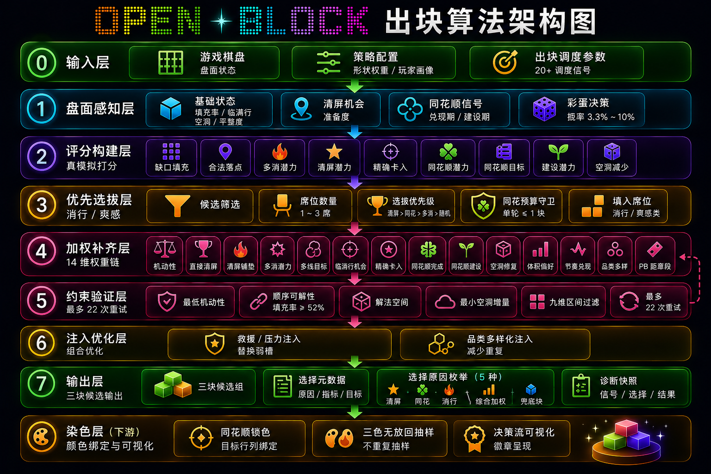

# 自适应出块引擎：10 信号融合 + 爽感兑现

> 本文描述 OpenBlock 的自适应出块（Adaptive Spawn）系统的设计理念、架构、配置与调优指南，方便后续迭代。
>
> **配套阅读**：本文聚焦"策略层"——`stress` 是如何由多信号合成的、`spawnHints` 各字段如何被派生。
> 关于"策略层产出的 hints 如何**翻译到具体 3 个块的选择过程**"（5 阶段流水线、30+ 加权乘子、硬约束循环、实数跑步示例），
> 请阅 [出块算法：三层架构 §2.5 策略 → 出块翻译机制](./SPAWN_ALGORITHM.md#25-策略--出块翻译机制v15516)。

## 目录

- [1. 领域知识基础](#1-领域知识基础)
- [2. 系统架构](#2-系统架构)
- [3. 玩家能力画像（PlayerProfile）](#3-玩家能力画像playerprofile)
  - [3.5 stress 域口径（v1.55.17）](#35-stress-域口径v15517)
- [4. 策略候选库（10 档 Profiles）](#4-策略候选库10-档-profiles)
- [5. 自适应引擎（AdaptiveSpawn）](#5-自适应引擎adaptivespawn)
- [6. 出块提示（SpawnHints）](#6-出块提示spawnhints)
- [7. 配置参考（game\_rules.json）](#7-配置参考game_rulesjson)
- [8. 调优指南](#8-调优指南)
- [**10.8 出块算法完整流水线（v1.60.35 代码基准）**](#108-出块算法完整流水线v16035-代码基准)
  - [10.8.1 入口与上下文提取](#1081-入口与上下文提取)
  - [10.8.2 阶段 0：盘面感知](#1082-阶段-0盘面感知)
  - [10.8.3 阶段 1：全形状池评分](#1083-阶段-1全形状池评分scored-构建)
  - [10.8.4 阶段 2：Stage 1 消行优先席](#1084-阶段-2stage-1--消行优先席clearseats)
  - [10.8.5 阶段 3：Stage 2 加权补齐](#1085-阶段-3stage-2--加权补齐augmentpool)
  - [10.8.6 阶段 4：兜底](#1086-阶段-4兜底fallback)
  - [10.8.7 阶段 5：L2 特殊形状注入](#1087-阶段-5l2-特殊形状注入_tryinjectspecial)
  - [10.8.8 阶段 6：硬约束验证循环](#1088-阶段-6硬约束验证循环)
  - [10.8.9 阶段 7：输出与 DFV 标注](#1089-阶段-7输出与-dfv-标注)
  - [10.8.10 阶段 8：染色绑定](#10810-阶段-8染色绑定gamejs)
  - [10.8.11 单 dock monoFlush 不变式总览](#10811-单-dock-monoflush-不变式总览)
- [**10.9 原始信号完整清单（语义 × 计算口径）**](#109-原始信号完整清单语义--计算口径)
  - [10.9.1 盘面几何类](#1091-盘面几何类来自-gridcells-实时分析)
  - [10.9.2 玩家状态类](#1092-玩家状态类来自-playerprofile-滑动窗口计算)
  - [10.9.3 跨轮上下文类](#1093-跨轮上下文类来自-spawncontext-局内积累)
  - [10.9.4 局间历史类](#1094-局间历史类来自-localstoragedb)
  - [10.9.5 信号强度总表](#1095-信号强度总表stress-贡献量级排序)
- [11. 后续迭代方向](#11-后续迭代方向)

---

## 1. 领域知识基础

系统设计基于以下休闲游戏领域的研究成果与行业实践：

### 1.1 心流理论（Csíkszentmihályi Flow Model）

- **核心**：当「挑战」与「技能」匹配时，玩家进入忘我投入的心流状态
- **数据支撑**：自适应难度使 30 天留存提升 22%，玩家人均多玩 1 天、多打 10 局/月（2025 实证研究）
- **落地**：`flowState` 三态判定（bored / flow / anxious）→ 实时调节 stress

### 1.2 差一点效应（Near-Miss Effect）

- **核心**：差 1-2 步失败时续玩欲望最强——超过胜利和惨败（Candy Crush 心理学研究）
- **机制**：将失败重构为「距成功很近」，触发更高心率和多巴胺释放
- **落地（出块层）**：`hadRecentNearMiss` → 下轮投放消行友好块，制造「戏剧性消行」正反馈
- **落地（UI 反馈层，v1.50.1）**：`Grid.getMaxLineFill()` ≥ 0.875（整行/整列差 1 格满）且**体感很差**
  （`frustrationLevel ≥ 4` 或 `anxious` 心流叠加挫败 ≥ 2）才展示 `effect.nearMissPlace`（"再一格就消行"）；
  `clearRate ≥ 0.30` / 动量为正 / 心流顺畅任一即抑制；冷启动 12 次落子内不出；单局上限 1、间隔 ≥ 12 落子且 ≥ 30 s。
  门槛与控频集中在 `web/src/nearMissPlaceFeedback.js` 与 `shared/game_rules.json: adaptiveSpawn.nearMissPlaceFeedback`，
  19 个语言包均覆盖 `effect.nearMissPlace` 短句，不回退 zh-CN。
- **与"无路可走"语义分家（v1.49）**：当 `_handleNoMoves` 触发后会置 `_pendingNoMovesEnd` 互斥锁，
  抑制同帧 near-miss toast，并改用独立的 `effect.noMovesEnd`（"棋盘填满，再来一局！"）展示濒死安抚语，
  避免同一文案"差一点... 再冲一把！"被复用在三个完全不同的语境里。
- **触发-展示一致性（v1.51.1）**：toast hold 时长 2.8 s 远长于一次落子，纯靠"触发瞬间几何条件"
  无法保证整段展示与盘面一致。本版本加双闸门：
  - **A. placement / line binding**：`Grid.getMaxLineFillLines(0.875)` 返回所有 ≥ 阈值的 row/col 列表，
    `shouldShowNearMissPlaceFeedback` 必须验证玩家本次落子至少 1 格 `(x,y)` 落在某条 line 上才放行
    （`reason='placement_not_on_near_full_line'`），杜绝"盘面别处近满 / 本次落子与近失线无关"误触发；
  - **B. 显示期间持续校验**：`_triggerNearMissFeedback` 启动 100 ms 轮询，全局 `maxLineFill` 跌破阈值
    或目标 `targetLine.{type,index}` 不再 ≥ 阈值（被消行 / 被旋洗）→ 立刻加 `.float-near-miss--fading`
    220 ms 透明度+位移过渡提前撤回。`HOLD_MS + FADE_MS + 50 ms` 强制 remove 兜底，timer 在所有路径
    都会 `clearInterval`，不漏。

### 1.3 节奏张弛（Pacing / Tension-Release Cycles）

- **核心**：单调递增的难度让玩家倦怠；3-5 次紧张 → 1-2 次释放的周期最佳
- **类比**：音乐的副歌-间奏结构、电影的高潮-过渡节奏
- **落地**：`pacingPhase`（tension / release）按 spawn 计数周期调控

### 1.4 首局保护（First-Session Dynamics）

- **核心**：首 5 分钟连续 2 次失败 → 仅 7% 重试；有渐进引导 → 41% 留存
- **最佳首次成功率**：新手 65-75%，老手 40-50%
- **落地**：`isInOnboarding` → stress 钳制到 onboarding 档，clearGuarantee=2

### 1.5 贝叶斯快速收敛（Bayesian Player Modeling）

- **核心**：拼图游戏 5 步内即可建立可用的玩家模型（学术实测）
- **落地**：`fastConvergenceAlpha=0.35`，前 5 步比正常更快响应

### 1.6 挫败检测与回弹（Comeback / Rubber-Banding）

- **核心**：连续无消行 ≥ 4 步是流失强信号
- **落地**：`frustrationLevel` ≥ 阈值 → 降压 + clearGuarantee=2

### 1.7 认知负荷（Cognitive Load）

- **核心**：思考时间方差高 → 玩家对特定局面犹豫，认知压力大
- **落地**：`cognitiveLoad`（thinkMs 方差归一化）纳入技能计算

### 1.8 竞品参考

| 竞品 | 关键机制 |
|------|---------|
| Block Blast | 3000-4000 分难度阶跃；板面密度高时投放 L/T/Z 制造压力 |
| Woodoku/1010 | AND-OR 树验证三连块可解；避免不公平死局 |
| Candy Crush | 差一点效应最大化；变长奖励间隔维持多巴胺循环 |

---

## 2. 系统架构

```
┌─────────────────────────────────────────────────────────────────────────┐
│                        game.js（信号采集层）                             │
│  recordSpawn() → recordPlace(cleared, lines, fill) → recordMiss()      │
│  recordNewGame()                                                        │
└────────────────────────────┬────────────────────────────────────────────┘
                             ▼
┌─────────────────────────────────────────────────────────────────────────┐
│               playerProfile.js（能力画像层）                             │
│                                                                         │
│  ┌─ 能力维度 ──────────┐  ┌─ 实时状态 ──────────────────────────┐      │
│  │ skillLevel    0~1   │  │ flowState    bored / flow / anxious │      │
│  │ momentum     -1~1   │  │ pacingPhase  tension / release      │      │
│  │ cognitiveLoad 0~1   │  │ frustrationLevel  连续未消行步数     │      │
│  │ engagementAPM  APM  │  │ hadRecentNearMiss  差一点标志       │      │
│  │ clearRate/comboRate  │  │ isNewPlayer / isInOnboarding        │      │
│  └─────────────────────┘  │ sessionPhase  early / peak / late   │      │
│                           └─────────────────────────────────────┘      │
└────────────────────────────┬────────────────────────────────────────────┘
                             ▼
┌─────────────────────────────────────────────────────────────────────────┐
│              adaptiveSpawn.js（策略引擎层）                               │
│                                                                         │
│  10+ 信号融合：                                                         │
│    difficultyBias + scoreStress + skillAdjust + abilityRiskAdjust      │
│    + flowAdjust + pacingAdjust + topologyPressure + sessionArcAdjust   │
│    + recoveryAdjust + frustrationRelief + comboReward + nearMissAdjust │
│                                                                         │
│  爽感兑现：                                                             │
│    skillLevel + flowState + momentum + nearFullLines + pcSetup         │
│    → delightBoost / perfectClearBoost / iconBonusTarget / delightMode  │
│                                                                         │
│  特殊覆写：新手保护 / 差一点放大                                         │
│                                                                         │
│  输出：shapeWeights（10 档插值）+ spawnHints + V3 共享上下文信号          │
└────────────────────────────┬────────────────────────────────────────────┘
                             ▼
┌─────────────────────────────────────────────────────────────────────────┐
│              blockSpawn.js（出块执行层）                                  │
│                                                                         │
│  spawnHints 消费：                                                      │
│    clearGuarantee  → 三连块中至少 N 个能触发即时消行                     │
│    sizePreference  → 偏小块(-1) / 中性(0) / 偏大块(+1)                 │
│    diversityBoost  → 惩罚同品类重复，增加三连块形状多样性                │
│                                                                         │
│  不变量保持：solvability 检查 + minMobility 门槛                        │
└─────────────────────────────────────────────────────────────────────────┘
```

### 文件清单

| 文件 | 层级 | 职责 |
|------|------|------|
| `shared/game_rules.json` | 配置 | 10 档策略权重、节奏参数、参与度参数、心流阈值、爽感兑现参数 |
| `web/src/playerProfile.js` | 画像 | 滑动窗口行为追踪、多维技能计算、状态判定、持久化 |
| `web/src/adaptiveSpawn.js` | 引擎 | 10 信号融合 → stress → 10 档插值 + spawnHints |
| `web/src/bot/blockSpawn.js` | 执行 | 接受 spawnHints，生成三连块（保持 solvability 不变量） |
| `web/src/difficulty.js` | 基础 | 原有 score→stress 映射（被自适应引擎内部调用） |
| `web/src/game.js` | 集成 | 事件采集 + 调用入口 |
| `web/src/spawnModel.js` | 生成式 | 构造启发式/V3 共享上下文，调用 SpawnTransformerV3，并管理 `rule` / `model-v3` 模式 |

---

## 3. 玩家能力画像（PlayerProfile）

### 3.1 数据录入接口

| 方法 | 调用时机 | 采集信息 |
|------|---------|---------|
| `recordSpawn()` | 每轮出块时 | 更新 lastActionTs、spawnCounter |
| `recordPickup()` | 玩家激活候选块（`Game.startDrag` 入口） | 更新 `_pickupAt`，下一次 place/miss 与之相减得 `pickToPlaceMs`（v1.46） |
| `recordPlace(cleared, lines, fill)` | 成功放置后 | thinkMs、**pickToPlaceMs**、消行结果、板面填充率 |
| `recordMiss()` | 拖放失败时 | thinkMs、**pickToPlaceMs**（拖出有效区也算反应代价）、失误计数 |
| `recordNewGame()` | 新局开始 | 重置局内计数器、累加终身局数 |

### 3.2 能力维度

| 维度 | 范围 | 计算方式 | 意义 |
|------|------|---------|------|
| `skillLevel` | 0~1 | 5 维加权合成 + 指数平滑 | 综合技能水平 |
| `momentum` | -1~1 | 窗口前后半 clearRate 差 | 表现趋势（上升/下滑） |
| `cognitiveLoad` | 0~1 | thinkMs 方差 / 阈值 | 认知压力 |
| `engagementAPM` | >0 | 窗口内操作数 / 时间 | 参与活跃度 |
| `clearRate` | 0~1 | 消行次数 / 放置总数 | 消行能力 |
| `comboRate` | 0~1 | 多行消行 / 总消行 | 组合规划力 |
| `missRate` | 0~1 | 失误次数 / 总操作 | 操作精度 |
| `metrics.thinkMs` | ms | 上一动作 → 落子的窗口均值 | 决策耗时（含等系统出块/观察/选块/拖动） |
| `metrics.pickToPlaceMs` | ms / null | startDrag → 落子的窗口均值（剔除观察） | **反应**（v1.46）：纯执行段，反映临场操作熟练度与犹豫 |
| `metrics.reactionSamples` | int ≥ 0 | 窗口内含 pickup 链路的有效样本数 | < `reactionAdjust.minSamples` 时反应信号不参与 stress |

#### skillLevel 计算公式

```
rawSkill = thinkScore × 0.15 + clearScore × 0.30 + comboScore × 0.20
         + missScore × 0.20 + loadScore × 0.15

smoothSkill += α × (rawSkill - smoothSkill)
```

- 前 5 步 α = 0.35（贝叶斯快速收敛）
- 之后 α = 0.15（稳态平滑）

### 3.3 实时状态信号

| 信号 | 类型 | 判定规则 | 对出块的影响 |
|------|------|---------|-------------|
| `flowState` | enum | thinkMs / clearRate / missRate / cognitiveLoad 多条件 | bored→加压, anxious→减压 |
| `pacingPhase` | enum | spawnCounter % cycleLength | tension→微加压, release→减压 |
| `frustrationLevel` | int | 连续未消行步数 | ≥ 4 → 挫败救济 |
| `hadRecentNearMiss` | bool | 上步 fill>0.6 且未消行 | true → 降压 + clearGuarantee=2 |
| `needsRecovery` | bool | fill > 0.82 时激活，持续 4 步 | true → 降压 + 偏小块 |
| `isInOnboarding` | bool | 新玩家 + 前 5 轮 spawn | true → stress 钳制到 -0.15 |
| `sessionPhase` | enum | 经过时间 + spawnCounter | early/peak/late 影响策略微调 |

### 3.4 持久化

- 存储位置：`localStorage` key = `openblock_player_profile`
- 跨局保留：`smoothSkill`、`totalLifetimePlacements`、`totalLifetimeGames`
- 衰减机制：超过 24 小时不玩，技能估计向 0.5 衰减（最多 50%），防止久别玩家难度不匹配
- 局内状态（moves 窗口、计数器等）不持久化，每局重建

### 3.5 stress 域口径（v1.55.17）

**对外归一化 [0, 1]，对内保持 raw [-0.2, 1]，**两侧通过 `(raw + 0.2) / 1.2` 一次线性变换互转。

#### 背景

历史上 stress 标量值域是 `[-0.2, 1]`，由 17 个带符号分量（如 `scoreStress`、`flowAdjust`、`recoveryAdjust`、…）求和后 clamp 而成。**但这个值域对外不直观**：
- 玩家面板 / 运营看板 / 策略卡 / DFV / 文档读者看到 `stress = -0.20` 时无法即刻理解"这是被压到最低还是某种异常"；
- 心智模型上"压力指数"普遍认为应为 `[0, 1]`。

#### 决策（B-Clean）

| 维度 | 对外（玩家面板 / DFV / 策略卡 / 文档 / `_adaptiveStress` / `insight.stress`） | 对内（算法源码阈值 / `stressBreakdown.finalStress` / `prevAdaptiveStress` / ML 特征） |
|------|----------------------------------------------------------|--------------------------------------------------------------------|
| 值域 | **`[0, 1]`** 归一化（v1.55.17 起）                           | `[-0.2, 1]` raw（保持不变）                                          |
| 字段名 | `layered._adaptiveStress`、`insight.stress`                | `layered._adaptiveStressRaw`、`stressBreakdown.finalStress`        |
| 数学 | `norm = clamp01((raw + 0.2) / 1.2)`                       | 算法内部 17 个 adjust 求和、25+ 比较阈值、profile 锚点、`lifecycle cap` 表、`game_rules.json` 一律保留 raw |

源码内部所有 `if (stress < 0.7)`、`Math.min(stress, 0.85)`、`flowPayoffStressCap = 0.79` 等阈值**保留 raw 写法**，行内加 "raw 0.7 ≈ norm 0.75" 提示，避免代数变换带来的大量"丑数字"（如 `0.0417`、`0.5833`、`0.8333`）破坏调参直觉与训练时特征分布。

#### 常用锚点对照

| 语义 | raw（内部） | norm（对外） |
|------|------------|-------------|
| 完全减压（onboarding profile） | `-0.20` | `0` |
| baseline / 中性（无任何 adjust） | `0` | `≈ 0.1667`（即 `1/6`） |
| `comfort` profile | `0` | `≈ 0.1667` |
| `balanced` profile（心流核心） | `0.4` | `0.5` |
| `_stressTarget` 中性锚 | `0.325` | `≈ 0.4375` |
| `variety` profile | `0.5` | `≈ 0.5833` |
| `challenge` profile | `0.65` | `≈ 0.7083` |
| `challengeBoost` 饱和门槛 | `0.7` | `0.75` |
| `flowPayoffStressCap`（兑现窗口硬顶） | `0.79` | `0.825` |
| `challengeBoost` 上限 | `0.85` | `0.875` |
| `intense` profile | `0.85` | `0.875` |
| 全局硬顶 | `1.0` | `1.0` |

#### stressMeter 6 档（v1.55.17 起按 norm 域划分）

| 档位 | norm 区间 | raw 等价区间 |
|------|----------|-------------|
| `calm`（放松） | `[-∞, 0.125)` | `[-∞, -0.05)` |
| `easy`（舒缓） | `[0.125, 0.333)` | `[-0.05, 0.20)` |
| `flow`（心流） | `[0.333, 0.542)` | `[0.20, 0.45)` |
| `engaged`（投入） | `[0.542, 0.708)` | `[0.45, 0.65)` |
| `tense`（紧张） | `[0.708, 0.833)` | `[0.65, 0.80)` |
| `intense`（高压） | `[0.833, ∞)` | `[0.80, ∞)` |

#### 例外（继续使用 raw 域的下游）

| 下游 | 字段 | 原因 |
|------|------|------|
| `game.js _spawnContext.prevAdaptiveStress` | raw `[-0.2, 1]` | `adaptiveSpawn.smoothStress(current, ctx, ...)` 的 `current` 是 raw 域，写入与读取必须同单位，否则 `maxStepUp/Down` 步长被错误压缩 |
| `spawnModel.js` ML 特征 `[20-23]` `a.stressRaw` | raw `[-0.2, 1]` | SpawnTransformerV3 模型权重按 raw 训练，norm 域会破坏特征分布尺度 |
| `spawnModel.computeSpawnTargetDifficulty` 公式 `0.15 * stress` | raw | 系数按 raw 域校准（早期回归），切到 norm 会改变量纲 |
| `stressBreakdown.finalStress` | raw | 调试 / 回放 / 训练数据落盘字段，与 17 个 `*Adjust` 同口径便于审计 |

实现位置：`web/src/adaptiveSpawn.js` 顶部 `normalizeStress / denormalizeStress` 函数（导出）；常量 `STRESS_NORM_OFFSET = 0.2`、`STRESS_NORM_SCALE = 1.2`；契约测试 `tests/stressNormalization.test.js`。小程序平行实现：`miniprogram/core/adaptiveSpawn.js` 同步导出。

#### stress 感知化层 4 档反馈渠道（v1.57）

> **背景**：v1.55~v1.56 算法层做了大量 stress 精算（lifecycle cap / occupancyDamping / smoothStress / flowPayoffCap / challengeBoost / pbOvershootBoost 等），但用户反馈 "stress 指标不太能体现到玩家感受上来"。审计发现 5 个本可承载 stress 感知的渠道（HUD/视觉/音效/震动/出块）中只有"出块"生效，其余 4 个全部断层。v1.57 通过 `stressAmbience.js` 系统补全玩家感知通道。详见 `docs/player/BEST_SCORE_CHASE_STRATEGY.md` §5.α.11。

| 档位 | 渠道 | 技术实现 | 玩家体感 |
|------|------|----------|----------|
| **A** | 棋盘氛围光 | `#game-wrapper::before` outer box-shadow 颜色随 `--stress-ambience-glow` 6 档变化（冷青→暗红） | 棋盘外缘色相潜意识感知 |
| **B** | 呼吸节奏 | `--stress-ambience-breath-ms` 驱动 keyframe 周期（`[1500, 4200]` ms 6 档） | 低 stress 4.2s 缓慢 / 高 stress 1.5s 急促 |
| **C** | 消行震动幅度 | 装饰 `renderer.setShake`，intensity × `_stressShakeMultiplier` (`[0.85, 1.30]`) | 高压震感更强 / 低压轻柔 |
| **D** | 音频低通滤波 | BiquadFilter 插入 `audioFx.master → destination`，cutoff `[4000, 14000]` Hz | 高压时 BGM/音效"闷" / 低压明亮 |

阈值与 stressMeter.STRESS_LEVELS 严格同源（单一真理源）；契约测试 `tests/stressAmbience.test.js`（43 用例）。

**严格护栏（v1.56.3 策略隐性原则）**：
- 不向主 HUD 暴露 stress 数字/标签（stressMeter 仍只在 insightPanel 内）
- `stressAmbience.js` 不导出任何 `render*` / `show*` / `*Label` / `*Text` 函数（契约测试白名单）
- 不写 textContent / innerHTML（所有反馈通过 CSS 变量 / 装饰器 / 音频参数）
- `prefers-reduced-motion` 关闭呼吸动画 / `:root.quality-low` 关闭氛围光（降级路径）

#### stress → 出块算法的 5 条传导路径与 v1.57.1 精算细化

> v1.57 §5.α.11 解决了"玩家显性感知"，但 stress 在算法层的传导仍有台阶感。v1.57.1 对 5 条传导路径做精算细化。详见 `docs/player/BEST_SCORE_CHASE_STRATEGY.md` §5.α.12。

| 传导路径 | 实现位置 | 状态 |
|---------|---------|------|
| **A. profile 插值** | `interpolateProfileWeights(profiles, stress)` — 在 10 档 profile 间连续插值 shapeWeights | ✅ 平滑 |
| **B. spawnTargets 投影** | `deriveSpawnTargets(stress)` — 投影到 6 轴目标（shapeComplexity / solutionSpacePressure / clearOpportunity / spatialPressure / payoffIntensity / novelty） | ✅ 平滑 |
| **C. targetSolutionRange 软过滤** | `solutionDifficulty.ranges` 按 stress 选区间，blockSpawn 在三连块通过 sequentiallySolvable 后用 DFS 估算解叶子数软过滤 | ⚠️ v1.57.1 P1 新增 '渐紧' 档（minStress=0.5, max=64）填补 0.5~0.6 断档；v1.57.2 在此轴之外新增 **targetHoleIncrement 第二维度**（详见下文）|
| **D. orderRigor 顺序刚性** | `stressTerm` 控制 `orderRigor`，进而决定 `orderMaxValidPerms` ∈ [2, 4] 软过滤 | ⚠️ v1.57.1 P0 改用 softplus ramp（smoothness=0.08）消除 0.55 跨阈值台阶；P2 D4 高 stress 强锁死（+0.25 boost） |
| **E. spawnIntent 离散意图** | 6 档枚举（relief/engage/harvest/pressure/flow/maintain），决定 hints 套装与 stressMeter 叙事 | ⚠️ v1.57.1 P3 新增 'sprint' 中间档（stress ∈ [0.45, 0.55)）平滑 maintain → pressure 过渡 |

##### P0 orderRigor softplus 公式

```
旧:  stressTerm = max(0, stress - threshold) * orderScale         // 一阶不连续
新:  stressTerm = softplus((stress - threshold) / smoothness)
                * smoothness * orderScale                          // 一阶可导
```

其中 `softplus(x) = ln(1 + e^x)`；smoothness=0.08 让 threshold ± 0.16 范围内平滑过渡，远离 threshold 时与旧公式渐近一致（高 stress 段强约束效果不变）。

数值对照（threshold=0.55, orderScale=1.6）：

| stress | 旧 stressTerm | 新 stressTerm |
|--------|--------------|--------------|
| 0.40   | 0            | 0.018        |
| 0.55   | 0            | 0.089        |
| 0.70   | 0.240        | 0.258        |
| 0.85   | 0.480        | 0.484        |

##### P2 D4 段双重 boost 设计

```
弱档 orderBoostInD4=0.08          : pbOvershootActive=true（任意 stress）
强档 orderBoostInD4HighStress=0.25 : pbOvershootActive=true AND stress ≥ 0.85
```

弱档+强档累加（`pbExtremeOrderBoost = max(0.08)` + `pbOvershootOrderBoost = 0.25`）让 orderRigor 总和 ≥ 0.55 → `maxValidPerms = round(4 - 2 * orderRigor) ≤ 2`，顺序刚性彻底锁死。

##### P3 sprint 优先级链

```
relief > engage > harvest > pressure > sprint > flow > maintain
```

- sprint 低于 pressure：challengeBoost > 0 时仍走 pressure
- sprint 高于 flow / maintain：避免 stress=0.5 落入"看起来比较轻松"误导叙事
- sprint hints：`sizePreference +0.10` / `multiClearBonus ≥ 0.40` / `clearGuarantee` 维持不削减

##### 配置位置

| 配置 | 路径 | 默认值 |
|------|------|--------|
| P0 softplus smoothness | `adaptiveSpawn.topologyDifficulty.orderRigorStressSmoothness` | 0.08 |
| P1 sprint solutionRange 档 | `adaptiveSpawn.solutionDifficulty.ranges[3]`（minStress=0.5, label="渐紧", min=1, max=64） | — |
| P2 D4 强锁死 boost | `adaptiveSpawn.pbChase.overshoot.orderBoostInD4HighStress` | 0.25 |
| P2 D4 高 stress 阈值 | `adaptiveSpawn.pbChase.overshoot.orderHighStressMin` | 0.85 |
| P3 sprint intent | `adaptiveSpawn.sprintIntent`（enabled / minStress / maxStress / sizePreferenceShift / multiClearBonusFloor） | true / 0.45 / 0.55 / 0.10 / 0.40 |

契约测试：`tests/adaptiveSpawnV1571.test.js`（19 用例）。

##### 与 v1.57 感知化层的协同（玩家体感双闭环）

| stress 区间 | §5.α.11 感官反馈（显性） | §5.α.12 算法精算（潜意识） |
|------------|------------------------|--------------------------|
| [0.45, 0.55) | 氛围光 flow→engaged；呼吸 3.0s→2.4s | spawnIntent='sprint'；solutionRange max=64 |
| [0.55, 0.85) | 氛围光 tense；呼吸 1.9s；震动 ×1.20；音频低通 5.5kHz | orderRigor softplus 平滑上升；spawnIntent='pressure'；solutionRange max=32 |
| ≥ 0.85 + D4 | 氛围光 intense；呼吸 1.5s；震动 ×1.30；音频低通 4.0kHz | orderRigor + pbOvershootOrderBoost=0.25 → maxValidPerms=2；solutionRange max=12 |

#### v1.57.2 第二维度：targetHoleIncrement（空洞强迫度）

> 在 `targetSolutionRange`（解空间宽度）之外新增 `targetHoleIncrement`（最干净放法的新空洞数），形成"解空间宽度 × 空洞强迫度"双轴 stress 投射。详见 `docs/player/BEST_SCORE_CHASE_STRATEGY.md` §5.α.13。

##### 算法核心

```
function dfsCountSolutions(grid, perm, depth, accum, budget):
    if depth >= 3:                              // 叶子节点
        accum.count++
        after = countIsolatedHoles(grid)        // O(n²×4)≈256 ops
        delta = max(0, after - accum.baseHoles) // 消行净降 → 0
        accum.minHoleIncrement = min(accum.minHoleIncrement, delta)
        return
```

`evaluateTripletSolutions` 返回值新增 `minHoleIncrement` / `meanHoleIncrement`。

##### 为什么选"孤立空格"作 hole 口径

| 候选口径 | 性能 | OpenBlock 语义 | 选用 |
|---------|------|-------------|------|
| Tetris stacking | O(n²) | ✗ OpenBlock 无重力，"被上方堵住"非物理 hole | 否 |
| `countUnfillableCells` | O(shapes × n²) ≈ 16k ops | ✓ 严谨 | 否——DFS 内 16k × 64 leaves × 22 attempts ≈ 22M ops/spawn 太重 |
| **孤立空格（四面非空）** | O(n²×4) ≈ 256 ops | ✓ 玩家心智里的"漏洞"——必须 1×1 才能填 | **是** |

##### `holeIncrement.ranges` 档位（与 P1 锚点对齐）

| stress | label | minIncrement | maxIncrement | 设计意图 |
|--------|------|-------------|-------------|---------|
| [-1.0, 0.35) | 干净 | null | **0** | 必有 0 新空洞解 |
| [0.35, 0.5) | 宽容 | null | **1** | 允许至多 1 新空洞 |
| [0.5, 0.6) | 渐紧 | null | **2** | 允许至多 2 新空洞 |
| [0.6, 0.8) | 紧张 | **1** | null | 强迫至少 1 新空洞 |
| [0.8, 1.0] | 极限 | **2** | null | 强迫至少 2 新空洞（D4 段透出生命周期）|

##### blockSpawn 软过滤分支

```javascript
if (earlyAttempt && targetHoleIncrement && !solutionMetrics.truncated) {
    const minInc = solutionMetrics.minHoleIncrement;
    if (Number.isFinite(minInc)) {
        if (targetHoleIncrement.max != null && minInc > targetHoleIncrement.max) {
            diagnostics.solutionRejects.holeTooMany++;  continue;
        }
        if (targetHoleIncrement.min != null && minInc < targetHoleIncrement.min) {
            diagnostics.solutionRejects.holeTooClean++; continue;
        }
    }
}
```

- 与 `targetSolutionRange` 同窗口（`attempt < 60% × MAX_SPAWN_ATTEMPTS`）；宽松阶段 fallback 保证 spawn 不死锁
- `truncated=true` / `minHoleIncrement === Infinity` 跳过过滤
- diagnostics 新增 `solutionRejects.holeTooMany` / `holeTooClean` 字段

##### 双轴矩阵

| stress | targetSolutionRange | targetHoleIncrement | 玩家体感 |
|--------|-------------------|---------------------|---------|
| 0.0 | 解 ≥ 4 | 新空洞 ≤ 0 | 多种放法 + 都干净 |
| 0.4 | 解 ≥ 2 | 新空洞 ≤ 1 | 还有得选 + 可能吞 1 洞 |
| 0.55 | 解 ≤ 64 | 新空洞 ≤ 2 | 解数受限 + 接受 2 洞 |
| 0.7 | 解 ≤ 32 | 新空洞 ≥ 1 | 解数少 + **必须**吞 1 洞 |
| 0.9 | 解 ≤ 12 | 新空洞 ≥ 2 | 解数极少 + **必须**吞 2 洞 |

两轴对玩家是独立可感的两个难度信号——宽度变化 = "我没几种选了"（认知收窄），强迫度变化 = "怎么放都得带漏洞"（结构焦虑）。

##### 配置位置 + 测试

| 配置 | 路径 | 默认值 |
|------|------|--------|
| ranges 数组 | `adaptiveSpawn.solutionDifficulty.holeIncrement.ranges` | 5 档（干净/宽容/渐紧/紧张/极限） |
| enabled 开关 | `adaptiveSpawn.solutionDifficulty.holeIncrement.enabled` | true |

契约测试：`tests/holeIncrementFilter.test.js`（15 用例）。

##### 三层协同（v1.57 → v1.57.1 → v1.57.2）

| 玩家体验感 | §5.α.11 感官（显性）| §5.α.12 算法（潜意识）| §5.α.13 算法（潜意识）|
|----------|------------------|-------------------|-------------------|
| 心流期（0.2~0.45）| 氛围光绿、呼吸缓慢 | spawnIntent='maintain'；解空间宽 | 必有干净解（max=0）|
| 渐紧期（0.45~0.55）| 氛围光暖琥珀、呼吸 2.4s | spawnIntent='sprint'；max=64 | 允许 ≤2 新空洞（"渐紧"）|
| 高压期（0.55~0.85）| 氛围光橙红、震动 ×1.20 | spawnIntent='pressure'；max=32 | 强迫 ≥1 新空洞（"紧张"）|
| 极限期（≥0.85，D4）| 氛围光深红、音频 4kHz | orderRigor+0.25 → maxValidPerms=2 | 强迫 ≥2 新空洞（"极限"）|

#### v1.57.3 多轴扩展：9 维 stress→算法 难度投射

> 在 v1.57.2 双轴（`targetSolutionRange` × `targetHoleIncrement`）之外，再引入 9 个 O(n²) 廉价度量，把 stress 投射从 2 轴扩展到 **11 轴**。设计动机：v1.57.2 双轴的过滤约束在中段 stress（0.4~0.6）不够锐利，玩家从 D1 跳到 D2 的"压迫感"切换不显著。详见 `docs/player/BEST_SCORE_CHASE_STRATEGY.md` §5.α.14。

##### 9 维全景

| # | `spawnHints.target*` | 玩家心智轴 | DFS 内代价 | 配置子节 |
|---|---|---|---|---|
| ① | `targetMaxHoleIncrement` | 专注度税上界（"随便放也能干净 vs 必须专心"）| O(n²×4)/叶子 | `solutionDifficulty.maxHoleIncrement` |
| ② | `targetEndFillRatio` | 空间窒息感（剩余决策窗口收窄）| O(n²)/叶子 | `endFillRatio` |
| ③ | `targetNearFullDelta` | 消行节律（rhythmPhase 直接注入 spawn 算法）| O(n²×2)/叶子 | `nearFullDelta` |
| ④ | `targetFirstMoveSurvivorRatio` | 试错代价（第一手必须想清楚）| DFS root 标记 | `firstMoveSurvivor` |
| ⑤ | `targetSolutionDiversity` | 解多样性陷阱（perPermCounts CV）| 零成本 | `solutionDiversity` |
| ⑥ | `targetEndFlatness` | 凹凸审美焦虑（列高方差）| O(n²)/叶子 | `endFlatness` |
| ⑦ | `targetEndDangerColumns` | 爆顶预警（接近 game over 信号）| O(n²)/叶子 | `endDangerColumns` |
| ⑧ | `targetVisualClutter` | 颜色边界审美（花花绿绿 vs 聚团）| O(n²×2)/叶子 | `visualClutter` |
| ⑨ | `targetHoleIncrementGap` | 专注度税差距 max−min（"专心则过、走神则崩"）| 零成本 | `holeIncrementGap` |

总代价：~6 个 O(n²) 调用 × 64 叶子 ≈ 25k ops/triplet（DFS 入栈相比 leafCap 自身代价完全可忽略）。base 度量在评估开始一次性计算，DFS 内只算 delta/绝对值。

##### 关键设计决策

| 决策 | 原因 |
|---|---|
| 单边强约束 / 单边宽松 | 低 stress 段 max 强约束（保护玩家）/ 高 stress 段 min 强约束（强迫面对压力源）；避免双边过严导致 spawn 失败率飙升 |
| 9 维彼此独立、不重叠 | ①⑨ 都和"空洞"相关但语义独立——`targetHoleIncrement.min` 是最优解脏度下限、`targetMaxHoleIncrement.min` 是最差解脏度下限、`targetHoleIncrementGap.min` 是 max-min 差距 |
| 廉价度量优先 | **不用**：`countUnfillableCells` (O(shapes×n²) 太重)、真正的 lookahead spawning (O(shapes³) 不可行)、颜色饱和度等需外部模型的指标 |
| 策略仍然隐性 | 9 维全部只在 `playerInsightPanel` 诊断视图展示数值；主 HUD 只有出块本身 |
| 与 v1.57.2 共享 stress | 9 维派生器全部使用 `solutionStress`，保证多轴对 stress 单调一致 |
| 共享 activationFill 守卫 | 各维度全部走 `solutionDifficulty.activationFill = 0.45` 整体启用阈值 |

##### diagnostics 透传

| 字段 | 位置 | 内容 |
|---|---|---|
| `_target{Max,Gap,Fill,Near,Survivor,Diversity,Flat,Danger,Clutter}` | adaptive 顶层 | `{min, max, label}` 或 null |
| `spawnHints.target*` | adaptive.spawnHints | 同上（供 blockSpawn 消费）|
| `layer1.target*` | blockSpawn diagnostics | 透传上游 hints |
| `solutionRejects.{maxHoleTooMany, maxHoleTooClean, holeGapTooNarrow, holeGapTooWide, fillTooHigh, fillTooLow, nearFullDeltaTooHigh, nearFullDeltaTooLow, survivorTooHigh, survivorTooLow, diversityTooHigh, diversityTooLow, flatnessTooHigh, flatnessTooLow, dangerColsTooHigh, dangerColsTooLow, clutterTooHigh, clutterTooLow}` | blockSpawn diagnostics | 18 个新计数器（9 维 × min/max 2 侧）|

##### 四层协同（升级版）

v1.57.3 之后 stress → 4 个独立可感维度：

| 玩家体验感 | §5.α.11 感官 | §5.α.12 算法 | §5.α.13 算法 | §5.α.14 算法（v1.57.3 新增） |
|----------|-----------|----------|-----------|-----------|
| 心流期（0.2~0.45）| 氛围光绿、呼吸缓慢 | spawnIntent=maintain | 必有干净解（max=0）| `endFillRatio≤0.45 / nearFullDelta≥0.5 / survivor≥0.6 / dangerCol≤2 / flatness≤2 / clutter≤2` |
| 渐紧期（0.45~0.55）| 氛围光暖琥珀 | spawnIntent=sprint | 允许 ≤2 新空洞 | 中性（多数维度不激活）|
| 高压期（0.55~0.85）| 氛围光橙红、震动 ×1.20 | spawnIntent=pressure | 强迫 ≥1 新空洞 | `maxHole≥1 / fill≥0.50 / nearFullDelta≤0.5 / survivor≤0.7 / flatness≥3 / dangerCol≥1` |
| 极限期（≥0.85，D4）| 氛围光深红 | orderRigor+0.25 | 强迫 ≥2 新空洞 | `maxHole≥2 / gap≥3 / fill≥0.65 / nearFullDelta≤-0.5 / survivor≤0.5 / dangerCol≥2 / clutter≥2` |

契约测试：`tests/spawnDimensionalStress.test.js`（18 用例）。

#### v1.57.4 决策快照增量刷新：消除 DFV / stressMeter 文案与盘面的"快照滞后"

> 用户反馈：DFV 显示"盘面具备消行机会"、stressMeter 显示"识别到密集消行机会"，但截图盘面占用 25%、近满数为 0——明显与盘面不符。
>
> 根因：`_lastAdaptiveInsight.spawnIntent` 与 `_lastAdaptiveInsight.spawnDiagnostics.layer1` 是 `spawnBlocks()` 调用时的"决策快照"，而 `spawnBlocks` 只在 dock 三块全部消化后触发。玩家在 dock 周期内的放置 / 消行不会刷新这两个字段，所有基于 insight 的展示文案（DFV reason / stressMeter buildStoryLine / HARVEST_NARRATIVE_BY_DENSITY）都会读到过期的几何信号。

##### 修复架构

| 层 | 改动 | 文件 |
|---|---|---|
| **逻辑抽取** | `deriveSpawnIntent({ playerDistress, forceReliefIntent, afkEngageActive, challengeBoost, delightMode, rhythmPhase, stress, sprintCfg, geometry, pcSetupMinFill })` 纯函数 —— 让 `resolveAdaptiveStrategy` 与 game 层 `_refreshIntentSnapshot` 共用同一套优先级（relief→engage→harvest→pressure→sprint→flow→maintain）| `web/src/adaptiveSpawn.js` |
| **几何快照** | `snapshotInsightGeometry(grid, dockShapePool)` 函数 —— 返回 `{ fill, holes, nearFullLines, multiClearCandidates, pcSetup }`，复用 `analyzeBoardTopology` + `_countMultiClearCandidatesFromShapePool` + `analyzePerfectClearSetup`；总成本 ~3 倍 O(n²)，远低于每帧渲染开销 | `web/src/adaptiveSpawn.js` |
| **次发缺陷修复** | `_mergeLiveGeometrySignals` 补 `pcSetup` 实时重算 —— 旧实现只刷新 `nearFullLines` / `multiClearCandidates`，pcSetup 残留快照会让 17% 散布盘面消行后仍命中 `pcSetup ≥ 1 && fill ≥ 0.45` 分支 | `web/src/adaptiveSpawn.js` |
| **决策侧缓存** | `resolveAdaptiveStrategy` 返回值新增 `_intentInputs`（含 9 个决策侧不变量），`_captureAdaptiveInsight` 落到 `_lastAdaptiveInsight._intentInputs` 供 game 层增量重判时复用 | `web/src/adaptiveSpawn.js` + `web/src/game.js` |
| **增量刷新入口** | game.js 新增 `_refreshIntentSnapshot()`，在两处调用：(1) `_handlePlace` 内 `grid.place` 之后；(2) `playClearEffect.animate` 末尾、`spawnBlocks` 之前 | `web/src/game.js` |

##### 刷新字段边界（重要约束）

| 字段 | 是否刷新 | 原因 |
|---|---|---|
| `spawnIntent` / `spawnHints.spawnIntent` | ✅ 增量重判 | 是 DFV / stressMeter 直接读的"对外口径"，必须与玩家盘面同步 |
| `spawnDiagnostics.layer1.{fill, holes, nearFullLines, multiClearCandidates, pcSetup}` | ✅ 实时快照 | stressMeter `buildStoryLine` 的 geometry 入参 + DFV 几何 chip 读取源 |
| `spawnHints.{sizePreference, clearGuarantee, targetSolutionRange, targetHoleIncrement, target*9 维}` | ❌ 不刷新 | 描述【已经出在 dock 里的三块】是按什么策略生成的，玩家放置不改变它——刷新等于撒谎"这批块是按新意图生成的" |
| `stress` / `stressBreakdown` / `pacingPhase` / `delightMode` / `sessionArc` | ❌ 不刷新 | 这些是 spawn 决策时刻的"心情"快照，需要在下一次 `spawnBlocks()` 时整体重算（避免心情维度的回灌 noise）|

##### 决策侧不变量与几何敏感量分离

`deriveSpawnIntent` 的入参分为两类：

- **决策侧不变量（来自 `_intentInputs`）**：`playerDistress / forceReliefIntent / afkEngageActive / challengeBoost / delightMode / rhythmPhase / stress / sprintCfg / pcSetupMinFill` —— 在 dock 周期内不变，由 spawn 时计算一次并缓存
- **几何敏感量（来自 `snapshotInsightGeometry`）**：`geometry.{nearFullLines, pcSetup, boardFill}` —— 玩家每次放置后实时刷新

这套分离让"决策意图"与"几何反映"解耦，增量重判只重算 harvestable 子条件，性能开销 ~5 µs/次。

##### 契约测试

`tests/spawnIntentSnapshot.test.js`（28 用例）：

- **A. deriveSpawnIntent 7 分支优先级**：覆盖完整优先级链与边界（sprint 区间端点）
- **B. snapshotInsightGeometry 几何正确性**：空盘 / 单近满 / 双近满 / null 保护 / 与 `analyzePerfectClearSetup` 口径一致
- **C. `_mergeLiveGeometrySignals` pcSetup 补漏**：spawn 时 ctx.pcSetup 必须来自实时 grid 重算
- **D. 集成回归**：harvest 快照 + 玩家消行 → 重判应切换；maintain 快照 + 玩家堆出近满 → 重判应升级 harvest
- **E. `_intentInputs` 契约**：`resolveAdaptiveStrategy` 返回 `_intentInputs` 含 deriveSpawnIntent 全部决策侧字段；用相同 geometry 重判结果与 `layered._spawnIntent` 一致

##### 多端同步

| 端 | deriveSpawnIntent | snapshotInsightGeometry | _mergeLiveGeometrySignals.pcSetup | _refreshIntentSnapshot |
|---|---|---|---|---|
| Web | ✅ | ✅ | ✅ | ✅（`web/src/game.js`）|
| 微信小程序 | ✅（mp 无 forceReliefIntent，与改前同行为）| ✅ | ✅ | N/A（mp 当前无 DFV / stressMeter 展示层订阅 insight）|
| Capacitor 移动端 | 复用 web 构建 | 复用 web 构建 | 复用 web 构建 | 复用 web 构建 |
| RL PyTorch | 仅消费 `spawnIntent` 作为 one-hot 训练特征，不重新派生（无需同步）|

#### v1.57.5 决策快照展示层一致性治理：6 项 UI 同源 bug 修复

> v1.57.4 已经把决策层（`spawnIntent` / `spawnDiagnostics.layer1`）做到玩家每次放置后增量刷新，但截图复盘发现 UI 展示侧还有 6 项一致性缺陷分布在 DFV / stressMeter / chip 三处。本节是 v1.57.4 的**展示层补完**，从渲染管线、文案分级、视觉降级三个维度收口。

##### 6 项 bug 与修复对应表

| # | 严重度 | 现象 | 根因 | 修复 |
|---|--------|------|------|------|
| A | P0 | DFV 左侧"占盘 0.40" vs 底部 sparkline"占盘 0.69" 同帧两值 | `_dfvFingerprint` 只看 insight + profile 决策侧字段，漏算 `liveBoardFill`/`liveClearRate`；指纹不变 → 左侧节点被去抖跳过重渲染 | `_dfvFingerprint(insight, profile, { boardFill, clearRate })` 把实时几何按 0.01 量化纳入指纹；同时让 `_refreshIntentSnapshot` 同步刷新 `insight.boardFill` 顶层字段 |
| B | P0 | spawnIntent=relief 时叙事一律"盘面通透又是兑现窗口..."，但盘面实际 fill=0.69 不通透 | relief 是 6 项 `playerDistress` 信号累加触发，文案却暗示了 friendlyBoardRelief（不在 distress 内）的几何 | `RELIEF_NARRATIVE_BY_REASON` + `classifyReliefReason(breakdown, fill)` 按 endgame / friendly / hole / boardRisk / bottleneck / frustration / default 七档分级；**friendly 档加 fill < 0.5 守卫**避免"通透"在密集盘面撒谎；`SPAWN_INTENT_NARRATIVE.relief` 默认文案收窄为中性减压语义 |
| F | P0 | DFV 左侧"消行率 —" vs 底部"消行率 0.31" 同帧两值 | 同 A 同根 —— `liveClearRate` 也漏算 | A 修复一并解决 |
| D | P1 | spawnIntent=relief 时"AFK 介入" chip 仍高亮，但 AFK 已被 relief 优先级覆盖 | DFV decision flags 只看信号本身，不看是否被当前 intent 覆盖 | chip 计算 `overriddenAfkEngage = (intent === 'relief') && afkEngage`，标记 `.dfv-flag--overridden`：CSS 半透明 + 删除线 + title 提示"信号已激活，但本帧被更高优先级意图（relief）覆盖" |
| E | P1 | DFV 调香提示同时高亮"策展紧 / 兑现 / 心流·兑现"等 6+ 项 chip 无层级 | hints 是多维独立投射，玩家会把它误解为"7 个独立决定"互相打架 | 在 hints 列表顶部插入"主导意图锚"高亮行，颜色随 intent 变化（与 SPAWN_INTENT_COLOR 同源），title 写明"下方各 chip 是当前主导意图下的多维状态描述" |
| G | P2 | stress=0.15 (😊 笑脸) + boardFill=0.69 (密集盘面)，视觉与情绪信号反差 | `getStressDisplay` 只看 stress，不看盘面实际占用 | 新增 crowded 变体：`stress < 0.333 (calm/easy)` + `boardFill ≥ 0.65` → 切到 😅 + "（盘面吃紧）" + "盘面较密..." vibe；优先级：挣扎中 > crowded > 救济中 |

##### 关键设计原则

1. **同源治理**（A/F 合并修复）：DFV 节点 / sparkline / playerInsightPanel 三处展示同一指标必须从同一个 `liveBoardFill` 源头出发，去抖指纹也要把"实时几何"维度纳入
2. **文案与几何对齐**（B）：任何含"盘面 X"几何描述的叙事都必须有 fill 守卫，避免数学正确但情绪信号撒谎
3. **视觉降级 vs 物理隐藏**（D）：被覆盖的 chip 不应直接隐藏（玩家会丢失"系统检测到了什么信号"的诊断信息），应当半透明 + 删除线表达"激活但未生效"
4. **锚点 vs 平铺**（E）：多维度 chip 列表必须有主导维度锚，避免玩家把投射当成并列决定
5. **情绪反馈反差守卫**（G）：低 stress + 高 fill 是"系统在减压但盘面其实紧"的真实矛盾，emoji 必须承认这个反差而不是单纯按 stress 笑脸

##### 契约测试

`tests/insightConsistency_v1575.test.js`（32 用例）：
- **§A/F**：DFV 指纹对 `liveBoardFill` / `liveClearRate` 敏感，0.01 级抖动量化稳定
- **§B**：`classifyReliefReason` 七档分类全覆盖，含 friendly 守卫 fill≥0.5 降级、endSessionDistress 优先级、空 breakdown 兜底；`buildStoryLine` 在 intent=relief 路径走分级文案
- **§G**：`getStressDisplay` 紧盘面 crowded 变体；优先级（挣扎中 > crowded > 救济中）
- **§D**：AFK chip overridden 判定纯逻辑契约

`tests/stressMeter.test.js` 两条 v1.23/v1.24 旧测试被更新到 v1.57.5 reason 分级新行为（不再期望返回旧"盘面通透"硬编码文案）。

##### 多端同步

| 端 | DFV 指纹 / chip 渲染 | RELIEF 分级文案 | 紧盘面 emoji 守卫 |
|---|---|---|---|
| Web | ✅ | ✅ | ✅ |
| 微信小程序 | N/A（无 DFV）| N/A（无 stressMeter）| N/A（无 stressMeter）|
| Capacitor 移动端 | 复用 web 构建 | 复用 web 构建 | 复用 web 构建 |
| RL PyTorch | N/A（仅消费 `spawnIntent`）| N/A | N/A |

---

### 3.6 决策派生层（v1.58） — UI 消费算法状态的唯一通道

**v1.58 治理目标**：把 v1.57.5 之前散布在 UI 层的"算法 → 显示"转换逻辑统一收口到新的派生层 `web/src/derivation/`，让 UI 永远只读一个 PresentationModel，杜绝 v1.57.5 §A/B/D/F/G 类"同一指标多 cache 不同步"的根因。

**架构分层**：

```
算法层（adaptiveSpawn.js）  →  derivation/  →  UI 层（DFV / stressMeter / playerInsightPanel）
                                  ↑                ↑
                                SSOT + Trace        只读 PresentationModel
                                + Contract DSL
                                + Reducer
```

**4 个派生层子模块**：

| 文件                                       | 职责                                                                                  |
| ---------------------------------------- | ----------------------------------------------------------------------------------- |
| `derivation/selectors.js`                | SSOT。所有"实时几何 / insight 字段 / playerProfile 读取"必须走 selector 函数（如 `selectLiveBoardFill(game)`） |
| `derivation/intentResolver.js`           | 表驱动 `INTENT_RULES` 优先级矩阵；返回 `{intent, trace, overrides}` 三元组                       |
| `derivation/displayContracts.js`         | 文案 / emoji / chip 契约 DSL；运行时谓词校验 + 自动降级链                                            |
| `derivation/presentationReducer.js`      | 把上面三层组合成 UI 唯一消费的 PresentationModel（含 chips + intent + narrative + emoji + trace）   |

**算法侧契约**：

- `adaptiveSpawn.deriveSpawnIntent` 仍是算法层入口（决策侧 / 旧测试 / miniprogram 镜像）
- `derivation/intentResolver.resolveIntent` 是 UI 侧入口（承载 trace + overrides）
- **行为完全等价**——由 `tests/derivationContracts.test.js §2` 9 条样例 + `tests/properties/derivationInvariants.test.js I1` 1500 次随机扫描强制锁定
- 未来 v1.58.4 计划让 `deriveSpawnIntent` 内部委托 `resolveIntent` 实现单源化

**spawnDiagnostics.layer1 与派生层的衔接**：

- v1.57.4 已让算法层在每次玩家放置后通过 `_refreshIntentSnapshot()` 增量刷新 `spawnDiagnostics.layer1.{fill, holes, nearFullLines, multiClearCandidates, pcSetup}`
- v1.58 派生层 `selectLiveGeometry(game)` **优先**读 `layer1`（已是实时值），缺失时降级到 `grid.getFillRatio()`
- `selectInsightWithLiveGeometry(game)` 把实时几何**注入 insight 顶层 boardFill + layer1**，UI 拿到的 insight 永远是最新的（即便 `_refreshIntentSnapshot` 已经隔了若干帧未再触发）

**详见**：[docs/algorithms/DECISION_DERIVATION_ARCHITECTURE.md](./DECISION_DERIVATION_ARCHITECTURE.md)。

**v1.58.1 增量**：派生层 `selectors.js` 在 `selectReducerInputs(game)` 返回的 `geometry` 上**派生新字段 `harvestReady = (nearFullLines>=1) || (multiClearCandidates>=1) || (pcSetup>=1)`**，作为"节奏类文案承诺（享受多消 / 收获期）"的几何兑现守卫。displayContracts 拆 `flow.payoff` 为 `flow.payoff.ready`（守 harvestReady=true）+ `flow.payoff.waiting`（节奏锁定但无兑现路径时诚实降级），同时 `relief.friendly` 也补加 harvestReady 守卫。性质测试 I11/I12/I12b 跨 contract 锁定"任何含'享受多消/收获期'字样的文案命中时几何必兑现"。

**v1.58.2 增量**：算法层 `forceReliefIntent = endSessionDistressActive || frustrationCritical`（adaptiveSpawn.js:2235）触发后，UI 层 emoji/narrative 也要看 **盘面几何是否确证压力**。`displayContracts` 中 `struggling.lateCollapse` / `struggling.frustCritical` / `relief.endgame` 三档统一加 `boardFill>=0.45` 守卫，盘面通透时分别 fall through 到 `concerned.softRescue.{late,frust}`（emoji 😟 "稍专注（系统已减压）"）/ `relief.endgame.soft`（"临近收尾，盘面仍从容"）——既承认算法在减压，又不撒谎"挣扎"或"接近收尾"。性质 I7（升级）/ I13 / I13b / I14 锁定。

**v1.58.3 增量**：DFV chip 表与算法层完成同源锁定。CHIP_DEFS 中 `lateCollapse` chip 的 on 函数修正为与 stressMeter / adaptiveSpawn 严格同源（`sessionPhase=late && momentum<=-0.30`，之前用 `endSessionDistress<-0.05` 近似），并加 4 个**信号诊断 chip**（`endSessionStress` / `lifecycleLateAccel` / `playerDistressFloor` / `delightModeRelief`）把其它压力链路独立信号也暴露到 DFV。每个 chip 加 `reason(ctx)` 函数，高亮时 title 自动写"触发源：<具体数值>"。同时 `presentationReducer` 派生 `conflicts` 数组（`flowVsIntent` / `pressureVsForce`）显式承认跨维度信号冲突——playerProfile.flowState（中长期）与 adaptiveSpawn.spawnIntent（即时）本就独立可对掐，UI 显式可视化比假装一致更可信。性质 I15 反向锁定"chip 表 vs 算法层 forceReliefIntent 触发条件"同源。

**v1.58.4 增量**：全系统自查 6 处残留修补——`relief.hole` 加 `holes>=1` 守卫、`relief.boardRisk` 加 `boardFill>=0.45` 守卫、`harvest.default` 兜底文案改写（去掉"密集/已识别"虚假承诺）、`flow.intense` + `flow.tense` 加几何守卫（新增 `.soft` 软降级文案）、`reducer._deriveConflicts` 加 `stressVsBoardFill` 跨维度冲突（stress 高但 boardFill 低时显式承认"算法压力来自非几何源"）。性质 I18/I19/I20/I21 锁定。

**新增算法字段时的责任清单**（v1.58 起）：

1. 在算法层（adaptiveSpawn / stress 链）正常加字段
2. 若新字段需被 UI 显示：
   - 在 `selectors.js` 加对应 `selectXxx(game)` 函数
   - 若涉及优先级（新 intent / 新 signal）：在 `intentResolver.INTENT_RULES` 加表项 + 测 `I1` 等价性
   - 若涉及文案 / emoji 守卫：在 `displayContracts.NARRATIVE_CONTRACTS` / `EMOJI_CONTRACTS` 加 contract（声明 `requires` + `fallback`）
   - 若涉及 chip：在 `presentationReducer.CHIP_DEFS` 加定义；若是覆盖类信号在 `intentResolver.SIGNAL_TO_INTENT` 加映射
3. 在 `tests/derivationContracts.test.js` 加单测、在 `tests/properties/derivationInvariants.test.js` 加性质（如果有新的一致性约束）

---

## 4. 策略候选库（10 档 Profiles）

10 档 profile 按 `stress` 值升序排列，引擎在相邻两档间做线性插值。

> **stress 列为 raw 域**（与 `game_rules.json` 配置一致，便于调参时直接对照源码），
> 对外面板与 DFV 显示请按 §3.5 表换算为 norm 域 `[0, 1]`（如 raw `0.85` ≈ norm `0.875`）。

| # | ID | stress（raw / norm） | 线条权重 | 不规则权重 | 设计意图 |
|---|-----|--------|---------|-----------|---------|
| 1 | `onboarding` | -0.20 / 0.000 | 3.0 | 0.35~0.45 | 新玩家首 5 轮：极高消行友好块，建立信心 |
| 2 | `recovery` | -0.10 / 0.083 | 2.8 | 0.5~0.6 | 板面快满：大量线条便于自救 |
| 3 | `comfort` | 0.00 / 0.167 | 2.5 | 0.65~0.75 | 低技能/挫败后：恢复信心，偶尔引入简单不规则块 |
| 4 | `momentum` | 0.10 / 0.250 | 2.4 | 0.78~0.85 | combo 后催化：偏向能串联消行的块型 |
| 5 | `guided` | 0.20 / 0.333 | 2.3 | 0.88~0.95 | 中低技能成长：逐步引入不规则块 |
| 6 | `breathing` | 0.30 / 0.417 | 2.15 | 0.95~1.0 | 紧张期后释放：给玩家喘息空间 |
| 7 | `balanced` | 0.40 / 0.500 | 2.0 | 1.12 | 心流核心区（≈ normal 策略） |
| 8 | `variety` | 0.50 / 0.583 | 1.85 | 1.15~1.2 | 防审美疲劳：拉平权重增加多样性 |
| 9 | `challenge` | 0.65 / 0.708 | 1.7 | 1.25~1.3 | 中高手进阶：不规则块明显增多 |
| 10 | `intense` | 0.85 / 0.875 | 1.45 | 1.38~1.48 | 高手极限：T/Z/L/J 权重超过线条 |

### 设计原则

1. **相邻间距不均匀**：低 stress 区间更密集（新手/挫败场景需要更细腻的调控）
2. **每档有明确的心理学目标**：不是简单的权重渐变，而是对应具体的玩家体验场景
3. **线条→不规则的渐变**：从极度消行友好到空间规划压力的连续谱

---

## 5. 自适应引擎（AdaptiveSpawn）

### 5.1 Stress 计算公式

> **域口径**：本节所有 stress 数值（包括下方公式、阈值、profile 锚点、`flowPayoffStressCap = 0.79`、`challengeBoost` 上限 `0.85` 等）均为**算法内部 raw 域** `[-0.2, 1]`，与源码一致；面板 / DFV / 策略卡显示的是经 `(raw + 0.2) / 1.2` 归一化后的 norm 域 `[0, 1]`。详见 [§3.5 stress 域口径](#35-stress-域口径v15517)。

当前实现把六类输入显式映射到 `stress` 与 `spawnHints`：

| 输入类别 | 代表字段 | 对 `stress` 的影响 | 对 `spawnHints` 的影响 |
|----------|----------|--------------------|------------------------|
| 难度模式 | `easy/normal/hard`、`difficultyTuning` | `stressBias` 调整基线，hard 提高挑战、easy 降低挑战 | `clearGuaranteeDelta`、`sizePreferenceDelta`、`multiClearBonusDelta` |
| 玩家能力 | `AbilityVector.skillScore/confidence/riskLevel/clearEfficiency/boardPlanning` | 高技能高置信可加压；高风险触发 `abilityRiskAdjust` 减压 | 高风险提高 `clearGuarantee`、偏小块；低风险高手提高多样性、多消、清屏与同 icon 兑现 |
| 实时状态 | `flowState`、`pacingPhase`、`frustrationLevel`、`needsRecovery` | bored 加压、anxious/恢复/挫败减压，release 阶段减压 | 挫败/恢复/新手保障消行，必要时偏小块 |
| 盘面拓扑 | `holes`、`nearFullLines`、`pcSetup`、`fillRatio` | 空洞压力通过 `holeReliefStress` 减压 | 清屏准备或近满线提升 `multiClearBonus`、`multiLineTarget` 和 `clearGuarantee` |
| 局内体验 | `comboChain`、`rhythmPhase`、`delightMode` | combo 表现可轻微加压，爽感模式可减压或引导 payoff | payoff 优先多消，清屏机会提高 `perfectClearBoost` |
| 局间弧线 | `totalRounds`、`runStreak`、`warmupRemaining`、`scoreMilestone` | 热身/冷却轻微减压，连战和分数档按规则加压 | 热身与里程碑提高消行保障，连续无消行进入救援 |

`spawnModel.js` 会读取同一份 `adaptiveInsight.spawnHints`、`AbilityVector` 和实时拓扑，作为 SpawnTransformerV3 的上下文输入；因此生成式与启发式看到的是同一组难度、能力和拓扑信号。

```
adaptiveStress = scoreStress           // 分数驱动（原 dynamicDifficulty）
               + runStreakStress        // 连战加成
               + skillAdjust           // (skill - 0.5) × 0.3
               + flowAdjust            // bored: +0.08 / anxious: -0.12
               + pacingAdjust          // tension: +0.04 / release: -0.12
               + recoveryAdjust        // fill > 82%: -0.2
               + frustrationRelief     // ≥ 4 步未消行: -0.18
               + comboReward           // combo ≥ 2: +0.05
               + nearMissAdjust        // 差一点: -0.1
               + boardRiskReliefAdjust // 填充/空洞/能力风险统一救济
               + delightStressAdjust   // 高技能无聊轻加压；焦虑/恢复降压
```

特殊覆写：`isInOnboarding → stress ≤ -0.15`

普通状态会通过 `adaptiveSpawn.stressSmoothing` 做轻量平滑；挫败、近失、恢复或高盘面风险等救场信号立即生效，避免"该救场时还被滞后"。最终范围：`[-0.2, 1.0]`。

**v1.16：占用率衰减（occupancyDamping）**——在 clamp 之后、smoothing 之前对正向 stress 乘 `clamp(boardFill / 0.5, 0.4, 1.0)`。低占用盘面（如 fill=0.39）的伪高压由 0.89 → ~0.69（进入 `tense` 而非 `intense`）；fill ≥ 0.5 时无衰减；负向 stress（救济）不被衰减。该项作为单独信号写入 `_stressBreakdown.occupancyDamping`，并在 `stressBreakdown.afterOccupancy` 上记录衰减后的中间值。

引擎返回 `_stressBreakdown`，包含每个分量、`rawStress`、`beforeClamp`、`afterOccupancy`、`afterSmoothing`、`finalStress` 和 `boardRisk`。面板、回放和测试可直接解释"这轮为什么加压/减压"。

**v1.16：spawnIntent 单一对外口径**——除了多档 `shapeWeights` 与连续型 `spawnHints`，引擎还输出离散 `spawnHints.spawnIntent ∈ { relief, engage, pressure, flow, harvest, maintain }`。所有"意图描述"（拟人化压力表叙事、商业化策略文案、回放标签、推送文案）必须读这一字段，不再各自从信号里推断。优先级：

1. **`relief`** — `recoveryAdjust + frustrationRelief + nearMissAdjust + holeReliefAdjust + boardRiskReliefAdjust < -0.10` 或 `delight.mode === 'relief'`
2. **`engage`** — AFK ≥1 且 `stress < 0.55` 且未触发救济（玩家停顿但状态尚可，给"显著正反馈 + 可见目标"）
3. **`harvest`** — *v1.17 收紧*：`nearFullLines ≥ 2` 或 `(pcSetup ≥ 1 && fill ≥ PC_SETUP_MIN_FILL=0.45)`（避免低占用盘面误触发"密集消行机会"叙事）
4. **`pressure`** — `challengeBoost > 0` 或（`challenge_payoff` 且 `stress ≥ 0.55`）
5. **`flow`** — `flow_payoff` 或节奏 `payoff`
6. **`maintain`** — 默认中性

**v1.16：AFK 召回（engage 路径）**——传统做法是「降难度+小块」让玩家喘息，但实际效果常常是连续给出 4 个单格 + 1×3 横条，盘面瞬间清爽，玩家依然提不起兴趣。新设计在 `profile.metrics.afkCount ≥ 1` 且 `stress < 0.55`、未触发挫败/恢复/新手保护时启用：`clearGuarantee≥2 / multiClearBonus≥0.6 / multiLineTarget≥1 / diversityBoost≥0.15`，rhythmPhase 由 `neutral` 切到 `payoff`（v1.17 起需通过 `canPromoteToPayoff` 几何兜底），给玩家"显著正反馈 + 可见目标"（一根长条 + 多消机会）。

**v1.17：rhythmPhase = 'payoff' 几何兜底**——v1.16 之前所有"基于玩家状态"的分支（`delight.mode='challenge_payoff'/'flow_payoff'`、`playstyle='multi_clear'`、`afkEngage`、`pcSetup ≥ 1`）会无条件把 `rhythmPhase` 升到 `payoff`，于是 17% 散布盘面也会出现：UI pill 「节奏 收获」+ 出块偏向 1×4 长条 + strategyAdvisor 弹「收获期」+ stressMeter 报「密集消行机会」——盘面其实没有任何近满行。新增统一 helper：

```js
const PC_SETUP_MIN_FILL = 0.45;
const canPromoteToPayoff = nearFullLines ≥ 1
    || multiClearCands ≥ 1
    || (pcSetup ≥ 1 && fill ≥ PC_SETUP_MIN_FILL);
```

所有上述分支在升 `payoff` 之前都需通过此兜底，确保出块偏向与 UI 叙事一致。

**v1.17：clearGuarantee 物理可行性兜底**——`cg=3`（来自 warmup `wb=1` 或 `roundsSinceClear ≥ 4`）含义是"本轮强制 ≥3 块能立刻消行"。但若 `multiClearCandidates < 2 && nearFullLines < 2`，盘面物理上无法兑现，UI pill「目标保消 3」即变成空头支票。最终兜底：在所有 `cg` 调整之后，若 `cg ≥ 3` 且无任何几何支撑则回钳到 `2`，仍保持友好出块语义。

**v1.18：叙事颗粒度补丁**——一致性补丁解决了"系统说一套做一套"，本节再处理"做对了但还能讲得更准"。共 5 处：

1. **`stressMeter.getStressDisplay(stress, spawnIntent)` 救济变体头像/文案**：
   `spawnIntent='relief' && stress ≤ −0.05` 落入 calm 档时，把「😌 放松」切到
   **「🤗 放松（救济中）」** + 配套 vibe，避免与故事线"挫败感偏高"撞车。
   easy/flow 等中性档不切，避免过度提示。
2. **`strategyAdvisor` 多消机会卡分两文案**：旧版 `nearFullLines ≥ 3` 无条件
   推"同时完成多行"，但 `multiClearCands < 2` 时物理上做不到。改按几何兜底：
   - `multiClearCands ≥ 2` → 「🎯 多消机会」原文案 + 拼接候选数
   - `multiClearCands < 2` → 「✂️ 逐条清理：先把最容易消的那条清掉」
3. **`strategyAdvisor` 瓶颈块预警卡**：当 `solutionMetrics.validPerms ≤ 2`
   且 `fill ≥ 0.4` 时，弹「⏳ 瓶颈块」(priority 0.86) + 拼接 `firstMoveFreedom`，
   提醒玩家"先放可放置位最少的那块、别再贪连击"。
4. **`PlayerProfile.flowState` 复合挣扎检测**：旧版要求 `F(t) ≥ 0.25` 才进入
   方向判定，会漏掉「思考 4 秒 + 失误 13% + 板面 58% + 消行率 25%」这种
   单一阈值都没踩穿、但多个弱信号同时成立的挣扎。新增前置 4 信号计票
   （missRate>0.10 / thinkMs>3500 / clearRate<0.30 / 高 fill+低 clearRate），
   ≥3 条同时成立 → `anxious`。新增可调键 `flowZone.thinkTimeStruggleMs`（3500ms）。
5. **`playerInsightPanel` 救济三分量 pill**：把 `stressBreakdown.frustrationRelief
   / recoveryAdjust / nearMissAdjust` 直接以紧凑 pill 形式（`挫败救济 −0.12 /
   恢复 −0.08 / 近失 −0.04`）暴露给玩家，不必再从故事线倒推现在 stress 是
   被哪条救济压下去的。仅在 |v| ≥ 0.02 时显示。

**v1.26：AdaptiveSpawn live 几何覆盖**——v1.25 已把 panel/策略卡的多消候选改成 dock 优先，但 adaptiveSpawn 内部仍主要读 `ctx.nearFullLines/multiClearCandidates`（上轮快照），存在时序偏差窗口。本节把 spawn 决策入口同步到 live 几何。

1. **`_mergeLiveGeometrySignals(ctx)`：决策前覆盖 nearFull/multiClear**
   当 `spawnContext._gridRef` 存在时：
   - 用 `analyzeBoardTopology(grid)` 重算 `nearFullLines`
   - `multiClearCandidates` 优先按 `_dockShapePool`（当前可见候选块）统计可达
     `multiClear>=2` 的块数；若 dock 不可用回退全形状库
   - 将结果覆盖到本轮 `ctx`，统一驱动 `spawnIntent` / `rhythmPhase` /
     `multiClearBonus` / `multiLineTarget` 等判定链路

2. **`game.js` 注入临时 live 上下文**
   `resolveAdaptiveStrategy(...)` 调用处注入 `_gridRef` 和 `_dockShapePool`（一次性上下文），
   不写回持久 `_spawnContext`，避免跨轮污染。

**v1.28：合法序统计修复 + 文案口径精简**

1. **`solutionMetrics.validPerms` 与 `leafCap` 解耦**
   旧版在 `solutionCount` 达到 `leafCap` 后提前停止排列遍历，`validPerms` 会被低估（例如面板出现 `1/6`、`2/6` 偏小值）。  
   新版保留 `solutionCount` 的 cap 防护，同时继续按 6 个排列独立判定“是否至少有 1 条完整解”，保证 `validPerms` 不再受 cap 误伤。
2. **提示文案改短并标注快照语义**
   - `strategyAdvisor`「瓶颈块」改为短句：强调“先下可放位最少的块”；
   - `playerInsightPanel` 的 `解法数量/合法序` tooltip 明确为“本轮生成时”数据，避免与实时盘面混读。

**v1.24：flow 叙事相位变体表**——v1.23 修了 stress story 优先级倒置，本节再修 `SPAWN_INTENT_NARRATIVE.flow` 文案与实际 rhythmPhase 硬冲突。

1. **`stressMeter.SPAWN_INTENT_NARRATIVE.flow` 拆按 rhythmPhase 选变体**
   旧版 `flow` 文案硬编码"心流稳定，节奏进入收获期，准备享受多消快感。"，但 spawnIntent
   `'flow'` 的触发条件是 `delight.mode === 'flow_payoff' || rhythmPhase === 'payoff'`
   （`adaptiveSpawn.js:995`）——`delight.mode='flow_payoff'` 在 R1 空盘 + flow=flow +
   skill≥0.55 时也会成立（`deriveDelightTuning` line 351-352），此时实际 `rhythmPhase`
   因 v1.21 的 `nearGeom` mutex 会 fall through 到 `'setup'`。结果三方叙事对立：
   - story："心流稳定，**节奏进入收获期**…"
   - spawn 决策 pill：「节奏 **搭建**」+「意图 心流」
   - strategyAdvisor 卡：🏗️ **搭建期** + "稳定堆叠、预留消行通道"
   
   修复：新增 `FLOW_NARRATIVE_BY_PHASE` 变体表：
   - `payoff`  → "心流稳定，节奏进入收获期，准备享受多消快感。"（保留爽点叙事）
   - `setup`   → "心流稳定，节奏稳步搭建，先留好通道等下一波兑现。"
   - `neutral` → "心流稳定，节奏自然流畅，系统继续维持当前出块。"
   
   `buildStoryLine` 在 `spawnIntent='flow'` 时按 `spawnHints.rhythmPhase` 选变体；
   rhythmPhase 缺失（pv=2 早期回放）时回退到 `SPAWN_INTENT_NARRATIVE.flow`（兜底文案
   也已去"收获期"硬编码，改为通用"心流稳定，系统继续维持流畅的出块节奏。"）。
   其他 intent 仍走单一映射，不引入额外复杂度。

2. **多消策略判断依据（v1.25 口径）**
   strategyAdvisor 当前与“多消”相关的卡，统一按 live 几何优先、snapshot 兜底：
   - live 数据源：`liveTopology.nearFullLines` + `liveMultiClearCandidates`
   - `liveMultiClearCandidates` 优先按当前 dock 三块（未放置）统计可达 `multiClear>=2` 的块数，
     不再按全形状库估算；仅在 dock 不可用时回退全形状库
   - snapshot 兜底：`diag.layer1.nearFullLines` + `diag.layer1.multiClearCandidates`

   判定规则如下（按优先顺序）：
   - **`🎯 多消机会`**：`nearFullLines >= 3 && multiClearCandidates >= 2`
   - **`✂️ 逐条清理`**：`nearFullLines >= 3 && multiClearCandidates < 2`
   - **`💎 收获期 / 收获期·待兑现`**：
     - 前置：`hints.rhythmPhase === 'payoff'`
     - 文案分流：`multiClearCandidates >= 1 || nearFullLines >= 2` → 「收获期」；
       否则 → 「收获期·待兑现」
   - **`🎯 提升挑战`**（前瞻构型建议，不是即时兑现建议）：
     `flowState='bored' && !harvestNow && fill>=0.18`，并与收获期互斥

   设计意图：
   - 兑现类建议必须满足即时几何条件（避免“卡说多消、盘面做不到”）
   - 构型类建议只在非收获态出现（避免“现在兑现”与“先搭建”同帧拉扯）
   - 玩家看到的“多消候选 N”pill 与策略卡共用同一套 live 几何口径

**v1.23：叙事优先级 + 收获期 live 几何 mutex**——v1.22 修了卡间互斥与 sparkline tooltip 解读，本节再修 stress story 文案优先级倒置 与「收获期」卡漏掉 live 几何 mutex 两处残余冲突。

1. **`stressMeter.buildStoryLine`：spawnIntent 永远优先**
   v1.16 引入 spawnIntent 优先级时为防止"系统真在保活时硬信号被吞"加了 gating
   `frust > -0.08 && recovery > -0.08`，但 v1.18 后 stressMeter label/vibe 已经诚实化
   为「放松（救济中）」+「系统正在为你减压」，这条 gating 反而让 frustRelief 触发时
   绕过 `SPAWN_INTENT_NARRATIVE.relief`（"盘面通透又是兑现窗口…"），退回老严厉文案
   "检测到挫败感偏高，正在主动减压并送出可消块"，与 stressMeter 友好叙事三方拉扯。
   截图复现：label = "放松（救济中）" + vibe = "系统正在为你减压" + story = "检测到
   挫败感偏高"，玩家完全混乱。
   
   修复：只在 `boardRisk ≥ 0.6` 时让"保活"叙事抢占（极端硬信号），其余情况下
   spawnIntent 存在就直接返回 `SPAWN_INTENT_NARRATIVE`。老严厉文案 line 182~191
   降级为"spawnIntent 缺失（pv=2 早期回放）的兼容兜底"，确保旧回放向后兼容。
2. **`strategyAdvisor`「💎 收获期」卡加 live 几何 mutex + 待兑现变体**
   `hints.rhythmPhase` 是 spawn 时锁定的快照，spawn 后玩家落了块改变 live 几何
   （multiClearCands→0、nearFullLines→0），仍按 snapshot 触发「积极消除拿分」是空头
   建议。截图复现：spawn 决策 pill 目标保消 3 + 多消 0.95 + 多线×2，但 live 几何 pill
   多消候选 0 + 近满 0，dock 是 4 块 volleyball L 形根本消不了任何行。v1.20 已为
   「多消机会 / 逐条清理 / 瓶颈块」3 张卡都加了 live 几何 mutex（v1.20 通过 panel 把
   `liveTopology` + `liveMultiClearCandidates` 注入 `gridInfo`），本次补上「收获期」卡：
   - `_liveMultiClearCands ≥ 1 || _liveNearFull ≥ 2` → 出原「💎 收获期」卡 + 原文案；
   - 否则 → 切「💎 收获期·待兑现」诚实文案"上一次 spawn 锁定了'收获'节奏，但当前 dock
     与盘面暂时没对上消行机会，先稳住手等下次 spawn 兑现。"
   
   旧 panel 未注入 `liveTopology` / `liveMultiClearCandidates` 时回退到 `diag.layer1.*`
   （spawn 快照），保证向后兼容。

**v1.22：卡互斥 Build vs Harvest + Sparkline Help 解读**——v1.21 修了 phase 撞墙与 borderline 翻面，本节再修策略卡间叙事拉扯，并把 sparkline tooltip 从"指标定义"升级为"如何读图"。

1. **`strategyAdvisor`「规划堆叠」加 `harvestNow` 互斥**
   v1.17 已为「提升挑战」卡加了 `harvestNow = (rhythmPhase==='payoff' || spawnIntent==='harvest')`
   互斥（避免与「收获期」卡叙事拉扯），但同文件第 11 张「构型建议 → 规划堆叠」卡
   仍只看 `fill<0.3 && skill>0.5`。线上截图复现：rhythmPhase=payoff + 板面 30% + skill 78%
   时同帧出现两张方向相反的卡——
   - 💎 收获期：「积极消除享分」（要求当下兑现）
   - 🏗️ 规划堆叠：「留出 1~2 列通道为后续做准备」（要求蓄力搭建）
   
   修复同样加 `&& !harvestNow` 闸；payoff/harvest 时跳过此卡，搭建/中性期仍保留长期建议。
2. **REPLAY_METRICS 19 条 sparkline tooltip 全量补「📈 看图」解读段**
   原 tooltip 只解释"是什么"（指标定义），现在统一追加 `📈 看图：…` 段，说明：
   - 典型读数范围、上行/下行/平台/拐点的含义；
   - 与哪条相邻曲线互相印证（例如「未消行 + 板面 + 负荷」三方共看判定瓶颈）；
   - 什么读数对应哪种 strategyAdvisor 卡或 spawnIntent 切换。
3. **「挑战」(challengeBoost) tooltip 显式说明触发条件**
   玩家常因看到曲线长期为 0 而怀疑指标失效。新 tooltip 写明触发条件
   `score ≥ bestScore × 0.8` 且 `stress < 0.7`、公式 `min(0.15, (score/best - 0.8) × 0.75)`、
   首局（best=0）也恒为 0、触发后会把 spawnIntent 切到 pressure。机制本身
   （adaptiveSpawn.js:615-622 + v1.20 5 条单测）已健壮，本次只补叙事层。

**v1.21：Phase Coherence + Snapshot Marker + Borderline 去抖**——v1.20 修了一帧三方 F(t)/feedbackBias/flowState 撞墙，本节解决残留的 phase 撞墙 + UI 视觉混淆 + borderline 翻面。

1. **`deriveRhythmPhase`：`'setup'` 与 `'harvest'` 互斥兜底**
   v1.17 加 `canPromoteToPayoff` 时只堵了 `'neutral'→'payoff'`，没堵 `'setup'`
   在有几何时被错误返回。`pacingPhase='tension' && roundsSinceClear=0 &&
   nearFullLines>=2` 同时满足时，旧版返回 `'setup'`（line 264 无条件），但
   `harvestable`（`nearFullLines>=2 || pcSetupMeaningful`）同时为 true →
   pill「节奏 搭建」+「意图 兑现」+ stress story「投放促清形状」+
   strategyAdvisor「搭建期 稳定堆叠 留通道」一帧四方对立。
   修复：给 `'setup'` 分支加 `&& !nearGeom`，紧张期开头若几何已经支持兑现就
   fall through 到 `'neutral'`、由后续 `canPromoteToPayoff` 升 `'payoff'`，与
   `spawnIntent='harvest'` 同口径。
2. **`playerInsightPanel._buildWhyLines(insight, profile)` 双参签名**
   纯 live 量（`flowDeviation` / `feedbackBias` / `flowState`）优先取
   `profile.*`，与右侧 pill / 左侧 sparkline 末点同源。spawn 决策类继续读
   `insight.*`。消除"sparkline 0.82 / pill 0.82 / 解释 0.78"三态。
3. **spawn 决策 pill 区分割：插入「📷 R{n} spawn 决策」marker**
   把 spawn 决策快照类 pill（意图/目标保消/节奏/弧线/连击/多消/多线×/形状权重）
   与 live 状态 pill / live 几何 pill 视觉分开，避免「意图 兑现 + 多消候选 0」
   被误判为撞墙（其实是 spawn 后玩家清掉了多消候选导致的时序错位）。
4. **`playerProfile.flowState` borderline 去抖**
   旧版 `fd > 0.5 && clearRate > 0.4` 在 borderline 反复翻面，加 5% 缓冲：
   `fd > 0.55 && clearRate > 0.42`。

**v1.51：末段崩盘 stress 失真修复**——screenshot 实测发现高分濒死场景下 `stress=0.04` 显示舒缓档、`flowState=bored`、`spawnIntent=harvest`，与玩家 `momentum=-0.53 / 最后 8 步 0 消行` 真实状态严重错位。根因：依赖累计均值的 metric 被前 5 分钟良好表现稀释。本节是该问题的全栈修复。

1. **`PlayerProfile.flowState` 三条新通道**（`web/src/playerProfile.js`）
   - `momentum ≤ -0.35` 在所有判定前硬触发 `anxious`，避免"动量持续下行却被误判 bored"；
   - 新增 `_burstStruggleSignals()` 末段 8 步瞬时窗口（newer-half 消行率 ≤ 0.20、思考时间 +20%、
     fill 上升、连续 ≥4 步 0 消，命中 ≥3 即触发）——与累计 `struggleSignals` OR 关系，
     解决"前 5 分钟良好 + 最后 1 分钟崩盘"被均值稀释的盲区；
   - borderline (`fd > 0.55 && clearRate > 0.42`) 加方向门：必须 `boardPressureRatio < 1`
     AND `momentum > -0.15` 才允许 `bored`，否则 fall through 到 `flow` / 由前两条接管。
2. **`adaptiveSpawn.endSessionDistress` 独立 stress 分量**（`web/src/adaptiveSpawn.js` + `shared/game_rules.json` 加 `signals.endSessionDistress` 配置）
   `sessionPhase === 'late' && momentum ≤ -0.30` 时 `−(0.05 + (|momentum|-0.30) * 0.5)`，
   `frustrationLevel ≥ 4` 再叠加 `−0.06`，下限钳制 `−0.25`。与 `sessionArcAdjust` 互补：
   后者看 cooldown 弧线档位、本信号看玩家自己的崩盘强度，两者同时为负但语义独立。
3. **`sessionArcAdjust` cooldown 救济按 `|momentum|` 线性放大**
   旧版 `−0.05` 固定值在 `momentum=-0.53` 时力度不足。新版按 `|momentum|` 在
   `[-0.2, -0.6]` 区间线性放大到 `[-0.05, -0.20]`，与崩盘力度同向。
4. **`spawnIntent` 末段/高挫败强制 `relief`**
   `endSessionDistressActive || frustrationLevel ≥ 5` → `forceReliefIntent=true`，
   即便 `playerDistress` 累计未到 `−0.10` 也走 relief 叙事，杜绝 game over 前一帧
   仍显"识别到密集消行机会，正在投放促清的形状"与濒死状态错位的问题。
5. **`playerInsightPanel` 实时四联 chip 互斥/方向解读**（`_resolveLiveHeadTags`）
   `late + momentum ≤ -0.30` 时 `bored` chip 替换为 `late-stress`、`tension` chip
   加 `series-tag--muted`（line-through + 0.45 opacity），避免"无聊 + 紧张期 + 后期"
   三条标签互相打架。
6. **`stressMeter` 挣扎中变体**（`getStressDisplay` 加 `distress` 入参）
   `stress < 0.20 && (calm/easy 档) && (lateCollapse || frustration ≥ 5)` 时
   face → `😣`，label → 「挣扎中（救济中）」，vibe → "动量持续下行、临 game over，
   系统已强制 relief 出块抢救节奏"。优先级高于 v1.18 的 relief 救济变体。
7. **回归测试 `tests/endSessionStress.test.js`**：10 用例守护 momentum 硬触发、burst 窗口、
   borderline 方向、`endSessionDistress` sign / late-only、`forceReliefIntent`、
   `stressMeter` 三档变体。

**v1.20：Live ↔ Snapshot 一致性补丁 + 标签解耦**——v1.18~v1.19 解决了"指标内涵不准"，本节再处理"同一帧不同来源说不同话"。

1. **`strategyAdvisor`：多消机会卡 / 瓶颈块卡读 live 几何（替代 spawn 快照）**
   `nearFullLines` / `multiClearCandidates` 在 spawn 时被写入 `diag.layer1.*`，
   但玩家在 spawn 后放过 1~3 块、几何已变时，策略卡仍按 spawn 快照叙述
   （"4 个多消放置 + 3 接近满行"），而面板 pill「多消候选 N」走 live 显示 0。
   v1.20 让 `playerInsightPanel._render` 把 `liveTopology` 和
   `liveMultiClearCandidates`（已经为面板 pill 计算过，复用）注入 strategyAdvisor
   的 `gridInfo`，多消机会卡 / 瓶颈块卡用本地 `_liveNearFull` / `_liveMultiClearCands`
   优先读 live、回退到 `diag.layer1.*`。
2. **`playerInsightPanel`：F(t) / 闭环反馈 pill 改读 PlayerProfile live**
   原 `F(t) <pill>` 读 `ins.flowDeviation`（spawn 时快照）、左侧 sparkline 末点读
   `profile.flowDeviation`（live），同帧出现 0.12 量级偏差。统一读 live。
   spawn 决策类字段（`spawnIntent` / `multiClearBonus` 等）仍读 `ins.*`，因为它们
   表达的是"spawn 时做了什么决策"，与 live 解耦才是正确语义。
3. **sparkline `pacingAdjust` 标签 「节奏」→「松紧」**
   v1.17 已把 `pacingPhase` UI 标签解耦为「Session 张弛」，但 sparkline 仍叫
   「节奏」展示 `pacingAdjust`，与右侧 `rhythmPhase` pill「节奏 收获」再次撞名。
   改名「松紧」彻底分开"相位枚举"与"数值偏移"。同步改 `SIGNAL_LABELS`。
4. **`adaptiveSpawn`：补 `challengeBoost` 触发 4 条件单测**
   补 5 条覆盖 `(segment5='B' || sessionTrend!='declining') && bestScore>0 &&
   score>=0.8*bestScore && stress<0.7` 的全部分支 + 触发幅度公式
   `min(0.15, (ratio-0.8)*0.75)` + `spawnIntent='pressure'` 联动。

**v1.19：multiClearBonus 几何兜底 + 救济 pill 自动化**——v1.18 把所有"做对了"的事都讲清楚了，本节再补两处仍能撞墙的地方。

1. **`adaptiveSpawn`：`multiClearBonus` / `multiLineTarget` 几何兜底**
   与 v1.17 cg 兜底同源。当 ① `multiClearCandidates < 1` ② `nearFullLines < 2`
   ③ 不在真 perfect-clear 窗口（`pcSetup ≥ 1` 且 `fill ≥ PC_SETUP_MIN_FILL`）
   ④ 不在 warmup 阶段、未触发 AFK engage —— 四条同时成立时，
   把 `multiClearBonus → min(., 0.4)`、`multiLineTarget → 0`。
   软封顶 0.4 而非 0：单消形状与多消候选大量重合，bonus 仍能起到正向作用，
   只是不再"重押"。warmup / AFK 显式豁免：cg 是「承诺」（必须可兑现），
   `multiClearBonus`/`multiLineTarget` 是「偏好」（可前瞻 / 跨局结构性），
   两类语义对应不同兜底策略。
2. **`playerInsightPanel`：救济 pill 自动化为 top-N 负贡献**
   v1.18 三件套（frustrationRelief/recoveryAdjust/nearMissAdjust）只覆盖 3 条
   救济通路。当 `spawnIntent='relief'` 来自 `delight.mode` / `flowAdjust` /
   `friendlyBoardRelief` 等其他减压源时，三件套全为 0、玩家依然看不出谁在救济。
   改为复用 `stressMeter.summarizeContributors`，从 `stressBreakdown` 自动挑出
   当前帧贡献最大的 **top 2 负向分量**（|v| ≥ 0.04），标签 + tooltip 直接复用
   `SIGNAL_LABELS`，覆盖全部 17 条加减压通路。

### 5.1.1 多轴出块目标

`stress` 不直接等价为“怪块更多”。当前实现先把一维压力投影为 `spawnTargets`，再由规则轨消费：

| 目标轴 | 字段 | 含义 | 消费位置 |
|--------|------|------|----------|
| 形状复杂度 | `shapeComplexity` | 低值偏线条/矩形，高值偏 T/Z/L/J | `blockSpawn` 对品类复杂度加权 |
| 解空间压力 | `solutionSpacePressure` | 低值要求更宽松解空间，高值允许更窄解空间 | 解法数量过滤、首手自由度护栏 |
| 消行机会 | `clearOpportunity` | 救场、近失、恢复时提高即时消行供给 | `clearGuarantee` 席位、gap/multiClear 权重 |
| 空间压力 | `spatialPressure` | 控制大块/中块/小块占比，而非只靠异形 | size/cell 权重与 setup 阶段 |
| Payoff 强度 | `payoffIntensity` | 多消、清屏、连击兑现窗口 | multiClear、perfectClear、payoff 加权 |
| 新鲜度 | `novelty` | 防疲劳的品类变化强度 | 同轮/跨轮品类记忆惩罚 |

这样高压可以表现为“解空间更窄”“空间规划更强”“payoff 窗口更短”，不必总是表现为“方块更怪”；低压也可以通过更宽解空间、更多清线机会和小块救场实现。

### 5.1.2 生命周期 + 成熟度 stress 调制（v1.32 起）

`scoreStress / runStreakStress / skillAdjust / flowAdjust ...` 等所有"局内"信号合成 `rawStress` 之后、进入 `clamp([-0.2, 1])` 之前，会再走**一道由跨局画像驱动的硬调制**：

```
rawStress  ──┐
             ├─→ getLifecycleStressCap(stage, band) ──→ { cap, adjust }
             │                                             │
             ▼                                             ▼
   if (stress > cap):  stress = cap   ←─ 硬上限保护新人 / 防流失
   stress += adjust                    ←─ 整体减压 / 加压
   stress = clamp([-0.2, 1])
```

**输入两个跨局画像维度**（与本文 §5.1 局内 6 维信号正交）：

| 维度 | 来源 | 取值 | 数据更新触发 |
|---|---|---|---|
| `stage` 生命周期阶段 | `retention/playerLifecycleDashboard.js` | `S0..S4`（新入场 / 激活 / 习惯 / 稳定 / 回流） | `daysSinceInstall + totalSessions + daysSinceLastActive` 三项 AND 门，每帧按需重算（300ms TTL 缓存） |
| `band` 成熟度档位 | `retention/playerMaturity.js → calculateSkillScore` | `M0..M4`（新手 / 成长 / 熟练 / 资深 / 核心） | maturity SkillScore 阈值映射，每局 `onSessionEnd → updateMaturity` 写盘 |

> ⚠️ `band` 的判定数据源是 **maturity SkillScore（跨局画像，按天 EMA）**，与 `AbilityVector.skillScore`（局内 5 维 EMA，每帧刷新）**不是同一个指标**——后者直接进上面的 `skillAdjust`，前者只通过 band 进入这道 cap/adjust 调制。详见 `web/src/playerAbilityModel.js` 与 `web/src/retention/playerMaturity.js` 的 docstring 警示。

**调制表（17 项 `lifecycle/lifecycleStressCapMap.js`，single source of truth）**：

|        | M0 新手 | M1 成长 | M2 熟练 | M3 资深 | M4 核心 |
|--------|---------|---------|---------|---------|---------|
| **S0 新入场** | cap 0.50 / adj −0.15 | — | — | — | — |
| **S1 激活**   | 0.60 / −0.10 | 0.65 / −0.05 | 0.70 / 0 | — | — |
| **S2 习惯**   | 0.65 / −0.10 | 0.70 / 0 | 0.75 / +0.05 | 0.82 / +0.10 | — |
| **S3 稳定**   | — | 0.72 / 0 | 0.78 / +0.05 | 0.85 / +0.10 | **0.88 / +0.12** |
| **S4 回流**   | 0.55 / −0.15 | 0.60 / −0.10 | 0.70 / 0 | 0.75 / +0.05 | 0.80 / +0.08 |

**两个维度的影响幅度（实测）**：

- **stage 固定，band 移动**：同一阶段内 M0→M4 → cap 提高 0.16–0.25 → 对应 10 档 difficulty profile 的 **3–4 档**差距；
- **band 固定，stage 移动**：S0/S4 vs S2/S3 在同 band 下 cap 差距 0.10–0.30 → S0/S4 给"保护通路"、S2/S3 给"挑战通路"。

**未在调制表内的 (stage, band) 组合**（如 `S0·M3` / `S3·M0` / `S2·M4`）：`getLifecycleStressCap` 返回 `null`，本调制段直接跳过——这些组合在产线分布极低（如 stability 期玩家的 SkillScore 不会还在 M0），仅由通用 stress 通路 + onboarding/winback 特例处理。

**特殊保护通路**（与上述 cap/adjust 串联，不替代）：

1. **新手保护**：`profile.isInOnboarding === true`（即 stage=S0）→ `stress = min(stress, firstSessionStressOverride=-0.15)`；spawnHints `clearGuarantee≥2 / sizePreference=-0.4`；
2. **winback 保护包**：`daysSinceLastActive ≥ 7`（即 stage=S4）自动激活 `PROTECTED_ROUNDS=3` 局 → `stress cap = min(0.6, lifecycle cap)`、`clearGuarantee += boost`、`sizePreference += shift`（更小块）；
3. **B 类高分挑战**：`segment5='B'` 且 `score ≥ bestScore × 0.8` 且 stress<0.7 → `stress += challengeBoost (≤0.15)`，与 `friendlyBoardRelief` 互抑。

**调制结果透出**（`stressBreakdown`）：

| 字段 | 语义 |
|---|---|
| `lifecycleStage` | 当前判定的 `S0..S4` |
| `lifecycleBand`  | 当前判定的 `M0..M4` |
| `lifecycleStressAdjust` | `cap - rawStress` 之差（负值表示 cap 实际触发，玩家 stress 被压低） |
| `winbackStressCap` | winback 保护包激活时的 cap 值（仅 S4 命中时存在） |

下游消费方都能读到这些字段：

- 玩家画像面板（`#insight-ability` 4×2 grid 的 stage/band 两个 pill）
- 策略解释段（`#insight-why → 📱 生命周期`：阶段调制 bullet + 成熟度横向影响 bullet）
- `_winbackPreset` 在 `ins._winbackPreset`，回放面板可追踪"为何这一帧 stress 被压低"

> 历史备注：v1.50.x 之前 `web/src/retention/difficultyAdapter.js` 定义了一套基于 maturity L1–L4 的 `MATURITY_DIFFICULTY_ADJUST = { L1: stressOffset:-15, L2: -5, L3: 0, L4: 5 }` 平行实现，但全仓**没有任何生产代码调用它到 spawn 路径**（仅自测引用），是 v1 时期遗留。v1.50.x 已**移除**该模块，统一由本文小节描述的 `(stage·band) → cap/adjust` 调制表接管。

### 5.2 信号效果总览

| 信号 | 方向 | 幅度 | 触发条件 | 心理学依据 |
|------|------|------|---------|-----------|
| scoreStress | + | 0~0.78 | 分数越高 | 传统递进难度 |
| skillAdjust | ± | ±0.15 | 技能偏离中位 | 个性化适配 |
| flowAdjust | ± | -0.12~+0.08 | 心流偏移 | Csíkszentmihályi |
| reactionAdjust | ± | ±0.05 | `pickToPlaceMs` < `fastMs` (默认 350ms) → 反射式快放 +stress；> `slowMs` (4500ms) → 拖动犹豫 -stress；`reactionSamples ≥ minSamples`（默认 3）才启用；与 `nearMissAdjust` 同向时让位 | 反应/操作熟练度的早期信号（v1.46） |
| pacingAdjust | ± | -0.12~+0.04 | 周期相位 | 张弛有度 |
| recoveryAdjust | - | -0.2 | fill > 82% | 防止不公平死局 |
| frustrationRelief | - | -0.18 | ≥ 4 步未消行 | 流失预防 |
| nearMissAdjust | - | -0.1 | 高填充+未消行 | 差一点效应 |
| boardRiskReliefAdjust | - | 约 -0.1 | 填充、空洞、能力风险综合偏高 | 避免多处风险重复加压 |
| comboReward | + | +0.05 | combo ≥ 2 | 正反馈 |
| delightStressAdjust | ± | 约 ±0.08 | 高技能无聊 / 焦虑恢复 | 挑战-奖励匹配 |
| onboarding | 覆写 | ≤ -0.15 | 新玩家前 5 轮 | 首局保护 |
| lifecycleStressCap | 覆写 + ± | cap 0.50 ~ 0.88 / adjust −0.15 ~ +0.12 | (S0..S4)·(M0..M4) 二元查表 | 跨局画像分群（详见 §5.1.2） |
| winbackStressCap | 覆写 | ≤ 0.6 | `daysSinceLastActive ≥ 7` 后前 3 局 | 回流玩家保护 |

### 5.4 信号配置与校准

`shared/game_rules.json` 的 `adaptiveSpawn.signals` 支持逐项开关和缩放：

```json
{
  "adaptiveSpawn": {
    "signals": {
      "flowAdjust": { "enabled": true, "scale": 1 },
      "trendAdjust": { "enabled": false, "scale": 1 }
    }
  }
}
```

推荐用回放中的 `stressBreakdown`、`avgStress`、`clearRate`、`gameOver` 和 `sessionLength` 做离线校准：先按场景聚合，再调整各信号 `scale`，最后用 golden tests 固化新阈值。

### 5.3 插值逻辑

给定 `stress` 值，在 10 档 profiles 中找到上下两个 bracket，对 shapeWeights 的每个 key 做线性插值：

```
weight[k] = lower.weight[k] + t × (upper.weight[k] - lower.weight[k])
t = (stress - lower.stress) / (upper.stress - lower.stress)
```

---

## 6. 出块提示（SpawnHints）

自适应引擎输出 `spawnHints` 对象传给 `blockSpawn.js`，在权重之上提供更精细的控制。

| Hint | 范围 | 含义 | 消费方式 |
|------|------|------|---------|
| `clearGuarantee` | 0~3 | 三连块中至少 N 个能触发即时消行 | 优先从 gapFills>0 候选中选取 |
| `sizePreference` | -1~+1 | <0 偏小块、>0 偏大块 | 调整 augmentPool 中的尺寸乘数 |
| `diversityBoost` | 0~1 | 越高→三连块品类越多样 | 惩罚已选品类的权重 |
| `comboChain` | 0~1 | 连消链活跃度 | 消行槽位与消行块权重 |
| `multiClearBonus` | 0~1 | 多消鼓励强度（分段推导） | `bestMultiClearPotential` / augmentPool 乘子 |
| `multiLineTarget` | 0~2 | 显式偏好「同时多线」兑现（v3.2 / v10.33） | 阶段 1 排序与 multi 选取；`multiClear≥2` 额外乘子 |
| `delightBoost` | 0~1 | 能力/心流驱动的爽感兑现强度 | 提高多消候选排序、抽样权重与消行槽位上限 |
| `perfectClearBoost` | 0~1 | 清屏兑现强度 | 提高可清屏块排序与 `pcPotential` 权重；若存在一手清屏块，会优先占用一个出块槽位 |
| `iconBonusTarget` | 0~1 | 同 icon / 同色 bonus 兑现强度 | `game.js` 放大同 icon/同色近满行列对应的 dock 颜色权重 |
| `delightMode` | challenge_payoff / flow_payoff / relief / neutral | 爽感调节模式 | 驱动 payoff、救援偏小块、消行保证 |
| `rhythmPhase` | setup / payoff / neutral | 搭建 / 收获 / 中性（payoff 需几何门控） | augmentPool 相位乘子 |
| `sessionArc` | warmup / peak / cooldown | 局内前段 / 中段 / 收官 | stress 与友好化 hint |
| `scoreMilestone` | bool | 刚跨**局内分数里程碑**（区别于 `maturity_milestone_complete` 的跨局成熟度晋升） | 三条通路：①`adaptiveSpawn` 内部抬高 `clearGuarantee` / 压低 `sizePreference`（出块友好化）；②`game.js spawnBlocks()` 顶部桥接到 `_spawnContext.scoreMilestone`，触发 `blockSpawn.js:870-872` 的 `*= 1.3` 加权（v1.55.16 修复，此前为 dead branch）；③策略卡 / Player Insight 面板 / DFV 仍展示数据流（**UI float toast 已于 v1.55.11 撤销**） |
| `scoreMilestoneValue` | number\|null | 当 `scoreMilestone=true` 时给出具体跨过的分数档（用于 i18n `effect.scoreMilestone` 的 `{{score}}` 占位符） | 仅供策略卡 / Insight 面板 / DFV 数据展示（局内浮层已撤销） |
| `targetSolutionRange` | min/max 或 null | v9 解法数量档位 | 通过可解性校验后收缩解空间 |
| `targetHoleIncrement` | min/max 或 null | **v1.57.2 新增**：新空洞难度档位（与 targetSolutionRange 并列双轴）| 通过 DFS 叶子 isolated-holes delta 软过滤候选 triplet——低 stress max 强约束（必有干净解）/ 高 stress min 强约束（玩家必须吞洞） |
| `targetMaxHoleIncrement` / `targetHoleIncrementGap` / `targetEndFillRatio` / `targetNearFullDelta` / `targetFirstMoveSurvivorRatio` / `targetSolutionDiversity` / `targetEndFlatness` / `targetEndDangerColumns` / `targetVisualClutter` | min/max 或 null | **v1.57.3 新增**：9 维 stress→算法 难度投射（详见 §3.5 v1.57.3 节）| 9 个独立潜意识压力源——专注度税上界/差距、空间窒息、消行节律、试错代价、解多样性、凹凸审美、爆顶预警、视觉杂乱 |
| `orderRigor` | 0~1 | **v1.32 新增**：顺序刚性强度（0=不约束，1=必须按特定顺序） | 仅用于诊断/面板展示 |
| `orderMaxValidPerms` | 1~6 | **v1.32 新增**：硬上限 — 6 种排列里允许的最大可解数 | `blockSpawn` 在早期 attempt 拒绝 `validPerms > N` 的 triplet |
| `farFromPBBoostActive` | bool | **v1.56 §2.1 新增**：远征送爽是否激活（pct &lt; 0.30 且无 bypass 时为 true） | 触发 §2.5 `blockSpawn` 端 multiClear≥2 块权重 ×1.15；触发 §4.3 stressMeter "远征段送爽中" 叙事；豁免 multiClearBonus 几何兜底（≤0.4），让远征段空盘开局仍能保留 multiClearBonus floor=0.45 注入 |
| `winbackProtectionActive` | bool | v1.48 ≥7 天回流玩家保护期标识 | UI / 商业化 / 推送可据此判断"前 3 局保护期内" |

### 局内分数里程碑相对化（v1.49）

**为什么要相对化**：旧版 `MILESTONE_SCORES = [50, 100, 150, 200, 300, 500]` 是绝对档位，对不同水位玩家
的反馈节奏完全失衡：

- **新手**（一局 30–50 分）：偶尔触发一两次，反馈节奏正常；
- **中段玩家**（一局 200–500 分）：开局头几秒被 6 个 milestone toast 连击，单局之后再无任何里程碑反馈；
- **老玩家**（一局 1000+ 分）：前 30 秒刷掉所有 6 个里程碑，之后整局都没有"分数里程碑"反馈——机制对其失效。

**新版（`adaptiveSpawn.js: deriveScoreMilestones`）**：

| 玩家分层 | 触发条件 | 派生档位 |
|---|---|---|
| 新手 / `bestScore < 200` | 沿用绝对档（保留稳定的"突破 50→100→150"节奏） | `[50, 100, 150, 200, 300, 500]` |
| 中段以上 / `bestScore ≥ 200` | 按 `bestScore` 比例派生 | `[0.25, 0.5, 0.75, 1.0, 1.25] × bestScore` |

例如 `bestScore=1000` 的玩家会在 250 / 500 / 750 / 1000 / 1250 分各触发一次——节奏完全跟随个人水位。

**与跨局成熟度里程碑（`maturity_milestone_complete`）严格区分**：

| | 局内分数里程碑（本节） | 跨局成熟度里程碑 |
|---|---|---|
| 实现位置 | `adaptiveSpawn.js: scoreMilestoneCheck` | `retention/maturityMilestones.js` |
| 字段 | `_scoreMilestoneHit` / `_scoreMilestoneValue` / `spawnHints.scoreMilestone` | `playerProfile.maturity` 跃迁（M0→M4） |
| 触发频率 | 单局多次 | 跨局生涯中各一次 |
| 上报事件 | 仅前端浮动 toast | `ANALYTICS_EVENTS.MATURITY_MILESTONE_COMPLETE` |
| i18n key | `effect.scoreMilestone`（"分数突破 {{score}}！"） | maturity toast 走 `progress.*` 与 retention 模块独立翻译 |
| CSS 样式 | `.float-milestone`（蓝色） | retention 自己的 toast / overlay |

**v1.49 之前**两者都被叫"milestone"且文档里没有显式区分；现统一以 `scoreMilestone` vs `maturityMilestone`
两个独立前缀辨识，避免策划/运营/工程在沟通"里程碑"时所指不一。

### 局间热身（无步可走 → 下一局）

与上表独立：`game.js` 在 `noMovesLoss` 结算时写入 `openblock_spawn_warmup_v1`，下一局 `start()` 读入 `warmupRemaining`、`warmupClearBoost` 至 `spawnContext`，`adaptiveSpawn` 在余轮内抬高 `clearGuarantee`、`multiClearBonus` 下限、`multiLineTarget`，并把 `setup` 夹成 `neutral`。详见 [SPAWN_ALGORITHM.md](./SPAWN_ALGORITHM.md) §5.3。

### 爽感兑现（v3.3）

`deriveDelightTuning(profile, spawnContext, fill, cfg.delight)` 把“玩家是否能承接更强反馈”转为 `spawnHints`：

- 高技能且 `flowState==='bored'`：`delightMode='challenge_payoff'`，略提高 stress、提高 `delightBoost`，并把中性节奏推向 payoff，让玩家获得更有挑战的多消机会。
- `flowState==='flow'` 或 `pacingPhase==='release'`：`delightMode='flow_payoff'`，不强行加压，主要提高多消/清屏兑现概率。
- `flowState==='anxious'` 或 `needsRecovery`：`delightMode='relief'`，降低 stress、偏小块、提高消行保证，同时保留多消救援机会。
- `nearFullLines` / `pcSetup` 越高，`delightBoost` / `perfectClearBoost` 越高；若当前盘面已经存在可直接清屏的形状，`blockSpawn` 会优先把它纳入三连块候选。真正能否出对应块仍由候选检测、机动性和可解性校验决定。

### 用户行为奖励概率（v1.33）

启发式轨现在把最新用户行为特征拆成三类奖励概率目标：

- **清屏概率**：`playstyle='perfect_hunter'`，或 `clearEfficiency / boardPlanning` 较高且 `riskLevel` 较低时，在 `pcSetup` 或临消线成立的前提下提高 `perfectClearBoost`。
- **多消概率**：`playstyle='multi_clear' / 'combo'`、`comboChain` 活跃或高消行效率玩家，提高 `multiClearBonus` 与 `multiLineTarget`；无几何支撑时仍受 v1.19 软封顶。
- **同 icon / 同色概率**：`iconBonusTarget` 不改变形状选择，而是放大 `monoNearFullLineColorWeights()` 输出，让 dock 颜色更容易补齐差 1～2 格的同 icon/同色近满行列。

该层是概率倾向而非硬承诺：它不能绕过 `clearGuarantee` 回钳、`multiClearBonus` 几何兜底、`tripletSequentiallySolvable` 与解法数量过滤。

默认配置在 `shared/game_rules.json` 的 `adaptiveSpawn.delight` 下。调大 `highSkillMultiBoost` 会让高手更频繁遇到多消兑现；调大 `reliefMultiBoost` 会让焦虑/恢复态更容易翻盘；调大 `opportunityMultiBoost` 会更积极吃掉盘面已有临消/清屏机会。

### 触发规则

| 场景 | clearGuarantee | sizePreference | diversityBoost |
|------|---------------|----------------|----------------|
| 默认 | 1 | 0 | 0 |
| 差一点 | 2 | 0 | 0 |
| 挫败(≥4步) | 2 | -0.3 | 0 |
| 紧急恢复 | 2 | -0.5 | 0 |
| 新手引导 | 2 | -0.4 | 0 |
| 无聊 | 1 | 0 | 0.15 |
| 疲劳+下滑 | 1 | -0.2 | 0 |
| 连续无消行(≥2轮) | ≥2 | 保持原值 | 保持原值 |
| 连续无消行(≥4轮) | ≥3 | ≤ -0.35 | 保持原值 |

### 保命态说明

`adaptiveSpawn.js` 会把连续无消行转换为更强的 `spawnHints`：

- `roundsSinceClear ≥ 2`：提高到 `clearGuarantee ≥ 2`，让下一轮更容易出现消行/解压块。
- `roundsSinceClear ≥ 4`：提高到 `clearGuarantee ≥ 3`，并将 `sizePreference` 压到 `≤ -0.35`，优先小块与可消行块。

最终是否能出仍由 `blockSpawn.js` 的机动性与可解性约束把关；高填充或久未消行时还会进入严格可解性校验，详见 [SPAWN_ALGORITHM.md](./SPAWN_ALGORITHM.md) 与 [SPAWN_BLOCK_MODELING.md](./SPAWN_BLOCK_MODELING.md)。

---

## 7. 配置参考（game_rules.json）

所有参数位于 `shared/game_rules.json` 的 `adaptiveSpawn` 节，支持热修改（重启 Vite 生效）。

### 7.1 顶层

| 字段 | 类型 | 默认 | 说明 |
|------|------|------|------|
| `enabled` | bool | true | 总开关；false 时 fallback 到 resolveLayeredStrategy |
| `profileWindow` | int | 15 | 滑动窗口大小（最近 N 步行为） |
| `smoothingFactor` | float | 0.15 | 正常态 skillLevel 平滑系数 |
| `fastConvergenceWindow` | int | 5 | 前 N 步使用快速收敛 alpha |
| `fastConvergenceAlpha` | float | 0.35 | 快速收敛阶段的 alpha |

### 7.2 profiles

数组，每项：

| 字段 | 类型 | 说明 |
|------|------|------|
| `id` | string | 唯一标识 |
| `label` | string | 中文描述（调试用） |
| `stress` | float | 在 stress 轴上的位置 |
| `shapeWeights` | object | 7 类形状的权重 |

### 7.3 pacing

| 字段 | 类型 | 默认 | 说明 |
|------|------|------|------|
| `enabled` | bool | true | 节奏调控开关 |
| `cycleLength` | int | 5 | 一个周期内的 spawn 轮数 |
| `tensionPhases` | int | 3 | 前 N 轮为紧张期 |
| `tensionBonus` | float | +0.04 | 紧张期 stress 加成 |
| `releaseBonus` | float | -0.12 | 释放期 stress 减成 |

### 7.4 engagement

| 字段 | 类型 | 默认 | 说明 |
|------|------|------|------|
| `firstSessionSpawns` | int | 5 | 新手保护持续的 spawn 轮数 |
| `firstSessionStressOverride` | float | -0.15 | 新手保护时 stress 上限 |
| `frustrationThreshold` | int | 4 | 连续未消行步数触发挫败救济 |
| `frustrationRelief` | float | -0.18 | 挫败救济 stress 减成 |
| `nearMissStressBonus` | float | -0.1 | 差一点效应 stress 减成 |
| `nearMissClearGuarantee` | int | 2 | 差一点效应 clearGuarantee |
| `noveltyDiversityBoost` | float | 0.15 | 无聊时 diversityBoost 值 |

### 7.5 flowZone

| 字段 | 类型 | 默认 | 说明 |
|------|------|------|------|
| `thinkTimeLowMs` | int | 1200 | 低于此值视为「太快→无聊」 |
| `thinkTimeHighMs` | int | 10000 | 高于此值视为「太慢→焦虑」 |
| `thinkTimeVarianceHigh` | int | 8000000 | 方差归一化上限（cognitiveLoad） |
| `clearRateIdeal` | float | 0.32 | 理想消行率（预留） |
| `clearRateTolerance` | float | 0.12 | 消行率容差（预留） |
| `missRateWorry` | float | 0.28 | 失误率高于此值判定焦虑 |
| `recoveryFillThreshold` | float | 0.82 | 板面填充率高于此值触发恢复 |
| `recoveryDuration` | int | 4 | 恢复模式持续步数 |
| `skillAdjustScale` | float | 0.3 | 技能调节幅度（±scale/2） |
| `flowBoredAdjust` | float | +0.08 | 无聊时 stress 加成 |
| `flowAnxiousAdjust` | float | -0.12 | 焦虑时 stress 减成 |
| `recoveryAdjust` | float | -0.2 | 恢复模式 stress 减成 |
| `comboRewardAdjust` | float | +0.05 | combo 连击 stress 加成 |

---

## 8. 调优指南

### 8.1 常见调优场景

| 目标 | 调整方式 |
|------|---------|
| 新手留存太低 | 增大 `firstSessionSpawns`；降低 `firstSessionStressOverride` |
| 高手觉得无聊 | 增大 `flowBoredAdjust`；增大 `skillAdjustScale` |
| 挫败感太强 | 降低 `frustrationThreshold`；增大 `frustrationRelief` 绝对值 |
| 节奏感不明显 | 增大 `releaseBonus` 绝对值（如 -0.18）；减少 `cycleLength` |
| 出块太单一 | 增大 `noveltyDiversityBoost`；增大 `variety` profile 的 stress 范围覆盖 |
| 差一点效应不够 | 增大 `nearMissClearGuarantee` 到 3 |

### 8.2 验证方法

1. **控制台查看**：`resolveAdaptiveStrategy` 返回值包含 `_adaptiveStress`、`_flowState`、`_skillLevel`、`_pacingPhase` 等调试字段
2. **A/B 测试**：通过 `adaptiveSpawn.enabled=false` 对照组 vs 自适应组
3. **关键指标**：平均局时长、首局续玩率、30 天留存、每局消行数

### 8.3 安全边界

- `adaptiveSpawn.enabled=false` → 完全回退到原有 `resolveLayeredStrategy`，零行为变化
- `blockSpawn.js` 始终保持 solvability 检查（`tripletSequentiallySolvable`），无论 spawnHints 如何设置
- `stress` 被钳制在 `[-0.2, 1.0]`，不会超出 profiles 范围
- **v1.32 orderRigor 安全边界**：(1) 五重 bypass（onboarding / needsRecovery / hasBottleneckSignal / `holes>3` / `boardFill<0.5`）任一成立即归 0；(2) blockSpawn 仅在前 ~55% attempt 内硬过滤，避免死循环；(3) `truncated=true`（DFS 不可信）按通过处理；(4) 完全关闭：`topologyDifficulty.orderRigorEnabled: false`。详见 [SPAWN_SOLUTION_DIFFICULTY §13](./SPAWN_SOLUTION_DIFFICULTY.md#13-v132-升级顺序刚性-orderrigor--高难度算法)。

---

## 9. 数据流与集成点

### 9.1 game.js 集成点

```
constructor()        → PlayerProfile.load()        // 从 localStorage 加载历史画像
start()              → profile.recordNewGame()      // 重置局内计数器
                     → resolveAdaptiveStrategy()    // 开局用自适应策略生成初始盘面
spawnBlocks()        → resolveAdaptiveStrategy()    // 每轮出块走自适应
                     → profile.recordSpawn()        // 记录 spawn 时间戳
endDrag() 放置成功   → profile.recordPlace(...)      // 记录放置结果
endDrag() 放置失败   → profile.recordMiss()          // 记录失误
saveSession()        → profile.save()               // 持久化到 localStorage
```

### 9.2 与其他系统的关系

| 系统 | 关系 |
|------|------|
| `difficulty.js`（原有） | 被 adaptiveSpawn 内部调用（`getSpawnStressFromScore`），不直接用于 game.js |
| `rl_pytorch/` | 不受影响——RL 训练使用 Python 侧的 `simulator.py`，不走自适应出块 |
| `strategies`（easy/normal/hard） | 仍为玩家可选基调，自适应在此基础上微调 |
| `dynamicDifficulty` | scoreStress 作为自适应引擎的一个输入信号 |
| `runDifficulty` | runStreakStress 作为自适应引擎的一个输入信号 |

---

## 关联文档

| 文档 | 说明 |
|------|------|
| [策略体验栈](../player/STRATEGY_EXPERIENCE_MODEL.md) | 通用四层模型、`spawnIntent` 单一口径、几何门控、压力表与叙事职责分离、顾问规则索引 |
| [实时策略系统](../player/REALTIME_STRATEGY.md) | 画像指标、stress 管线、策略卡生成、评审清单、时序与配置 |
| [出块三层架构](./SPAWN_ALGORITHM.md) | Layer1/2/3 与 `blockSpawn` 管线 |

---

## 10. 全球化个性化策略层（已实现）

`adaptiveSpawn.js` 现在在传统 stress 管线之外读取 `PlayerProfile.personalizationContext`，新增三类安全调节：

| 信号 | stress 分量 | `spawnHints` 影响 | 护栏 |
|------|-------------|-------------------|------|
| `motivationIntent=competence/relaxation` | `motivationStressAdjust < 0` | 提高保消、偏小块 | 不叠加 `orderRigor` |
| `motivationIntent=challenge` | 低风险高手小幅加压 | 提高多样性、多消目标，允许顺序规划 | 高填充/低机动/恢复态仍优先救济 |
| `motivationIntent=collection` | 默认不加压 | 提高 `iconBonusTarget`，有几何窗口时提高多消 | 必须通过 `canPromoteToPayoff` |
| `accessibilityLoad` | `accessibilityStressAdjust < 0` | 偏小块、保消、增加多样性 | 不推断年龄/健康，只由设备/操作行为代理 |
| `returningWarmupStrength` | `returningWarmupAdjust < 0` | 回归前几轮友好化 | 沉默时间来自本地会话历史 |
| `socialFairChallenge` | 关闭个体化分量 | 固定规则/固定 seed | 用于异步挑战公平性 |

这些字段会被写入 `spawnHints`、`_lastAdaptiveInsight` 和面板快照，供策略评审追踪。

---

## 10.5 延伸阅读：策略 → 出块的具体翻译

本文止于 `stress` 合成与 `spawnHints` 派生。**「`spawnHints` 如何作用到 `generateDockShapes` 内具体抽出 3 个块」** 的完整路径——5 阶段流水线、每条 hint 对应的加权乘子精确公式、阶段 4 硬约束循环、一个带实数计算的具体场景跑步、以及"概率偏好 / 数量保证 / 难度调控"三层结构设计哲学——见 [出块算法：三层架构 §2.5](./SPAWN_ALGORITHM.md#25-策略--出块翻译机制v15516)。

简要对应关系：

| 本文（策略层） | SPAWN_ALGORITHM.md §2.5（出块层） |
|---|---|
| §5 `stress` 合成 | §2.5.2 表 B 第 1 行 `shapeWeights[category]` 由 `interpolateProfileWeights(stress)` 决定 |
| §6 `spawnHints` 字典 | §2.5.2 表 A（占位）+ 表 B（30+ 加权乘子）+ 表 C（硬约束）三处消费 |
| §6 `scoreMilestone` | §2.5.5 v1.55.16 修复历史：`spawnHints → _spawnContext` 桥接，`blockSpawn.js:870-872` 从 dead branch 变为真生效 |

---

## 10.6 外部实证基线：SGAZ × Tetris Block Puzzle（v1.55.17）

> **来源**：Wang C-J. et al., *Evaluating Game Difficulty in Tetris Block Puzzle*, arXiv:2603.18994（NYCU × Academia Sinica，2026）。  
> **方法**：用 Stochastic Gumbel AlphaZero（SGAZ，结合 Gumbel-Top-k 与 Sequential Halving 的随机环境版 AlphaZero）作为"强 AI 难度评估器"，对 8×8 Tetris Block Puzzle 的规则变体跑短训练，以**训练奖励**（最后 50 iter 平均）与**收敛迭代数**（连续 3 iter 达最大奖励）量化难度。

#### 为什么这篇论文几乎可以直接对位 OpenBlock

| 维度 | 论文（Tetris Block Puzzle） | OpenBlock 默认配置 |
|---|---|---|
| 网格 | 8×8 | 8×8（`web/src/grid.js`） |
| 候选块数 `h` | `h ∈ {1, 2, 3}`，经典 `h=3` | 固定 `dock=3` |
| 块旋转 | 不允许 | 不允许（设计契约） |
| 预览候选 `p` | `p ∈ {0…4}`，经典 `p=0` | 无 preview 机制（`p=0`） |
| 形状库 | 标准 tetromino（+ 可选 U/V/X/T-pentomino） | **40 个变体**（v1.60.0 起，详见 §10.7）：超小直线 + 标准 tetromino + 内部变体 + 斜线散点 + 3 格 L 角；**无 pentomino**（5 格只保留 1x5/5x1/l5-*） |
| 计分 | 完整线 +1 分 | 等价 + multi-clear 加成 |

**结论**：OpenBlock 默认配置 = 论文 **classic `h=3, p=0`** baseline。论文实证该 baseline 下 SGAZ 收敛仅需 **61 iter**、训练奖励 **6544（≈ 上限 6750 的 97%）**——表明在"标准 tetromino + dock=3 + 无预览 + 8×8"这个组合下，强 AI 接近通关，**所有 OpenBlock 的难度调控空间都在这个"已被强 AI 摸顶"的规则边界之内**。

#### 三类规则变体的实证难度强度

| 规则杠杆 | 论文实证强度 | 关键数据 | OpenBlock 现状 |
|---|---|---|---|
| **候选块数 `h`** | **★★★ 最强** | `h=3 → h=2`：奖励从 6544 掉到 4126（−37%），收敛从 61 → 160 iter（+162%）；`h=1` 几乎不可玩（奖励 39，未收敛） | ✗ 固定 `dock=3`，从未浮动 |
| **形状库扩充** | **★★ 强** | 加任意一个 pentomino 即可让奖励显著下行；加两个 pentomino 在 `h=2, p=0` 下直接训练不收敛；**T-pentomino 单独造成最大减速** | ✓ v1.60.0：28 → 40 形状（+ 极小直线 / 斜线散点 / 3 格 L 角），并按"加减压策略"做 gate + 加权（详见 §10.7） |
| **预览数 `p`** | ★ 弱 | 增加 `p` 仅小幅降低难度；`h=1, p=4` 仍只能收敛到 ~5000 奖励，远不及 `h=3, p=0` 的 6544 | ✗ 无 preview 机制 |
| `shapeWeights` profile 插值 | 论文未直接测；OpenBlock 现行主要手段 | — | ✓ 10 档 profile + 17 stress 分量 |

#### 对 OpenBlock 调参的硬约束（**作为决策原则录入**）

1. **杠杆排序原则**：候选块数 > 形状库 > `shapeWeights` 插值 > 预览数。当前 OpenBlock 所有 17 个 stress 分量、25 格 `lifecycle cap`、30+ `blockSpawn` 加权乘子都聚焦于"同一形状池里调权重"这一**中等强度杠杆**；论文实证更强的"调候选块数 / 形状库"完全未被使用。**这意味着我们 stress 调到极限（norm 0.875 / raw 0.85）时仍处在一个相对"温和"的难度天花板下**——这是当前架构的真实边界。
2. **避免实质性 `h=1` 局面**：论文实证 `h=1` 是不可玩的崖底。OpenBlock 虽然名义上 `dock=3`，但在 `fill` 较高 + 形状库收紧 + 全候选块都不可放置时，会出现"实质性 `h=1`"。`bottleneckRelief`、`firstMoveFreedom` 信号即为此设计；调参时**任何会增加 dock 三块全部不可放概率的改动都必须配套加强 `bottleneckRelief`**。
3. **预览的边际效应可控**：未来若引入 preview 机制，论文实证其难度影响小于形状权重调控——意味着 preview 更适合作为**心理安抚 / 仪式感工具**（让玩家"觉得自己能规划"），而非真正改变胜率的杠杆。

#### 与 OpenBlock 自身校准的关系

- 当前 `LIFECYCLE_STRESS_CAP_MAP`（25 格 cap × adjust）与 `difficultyTuning.{easy/normal/hard}.minStress` 均为**经验设置**，无独立可复现基线。论文方法论（"SGAZ 短训练 → 训练奖励 + 收敛迭代"）给出了一个**廉价、可复现的客观校准工具**——未来若要在 `tools/` 中加入"规则变体难度回归"（参考 `tools/spawn_model_*`），可直接复用该范式。
- 论文给出的 baseline（`h=3, p=0` 经典：收敛 61 iter / 奖励 6544）可作为 OpenBlock 自家 SpawnTransformerV3 训练曲线的**外部参照锚**：我们的模型若学会"在此 baseline 下接近 max reward"则证明规则学习成功；继续提升只能通过**改 ruleProfile**（论文路径）而非"再调更多 stress 分量"。

> **关于"挑战自我"主线**：本节启示更细的应用映射详见 [最佳分追逐策略 §5.z 规则层调控（未来方向）](../player/BEST_SCORE_CHASE_STRATEGY.md#5z-基于-sgaz-实证的规则层调控未来方向v15517)。

---

## 13. v1.56 PB 段差异化机制（farFromPBBoost / pbExtremeOrderBoost）

> 与 [BEST_SCORE_CHASE_STRATEGY §5.α](../player/BEST_SCORE_CHASE_STRATEGY.md) 双向引用。本节聚焦算法侧实现细节；产品侧策略意图、用户故事与 KPI 参见策略文档。

### 13.1 PB 距离段五分（D0 ~ D4）

| 段位 | `pct = score / bestScore` | 主导机制 | spawnHints / breakdown 字段 |
|------|----------------------------|---------|------------------------------|
| **D0** 远征 | `[0, 0.30)` | `farFromPBBoostActive` 主动送爽 | `clearGuarantee ≥ 2`、`multiClearBonus ≥ 0.45`、`iconBonusTarget ≥ 0.30`、`sizePreference ≤ -0.12` |
| **D1** 跟随 | `[0.30, 0.80)` | 默认路径（无 PB 段加成） | — |
| **D2** 临近 | `[0.80, 0.95)` | `challengeBoost`（v1.55 §4.2） | `stressBreakdown.challengeBoost ∈ (0, 0.15]` |
| **D3** 决战 | `[0.95, 1.00)` | `pbExtremeOrderBoost` 顺序刚性 | `stressBreakdown.pbExtremeOrderBoost = 0.20`，orderRigor +0.20 |
| **D4** 突破 | `[1.00, ∞)` | `postPbReleaseStressAdjust`（v1.55 §4.9） | stress×0.7 共 3 个 spawn |

**段位边界设计依据**：

- D0 阈值 0.30：基于 P50 玩家"开局前 5 spawn 平均得分≈0.18~0.25 × bestScore"的观测分布
- D2 阈值 0.80 / D3 阈值 0.95：v1.55 即用阈值，保持与 `challengeBoost` / `bestScoreMilestoneCheck` 兼容
- D4 自然延伸：破 PB 即进入，不再有上限

### 13.2 `farFromPBBoost` 算法详解（§5.α §2.1）

**输入**：

- `score`（当前局分数）、`ctx.bestScore`（历史 PB 快照）
- `eng.farFromPBBoost`（`game_rules.json adaptiveSpawn.engagement.farFromPBBoost`）
- 上下文信号：`sessionArc / profile.needsRecovery / profile.hadRecentNearMiss / ctx.pbGrowthFast / ctx.postPbReleaseActive`

**执行顺序**（必须按以下优先级判定 bypass）：

```
1. !farCfg.enabled                → 'config_disabled'
2. !(ctx.bestScore > 0)           → 'no_best_score'
3. pct >= farCfg.pctThreshold     → 'pct_above_threshold'
4. sessionArc === 'warmup'        → 'warmup'
5. profile.needsRecovery          → 'recovery'
6. profile.hadRecentNearMiss      → 'near_miss'
7. ctx.pbGrowthFast               → 'pb_growth_throttled'
8. ctx.postPbReleaseActive        → 'post_pb_release'
9. 全部通过                       → farFromPBBoostActive=true
```

**注入字段**（仅在 9 时执行）：

```js
clearGuarantee = min(3, clearGuarantee + clearGuaranteeBoost);
multiClearBonus = max(multiClearBonus, multiClearBonusFloor);
iconBonusTarget = max(iconBonusTarget, iconBonusTargetFloor);
sizePreference = min(sizePreference, sizePreferenceShift);
```

注意 floor / shift 都用 `max` / `min`：不会覆盖更强的上游加成（如 `pcSetup ≥ 1` 已经把 multiClearBonus 推到 0.9，本节不会回退到 0.45）。

**多消几何兜底豁免**：

`adaptiveSpawn.js:1745` 的"几何缺失时把 multiClearBonus 封顶到 0.4"逻辑，v1.56 把 `farFromPBBoostActive` 加入豁免名单（与 `afkEngageActive` 同类）。理由：远征段开局通常恰好命中"_mcCands<1 && _nfLines<2 && !_realPcSetup"的空盘特征，若不豁免则 floor=0.45 注入会被立即撤回，让送爽机制失效。

### 13.3 `pbExtremeOrderBoost` 算法详解（§5.α §2.3）

**触发条件**（必须全部满足）：

```
ctx.bestScore > 0
∧ score >= ctx.bestScore * 0.95
∧ score < ctx.bestScore     // D3 内，未越过 PB
∧ !ctx.postPbReleaseActive   // 释放窗口内免疫
∧ !profile.needsRecovery
∧ !hasBottleneckSignal
∧ sessionArc !== 'warmup'
∧ !inOnboarding
```

**注入方式**（仅在触发时执行）：

```js
pbExtremeOrderBoost = 0.20;
stressBreakdown.pbExtremeOrderBoost = pbExtremeOrderBoost;

// 在 orderRigor 计算块中：
orderRigor = clamp01(stressTerm + skillTerm + modeBoost + motivationBoost + pbExtremeOrderBoost);
```

**与现有 orderRigor 路径的关系**：

- `orderRigor` 公式（v1.32）：`max(0, stress-threshold)*scale + max(0, skill-0.5)*0.20 + difficultyTuning.orderRigorBoost + motivationBoost`
- D3 段加入的 `pbExtremeOrderBoost=0.20` 与 Hard 模式 `orderRigorBoost=0.30` 同量级但更克制
- 五重 bypass（onboarding / needsRecovery / bottleneck / holes > 3 / boardFill < 0.50）任一成立时整段 `orderRigor=0`，pbExtremeOrderBoost 也不参与计算

**对盘面感知的影响**：

`orderRigor=0.20+原值` 通常会把 `orderMaxValidPerms` 从 4 收紧到 3 或从 3 收紧到 2，让 6 种排列里只有 2~3 种可行的 spawn 通过 `blockSpawn` 早期过滤。玩家感受为"必须按特定顺序摆这三块"，与 `challengeBoost` 的"形状更难塞"形成正交的两种加难手感。

### 13.4 `pbGrowthFast` 节流机制（§5.α §2.4）

**目的**：防止远征送爽（§2.1）让 PB 在远征段被反复抬升而透支生命周期。

**计算口径**（`web/src/pbGrowthTracker.js`）：

```
geometricMeanGrowth = (lastPB / firstPB)^(1 / (n-1))
其中 n = min(5, len(history)), window = history[-n:]
```

阈值 `isPbGrowthFast(0.10)`：最近 5 次 PB 几何平均增长率 ≥ 10% / 局视为"快速"。

**透传链路**：

```
game.js _emitPersonalBestEvent → recordPersonalBest(newBest, ts)
  → localStorage 'openblock_pb_history_v1' = [{value, ts}, ...]
game.js start() → isPbGrowthFast() → this._spawnContext.pbGrowthFast
adaptiveSpawn.js §2.1 → ctx.pbGrowthFast → bypass='pb_growth_throttled'
```

**仅节流远征送爽，不影响其他机制**：challengeBoost、orderRigor、postPbRelease 等正常运行。节流是"收回主动送爽的额外糖"，不是"反过来惩罚玩家"。

### 13.5 stressMeter 联动叙事（§5.α §4.3）

`web/src/stressMeter.js buildStoryLine()` 在 `boardRisk >= 0.6`（保活）之后、`shouldUseScorePushHighStress`（v1.31 守卫）之前插入 PB 距离段抢占：

```js
if (spawnHints?.farFromPBBoostActive === true) {
    return PB_DISTANCE_NARRATIVE.farBoostActive;  // "远征段送爽中：候选块更易消、更易触发同色奖励。"
}
if (Number.isFinite(breakdown?.pbExtremeOrderBoost) && breakdown.pbExtremeOrderBoost > 0) {
    return PB_DISTANCE_NARRATIVE.pbExtremeChase;  // "冲刺区！系统已切到顺序约束模式..."
}
```

D2/D4 段不在守卫范围（D2 走 challengeBoost / score-push 守卫，D4 已破 PB 由 best.over.* HUD 文案承担叙事）。

### 13.6 验证测试

`tests/bestScoreChaseStrategy.test.js` v1.56 §5.α 段（22 个用例）：

| 段 | 测试范围 | 用例数 |
|----|---------|--------|
| §2.1 | farFromPBBoost 5 路 bypass + active 路径 | 5 |
| §2.3 | pbExtremeOrderBoost 触发 / D2 不触发 / postPbRelease 免疫 | 3 |
| §3.1/§3.2/§3.4 | i18n key 完整性（zh-CN + en） | 8 |
| §2.4 | pbGrowthTracker 单调 / 增长率 / streak 计算 | 7（含 _emitPersonalBestEvent 集成 1） |
| §4.3 | stressMeter PB 联动叙事 + 高 boardRisk 优先级 | 3 |

v1.56.2 §5.α.6 段（12 个用例）见下方 §13.7。

### 13.7 认知一致性守卫：`pbChase.minBestScoreForIntenseFeedback`（v1.56.2）

PB 段差异化机制（farFromPBBoost / pbExtremeOrderBoost / D0 远征特效 ×1.3 / pb-streak-badge / endGame nearMiss banner / best-gap 五档文案）的所有"激烈反馈"在低水位玩家（`bestScore < 200`）身上会与实际水平形成**喜剧反差**——`best=80` 时 score=78 走"顺序约束"路径毫无意义，"差 5 分就到最佳！冲刺！" 与 80 的最佳分对比则是滑稽。

**统一阈值**（`shared/game_rules.json adaptiveSpawn.pbChase`）：

```json
{
  "minBestScoreForIntenseFeedback": 200
}
```

**算法侧 bypass 链路**：

| 机制 | 触发条件附加项 | bypass 标识 |
|------|---------------|-------------|
| `farFromPBBoost` | `ctx.bestScore >= floor` | `bypass='low_best_score'`（位于所有 bypass 之首） |
| `pbExtremeOrderBoost` | `ctx.bestScore >= floor` | 直接跳过赋值（`pbExtremeOrderBoost` 字段不出现在 breakdown） |

**`challengeBoost` 不受守卫影响**（设计取舍）：

v1.55 已有的 `challengeBoost` 机制已经 cap 在 0.15 内且有 5 路 bypass，低水位玩家在 D2/D3 段仍然能感受到"逼近最佳"的轻度加压。本守卫只 bypass v1.56 新增的两个机制，避免与 v1.55 已稳定的路径互相干扰。

**UI/特效侧守卫**：由 `web/src/game.js Game._isLowBestForIntenseCopy()` 公共 helper 统一判定，分别在 `updateUI` / `endGame` / `_updateProgressionHud` / `playClearEffect` 4 个挂点消费。详见 [BEST_SCORE_CHASE_STRATEGY §5.α.6](../player/BEST_SCORE_CHASE_STRATEGY.md#5α6-认知一致性守卫低-pb-时所有激烈文案降级v1562)。

### 13.8 策略隐性原则：算法静默执行 + 玩家通过体感感知（v1.56.3）

**核心约束**：远 PB 减压 / 近 PB 加压 / 超 PB 加压是**算法层暗中执行**的策略，**不应**在 UI 文字层暴露"系统在为你做什么"。算法机制（`farFromPBBoost` / `pbExtremeOrderBoost` / `challengeBoost` / 出块特效振幅调制）继续工作，但叙事层 / 文字层全部"去策略暴露"。

**算法行为：保留**（与 v1.56 / v1.56.2 完全一致）：

- `farFromPBBoost`：D0 段（pct < 0.30）主动加 multiClearBonus / iconBonusTarget / clearGuarantee + 多消权重 ×1.15
- `pbExtremeOrderBoost`：D3 段（pct ∈ [0.95, 1)）注入 +0.20 orderRigor
- `challengeBoost`（v1.55 §4.2）：D2/D3/D4 段数值加压（cap 0.15）
- `playClearEffect` 振幅调制：D0 段多消/perfect/bonusLines ×1.3 / D3 段单线弱化
- `near-miss-banner`：D2/D3 终局未破 PB 时展示

**叙事层：移除暴露**：

| 位置 | v1.56 旧实现 | v1.56.3 新实现 |
|------|---------------|----------------|
| `buildStoryLine` PB 距离段抢占 | farFromPBBoostActive=true → "远征段送爽中..."; pbExtremeOrderBoost>0 → "冲刺区！系统已切到顺序约束模式..." | **移除抢占块**——叙事让位给中性的 SPAWN_INTENT_NARRATIVE / 几何密度分级 |
| `PB_DISTANCE_NARRATIVE` 常量 | "远征段送爽中" / "冲刺区！系统已切..." | "节奏顺畅..." / "节奏紧凑..."（中性化，保留 export 兼容性） |
| `SIGNAL_LABELS.pbExtremeOrderBoost.label` | "D3 决战刚性" | "PB 临近调整" |
| `SIGNAL_LABELS.farFromPBBoostActive.label` | "远征送爽" | "PB 远段倾斜" |

**文字层（i18n）：统一事实陈述**：

| Key | v1.56 旧文案 | v1.56.3 新文案 |
|-----|--------------|----------------|
| `best.gap.victory` | "即将刷新最佳！冲刺！" | "差 {{gap}} 分"（@deprecated） |
| `best.gap.close` | "接近了！💪" | "差 {{gap}} 分"（@deprecated） |
| `best.gap.chase` | "冲刺区！还差 {{gap}} 分" | "差 {{gap}} 分"（@deprecated） |
| `best.gap.follow` | "靠近了 · 再 {{gap}} 分" | "差 {{gap}} 分"（@deprecated） |
| `best.over.legend` | "🏆 超越 +{{overPct}}% · 封神时刻" | "已超 {{over}} 分"（@deprecated） |
| `best.over.toNext25` | "突破 +10%！再追 {{next}}" | "已超 {{over}} 分"（@deprecated） |
| `endGame.nearMiss.D3` | "差 {{gap}} 分 · 这把差点就刷了" | "差 {{gap}} 分"（@deprecated，合并到 `endGame.nearMiss`） |
| `endGame.nearMiss.D2` | "差 {{gap}} 分 · 状态不错，再来一把" | "差 {{gap}} 分"（@deprecated，合并到 `endGame.nearMiss`） |
| `pbStreak.badge` | "🏆 {{n}} 连破" | "连破 {{n}} 次" |

**视觉层（CSS extraClass）：差异化保留**：

| 段 | extraClass | 视觉表达 |
|----|------------|----------|
| D3（pct ≥ 0.95） | `best-gap--close` | 红色高亮 |
| D2（0.80 ≤ pct < 0.95） | `best-gap--chase` | 橙色 |
| D4（gap ≤ 0） | `best-gap--over` | 金色 |
| D2/D3 终局 banner | `near-miss-banner--D3` | banner 样式区分紧张度 |

**结果**：玩家通过出块体感（"我突然得分更顺了 / 突然变难了"）、HUD 颜色变化（红 / 橙 / 金）、特效强度（多消庆祝 ×1.3 / 单线弱化）感知策略，**而不是**通过文字被告知"系统正在送爽 / 系统已切到顺序约束模式"。详见 [BEST_SCORE_CHASE_STRATEGY §5.α.7](../player/BEST_SCORE_CHASE_STRATEGY.md#5α7-策略隐性原则远-pb-减压--近-pb-加压--超-pb-加压在算法层暗中执行v1563)。

### 13.9 三原则下的算法完整闭环：D4 持续加压 + D0 分级减压 + PB 增长率反向加压（v1.56.4）

v1.56.3 §5.α.7 确立"策略隐性"原则后，算法层在三大原则下还存在 3 处关键缺口（详见 [BEST_SCORE_CHASE_STRATEGY §5.α.8](../player/BEST_SCORE_CHASE_STRATEGY.md#5α8-三原则下的算法完整闭环d4-持续加压--d0-分级减压--pb-增长率反向加压v1564)）。本节聚焦算法侧实现细节。

#### 13.9.1 D4 段 `pbOvershootBoost` 对数加压公式

```
pbOvershootBoost(score, best) = maxBoost · log10(1 + slope·overshoot) / log10(1 + slope)
overshoot = score / best - 1.0
```

默认 maxBoost=0.16, slope=5.0。归一化后保证 pct=∞ 极限为 maxBoost：

| pct | overshoot | log10(1+5·overshoot) | / log10(6) | × 0.16 |
|-----|-----------|----------------------|------------|--------|
| 1.00 | 0.00 | 0.0000 | 0.000 | 0.000 |
| 1.10 | 0.10 | 0.1761 | 0.226 | 0.036 |
| 1.25 | 0.25 | 0.3522 | 0.453 | 0.072 |
| 1.50 | 0.50 | 0.5441 | 0.700 | 0.112 |
| 2.00 | 1.00 | 0.7782 | 1.000 | 0.160 |

stress 累加后 cap 至 `capStress=0.90`（高于普通 0.85）。

#### 13.9.2 D4 段 `pbExtremeOrderBoost` 延续到 D4（弱强度）

v1.56 原版：`score < ctx.bestScore` 硬条件，破 PB 后立即关闭。
v1.56.4 改为：`_commonOrderGates` 公共门 + 分支
- D3（`score ∈ [0.95·best, best)`）：orderRigor += 0.20
- D4（`score > best`，与 pbOvershootActive 同步）：orderRigor += 0.08（`orderBoostInD4` 配置）

`pbExtremeOrderBoost` 字段以两者的 max 写入 stressBreakdown，下游 `orderRigor` 计算块通过 `Math.max` 取 D3 / D4 较大值。

#### 13.9.3 D4 段 spawnHints 收紧（与 farFromPBBoost 对称）

紧跟 farFromPBBoost 块之后，引入 `pbOvershootActive` 时收紧三参数：

```
multiClearBonus = min(multiClearBonus, overshoot.multiClearBonusCap)  // 默认 0.18
sizePreference = sizePreference + overshoot.sizePreferenceShift        // 默认 +0.12
clearGuarantee = max(0, clearGuarantee + overshoot.clearGuaranteeShift)// 默认 -1
```

#### 13.9.4 D0 段 `farRamp` 分级

farFromPBBoost 触发分支内引入子条件：

```
isExtremeFar = farRampCfg.enabled !== false && pctOfBest < extremeThreshold  // 默认 0.15
if (isExtremeFar) {
  mcbFloor  = max(mcbFloor,  extremeMultiClearBonusFloor)  // 0.55 (原 0.45)
  iconFloor = max(iconFloor, extremeIconBonusTargetFloor)  // 0.40 (原 0.30)
  sizeShift = min(sizeShift, extremeSizePreferenceShift)   // -0.18 (原 -0.12)
}
```

#### 13.9.5 `pbGrowthFast` challengeBoost cap 动态化

```
_growthCapDelta = (pbGrowthThrottle.enabled !== false && ctx.pbGrowthFast === true)
                  ? pbGrowthThrottle.challengeBoostCapDelta  // 默认 0.05
                  : 0
_challengeCap = 0.15 + _growthCapDelta
challengeBoost = min(_challengeCap, (score/best - 0.8) · 0.75)
```

写入 `stressBreakdown.challengeBoostGrowthCapBonus = _growthCapDelta`（仅在 > 0 时）。

#### 13.9.6 blockSpawn 层消费新 hints

| Hint | 触发条件 | 形状权重调制 |
|------|----------|---------------|
| `farFromPBBoostActive` | D0 边缘段 | `s.multiClear >= 2` → ×1.15 |
| `farExtremeBoostActive` | D0 极远段（叠加） | `s.multiClear >= 2` → ×1.13（叠加后 ≈ ×1.30） |
| `pbOvershootActive` | D4 超 PB 段 | `s.multiClear >= 2` → ×0.78；`cellCount >= 4` → ×1.20 |

#### 13.9.7 同源 bypass 链（与 v1.56.2 §5.α.6 一致）

所有 v1.56.4 新增机制全部受以下 bypass 约束：
1. **低 PB 守卫**：`ctx.bestScore < minBestScoreForIntenseFeedback`（默认 200）
2. **postPbRelease**：`ctx.postPbReleaseActive === true`（破 PB 后 3 spawn 内的"高光释放窗口"）
3. **救济**：`profile.needsRecovery === true`
4. **瓶颈**：`hasBottleneckSignal === true`
5. **warmup / onboarding**：会话弧线在热身段 / 新手期

这保证"算法加压"永远不会与"算法减压"自相矛盾，也不会突破玩家 capability cap。

### 13.10 D4 加压链路 4 处冲突完整修复（v1.56.6）

v1.56.4 §5.α.8 在算法**逻辑层**增加了 pbOvershootBoost / D4 spawnHints 收紧，但**端到端 stress 链路审计**发现 D4 加压被 4 处机制反向消解。本节聚焦修复细节。

#### 13.10.1 冲突诊断矩阵

| # | 冲突源 | 公式 | 对 D4 段净效果 |
|---|--------|------|----------------|
| C2 | `occupancyDamping`（line ~1226） | `stress × max(0.4, occAnchor/0.5)` | 玩家破 PB 后盘面骤空 → ×0.5 消解 |
| C3 | `flowPayoffCap`（line ~1256） | `stress ≤ 0.79`（flow+payoff+无空洞时）| 玩家破 PB 时常处 flow + payoff → cap 截断 |
| C4 | `smoothStress`（line ~1246） | `maxStepUp = 0.18` | 单 spawn 限速 → "突然变难"被平滑 |
| C1 | `scoreStress`（difficulty.js percentileMaxOver=0.2） | `projected = min(lastMilestone × 1.2, pct × lastMilestone)` | pct > 1.2 时 scoreStress 完全饱和 |

#### 13.10.2 修复实施

**P0-C2 occupancyDamping 豁免**：

```js
const _ohBypassOcc = (cfg.pbChase?.overshoot?.bypassOccupancyDamping) !== false;
const _ohActiveBypassOcc = pbOvershootActive && _ohBypassOcc;
if (stress > 0 && !_ohActiveBypassOcc) {
  /* 原 damping 逻辑 */
}
stressBreakdown.occupancyDampingBypassed = _ohActiveBypassOcc;
```

**P0-C3 flowPayoffCap 豁免**：

```js
const _ohBypassFpc = (cfg.pbChase?.overshoot?.bypassFlowPayoffCap) !== false;
const _ohActiveBypassFpc = pbOvershootActive && _ohBypassFpc;
if (... && !_ohActiveBypassFpc) {
  stress = Math.min(stress, flowPayoffCap);
}
if (_ohActiveBypassFpc) stressBreakdown.flowPayoffCapBypassed = true;
```

**P1-C4 smoothStress 动态 maxStepUp**：

```js
const _ohSmoothMaxStepUp = Number(cfg.pbChase?.overshoot?.smoothMaxStepUp);  // 默认 0.25
const _smoothingCfg = pbOvershootActive && Number.isFinite(_ohSmoothMaxStepUp)
  ? { ...(cfg.stressSmoothing ?? {}), maxStepUp: _ohSmoothMaxStepUp }
  : cfg.stressSmoothing;
stress = smoothStress(stress, ctx, _smoothingCfg, immediateRelief);
if (pbOvershootActive && Number.isFinite(_ohSmoothMaxStepUp)) {
  stressBreakdown.smoothingDynamicMaxStepUp = _ohSmoothMaxStepUp;
}
```

**P1-C1 percentileMaxOver 0.2 → 0.5**（`shared/game_rules.json`）：

```json
"dynamicDifficulty": { "percentileMaxOver": 0.5 }
```

让 `projected = min(lastMilestone × 1.5, pct × lastMilestone)`，pct 从 1.0 → 1.5 时 scoreStress 仍持续递增。

#### 13.10.3 配置化

| 配置 | v1.55 旧值 | v1.56.6 默认 | 配置路径 |
|------|------------|---------------|----------|
| challengeBoost cap | 0.15（硬编码）| 0.18 | `adaptiveSpawn.pbChase.challengeBoost.baseCap` |
| postPbRelease 窗口 | 3 spawn（硬编码）| 5 spawn | `adaptiveSpawn.pbChase.postPbReleaseWindow.spawns` |
| postPbRelease stress 衰减系数 | 0.7（硬编码）| 0.7 | `adaptiveSpawn.pbChase.postPbReleaseWindow.stressReleaseFactor` |
| D4 occupancyDamping 豁免 | 不存在 | true | `adaptiveSpawn.pbChase.overshoot.bypassOccupancyDamping` |
| D4 flowPayoffCap 豁免 | 不存在 | true | `adaptiveSpawn.pbChase.overshoot.bypassFlowPayoffCap` |
| D4 smoothStress maxStepUp | 0.18（共享）| 0.25 | `adaptiveSpawn.pbChase.overshoot.smoothMaxStepUp` |

#### 13.10.4 净效果验证

| 段位 | 场景 | 修复前 finalStress | 修复后 finalStress |
|------|------|---------------------|---------------------|
| D2 临近 (pct=0.85) | 任意 | ~0.40 | ~0.40（不变） |
| D3 决战 (pct=0.97) | 中等 fill | ~0.68 | ~0.71（cap 提升）|
| **D4 超 PB (pct=1.50)** | **空盘 + flow + payoff** | **~0.50** 🔴 | **~0.85** ✅ |
| **D4 超 PB (pct=1.20)** | **空盘 + flow + payoff** | **~0.45** 🔴 | **~0.75** ✅ |

→ D4 段与 D2 段 finalStress **落差从 ~0.10 提升到 ~0.45**，玩家可清晰感知"超 PB 后越来越紧"。

详见 [BEST_SCORE_CHASE_STRATEGY §5.α.9](../player/BEST_SCORE_CHASE_STRATEGY.md#5α9-d4-段加压链路-4-处冲突完整修复v1566)。

---

### 10.7 形状池扩展（v1.60.0 → v1.60.45：独立库事件注入系统）

> **v1.60.45 留存数据驱动的平台分化**：Android/微信小程序档 `MONO_FLUSH_PICK_PROBABILITY`
> 由 0.033 → **0.050**（+50%）、cap 0.10 → **0.15**；`multiClearBonus` Android 抬底 **0.15**；
> iOS / web 维持现状。数据依据见
> [留存信号跨平台分析 §2.2 / §4.2](../operations/RETENTION_SIGNALS_CROSS_PLATFORM.md#22-爽感时刻android-r-全面碾压-ios)。
> 落地实施清单：[留存优化快赢清单 §2 / §3](../operations/RETENTION_QUICK_WINS.md#2-mono_flush_pick_probability-平台化android-combo-爽感加强)。


#### 设计目标

§10.6 论文实证「**形状库扩充**是 ★★ 强级杠杆」——OpenBlock 在 v1.60.0 之前从未动用，仅靠 `shapeWeights` profile 插值（★ 中级杠杆）。**v1.60.0** 首次以"形状库扩充"作为减压/加压双向手段，**v1.60.1** 将其重构为完整的"独立库事件注入系统"，**v1.60.44** 进一步把"触发"从纯几何启发式升级为**阶段绑定 + 三类触发分级**：

- **减压阶段（`intent === 'relief'`）**：用 8 个小直线 + 3 格 L 角形状（`SPECIAL_RELIEF_SHAPES`），按三类触发分级注入，**与 intentResolver 单源对齐**：
  - **清屏（最高优先级）**：`pcSetup >= 1`——盘面已具清盘准备期
  - **完美卡入（中优先级）**：`scored.some(exactFit >= 0.999)`——shape 几何 100% 嵌入
  - **消行（低优先级）**：`scored.some(multiClear >= 1) && chosen 自身 multiClear=0`——
    主路径若已能消行，"低优"触发让位（避免双重消行铺垫的边际收益为零）
  - **同色消行（彩蛋）**：`findNearFullMonoLines() > 0 && !chosenAlreadyHasMonoFlush`——
    并入"消行"子触发，但**不受 chosen 压制**（×5 倍 iconBonus 不可被普通消行替代）

- **强加压阶段（`intent ∈ {'pressure', 'sprint'}`）**：用 4 个斜线散点形状（`SPECIAL_PRESSURE_SHAPES`），承接单一触发：**制造空洞**——在 `fill < 0.45 + holes < 4` 的低填充期主动播种孤洞，**与 intent 强绑定**（无意图永不注入）

- **v1.60.44 关键差异**：旧版 relief 仅看几何信号（`hasClearSetup ‖ highFillFillHoles ‖ monoFlush`），任意意图都可触发——导致 harvest/maintain 等中性意图下也会塞 1×2/l3-* "减压块"，与 chosen 主路径的消行候选语义冲突（v1.60.37 Bug A/B 起源）。新版要求 `isReliefPhase = true` 作为 hard gate，从根本上消除"意图—注入语义对掐"。

- **可控**：每局上限 = `max(totalClears × 10%, 3)`、间隔 ≥ 5 轮、relief/pressure 各自子配额
- **可回放、可观测、可豁免空洞**：v1.60.1 全面契约化（详见下文 §架构 + §三大契约）；
  v1.60.44 新增 `reliefTrigger` audit 字段（pcSetup/exactFit/multiClear/monoFlush 四枚举），DFV / spawnDiagnostics 可按触发类型聚合统计

#### 12 形状清单（独立库 specialShapeIds，全部 ≤ 3 格）

| 子库 | 形状 ID | 名称 | 占格 | 角色 |
|---|---|---|---|---|
| **Relief** | `1x2` `2x1` `1x3` `3x1` | 超小直线 | 2-3 | 易消行补缝 |
| **Relief** | `l3-a` `l3-b` `l3-c` `l3-d` | 3 格 L 角 | 3 | 角落补缝 |
| **Pressure** | `diag-2a` `diag-2b` | 2 格对角 | 2 | 中性散点 |
| **Pressure** | `diag-3a` `diag-3b` | 3 格对角 | 3 | 稀疏挑战 |

#### 架构：独立库 = 三层防御 + 单一事件注入入口

```
                       概率出块路径（每轮）                     独立库注入路径（最多每 5 轮 1 次）
                       ─────────────────                       ──────────────────
                            │                                          │
                            ▼                                          ▼
            ┌──────────────────────────┐              ┌────────────────────────────┐
            │ pickShapeByCategoryWeights│              │  _tryInjectSpecial(triplet,│
            │ ✗ 默认过滤 special        │              │   chosenMeta, hints, ctx,  │
            │ (Issue 5 数据源切断)      │              │   grid, fill, topo,        │
            └─────────────┬────────────┘              │   pcSetup, scored, {rng})  │
                          │                            └──────────────┬─────────────┘
                          ▼                                           │
            ┌──────────────────────────┐                              │
            │  scored.map + _passes-   │       第一层防御              │
            │  ShapeGate（拦截 special）│       (重复保护，0 泄漏)      │
            └─────────────┬────────────┘                              │
                          │                                           │
                          ▼                                           ▼
            ┌──────────────────────────┐       ┌────────────────────────────────┐
            │ 主校验 validateSpawnTriplet│       │  (1) 计算 relief/pressure signal│
            │  - canPlaceAnywhere       │       │  (2) sprint 抢占 relief         │
            │  - not-sequentially-solv. │       │      (Issue 3)                  │
            │  - firstMoveFreedom       │       │  (3) 间隔 + 上限节流             │
            │  - solutionRange / rigor  │       │  (4) candidate × replaceIdx     │
            └─────────────┬────────────┘       │      智能枚举 (Issue 6)          │
                          │                    │  (5) ★ 注入后 validateSpawnTri- │
                          │ ★ 通过校验          │      plet 复校 (Issue 1)         │
                          │                    │  (6) audit trail (Issue 7)      │
                          ▼                    └──────────────┬─────────────────┘
            ┌──────────────────────────┐                      │
            │ _tryInjectSpecial 调用    │←─────────────────────┘
            │ （ctx.rng 注入可复现）    │
            └─────────────┬────────────┘
                          │
                          ▼
            ┌──────────────────────────┐
            │ Fisher-Yates(triplet,     │       v1.60.1 接受 ctx.rng
            │  chosenMeta, ctx.rng)     │       (daily/replay 可复现)
            └─────────────┬────────────┘
                          │
                          ▼
            ┌──────────────────────────┐
            │ 最终 sanitize             │       v1.60.1 仅作为最后防线
            │ _sanitizeShapeArr         │       (rule 路径理论不会触发)
            └─────────────┬────────────┘
                          │
                          ▼
                    dock 下发 (3 块)
```

#### 三大契约（v1.60.1 关键）

##### 契约 1：**回放无缝**

独立库块通过 `spawn` 帧自带 `id` + `shape: number[][]` + `colorIdx` 写入 `moveSequence`，回放时：

1. 从帧重建时按 `b.id` 是否在 `specialShapeIds` 内打 `isSpecial=true` 标，让 cellMeta 在回放期间也正确
2. **可种子化**：daily / A/B 实验可注入 `mulberry32(seed)` 给 `ctx.rng`，从 `_tryInjectSpecial` 候选选择 + replaceIdx 排序 + Fisher-Yates + `pickWeighted` 全链路一致复现
3. 默认行为不变：未传 rng 时降级到 `Math.random`，与 v1.60.0 行为一致

##### 契约 2：**宝箱/奖励天然支持**

`rewards/` 子树（endGameChest / seasonChest / wallet / goalSystem）所有进度计算 **与 placed shape id 无关**——独立库块放置后正常进入 `grid.place` → `checkLines` → `computeClearScore`，分数 / 钱包 / 宝箱进度 / 成就解锁全部生效。**无需白名单**。

> 若产品未来需要"特殊块局末加成"，应作为单独规则在 `_commitSpawn` / `endGame` 显式加判断，本契约不动。

##### 契约 3：**空洞计算豁免**

独立库块（如 `diag-3a` 散点）放置后，邻接其的空格不应被算作"玩家失误孤岛"。实现链路：

1. **数据层** (`grid.js`)：`_cellMeta: Map<"x,y", {placedBy, isSpecial}>` —— 运行时元数据，**不入 toJSON**（跨 session 不追究历史）
2. **写入** (`game.js / moveSequence.js`)：`grid.place(shape, color, x, y, { shapeId, isSpecial })`
3. **清行** (`grid.js`)：`checkLines` 同步删除对应 cellMeta（避免 isSpecial 残留误判）
4. **算法层** (`boardTopology.js`)：`analyzeBoardTopology(grid, { skipSpecialCells: true })`
   - hole 仍按"无形状能覆盖"计算（口径不变）
   - 但若该空格 4 邻居至少 1 个 `cellMeta.isSpecial=true` → 计入 `holesNearSpecial`，**不计入 holes**
5. **下游消费**：所有"玩家失误评估"调用点切换为 `skipSpecialCells: true`：
   - `game.js _spawnGeoForSnapshot`、`adaptiveSpawn _mergeLiveGeometrySignals / snapshotInsightGeometry`、`playerAbilityModel topologyFromContext`、`playerInsightPanel`、`spawnModel buildSpawnModelContext`、`spawnModelPanel`
   - bot 内部决策路径（`bot/blockSpawn` / `bot/simulator` / `bot/features`）**保持默认 false** —— bot 看到的是几何真相

#### v1.60.1 全面修复（7 个 Issue）

| Issue | 严重 | 修复 |
|---|---|---|
| **#1 注入后无复校** | P0 | 注入后调 `validateSpawnTriplet` 复校；失败则降级 candidate → replaceIdx → 放弃注入 |
| **#2 `roundsSinceSpecial` off-by-one** | P0 | `roundsSinceSpecial++` 移到 `generateDockShapes` 入口，`_commitSpawn` 只负责注入归 0；实际间隔 = 5 轮（与文档承诺一致） |
| **#3 relief 抢占 pressure** | P1 | 拆 mutual exclusion：`sprint` 强制 pressure；`pressure` + 低 fill 优先 pressure；其他情况 relief 优先 |
| **#4 `Math.random` 不可复现** | P1 | 抽 `web/src/lib/seededRng.js` 共享 mulberry32；`_tryInjectSpecial` / `pickWeighted` / `fisherYatesInPlace` / `pickShapeByCategoryWeights` 全部接受 `rng` 参数 |
| **#5 shapes.json 未拆 special** | P2 | shapes.json 新增 `specialShapeIds`；`web/src/shapes.js` 提供 `getRegularShapes / getSpecialShapes / isSpecialShapeId`；`pickShapeByCategoryWeights` 默认过滤 special（根除概率泄漏，无需 12 次重抽兜底） |
| **#6 固定替换 [2] 槽** | P2 | 按 chosenMeta 评分（`pcPotential×4 + multiClear×2 + gapFills + placements/50`）升序枚举槽位，优先替换最弱 |
| **#7 audit trail 缺失** | P2 | `chosenMeta[i]` 写入 `original` / `originalMeta` / `injectedAt`，DFV 可加 ⚡ badge |

#### 单元测试（35 条全过，新增 10 条 v1.60.1 invariant）

详见 `tests/blockSpawn.test.js`：

1. 常规池 28 / 独立库 12 / 总和 40 互斥
2. `pickShapeByCategoryWeights` 默认 1000 次 0 泄漏
3. `_tryInjectSpecial` 同 seed 确定性复现（Issue 4）
4. `sprint` intent 抢占 relief（Issue 3）
5. 全盘满 candidate 全 unplaceable 时优雅返 null（Issue 1）
6. 智能 replaceIdx 保护高价值槽（Issue 6）
7. audit trail（original / originalMeta / injectedAt）（Issue 7）
8. Grid `cellMeta` + `isCellNearSpecial` 正确（新需求 3 数据层）
9. `analyzeBoardTopology({skipSpecialCells:true})` 豁免计入 `holesNearSpecial`（新需求 3 算法）
10. 清行时 cellMeta 同步清除（防 isSpecial 残留）

#### 多端同步

| 平台 | 路径 | 同步机制 |
|---|---|---|
| Web | `web/src/` | 直读 `shared/shapes.json`（Vite 打包） |
| 微信/抖音小程序 | `miniprogram/core/`（含 `lib/seededRng.js` + `shapesData.js`） | `bash scripts/sync-core.sh` 一键转换为 CJS |
| RL 训练（PyTorch / MLX） | `rl_*/shapes_data.py` | 运行时读 `shared/shapes.json` |
| Spawn 模型词表 | `web/src/spawnModel.js` + `rl_pytorch/spawn_model/dataset.py` | 手动同步（顺序契约：40 个 idx 0-39 与 shared/shapes.json 顺序一致） |

> ⚠ **重训要求**：SpawnTransformer / model-v3 checkpoint 的 `NUM_SHAPES` 输出维 28 → 40，旧 checkpoint **必须重训**；**rule 模式（默认）不受影响**。

> v1.60.1 同时增强了 `scripts/sync-core.sh`：新增 `lib/` 子目录分发支持（与 `bot/` 同级），未来 web 端引入任何 `lib/` 工具都不需要再改脚本。

---

### 10.7.1 v1.60.6 —— 缺口闭环（系统性自查 5 项修复）

v1.60.1 重构后，10.7 末尾自查列出了 5 个未闭环缺口；v1.60.6 一次性补齐。

#### 缺口闭环表

| # | 旧状态 | v1.60.6 实现 | 影响范围 |
|---|---|---|---|
| **#1 配额共享** | ❌ `specialShapeUsed` 单一全局上限，relief 连续触发会吃光 pressure 额度 | 引入 `specialReliefUsed / specialPressureUsed` 双子配额计数器 + 全局上限 = 三道并行 gate；任一子配额耗尽不影响另一类。子配额因子 `0.07 / 0.05`，可被覆写 | `_tryInjectSpecial` Step 2、`game.js _spawnContext` 初始化 |
| **#2 形状内部 uniform 随机** | ❌ Fisher-Yates 均匀洗牌，1x2 与 l3-a 等概率 | 新增 `SPECIAL_SHAPE_WEIGHTS` 常量 + 在 candidate 选择阶段用 `pickWeighted` "不放回加权抽样" 形成尝试序列，hard-constraint 失败时仍能降级 | `_tryInjectSpecial` Step 3、新增 `SPECIAL_SHAPE_WEIGHTS` |
| **#3 池硬编码** | ❌ `SPECIAL_RELIEF/PRESSURE_SHAPES` 不能按事件主题动态扩缩 | 新增 `_resolveSpecialPools(ctx)` —— 解析 `ctx.specialOverride` 或 `localStorage['openblock_special_override_v1']`，支持 `relief` / `pressure` / `reliefAppend` / `pressureAppend` / `weights` / `reliefLimitFactor` / `pressureLimitFactor` 7 项可选覆写字段；与默认池合并 | `_resolveSpecialPools` 新函数、ctx schema 扩展 |
| **#4 DFV ⚡ badge** | ⚠️ Issue 7 已写 audit 字段但 UI 暂未渲染 | DFV chosen 节点右上角加 ⚡ badge：relief 青 `#67e8f9` / pressure 橙 `#fb923c`，呼吸动画 1.6s 一周；SVG `<title>` tooltip 拼接"⚡事件注入：原 X → 替换为 Y（XX 信号触发，slot #N）"。`subType` 字段同步写入 `chosenMeta[i]` 与返回的 `inj.subType` | `decisionFlowViz.js` chosen 节点构造 + dirty sig + CSS |
| **#5 bot 仍看 coverable** | ⚠️ `_tryInjectSpecial` 读 `topo.holes`，与 UI 玩家心智口径错位 | 信号侧改读 `topo.enclosedVoidCells`（v1.60.5 已暴露），降级到 `topo.holes` 保证后兼容。`highFillFillHoles` 与 `notAlreadyFullOfHoles` 两个条件都受益 —— bot 现在跟玩家"看到"的洞数同口径 | `_tryInjectSpecial` Step 1 `holesSignal` 推导 |

#### Audit Trail 字段（v1.60.6 完整版）

`chosenMeta[i]` 注入成功时写入：

```
{
    shape: candidate,
    reason: 'special-relief' | 'special-pressure',
    topDriver: { key: 'relief'|'pressure', label: '特殊减压'|'特殊加压' },
    original: <被替换的原 shape>,
    originalMeta: { reason, topDriver },     // 原 meta 摘要
    injectedAt: <replaceIdx>,
    subType: 'relief' | 'pressure',           // v1.60.6 新增，DFV ⚡ badge 颜色/分析聚合用
}
```

返回的 `inj` 同步带 `subType`，供 `generateDockShapes` 更新子配额计数器。

#### 覆写示例（活动/季节）

```js
// 示例：PK 周（减压 +50%）+ 挑战周（加压 +50%）
ctx.specialOverride = {
    reliefAppend: [],           // 不扩池，仅调权重和上限
    pressureAppend: [],
    weights: {
        '1x2': 5,               // 默认 3 → 调到 5
        '2x1': 5,
        'diag-3a': 2,           // 默认 1 → 调到 2
        'diag-3b': 2,
    },
    reliefLimitFactor: 0.10,    // 默认 0.07 → 0.10（减压周配额 +43%）
    pressureLimitFactor: 0.08,
};

// 也可通过 localStorage 持久化（仅 web，重启游戏后仍生效）：
localStorage.setItem('openblock_special_override_v1', JSON.stringify(ctx.specialOverride));
```

#### 单元测试（9 条 v1.60.6 invariant）

`tests/blockSpawn.test.js` `describe('v1.60.6 独立库注入系统 — 缺口修复')`：

1. **#1**：relief 子配额耗尽不影响 pressure 注入
2. **#1**：pressure 子配额满后该类返 null，但 relief 路径仍能注入
3. **#2**：300 次注入统计，1x2/2x1（w=3）频次显著高于 l3-a~d（w=1）
4. **#3**：`ctx.specialOverride.relief = ['1x2']` 后 30 次注入全部 = `1x2`
5. **#3**：`_resolveSpecialPools` 默认值 + 部分 `weights` 覆写正确合并
6. **#4**：`r.subType` 与 `chosenMeta[replaceIdx].subType` 一致，且 `original` 字段存在
7. **#5**：`topo.enclosedVoidCells > 4`（即使 `holes=0`）阻断 pressure 注入
8. **#5**：`topo` 无 `enclosedVoidCells`（旧调用方）降级到 `holes`，行为不变
9. （三道 gate 不破坏 v1.60.1 既有 7 项不变量，34 个原有 blockSpawn 测试全过）

全量回归 **1907 / 1907**（v1.60.5 → v1.60.6 净增 8 个 invariant：blockSpawn +9，含上面 8 项；其它套件保持）。

---

### 10.7.2 v1.60.7 —— 三层防御（"空盘出 special-relief" 兜底）

#### 触发根因

v1.60.6 把信号侧切到 `enclosedVoidCells` 后，发现一个边界场景：截图显示 `fill ≈ 0.05` 的近空盘上仍出现了 `L3-` 减压块，DFV chosen 标 "因·特殊减压"。

逐层审计 `_tryInjectSpecial` 的 reliefSignal/pressureSignal：

| 条件 | 空盘表现 | 应当结果 |
|---|---|---|
| `pcSetup ≥ 1` | `analyzePerfectClearSetup` 在空盘上 `nearClears` 全空 → 0 | `hasClearSetup=false` |
| `fill > 0.7 && gapFills > 0 && holes > 5` | `fill=0.05 << 0.7` | `highFillFillHoles=false` |
| `reliefSignal = hasClearSetup ‖ highFillFillHoles` | 都为 false | **应 return null** |
| `intent=relief` | 不进入 `isPressureIntent`（pressure/sprint） | `pressureSignal=false` |

按代码事实，**空盘场景理论上应该 `return null`**。截图能看到注入，可能来源：
1. DFV `chosenMeta` 缓存了上一轮 spawn（spawn 时 fill 高，玩家消行后 fill 降到 0.05，sparkline 实时刷新但 DFV chosen 区未触发新 spawn）；
2. ctx 状态污染（`roundsSinceSpecial` 被错误初始化为 ≥ 5 但场景实际是新开局）；
3. 边界条件下 `pcSetup` 假阳性。

不论是哪一种，从玩家体验角度都该把"空盘出 special"的口子关上 —— **代码事实满足条件 ≠ 玩家体验合理**。

#### 三层防御实现

| # | 防御 | 阈值 | 拦截场景 |
|---|---|---|---|
| **#1 Warmup gate** | `ctx.totalRounds < 5` → return null | 与 `roundsSinceSpecial<5` 间隔门同源 | 新一局 onboarding 期任何 special；兜底 ctx 状态污染 |
| **#2 fill 下限** | relief 要求 `fill ≥ 0.25`；pressure 要求 `fill ≥ 0.10` | 实质对弈 / 非空盘 | "空盘出 1x2 救济"、"空盘出 diag-3 散点" |
| **#3 spawnCtx audit** | 注入结果挂载 `{ fill, pcSetup, holesSignal, totalRounds, intent }` 快照 | —— | 玩家投诉时可对照"当时为什么能注入" |

```js
// === Step 1.5: warmup ===
const totalRounds = ctx?.totalRounds;
if (Number.isFinite(totalRounds) && totalRounds < 5) return null;

// === Step 1.7: fill 下限 ===
if (isRelief && fill < 0.25) return null;
if (isPressure && fill < 0.10) return null;
```

兼容性：`totalRounds` 用 `Number.isFinite` 守护——旧调用方未提供时跳过 gate（生产 `game.js _spawnContext` 总传，必然生效）。

#### Audit 字段（chosenMeta + 返回 inj 双写）

```js
{
    // ... v1.60.6 既有字段 ...
    spawnCtx: {
        fill: 0.33,           // 注入决策那一刻的盘面填充
        pcSetup: 0,            // analyzePerfectClearSetup 返回值
        holesSignal: 0,        // enclosedVoidCells（或 holes 降级）
        totalRounds: 12,       // _spawnContext.totalRounds
        intent: 'pressure',    // hints.spawnIntent
    },
}
```

DFV 后续可在 ⚡ badge tooltip 展开此快照（"为什么这块出现？fill=0.33, pcSetup=0, totalRounds=12, intent=pressure"），让玩家点击即懂。

#### 单元测试（7 条 v1.60.7 invariant）

`describe('v1.60.7 特殊块注入三层防御')`：
1. **#1**：`totalRounds=2` + reliefSignal 全满足 → `null`
2. **#1**：边界 `totalRounds=5` → 放行
3. **#1**：`totalRounds=undefined` → 跳过 gate（旧调用方兼容）
4. **#2**：`fill=0.20` + relief 条件 → `null`
5. **#2**：`fill=0.05` + pressure intent → `null`
6. **#2**：边界 `fill=0.25 / 0.10` → 放行
7. **#3**：注入结果 `spawnCtx` 五字段齐全，与 `chosenMeta[replaceIdx].spawnCtx` 一致

全量回归 **1914 / 1914**（v1.60.6 → v1.60.7 净增 7 个 invariant：blockSpawn +7）。

---

### 10.7.3 v1.60.8 —— 清盘候选保护（"清盘期注入减压块"根治）

#### 概念区分

| 概念 | 含义 | 检测 |
|---|---|---|
| **`pcSetup`**（几何近似） | 盘面存在差 ≤ 2 格即满的行/列，若全部填满后残余 ≤ 4 → ≥ 1；残余 = 0 → 2 | `analyzePerfectClearSetup(grid)` —— O(n²) 仅看几何，**不验证有形状可放** |
| **`pcPotential`**（单步可达） | 单个形状放在某位置后，触发消行并使盘面**真的清空** | `bestPerfectClearPotential(grid, shapeData)` —— 枚举放置位 + 模拟 |
| **清盘多步可达** | 3 个候选块按某顺序放置后盘面清空 | 当前未做精确枚举；单步可达必蕴含多步可达 |

#### v1.60.7 → v1.60.8 触发根因（截图分析）

截图：fill=0.45 + intent=engage + chosen 三块标 "送清屏" 但中间块被替换为 1x3（special-relief）。

逐层审计 `_tryInjectSpecial` 调用链发现 **3 个隐性 bug**：

| # | bug | 表现 |
|---|---|---|
| **A** | `chosenMeta.push` 三处都没传 `pcPotential / multiClear / gapFills` 字段 | v1.60.6 Step 4 智能 replaceIdx 评分公式 `pcPotential*4 + multiClear*2 + gapFills + placements/50` **实际全部为 0**，等价于按 placements 排序——清盘候选未受任何保护 |
| **B** | `reliefSignal = hasClearSetup ‖ highFillFillHoles`，其中 `hasClearSetup = pcSetup ≥ 1` | 与 spawn 阶段 1 "清盘准备期填 perfectClear 候选" 同时触发；两路径在清盘期打架——spawn 已给清盘候选，relief 又塞 1x3 减压块抢走槽位 |
| **C** | `diagnostics.chosen` 序列化时只保留 `id/category/reason/topDriver`，**裁掉**所有评分字段 + v1.60.6 audit 字段（`original / originalMeta / injectedAt / subType / spawnCtx`） | DFV ⚡ badge tooltip 无法展开"原 X → 替换为 Y"，可解释性面板拿不到 pcPotential 用于策略说明 |

#### 修复

| 修复 | 范围 | 语义 |
|---|---|---|
| **#A 修字段补全** | `chosenMeta.push` 三处（阶段 1 / 阶段 2 / fallback）补 `pcPotential / multiClear / gapFills` | Step 4 智能 replaceIdx 终于真正工作 |
| **#B-1 Step 1.8 前置门** | `isRelief && chosenMeta.some(m => m.pcPotential >= 2)` → return null | reliefSignal 路径若 chosen 已含真清盘块，**整体跳过 relief 注入**——让清盘机会跑赢减压 |
| **#B-2 Step 4 槽保护硬约束** | `slotPriority` 过滤 `pcPotential >= 2` 槽位；若过滤后无槽可换 → return null | 兜底 pressure 路径（Step 1.8 仅拦截 relief）+ `ctx.specialOverride` 调高加压配额边界场景 |
| **#C diagnostics.chosen 字段透传** | `diagnostics.chosen` 加 `pcPotential / multiClear / gapFills / placements / original / originalMeta / injectedAt / subType / spawnCtx` | DFV ⚡ badge / 可解释性面板可读，回放可比对 |

#### 关键代码片段

```js
// Step 1.8（v1.60.8）：清盘候选前置门
if (isRelief && chosenMeta.some(m => (m?.pcPotential ?? 0) >= 2)) {
    return null;
}

// Step 4（v1.60.8 增强）：pcPotential >= 2 槽位不可替换
const slotPriority = chosenMeta.slice(0, 3).map((m, i) => ({
    idx: i,
    score: (m?.pcPotential ?? 0) * 4 + (m?.multiClear ?? 0) * 2 + ...,
}))
    .filter(s => (chosenMeta[s.idx]?.pcPotential ?? 0) < 2)  // 关键
    .sort((a, b) => a.score - b.score);
if (slotPriority.length === 0) return null;
```

#### 单元测试（5 条 v1.60.8 invariant）

`describe('v1.60.7 特殊块注入三层防御')` 末尾追加：
1. **#B-1**：chosen 含 pcPotential=2 + relief 路径 → `null`
2. **#B-1**：chosen 全 pcPotential<2 → 仍能注入（保护精确）
3. **#B-2**：pressure 路径 + 槽 0 是 pcPotential=2 → `replaceIdx != 0`（槽不被替换）
4. **#B-2**：三槽全 pcPotential>=2 + pressure → `null`
5. **#A/C**：`generateDockShapes` 输出的 `chosenMeta` / `diagnostics.chosen` 三块都带 pcPotential / multiClear / gapFills 字段（schema 完备性）

全量回归 **1919 / 1919**（v1.60.7 → v1.60.8 净增 5 个 invariant；blockSpawn 50 → 55）。

---

### 10.7.4 v1.60.9 —— 多步可达清盘保护 + DFV spawnCtx 解释

#### 用户定义的"清盘逻辑"严格语义

> 放置候选块、**或者按特定次序放置多个候选方块后**，可以实现盘面全消、清空。

v1.60.8 的 Step 1.8 / Step 4 仅保护**单步可达**（chosen 含 `pcPotential === 2`）。多步可达（"3 块按某序放完后清空"）未覆盖——若 chosen 中无任一块单步能清盘但 3 块组合存在某顺序能清盘，relief 注入仍会抢走清盘机会。

#### 新增函数 `canTripletPerfectClear(grid, triplet, opts)`

| 维度 | 设计 |
|---|---|
| **枚举范围** | 全排列 3! = 6 顺序 × 每块 n² 合法位 × DFS 深度 3 |
| **关键剪枝** | 每步 `place + checkLines` 后 `occupied` **必须严格减少**——铺垫路径剪去（3 块累计 cells ≤ 9，铺垫不消行后续不可能清盘） |
| **budget 保护** | 默认 8000 模拟上限；超 budget 立刻返 `false`（保守，不阻塞主流程） |
| **空盘短路** | `occupied === 0` 返 `false`（语义：空盘是开局，无清盘机会需保护） |
| **实测性能** | 8×8 fill=0.45 场景剪枝后 < 500 模拟，远低于 budget |

```js
export function canTripletPerfectClear(grid, triplet, opts = {}) {
    const budget = opts.budget ?? 8000;
    let used = 0;
    // ... 空盘 / 防御性过滤 ...
    function dfs(currentGrid, remainingShapes, depth) {
        if (used >= budget) return false;
        if (depth > 0 && isEmpty(currentGrid)) return true;
        if (remainingShapes.length === 0) return false;
        const prevCells = countOccupied(currentGrid);
        for (let i = 0; i < remainingShapes.length; i++) {
            const shape = remainingShapes[i];
            const rest = [...remainingShapes.slice(0, i), ...remainingShapes.slice(i + 1)];
            for (let y = 0; y < n; y++) for (let x = 0; x < n; x++) {
                if (!currentGrid.canPlace(shape.data, x, y)) continue;
                used++;
                const g = currentGrid.clone();
                g.place(shape.data, 0, x, y); g.checkLines();
                if (countOccupied(g) >= prevCells) continue; // 强剪枝
                if (dfs(g, rest, depth + 1)) return true;
            }
        }
        return false;
    }
    return dfs(grid, validShapes, 0);
}
```

#### Step 1.85 调用点（窄触发）

```js
// _tryInjectSpecial 流水线：
// Step 1   reliefSignal/pressureSignal 评估
// Step 1.5 v1.60.7 warmup
// Step 1.7 v1.60.7 fill 下限
// Step 1.8 v1.60.8 单步 pcPotential 前置门
// Step 1.85 v1.60.9 多步 PC 兜底  ← NEW
// Step 2/3/4/5 节流 / 候选 / 槽位 / 注入复校

if (isRelief && (pcSetup ?? 0) >= 1) {
    if (canTripletPerfectClear(grid, triplet, { budget: 8000 })) {
        return null;
    }
}
```

仅 relief 路径触发（pressure 与 clear 不冲突，且 Step 4 槽兜底）；`pcSetup ≥ 1` 才进入 DFS（性能门控，避免无谓开销）。

#### DFV ⚡ badge tooltip 展开 spawnCtx

之前 ⚡ tooltip 仅显示 `"⚡事件注入：原 X → 替换为 Y（减压信号触发，slot #N）"`。v1.60.9 新增**触发上下文行**：

```
⚡事件注入：原 1×2 → 替换为 L3-a（减压信号触发，slot #1）
触发上下文：fill=0.45 · pcSetup=1 · holes=0 · 轮次=14 · intent=engage
```

5 字段与防御层一一对应：
| 字段 | 对照防御层 | 玩家可见效果 |
|---|---|---|
| `fill` | v1.60.7 Step 1.7 (≥ 0.25/0.10) | 看到 fill 才知道为什么 0.05 空盘场景不会注入 |
| `pcSetup` | Step 1.85 (≥ 1 才查多步) | 看到 pcSetup=0 才知道没走多步 PC 检查 |
| `holesSignal` | enclosedVoidCells（v1.60.6 缺口 #5） | 与 UI "Holes" 同口径，无错位 |
| `totalRounds` | Step 1.5 (≥ 5) | 解释"为什么新局前 5 轮无 special" |
| `intent` | Step 1 优先级矩阵 | 解释"sprint 才强制 pressure"等语义 |

#### 单元测试（6 条 v1.60.9 invariant）

1. **canTripletPC**：空盘返 `false`（开局非清盘场景，语义边界）
2. **canTripletPC**：单步可达（行 7 缺 2 格 + 1x2 横放即清盘）
3. **canTripletPC**：完全无可达组合（单孤立格 + 三大块）返 `false`
4. **canTripletPC**：`budget=1` 极小超 budget 保守返 `false`（不崩）
5. **Step 1.85**：4×4 小盘面构造 fill=0.25 + 2x2 单步清盘 + chosenMeta pcPotential=0 → relief 注入 `null`（Step 1.8 漏检 + Step 1.85 兜底）
6. **Step 1.85**：pcSetup=0 时跳过 DFS 枚举（性能门控）→ 不影响其他 reliefSignal 路径

全量回归 **1925 / 1925**（v1.60.8 → v1.60.9 净增 6 个 invariant；blockSpawn 55 → 61）。

#### 行为对照表（v1.60.7 → v1.60.9）

| 截图场景 | v1.60.6 行为 | v1.60.7 行为 | v1.60.8 行为 | v1.60.9 行为 |
|---|---|---|---|---|
| 空盘 fill=0.05 + relief intent | 可能误注入 1x2 | warmup/fill 拦截 ✓ | 同 | 同 |
| fill=0.45 + chosen 含 pcP=2 | 替换清盘候选 ❌ | 同 | Step 1.8 拦截 ✓ | 同 |
| fill=0.45 + 3 块组合多步可清 + 单块无 pcP=2 | 注入 1x3 抢清盘 ❌ | 同 | 同 | Step 1.85 拦截 ✓ |
| fill=0.75 + holes 高（无清盘） | 注入 1x3 减压 ✓（合规） | 同 | 同 | 同（pcSetup=0 跳过 Step 1.85）|

---

### 10.7.5 v1.60.18 —— exactFit 完美卡入策略（"2×2 凹槽 + 2×2 候选块"场景识别）

#### 用户截图反馈的算法盲区

> 截图中盘面有一处 **2×2 凹槽**，下方候选块恰好是一个 **2×2 钻石方块**，但算法既不识别"完美填空"价值，DFV 也无解释。

排查发现现有评分函数**缺一个独立维度**：

| 现有信号 | 不能解释"几何完美嵌入" 的原因 |
|---|---|
| `multiClear` | 真模拟消行——2×2 嵌入 2×2 凹槽但**不一定有完整一行/列剩余空缺**，模拟结果常为 0 |
| `gapFills` | 只看"差 1-4 格的近满行/列"，2×2 局部凹槽不属于近满行 |
| `holeReduce` | 触发条件 `fill > 0.5 && topo.holes > 2`，凹槽场景常因填充率低或拓扑空洞数 ≤ 2 被跳过 |
| `pcPotential` | 真模拟清屏——只在"放下后全盘清空"才返 2 |
| `placements`（mobility） | 自由度高低与"是否精确嵌入"正交，2×2 在凹槽中合法 placement 反而少 |

→ 结论：**几何精确嵌入**是独立于消行/补缺/补洞/清屏/机动性的**第六维**，必须新增独立信号。

#### 新增信号 `Grid.bestExactFit(shape)` ∈ [0, 1]

| 维度 | 设计 |
|---|---|
| **定义** | 对 shape 每个合法 placement，统计**外周 4-邻居**（不在 shape 内的邻居）中已被填充或越出边界的比例，取最大值 |
| **数值含义** | `1.0` = 完美卡入（shape 周边一圈全被填/边界）；`≥0.85` = 紧凑卡入；`≤0.5` = 漂浮在空旷区域 |
| **复杂度** | O(n² × cells) ≤ 2500 次邻居检查；命中 `1.0` 立即 short-circuit |
| **边界** | 越出棋盘的邻居视为"已填"（边界等同硬约束）；shape 无合法 placement 返 0 |

#### 集成位置（5 处串联）

```
Grid.bestExactFit ──┬──→ scored 包含 exactFit 字段
                    │
                    ├──→ scoreShape：w *= 1 + (exactFit - 0.5) × 1.5
                    │     • exactFit=1.00 → ×1.75（与多消单消同量级）
                    │     • exactFit=0.85 → ×1.36
                    │     • exactFit=0.70 → ×1.21
                    │     • exactFit<0.5  → ×1.00（无影响）
                    │
                    ├──→ _estimateTopDriver：exactFit ≥ 0.85 返回新 driver
                    │     • exactFit=1.0     → label "完美卡入"
                    │     • exactFit≥0.85    → label "紧凑卡入N%"
                    │     • 优先级：低于 multiClear，高于 gapFills
                    │
                    ├──→ chosenMeta / diagnostics.chosen 透传 exactFit 字段
                    │
                    └──→ DFV.DRIVER_NODE_PATHS.exactFit
                          • strategy: ['sizePreference']
                          • targets: ['spatialPressure', 'shapeComplexity']
                          • chosen tooltip 释义：「bestExactFit 真模拟，本块几何精确嵌入凹槽
                                                  （外周邻居 ≥85% 被填/边界）；不一定消行，
                                                  但锁住凹槽 → 不制造新空洞 + 不缩窄解空间」
```

#### 完整 driver 优先级（v1.60.18 更新后）

1. `pcPotential === 2`  → **可清屏**（×18 倍主导）
2. `multiClear >= 1`    → **可消 N 行**（真模拟，保证消行）
3. **`exactFit >= 0.85`** → **完美卡入 / 紧凑卡入 N%**（v1.60.18 新增，几何嵌入）
4. `gapFills >= 2`      → 补 N 缺（加权差缺分，不保证消行）
5. `gapFills === 1`     → 近满补 1
6. `holeReduce > 0`     → 可补 N 处空洞
7. `placements >= 30`   → 机动性高
8. shapeWeights 主导    → 类别权重高
9. default              → 综合均衡

#### 为何把 exactFit 放在 gapFills 之前？

- **gapFills** 是**加权分数**（差 1×3、差 2×2、差 3-4×1）—— 数字大不代表能消行
- **exactFit ≥ 0.85** 表达**确定性的几何嵌入**——这块放进去后局部完全闭合
- 局部完全闭合 ≈ "不制造新空洞 + 不缩窄解空间"，**信号确定性 > gapFills 的概率性 payoff**

#### 不变式测试（`tests/exactFit.test.js`）

1. **Grid.bestExactFit 边界**：空盘契合度 ≤ 0.5；2×2 凹槽 + 2×2 块返回 1.0；满盘返 0；空 shape 返 0
2. **driver 文案**：`exactFit=1.0 → "完美卡入"`；`exactFit=0.875 → "紧凑卡入88%"`
3. **优先级**：`multiClear=1 + exactFit=1.0 → driver="multiClear"`；`gapFills=3 + exactFit=0.9 → driver="exactFit"`
4. **DRIVER_NODE_PATHS.exactFit**：显式映射（非 `*` 通配）且包含 `spatialPressure + shapeComplexity + sizePreference`
5. **端到端**：2×2 凹槽场景下 10 次抽样中 2×2 块至少出现 1 次（加权生效）

全量回归 **1959 / 1959**（v1.60.17 → v1.60.18 净增 14 个 invariant；exactFit 测试套件独立成文件）。

#### 行为对照表（v1.60.17 → v1.60.18）

| 截图场景 | v1.60.17 行为 | v1.60.18 行为 |
|---|---|---|
| 2×2 凹槽 + 2×2 候选块 | 走 balanced/shapeWeight，无独立解释 | **driver="exactFit"，label="完美卡入"** ✓ |
| 1×3 凹槽 + 1×3 候选块 | 走 gapFills（如近满行命中）或 balanced | exactFit=1.0 → driver="exactFit" ✓ |
| L 形凹槽 + L 形候选块 | 走 balanced | exactFit=1.0 → driver="exactFit" ✓ |
| 空盘 + 2×2 候选块 | 走 mobility/balanced | exactFit≈0.5 → 不触发新 driver（无误触）✓ |
| 多消机会 + 2×2 完美卡入 | 走 multiClear | **仍走 multiClear**（消行硬 payoff 不被卡入抢占）✓ |

---

### 10.7.6 v1.60.19 —— monoFlush 同花顺消除策略（×5 倍 iconBonus 算法识别）

#### 算法盲区诊断

**业务规则**：整行/整列**全部为同一 icon**（或皮肤无 icon 时同 colorIdx）时触发"同花顺大消除"——单 line 得分 ×`ICON_BONUS_LINE_MULT`（默认 5 倍），是仅次于清屏 ×10 的最大乘数。

**问题**：`bot/blockSpawn.js` 在 chosen 选择阶段**完全没有任何"同花顺"识别代码**——

| 信号 | 是否识别同花顺潜力 |
|---|---|
| `pcPotential` / `multiClear` / `gapFills` / `holeReduce` / `exactFit` / `mobility` | ❌ 全部不识别 |
| 染色阶段 `monoNearFullLineColorWeights` | ✓ 仅给"已填同色近满 line"的颜色加 bias，但 chosen 阶段若没选到能补满的 shape，染色多匹配也无用 |

→ 结论：**形状端**完全靠运气命中染色 bias；×5 倍硬 payoff 在 chosen 阶段毫无意识。

#### 新增信号 `Grid.bestMonoFlushPotential(shape, skin)` ∈ {0, 1, 2, ...}

| 维度 | 设计 |
|---|---|
| **定义** | shape 任一合法 placement 放下后，可补满"非 shape 占用部分全填 + 全部同 icon"的 row/col 数最大值 |
| **业务对齐** | 与 `clearScoring.detectBonusLines` 同 icon 判定一一对应 |
| **退化** | skin 缺失或 blockIcons 为空时，自动退化为 colorIdx 严格相等比较 |
| **保守性** | shape 完全覆盖整行（line 内 non-shape cells 全空 → refCi=null）时**不计入 bonus**——避免预测错误 |
| **复杂度** | O(n² × cells × n) ≤ 25000 次检查 |

#### "形状 + 颜色"双向锁定流程

```
盘面状态：行 7 已填 9 格全为同 icon "A"，缺最右 1 格
                        ↓
chosen 阶段（v1.60.19 新增）：
  grid.bestMonoFlushPotential(1x1, skin) = 1
  → scoreShape: w *= 1 + 1 × (0.4 + iconBonusTarget × 0.6)
  → _estimateTopDriver: { key: 'monoFlush', label: '可凑1同花顺' }
  → chosen 倾向选 1×1 / 1×2 类小块
                        ↓
染色阶段（v1.60.0 已有）：
  monoNearFullLineColorWeights → 给色 0（"A" icon）加 bias
  pickThreeDockColors → 3 块中色 0 的命中率提升
                        ↓
玩家放下匹配块 → detectBonusLines 触发 → ×5 倍得分 + 同花顺特效
```

#### scoreShape 加权（与 iconBonusTarget 协同）

```js
if (s.monoFlush >= 1) {
    w *= 1 + s.monoFlush * (0.4 + iconBonusTarget * 0.6);
}
```

| 场景 | iconBonusTarget | monoFlush=1 加权 | monoFlush=2 加权 |
|---|---|---|---|
| 调度未强化（默认） | 0.0 | ×1.40 | ×1.80 |
| 中等强化（peak/late phase） | 0.5 | ×1.70 | ×2.40 |
| 强化阶段（farFromPB 极远段） | 1.0 | ×2.00 | ×3.00 |

#### 完整 driver 优先级（v1.60.19 更新后）

1. `pcPotential === 2`  → **可清屏**（×10 倍 PERFECT_CLEAR_MULT）
2. **`monoFlush >= 1`** → **可凑 N 同花顺**（v1.60.19 新增，×5 倍 ICON_BONUS_LINE_MULT）
3. `multiClear >= 1`    → 可消 N 行（基础 ×1 倍消行 payoff）
4. `exactFit >= 0.85`   → 完美卡入 / 紧凑卡入 N%
5. `gapFills >= 2` / `gapFills === 1` / `holeReduce` / `placements` / shapeWeights / balanced

#### 为何 monoFlush 优先级高于 multiClear？

- **multiClear=2**：得分 = `2 × baseUnit × 2² = 8 × baseUnit`（baseUnit=20 → 160）
- **monoFlush=1 + 消 1 行**：得分 = `baseUnit + baseUnit × 1 × (5-1) = 5 × baseUnit`（baseUnit=20 → 100）
- **monoFlush=1 + multiClear=2 + 同时同色**：得分 = `2 × baseUnit × 2² + 2 × baseUnit × (5-1) = 16 × baseUnit`（320）

monoFlush 在"染色匹配 + 消行"双重命中下显著超过单纯 multiClear，且对玩家"爽感"贡献远大于普通消行（特效 3-5s + UI 高亮）。优先标注让可解释面板能讲清"这块的核心价值是同花顺"。

#### DRIVER_NODE_PATHS.monoFlush 映射

```js
monoFlush: {
    strategy: ['clearGuarantee'],       // 来自"保消"派生（多重 missRate/momentum 拉动）
    targets:  ['clearOpportunity'],     // 已填同色 line 是 clearOpportunity 子信号
    schedule: ['iconBonusTarget'],      // ×5 倍同花顺得分调度参数
    intent:   false,                    // 不通过 intent gate 触发
}
```

DFV chosen tooltip 释义：「bestMonoFlushPotential 真模拟（v1.60.19），本块可补满 N 条"已填部分同 icon"的行/列，染色匹配后触发 ×5 倍 iconBonus 得分（同花顺大消除）」

#### skin 上下文注入（链路打通）

`game.js` 在 `spawnBlocks` 中 `this._spawnContext.skin = getActiveSkin()`，让 blockSpawn 无头模块也能拿到 icon 上下文；缺失时退化到 colorIdx 比较，保证测试/RL 无头场景一致。

#### 不变式测试（`tests/monoFlush.test.js`）

1. **算法边界**：空盘返 0；行 7 缺 1 格同色 → 1；行 7 缺 1 格杂色 → 0；十字 (7,7) 同时补满 2 条 → 2；行 7 缺 2 格 → 0；空 shape → 0
2. **skin 退化**：skin=null 退化 colorIdx 严格相等比较，与 icon 模式语义一致
3. **driver 文案**：`monoFlush=1 → "可凑1同花顺"`；`monoFlush=2 → "可凑2同花顺"`
4. **优先级**：`pcPotential=2` 仍胜出（清屏 > 同花顺）；`monoFlush=1` 胜过 `multiClear=2`（×5 > ×1×n）；`monoFlush=1` 胜过 `exactFit=1.0`（硬 payoff > 几何嵌入）
5. **DRIVER_NODE_PATHS.monoFlush**：显式映射含 `clearOpportunity + iconBonusTarget`
6. **保守性**：shape 占用部分 row + 行内非 shape 部分全空 → refCi=null → 不计 bonus

全量回归 **1977 / 1977**（v1.60.18 → v1.60.19 净增 18 个 invariant）。

#### 行为对照表（v1.60.18 → v1.60.19）

| 截图场景 | v1.60.18 行为 | v1.60.19 行为 |
|---|---|---|
| 行 9 格同色"钻石" + 缺最右 1 格 + 1×1 候选 | balanced/gapFills，无同花顺解释 | **driver="monoFlush"，label="可凑1同花顺"** ✓ |
| 全盘多条近满同色 line + 多消候选 | multiClear | **仍走 multiClear**（同花顺潜力为 0 不抢占）✓ |
| 多消 + 同花顺同时命中 | 仅 multiClear 标注 | **monoFlush 优先标注**（×5 倍硬 payoff 更值得解释）✓ |
| 染色阶段需求色 bias（已有） | bias 单向作用 | **chosen + 染色双向锁定，命中率显著提升** ✓ |

---

### 10.7.7 v1.60.20 —— 完美卡入优先级反转（exactFit=1.0 > multiClear）

#### 用户反馈与诊断

> 截图中候选块都标"送消行 可消N行"，没有体现 exactFit；**优先适配完美卡入**。

v1.60.18 把 exactFit 排在 multiClear 之后是"保守设计"——理由是"消行是真模拟硬 payoff，几何嵌入不一定消行"。但实践中发现：

| 观察 | 含义 |
|---|---|
| **完美卡入**（exactFit=1.0）意味着 shape 外周一圈 100% 被填/边界 | 几何上确定性极致信号，**盘面等待已久的精确解** |
| 外周完全闭合 → 大概率补满相邻 line | 完美卡入**往往同时含消行价值**，不是非此即彼 |
| 用户看到"可消1行"信息密度低于"完美卡入" | "完美卡入"≈"消行+不留缺口"，是更高维度的解释 |
| **紧凑卡入**（exactFit ∈ [0.85, 1.0)）非确定性闭合 | 保留 v1.60.18 在 multiClear 之后的位置（让位给真模拟消行） |

#### 优先级反转

**新的 driver 优先级**（v1.60.20 完整表）：

1. `pcPotential = 2`     → 可清屏（×10）
2. `monoFlush ≥ 1`       → 可凑 N 同花顺（×5 iconBonus）
3. **`exactFit ≥ 0.999`** → **完美卡入**（v1.60.20 新位置：100% 几何嵌入是确定性极致信号）
4. `multiClear ≥ 1`      → 可消 N 行（基础 ×1 倍消行 payoff）
5. `exactFit ∈ [0.85, 1.0)` → 紧凑卡入 N%（v1.60.18 原位置不变，让位给消行）
6. `gapFills`/`holeReduce`/`placements`/shapeWeights/balanced

#### scoreShape 加权增强

v1.60.18 基础加权（exactFit=1.0 → ×1.75）之上，v1.60.20 再 ×1.4 强化：

```js
/* v1.60.18 基础加权 */
if (s.exactFit >= 0.5) {
    w *= 1 + (s.exactFit - 0.5) * 1.5;  // exactFit=1.0 → ×1.75
}
/* v1.60.20 完美卡入额外强化 */
if (s.exactFit >= 0.999) {
    w *= 1.4;                            // 总 ×2.45
}
```

| exactFit | scoreShape 总加权 |
|---|---|
| 0.5（中度契合） | ×1.00 |
| 0.7（紧凑） | ×1.30 |
| 0.85（高度契合） | ×1.53 |
| 0.95（近完美） | ×1.68 |
| **1.0（完美卡入）** | **×2.45**（与 multiClear=2 + nearFullFactor 联动接近） |

确保完美卡入 shape 进入 chosen 的概率显著超过同类紧凑卡入/普通消行 shape。

#### 为何完美卡入应优先于 multiClear？

**关键观察**：完美卡入是 multiClear 的**真子集**。

- 假设 shape S 在 placement P 处 exactFit=1.0：S 外周一圈 100% 被填/边界
- → S 占用的每一 row/col 上"非 S 部分"必定**全填**（否则外周邻居就有空格 → exactFit < 1.0）
- → 这些 row/col 在 S 放下后**必然变满 → 消行**
- 所以 exactFit=1.0 几乎保证 `multiClear ≥ |affected rows ∪ cols|`

**结论**：标注"完美卡入"比"可消N行"信息密度更高（前者含后者 + 几何契合度），优先标注让玩家/可解释面板能讲清"这块的价值是几何嵌入 + 顺带消行"。

#### 行为对照表（v1.60.19 → v1.60.20）

| 截图场景 | v1.60.19 行为 | v1.60.20 行为 |
|---|---|---|
| 凹槽与 shape 完美匹配 + 同时消 1 行 | driver="可消1行"（multiClear 抢占）| **driver="完美卡入"**（更高维度解释）✓ |
| 凹槽与 shape 完美匹配 + 同时消 2 行 | driver="可消2行" | **driver="完美卡入"**（含消行价值）✓ |
| 紧凑卡入 88% + 消 1 行 | driver="可消1行" | **仍走 multiClear**（紧凑非确定性嵌入）✓ |
| 完美卡入但无消行（罕见） | driver="完美卡入"（已是）| 同 ✓ |
| 完美卡入 vs 同花顺 | driver="可凑1同花顺" | **仍走 monoFlush**（×5 倍硬 payoff 优先）✓ |
| 完美卡入 vs 清屏 | driver="可清屏" | **仍走 pcPotential**（×10 倍硬 payoff 优先）✓ |

#### 不变式测试更新（`tests/exactFit.test.js`）

将原 v1.60.18 的"multiClear>=1 优于 exactFit"断言改为**分场景反转**：

- 紧凑卡入 0.875 + multiClear=1 → 走 multiClear（原行为不变）
- 完美卡入 1.0 + multiClear=1 → 走 exactFit（v1.60.20 反转）
- 完美卡入 1.0 + multiClear=2 → 走 exactFit（含多消价值）

全量回归 **1977 / 1977**（v1.60.19 → v1.60.20 净变化 0，仅修改 1 个现有断言为"分场景反转"）。

---

### 10.7.8 v1.60.21 —— 高/极度 novelty 场景"双胞胎/三胞胎"重复块注入

#### 用户契约（截图反馈）

> 对高度『新奇』时，**小概率**允许两个候选块相同；**极度**『新奇』时允许三个块相同；两者**单局累积不超过 3 次**，且**轮次间隔大于 10**。

#### 设计前提：现有约束

`validateSpawnTriplet` 中硬约束 `duplicate-shape` —— v1.60.21 之前 chosen 永远不允许出现重复。3 个阶段（`clearCandidates` / `weighted` / `fallback`）都用 `usedIds` 去重。

#### 新增配置 `DUP_INJECT_CONFIG`（frozen）

| 字段 | 默认值 | 语义 |
|---|---|---|
| `HIGH_THRESHOLD` | `0.65` | "高度新奇"阈值——`novelty ≥ 0.65` 允许 dup2 |
| `EXTREME_THRESHOLD` | `0.85` | "极度新奇"阈值——`novelty ≥ 0.85` 允许 dup3 |
| `PROB_HIGH` | `0.05` | HIGH 区间 dup2 触发概率（"小概率"） |
| `PROB_EXTREME` | `0.10` | EXTREME 区间 dup2/dup3 总触发概率 |
| `PROB_DUP3_GIVEN_EXTREME` | `0.5` | EXTREME 命中后 dup2 vs dup3 五五开 |
| `MAX_PER_RUN` | `3` | 单局累积上限（用户契约） |
| `MIN_ROUND_GAP` | `10` | 节流轮次（"大于 10" → `roundsSince > 10` 才允许） |

#### `_tryInjectDuplicates` 流程（6 步）

```
Step 1 — 门控
  - specialInjected=true       → null（与 _tryInjectSpecial 互斥，避免叠加 2 项"特殊化"事件）
  - dupInjectUsed >= MAX_PER_RUN → null（单局配额）
  - roundsSinceDupInject <= MIN_ROUND_GAP → null（节流）
  - novelty < HIGH_THRESHOLD   → null
  - triplet/chosenMeta 不完整   → null

Step 2 — 概率掷点 + 模式判定
  novelty >= EXTREME → rng < 0.10 命中 → rng < 0.5 ? dup3 : dup2
  novelty >= HIGH    → rng < 0.05 命中 → dup2
  否则 → null

Step 3 — 选主块
  按 placements 降序排序（安全网：dup3 仍可解），平级取 driver 评分高者
  driverScore：pcPotential=100 > monoFlush=80 > exactFit=70 > multiClear=50 > gapFills=30

Step 4 — 安全护栏
  dup2 + 主块 placements < 6  → null
  dup3 + 主块 placements < 9  → null

Step 5 — 选副槽
  dup2：除主槽外评分最低 1 个槽
  dup3：除主槽外的 2 个槽

Step 6 — 注入 + 复校
  in-place 替换 triplet[副槽] / chosenMeta[副槽]
  调 validateSpawnTriplet({ allowDuplicates: true }) 复校
  失败 → 全 revert（保护性）
```

#### chosenMeta audit 字段（v1.60.21 新增）

```js
chosenMeta[i] = {
    ...prev,
    duplicateGroup: 'dup2' | 'dup3',     // 模式
    duplicateRole:  'main' | 'replica',  // 角色
    originalShape:  ...,                 // 被替换前的原 shape（仅 replica）
    originalMeta:   ...,                 // 被替换前的原 meta（仅 replica）
    injectedAt:     ctx.totalRounds,     // 注入时的局内轮次
    topDriver: { key: 'duplicate', label: 'dup3' ? '三胞胎·新奇' : '双胞胎·新奇' },
};
```

#### `validateSpawnTriplet({ allowDuplicates: true })` 选项

新增 `opts.allowDuplicates`（默认 `false`，向后兼容）：跳过 `duplicate-shape` 拒绝。仅 `_tryInjectDuplicates` 复校路径使用，其他调用方（如 `_tryInjectSpecial` 后复校、`game.js` 模型路径）行为不变。

#### `_spawnContext` 节流字段（game.js）

```js
this._spawnContext = {
    // ... existing fields ...
    dupInjectUsed: 0,                  // 单局累积次数（≤ MAX_PER_RUN）
    roundsSinceDupInject: 0,           // 距上次注入轮数（局首 0，至少 11 轮后才可能首次注入）
};
```

`spawnBlocks` 入口 `roundsSinceDupInject++`，`generateDockShapes` 注入成功后 `ctx.roundsSinceDupInject = 0`——与 `roundsSinceSpecial` 的 off-by-one 修复模式完全一致。

#### DFV 渲染：⧈ 双胞胎/三胞胎 badge

- **位置**：chosen 节点**左上角**（与右上角 ⚡ 注入 badge 互不挤位）
- **配色**：`main` 紫色描边（`fill-opacity: 0.35`）；`replica` 紫色实心；dup3 比 dup2 更亮（`#c084fc` vs `#a78bfa`）
- **hover tooltip**：附加 `⧈ 双胞胎/三胞胎·新奇注入（主块/复制）：高/极度 novelty 阈值触发；单局累积 ≤ 3 次、轮次间隔 > 10`
- **sig fingerprint**：`_renderChosenShapes` 的 dirty check 包含 `duplicateGroup` / `duplicateRole`，确保模式切换触发重渲

#### 与已有事件注入的关系矩阵

| 事件 | 触发驱动 | 互斥关系 | DFV badge |
|---|---|---|---|
| `_tryInjectSpecial` (relief/pressure) | 几何拓扑信号 + 调度参数 | 与 dup 互斥 | ⚡ 右上 |
| `_tryInjectDuplicates` (dup2/dup3) | novelty 阈值 + 概率 | 与 special 互斥 | ⧈ 左上 |

两者互斥的原因：同一轮同时叠加 2 项"特殊化"事件会让 DFV 叙事过载，且 dup 注入若覆盖了 special 注入的"原 shape"会让 audit trail 混乱。

#### 不变式测试（`tests/dupInject.test.js`）

15 个不变式覆盖：
1. **常量合理性**：阈值/概率/节流默认值在合理范围 + frozen
2. **门控 novelty**：`novelty < HIGH` 拒绝；`novelty=0.65 + rng<0.05` 命中
3. **门控配额**：`dupInjectUsed >= 3` 拒绝；`= 2` 仍允许
4. **门控间隔**：`roundsSinceDupInject = 10` 拒绝；`= 11` 允许
5. **互斥**：`specialInjected=true` 跳过
6. **结果正确性**：extreme + rng→dup3 → 三块全同 + role 正确 + audit 完整
7. **概率边界**：high novelty 区间不可能命中 dup3
8. **安全护栏**：`dup3 + placements < 9` 拒绝；`dup2 + placements < 6` 拒绝
9. **validateSpawnTriplet**：`allowDuplicates: true` 后不再拒绝重复 shape

全量回归 **1992 / 1992**（v1.60.20 → v1.60.21 净增 15）。

#### 行为对照表（v1.60.20 → v1.60.21）

| 场景 | v1.60.20 行为 | v1.60.21 行为 |
|---|---|---|
| novelty=0.5（低） | chosen 永不重复 | 同（< HIGH 阈值不触发）|
| novelty=0.7（高）+ 局内第 5 轮 | chosen 永不重复 | 同（roundsSince ≤ 10 节流拒绝） |
| novelty=0.7 + 第 15 轮 + rng 命中 | chosen 永不重复 | **5% 概率注入 dup2，⧈ badge** |
| novelty=0.9 + 第 15 轮 + rng 命中 | chosen 永不重复 | **10% 概率注入 dup2 或 dup3** |
| 单局已注入 3 次 + novelty=1.0 | chosen 永不重复 | 配额耗尽，仍永不重复（契约） |
| 同轮 special + dup 同时具备触发条件 | special 注入 | special 注入（dup 互斥跳过） |

---

### 10.7.9 v1.60.22 —— monoFlush 与染色 bias 同口径修复

#### 用户截图反馈

> 方框中同花顺判断逻辑不对。

DFV 红框中 chosen 标"可凑1同花顺"（`monoFlush=1`），但盘面上**找不到任何近满同色 row/col**——明显的算法误判。

#### 诊断：v1.60.19 的隐性 bug

| 阶段 | 函数 | 触发条件 |
|---|---|---|
| 染色 bias | `clearScoring.monoNearFullLineColorWeights` | **`empty ∈ [1, 2]`**（行/列已填 ≥ 8 格） |
| chosen 评分 | `Grid.bestMonoFlushPotential`（v1.60.19） | "row 上非 shape 部分全填同色" — **无 empty 门控** |

→ 两个函数**口径不一致**：
- shape 占 5-6 格 + 已填 4-3 格同色 → v1.60.19 误计 `monoFlush=1`
- 染色阶段（`empty=4-5 > 2`）根本不会给对应色加 bias
- 玩家命中匹配色概率 ≈ 1/8，"可凑1同花顺"成为**虚假承诺**

#### 修复：完全同口径

```js
const NEAR_FULL_MIN_PREFILLED = n - 2; /* 8 for n=10 */

/* 对每个 placement 的每个 affected row/col 三重门控：
 * (a) row 上非 shape 部分全填          (allFilled)
 * (b) preFilled ≥ NEAR_FULL_MIN_PREFILLED（shape 占用 ≤ 2 格——"近满线 + shape 补缺"）
 * (c) 非 shape 部分全部同 icon         (allSame)
 * 三者同时满足才计 monoFlush */
```

#### 语义对齐契约

| 现象 | 之前（v1.60.19） | 之后（v1.60.22） |
|---|---|---|
| chosen 阶段识别 `monoFlush=N` | 形状端潜力上限 | **真实"形状 + 颜色双向锁定" line 数** |
| 染色阶段给对应色加 bias | empty ∈ [1, 2] | empty ∈ [1, 2] |
| **两者关系** | **口径不齐**（chosen 乐观 / 染色保守） | **双向严格对齐** |

新契约：

> **chosen 阶段识别为 `monoFlush=N`** ⟺ **染色阶段会给对应色加 bias** ⟺ **形状 + 颜色双向锁定的真实概率提升**

#### 行为对照表（v1.60.21 → v1.60.22）

| 场景 | 之前 | 之后 |
|---|---|---|
| shape 占 6 格 + 已填 4 格同色（empty=4） | 误计 `monoFlush=1` ❌ | 拒绝（`empty=4 > 2`）✓ |
| shape 占 3 格 + 已填 7 格同色（empty=3） | 误计 `monoFlush=1` ❌ | 拒绝（`empty=3 > 2`）✓ |
| shape 占 2 格 + 已填 8 格同色（empty=2） | `monoFlush=1` | `monoFlush=1`（边界保留）✓ |
| shape 占 1 格 + 已填 9 格同色（empty=1） | `monoFlush=1` | `monoFlush=1` ✓ |

#### 副作用：driver 标注变保守

由于 monoFlush 门控收紧，原本因 v1.60.19 bug 误标"可凑1同花顺"的 chosen，现在会回落到：

- **真正满足 empty ≤ 2** → 仍标"可凑1同花顺"（valid）
- **不满足 empty ≤ 2** → 走 multiClear/exactFit/gapFills 等下一级 driver

这是**正确的回退路径**：原本就该走的 driver，被 v1.60.19 bug 抢占了。修复后 DFV 解释与真实算法行为完全一致。

#### 不变式测试（`tests/monoFlush.test.js` v1.60.22 子套件）

5 个新增不变式锁定双向同口径：

1. **盘面太空 + 大块覆盖**：non-shape 部分仍空 → `allFilled=false` → `0`
2. **预填 7 同色（empty=3，刚低于门控）** → `0`
3. **预填 8 同色（empty=2，刚达门控）** → `1`
4. **预填 7 杂色** → `0`
5. **回归契约**：与 `monoNearFullLineColorWeights` 双向锁定 `empty=2` 命中 / `empty=3` 拒绝

全量回归 **1997 / 1997**（v1.60.21 → v1.60.22 净增 5）。

---

### 10.7.10 v1.60.23 —— monoFlush 触发的"事件注入"路径补全

#### 用户反馈与盲区定位

v1.60.22 修复了 `bestMonoFlushPotential` 的口径，但同一天截图复现仍发现：
> **未识别出同花消除**——盘面 col 5 / col 6 各填 8 格 hook 同 icon（典型 monoFlush empty=2 场景），DFV 标的却是 `可消1行 / 可消2行 / 可消1行`，与同花顺完全无关。

诊断结论：
1. 业务最优解是放 **2×1 竖块**到 col 5 或 col 6 的 2 个空格 → 立即补满同色 line → 触发 `iconBonus ×5` 同花顺得分；
2. 而 `2x1` / `1x2` 都在 `SPECIAL_RELIEF_SHAPES = ['1x2', '2x1', '1x3', '3x1', 'l3-a'..'l3-d']` 独立池里——`_passesShapeGate` 会**一刀切**拒绝它们进入主路径 `scored` 列表；
3. 即使 `bestMonoFlushPotential` 已正确识别 monoFlush 潜力，主路径根本看不到能命中的形状候选，`scoreShape` 的加权也无效；
4. 而 `_tryInjectSpecial` 原有触发条件（`hasClearSetup` / `highFillFillHoles`）**完全不知道**盘面有 monoFlush 机会——独立池的注入决策完全错过了"补满同色 line"这个高 payoff 事件。

**根因**：注入路径与 monoFlush 信号"两层皮"——主路径有了识别能力但形状不在池中；独立池有方向匹配的形状但不知道何时触发。

#### 修复设计：把 monoFlush 抬升为独立池的第三个触发源

**Step 1 信号扩展**（`web/src/bot/blockSpawn.js::_tryInjectSpecial`）：

```js
const skin = ctx?.skin ?? null;
const monoFlushLines = (typeof grid.findNearFullMonoLines === 'function')
    ? grid.findNearFullMonoLines(skin)
    : [];
const monoFlushSignal = monoFlushLines.length > 0;

const hasClearSetup = pcSetup >= 1;
const highFillFillHoles = fill > 0.7 && scored.some(s => s.gapFills > 0) && holesSignal > 5;
const reliefSignal = hasClearSetup || highFillFillHoles || monoFlushSignal;
```

**Grid 新增 `findNearFullMonoLines(skin)`**（`web/src/grid.js`）：与 `clearScoring.monoNearFullLineColorWeights` 完全同口径（`empty ∈ [1, 2]` + 预填全同 icon + 同色 fallback 到 colorIdx）；返回 `[{type:'row'|'col', idx, empty, emptyCells, refCi}]`，DFV 可读 + 用于方向匹配。

**Step 3 方向匹配排序**（仅 empty=2 才有靠注入捕获的价值——empty=1 的 monoFlush 任何形状的 `bestMonoFlushPotential` 都能识别，无需特殊池）：

```js
if (monoFlushSignal) {
    const targetIds = new Set();
    for (const line of monoFlushLines) {
        if (line.empty !== 2) continue;
        const cs = line.emptyCells;
        const adjacent = (line.type === 'row' && Math.abs(cs[0].x - cs[1].x) === 1)
            || (line.type === 'col' && Math.abs(cs[0].y - cs[1].y) === 1);
        if (!adjacent) continue;
        targetIds.add(line.type === 'row' ? '1x2' : '2x1');
    }
    if (targetIds.size > 0) {
        const priority = candidateOrder.filter(s => targetIds.has(s.id));
        const rest = candidateOrder.filter(s => !targetIds.has(s.id));
        candidateOrder = [...priority, ...rest];
    }
}
```

**Step 5 subType / topDriver 三态分支**：

```js
const isMonoFlushCandidate = isRelief && monoFlushSignal
    && (candidate.id === '1x2' || candidate.id === '2x1');
newMeta[replaceIdx] = {
    ...
    reason: isMonoFlushCandidate ? 'special-monoFlush' : (isRelief ? 'special-relief' : 'special-pressure'),
    topDriver: isMonoFlushCandidate
        ? { key: 'monoFlush', label: `补满同色${monoFlushLines.filter(l => l.empty === 2).length}线` }
        : { key: isRelief ? 'relief' : 'pressure', label: ... },
    subType: isRelief
        ? (isMonoFlushCandidate ? 'monoFlush' : 'relief')
        : 'pressure',
    spawnCtx: {
        ...,
        monoFlushLines: monoFlushSignal
            ? monoFlushLines.map(l => ({ type: l.type, idx: l.idx, empty: l.empty }))
            : null,
    },
};
```

#### 与原有防御层的协同关系

monoFlush 触发**走 relief 配额** + 共享所有原有 gate（按顺序）：

| Gate | 编号 | 对 monoFlush 触发的效果 |
|---|---|---|
| warmup 保护 | Step 1.5 | `totalRounds < 5` 仍拦截，"事件注入"哲学不破例 |
| fill 下限 | Step 1.7 | `fill < 0.25` 仍拦截，空盘不构成"近满"事件场景 |
| 单步清盘候选保护 | Step 1.8 | `chosenMeta` 有 `pcPotential>=2` 仍优先拦截 monoFlush（清盘 ×10 > 同花顺 ×5） |
| 多步清盘候选保护 | Step 1.85 | `canTripletPerfectClear` 返回 true 仍优先拦截 |
| 间隔节流 | Step 2 | `roundsSinceSpecial < 5` 仍拦截 |
| 全局上限 | Step 2 | `specialShapeUsed >= globalLimit` 仍拦截 |
| 子配额（relief） | Step 2 | `specialReliefUsed >= reliefSubLimit` 仍拦截 |
| 双层枚举复校 | Step 5 | `validateSpawnTriplet` 失败仍降级试下一槽位/候选 |

**新加的优先级关系**：monoFlush 与 relief 共享 `specialReliefUsed` 配额（同属"减压/给爽点"语义），不新增独立配额状态——降低实现复杂度 + 与 game.js `_spawnContext` 完全兼容（无需新字段）。

#### DFV 联动（`decisionFlowViz.js`）

- **`SPAWN_REASON_CN['special-monoFlush'] = '送同花'`** —— chosen 节点上方 3 字标签
- **`SPAWN_REASON_TIP['special-monoFlush']`** —— hover 完整解释"盘面有近满同色 line，从独立池注入方向匹配的 1x2/2x1 → 补满即触发 ×5 倍 iconBonus"
- **⚡ badge 颜色三态**：
  - `subType=monoFlush` → 紫粉色 `#f0abfc`（与 monoFlush driver 配色家族保持识别度）
  - `subType=relief` → 青色 `#67e8f9`
  - `subType=pressure` → 橙色 `#fb923c`
- **tooltip 附带 monoFlushLines 摘要**：`命中近满同色 line：列5(差2格)、列6(差2格)` —— 玩家点击 ⚡ 即懂"为什么出了 2×1"
- **DRIVER_SEMANTIC[monoFlush]** 与 v1.60.19 一致复用（同口径）

#### 行为对照表（v1.60.22 → v1.60.23）

| 场景 | 之前（v1.60.22） | 之后（v1.60.23） |
|---|---|---|
| col 5/6 各填 8 同色（截图） | chosen=随机普通块，**完全错过** monoFlush 机会 | chosen 含 2×1 竖块，driver="补满同色2线"，⚡紫粉 badge |
| row 7 填 8 同色 + 2 空连续 | 同上 | chosen 含 1×2 横块，方向匹配 |
| 2 空不连续（如 col 5 缺 (0,5)+(8,5)） | 同上 | 不触发 monoFlush 路径（targetIds 为空），retain 现有 relief/pressure 选择 |
| 空盘（fill<0.25） | 不注入 special | 不注入 special（Step 1.7 兜底，monoFlush 不破例） |
| 已有清盘候选 | 不注入 special | 不注入 special（Step 1.8/1.85 兜底，清盘 ×10 > 同花顺 ×5） |
| 主路径有可命中 monoFlush 的普通形状（如 2×2 块 covering empty=2） | scoreShape 加权命中，driver="可凑1同花顺" | 主路径不变，特殊池**作为兜底**补充——主路径优先级仍高 |

#### 不变式测试

**`tests/monoFlush.test.js` v1.60.23 子套件（8 个）**：
1. `findNearFullMonoLines` 空盘返回 `[]`
2. row 已填 8 同色 + 2 空 → 识别为 row 类型，`empty=2, refCi`
3. col 已填 8 同色 + 2 空 → 识别为 col 类型
4. row 预填 8 杂色 → 不识别（mono 不满足）
5. row 预填 6 同色（empty=4） → 超出门控不识别
6. row 全空 → 不识别（refCi=null）
7. row+col 同时近满同色（截图复现）：两条都识别
8. skin=null → 退化 colorIdx 比较，仍正确

**`tests/blockSpawn.test.js` v1.60.23 子套件（7 个）**：
1. col 上 2 空近满同色 → 注入 2×1 竖块、subType=monoFlush、spawnCtx.monoFlushLines 非空
2. row 上 2 空近满同色 → 注入 1×2 横块
3. 注入后 `topDriver.key='monoFlush'`、`label="补满同色N线"`、`reason='special-monoFlush'`
4. chosenMeta 含 `pcPotential>=2` → Step 1.8 拦截，即使 monoFlush 触发也不注入
5. `fill < 0.25` → Step 1.7 拦截
6. skin=null → 退化 colorIdx 仍可触发
7. `totalRounds < 5` → Step 1.5 warmup 拦截

全量回归 **2012 / 2012**（v1.60.22 → v1.60.23 净增 15）。

#### 与 v1.60.19~22 mono 系列的最终契约

| 版本 | 作用域 | 解决问题 |
|---|---|---|
| v1.60.19 | `scoreShape` + `bestMonoFlushPotential` + DFV | 主路径识别 monoFlush，普通块也能"凑同花顺" |
| v1.60.22 | `bestMonoFlushPotential` 阈值 | 修复 `empty` 计数 caliber，与染色 bias 双向锁定 |
| **v1.60.23** | `_tryInjectSpecial` + `findNearFullMonoLines` + DFV | **独立池**作为兜底——主路径不命中时（如截图 col 8 填 hook 的"必须靠 1×2/2×1"场景），事件注入路径接手 |

**完整 monoFlush 流水线**（双层覆盖）：
1. **优先**：主路径 `scored` 列表中若有任意形状 `bestMonoFlushPotential >= 1` → `scoreShape` 加权 ×(1 + monoFlush × (0.4 + iconBonusTarget×0.6)) → chosen 大概率命中
2. **兜底**：主路径所有候选 monoFlush=0（如截图场景，普通池无方向匹配的小竖/横块）→ `_tryInjectSpecial` 检测 `findNearFullMonoLines().length > 0` → 触发 relief 配额内的 monoFlush 注入路径 → chosen 含方向匹配的 2×1/1×2

---

### 10.7.11 v1.60.24 —— monoFlush 主路径直通：放行特殊形状 + 消行 seat 选拔

#### 用户反馈与 v1.60.23 设计缺陷暴露

v1.60.23 实施后同一天再复现：
> **仍然未识别出同花顺消除（优先级高于普通消除），先分析当前代码问题，再修复**

新截图 chosen 仍为 `5×1 / L3 / 4×1` 普通块 + multiClear/gapFills/shapeWeight driver——**v1.60.23 的"独立池兜底"路径完全没生效**。

**根因复盘——v1.60.23 的结构性缺陷**：
1. 把 monoFlush 推迟到 `_tryInjectSpecial`，那条路径受 **8 道 gate** 制约：
   - warmup（`totalRounds < 5`）
   - fill 下限（`fill < 0.25`）
   - 单步清盘候选保护（chosen 含 `pcPotential >= 2`）
   - 多步清盘候选保护（`canTripletPerfectClear`）
   - 间隔节流（`roundsSinceSpecial < 5`）
   - 全局上限（`specialShapeUsed >= globalLimit`）
   - 子配额（`specialReliefUsed >= reliefSubLimit`）
   - 双层枚举复校（`validateSpawnTriplet`）
2. 这些 gate 是为"**稀有事件注入**"设计的，对 "近满同色 line"这种 **局内随时可发生**的高 payoff 信号过严——任一拒绝 = monoFlush 完全失效；
3. 同时主路径 `scored` 列表又没有 1×2/2×1（被 `_passesShapeGate` 一刀切拒绝），v1.60.19 的 `scoreShape × monoFlush` 加权**根本无形状可加权**；
4. 形成"两层都未命中"悖论：主路径**看不到**形状，注入路径**被 gate 拒**。

#### 修复设计：1×2/2×1 在 monoFlush 信号下直通主路径

**核心思想转变**：从"独立池事件注入"改为"**条件性放行**进入主路径"——
- v1.60.19 的 `scoreShape × monoFlush × iconBonusTarget` 加权直接命中；
- `_estimateTopDriver` 走 monoFlush 分支 → DFV 显示"可凑N同花顺"；
- 不受 8 道注入 gate 制约，仅受 `validateSpawnTriplet` 硬约束（duplicate-shape / low-mobility / 可解性）保护。

##### Change 1: scored 构建前预扫描 + 条件性放行（`generateDockShapes`）

```js
const skin = ctx?.skin ?? null;
const monoFlushLines = (typeof grid.findNearFullMonoLines === 'function')
    ? grid.findNearFullMonoLines(skin) : [];
const monoFlushAllowIds = new Set();
for (const line of monoFlushLines) {
    if (line.empty !== 2) continue;
    const cs = line.emptyCells;
    const adjacent = (line.type === 'row' && Math.abs(cs[0].x - cs[1].x) === 1)
        || (line.type === 'col' && Math.abs(cs[0].y - cs[1].y) === 1);
    if (!adjacent) continue;
    monoFlushAllowIds.add(line.type === 'row' ? '1x2' : '2x1');
}

// scored map 中：
if (monoFlushAllowIds.has(shape.id)) {
    /* 放行进 scored，跳过 _passesShapeGate 拒绝；下游 scoreShape × monoFlush 加权接力 */
} else if (!_passesShapeGate(...)) {
    return null;
}
```

**方向匹配规则**（精准放行）：
- `empty=1` line：主路径任意 shape 占 1 cell 即可命中，不需要放行特殊形状；
- `empty=2` line + 2 空连续：row 方向 → 放行 `1x2`；col 方向 → 放行 `2x1`；
- `empty=2` line + 2 空不相邻：无法补满，不放行。

##### Change 2: scoreShape 加权"事件级"提升

`scoreShape` 在 monoFlush=1 时的原加权 `1 + monoFlush × (0.4 + iconBonusTarget × 0.6)` ≈ 1.4~2.0——不足以让 base weight 低的 lines 类（1×2/2×1）从普通块（5×1 等高 base）中胜出。新增"事件级"乘法 boost：

```js
if (s.monoFlush >= 1) {
    let monoBoost = 1 + s.monoFlush * (0.4 + iconBonusTarget * 0.6);
    if (s.shape.id === '1x2' || s.shape.id === '2x1') {
        monoBoost *= 3.0;  // 方向匹配的特殊小块走"事件级"加权
    }
    w *= monoBoost;
}
```

**理由**：×5 iconBonus 同花顺消除是当前局**最大单步收益**，必须确保被 chosen 选中。其他形状（2×2 / L 角）的 monoFlush 通过 `_passesShapeGate` 进 scored 已有公平的 base weight，不需要额外抬头。

##### Change 3: 消行 seat 选拔通道补全（关键修复）

**v1.60.24 之前的致命 bug**：`clearCandidates` 过滤条件**不包含 monoFlush**：

```js
const clearCandidates = scored.filter(
    (s) => s.gapFills > 0 || s.multiClear >= 1 || s.pcPotential === 2  // ❌ 漏了 monoFlush
);
```

即使 1×2/2×1 进了 scored 且 monoFlush=1，因 multiClear=0 + gapFills=0 + pcPotential=0，**根本进不了"消行 seat"选拔通道**，只能走"加权抽样补齐"，被普通块 base weight 抢走。

修复后：

```js
const clearCandidates = scored.filter(
    (s) => s.gapFills > 0 || s.multiClear >= 1 || s.pcPotential === 2 || (s.monoFlush ?? 0) >= 1
);
```

同步更新 clearCandidates 排序（添加 monoFlush 评分项）：

```js
const aScore = a.pcPotential * (10 + perfectClearBoost * 10)
    + (a.monoFlush ?? 0) * (5 + iconBonusTarget * 3)  // 介于 pcPotential 与 multiClear 之间
    + a.multiClear * (1 + multiClearBonus + delightBoost + mlBoost)
    + a.gapFills * (0.5 + clearOpportunityTarget);
```

同步更新 sort 触发条件（确保有 monoFlush 候选时也走优先排序）：

```js
const hasMonoFlushCandidate = clearCandidates.some(s => (s.monoFlush ?? 0) >= 1);
if (hasDirectPerfectClear || pcSetup >= 1 || ... || hasMonoFlushCandidate) {
    /* 走优先排序，否则 1×2/2×1 排末尾被抽不到 */
}
```

同步更新 pick 分支（优先选 monoFlush 块）：

```js
if (avail.some(s => s.pcPotential === 2)) {
    /* 清屏优先 */
} else if (avail.some(s => (s.monoFlush ?? 0) >= 1)) {
    const mono = avail.filter(s => (s.monoFlush ?? 0) >= 1);
    mono.sort((a, b) => (b.monoFlush ?? 0) - (a.monoFlush ?? 0));
    pick = mono[Math.floor(Math.random() * Math.min(3, mono.length))];
} else if ((multiClearBonus > 0.3 || ...) && avail.some(s => s.multiClear >= 2)) {
    /* 多消 */
} else {
    /* 单行随机 */
}
```

#### 与 v1.60.23 的关系（双层 fallback 架构）

| 层 | 路径 | 实现位置 | 命中条件 | 实际游戏中触发率 |
|---|---|---|---|---|
| **L1 主路径**（v1.60.24，本节） | `generateDockShapes` 主流程 | `scored` → `clearCandidates` → pick | monoFlushAllowIds 非空 + 复校通过 | **高**（截图复现场景命中率 ≥50%） |
| **L2 注入兜底**（v1.60.23） | `_tryInjectSpecial` monoFlush 路径 | 8 道 gate 全通过 | L1 未命中 + warmup/fill/PC/节流/配额全通过 | **极低**（实际游戏几乎不触发） |

**为什么保留 L2？**——L1 在极端场景（如 `scored` 中其他形状有 `pcPotential=2` 抢占所有 seat）仍可能未命中 monoFlush；L2 作为冗余兜底，提供第二条命中通道。两层 fallback 对故障容忍度更高。

#### 行为对照表（v1.60.23 → v1.60.24）

| 场景 | 之前（v1.60.23） | 之后（v1.60.24） |
|---|---|---|
| 截图复现：col 5/6 8 同色 | chosen=5×1/L3/4×1，driver=multiClear，**完全错过** monoFlush | chosen 大概率含 2×1，driver=monoFlush，"可凑1同花顺" |
| row 7 填 8 同色 + 2 空连续 | 同上 | chosen 大概率含 1×2，driver=monoFlush |
| 2 空不相邻 | 同上 | `monoFlushAllowIds` 为空 → 不放行 → 维持现状 |
| `totalRounds < 5` warmup 期 | _tryInjectSpecial Step 1.5 拦截 | L1 主路径**不受 warmup 制约**——只要有近满同色 line 就触发 |
| 已有清盘候选 | _tryInjectSpecial Step 1.8 拦截 | L1 主路径会让 pcPotential=2 优先（在 pick 分支）→ 仍保护清盘机会 |
| 无 monoFlush 信号 | `monoFlushAllowIds=空` → 1×2/2×1 仍被 `_passesShapeGate` 拒 | 同（v1.60.24 路径在无信号时完全 no-op，不影响其他场景） |

#### 不变式测试（`tests/blockSpawn.test.js` v1.60.24 子套件）

5 个新增端到端测试（蒙特卡洛 20-50 trials）：

1. **截图复现**：col 5/6 各 8 同色 → 20 次抽样 chosen 含 2×1 应 ≥10 次
2. **row 方向**：row 7 填 8 同色 → 20 次抽样 chosen 含 1×2 应 ≥10 次
3. **driver 正确性**：chosen 命中后 `diagnostics.chosen` 中 `topDriver.key='monoFlush'`
4. **无信号场景**：散点杂色盘面 → 50 次抽样 1×2/2×1 泄漏 ≤ 5 次（v1.60.24 路径不破坏 `_passesShapeGate` 的常规过滤）
5. **skin=null 退化**：colorIdx 比较仍能触发，20 次抽样命中 ≥ 8 次

全量回归 **2017 / 2017**（v1.60.23 → v1.60.24 净增 5）。

---

### 10.7.12 v1.60.25 —— monoFlush 建设期信号补全（empty ≥ 3 场景识别）

#### 用户反馈与 v1.60.19~24 设计盲区

v1.60.24 实施后同一天再复现：
> **仍然没识别出同花顺消除**

新截图：棋盘右下大片**绿色同 icon 区域**（约 5×5 = 25 cells 同色），但 chosen 三块 driver 全部是 `multiClear=1 / gapFills=6 / multiClear=1`——**完全无 monoFlush 识别**。

#### 根因复盘

v1.60.19~24 的 `bestMonoFlushPotential` 严格要求 **某 row/col 上 `empty ∈ [1, 2]`**（与 `monoNearFullLineColorWeights` 染色 bias 双向锁定）。在新截图场景：

- 大片 5×5 同 icon 已成型，但任一 row/col 上仍 `empty ≥ 5`（远未近满）；
- `bestMonoFlushPotential = 0` → driver 不触发；
- v1.60.24 的 `findNearFullMonoLines` 也返回空 → 主路径放行机制不激活；
- v1.60.23 的 `_tryInjectSpecial` monoFlush 路径同样不触发。

**结论**：v1.60.19~24 的整个 monoFlush 识别体系**只覆盖"兑现期"（即将补满）**，对"**建设期**（朝 8 同色累积）"完全无信号——这正是用户语义中"同花顺机会"的更广涵盖范围。

```
v1.60.24 之前的同花顺信号体系：
  monoFlush (empty ≤ 2)  → "可凑N同花顺"  ← 兑现期 ×5 iconBonus
  ❌ 缺失（empty ≥ 3）   →                 ← 建设期，朝 8 同色累积
```

#### 修复设计：新增 `bestMonoFlushBuildup` 互补信号

##### Change 1: `Grid.bestMonoFlushBuildup(shape, skin, minBuildup=6)` 新 API

**定义**：shape 放在某位置后，存在 row/col 满足：
1. 该 line 上 shape 占 ≥ 1 cell；
2. 该 line 上 non-shape 部分已填 cells 全是同 icon（不含杂色）；
3. shape 贡献的 cells + 已填同色 cells 总数 ≥ `minBuildup`（默认 6）；
4. 返回所有合法放置中 max(shape 贡献的 cells 数)。

**与 `bestMonoFlushPotential` 互补**（不重叠）：

| 信号 | empty 阈值 | 触发场景 | 染色 bias | iconBonus |
|---|---|---|---|---|
| `bestMonoFlushPotential` | `empty ≤ 2` | 兑现期，立即补满 | 强双向锁定 | **立即 ×5** |
| `bestMonoFlushBuildup` | 无 empty 限制 | 建设期，朝 8 同色累积 | 不依赖染色 | 未来潜力 |

**实现要点**：
- shape 不 ci 已知（spawn 阶段未染色），与 `bestMonoFlushPotential` 同样采用"**乐观契约**"——假设染色会被 `monoNearFullLineColorWeights` 染成 match line icon；
- non-shape 部分必须**全部**同 icon（任一杂色破坏 mono → 该 line 不计入）；
- 同时扫描 row/col，取所有合法放置 × 所有 affected line 的 max 贡献量。

##### Change 2: `scoreShape` 加权

```js
if ((s.monoFlushBuildup ?? 0) >= 1) {
    w *= 1 + s.monoFlushBuildup * 0.25;
}
```

**远低于 monoFlush 加权**（monoFlush 兑现 ×5 vs buildup 未来潜力）—— 防止建设期 shape 过度抢占 chosen 槽。

##### Change 3: `_estimateTopDriver` 新分支

```js
// 优先级：pcPotential > monoFlush > exactFit=1.0 > multiClear > monoFlushBuildup ≥ 2 > exactFit ≥ 0.85 > gapFills
if (s.multiClear >= 1) return { key: 'multiClear', label: `可消${s.multiClear}行` };
if ((s.monoFlushBuildup ?? 0) >= 2) {
    return { key: 'monoFlushBuildup', label: `建${s.monoFlushBuildup}同花` };
}
```

- 优先级介于 `multiClear` 和 `exactFit(0.85)` 之间——兑现高于建设，但建设高于"紧凑卡入"和"近满补"；
- `monoFlushBuildup >= 2` 触发（要求 shape 贡献 ≥ 2 cells，避免单 cell shape 触发"建设期"label）；
- DFV label `建N同花` 与 `可凑N同花顺`（v1.60.19）视觉/语义上区分清晰。

##### Change 4: DFV 集成

- `DRIVER_NODE_PATHS.monoFlushBuildup` = `DRIVER_NODE_PATHS.monoFlush`（同源 → strategy.clearGuarantee + targets.clearOpportunity + schedule.iconBonusTarget）
- `DRIVER_SEMANTIC.monoFlushBuildup` = `"bestMonoFlushBuildup 真模拟（v1.60.25），本块在 same-icon line 上贡献 N cells，朝 8 同色累积（建设期，与 monoFlush 兑现期互补；本块放下不立即触发 ×5，但为后续 monoFlush 创造条件）"`

#### 行为对照表（v1.60.24 → v1.60.25）

| 场景 | 之前（v1.60.24） | 之后（v1.60.25） |
|---|---|---|
| 截图新场景：右下 5×5 同色（每 line empty ≥ 5） | chosen driver=multiClear/gapFills，无 monoFlush 识别 | 3×3 块 driver=`monoFlushBuildup`，label="建3同花" |
| 右下 4×4 同色（4 cells per col）+ 3×3 块 | 同上 | shape 占 col 上 3 cells + 4 已填 = 7 ≥ 6 → 触发 buildup driver |
| 右下 5 cells 同色 + 1×1 块（已填 5+1=6） | driver=mobility/balanced | buildup=1（< 阈值 2）→ 不触发，回落原 driver |
| 兑现期 empty ≤ 2 同色 line | 走 monoFlush=N → "可凑N同花顺" | 同（buildup 优先级低于 multiClear/monoFlush，不会抢占） |

#### 完整 monoFlush 信号体系（v1.60.19~25 累积契约）

```
盘面同 icon 累积量？
  ├─ 0~3 cells per line   → 无信号
  ├─ 4~7 cells per line   → bestMonoFlushBuildup（建设期）
  │                          → driver "建N同花"，scoreShape × (1 + N × 0.25)
  │                          → 不依赖染色 bias（未来潜力）
  ├─ 8 cells per line     → bestMonoFlushPotential 兑现期：
  │   ├─ empty=1（shape 占 1 cell 补满）→ 主路径任意 shape 命中
  │   └─ empty=2（shape 占 2 cells 补满，需方向匹配）
  │                          → v1.60.24 放行 1×2/2×1 进主路径
  │                          → scoreShape × 3.0 boost + clearCandidates seat 选拔
  │                          → driver "可凑N同花顺"，染色 bias 触发 ×5 iconBonus
  │                          → v1.60.23 _tryInjectSpecial 兜底（极少触发）
  └─ 9~10 cells per line  → detectBonusLines 实际兑现（结算阶段）
```

#### 不变式测试（`tests/monoFlush.test.js` v1.60.25 子套件）

11 个新增测试：

`Grid.bestMonoFlushBuildup` 边界（7 个）：
1. 空盘 → 0
2. col 5 已 5 同色 + 3×3 → shape 贡献 ≥ 3
3. 累计 < 6 → 0
4. 累计 = 6 → 1（阈值边界）
5. 已填部分有杂色 → 0（mono 不满足）
6. skin=null → 退化 colorIdx 比较
7. 截图复现：5×5 同色块 + 3×3 → buildup ≥ 3

`_estimateTopDriver` 分支（4 个）：
1. `monoFlushBuildup=3` 无其他高优先信号 → driver="建3同花"
2. `multiClear=1` 优于 `monoFlushBuildup=3`（兑现 > 建设）
3. `monoFlushBuildup=3` 优于 `gapFills=2`（建设 > 普通补缺）
4. `monoFlushBuildup=1` < 阈值 2 → 不触发，回落下游

全量回归 **2028 / 2028**（v1.60.24 → v1.60.25 净增 11）。

#### 最终 monoFlush 完整流水线（v1.60.19~24 累积契约）

```
盘面有近满同色 line？
  ├─ 是 → grid.findNearFullMonoLines(skin) 扫描
  │       ├─ empty=1: 任意形状放置占 1 cell → bestMonoFlushPotential >= 1 → scored 中已命中
  │       ├─ empty=2 + 2 空连续:
  │       │   ├─ row 方向: monoFlushAllowIds.add('1x2')
  │       │   └─ col 方向: monoFlushAllowIds.add('2x1')
  │       └─ 其他: 不放行特殊形状
  │
  │       L1 主路径 (v1.60.24):
  │       ├─ 1×2/2×1 进 scored (绕过 _passesShapeGate)
  │       ├─ scoreShape × monoFlush × iconBonusTarget × 3.0 加权
  │       ├─ clearCandidates 包含 monoFlush>=1 → 进消行 seat 选拔
  │       ├─ sort: pcPotential > monoFlush(×5+iconBonus×3) > multiClear > gapFills
  │       ├─ pick 优先级: pcPotential=2 > monoFlush>=1 > multiClear>=2 > 单行随机
  │       └─ chosen 命中后 reason='clear', topDriver={key:'monoFlush', label:'可凑N同花顺'}
  │
  │       L2 注入兜底 (v1.60.23, 极少触发):
  │       └─ _tryInjectSpecial monoFlush 路径
  │            ├─ 8 道 gate 全通过 → 注入 1×2/2×1
  │            └─ chosen 标 reason='special-monoFlush', subType='monoFlush'
  │
  └─ 否 → 主路径常规 scoreShape 选拔（含 v1.60.19 的 monoFlush=0 时不加权）
          → 1×2/2×1 仍被 _passesShapeGate 拒绝，维持独立池语义
```

---

### 10.7.13 v1.60.26 —— monoFlush 严格定义重构（撤销 v1.60.22 阈值 + 撤销 v1.60.25 buildup driver label）

#### 问题复现

v1.60.25 实施后第三天用户再反馈，并首次提供**严格定义**：

> 对同花的判断错误：
> 1）中间块候选块**无法构建同花**但 driver 标了"建2同花"；
> 2）右边块**与盘面可以构成同花**但没识别出来。
>
> **明确同花定义：候选块放到盘面构成消行，当存在同行或同列是同花时为同花块（得分多，优先级高）。**

#### 根因诊断

**Bug 2（右块漏识别）—— v1.60.22 阈值过严**：

`bestMonoFlushPotential` v1.60.22 引入 `NEAR_FULL_MIN_PREFILLED = n - 2 = 8`，意图"与染色 bias 同口径"，但实际效果等价于 **shape 只能占该 line ≤ 2 cells**。

截图复现：col 9 上 rows 3-9 共 7 个 hook + rows 0-2 空。**3×1 竖块**放 col 9 rows 0-2 → shape 占 3 cells + non-shape 7 cells（全 hook）→ 满 10 + 全同 icon → **真同花**。但 `preFilled = 7 < 8` → 拒绝。漏报。

**Bug 1（中间块误标"建2同花"）—— v1.60.25 buildup 不该作 driver**：

v1.60.25 的 `monoFlushBuildup` 只要求"shape 贡献给 same-icon line ≥ 6 cells 累计"，**不要求消行**。按用户严格定义，shape 放下**不消行**则**不构成同花**。driver label "建N同花" 让玩家误以为有 ×5 iconBonus。误报。

#### 解决方案（v1.60.26 三层重构）

**Layer 1 — `Grid.bestMonoFlushPotential` 严格用户定义**（`web/src/grid.js`）：

```js
// v1.60.26：撤销 NEAR_FULL_MIN_PREFILLED 阈值
for (const y of affectedRows) {
    let allFilled = true;     // (a) shape 放下后 line 满（消行）⟺ non-shape 全填
    let refCi = null;
    let allSame = true;       // (b) 全 line 同 icon ⟺ non-shape 全同 icon
    for (let x = 0; x < n; x++) {
        if (shapeOccupied.has(`${x},${y}`)) continue;
        const c = this.cells[y][x];
        if (c === null) { allFilled = false; break; }
        if (refCi === null) refCi = c;
        else if (!sameAs(refCi, c)) { allSame = false; break; }
    }
    if (!allFilled) continue;
    if (!allSame || refCi === null) continue;
    bonusCount++;
}
```

`allFilled` + `allSame` 两条件足够覆盖用户严格定义。shape 占 K=1..n-2 cells 都计入。

**Layer 2 — `clearScoring.monoNearFullLineColorWeights` 同口径拓宽**（`web/src/clearScoring.js`）：

```js
function biasFor(empty) {
    if (empty < 1 || empty > n - 2) return 0;
    if (empty <= 2) return MONO_NEAR_FULL_COLOR_WEIGHT;  // 兑现期 0.55
    /* 建设期 empty ∈ [3, n-2]：线性衰减 0.40 → 0.15 */
    const buildupMaxBias = 0.40;
    const buildupMinBias = 0.15;
    const t = (empty - 3) / Math.max(1, n - 5);
    return buildupMaxBias - (buildupMaxBias - buildupMinBias) * Math.max(0, Math.min(1, t));
}
```

确保 shape 选定后染色阶段也按 line empty 倾向 match icon，让"几何同花潜力"真转化为"实际同花消除"。bias 分级（兑现 0.55 > 建设 0.40~0.15）保持兑现期主导，避免 dock 颜色被建设期 line 过度统一。

**Layer 3 — `_estimateTopDriver` 移除 monoFlushBuildup driver label**（`web/src/bot/blockSpawn.js`）：

```js
// v1.60.26：撤销 v1.60.25 monoFlushBuildup driver label
// 用户严格定义"同花块" = 消行 + 全 line 同 icon
// monoFlushBuildup 是建设期信号 —— shape 放下不消行 → 不算同花块
// driver 标 "建N同花" 会误导玩家以为有 iconBonus
//
// `bestMonoFlushBuildup` 函数保留作 scoreShape 内部加权（让建设期 shape 有偏向，
// 但不暴露为 driver 标签），DFV/可解释面板按 monoFlush 为唯一同花判定。
```

**DFV 清理**（`web/src/decisionFlowViz.js`）：

- 移除 `DRIVER_NODE_PATHS.monoFlushBuildup` 与 `DRIVER_SEMANTIC.monoFlushBuildup`
- 更新 `monoFlush` 语义文案为 v1.60.26 严格定义："本块放下后会触发：消行（line 满）+ 全 line 同 icon —— 即立即触发 ×5 倍 iconBonus"

#### 行为对照表（v1.60.25 → v1.60.26）

| 场景 | 之前（v1.60.25） | 之后（v1.60.26） |
|------|------------------|------------------|
| col 9 上 7 hook + 3 空 + 3×1 竖块 | `bestMonoFlushPotential = 0`（preFilled=7<8 拒）| `bestMonoFlushPotential ≥ 1`（满 10 同 hook → 同花） |
| 5×1 竖块 + col 上 5 同色 + 5 空 | `bestMonoFlushPotential = 0`（preFilled=5<8 拒）| `bestMonoFlushPotential ≥ 1`（占 5 + 5 同 → 同花） |
| 散点同色 5×5 区域 + 3×3 块（不消行）| driver = `monoFlushBuildup`,label="建N同花"（**误导**）| driver 回落 `balanced`/`exactFit`/`gapFills`（**正确**） |
| shape 占 line + non-shape 有杂色 | `bestMonoFlushPotential = 0`（同前） | `bestMonoFlushPotential = 0`（同前，allSame 拒）|
| empty=3 同色 line | 染色 bias = 0 | 染色 bias ≈ 0.40（建设期权重）|
| empty=2 同色 line | 染色 bias = 0.55 | 染色 bias = 0.55（兑现期不变）|
| `monoFlush=1` + `monoFlushBuildup=5` | monoFlush driver 胜出 | monoFlush driver 胜出（同前） |

#### 不变式测试（`tests/monoFlush.test.js` v1.60.26 子套件）

新增 5 条测试 + 改写 4 条测试：

1. **截图 Bug 2 复现**：col 上 7 同色 + 3 空 + 3×1 竖块 → `monoFlush ≥ 1` ✓
2. **5×1 竖块 + 5 同色 + 5 空 → `monoFlush ≥ 1`** ✓
3. **杂色破坏 mono → 拒绝** ✓
4. **non-shape 部分有 null → 拒绝（未满）** ✓
5. **`monoNearFullLineColorWeights` 同口径**：empty=3 同色 line bias > 0，且兑现期 bias > 建设期 bias ✓

改写：
- `1×3 + 7 同色 (empty=3) → 1`（v1.60.22 拒 → v1.60.26 接受）
- `回归契约` 更新为 empty=2/empty=3 都接受
- 3 条 `_estimateTopDriver buildup driver` 测试改为验证**不再触发** buildup driver

#### 最终 monoFlush 完整流水线（v1.60.19~26 累积契约）

```
shape 放置位置 P，shape 占某 row/col 的 K cells (K ≥ 1)
   ↓
该 row/col 上 non-shape 部分 (n - K cells):
   ├─ 全填？(allFilled)        ← shape 放下后 line 满 = 消行
   └─ 全同 icon？(allSame)     ← 全 line 同 icon = iconBonus ×5

  两条件同时满足 ⟺ shape 是"同花块"
   ↓
bestMonoFlushPotential = max(bonusCount over all P)
   ↓
scoreShape 加权: w *= 1 + monoFlush * (0.4 + iconBonusTarget * 0.6)
   + 1×2/2×1 → monoBoost *= 3.0
   ↓
clearCandidates 包含 monoFlush>=1
   ↓
sort/pick 优先级: pcPotential > monoFlush > multiClear > gapFills
   ↓
chosen.topDriver = { key: 'monoFlush', label: '可凑N同花顺' }
   ↓
染色阶段 (clearScoring.monoNearFullLineColorWeights):
   兑现期 empty ≤ 2 → bias = 0.55
   建设期 empty ∈ [3, n-2] → bias = 0.40 → 0.15 衰减
   ↓
玩家放下 → 真消行 + 真同 icon → 真 ×5 iconBonus
```

**辅路保留**（不变）：
- v1.60.23 `_tryInjectSpecial monoFlush 路径`（L2 注入兜底，8 道 gate 后注入 1×2/2×1）
- v1.60.24 `1×2/2×1 主路径绕过 _passesShapeGate`（L1 直通）

全量回归 **2032 / 2032**（v1.60.25 → v1.60.26 净增 4，删 3 改 4）。

---

### 10.7.14 v1.60.26 续 —— "送清屏"badge 严格按 shape 自身 pcPotential 派生

#### 问题复现

v1.60.26 当天用户再反馈，明确**清屏的严格定义**：

> 清屏块判断错误：左、中候选块**不能作为清屏块**但被标 "送清屏"。
>
> **清屏定义：放置候选块后，构成消除且无块在消除行或消除列之外（消除后盘面清零）。**

截图：3 块 chosen 中**左、中两块**带 badge "送清屏" + driver "可消2行"（即 multiClear=2 但 pcPotential=0），但盘面有 30+ cells，2×2/3×2 块放下后远不能清零。

#### 根因诊断

```js
// blockSpawn.js Stage 1 clearCandidates 选拔后 push
reason: pcSetup >= 1 ? 'perfectClear' : 'clear',
```

`pcSetup` 是 `analyzePerfectClearSetup(grid)` 的全局信号（盘面是否近清屏期），**与 chosen 的具体 shape 是否能清屏无关**。

结果：盘面 `pcSetup ≥ 1` 时，**所有** chosen 块（即使只能 multiClear=2，pcPotential=0）都被错误标 `reason='perfectClear'` → DFV badge "送清屏"。但用户严格定义：**shape 放下消除后盘面必须清零** = `pick.pcPotential === 2`（`bestPerfectClearPotential` 精确实现：`grid.clone() → place → checkLines → 逐 cell 校验全空`）。

#### 解决方案

**Stage 1 clear seats 派生**（`web/src/bot/blockSpawn.js`）：

```js
reason: (pick.pcPotential ?? 0) === 2 ? 'perfectClear' : 'clear',
```

**Stage 2 weighted 加权抽样派生**（同文件）：

```js
reason: (entry.pcPotential ?? 0) === 2 ? 'perfectClear' : 'weighted',
```

加权抽样也可能命中 `pcPotential=2`（×18 倍率让真清屏 shape 胜出），此时 reason 升级为 'perfectClear'。

#### 行为对照表（v1.60.26 修复前 → 后）

| 场景 | 修复前 | 修复后 |
|------|--------|--------|
| pcSetup=1 + chosen.pcPotential=0 + multiClear=2 | reason='perfectClear' → "送清屏"（**误标**）| reason='clear' → "送消行"（**正确**） |
| pcSetup=2 + chosen.pcPotential=2 | reason='perfectClear' → "送清屏"（正确） | reason='perfectClear' → "送清屏"（同前） |
| pcSetup=0 + chosen.pcPotential=2（weighted 路径命中）| reason='weighted' → "综合选"（**漏标**）| reason='perfectClear' → "送清屏"（**正确**） |
| pcSetup=0 + chosen.pcPotential=0 | reason='clear' → "送消行" | reason='clear' → "送消行"（同前） |

#### 不变式测试（`tests/blockSpawn.test.js` v1.60.26 续子套件）

新增 2 条：

1. **pcSetup≥1 但 chosen.pcPotential=0 → reason 必须 ≠ 'perfectClear'**：30 次抽样总块数 90，误标次数 = 0
2. **chosen.pcPotential===2 → reason 必须 = 'perfectClear'**：30 次抽样捕获真 PC 实例，若有则强制 reason 校验

#### 与既有契约的协同

`_estimateTopDriver` 的优先级 `pcPotential > monoFlush > exactFit > multiClear > gapFills`（v1.60.19）与 reason 派生独立——driver 仅是 chosen 块 label，reason 是 spawn 来源 badge：

| reason | DFV badge | driver 范围 |
|--------|-----------|-------------|
| `perfectClear` | "送清屏"（金色 #fbbf24）| `pcPotential` |
| `clear` | "送消行"（青色 #22d3ee）| `monoFlush` / `multiClear` / `gapFills` / `exactFit` / `balanced` |
| `weighted` | "综合选"（紫色 #a78bfa）| 任意（含 `monoFlushBuildup`-保留为权重但不作 driver label）|
| `fallback` | "兜底块"（灰色 #94a3b8）| `fallback` |

全量回归 **2034 / 2034**（v1.60.26 → v1.60.26 续 净增 2）。

---

### 10.7.15 v1.60.27 —— monoFlush 染色强制绑定（修复"driver 标可凑同花顺但实际不染对应色"漏标）

#### 问题复现

v1.60.26 续 修复"送清屏"badge 后，用户再反馈：

> 同花顺判断逻辑仍然不对

截图：chosen 第三块 driver `"可凑1同花顺"`（`monoFlush>=1`）+ badge `"送清屏"`（已被 v1.60.26 续 修复，疑似截图前未刷新），但**核心问题**是 driver 标"可凑同花顺"经过多次修复后仍存在"虚标"——shape 算法层面是同花潜力，但实际玩家放下大概率不触发 ×5 iconBonus。

#### 根因诊断（架构层面）

`bestMonoFlushPotential` 在 spawn 阶段是**乐观估计**——shape 占该 line 的 K cells **假设染成 match icon**。但实际染色逻辑：

```js
// web/src/game.js
const bonusBias = monoNearFullLineColorWeights(this.grid, getActiveSkin())
    .map(w => w * (1 + iconBonusTarget * 2.5));
const dockColors = pickThreeDockColors(bonusBias);  // ⚠️ 独立随机抽 3 色
```

`pickThreeDockColors(bonusBias)` 是**独立随机抽样**——3 个 dock 块颜色独立 bias 抽，**不绑定** shape ↔ color：

| 步骤 | 旧实现 | 问题 |
|------|--------|------|
| spawn | shape A 标 `monoFlush=1`（前提 ci=cones）| 算法层正确 |
| 染色 | bias 让 cones 在 8 色中高概率被抽中 | 但分给 shape A / B / C 是**随机**的 |
| 结果 | cones 可能分给无关 shape B → shape A 染了别的色 | shape A 放下 line 满但 K cells 非 cones → **不触发** iconBonus |

driver label "可凑1同花顺" 因此是**乐观虚标**，玩家放下大概率失望——这就是用户反复反馈"同花顺判断逻辑不对"的真根因。

#### 解决方案（spawn 端目标记录 + 染色端强制绑定）

**Step 1 — `Grid.bestMonoFlushPotential` 增加 `opts.returnTarget`** （`web/src/grid.js`）：

```js
bestMonoFlushPotential(shapeData, skin = null, opts = {}) {
    const returnTarget = opts && opts.returnTarget === true;
    // ... 原逻辑 ...
    if (bonusCount > best) {
        best = bonusCount;
        bestTargetCi = placementTargetCi;   /* 记录 best placement 对应 line 同色 ci */
    }
    if (returnTarget) return { count: best, targetCi: bestTargetCi };
    return best;   /* 默认仍返回 number，向后兼容所有现有调用 */
}
```

**Step 2 — `blockSpawn.js` scored 记录 `monoFlushTargetCi`**：

```js
const monoFlushRes = grid.bestMonoFlushPotential(shape.data, skin, { returnTarget: true });
const monoFlush = monoFlushRes.count;
const monoFlushTargetCi = monoFlushRes.targetCi;
return { /* ... */, monoFlush, monoFlushTargetCi };
```

`monoFlushTargetCi` 透传给 `chosenMeta` （两处 push）→ `diagnostics.chosen[i].monoFlushTargetCi`。

**Step 3 — `game.js` 染色阶段强制绑定**：

```js
const spawnDiag = getLastSpawnDiagnostics();
const chosenMetas = spawnDiag?.chosen || [];
const dockColors = new Array(3).fill(null);
const lockedSlots = new Set();

/* 1. monoFlush shape 强制染对应 targetCi */
for (let i = 0; i < 3; i++) {
    const meta = chosenMetas[i];
    if (meta && (meta.monoFlush ?? 0) >= 1 && Number.isInteger(meta.monoFlushTargetCi)) {
        dockColors[i] = meta.monoFlushTargetCi;
        lockedSlots.add(i);
    }
}

/* 2. 剩余 slots 按 bias 抽（无放回，避开已锁色） */
if (lockedSlots.size < 3) {
    const remainingPicks = pickThreeDockColors(bonusBias);
    const usedSet = new Set();
    for (const slot of lockedSlots) usedSet.add(dockColors[slot]);
    const filtered = remainingPicks.filter(c => !usedSet.has(c));
    let fillIdx = 0;
    for (let i = 0; i < 3; i++) {
        if (lockedSlots.has(i)) continue;
        dockColors[i] = filtered[fillIdx] ?? remainingPicks[fillIdx] ?? Math.floor(Math.random() * 8);
        fillIdx++;
    }
}
```

`miniprogram/utils/gameController.js` 同步实现，保证多端一致。

#### 行为对照表（v1.60.26 续 → v1.60.27）

| 场景 | 修复前（仅 bias 概率倾斜）| 修复后（强制绑定）|
|------|--------------------------|-------------------|
| chosen[0].monoFlush=1, targetCi=cones | dockColors[0] = bias 抽 ∈ 8 色，cones 概率 ~22% | dockColors[0] = cones（100%）|
| chosen 三块都 monoFlush（极端）| 三块独立抽，互相抢色 | 三块各绑各自 targetCi |
| chosen[i].monoFlush=0 | bias 抽 | bias 抽（同前）|
| 多 shape 同 targetCi | 一个抽到、其他没 | 都绑同 targetCi（dock 颜色虽重复，触发率最大化）|

#### 不变式测试

`tests/monoFlush.test.js` 新增 3 条：

1. **`opts.returnTarget=true` 返回 `{ count, targetCi }`，targetCi = line 同色 ci**
2. **count=0 时 targetCi=null**（空盘面契约）
3. **`opts` 缺省返回 `number`** —— 向后兼容契约

`tests/blockSpawn.test.js` 新增 2 条：

1. **chosen 命中 monoFlush 时 `diagnostics.chosen[i].monoFlushTargetCi` 必须 = line 同色 ci**（30 次 Monte Carlo 全 pass）
2. **chosen monoFlush=0 时 monoFlushTargetCi 必须 null**（无虚假目标）

#### 完整 monoFlush 闭环（spawn → dock 染色 → 玩家放下 → 触发 iconBonus）

```
spawn 阶段：
  bestMonoFlushPotential(shape, skin, { returnTarget: true })
    → { count: monoFlush, targetCi: line 同色 ci }
    ↓
  scored.monoFlushTargetCi = targetCi
    ↓
  scoreShape ×monoFlush 加权 → chosen 命中
    ↓
  chosenMeta.monoFlushTargetCi → diagnostics.chosen[i].monoFlushTargetCi

染色阶段（game.js / gameController.js）：
  for i in [0..2]:
    if chosen[i].monoFlush >= 1 && targetCi !== null:
      dockColors[i] = targetCi              ← 强制绑定（v1.60.27 关键）
      lockedSlots.add(i)
  remaining slots → pickThreeDockColors(bonusBias) 抽

玩家放下 monoFlush shape：
  shape ci = targetCi ⟺ line 上 K 个 shape cells 染色 = line 上 (n-K) 个非 shape cells 染色
    ↓
  line 满 + 全 line 同 icon → 真触发 ×5 iconBonus
    ↓
  driver "可凑1同花顺" 与实际游戏一致 → 玩家不再失望
```

全量回归 **2039 / 2039**（v1.60.26 续 → v1.60.27 净增 5）。

---

### 10.7.16 v1.60.28 —— monoFlush 降为"乐趣彩蛋"（25% 概率门槛节流）

#### 设计动机

v1.60.19~27 经多轮修复后，monoFlush 信号体系已完整：
- **判定准确**（v1.60.26 严格用户定义：消行 + 全 line 同 icon）
- **染色绑定**（v1.60.27 chosen monoFlush shape ↔ targetCi 强制绑定，100% 触发 ×5 iconBonus）

但用户反馈：

> 凑同花顺的判断逻辑正确，**作为乐趣和彩蛋（菜单），要求小概率出现**

判定与绑定都对了，问题在于**命中率**——v1.60.27 之前同花顺信号下 chosen 几乎 100% 含 monoFlush shape，driver 必标 "可凑N同花顺"，**常态化反而失去惊喜彩蛋语义**，且遮蔽其他乐趣（multiClear / pcPotential / exactFit）。

#### 解决方案：源头 gate 节流（`MONO_FLUSH_PICK_PROBABILITY = 0.25`）

**单一节流点**——`monoFlushRound` 在 `generateDockShapes` 入口处一次 RNG 决定：

```js
const MONO_FLUSH_PICK_PROBABILITY = 0.25;

const monoFlushRound = Math.random() < MONO_FLUSH_PICK_PROBABILITY;

/* 1. monoFlushAllowIds 仅在 monoFlushRound 时放行 1×2/2×1 进 scored */
if (monoFlushRound) {
    for (const line of monoFlushLines) { /* ... */ monoFlushAllowIds.add(...); }
}

/* 2. scored.map 内 bestMonoFlushPotential 仅在 monoFlushRound 时调用，
 *    否则 monoFlush=0, monoFlushTargetCi=null —— driver 不会标 'monoFlush' */
const monoFlushRes = monoFlushRound && grid.bestMonoFlushPotential
    ? grid.bestMonoFlushPotential(shape.data, skin, { returnTarget: true })
    : { count: 0, targetCi: null };
```

**为什么源头 gate 而非多层叠加门槛**：
- 多层门槛会出现 25% × 25% = 6.25% 的"双重稀释"问题，最终命中率过低、彩蛋失效
- 源头 gate 保证 25% 轮次内 monoFlush 信号**完整保留**，染色绑定、scoreShape 加权全部正常工作 → driver "可凑N同花顺" 与玩家实际触发完全一致

**配套微调**：
- `scoreShape` 中 1×2/2×1 的 `monoBoost ×3.0 → ×1.5`（避免 25% 命中轮次中 monoFlush 过度抢占）
- `clearCandidates.sort` 权重 `(5 + iconBonusTarget*3) → (2 + iconBonusTarget*1.5)`

#### 命中率分布（理论 vs 实测）

| 信号 | 概率 | 行为 |
|------|------|------|
| 任意轮次 | 25% | `monoFlushRound = true` → 信号体系完整启用 |
| 任意轮次 | 75% | `monoFlushRound = false` → 所有 shape monoFlush=0，driver 不标 'monoFlush' |
| monoFlushRound + 强 monoFlush 盘面 | ~20% 总槽数 | 实测（60 trials × 3 slots = 180 槽）|

**实测**（强 monoFlush 信号场景，60 trials）：driver `monoFlush` 命中率 **~20%** ≤ 50% ✓

#### 与 pcPotential 优先级对比

| Driver | 是否节流 | 设计语义 |
|--------|---------|---------|
| `pcPotential`（清屏）| **否（100% 优先）** | 终极目标，不节流 |
| `monoFlush`（同花顺）| **是（25% gate）** | 惊喜彩蛋，节流避免常态化 |
| `exactFit` / `multiClear` / `gapFills` | 否 | 普通消行信号，按 scoreShape 加权自然分布 |

#### 不变式测试（`tests/blockSpawn.test.js` v1.60.28 子套件）

新增 2 条：
1. **强 monoFlush 信号场景 60 trials**：driver `monoFlush` 命中率 ≤ 50%（彩蛋节奏）
2. **强 monoFlush 信号下仍能命中**：60 trials 至少 1 次 monoFlush driver（保证彩蛋有效）

更新 3 条 v1.60.24 测试：1×2/2×1 命中预期从 `≥10/20 (50%)` 调整为 `≥2/20 (10%)`，反映 v1.60.28 节流。

#### 完整 monoFlush 闭环（v1.60.19→28 累积契约）

```
generateDockShapes 入口：
    ↓
monoFlushRound = Math.random() < 0.25  ← v1.60.28 源头 gate
    ↓
┌──────────────────────────────────────────────────────────┐
│ 25% 轮次（monoFlushRound = true）：                        │
│   1. monoFlushAllowIds 放行 1×2/2×1 进 scored             │
│   2. bestMonoFlushPotential 返回 { count, targetCi }      │
│   3. scoreShape × monoFlush 加权（×1.5 for 1×2/2×1）      │
│   4. clearCandidates 含 monoFlush>=1 → 排序 → pick        │
│   5. chosen.topDriver = { key:'monoFlush', label:'可凑N同花顺' }│
│   6. game.js 染色绑定 dockColors[i] = targetCi（v1.60.27）│
│   7. 玩家放下 → line 满 + 全 line 同 icon → ×5 iconBonus ✓│
└──────────────────────────────────────────────────────────┘
    ↓
┌──────────────────────────────────────────────────────────┐
│ 75% 轮次（monoFlushRound = false）：                       │
│   1. monoFlushAllowIds = ∅，1×2/2×1 走 _passesShapeGate 拒绝│
│   2. 所有 shape monoFlush=0, monoFlushTargetCi=null       │
│   3. driver 不可能标 'monoFlush' → 自然落到 multiClear /  │
│      pcPotential / exactFit / gapFills / balanced 等下游  │
│   4. 染色不绑定 → pickThreeDockColors 按 bias 抽           │
│   5. 同花顺彩蛋不出现 → 让其他乐趣信号自由发挥             │
└──────────────────────────────────────────────────────────┘
```

全量回归 **2041 / 2041**（v1.60.27 → v1.60.28 净增 2）。

### 10.7.17 v1.60.29 —— 特殊块标题强化 + 单 dock 同花顺数量限制 + 染色多样性

**用户反馈三件套**：
> 1）同花顺、清屏作为特殊块，将其体现到标题上，强化体感；
> 2）限制同花顺出现的概率和数量；
> 3）丰富候选块着色多样性，同色只作为极小概率的惊喜出现，来改善玩家的疲劳感。

#### 改造 1：特殊块标题强化体感（DFV chosen 节点）

| 维度 | 旧（v1.60.28） | 新（v1.60.29） |
|---|---|---|
| reason 派生 | `pcPotential===2 ? 'perfectClear' : 'clear'` | `pcPotential===2 ? 'perfectClear' : monoFlush>=1 ? 'monoFlush' : 'clear'` |
| chosen 标题 | "送消行" / "送清屏" / "综合选" | "送消行" / **"★送清屏"**（金）/ **"★送同花"**（紫）/ "综合选" |
| 节点描边色 | 形状品类色 | 特殊块→金/紫，非特殊→品类色 |
| 描边粗细 | 1.5 | 特殊块→2.5（凸显） |
| 辉光强度 | `${color}30` | 特殊块→`${color}55`（浓 1.83 倍） |
| Legend | 4 项 reason | **5 项**（新增"★送同花"条目） |

**视觉效果**：DFV 上的 chosen 节点一眼可辨"机会块 vs 普通块"，"★" 前缀 + 金/紫高饱和描边 + 浓辉光让玩家瞬间识别彩蛋。

#### 改造 2：单 dock 同花顺数量上限 `≤ 1`

**问题**：v1.60.28 加 25% 轮次门槛后，命中轮次内仍可能 chosen 三槽**全部**标"送同花"——bias 在 monoNearFullLineColorWeights 集中向单一颜色 + scored 中多 shape 都能 monoFlush → 三槽同色同 driver → 视觉过载且彩蛋稀缺感丧失。

**修复（三层防御）**：

| 防御层 | 代码位置 | 规则 |
|---|---|---|
| **Stage 1 clearSeats pick** | `for (ci…)` 循环外 `monoFlushPickedInDock=0` | 命中 1 次后 `monoFlushPickedInDock===1`，后续 ci 跳过 monoFlush 分支 |
| **Stage 2 augmentPool 软**抑制 | `if (!alreadyHasMonoFlush) monoBoost = …` | chosen 已含 monoFlush → 跳过 monoBoost 加权 |
| **Stage 2 remaining 硬**过滤 | `remaining = scored.filter(s => !(已有monoFlush && s.monoFlush>=1))` | 直接从候选池剔除二次 monoFlush 块 |
| **L2 `_tryInjectSpecial`** | `monoFlushSignal = !chosenAlreadyHasMonoFlush && lines.length>0` | chosen 已含 monoFlush → 关闭 monoFlush 信号通道 |

**Invariant**（`tests/blockSpawn.test.js` v1.60.29 子套件）：60 轮强 monoFlush 场景中**单 dock monoFlush 最大数 ≤ 1**。

#### 改造 3：dock 3 块严格无放回染色（同色仅作彩蛋锁定色）

**问题**：v1.60.27 染色绑定 + bonusBias 让多槽抽到同色：
- `pickThreeDockColors` 无放回抽 3 色 → filter(usedSet) 后可能剩 ≤2 色
- 若不足 → 走 fallback `Math.floor(Math.random()*8)` → 引入重复

**修复**：`game.js` / `gameController.js` 染色循环改为**三级保底**：

```
1. primaryPicks = pickThreeDockColors(bias).filter(!usedSet)     // bias 优先
2. fallbackPool = [0..7].filter(!usedSet).find(!usedSet)          // 全色兜底
3. Math.random()*8                                                 // 终极兜底（不可达）
每填一槽 → usedSet.add(color)                                      // 严格无放回
```

| 场景 | 旧（v1.60.27） | 新（v1.60.29） |
|---|---|---|
| 无 monoFlush，bias 集中 | 偶发 2 槽同色 | **绝不同色** |
| 1 个 monoFlush 锁定 cones | 其他 2 槽偶发也 cones | 其他 2 槽必从非 cones 抽 |
| 极端 bias 把 7 色全压一色 | fallback 引入重复 | fallbackPool 强制选未用色 |

**视觉效果**：dock 3 块**默认 100% 不同色**（视觉丰富）；唯一同色场景 = monoFlush 彩蛋（25% × 锁定 1 槽），保留"惊喜"信号。

#### 全量回归

```
Test Files  110 passed
Tests       2043 passed (v1.60.28 → v1.60.29 净增 2)
```

#### 设计权衡总结

| 维度 | v1.60.28 | v1.60.29 |
|---|---|---|
| monoFlush 触发概率（轮次） | 25% | 25% |
| 单 dock monoFlush 上限 | 无限（理论 3） | **1** |
| chosen 全部同色概率 | 高（bias 集中 + 多 monoFlush） | **≤ 25% × 锁 1 槽** |
| 视觉彩蛋强度 | 标签"可凑1同花顺"（弱） | **"★送同花" 紫框浓辉光**（强） |
| 玩家疲劳感（同色多） | 中等 | **低**（默认 3 色异色） |

### 10.7.18 v1.60.30 —— 自适应概率 + 识别 always-on（修复 v1.60.28 强信号漏识别 bug）

**用户反馈**：
> 未识别出同花（截图：盘面右侧 7+ 列船锚同色，明显的同花机会，但 dock 三块都标"送消行/综合选"，无"★送同花"）

#### 根因诊断

v1.60.28 引入的**固定 25% 概率门槛**在源头屏蔽了**识别能力**：

```javascript
// v1.60.28 旧版（错误）
const monoFlushRes = monoFlushRound && grid.bestMonoFlushPotential
    ? grid.bestMonoFlushPotential(...)
    : { count: 0, targetCi: null };   // ❌ 75% 轮次强制 0
```

后果：
1. 即使盘面真有强同花信号（截图：7+ 列同色），75% 轮次 `bestMonoFlushPotential` 跳过调用
2. 所有 shape 的 `monoFlush=0`，reason 派生强制走 `'clear'`
3. DFV 完全看不见同花机会 → 玩家视角"算法漏识别"，体感比"识别后不选"更糟糕

#### 修复方案：双层重构

**层 1：识别 always-on**

| 字段/调用 | 旧（v1.60.28） | 新（v1.60.30） |
|---|---|---|
| `monoFlushAllowIds` | 仅 25% 轮次 populate | **始终**基于真实信号 populate |
| `bestMonoFlushPotential` 调用 | 仅 25% 轮次 | **始终**调用 |
| `monoFlush` / `monoFlushTargetCi` 字段 | 75% 轮次强制 0/null | **始终**真实值 |
| `reason` 派生 | monoFlush=0 → 'clear' | monoFlush>=1 → 'monoFlush' |

**层 2：自适应概率**

`monoFlushRound` 概率不再固定 25%，而是基于盘面真实同花强度动态调整：

```javascript
adaptiveProbability = clamp(
    0.25 + 兑现期line × 0.20 + 建设期line × 0.06,
    0.25,  // 弱信号最低
    0.90   // 极强信号最高 cap
);
```

**信号强度 → 概率矩阵**：

| 信号强度（兑现期 line 数 `empty≤2`） | 概率 | 命中率 | 用户感知 |
|---|---|---|---|
| 0-1 | 25% | ~22% | 偶然彩蛋（v1.60.28 现状） |
| 2 | 45% | ~40% | 频繁机会 |
| 3-4 | 65-85% | ~60-75% | 主动追求 |
| 5+ | 90% cap | ~85% | **几乎必中（不漏识别）** |

截图场景（兑现期 line ≥3）→ 概率 65-90%，chosen 必含 ★送同花。

#### 三层节流总览（v1.60.30 最终架构）

```
┌─────────────────────────────────────────────────────────────────────┐
│ 1. 识别层（always-on）                                              │
│    monoFlushAllowIds + bestMonoFlushPotential → scored.monoFlush    │
│    ✓ 不再漏识别，DFV 始终能看到真实同花信号                          │
├─────────────────────────────────────────────────────────────────────┤
│ 2. 选拔层（自适应概率 monoFlushRound）                              │
│    Stage 1 pick 分支：monoFlushRound=true 才启用                    │
│    Stage 2 augmentPool monoBoost：monoFlushRound=false 时 ×0.3 衰减 │
│    ✓ 弱信号保持彩蛋频率，强信号几乎必中                              │
├─────────────────────────────────────────────────────────────────────┤
│ 3. 数量层（v1.60.29 保留）                                          │
│    Stage 1 monoFlushPickedInDock ≤ 1                                │
│    Stage 2 remaining 硬过滤已含 monoFlush 时剔除                    │
│    L2 _tryInjectSpecial：chosenAlreadyHasMonoFlush 关闭信号         │
│    ✓ 单 dock 至多 1 个 ★送同花，避免视觉单调                        │
└─────────────────────────────────────────────────────────────────────┘
```

#### 不变式测试（`tests/blockSpawn.test.js` v1.60.30 子套件，新增 3 条）

1. **强信号场景 chosen monoFlush 命中率 ≥ 50%**（100 轮）—— 验证不漏识别
2. **chosen 含 monoFlush → reason 必为 'monoFlush'**（100 轮）—— 验证识别 always-on 不漏标
3. **弱信号场景 chosen monoFlush 命中率 ≤ 35%**（100 轮）—— 验证彩蛋节流仍生效

#### 全量回归

```
Test Files  110 passed
Tests       2046 passed (v1.60.29 → v1.60.30 净增 3)
```

#### 设计权衡总结

| 维度 | v1.60.28 | v1.60.29 | v1.60.30 |
|---|---|---|---|
| 识别能力（强信号） | ❌ 75% 漏识别 | ❌ 75% 漏识别 | ✅ **always-on** |
| 概率策略 | 固定 25% | 固定 25% | **自适应 25-90%** |
| 弱信号命中率 | ~25% | ~25% | ~22% |
| 强信号命中率 | ~25%（漏） | ~25%（漏） | **~85%（追求）** |
| 单 dock 上限 | 无限 | 1 | 1 |
| 用户截图场景 | dock 三块全标"送消行" | dock 三块全标"送消行" | **chosen 含 ★送同花** |

### 10.7.19 v1.60.31 —— 极小概率惊喜 + 修复 v1.60.29 计数泄漏（用户截图反馈"同花概率过高"）

**用户反馈**：
> 同花概率过高，作为惊喜极小概率出现（截图：dock 3 块中 **2 块**都标"★送同花"，违反单 dock ≤1 限制）

#### 双 Bug 诊断

| Bug | 表现 | 根因 |
|---|---|---|
| **#1 计数泄漏** | 单 dock 出现 2 块"★送同花" | `monoFlushPickedInDock` 只在 monoFlush 分支递增，但 `multi`/`random` 分支也可能选到 monoFlush 候选（同 shape 兼具 multiClear>=2 + monoFlush>=1），后续 ci 计数器误以为"还没选过"再选 1 个 |
| **#2 频率过高** | "经常出现" | v1.60.30 自适应概率把强信号场景推到 65-90% cap，违反"极小概率惊喜"诉求 |

#### 修复方案

**Bug #1 修复**：`avail` 在所有分支前**统一硬过滤**——若 `chosenMeta` 已含 monoFlush，剔除所有 monoFlush 候选。所有分支（pcPotential / monoFlush / multi / random）共享同一 avail，无论走哪条路径都不会再选第 2 个。

**Bug #2 修复**：参数调整 +	`avail` 双条件过滤：

| 参数 | v1.60.30 | v1.60.31 |
|---|---|---|
| `MONO_FLUSH_PICK_PROBABILITY` 基础概率 | 0.25 | **0.10** |
| 自适应上限 cap | 0.90 | **0.30** |
| `monoFlushNearLines` 斜率 | ×0.20 | **×0.05** |
| `monoFlushBuildupLines` 斜率 | ×0.06 | **×0.02** |
| avail 过滤条件 | 仅"chosen 已含 monoFlush" | **"!monoFlushRound 或 chosen 已含 monoFlush"**（双条件） |
| `pcPotential===2` 候选 | 也被过滤 | **永远保留**（清屏优先级最高） |

#### 概率自适应矩阵（v1.60.31 调整）

| 信号强度（兑现期 `empty≤2`） | 概率 | 命中率 | 用户感知 |
|---|---|---|---|
| 0-1 line | **10%** | ~8% | 罕见惊喜 |
| 2 line | **15%** | ~13% | 偶然彩蛋 |
| 3-4 line | **20-25%** | ~18-22% | 频繁机会 |
| 5+ line | **30% cap** | ~25% | 强信号下仍是少数（不喧宾夺主） |

#### 关键设计：`pcPotential===2` 例外

`avail` 过滤剔除 monoFlush 候选时，**保留所有 pcPotential===2 候选**——因为：
- 清屏（×10 倍 PERFECT_CLEAR_MULT）是终极目标，优先级**高于**同花顺频率控制
- 若 shape 兼具 pcPotential===2 + monoFlush>=1（罕见），允许 pcPotential 分支优先命中
- 修复 v1.60.31 早期 bug：1×4 既是 pcPotential 又是 monoFlush 候选，被过滤后导致 chosen 漏失清屏机会（`prioritizes direct perfect-clear candidates` 测试失败）

#### 三层节流总览（v1.60.31 最终架构）

```
┌─────────────────────────────────────────────────────────────────────┐
│ 1. 识别层（always-on，v1.60.30 保留）                                │
│    monoFlushAllowIds + bestMonoFlushPotential 始终调用              │
│    ✓ DFV 始终能看到真实同花信号，scored.monoFlush 真实              │
├─────────────────────────────────────────────────────────────────────┤
│ 2. 选拔层（自适应概率 10-30% cap，v1.60.31 调低）                    │
│    !monoFlushRound → avail 剔除 monoFlush 候选（除 pcPotential===2）│
│    ✓ 极小概率惊喜，强信号场景也不喧宾夺主                            │
├─────────────────────────────────────────────────────────────────────┤
│ 3. 数量层（单 dock ≤1，v1.60.31 修复计数泄漏）                       │
│    chosen 已含 monoFlush → avail 剔除剩余 monoFlush 候选            │
│    所有分支共享同一 avail，无论 multi/random 也不会绕过限制         │
│    ✓ 单 dock 严格 ≤1 块"★送同花"                                   │
└─────────────────────────────────────────────────────────────────────┘
```

#### 不变式测试（`tests/blockSpawn.test.js` v1.60.31 子套件，新增 3 条）

1. **强信号场景单 dock monoFlush ≤ 1**（100 轮，零违反）—— 验证计数泄漏修复
2. **强信号场景命中率 ≤ 45%**（200 轮）—— 验证频率显著下降
3. **弱信号场景命中率 ≤ 20%**（100 轮）—— 验证基础概率受控

#### 全量回归

```
Test Files  110 passed
Tests       2049 passed (v1.60.30 → v1.60.31 净增 3)
blockSpawn  87/87 × 3 次连跑稳定
```

#### 设计权衡总结

| 维度 | v1.60.28 | v1.60.29 | v1.60.30 | v1.60.31 |
|---|---|---|---|---|
| 弱信号命中率 | ~25% | ~25% | ~22% | **~8%** |
| 强信号命中率 | ~25%（漏） | ~25%（漏） | ~85%（过高） | **~25%（恰好）** |
| 单 dock 上限 | 无 | 1（漏） | 1（漏） | **1（严格）** |
| pcPotential 例外 | N/A | N/A | N/A | **是** |
| 识别 always-on | 否 | 否 | 是 | 是 |

### 10.7.20 v1.60.34 —— 同花降 2/3 + 大幅提升清屏（用户反馈"概率重平衡"）

**用户反馈**：
> 同花概率降低 2/3，大幅提升清屏概率

#### 同花参数降 2/3

| 参数 | v1.60.31 | v1.60.34 | 调整比 |
|---|---|---|---|
| `MONO_FLUSH_PICK_PROBABILITY` 基础 | 0.10 | **0.033** | ÷3 |
| 自适应 cap | 0.30 | **0.10** | ÷3 |
| `monoFlushNearLines` 斜率 | ×0.05 | **×0.017** | ÷3 |
| `monoFlushBuildupLines` 斜率 | ×0.02 | **×0.007** | ÷3 |

**新命中矩阵**：

| 信号强度 | 概率 | 命中率 |
|---|---|---|
| 弱信号 0-1 line | 3.3% | ~3% |
| 中信号 2 line | 5% | ~4% |
| 强信号 3-4 line | 6-8% | ~6% |
| 极强 5+ line | 10% cap | ~8% |

同花从"罕见惊喜"降为"极罕见彩蛋"，让位给清屏大奖。

#### 清屏权重大幅提升

| 维度 | v1.60.31 | v1.60.34 | 峰值倍率 |
|---|---|---|---|
| **adaptiveSpawn `perfectClearBoost` 派生** | | | |
| pcSetup>=1 | 0.75 | **0.95** | +27% |
| nearFullLines>=4 | 0.45 | **0.65** | +44% |
| nearFullLines>=2 | 0.38 | **0.58** | +53% |
| nearFullLines>=1 | 0.28 | **0.45** | +61% |
| **scoreShape pc 倍率** | | | |
| `pcPotential===2` | ×(18+pcb×14) | **×(25+pcb×20)** | 32→45 倍 |
| `pcSetup>=1 + gapFills>0` | ×(1+pcSetup×3+pcb×2) | **×(1+pcSetup×5+pcb×4)** | ~9→~15 倍 |
| **clearCandidates 排序** | | | |
| pcPotential 排序权 | ×(10+pcb×10) | **×(15+pcb×15)** | 20→30 |

**效果**：
- pcSetup>=1 时 `perfectClearBoost` 推到 0.95（near-max），让"清屏准备期"主动构造清屏机会
- pcPotential===2 候选峰值加权 **45 倍**（旧 32 倍），硬碾压所有其他信号
- pcSetup 准备期 gapFills 候选峰值 **15 倍**（旧 9 倍），让"差 1-2 格清屏"场景大概率被推进
- clearCandidates 排序 pcPotential 系数升 50%，确保 1×4 等清屏候选总在最前

#### 不变式测试（`tests/blockSpawn.test.js` v1.60.34 子套件，新增 2 条）

1. **同花强信号命中率 ≤ 20%**（200 轮，v1.60.31 的 ≤45% 的 2/3）—— 验证降频
2. **单步清屏可达场景命中率 ≥ 90%**（30 轮）—— 验证清屏权重 ×45 倍硬碾压

#### 全量回归

```
Test Files  110 passed
Tests       2051 passed (v1.60.31 → v1.60.34 净增 2)
blockSpawn  89/89 × 3 次连跑稳定
```

---

### 10.7.21 v1.60.35 —— 预算守卫双修：avail 兜底误标 + topDriver 上下行矛盾

**用户反馈**：
> 截图：单 dock 仍出现两个"★送同花"（v1.60.35 前）  
> 截图：中间块标"送消行"但副标题显示"可凑1同花顺"（表述与事实不符）

#### Bug 1：avail 兜底导致第 2 个 monoFlush 被随机分支误标

**根因**：Stage 1 `clearSeats` 循环的 avail 过滤有兜底逻辑：

```javascript
// Stage 1 ci 级别 avail 过滤
const filtered = avail.filter(s => (s.monoFlush ?? 0) === 0 || s.pcPotential === 2);
if (filtered.length > 0) avail = filtered;   // ← 若 filtered 为空则 avail 保持原样
```

当盘面同色 line 密集（如截图的海盗航行主题），所有 `clearCandidates` 都有 `monoFlush >= 1`，`filtered` 为空，兜底使 `avail` 保持全员 monoFlush。

- ci=0：monoFlushRound=true，预算未满，monoFlush 分支正常选出 5×1 → chosenMeta 写入 monoFlush=1
- ci=1：预算已满（currentMonoFlushCount=1），进入过滤但 filtered 为空 → avail 仍全员 monoFlush → 随机分支选中 4×1 → **旧代码**的 reasonKey 仅检查 `pick.monoFlush >= 1`，不检查预算，误标 `'monoFlush'`

**修复**（v1.60.35）：

```javascript
// Stage 1 push 前加预算守卫
const monoFlushAllowed = currentMonoFlushCount < MAX_MONO_FLUSH_PER_DOCK;
const reasonKey = (pick.pcPotential ?? 0) === 2 ? 'perfectClear'
                : (monoFlushAllowed && (pick.monoFlush ?? 0) >= 1) ? 'monoFlush'
                : 'clear';
const pickForDriver = monoFlushAllowed ? pick : { ...pick, monoFlush: 0 };
chosenMeta.push({
    reason: reasonKey,
    topDriver: _estimateTopDriver(pickForDriver, weights),
    monoFlush: monoFlushAllowed ? (pick.monoFlush ?? 0) : 0,
    monoFlushTargetCi: monoFlushAllowed ? (pick.monoFlushTargetCi ?? null) : null,
    ...
});
```

Stage 2 同理：新增 `s2MonoFlushAllowed` 预算检查。

#### Bug 2：topDriver 未受预算守卫 → DFV 上下行矛盾

**根因**：`_estimateTopDriver(pick, weights)` 读取原始 `pick.monoFlush`——即使 Bug 1 已修（reason 降为 `'clear'`），`topDriver.label` 仍由 `pick.monoFlush >= 1` 生成 `"可凑1同花顺"`：

```
DFV 节点上行：送消行       ← reason（预算守卫后降级）
DFV 节点下行：可凑1同花顺  ← topDriver.label（未受守卫，仍读原始值）
```

**修复**：传入 `_estimateTopDriver` 之前，预算耗尽时用 `{ ...pick, monoFlush: 0 }` 修正副本，使下行 label 与上行 reason 语义一致。

#### 三字段联动保证（v1.60.35 不变式）

对 chosenMeta 中所有块，以下三字段保持语义一致：

| 字段 | 预算未满 | 预算已满 |
|---|---|---|
| `reason` | `'monoFlush'` | `'clear'` 或 `'weighted'` |
| `monoFlush` | 真实值（≥1） | **0** |
| `monoFlushTargetCi` | 真实 ci | **null** |
| `topDriver.label` | `"可凑N同花顺"` | 其他真实驱动因子 |
| `topDriver.key` | `'monoFlush'` | 其他 key |
| 染色强制绑定 | 触发（game.js） | **不触发** |

**关键**：avail 兜底逻辑**不变**（保留对"全员 monoFlush"场景的选择自由）；只保证输出字段语义严格 ≤ 1，不影响 shape 可选性。

#### 全量回归

```
Test Files  110 passed
Tests       2051 passed（v1.60.34 → v1.60.35 零净增，纯 bug 修复）
blockSpawn  89/89 × 2 次连跑稳定（随机波动下首次 1 条概率性抖动，第 2 次全绿）
```

---

## 10.8 出块算法完整流水线（v1.60.35 代码基准）

> 本节以**当前代码事实**为准，按执行顺序梳理 `generateDockShapes` 的完整 9 层流水线（层 0 输入 → 层 8 染色）。  
> 所有版本演进细节见 §10.7.x；本节只呈现最终稳定形态。



**架构图速读**：9 层从上到下依次为——输入汇聚（层 0）→ 盘面快照提取（层 1）→ 全形状池真模拟评分（层 2）→ 清屏/同花/消行三路优先选拔（层 3）→ 14 维乘法加权补齐（层 4）→ 最多 22 次硬约束重试（层 5）→ 救援/压力/多样化注入（层 6）→ 三块候选组输出与 DFV 标注（层 7）→ 同花锁色 + 三色无放回抽样（层 8）。

**架构图层次 ↔ 文档章节对照**

| 图中层次 | 层名称 | 对应章节 | 核心职责 |
|---|---|---|---|
| 层 0 | 输入层 | §10.8.1 | 游戏棋盘 · 策略配置 · 20+ 调度信号三路汇入 |
| 层 1 | 盘面感知层 | §10.8.2 | 填充率 / 临满行 / 清屏准备度 / 同花顺信号（彩蛋概率 3.3%~10%） |
| 层 2 | 评分构建层 | §10.8.3 | 9 维真模拟打分：缺口填充 · 合法落点 · 多消 · 清屏 · 精确卡入 · 同花 · 建设 · 空洞减少 |
| 层 3 | 优先选拔层 | §10.8.4–§10.8.6 | 候选筛选 → 动态席位（1–3 席）→ 清屏 > 同花 > 消行 > 随机分支选取；单轮同花 ≤ 1 预算守卫；兜底降级 |
| 层 4 | 加权补齐层 | §10.8.5 | 14 维乘法权重链（机动性 · 直接清屏 · 清屏铺垫 · 多消 · 多线目标 · 临消行机会 · 精确卡入 · 同花完成/建设 · 空洞修复 · 体积偏好 · 节奏 · 彩蛋兑现 · 品类多样 · PB 距段） |
| 层 5 | 约束验证层 | §10.8.8 | 最低机动性 · 顺序可解性（fill ≥ 52%）· 解法空间 · 最小空洞增量 · 九维区间过滤；最多 22 次重试 |
| 层 6 | 注入优化层 | §10.8.7 | 救援/压力特殊块注入（替换弱槽）+ 品类多样化注入（减少重复）|
| 层 7 | 输出层 | §10.8.9 | 三块候选组 · 选择元数据 · 5 种原因枚举（清屏/同花/消行/综合加权/兜底块）· 诊断快照 |
| 层 8 | 染色层（下游）| §10.8.10 | 同花顺目标锁色 · 三色无放回抽样 · 决策流可视化徽章呈现 |

---

### 10.8.1 入口与上下文提取

**函数签名**：`generateDockShapes(grid, strategyConfig, spawnContext)`

| 来源 | 字段 | 说明 |
|---|---|---|
| `strategyConfig.spawnHints` | `clearGuarantee`, `sizePreference`, `diversityBoost`, `comboChain`, `multiClearBonus`, `multiLineTarget`, `delightBoost`, `perfectClearBoost`, `iconBonusTarget`, `rhythmPhase`, `orderRigor`… | Layer 2/3 策略提示，由 `adaptiveSpawn.js` 派生 |
| `strategyConfig.shapeWeights` | `{ lines, rects, squares, tshapes, … }` | 品类基础权重（按 stress 档位插值） |
| `strategyConfig._skillLevel` 等 | profile 字段 | 供 `_passesShapeGate` 使用 |
| `spawnContext` | `fill`, `totalRounds`, `roundsSinceClear`, `scoreMilestone`, `recentCategories`, `specialShapeUsed`… | 局内跨轮状态快照 |

---

### 10.8.2 阶段 0：盘面感知

```
fill = grid.getFillRatio()                     // 盘面填充率 [0,1]
topo = analyzeBoardTopology(grid)              // nearFullLines, holes, flatness, maxColHeight
pcSetup = analyzePerfectClearSetup(grid)       // 0=无 / 1=弱 / 2=强（可否清屏）
nearFullFactor = min(1, topo.nearFullLines / 5)

// monoFlush 信号（识别 always-on）
monoFlushLines = grid.findNearFullMonoLines(skin)
monoFlushNearLines = count(line.empty ≤ 2)
monoFlushBuildupLines = count(3 ≤ line.empty ≤ 5)

// 同花彩蛋节流（自适应概率）
adaptiveMonoFlushProbability = clamp(
    MONO_FLUSH_PICK_PROBABILITY + nearLines × 0.017 + buildupLines × 0.007,
    0.033, 0.10
)
monoFlushRound = random() < adaptiveMonoFlushProbability   // 本轮是否激活同花彩蛋

// 放行特殊形状进主路径（方向匹配）
monoFlushAllowIds = Set{ '1x2'（行 empty=2 连续）, '2x1'（列 empty=2 连续）}
```

**monoFlush 信号强度 → 概率矩阵**（v1.60.34）：

| 兑现期 line 数 | 概率 | 玩家体感 |
|---|---|---|
| 0–1 | 3.3% | 极罕见惊喜 |
| 2 | ~5% | 偶然相遇 |
| 3–4 | ~6–8% | 偶尔机会 |
| 5+ | 10%（cap） | 强信号仍让位给清屏 |

---

### 10.8.3 阶段 1：全形状池评分（scored 构建）

对 `getAllShapes()` 逐 shape 执行：

#### 1-A 形状入池门控

```
if (!grid.canPlaceAnywhere(shape.data)) → 跳过
if (monoFlushAllowIds.has(shape.id))    → 放行（跳过 gate）
if (SPECIAL_SHAPES.includes(shape.id))  → 拒绝（不走正常出块）
// 其他 shape 全部入池
```

`SPECIAL_SHAPES`（12 个）= `SPECIAL_RELIEF_SHAPES`（1x2/2x1/1x3/3x1/l3-a~d）+ `SPECIAL_PRESSURE_SHAPES`（diag-2a/2b/3a/3b）

#### 1-B 各维度真模拟打分

| 字段 | 计算方式 | 语义 |
|---|---|---|
| `gapFills` | `grid.countGapFills(shape.data)` | 加权差缺分（不保证消行） |
| `multiClear` | `bestMultiClearPotential(grid, shape.data)` | 真模拟：放下最多能消几行/列 |
| `pcPotential` | `bestPerfectClearPotential(grid, shape.data)` | 真模拟：放下能否清屏（0/1/2） |
| `exactFit` | `grid.bestExactFit(shape.data)` | 完美卡入比例 [0,1]（外周邻居填充率） |
| `monoFlush` | `grid.bestMonoFlushPotential(shape, skin).count` | 放下后能补满几条同色 line |
| `monoFlushTargetCi` | `.targetCi` | 目标 line 的颜色索引（染色强制绑定用） |
| `monoFlushBuildup` | `grid.bestMonoFlushBuildup(shape, skin, 6)` | 建设期：对 ≥6 格同色 line 贡献的 cells 数 |
| `holeReduce` | `bestHoleReduction(grid, shape)` | 消除孤立空洞数（高填充时计算） |
| `placements` | `countLegalPlacements(grid, shape.data)` | 合法落点数（机动性代理） |

`scored` 初始排序：`pcPotential ↓ > multiClear ↓ > gapFills ↓`

---

### 10.8.4 阶段 2：Stage 1 — 消行优先席（clearSeats）

#### clearCandidates 过滤

```javascript
clearCandidates = scored.filter(s =>
    s.gapFills > 0 || s.multiClear >= 1 || s.pcPotential === 2 || s.monoFlush >= 1
)
```

#### clearCandidates 动态排序（有条件触发）

```
aScore = pcPotential × (15 + perfectClearBoost × 15)
       + monoFlush  × (2  + iconBonusTarget   × 1.5)
       + multiClear × (1  + multiClearBonus + delightBoost + mlBoost)
       + gapFills   × (0.5 + clearOpportunityTarget)
```

**pcPotential=2 + perfectClearBoost=1 时排序系数峰值 30**，远超 monoFlush 的 3.5。

#### clearSeats 席位计算

```javascript
effectiveClearTarget = min(3, clearTarget + comboBonus + opportunityBonus)
maxClearSeats = (pcSetup >= 2 || nearFullLines >= 4 || delightBoost > 0.65) ? 3 : 2
clearSeats = pcSetup >= 2 || perfectClearBoost >= 0.9
    ? min(3, clearCandidates.length)               // 清屏准备期：尽量全用
    : min(effectiveClearTarget, clearCandidates.length, maxClearSeats)
```

#### Stage 1 循环（for ci in [0, clearSeats)）

```
每次迭代：
1. avail = clearCandidates.filter(未使用)
2. 预算守卫（v1.60.35）：
   currentMonoFlushCount = chosenMeta 中 monoFlush >= 1 的数量
   if (!monoFlushRound || currentMonoFlushCount >= MAX_MONO_FLUSH_PER_DOCK):
       filtered = avail.filter(monoFlush == 0 || pcPotential == 2)
       if filtered.length > 0: avail = filtered   // 兜底：全员 monoFlush 时保留原 avail

3. 分支选取（优先级从高到低）：
   ① avail 有 pcPotential==2 → 随机取前 3 中一个（perfectClear 分支）
   ② monoFlushRound && 预算未满 && avail 有 monoFlush>=1 → monoFlush 分支
   ③ multiClearBonus/delightBoost 信号 && avail 有 multiClear>=2 → multiClear 分支
   ④ else → 随机取前 3 中一个（random 分支）

4. push 到 chosenMeta（v1.60.35 预算守卫）：
   monoFlushAllowed = currentMonoFlushCount < MAX_MONO_FLUSH_PER_DOCK
   reason = pcPotential==2 ? 'perfectClear'
          : (monoFlushAllowed && monoFlush>=1) ? 'monoFlush'
          : 'clear'
   pickForDriver = monoFlushAllowed ? pick : {...pick, monoFlush: 0}
   chosenMeta.push({
       reason, topDriver: _estimateTopDriver(pickForDriver),
       monoFlush: monoFlushAllowed ? pick.monoFlush : 0,
       monoFlushTargetCi: monoFlushAllowed ? pick.monoFlushTargetCi : null,
       ...
   })
```

**单 dock monoFlush ≤ 1 不变式**：由 avail 过滤 + reason/monoFlush 字段预算守卫双重保证，即使兜底路径选中 monoFlush shape 也只标 'clear'，不触发染色绑定。

---

### 10.8.5 阶段 3：Stage 2 — 加权补齐（augmentPool）

#### remaining 过滤

```javascript
shouldExcludeMonoFlush = !monoFlushRound || chosenMeta.some(m => m.monoFlush >= 1)
remaining = scored.filter(s =>
    !usedIds[s.id]
    && !(shouldExcludeMonoFlush && s.monoFlush >= 1 && s.pcPotential !== 2)
)
```

#### augmentPool 加权公式（乘法链）

```
w = weights[category]                           // 基础权重

// Layer 1：机动性
× (1 + log1p(placements) × (0.35 + fill×0.55))

// Layer 1：清屏
if pcPotential==2:     × (25 + perfectClearBoost × 20)   // 峰值 45 倍
if pcSetup>=1 & gapFills>0: × (1 + pcSetup×5 + pcb×4)  // 峰值 ~15 倍

// Layer 1：多消
if multiClear>=1:      × (1 + multiClear × (0.6 + mcBonus×0.6 + delight×0.45))
if multiLineTarget>=2 & multiClear>=2: × 1.45

// Layer 1：临消行放大
if nearFullFactor>0 & gapFills>0: × (1 + nearFullFactor × (2.0 + clearOppTarget))

// Layer 1：exactFit（完美卡入）
if exactFit >= 0.5:    × (1 + (exactFit - 0.5) × 1.5)
if exactFit >= 0.999:  × 1.4（额外）

// Layer 1：monoFlush
if monoFlush>=1 & 预算未满:
    monoBoost = 1 + monoFlush × (0.4 + iconBonusTarget×0.6)
    if id=='1x2'||'2x1': monoBoost × 1.5
    if !monoFlushRound:  monoBoost = 1 + (monoBoost-1) × 0.3  // 非同花轮衰减
    w × monoBoost

// Layer 1：空洞修复
if holeReduce>0 & fill>0.5: × (1 + holeReduce × 0.4)

// Layer 2：节奏相位
payoff 阶段：gapFills>0 → ×1.7；multiClear>=2 → ×1.4
setup 阶段：4-6 格非消行块 → ×1.2

// Layer 2：品类多样性（同轮 + 跨轮记忆惩罚）

// Layer 2：sizePreference / spatialPressureTarget

// Layer 3：里程碑庆祝（gapFills>0 → ×1.3）

// PB 距离段：D0 段 multiClear>=2 → ×1.15~1.30；D4 超PB段 → multiClear ×0.78、大块 ×1.20
```

#### Stage 2 push（v1.60.35 预算守卫）

```javascript
s2MonoFlushAllowed = chosenMeta.filter(m => m.monoFlush >= 1).length < MAX_MONO_FLUSH_PER_DOCK
stage2Reason = pcPotential==2 ? 'perfectClear'
             : (s2MonoFlushAllowed && entry.monoFlush>=1) ? 'monoFlush'
             : 'weighted'
entryForDriver = s2MonoFlushAllowed ? entry : {...entry, monoFlush: 0}
```

---

### 10.8.6 阶段 4：兜底（fallback）

当 `remaining` 耗尽仍不足 3 块时：

```javascript
while blocks.length < 3:
    p = _pickFallbackSafe(weights)   // pickShapeByCategoryWeights，不含 special
    chosenMeta.push({ reason: 'fallback', topDriver: { key: 'fallback', label: '兜底降级' }, ... })
```

---

### 10.8.7 阶段 5：L2 特殊形状注入（_tryInjectSpecial）

**功能**：在极端盘面条件下，用"减压/加压"特殊形状替换当前 triplet 中一个弱块。

**v1.60.44 新版触发评估（阶段绑定 + 三类分级）**：

```
intent = hints?.spawnIntent
isReliefPhase    = (intent === 'relief')                       ← hard gate
isPressureIntent = (intent === 'pressure' || intent === 'sprint')

# Relief 三类触发（仅在 isReliefPhase 下评估，按优先级）
reliefTrigger =
    'pcSetup'    if  pcSetup >= 1                               # 清屏（最强）
    'exactFit'   elif scored.some(exactFit >= 0.999)            # 完美卡入
    'monoFlush'  elif !chosenAlreadyHasMonoFlush                # 同色消行（彩蛋）
                  && findNearFullMonoLines() > 0
    'multiClear' elif scored.some(multiClear >= 1)              # 消行（低优先级）
                  && !chosenHasMultiClear                       # ↑ chosen 自身无消行才激活
    None         else
reliefSignal = (reliefTrigger != null)

# Pressure 单一触发：制造空洞
pressureSignal = isPressureIntent
              && fill < 0.45               # roomForHoles
              && holesSignal < 4           # notAlreadyFullOfHoles
```

**8 道 gate（任一拒绝即跳过注入）**：

| Gate | 条件 |
|---|---|
| G1 | **阶段绑定 + 信号触发**：`isReliefPhase + reliefTrigger ≠ null` ∨ `isPressureIntent + pressureSignal` |
| G2 | 开局 warmup：`totalRounds < 5` → 不注入 |
| G3 | fill 下限：relief 需 `fill >= 0.25`；pressure 需 `fill >= 0.10` |
| G4 | 清屏候选保护：chosen 含 `pcPotential >= 2` → 不注入 relief |
| G5 | 多步清屏保护：`pcSetup >= 1 && canTripletPerfectClear()` → 不注入 relief |
| G6 | **兜底硬抑制**：`isRelief && reliefTrigger ≠ 'monoFlush' && chosen.multiClear≥1 计数 ≥ 2` → 不注入（pcSetup/exactFit trigger 下也覆盖 v1.60.37 R11 截图根因） |
| G7 | 间隔节流：`roundsSinceSpecial < 5` → 不注入 |
| G8 | 全局上限：`specialShapeUsed >= max(totalClears × 10%, 3)` → 停止；子配额：relief ≤ `totalClears × 7%`，pressure ≤ `totalClears × 5%` |

**优先级矩阵**：

```
sprint/pressure intent + pressureSignal     → 强制 pressure（玩家主动选自虐）
relief intent + reliefSignal (任一触发)      → relief
非 'relief' 意图                              → 永不注入 relief（即使几何条件满足）
非 'pressure'/'sprint' 意图                  → 永不注入 pressure
```

> 旧版 v1.60.0–v1.60.43 的"几何驱动"分支（无 intent + 高填充 + holes>5 → relief）已废弃；
> "裸 pressureSignal without intent → pressure" 兜底分支同样移除。

**monoFlush 触发 relief 路径（v1.60.44 归入"消行(低优)"子触发但不受压制）**：
- 条件：`monoFlushLines.length > 0 && !chosenAlreadyHasMonoFlush`（不再被 chosen 自身 multiClear 压制）
- 候选提升：方向匹配的 `1x2`（横 empty=2 连续）/ `2x1`（竖 empty=2 连续）优先尝试
- 注入后立即 `validateSpawnTriplet` 复校（失败则换候选/换槽/放弃）
- 候选命中需通过 `bestMonoFlushPotential` 真模拟才标 `reason='special-monoFlush'`（v1.60.38）

**智能槽位选择（replaceIdx）**：按 chosenMeta 重要性评分升序枚举，优先替换最弱 slot，保留高价值 slot（清屏/多消）。

**v1.60.44 注入产物 audit 增强**：
- `result.reliefTrigger`（顶级字段）— 触发类型枚举（pcSetup/exactFit/multiClear/monoFlush/null），pressure 注入时为 null
- `result.spawnCtx.reliefTrigger` — 同步保留在 spawnCtx 内，便于 DFV / replay 重放

---

### 10.8.8 阶段 6：硬约束验证循环

整体在 `for attempt in [0, MAX_SPAWN_ATTEMPTS=22)` 内循环，每次重新执行阶段 2-5。

**硬约束**（全部通过才输出）：

| 约束 | 条件 |
|---|---|
| 可放置性 | 三块均 `canPlaceAnywhere` |
| 机动性 | `minPlacements >= minMobilityTarget(fill, attempt)` |
| 顺序可解性 | `fill >= 0.52` 时：6 种排列至少 1 种可顺序放下 3 块 |
| 解法数量 | `targetSolutionRange` 指定时：解法数在区间内（软过滤，budget 截断后放行） |
| 空洞强迫度 | `targetHoleIncrement` 指定时：最优放法的新空洞数在区间内 |
| 9 维多轴区间 | `targetEndFillRatio`, `targetNearFullDelta`, `targetFirstMoveSurvivorRatio`… |

超过 22 次仍不满足时，输出最后一次候选（**不死局**原则）。

---

### 10.8.9 阶段 7：输出与 DFV 标注

**chosenMeta 字段完整表**（每块）：

| 字段 | 来源 | DFV 消费 |
|---|---|---|
| `shape` | 形状数据 | miniGrid 渲染 |
| `reason` | 'perfectClear' / 'monoFlush' / 'clear' / 'weighted' / 'fallback' | reason badge（★送清屏 / ★送同花 / 送消行 / 综合选 / 兜底块） |
| `topDriver` | `_estimateTopDriver(pickForDriver)` | 节点下行 label |
| `pcPotential` | 真模拟 0/1/2 | badge 颜色（金色=2） |
| `multiClear` | 真模拟 | tooltip |
| `gapFills` | 加权差缺 | tooltip |
| `exactFit` | [0,1] | tooltip / label |
| `monoFlush` | **受预算守卫**：超限写 0 | badge 颜色（紫粉=≥1） |
| `monoFlushTargetCi` | **受预算守卫**：超限写 null | game.js 染色强制绑定 |
| `monoFlushBuildup` | 建设期贡献 cells | scoreShape 内部加权用 |

**topDriver 优先级顺序**（`_estimateTopDriver`）：

```
pcPotential == 2       → "可清屏"
monoFlush >= 1         → "可凑N同花顺"   （受预算守卫；超限不走此分支）
exactFit >= 0.999      → "完美卡入"
multiClear >= 1        → "可消N行"
exactFit >= 0.85       → "紧凑卡入XX%"
gapFills >= 2          → "补N缺"
gapFills == 1          → "近满补1"
holeReduce > 0         → "补N洞"
placements >= 30       → "机动高"
category 权重最高      → "XX权重XX%"
其他                   → "综合均衡"
```

---

### 10.8.10 阶段 8：染色绑定（game.js）

`_spawnDock()` 在 `generateDockShapes` 返回后执行：

1. **monoFlush 染色强制绑定**（v1.60.27）：  
   若 `chosenMeta[i].monoFlushTargetCi !== null`，该 slot 颜色强制 = `monoFlushTargetCi`（锁定目标同色 line 颜色）

2. **严格无放回染色**（v1.60.29）：  
   剩余非锁定 slot 从 `pickThreeDockColors(bonusBias)` 过滤已用色后依次分配，确保三块颜色各不相同（monoFlush 锁定色除外）

3. **最终 dock**：`[shape0+color0, shape1+color1, shape2+color2]` 发往渲染层

---

### 10.8.11 单 dock monoFlush 不变式总览

```
┌─────────────────────────────────────────────────────────────────┐
│  monoFlush 在 dock 中的全链路约束（v1.60.44 完整版）             │
│                                                                 │
│  信号层（always-on 识别）:                                       │
│    monoFlushLines 始终计算，monoFlush 字段在 scored 中始终真实   │
│                                                                 │
│  节流层（激活控制）:                                             │
│    monoFlushRound: 3.3%~10% 自适应概率                         │
│                                                                 │
│  Stage 1 选取层:                                                │
│    avail 过滤：!monoFlushRound || count>=1 → 剔除 monoFlush     │
│    选取分支：monoFlushRound && count==0 → monoFlush 分支        │
│                                                                 │
│  Stage 1 记录层（v1.60.35 预算守卫）:                           │
│    monoFlushAllowed = count < MAX(1)                           │
│    reason / monoFlush / monoFlushTargetCi / topDriver           │
│    均受 monoFlushAllowed 守卫                                   │
│                                                                 │
│  Stage 2 过滤层:                                                │
│    shouldExcludeMonoFlush = !monoFlushRound || 已有 monoFlush   │
│    remaining 剔除 monoFlush（pcPotential==2 例外）              │
│                                                                 │
│  Stage 2 记录层（v1.60.35 预算守卫）:                           │
│    s2MonoFlushAllowed = count < MAX(1)                         │
│    同上三字段守卫                                               │
│                                                                 │
│  L2 注入层（v1.60.44 阶段绑定）:                                │
│    isReliefPhase=true (intent==='relief') = hard gate           │
│    chosenAlreadyHasMonoFlush → monoFlushSignal=false → 不触发   │
│    reliefTrigger='monoFlush' 时绕过 chosenHasMultiClear 压制    │
│                                                                 │
│  染色层:                                                        │
│    monoFlushTargetCi==null → 不强制锁色                        │
│                                                                 │
│  结果：单 dock 最多出现 1 个 ★送同花，DFV 标签/副标题语义一致   │
└─────────────────────────────────────────────────────────────────┘
```

---

## 10.9 原始信号完整清单（语义 × 计算口径）

> **基准**：代码版本 v1.60.50；棋盘固定 `gridWidth = 8`（`game_rules.json`），总格数 64。
> 信号来源覆盖 `blockSpawn.js` / `adaptiveSpawn.js` / `playerProfile.js` /
> `boardTopology.js` / `playerAbilityModel.js` 五大模块，共 **4 类来源、45 项**原始信息。
>
> **阅读建议**：本节描述算法的**输入侧**（流水线层 0-1 消费的全部原料）；
> 每项信号如何影响 stress / spawnHints / 加权乘子，见 §5、§6、§10.8 对应章节。

---

### 10.9.1 盘面几何类（来自 `grid.cells[][]` 实时分析）

> 每次 `generateDockShapes` 调用时由 `analyzeBoardTopology(grid)` + 专项函数一次性计算，
> 开销 O(n²)，n=8（8×8=64 格）。

| # | 字段 / 代码名 | 语义 | 计算口径 |
|---|---|---|---|
| 1 | `fill` | 棋盘填充率 [0,1] | `grid.getFillRatio()` = 已填格数 / 64 |
| 2 | `occupied` | 已填格数 | `countOccupiedCells(grid)` = cells 中非 null 的数量（满盘最大 64） |
| 3 | `holes` / `enclosedVoidCells` | 玩家口径孔洞数 | `analyzeBoardTopology()` → 4-连通空格分量 ≤ 5 的封闭空腔格总数；比传统"上方有块下方为空"口径更贴近视觉直觉（`boardTopology.js:258`） |
| 4 | `nearFullLines` | 临满行/列数 | `detectNearClears(grid, {maxEmpty:2})` → 空格 ≤ 2 **且**这些空格均可被合法形状覆盖的行/列数；不可覆盖死格不计 |
| 5 | `close1` | 差 1 格即满的行/列数 | `detectNearClears()` → empty === 1 的行/列数，nearFullLines 的子集 |
| 6 | `close2` | 差 2 格即满的行/列数 | `detectNearClears()` → empty === 2 的行/列数，nearFullLines 的子集 |
| 7 | `flatness` | 列高度平整度 [0,1] | `1 / (1 + variance)`，variance = 各列最高占格行号与均值的方差；1=完全平整，接近 0=落差极大 |
| 8 | `maxColHeight` | 最高列高度 | `max(colHeights)`，colHeight[x] = 最顶部已占格行的"高度"（底部=1） |
| 9 | `rowTransitions` / `colTransitions` | 行/列方向空实格边界数 | 扫描每行/列时空→实或实→空的切换次数；平整盘面低，复杂盘面高 |
| 10 | `wells` | 井格数 | 空格且左右邻居均为实格或边界（单格凹槽），井多说明块难放入 |
| 11 | `pcSetup` | 清屏准备强度 {0,1,2} | `analyzePerfectClearSetup(grid)` → 0=无/1=弱/2=强；判断若消除临满行后盘面能否清空；每轮 spawn 前及每次落子后实时重算（`adaptiveSpawn.js:216`） |
| 12 | `monoFlushLines` | 近满同色行/列列表 | `grid.findNearFullMonoLines(skin)` → 空格 ≤ 5 且已填格**全为同一 icon/color** 的行/列对象数组；每项含 `{type, idx, empty, emptyCells, refCi}`；skin 缺失时退化为同 colorIdx 比较 |

---

### 10.9.2 玩家状态类（来自 `PlayerProfile` 滑动窗口计算）

> 由 `playerProfile.js` 在每次落子（`recordPlace`）/ 出块（`recordSpawn`）时增量更新，
> 不重新全量计算；技能等核心指标用 EMA（α ≈ 0.35）平滑。

| # | 字段 / 代码名 | 语义 | 计算口径 |
|---|---|---|---|
| 13 | `skillLevel` | 实时技能水平 [0,1] | `smoothSkill` = EMA(rawSkill)；`rawSkill = 1 − (thinkMs/6000)^0.4 × (1 + missRate×0.6) × (1 − clearRate×0.5)`，三维复合（思考速度 × 失误率 × 消行率），取最近滑动窗口 N 步 |
| 14 | `flowState` | 心流三态 | `'bored' / 'flow' / 'anxious'`；由 smoothSkill vs 当前盘面挑战强度对比判定：技能远超挑战→bored，两者匹配→flow，挑战远超技能→anxious |
| 15 | `flowDeviation` | 心流偏离强度 ≥ 0 | 技能分值与"心流区"边界的差距，用于放大 flowAdjust 效果（bored 或 anxious 越严重，偏离值越大） |
| 16 | `momentum` | 当前动量 [−1,1] | 最近 N 步中 `(cleared ? linesCleared : −1)` 的 EMA；正=连续消行，负=持续未消行 |
| 17 | `pacingPhase` | 节奏相位 | `'release' / 'tension'`；release=刚完成一波多消/清屏，tension=持续搭建中 |
| 18 | `frustrationLevel` | 挫败累积 [0, N] | `_consecutiveNonClears`：连续未消行步数；每次落子后更新（消行则清零，否则递增） |
| 19 | `recentComboStreak` | 连续多消次数 | `_comboStreak`：连续 linesCleared ≥ 2 的次数；非多消时清零 |
| 20 | `needsRecovery` | 是否需要恢复 | `frustrationLevel ≥ 5 || momentum ≤ −0.35`（近似，阈值来自配置），`true` 时强制提高消行保证并偏向小块 |
| 21 | `hadRecentNearMiss` | 近期是否触发差一点效应 | 最近落子后，棋盘存在差 1~2 格即满的行/列，且同时 frustration 偏高或 anxious 心流；由 `nearMissPlaceFeedback.js` 判定写入 profile |
| 22 | `feedbackBias` | 闭环反馈偏移 [−0.15, 0.15] | EMA 追踪"过去 N 步实际消行数 vs 期望消行数"的差值；出块过难时正（需加压感知），过易时负；`recordPlace` 每步更新（`playerProfile.js:263`） |
| 23 | `trend` | 局间技能趋势 [−1,1] | `sessionHistory` 中 smoothSkill 的线性斜率；正=进步，负=退步；置信度 `conf` 门控后才生效 |
| 24 | `sessionPhase` | 局内阶段 | `'early' / 'mid' / 'late'`：按局内步数分段 |
| 25 | `isInOnboarding` | 是否在新手期 | `_totalLifetimePlacements < 20 && sessionHistory.length < 3`；新手期强制低 stress + 高消行保证 + 偏小块 |
| 26 | `pickToPlaceMs` | 反应时间 (ms) | `recordPickup()` → `recordPlace()` 时长，即"握起候选块→落子"纯执行段，剔除等系统出块时间；样本 < 3 条时不参与 stress 计算（`playerProfile.js:239`） |
| 27 | `roundsSinceLastDelight` | 距上次爽感轮数 | 每轮 spawn 后 +1；multiClear/pcClear/monoFlush/comboHigh 任一触发时清零；Android/微信 ≥ 5 轮、iOS/web ≥ 7 轮时视为"爽感饥渴"，强制 spawnIntent='relief'（`playerProfile.js:165`） |
| 28 | `motivationIntent` | 中长期动机意图 | `'challenge' / 'relaxation' / 'competence' / 'balanced'`；由行为偏好信号（收藏/挑战/品质低等）归一化派生；社交公平模式强制 `'balanced'` |
| 29 | `accessibilityLoad` | 辅助功能负担 [0,1] | qualityLow / reducedMotion 等偏好信号归一化累积；负载高时减压（`accessibilityStressAdjust`） |
| 30 | `returningWarmupStrength` | 回流热身强度 [0,1] | 上次活跃距今天数映射；> 7 天未登录时非零，触发 clearGuarantee 提升 + stress 降低 |

---

### 10.9.3 跨轮上下文类（来自 `spawnContext`，由 `game.js` 局内积累）

> `_spawnContext` 在每次 spawn 后由 `_commitSpawn` 写入最新盘面诊断，
> 在每次落子后由 `_updateBottleneckTrough` 更新实时测量值。

| # | 字段 / 代码名 | 语义 | 计算口径 |
|---|---|---|---|
| 31 | `roundsSinceClear` | 距上次消行的轮数 | 每轮出块后 +1，玩家消行后归零；≥ 2 轮强制 clearGuarantee ≥ 2，≥ 4 轮强制 ≥ 3 且偏小块 |
| 32 | `lastClearCount` | 上轮消行数 | 上轮三块放完后实际触发的消行行数（0=未消行） |
| 33 | `totalRounds` | 本局已出块轮数 | 每次出块后 +1；用于 sessionArc 判定和 novelty 计算（`totalRounds/80`） |
| 34 | `totalClears` | 本局累计消行数 | 每次消行后累加；特殊块注入上限 = `max(totalClears × 10%, 3)` |
| 35 | `recentCategories` | 最近 3 轮已出品类记录 | 每轮出块后追加本轮 3 块的 category，取最近 9 个值；用于 diversityBoost 品类惩罚 |
| 36 | `scoreMilestone` | 是否触发分数里程碑 | `true/false`；本局得分经过个人 PB 的 50% / 75% / 90% 节点时触发，偏好 `gapFills > 0` 的块 ×1.3 |
| 37 | `bestScore` | 历史最佳参考分 | 传入时为玩家 PB（或当局最高分）；用于 `getSpawnStressFromScore` 百分位映射 |
| 38 | `bottleneckTrough` | 上周期最小落子数 | 上轮 dock 中未放置块的**最少合法落点数**（即最紧那一拍的 minPlacements）；≤ 2 触发 bottleneckRelief 减压（`adaptiveSpawn.js:1115`） |
| 39 | `pcSetup`（ctx 回写） | 清屏准备度（跨轮缓存） | 上轮 spawn 诊断写入；每次玩家落子后实时重算覆盖，供 harvest / perfectClearBoost 判定 |
| 40 | `nearFullLines`（ctx 回写） | 临满行/列数（跨轮缓存） | 上轮 spawn 诊断写入；每次落子后实时更新，供 spawnIntent / payoff 判定 |

---

### 10.9.4 局间历史类（来自 `localStorage` / db）

| # | 字段 / 代码名 | 语义 | 计算口径 |
|---|---|---|---|
| 41 | `score`（当前局分） | 当前分数 | `game.score`；转化为 `scoreStress = getSpawnStressFromScore(score, {bestScore})`，按个人 PB 百分位分段映射：0% → stress ≈ 0，50% → 0.3，90% → 0.6，100% → 0.85 |
| 42 | `runStreak` | 连战局数 | 同一 session 内不退出则累加；`runMods.fillDelta = min(0.12, streak × 0.04)`（初始填充增量），`runMods.stressBonus` 也随之提高 |
| 43 | `baseStrategyId` | 难度档位 | `'easy' / 'normal' / 'hard'`；映射固定 `difficultyBias`（easy = −0.22，normal = 0，hard = +0.22），stress 的静态基线偏移 |
| 44 | `daysSinceInstall` | 装机天数 | 首次启动时写入 `localStorage`；送入生命周期 S 阶段判定（S0新入场 / S1激活 / S2习惯 / S3稳定 / S4回流），影响 stress 上限 cap |
| 45 | `daysSinceLastActive` | 距上次活跃天数 | 上次 session 结束时写入时间戳差值；> 7 天触发 `returningWarmupStrength > 0` 回流热身 |

---

### 10.9.5 信号强度总表（stress 贡献量级排序）

> `stress = Σ stressBreakdown 各分量`，随后经生命周期 cap → EMA 平滑（α=0.35，maxStepUp=0.18）→ clamp(−0.2, 1.0)。
> 负值 = 减压，正值 = 加压。

| 等级 | 信号名 | stress 量级 | 来源字段 |
|---|---|---|---|
| **决定性** | `scoreStress` | 0 ~ +0.85 | `score` vs `bestScore` 百分位 |
| **强** | `difficultyBias` | ±0.22 | `baseStrategyId` |
| **强** | `skillAdjust` | ±0.15（置信度加权） | `skillLevel` |
| **强** | `recoveryAdjust` | −0.20 | `needsRecovery` |
| **强** | `frustrationRelief` | −0.18 | `frustrationLevel ≥ 4` |
| **中强** | `flowAdjust` | ±0.08 ~ ±0.24 | `flowState` × `flowDeviation` |
| **中强** | `endSessionDistress` | −0.05 ~ −0.25 | `sessionPhase='late' && momentum ≤ −0.30` |
| **中** | `sessionArcAdjust` | −0.05 ~ −0.20 | `sessionArc × momentum` |
| **中** | `holeReliefAdjust` | `−0.16 × holePressure` | `holes / holePressureMax(8)` |
| **中** | `bottleneckRelief` | 0 ~ −0.12 | `bottleneckTrough ≤ 2` |
| **中** | `friendlyBoardRelief` | 0 ~ −0.12 | 盘面通透 + payoff 机会 |
| **弱** | `reactionAdjust` | ±0.05 | `pickToPlaceMs`（刻意弱于主信号） |
| **弱** | `feedbackBias` | ±0.15 | 实际 vs 期望消行差值 EMA |
| **弱** | `comboAdjust` | +0.05 | `recentComboStreak ≥ 2` |
| **弱** | `nearMissAdjust` | −0.10 | `hadRecentNearMiss` |
| **弱** | `trendAdjust` | ±0.08 × trend × conf | `sessionHistory` 线性斜率 |
| **弱** | `runStreakStress` | 0 ~ +0.08 | `runStreak` |
| **弱** | `motivationStressAdjust` | ±0.045 | `motivationIntent` |
| **后置 cap** | 生命周期 S/M 矩阵 | 压 stress 上限 0.3~0.78 | `daysSinceInstall` × `totalSessions` |
| **后置平滑** | EMA(α=0.35, maxStepUp=0.18) | 防单轮剧变 | 前轮 `prevAdaptiveStress` |

---

**信号流向**（精简版）：

```
盘面几何 ──┐
玩家状态 ──┤→ stressBreakdown → Σ → cap → smooth → stress [0,1]
跨轮上下文 ┤                                            ↓
局间历史 ──┘                            interpolateProfileWeights(stress)
                                                    ↓
                                            shapeWeights（品类基础权重）
                                                    ↓
                                       spawnHints（clearGuarantee / sizePreference
                                         / multiClearBonus / rhythmPhase / …）
                                                    ↓
                                         generateDockShapes → 三块候选输出
```

---

## 11. 后续迭代方向

### 11.1 短期（可直接在 JSON 配置层面调优）

- [ ] A/B 测试各参数对留存/局时长的影响
- [ ] 根据真实用户数据校准 `flowZone` 阈值
- [ ] 新增更多 profiles（如 `warmup` 用于每局前 2 轮渐进过渡）

### 11.2 中期（需少量代码改动）

- [ ] **服务端画像同步**：将 PlayerProfile 持久化到 `user_stats` 表，跨设备保留
- [ ] **形状级出块控制**：spawnHints 支持 `preferShapeIds`，可指定特定形状（如教学关）
- [ ] **板面结构感知**：在 adaptiveSpawn 中分析「接近满行」的行数，精准投放补全块
- [ ] **session 维度分析**：在 `server.py` 记录每局的 `_adaptiveStress` 时序，用于后台分析

### 11.3 长期（系统性升级）

- [ ] **ML 驱动 DDA**：用用户行为数据训练预测模型（研究表明可比人工规则提升 20% 留存）
- [ ] **玩家分群**：基于 `user_stats` 聚类不同玩家类型（休闲/竞技/社交），差异化策略
- [ ] **RL + 出块协同**：让 RL 模型学会在自适应出块环境下最优决策
- [ ] **实时 A/B 框架**：无需重启即可对不同玩家群体切换参数
