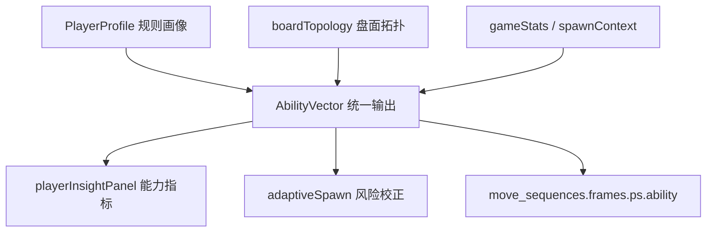

# 玩家画像与能力评估：算法工程师手册

> 本文是 OpenBlock **玩家建模子系统**的统一算法手册。
> 范围：实时玩家状态推断（`PlayerProfile`）与 `AbilityVector` 的公式、超参、配置和决策树。
> 与现有文档的关系：本文是玩家能力算法的权威事实来源；`PLAYER_ABILITY_EVALUATION.md` 只保留产品语义和接入说明，`PANEL_PARAMETERS.md` 只维护 UI 字段解释。
> 若需要横向理解 PlayerProfile / AbilityVector 与 RL、Spawn、商业化、LTV 的模型契约，先读 [`MODEL_ENGINEERING_GUIDE.md`](./MODEL_ENGINEERING_GUIDE.md)。

---

## 目录

1. [问题定义与设计哲学](#1-问题定义与设计哲学)
2. [玩家画像数据模型](#2-玩家画像数据模型)
3. [技能评估：从 raw 到 skillLevel](#3-技能评估从-raw-到-skilllevel)
4. [历史融合：会话级与跨日记忆](#4-历史融合会话级与跨日记忆)
5. [心流模型：F(t) 与三态判定](#5-心流模型ft-与三态判定)
6. [挫败感与近失检测](#6-挫败感与近失检测)
7. [认知负荷与动量](#7-认知负荷与动量)
8. [会话阶段与节奏](#8-会话阶段与节奏)
9. [玩法风格 (Playstyle) 检测](#9-玩法风格-playstyle-检测)
10. [冷启动与置信度](#10-冷启动与置信度)
11. [画像 → 出块的耦合](#11-画像--出块的耦合)
12. [快照导出（用于 Bot/回放/商业化）](#12-快照导出用于-bot回放商业化)
13. [AbilityVector：模型化统一输出](#13-abilityvector模型化统一输出)
14. [完整公式速查](#14-完整公式速查)
15. [完整参数表](#15-完整参数表)
16. [演进与开放问题](#16-演进与开放问题)

---

## 1. 问题定义与设计哲学

### 1.1 问题

给定玩家在一局中的步级行为序列 $\{(\text{thinkMs}_i, \text{cleared}_i, \text{lines}_i, \text{fill}_i, \text{miss}_i)\}_{i=1}^{N}$，**实时**估计：

- 玩家当前**技能水平** $\hat{\text{skill}} \in [0, 1]$
- 玩家当前**情绪状态** $\hat{\text{flow}} \in \{\text{bored}, \text{flow}, \text{anxious}\}$
- 玩家**离危机的距离**（挫败 / 近失）
- 玩家**会话阶段**（早期 / 巅峰 / 末期）

输出供：
- **AdaptiveSpawn**：调整出块难度
- **MonetizationPersonalization**：决定广告/IAP/任务时机
- **UI**：玩家洞察面板可视化

### 1.2 建模方法对比

玩家画像是一个**低延迟、弱标签、强解释**的在线估计问题。当前不是“不能用 ML”，而是先用可解释规则模型建立稳定特征契约，再把离线模型作为 baseline 校准。

| 方法 | 形式 | 优势 | 代价 | 适用阶段 |
|------|------|------|------|----------|
| 规则特征 + EMA（当前） | 手工特征、阈值树、指数平滑 | 冷启动友好；端侧低延迟；每个判断可解释；改 JSON 即生效 | 个体长期差异表达有限；阈值需要回标 | 默认线上路径 |
| AbilityVector（当前） | 多维可解释向量 + baseline 融合接口 | 把能力、风险、规划和置信度统一成稳定契约；可写入回放训练集 | 仍依赖手工特征；不是独立学习模型 | UI、DDA、离线样本导出 |
| LightGBM / XGBoost | 会话级表格特征 → 分数/风险 baseline | 少量样本下效果通常优于深度序列；可解释性尚可 | 需要稳定未来标签；需校准与版本管理 | 有足够回放和未来表现标签后 |
| RNN / Transformer | 步级行为序列 → skill/risk/playstyle | 能学习时序模式和玩家节奏变化 | 数据需求高；端侧部署复杂；解释弱 | 大规模数据与离线训练成熟后 |
| 贝叶斯技能评级 | 先验 + 局间结果更新 | 不确定性建模清晰，适合跨局长期能力 | 难表达心流、操作负荷和盘面拓扑 | 长期 skill baseline 辅助 |

当前选型的核心假设：

- 单局样本短，很多玩家只有 1~3 局，深度模型冷启动收益低。
- 画像直接影响出块压力和商业化时机，错误解释成本高。
- Web/小程序需要弱网可用，不能依赖远端推理。
- 所有数值要能被策划和算法工程师按实验结果回调。

### 1.3 与 ML 的可能融合点

未来路线：

- 用历史会话与回放帧训练 LightGBM，预测未来 N 局均分、未来 K 步死局风险和长期 playstyle。
- 将预测值作为 `modelBaseline` 注入 `buildPlayerAbilityVector(profile, ctx)`，而不是直接覆盖 `PlayerProfile`。
- baseline 融合必须受 `confidence` 门控；低置信时实时规则仍主导。
- 离线模型的候选损失函数：
  - `skillScore` 校准：MSE / Huber，目标为未来 N 局归一化均分或胜率。
  - `riskLevel` 预测：Binary Cross Entropy，目标为未来 K 步 game over / 救援触发。
  - `playstyle` 分类：Cross Entropy，目标为跨局稳定风格标签。
  - 排序型能力：pairwise ranking loss，目标为同分层玩家未来表现排序。

---

## 2. 玩家画像数据模型

### 2.1 内部状态（局内私有）

`PlayerProfile` 实例持有的可变状态（`web/src/playerProfile.js`）：

| 字段 | 类型 | 初始 | 用途 |
|-----|------|-----|------|
| `_moves` | `Move[]` | `[]` | 步级行为窗口（最近 N） |
| `_smoothSkill` | `number` | 0.5 | 局内 EMA 技能 |
| `_recoveryCounter` | `number` | 0 | 紧急救援计数 |
| `_comboStreak` | `number` | 0 | 连续 ≥2 行消除 |
| `_consecutiveNonClears` | `number` | 0 | 连续未消行（即 frustrationLevel） |
| `_spawnCounter` | `number` | 0 | 本局出块轮次 |
| `_sessionStartTs` | `number` | `Date.now()` | 本局开始时间 |
| `_totalLifetimePlacements` | `number` | 0 | 终身放置次数 |
| `_totalLifetimeGames` | `number` | 0 | 终身局数 |
| `_feedbackBias` | `number` | 0 | 闭环反馈偏置 |
| `_sessionHistory` | `SessionSummary[]` | `[]` | 最近 30 局摘要 |
| `_statsBaselineSkill` | `number` | -1 | 后端注入的基线 |
| `_cachedHistorical` | `object/null` | `null` | 历史指标缓存 |

### 2.2 单步行为记录

```js
type Move = {
    ts: number,         // 时间戳
    thinkMs: number,    // 思考时长
    cleared: boolean,   // 是否消行
    lines: number,      // 消除的行+列总数
    fill: number,       // 放置后填充率
    miss: boolean,      // 是否未放置（点击错误等）
}
```

### 2.3 对外接口

`PlayerProfile` 不暴露内部 `_*` 字段，只通过 **getter** 输出：

```js
// 技能维度
profile.skillLevel        // 综合技能 [0,1]
profile.historicalSkill   // 历史技能 [0,1] / -1（无历史）
profile.trend             // 长周期趋势 [-1,1]
profile.confidence        // 数据置信度 [0,1]

// 实时信号
profile.flowDeviation     // 心流偏差 [0, +∞)
profile.flowState         // {'bored', 'flow', 'anxious'}
profile.frustrationLevel  // 连续未消行数（整型）
profile.hadRecentNearMiss // 近失布尔
profile.momentum          // 动量 [-1,1]
profile.cognitiveLoad     // 认知负荷 [0,1]
profile.engagementAPM     // 操作频率 (次/分钟)

// 节奏
profile.sessionPhase      // {'early', 'peak', 'late'}
profile.pacingPhase       // {'tension', 'release'}
profile.needsRecovery     // 是否需救援

// 风格
profile.playstyle         // {'aggressive', 'balanced', 'defensive', ...}
profile.segment5          // 5 分群（详见 § 9）

// 反馈环
profile.feedbackBias      // 闭环偏置
```

---

## 3. 技能评估：从 raw 到 skillLevel

### 3.1 即时 raw 技能

每步重算：

$$
r_t^{\text{skill}} = 0.15 \cdot \text{thinkScore} + 0.30 \cdot \text{clearScore} + 0.20 \cdot \text{comboScore} + 0.20 \cdot \text{missScore} + 0.15 \cdot \text{loadScore}
$$

#### 5 个分量定义

```
thinkScore  = 1 - clamp((thinkMs - 800) / 12000, 0, 1)
clearScore  = min(1, clearRate / 0.55)
comboScore  = min(1, comboRate / 0.45)
missScore   = 1 - min(1, missRate / 0.3)
loadScore   = 1 - cognitiveLoad
```

| 量 | 物理意义 | 高分含义 |
|----|---------|---------|
| `thinkScore` | 思考时间是否在合理区间 | 不太短不太长 |
| `clearScore` | 消行率 | 频繁消行 |
| `comboScore` | 多消率 (≥2 行) | 多行连消 |
| `missScore` | 误操作率 | 没失误 |
| `loadScore` | 思考稳定性 | 思考时长方差小 |

#### 权重设计动机

- `clearScore` 权重最高（0.30）：**结果导向**——能消行的就是高手
- `thinkScore` 与 `loadScore` 权重最低（各 0.15）：**避免惩罚慢思**——慢但稳的玩家不应被低估
- `missScore` 0.20：失误率反映**注意力质量**

### 3.2 EMA 平滑

```
smoothSkill_t = smoothSkill_{t-1} + α · (raw_t - smoothSkill_{t-1})
```

#### 双速 α

```
α = 0.35  if step ≤ fastConvergenceWindow (默认 5)
    0.15  otherwise
```

**为什么双速**：开局快收敛是必要的（前几步玩家就该被画出大致水平），但持续高 α 会导致剧烈抖动。

#### EMA 等价的滑动窗口

数学上：

$$
s_t = \sum_{k=0}^{t} \alpha (1-\alpha)^{t-k} r_k
$$

近似有效窗口长度：$\frac{1}{\alpha} \approx 6.7$（`α=0.15`）。

### 3.3 综合 skillLevel（含历史）

```
skillLevel = (1 - histWeight) · smoothSkill + histWeight · historicalSkill

其中：
  smoothWeight = min(1, stepsInSession / halfWindow)
  histWeight   = (1 - smoothWeight) · confidence
  halfWindow   = profileWindow / 2  ≈ 7.5
```

**直觉**：
- 步数 < 7：histWeight 大 → 信任历史
- 步数 = 15 (= profileWindow)：smoothWeight = 1 → histWeight = 0 → 完全相信本局
- `historicalSkill < 0`（无历史）→ 直接返回 smooth

### 3.4 文字档位（商业化层）

`personalization.js`：

```js
function _skillLabel(v) {
    if (v >= 0.8) return '高手';
    if (v >= 0.55) return '中级';
    if (v >= 0.3) return '新手';
    return '入门';
}
```

注意 PlayerProfile 内部**不**做离散化，连续值更精确。

---

## 4. 历史融合：会话级与跨日记忆

### 4.1 会话历史环

```
_sessionHistory ← 最多 30 个 SessionSummary
SessionSummary = {
    ts, mode, score, clears, maxLinesCleared, missRate, maxCombo,
    skill, flowDeviation, durationSec, ...
}
```

每次 `recordSessionEnd()` 追加；超过 30 局丢弃最早的。

### 4.2 历史技能（指数加权均值）

```
权重：    w_i = 0.85^{n-1-i}    （i 越新权重越大）
histSkill = (Σ w_i · skill_i) / (Σ w_i)
```

#### Decay 0.85 的含义

`0.85^k` 在 k=10 时 ≈ 0.197，k=30 时 ≈ 0.0076。  
即：
- 最近 5 局贡献约 **75%** 权重
- 10 局前的局贡献约 **15%**
- 30 局前几乎可忽略

### 4.3 后端基线融合

`ingestHistoricalStats(stats)` 由后端调用，传入跨日聚合（如 `total_games`, `avg_score`）：

```js
const scoreSkill = min(1, avgScore / 2500)     // 0.35 权重
const clearSkill = min(1, avgClears / 0.5)     // 0.30 权重  
const missSkill  = 1 - min(1, missRate / 0.3)  // 0.20 权重
const comboSkill = min(1, maxCombo / 6)        // 0.15 权重

baselineSkill = scoreSkill·0.35 + clearSkill·0.30 
              + missSkill·0.20 + comboSkill·0.15
```

#### 与会话历史融合

```
sessionWeight = min(1, sessionHistory.length / 10)
finalHist     = histSkill · sessionWeight 
              + baselineSkill · (1 - sessionWeight)
```

**直觉**：
- 会话历史 ≥ 10 局：完全用会话历史
- 会话历史 < 10：与后端基线融合
- 会话历史 0：直接用后端基线

### 4.4 趋势 trend

对 `_sessionHistory[].skill` 做**指数加权线性回归**：

```
权重：    w_i = 0.9^{n-1-i}
slope = Σ w_i (i - x̄)(skill_i - ȳ) / Σ w_i (i - x̄)²
trend = clamp(slope · 2, -1, 1)
```

| trend | 含义 |
|-------|-----|
| 0.5+ | 进步快 |
| 0~0.3 | 缓慢进步 |
| -0.3~0 | 缓慢退步 |
| -0.5- | 退步明显 |

### 4.5 置信度 confidence

```
volume_conf    = min(1, totalGames / 20)
freshness_conf = exp(-daysSinceLastGame / 7)  // 一周内基本满分

confidence = volume_conf · freshness_conf
```

#### 离线衰减

```
SKILL_DECAY_HOURS = 24
若上次玩超过 24h：
    skill_decayed = skill · (1 - decay) + 0.5 · decay
    decay = clamp((hoursSince - 24) / 168, 0, 0.5)
```

一周不玩 → 技能向 0.5 收敛 50%（防止"老玩家回流被认作高手"）。

---

## 5. 心流模型：F(t) 与三态判定

### 5.1 心理学基础

Csíkszentmihályi (1990) 心流理论：当**挑战与能力匹配**时，玩家进入心流：

```
challenge << skill  →  bored
challenge ≈ skill   →  flow
challenge >> skill  →  anxious
```

### 5.2 量化 boardPressure（挑战）

```
fillPressure  = avgFill              # 棋盘越满压力越大
clearDeficit  = 1 - min(1, clearRate / 0.4)  # 不消行就有"债"
loadPressure  = cognitiveLoad        # 决策困难

boardPressure = 0.45·fillPressure + 0.35·clearDeficit + 0.2·loadPressure
```

权重设计：
- `fillPressure` 0.45：物理空间的危险最直观
- `clearDeficit` 0.35：玩家心智上的挫败感
- `loadPressure` 0.20：决策成本

### 5.3 心流偏差 F(t)

$$
F(t) = \left| \frac{\text{boardPressure}}{\max(0.05, \text{skillLevel})} - 1 \right|
$$

- ratio = 1：完美匹配 → F = 0
- ratio > 1：挑战 > 能力 → 焦虑
- ratio < 1：挑战 < 能力 → 无聊

### 5.4 三态判定（规则树）

```
if step_count < 5:
    return 'flow'  # 步数太少，默认 flow

# v1.18：复合挣扎前置 —— 在 F(t) 早返回之前先看 4 个弱挣扎信号
struggleSignals =
    (missRate > 0.10 ? 1 : 0) +
    (thinkMs > thinkTimeStruggleMs (3500) ? 1 : 0) +
    (clearRate < 0.30 ? 1 : 0) +
    (avgFill > 0.55 && clearRate < 0.40 ? 1 : 0)
if struggleSignals >= 3:
    return 'anxious'  # 单一阈值都没踩穿，但多条同时弱负面 → 玩家其实在挣扎

if F(t) < 0.25:
    return 'flow'  # 偏差很小，明确心流

if (thinkMs 短 && clearRate 高 && missRate 低):
    return 'bored'  # 玩得太顺手了

if (missRate > 0.28 OR
    (thinkMs > 10000 && clearRate < 0.3) OR
    (avgFill > 0.7 && clearRate < 0.35)):
    return 'anxious'

if (cognitiveLoad > 0.6 && clearRate < 0.4):
    return 'anxious'

if F(t) > 0.5 && clearRate > 0.5:
    return 'bored'  # 偏差大但消行多 → 玩家碾压游戏

return 'flow'  # 默认
```

> **v1.18 设计动机**：旧版要求 `F(t) ≥ 0.25` 才进入方向判定，会漏掉
> "板面 58% + 思考 4 秒 + 失误 13% + 消行率 25%"这种**单一阈值都没踩穿、
> 但多个弱信号同时成立**的挣扎场景。F(t) 的分母是 skillLevel，玩家自己技能也
> 不算高时（boardPressure ≈ 0.4 / skill ≈ 0.5 → F(t) ≈ 0.2）会被早返回吞掉，
> UI 上仍报"心流"。复合挣扎检测把它前置，避免这条盲区。
> 阈值刻意宽松（每条都是"轻度负面"），必须 ≥3 条同时成立才生效，避免误报。

### 5.5 与配置的关系

`shared/game_rules.json.adaptiveSpawn.flowZone` 提供阈值：

| 配置项 | 默认 | 用于 |
|-------|------|-----|
| `missRateWorry` | 0.28 | anxious 触发 |
| `thinkTimeLowMs` | 1200 | bored 触发 |
| `thinkTimeHighMs` | 10000 | anxious 触发 |
| `thinkTimeStruggleMs` | 3500 | v1.18 复合挣扎单信号阈值 |
| `thinkTimeVarianceHigh` | 8e6 | cognitiveLoad 归一 |

> ⚠️ JSON 中的 `clearRateIdeal` / `clearRateTolerance` 在当前 `flowState` 实现中**未使用**——心流判定全在 `playerProfile.js` 写死。如果你认为应该读 JSON，可以考虑重构。

---

## 6. 挫败感与近失检测

### 6.1 frustrationLevel：连续未消行计数

```js
get frustrationLevel() {
    return this._consecutiveNonClears;
}
```

#### 更新规则

```
recordPlace(cleared=true)  → consecutiveNonClears = 0
recordPlace(cleared=false) → consecutiveNonClears += 1
recordMiss()               → consecutiveNonClears += 1
recordSpawn()              → 不变
```

注意是**整型计数**，不是 0~1 的比例。

### 6.2 阈值阶梯

不同业务模块对挫败的反应阈值：

| 阈值 | 模块 | 默认 | 作用 |
|------|------|-----|------|
| `engagement.frustrationThreshold` | adaptiveSpawn | 4 | 触发 frustrationRelief（出块减压） |
| `thresholds.frustrationWarning` | strategyConfig | 3 | UI 提示 |
| `thresholds.frustrationIapHint` | strategyConfig | 4 | 弹 hint pack IAP |
| `thresholds.frustrationRescue` | strategyConfig | 5 | 弹 rescue 包（强促单） |

### 6.3 衰减机制

**目前没有自动衰减**——只有"消行一次"才重置。

设计动机：挫败感应该体现真实"连续无果"的痛苦，时间衰减会让模型对真实长卡顿不敏感。

### 6.4 hadRecentNearMiss：近失检测

```js
get hadRecentNearMiss() {
    const last = this._recentMoves().slice(-1)[0];
    return !last.miss && !last.cleared && last.fill > 0.6;
}
```

判定：**上一步正常放置 + 未消行 + 放后填充率 > 0.6**。

#### 0.6 阈值的来源

经验值。8×8 棋盘 64 格，0.6 = 38 格已占用——离填满还有 26 格距离，但已经"明显紧张"。

### 6.5 历史近失率（不在 PlayerProfile）

`fetchPersonaFromServer` 从后端拉取 `near_miss_rate`：

```sql
SELECT 
    AVG(CASE WHEN had_near_miss THEN 1.0 ELSE 0 END) AS near_miss_rate
FROM behaviors
WHERE user_id = ?
  AND ts > NOW() - INTERVAL 7 DAY;
```

**实时近失（PlayerProfile）vs 历史近失率（后端）是两条信号**：
- 实时：用于本局 DDA
- 历史：用于商业化分群（高近失率=高紧张感玩家=潜在 IAP 客户）

---

## 7. 认知负荷与动量

### 7.1 cognitiveLoad

$$
\text{cognitiveLoad} = \min\left(1, \frac{\text{Var}(\text{thinkMs})}{8 \times 10^6}\right)
$$

**直觉**：思考时长方差大 = 有时秒下、有时长想 = 玩家对某些局面犹豫不决 = 认知压力高。

#### 8e6 的来源

经验值。$\sqrt{8 \times 10^6} \approx 2828$ ms = 2.8 秒标准差。  
即：标准差超过 2.8s → 认知负荷已饱和。

#### 步数 < 3 时返回 0.3

```
默认值 0.3 是"中性"——避免冷启动时误判为高负荷。
```

> **v1.13：UI 层冷启动隔离 + 回放对齐**
>
> 0.3 是给 stress 主路径的兜底，不应直接呈现在玩家面板上（否则首屏会出现「负荷 30%」误导）。
> 新增 getter `cognitiveLoadHasData = (placed.length ≥ 3)`，UI 在为 false 时把
> 「负荷」字段渲染为「—」。同样地，`metrics` getter 现在带 `samples / activeSamples`
> 字段供 UI 区分占位与真实测量。
>
> **回放数据同步**：`buildPlayerStateSnapshot` bump 至 `pv=2`，写入 `coldStart` /
> `cognitiveLoadHasData` / `metrics.{samples,activeSamples}`，并把冷启动帧的 metrics
> 与 cognitiveLoad 直接置 `null`；`buildReplayAnalysis` 暴露 `coldFrames` /
> `coldFramesRatio` / `firstWarmFrameIdx` 供离线管线过滤。详见
> `docs/engineering/STRATEGY_GUIDE.md` 的「冷启动占位值与 UI 展示约定」与
> `docs/engineering/SQLITE_SCHEMA.md` 的 `pv` 演进表。

### 7.2 momentum

$$
\text{momentum} = \text{clamp}\left(\frac{\text{CR}_{\text{后半}} - \text{CR}_{\text{前半}}}{0.3}, -1, 1\right) \cdot \text{sampleConfidence} \cdot \text{noiseDamping}
$$

其中
- CR = clearRate（仅统计 `!miss`，自然排除 AFK）；
- `sampleConfidence = clamp((|olderPlaced| + |newerPlaced|) / 12, 0, 1)`；
- v1.16：`noiseDamping = clamp(1 - (\text{Var}_\text{older} + \text{Var}_\text{newer}), 0.5, 1)`，
  其中 $\text{Var}_h = CR_h(1 - CR_h)$ 是伯努利方差。

> **关键：完全基于「消行率」而非「分数增量」**——分数随玩家累计线性增长，
> 用分数差去算 momentum 会出现"得分稳定上升 ⇒ 动量+1"的伪信号。

#### 0.3 的标度

clearRate 典型 0~0.5。差异 0.3 已是"明显的"——即从 30% 涨到 60%（或反之），就把 momentum 拉到上下限。

#### v1.13：样本置信度缩放

旧实现仅要求每半区 ≥2 个 placement，6 个样本即可触发，clearRate 一次抖动就能把 momentum 推到 ±1，与玩家直觉脱节（典型案例：clearRate=0.4、心流稳定，但 momentum=−1.0）。修订后：

1. **最小样本**：每半区要求 ≥3 个 placement（minSamplesPerHalf=3），不足时直接返回 0。
2. **样本置信度**：将钳制后的 momentum 再 ×`sampleConfidence`，6 样本时仅 0.5、12 样本时 1.0；窗口写满（默认 15）时行为与旧版本一致。

预期效果：早期局内 momentum 趋于平稳，长会话末期才允许出现 ±1 的强信号；既保留疲劳分支语义，又消除对小样本噪声的过度反应。

#### v1.16：噪声衰减（伯努利方差）

样本置信度只考虑「样本数量」，但当某半区的消行/未消行接近五五开时，一次随机翻转
就能把 momentum 推到极端。新增噪声衰减 `noiseDamping`：

| 半区 1 (CR) | 半区 2 (CR) | noise = (Var₁ + Var₂)/2 | noiseDamping | 效果 |
|---|---|---|---|---|
| 0.0 / 1.0 | 0.0 / 1.0 | 0     | 1.0  | 极端反差，完全保留 momentum |
| 0.5       | 0.0 / 1.0 | 0.125 | 0.75 | 一半 50/50，衰减 25% |
| 0.5       | 0.5       | 0.25  | 0.5  | 全部 50/50，衰减到 50%（下限） |

预期效果：玩家"忽消忽不消"的不稳定窗口里，UI 不再误报"动量 +1 上升势头"；只有
两半都呈现明显趋势（清晰高/低 CR）时才触发强动量信号。

### 7.3 用途

| 信号 | 主要消费方 |
|-----|-----------|
| `cognitiveLoad` | flowState 判定、boardPressure 计算 |
| `momentum` | adaptiveSpawn `late` 阶段疲劳分支、商业化 `realtimeSignals` |

---

## 8. 会话阶段与节奏

### 8.1 sessionPhase（PlayerProfile）

```js
get sessionPhase() {
    const elapsed = Date.now() - this._sessionStartTs;
    if (this._spawnCounter <= 2 || elapsed < 30_000) return 'early';
    if (elapsed < 300_000) return 'peak';
    return 'late';
}
```

| 阶段 | 触发 |
|-----|------|
| `early` | 前 2 次 spawn **或** 开局 30s 内 |
| `peak` | 30s ~ 5min |
| `late` | 5min 之后 |

### 8.2 sessionArc（adaptiveSpawn 层）

`adaptiveSpawn.js` 把 `sessionPhase` + `runStreak` 映射为 **warmup / peak / cooldown**：

```js
function deriveSessionArc(profile, runStreak) {
    if (totalRounds <= 3) return 'warmup';
    if (sessionPhase === 'late') return 'cooldown';
    return 'peak';
}
```

### 8.3 pacingPhase

```
pacingPhase = (sessionPhase === 'early' || sessionPhase === 'peak') 
              ? 'tension' 
              : 'release'
```

> **v1.17 — UI 标签解耦**：v1.16 之前 `playerInsightPanel` 把 `pacingPhase` 文案
> 写为「节奏相位」，与 `spawnHints.rhythmPhase`（setup/payoff/neutral）的紧凑 pill
> 「节奏 收获」同名异义。v1.17 起 `pacingPhase` 在 UI 上统一称 **「Session 张弛」**
> （`Session 张弛：紧张期/松弛期`），`spawnHints.rhythmPhase` 保留 **「节奏相位」**
> 称谓。代码字段名不变，仅展示文案区分。

### 8.4 应用：sessionArcAdjust

```js
sessionArcAdjust = {
    'warmup':  -0.08,    // 减压：前 3 局给点甜头
    'peak':     0,
    'cooldown': late && momentum<-0.3 ? +0.05 : 0  // 末期且滑落 → 略微调整
}
```

> 阶段命名差异提醒：**PlayerProfile 用 early/peak/late**，adaptiveSpawn **再映射到 warmup/peak/cooldown**。文档中如读到 "warmup/mid/late" 是旧版叙述，以代码为准。

---

## 9. 玩法风格 (Playstyle) 检测

详见 [`PLAYSTYLE_DETECTION.md`](../player/PLAYSTYLE_DETECTION.md)。本节只做算法摘要。

### 9.1 五分群

```js
playstyle ∈ {'aggressive', 'balanced', 'defensive', 'reckless', 'cautious'}
```

### 9.2 分群依据（窗口特征）

```
multiClearRate = comboCount / clearCount   // 多消比例
fillBeforeClear = avg fill before each clear  // 攒满程度
clearGreedy    = avg c² / clearCount       // 单次大消偏好
recklessness   = missRate · 2 + (clearRate < 0.2 ? 0.5 : 0)
```

### 9.3 决策树（伪）

```
if multiClearRate > 0.5 && fillBeforeClear > 0.6:
    return 'aggressive'   # 攒大消玩家

if missRate > 0.25:
    return 'reckless'

if clearRate < 0.25 && fillBeforeClear < 0.4:
    return 'defensive'

if cognitiveLoad < 0.3 && clearRate ∈ [0.3, 0.5]:
    return 'cautious'

return 'balanced'
```

### 9.4 反馈到出块

playstyle 通过 `adaptiveSpawn` 的 `playstyleNudge` 轻推 shapeWeights：

```
aggressive → 偏大块（鼓励玩家攒大消）
defensive  → 偏小块（让玩家更易消行）
reckless   → 给 fail-safe（增加单格小块）
```

权重轻推（±5~10%），不主导。

### 9.5 segment5（5 维分群）

```js
segment5 ∈ {0, 1, 2, 3, 4}
基于 (skillLevel, totalGames, avgClears, maxCombo) 的 K-Means 离线聚类（或规则离散化）
```

主要供商业化与运营使用。

---

## 10. 冷启动与置信度

### 10.1 完全无历史

```
totalGames = 0:
    skillLevel = 0.5            (默认中性)
    confidence = 0
    historicalSkill = -1        (sentinel)
```

### 10.2 极少数据（1-3 局）

```
historicalSkill = avg of 1-3 sessions
confidence = 0.05~0.15          (低)
最终 skillLevel ≈ smoothSkill (置信度低 → 主要看实时)
```

### 10.3 isNewPlayer / isInOnboarding

```js
get isNewPlayer() {
    return this._totalLifetimeGames < 3;
}

get isInOnboarding() {
    return this._totalLifetimeGames < 1
        || (this._totalLifetimeGames < 3 && this.skillLevel < 0.5);
}
```

#### 用途

- 出块层：`onboarding` 玩家强制 easy profile
- UI：新手引导
- 商业化：新手不展示付费弹窗（保留 D1 留存）

### 10.4 后端基线注入

`ingestHistoricalStats(stats)` 调用一次，把跨日数据转 baseline：

```python
# 后端从 user_stats 表查询
{
    'avg_score': 1234,
    'total_games': 87,
    'avg_clears': 0.42,
    'miss_rate': 0.08,
    'max_combo': 4,
    'days_since_last': 0.5
}
```

→ 转 `baselineSkill` → 与会话历史融合 → 注入 `historicalSkill`。

---

## 11. 画像 → 出块的耦合

### 11.1 应用矩阵

`adaptiveSpawn.js` 中各信号 → stress 调整：

| 画像信号 | adjust 名 | 默认权重 | 方向 |
|---------|----------|---------|------|
| `skillLevel` | `skillAdjust` | linear 0~0.15 | 高技能 → 加压 |
| `flowState` | `flowAdjust` | ±0.08~0.12 | bored 加压 / anxious 减压 |
| `frustrationLevel` ≥ 4 | `frustRelief` | -0.18 | 救援 |
| `hadRecentNearMiss` | `nearMissAdjust` | -0.10 | 减压 |
| `momentum` | (sessionArc 内) | ±0.05 | late + 滑落时调整 |
| `pacingPhase = release` | (sessionArc 内) | -0.05 | 末期减压 |
| `comboStreak` ≥ 3 | `comboAdjust` | +0.06 | 鼓励连击 |
| `feedbackBias` | (直接加) | ±0.10 | 闭环修正 |
| `trend` | `trendAdjust` | ± conf · 0.08 | 进步加压 / 退步减压 |
| `sessionArc` | `sessionArcAdjust` | -0.08 / 0 | warmup 减压 |

### 11.2 综合 stress

```js
stress = scoreStress
       + difficultyBias
       + skillAdjust
       + flowAdjust
       + recoveryAdjust
       + frustRelief
       + comboAdjust
       + nearMissAdjust
       + feedbackBias
       + trendAdjust
       + sessionArcAdjust;
stress = clamp(stress, -0.2, 1);  // 截断
```

### 11.3 反馈环 feedbackBias

```
expected_clears = profile.clearRate · spawn_window
actual_clears   = clears in window

bias = (actual - expected) · 0.05
bias decays toward 0 over time
```

**直觉**：如果策略给玩家偏简单（实际消行 > 预期），下次加难一点；反之亦然。这是**真正的闭环**，让 adaptiveSpawn 自校准。

---

## 12. 快照导出（用于 Bot/回放/商业化）

### 12.1 buildPlayerStateSnapshot

`web/src/moveSequence.js`：

```js
function buildPlayerStateSnapshot(profile, opts = {}) {
    return {
        skillLevel: profile.skillLevel,
        historicalSkill: profile.historicalSkill,
        trend: profile.trend,
        confidence: profile.confidence,
        flowDeviation: profile.flowDeviation,
        flowState: profile.flowState,
        frustrationLevel: profile.frustrationLevel,
        hadNearMiss: profile.hadRecentNearMiss,  // alias
        momentum: profile.momentum,
        cognitiveLoad: profile.cognitiveLoad,
        engagementAPM: profile.engagementAPM,
        sessionPhase: profile.sessionPhase,
        playstyle: profile.playstyle,
        segment5: profile.segment5,
        ...
        // 可选字段
        adaptive: opts.includeAdaptive ? lastSpawnContext : undefined,
        ability: buildPlayerAbilityVector(profile, opts)
    };
}
```

### 12.2 用途

| 消费方 | 字段 |
|-------|------|
| **回放系统** | 全部（用于事后 Bot 训练数据） |
| **RL Bot** | 不直接消费（RL 用 `extractStateFeatures`，是棋盘特征；不是玩家画像） |
| **商业化 realtimeSignals** | `frustrationLevel, hadNearMiss, momentum, flowState` |
| **训练面板** | `ability` 与实时曲线（Insight 卡片可视化） |
| **离线能力模型** | `frames[].ps.ability` + session/game_stats 构造训练样本 |

### 12.3 持久化

```js
profile.toJSON() / load(json)
↓
localStorage['openblock_player_profile']
```

**不**通过 HTTP 同步——玩家画像是端侧资产，每端独立。  
后端只通过 `ingestHistoricalStats` 注入聚合统计。

---

## 13. AbilityVector：模型化统一输出

`web/src/playerAbilityModel.js` 在 `PlayerProfile` 之上新增统一能力向量，不替代实时规则画像，而是把规则信号、盘面拓扑和局级统计聚合为可展示、可训练、可被出块策略消费的稳定输出。

### 13.1 输出字段

| 字段 | 范围 | 含义 | 当前消费方 |
|------|------|------|------------|
| `skillScore` | 0~1 | 综合能力；默认来自 `profile.skillLevel`，可被离线模型基线小幅校准 | 面板 / adaptiveSpawn |
| `controlScore` | 0~1 | 操作稳定性；综合失误率、认知负荷、AFK 与 APM | 面板解释 |
| `clearEfficiency` | 0~1 | 消行效率；综合消行率、多消率、平均消行条数 | 面板解释 |
| `boardPlanning` | 0~1 | 盘面规划；综合空洞、填充压力、可落位空间、临消机会 | 面板解释 |
| `riskTolerance` | 0~1 | 风险偏好；高填充下继续搭建、多消等待、近失等会抬高 | 后续个性化 |
| `riskLevel` | 0~1 | 短期风险；高填充、空洞、连续未消行和操作不稳会抬高 | adaptiveSpawn 减压 |
| `confidence` | 0~1 | 当前向量可信度；历史局数、终身落子数、本局样本越多越高 | 模型门控 |
| `explain[]` | 文本 | 最多 3 条解释，用于把模型输出翻译成策划可读原因 | 面板 |

### 13.2 与实时画像的关系

`AbilityVector` 是输出层，不直接修改 `PlayerProfile` 内部状态。当前链路为：



`adaptiveSpawn` 仍以 `PlayerProfile` 为主，但使用 `ability.skillScore` 作为技能输入，并在 `shared/game_rules.json → playerAbilityModel.adaptiveSpawnRiskAdjust` 满足置信度与风险阈值时增加额外减压项 `abilityRiskAdjust`，避免高风险局面继续加压。

### 13.3 配置来源

`AbilityVector` 的权重、阈值与分档不写在代码里，统一读取 `shared/game_rules.json → playerAbilityModel`：

- `bands`：`skillBand` / `riskBand` 的分档阈值。
- `baseline`：离线 `modelBaseline` 与实时规则分的融合比例。
- `control` / `clearEfficiency` / `boardPlanning` / `risk` / `riskTolerance`：各子分数的归一化分母与权重。
- `confidence`：profile、终身落子数、本局采样对置信度的贡献。
- `explain`：能力解释文案触发阈值。
- `adaptiveSpawnRiskAdjust`：高风险局面的额外出块减压门控。

### 13.4 离线训练样本

`buildAbilityTrainingDataset(sessions)` 从 `Database.listReplaySessions()` 返回的 `sessions + move_sequences.frames + analysis` 构建样本：

```js
{
  features: {
    skillAvg, skillLast, flowDeviationAvg, cognitiveLoadAvg,
    boardFillAvg, clearRateAvg, missRateAvg, comboRateAvg,
    placements, clears, misses, clearRateSession, missRateSession
  },
  labels: {
    finalScore, survivedSteps, totalClears,
    earlyDeath, highScore, replayRating, tags
  }
}
```

设计约束：

- `profile.skillLevel / flowState / playstyle` 只作为 bootstrap 弱标签，不当作人工真值。
- 商业分群 `mon_user_segments.segment` 不作为技能真值，只可作为分层分析维度。
- 短局样本存在落库偏差，应至少保留 session 级摘要，再纳入长期模型训练。

### 13.5 评估指标

| 目标 | 指标 | 合格信号 |
|------|------|----------|
| 长期能力 | `skillScore` 与未来 5 局均分 Spearman 相关 | 正相关且高于旧 `skillLevel` |
| 短期风险 | `riskLevel` 预测未来 3~5 步 game over 的 AUC | 高于仅用 `boardFill` |
| 风格稳定 | 最近 10 局 `playstyle` 漂移率 | 同类玩家漂移更低 |
| DDA 效果 | 同能力分层下胜率、局长、挫败率方差 | 方差下降 |

### 13.6 代码实现与应用示例

核心实现：

| 入口 | 职责 |
|------|------|
| `web/src/playerAbilityModel.js → buildPlayerAbilityVector()` | 构建实时能力向量 |
| `web/src/adaptiveSpawn.js → resolveAdaptiveStrategy()` | 读取 `ability.skillScore / riskLevel / confidence` 修正 stress |
| `web/src/moveSequence.js → buildPlayerStateSnapshot()` | 将 `ps.ability` 写入回放帧 |
| `web/src/database.js → getAbilityTrainingDataset()` | 从回放会话导出离线训练样本 |
| `tests/playerAbilityModel.test.js` | 验证边界、风险抬升和样本导出 |

输入示例：

```js
const ability = buildPlayerAbilityVector(profile, {
  grid,
  boardFill: grid.getFillRatio(),
  gameStats: { placements: 18 },
  spawnContext: { roundsSinceClear: 4, mobility: 32 },
  modelBaseline: { skillScore: 0.62, riskLevel: 0.48, confidence: 0.4 }
});
```

输出作用：

- `skillScore` 进入技能调节项，高能力且高置信时允许轻微加压。
- `riskLevel` 高于 `playerAbilityModel.adaptiveSpawnRiskAdjust.riskThreshold` 时触发额外减压。
- `explain[]` 进入玩家洞察面板，帮助策划判断是消行效率、盘面规划还是操作稳定性导致变化。
- `features` 与 `labels` 进入离线样本，用于后续 baseline 模型训练。

---

## 14. 完整公式速查

### 14.1 即时技能

$$
r_t^{\text{skill}} = 0.15 \cdot th + 0.30 \cdot cl + 0.20 \cdot co + 0.20 \cdot ms + 0.15 \cdot ld
$$

### 14.2 EMA

$$
s_t = s_{t-1} + \alpha (r_t - s_{t-1}), \quad \alpha = \begin{cases} 0.35 & t \leq 5 \\ 0.15 & t > 5 \end{cases}
$$

### 14.3 历史指数加权

$$
\text{histSkill} = \frac{\sum_{i} 0.85^{n-1-i} \cdot \text{skill}_i}{\sum_{i} 0.85^{n-1-i}}
$$

### 14.4 综合 skillLevel

$$
\text{skillLevel} = (1 - h_w) \cdot s_t + h_w \cdot \text{histSkill}
$$
$$
h_w = (1 - \min(1, t/7.5)) \cdot \text{conf}
$$

### 14.5 心流偏差

$$
F(t) = \left|\frac{0.45 \overline{\text{fill}} + 0.35 (1 - \min(1, \text{CR}/0.4)) + 0.2 \cdot L}{\max(0.05, \text{skill})} - 1\right|
$$

### 14.6 趋势

$$
\text{trend} = \text{clamp}\left(2 \cdot \frac{\sum w_i (i - \bar{x})(s_i - \bar{y})}{\sum w_i (i - \bar{x})^2}, -1, 1\right)
$$
其中 $w_i = 0.9^{n-1-i}$。

### 14.7 动量

$$
\text{momentum} = \text{clamp}\left(\frac{\text{CR}_\text{后} - \text{CR}_\text{前}}{0.3}, -1, 1\right) \cdot \min\!\left(1, \frac{n_\text{older} + n_\text{newer}}{12}\right) \cdot \underbrace{\max\!\left(0.5, 1 - \big(\text{Var}_\text{older} + \text{Var}_\text{newer}\big)\right)}_{\text{v1.16 noiseDamping}}
$$

其中 $\text{Var}_h = CR_h (1 - CR_h)$ 是伯努利方差；`noiseDamping ∈ [0.5, 1]`。

其中 $n_\text{older}$ / $n_\text{newer}$ 为前/后半区的有效 placement 数（v1.13 起每半区要求 ≥3 才参与计算）。

### 14.8 认知负荷

$$
L = \min\left(1, \frac{\text{Var}(\text{thinkMs})}{8 \times 10^6}\right)
$$

### 14.9 置信度

$$
\text{confidence} = \min\left(1, \frac{\text{totalGames}}{20}\right) \cdot e^{-\text{daysSinceLast}/7}
$$

### 14.10 综合 stress

$$
\text{stress} = \text{clamp}\left(\sum_i \text{adjust}_i, -0.2, 1\right)
$$

---

## 15. 完整参数表

### 15.1 EMA 与窗口

| 参数 | 默认 | 来源 |
|------|-----|-----|
| `profileWindow` | 15 | `adaptiveSpawn.profileWindow` |
| `fastConvergenceWindow` | 5 | `adaptiveSpawn.fastConvergenceWindow` |
| `fastConvergenceAlpha` | 0.35 | `adaptiveSpawn.fastConvergenceAlpha` |
| `smoothingFactor` | 0.15 | `adaptiveSpawn.smoothingFactor` |

### 15.2 raw 技能权重

| 维度 | 权重 |
|------|------|
| thinkScore | 0.15 |
| clearScore | 0.30 |
| comboScore | 0.20 |
| missScore | 0.20 |
| loadScore | 0.15 |

### 15.3 阈值

| 参数 | 默认 | 用途 |
|------|-----|-----|
| `recoveryFillThreshold` | 0.82 | 触发 needsRecovery |
| `recoveryDuration` | 4 | 救援步数 |
| `frustrationThreshold` (engagement) | 4 | 减压触发 |
| `frustrationRescue` (strategy) | 5 | IAP 强促 |
| `frustrationIapHint` | 4 | IAP 弱促 |
| `frustrationWarning` | 3 | UI 提示 |
| `nearMissFillThreshold` | 0.6 | 近失判定 |
| `cognitiveLoadVarHigh` | 8e6 | cognitiveLoad 归一分母 |
| `missRateWorry` | 0.28 | anxious 触发 |
| `thinkTimeLowMs` | 1200 | bored 触发 |
| `thinkTimeHighMs` | 10000 | anxious 触发 |

### 15.4 历史融合

| 参数 | 默认 |
|-----|-----|
| sessionHistoryDecay | 0.85 |
| trendDecay | 0.9 |
| baselineWeights | [0.35, 0.30, 0.20, 0.15] |
| sessionConfThreshold | 10 局 → 完全用会话历史 |
| volumeConfThreshold | 20 局 → 满置信 |
| freshnessHalfLife | 7 天 |

### 15.5 离线衰减

| 参数 | 默认 |
|-----|-----|
| SKILL_DECAY_HOURS | 24 |
| MAX_DECAY | 0.5 |
| DECAY_FULL_DAYS | 7 |

### 15.6 AbilityVector 配置

来源：`shared/game_rules.json → playerAbilityModel`。这些参数控制 `web/src/playerAbilityModel.js` 的统一能力向量，以及 `adaptiveSpawn` 对高风险局面的额外减压。

| 分组 | 参数 | 默认 | 用途 |
|------|------|------|------|
| `bands` | `riskHigh` / `riskMid` | 0.72 / 0.42 | `riskBand` 分档 |
| `bands` | `skillExpert` / `skillAdvanced` / `skillDeveloping` | 0.78 / 0.58 / 0.36 | `skillBand` 分档 |
| `baseline` | `skillMinConfidence` / `skillBlendScale` | 0.35 / 0.35 | 离线能力 baseline 与实时 `skillLevel` 融合 |
| `baseline` | `riskMinConfidence` / `riskBlend` | 0.45 / 0.25 | 离线风险 baseline 与实时风险融合 |
| `control` | `missRateMax` / `afkMax` / `apmMax` | 0.3 / 3 / 14 | 操作稳定性归一化 |
| `control.weights` | miss / cognitiveLoad / afk / apm | 0.38 / 0.27 / 0.17 / 0.18 | `controlScore` 加权 |
| `clearEfficiency` | `clearRateMax` / `comboRateMax` / `avgLinesMax` | 0.55 / 0.45 / 2.5 | 消行效率归一化 |
| `clearEfficiency.weights` | clearRate / comboRate / avgLines | 0.55 / 0.25 / 0.20 | `clearEfficiency` 加权 |
| `boardPlanning` | `holeMax` / `mobilityMax` / `closeLinesMax` | 10 / 120 / 6 | 盘面规划归一化 |
| `boardPlanning` | `fillPenaltyStart` / `fillPenaltySpan` | 0.58 / 0.36 | 高填充惩罚曲线 |
| `boardPlanning.weights` | holes / fill / mobility / nearClear | 0.36 / 0.22 / 0.22 / 0.20 | `boardPlanning` 加权 |
| `risk` | `frustrationMax` / `roundsSinceClearMax` | 5 / 4 | 短期风险归一化 |
| `risk.weights` | boardFill / holes / frustration / roundsSinceClear / control | 0.32 / 0.28 / 0.18 / 0.12 / 0.10 | `riskLevel` 加权 |
| `riskTolerance` | `nearMissBonus` / `recoveryPenalty` / `comboRateMax` | 0.18 / -0.15 / 0.5 | 风险偏好调节 |
| `confidence` | profile / lifetime / game 权重 | 0.65 / 0.25 / 0.10 | AbilityVector 置信度 |
| `explain` | high/low 解释阈值 | 见 JSON | 面板解释文案触发 |
| `adaptiveSpawnRiskAdjust` | `minConfidence` / `riskThreshold` / `stressRelief` | 0.25 / 0.62 / -0.08 | 高风险局面额外减压 |

---

## 16. 演进与开放问题

### 16.1 已识别的设计权衡

| 决策 | 优势 | 代价 |
|-----|------|-----|
| EMA 而非 LSTM | 解释性 + 冷启动 | 个体差异建模弱 |
| 5 维 raw 加权 | 调参直观 | 维度选择主观 |
| 阈值规则树（flowState） | 可解释 | 阈值需要回标 |
| 整型挫败计数 | 直观 | 无时间衰减 |

### 16.2 v2 候选改进

1. **个性化 α**：根据玩家"行为方差"自适应调 EMA α
2. **多分量 frustration**：从计数升级为带权重的连续值
3. **跨设备同步**：把 `_sessionHistory` 同步到云端（隐私权衡）
4. **ML 增强**：训练 LightGBM 预测玩家**疲劳度**（与挫败/认知负荷正交）

### 16.3 开放研究点

- 怎样把"心流偏差"与 RL Bot 的"V(s)"联系？理论上越接近 V 的玩家越"懂这盘棋"
- 玩家是否存在多人格切换（白天 vs 晚上玩法不同）？
- 长期 trend 与产品 LTV 的相关性如何（数据科学方向）

---

## 关联文档

| 文档 | 关系 |
|------|------|
| [`ALGORITHMS_HANDBOOK.md`](./ALGORITHMS_HANDBOOK.md) | 总索引 |
| [`PLAYER_ABILITY_EVALUATION.md`](../player/PLAYER_ABILITY_EVALUATION.md) | 产品语义与接入说明 |
| [`PANEL_PARAMETERS.md`](../player/PANEL_PARAMETERS.md) | UI 指标解释 |
| [`REALTIME_STRATEGY.md`](../player/REALTIME_STRATEGY.md) | PlayerProfile → AdaptiveSpawn 全链路 |
| [`PLAYSTYLE_DETECTION.md`](../player/PLAYSTYLE_DETECTION.md) | 玩法风格分类 |
| [`ADAPTIVE_SPAWN.md`](./ADAPTIVE_SPAWN.md) | 出块系统的画像消费 |
| [`ALGORITHMS_MONETIZATION.md`](./ALGORITHMS_MONETIZATION.md) | 商业化对画像的消费 |

---

> 最后更新：2026-05-04 · 增加建模方法对比、AbilityVector 应用示例与 ML loss 口径
> 维护：算法工程团队
