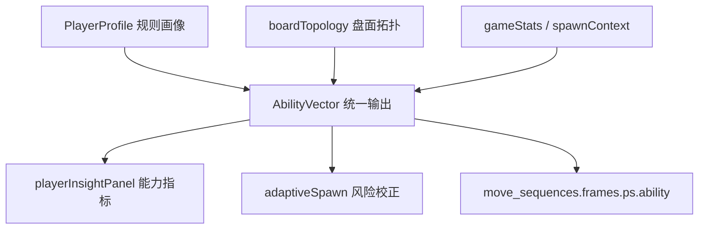

# 玩家画像与能力评估：算法工程师手册

> 本文是 OpenBlock **玩家建模子系统**的统一算法手册。
> 范围：实时玩家状态推断（`PlayerProfile`）与 `AbilityVector` 的公式、超参、配置和决策树。
> 与现有文档的关系：本文是玩家能力算法的权威事实来源；`PANEL_PARAMETERS.md 附录` 只保留产品语义和接入说明，`PANEL_PARAMETERS.md` 只维护 UI 字段解释。
> 若需要横向理解 PlayerProfile / AbilityVector 与 RL、Spawn、商业化、LTV 的模型契约，先读 [`MODEL_ENGINEERING_GUIDE.md`](./MODEL_ENGINEERING_GUIDE.md)。

---

## 目录

1. [问题定义与设计哲学](#1-问题定义与设计哲学)
2. [玩家画像数据模型](#2-玩家画像数据模型)
3. [技能评估：从 raw 到 skillLevel](#3-技能评估从-raw-到-skilllevel)
4. [历史融合：会话级与跨日记忆](#4-历史融合会话级与跨日记忆)
5. [心流模型：F(t) 与三态判定](#5-心流模型ft-与三态判定)
6. [挫败感与近失检测](#6-挫败感与近失检测)
7. [认知负荷与动量](#7-认知负荷与动量)
8. [会话阶段与节奏](#8-会话阶段与节奏)
9. [玩法风格 (Playstyle) 检测](#9-玩法风格-playstyle-检测)
10. [冷启动与置信度](#10-冷启动与置信度)
11. [画像 → 出块的耦合](#11-画像--出块的耦合)
12. [快照导出（用于 Bot/回放/商业化）](#12-快照导出用于-bot回放商业化)
13. [AbilityVector：模型化统一输出](#13-abilityvector模型化统一输出)
14. [完整公式速查](#14-完整公式速查)
15. [完整参数表](#15-完整参数表)
16. [演进与开放问题](#16-演进与开放问题)
17. [画像指标自评估与自我优化](#17-画像指标自评估与自我优化profileaudit)
18. [实时状态历史序列分析](#18-实时状态历史序列分析)

---

## 1. 问题定义与设计哲学

### 1.1 问题

给定玩家在一局中的步级行为序列 $\{(\text{thinkMs}_i, \text{cleared}_i, \text{lines}_i, \text{fill}_i, \text{miss}_i)\}_{i=1}^{N}$，**实时**估计：

- 玩家当前**技能水平** $\hat{\text{skill}} \in [0, 1]$
- 玩家当前**情绪状态** $\hat{\text{flow}} \in \{\text{bored}, \text{flow}, \text{anxious}\}$
- 玩家**离危机的距离**（挫败 / 近失）
- 玩家**会话阶段**（早期 / 巅峰 / 末期）

输出供：
- **AdaptiveSpawn**：调整出块难度
- **MonetizationPersonalization**：决定广告/IAP/任务时机
- **UI**：玩家洞察面板可视化

### 1.2 建模方法对比

玩家画像是一个**低延迟、弱标签、强解释**的在线估计问题。当前不是“不能用 ML”，而是先用可解释规则模型建立稳定特征契约，再把离线模型作为 baseline 校准。

| 方法 | 形式 | 优势 | 代价 | 适用阶段 |
|------|------|------|------|----------|
| 规则特征 + EMA（当前） | 手工特征、阈值树、指数平滑 | 冷启动友好；端侧低延迟；每个判断可解释；改 JSON 即生效 | 个体长期差异表达有限；阈值需要回标 | 默认线上路径 |
| AbilityVector（当前） | 多维可解释向量 + baseline 融合接口 | 把能力、风险、规划和置信度统一成稳定契约；可写入回放训练集 | 仍依赖手工特征；不是独立学习模型 | UI、DDA、离线样本导出 |
| LightGBM / XGBoost | 会话级表格特征 → 分数/风险 baseline | 少量样本下效果通常优于深度序列；可解释性尚可 | 需要稳定未来标签；需校准与版本管理 | 有足够回放和未来表现标签后 |
| RNN / Transformer | 步级行为序列 → skill/risk/playstyle | 能学习时序模式和玩家节奏变化 | 数据需求高；端侧部署复杂；解释弱 | 大规模数据与离线训练成熟后 |
| 贝叶斯技能评级 | 先验 + 局间结果更新 | 不确定性建模清晰，适合跨局长期能力 | 难表达心流、操作负荷和盘面拓扑 | 长期 skill baseline 辅助 |

当前选型的核心假设：

- 单局样本短，很多玩家只有 1~3 局，深度模型冷启动收益低。
- 画像直接影响出块压力和商业化时机，错误解释成本高。
- Web/小程序需要弱网可用，不能依赖远端推理。
- 所有数值要能被策划和算法工程师按实验结果回调。

### 1.3 与 ML 的可能融合点

未来路线：

- 用历史会话与回放帧训练 LightGBM，预测未来 N 局均分、未来 K 步死局风险和长期 playstyle。
- 将预测值作为 `modelBaseline` 注入 `buildPlayerAbilityVector(profile, ctx)`，而不是直接覆盖 `PlayerProfile`。
- baseline 融合必须受 `confidence` 门控；低置信时实时规则仍主导。
- 离线模型的候选损失函数：
  - `skillScore` 校准：MSE / Huber，目标为未来 N 局归一化均分或胜率。
  - `riskLevel` 预测：Binary Cross Entropy，目标为未来 K 步 game over / 救援触发。
  - `playstyle` 分类：Cross Entropy，目标为跨局稳定风格标签。
  - 排序型能力：pairwise ranking loss，目标为同分层玩家未来表现排序。

---

## 2. 玩家画像数据模型

### 2.1 内部状态（局内私有）

`PlayerProfile` 实例持有的可变状态（`web/src/playerProfile.js`）：

| 字段 | 类型 | 初始 | 用途 |
|-----|------|-----|------|
| `_moves` | `Move[]` | `[]` | 步级行为窗口（最近 N） |
| `_smoothSkill` | `number` | 0.5 | 局内 EMA 技能 |
| `_recoveryCounter` | `number` | 0 | 紧急救援计数 |
| `_comboStreak` | `number` | 0 | 连续 ≥2 行消除 |
| `_consecutiveNonClears` | `number` | 0 | 连续未消行（即 frustrationLevel） |
| `_spawnCounter` | `number` | 0 | 本局出块轮次 |
| `_sessionStartTs` | `number` | `Date.now()` | 本局开始时间 |
| `_totalLifetimePlacements` | `number` | 0 | 终身放置次数 |
| `_totalLifetimeGames` | `number` | 0 | 终身局数 |
| `_feedbackBias` | `number` | 0 | 闭环反馈偏置 |
| `_sessionHistory` | `SessionSummary[]` | `[]` | 最近 30 局摘要 |
| `_statsBaselineSkill` | `number` | -1 | 后端注入的基线 |
| `_cachedHistorical` | `object/null` | `null` | 历史指标缓存 |

### 2.2 单步行为记录

```js
type Move = {
    ts: number,         // 时间戳
    thinkMs: number,    // 思考时长
    cleared: boolean,   // 是否消行
    lines: number,      // 消除的行+列总数
    fill: number,       // 放置后填充率
    miss: boolean,      // 是否未放置（点击错误等）
}
```

### 2.3 对外接口

`PlayerProfile` 不暴露内部 `_*` 字段，只通过 **getter** 输出：

```js
// 技能维度
profile.skillLevel        // 综合技能 [0,1]
profile.historicalSkill   // 历史技能 [0,1] / -1（无历史）
profile.trend             // 长周期趋势 [-1,1]
profile.confidence        // 数据置信度 [0,1]

// 实时信号
profile.flowDeviation     // 心流偏差 [0, +∞)
profile.flowState         // {'bored', 'flow', 'anxious'}
profile.frustrationLevel  // 连续未消行数（整型）
profile.hadRecentNearMiss // 近失布尔
profile.momentum          // 动量 [-1,1]
profile.cognitiveLoad     // 认知负荷 [0,1]
profile.engagementAPM     // 操作频率 (次/分钟)

// 节奏
profile.sessionPhase      // {'early', 'peak', 'late'}
profile.pacingPhase       // {'tension', 'release'}
profile.needsRecovery     // 是否需救援

// 风格
profile.playstyle         // {'aggressive', 'balanced', 'defensive', ...}
profile.segment5          // 5 分群（详见 § 9）

// 反馈环
profile.feedbackBias      // 闭环偏置
```

---

## 3. 技能评估：从 raw 到 skillLevel

### 3.1 即时 raw 技能

每步重算：

$$
r_t^{\text{skill}} = 0.15 \cdot \text{thinkScore} + 0.30 \cdot \text{clearScore} + 0.20 \cdot \text{comboScore} + 0.20 \cdot \text{missScore} + 0.15 \cdot \text{loadScore}
$$

#### 5 个分量定义

```
thinkScore  = 1 - clamp((thinkMs - 800) / 12000, 0, 1)
clearScore  = min(1, clearRate / 0.55)
comboScore  = min(1, comboRate / 0.45)
missScore   = 1 - min(1, missRate / 0.3)
loadScore   = 1 - cognitiveLoad
```

| 量 | 物理意义 | 高分含义 |
|----|---------|---------|
| `thinkScore` | 思考时间是否在合理区间 | 不太短不太长 |
| `clearScore` | 消行率 | 频繁消行 |
| `comboScore` | 多消率 (≥2 行) | 多行连消 |
| `missScore` | 误操作率 | 没失误 |
| `loadScore` | 思考稳定性 | 思考时长方差小 |

#### 权重设计动机

- `clearScore` 权重最高（0.30）：**结果导向**——能消行的就是高手
- `thinkScore` 与 `loadScore` 权重最低（各 0.15）：**避免惩罚慢思**——慢但稳的玩家不应被低估
- `missScore` 0.20：失误率反映**注意力质量**

### 3.2 EMA 平滑

```
smoothSkill_t = smoothSkill_{t-1} + α · (raw_t - smoothSkill_{t-1})
```

#### 双速 α

```
α = 0.35  if step ≤ fastConvergenceWindow (默认 5)
    0.15  otherwise
```

**为什么双速**：开局快收敛是必要的（前几步玩家就该被画出大致水平），但持续高 α 会导致剧烈抖动。

#### EMA 等价的滑动窗口

数学上：

$$
s_t = \sum_{k=0}^{t} \alpha (1-\alpha)^{t-k} r_k
$$

近似有效窗口长度：$\frac{1}{\alpha} \approx 6.7$（`α=0.15`）。

### 3.3 综合 skillLevel（含历史）

```
skillLevel = (1 - histWeight) · smoothSkill + histWeight · historicalSkill

其中：
  smoothWeight = min(1, stepsInSession / halfWindow)
  histWeight   = (1 - smoothWeight) · confidence
  halfWindow   = profileWindow / 2  ≈ 7.5
```

**直觉**：
- 步数 < 7：histWeight 大 → 信任历史
- 步数 = 15 (= profileWindow)：smoothWeight = 1 → histWeight = 0 → 完全相信本局
- `historicalSkill < 0`（无历史）→ 直接返回 smooth

### 3.4 文字档位（商业化层）

`personalization.js`：

```js
function _skillLabel(v) {
    if (v >= 0.8) return '高手';
    if (v >= 0.55) return '中级';
    if (v >= 0.3) return '新手';
    return '入门';
}
```

注意 PlayerProfile 内部**不**做离散化，连续值更精确。

---

## 4. 历史融合：会话级与跨日记忆

### 4.1 会话历史环

```
_sessionHistory ← 最多 30 个 SessionSummary
SessionSummary = {
    ts, mode, score, clears, maxLinesCleared, missRate, maxCombo,
    skill, flowDeviation, durationSec, ...
}
```

每次 `recordSessionEnd()` 追加；超过 30 局丢弃最早的。

### 4.2 历史技能（指数加权均值）

```
权重：    w_i = 0.85^{n-1-i}    （i 越新权重越大）
histSkill = (Σ w_i · skill_i) / (Σ w_i)
```

#### Decay 0.85 的含义

`0.85^k` 在 k=10 时 ≈ 0.197，k=30 时 ≈ 0.0076。  
即：
- 最近 5 局贡献约 **75%** 权重
- 10 局前的局贡献约 **15%**
- 30 局前几乎可忽略

### 4.3 后端基线融合

`ingestHistoricalStats(stats)` 由后端调用，传入跨日聚合（如 `total_games`, `avg_score`）：

```js
const scoreSkill = min(1, avgScore / 2500)     // 0.35 权重
const clearSkill = min(1, avgClears / 0.5)     // 0.30 权重  
const missSkill  = 1 - min(1, missRate / 0.3)  // 0.20 权重
const comboSkill = min(1, maxCombo / 6)        // 0.15 权重

baselineSkill = scoreSkill·0.35 + clearSkill·0.30 
              + missSkill·0.20 + comboSkill·0.15
```

#### 与会话历史融合

```
sessionWeight = min(1, sessionHistory.length / 10)
finalHist     = histSkill · sessionWeight 
              + baselineSkill · (1 - sessionWeight)
```

**直觉**：
- 会话历史 ≥ 10 局：完全用会话历史
- 会话历史 < 10：与后端基线融合
- 会话历史 0：直接用后端基线

### 4.4 趋势 trend

对 `_sessionHistory[].skill` 做**指数加权线性回归**：

```
权重：    w_i = 0.9^{n-1-i}
slope = Σ w_i (i - x̄)(skill_i - ȳ) / Σ w_i (i - x̄)²
trend = clamp(slope · 2, -1, 1)
```

| trend | 含义 |
|-------|-----|
| 0.5+ | 进步快 |
| 0~0.3 | 缓慢进步 |
| -0.3~0 | 缓慢退步 |
| -0.5- | 退步明显 |

### 4.5 置信度 confidence

```
volume_conf    = min(1, totalGames / 20)
freshness_conf = exp(-daysSinceLastGame / 7)  // 一周内基本满分

confidence = volume_conf · freshness_conf
```

#### 离线衰减

```
SKILL_DECAY_HOURS = 24
若上次玩超过 24h：
    skill_decayed = skill · (1 - decay) + 0.5 · decay
    decay = clamp((hoursSince - 24) / 168, 0, 0.5)
```

一周不玩 → 技能向 0.5 收敛 50%（防止"老玩家回流被认作高手"）。

---

## 5. 心流模型：F(t) 与三态判定

### 5.1 心理学基础

Csíkszentmihályi (1990) 心流理论：当**挑战与能力匹配**时，玩家进入心流：

```
challenge << skill  →  bored
challenge ≈ skill   →  flow
challenge >> skill  →  anxious
```

### 5.2 量化 boardPressure（挑战）

```
fillPressure  = avgFill              # 棋盘越满压力越大
clearDeficit  = 1 - min(1, clearRate / 0.4)  # 不消行就有"债"
loadPressure  = cognitiveLoad        # 决策困难

boardPressure = 0.45·fillPressure + 0.35·clearDeficit + 0.2·loadPressure
```

权重设计：
- `fillPressure` 0.45：物理空间的危险最直观
- `clearDeficit` 0.35：玩家心智上的挫败感
- `loadPressure` 0.20：决策成本

### 5.3 心流偏差 F(t)

$$
F(t) = \left| \frac{\text{boardPressure}}{\max(0.05, \text{skillLevel})} - 1 \right|
$$

- ratio = 1：完美匹配 → F = 0
- ratio > 1：挑战 > 能力 → 焦虑
- ratio < 1：挑战 < 能力 → 无聊

### 5.4 三态判定（规则树）

```
if step_count < 5:
    return 'flow'  # 步数太少，默认 flow

# 复合挣扎前置 —— 在 F(t) 早返回之前先看 4 个弱挣扎信号
struggleSignals =
    (missRate > 0.10 ? 1 : 0) +
    (thinkMs > thinkTimeStruggleMs (3500) ? 1 : 0) +
    (clearRate < 0.30 ? 1 : 0) +
    (avgFill > 0.55 && clearRate < 0.40 ? 1 : 0)
if struggleSignals >= 3:
    return 'anxious'  # 单一阈值都没踩穿，但多条同时弱负面 → 玩家其实在挣扎

if F(t) < 0.25:
    return 'flow'  # 偏差很小，明确心流

if (thinkMs 短 && clearRate 高 && missRate 低):
    return 'bored'  # 玩得太顺手了

if (missRate > 0.28 OR
    (thinkMs > 10000 && clearRate < 0.3) OR
    (avgFill > 0.7 && clearRate < 0.35)):
    return 'anxious'

if (cognitiveLoad > 0.6 && clearRate < 0.4):
    return 'anxious'

if F(t) > 0.5 && clearRate > 0.5:
    return 'bored'  # 偏差大但消行多 → 玩家碾压游戏

return 'flow'  # 默认
```

> **设计动机**：旧版要求 `F(t) ≥ 0.25` 才进入方向判定，会漏掉
> "板面 58% + 思考 4 秒 + 失误 13% + 消行率 25%"这种**单一阈值都没踩穿、
> 但多个弱信号同时成立**的挣扎场景。F(t) 的分母是 skillLevel，玩家自己技能也
> 不算高时（boardPressure ≈ 0.4 / skill ≈ 0.5 → F(t) ≈ 0.2）会被早返回吞掉，
> UI 上仍报"心流"。复合挣扎检测把它前置，避免这条盲区。
> 阈值刻意宽松（每条都是"轻度负面"），必须 ≥3 条同时成立才生效，避免误报。

### 5.5 与配置的关系

`shared/game_rules.json.adaptiveSpawn.flowZone` 提供阈值：

| 配置项 | 默认 | 用于 |
|-------|------|-----|
| `missRateWorry` | 0.28 | anxious 触发 |
| `thinkTimeLowMs` | 1200 | bored 触发 |
| `thinkTimeHighMs` | 10000 | anxious 触发 |
| `thinkTimeStruggleMs` | 3500 | 复合挣扎单信号阈值 |
| `thinkTimeVarianceHigh` | 8e6 | cognitiveLoad 归一 |

> ⚠️ JSON 中的 `clearRateIdeal` / `clearRateTolerance` 在当前 `flowState` 实现中**未使用**——心流判定全在 `playerProfile.js` 写死。如果你认为应该读 JSON，可以考虑重构。

---

## 6. 挫败感与近失检测

### 6.1 frustrationLevel：连续未消行计数

```js
get frustrationLevel() {
    return this._consecutiveNonClears;
}
```

#### 更新规则

```
recordPlace(cleared=true)  → consecutiveNonClears = 0
recordPlace(cleared=false) → consecutiveNonClears += 1
recordMiss()               → consecutiveNonClears += 1
recordSpawn()              → 不变
```

注意是**整型计数**，不是 0~1 的比例。

### 6.2 阈值阶梯

不同业务模块对挫败的反应阈值：

| 阈值 | 模块 | 默认 | 作用 |
|------|------|-----|------|
| `engagement.frustrationThreshold` | adaptiveSpawn | 4 | 触发 frustrationRelief（出块减压） |
| `thresholds.frustrationWarning` | strategyConfig | 3 | UI 提示 |
| `thresholds.frustrationIapHint` | strategyConfig | 4 | 弹 hint pack IAP |
| `thresholds.frustrationRescue` | strategyConfig | 5 | 弹 rescue 包（强促单） |

### 6.3 衰减机制

**目前没有自动衰减**——只有"消行一次"才重置。

设计动机：挫败感应该体现真实"连续无果"的痛苦，时间衰减会让模型对真实长卡顿不敏感。

### 6.4 hadRecentNearMiss：近失检测

```js
get hadRecentNearMiss() {
    const last = this._recentMoves().slice(-1)[0];
    return !last.miss && !last.cleared && last.fill > 0.6;
}
```

判定：**上一步正常放置 + 未消行 + 放后填充率 > 0.6**。

#### 0.6 阈值的来源

经验值。8×8 棋盘 64 格，0.6 = 38 格已占用——离填满还有 26 格距离，但已经"明显紧张"。

### 6.5 历史近失率（不在 PlayerProfile）

`fetchPersonaFromServer` 从后端拉取 `near_miss_rate`：

```sql
SELECT 
    AVG(CASE WHEN had_near_miss THEN 1.0 ELSE 0 END) AS near_miss_rate
FROM behaviors
WHERE user_id = ?
  AND ts > NOW() - INTERVAL 7 DAY;
```

**实时近失（PlayerProfile）vs 历史近失率（后端）是两条信号**：
- 实时：用于本局 DDA
- 历史：用于商业化分群（高近失率=高紧张感玩家=潜在 IAP 客户）

---

## 7. 认知负荷与动量

### 7.1 cognitiveLoad

$$
\text{cognitiveLoad} = \min\left(1, \frac{\text{Var}(\text{thinkMs})}{8 \times 10^6}\right)
$$

**直觉**：思考时长方差大 = 有时秒下、有时长想 = 玩家对某些局面犹豫不决 = 认知压力高。

#### 8e6 的来源

经验值。$\sqrt{8 \times 10^6} \approx 2828$ ms = 2.8 秒标准差。  
即：标准差超过 2.8s → 认知负荷已饱和。

#### 步数 < 3 时返回 0.3

```
默认值 0.3 是"中性"——避免冷启动时误判为高负荷。
```

> **UI 层冷启动隔离 + 回放对齐**
>
> 0.3 是给 stress 主路径的兜底，不应直接呈现在玩家面板上（否则首屏会出现「负荷 30%」误导）。
> 新增 getter `cognitiveLoadHasData = (placed.length ≥ 3)`，UI 在为 false 时把
> 「负荷」字段渲染为「—」。同样地，`metrics` getter 现在带 `samples / activeSamples`
> 字段供 UI 区分占位与真实测量。
>
> **回放数据同步**：`buildPlayerStateSnapshot` 写入 `coldStart` /
> `cognitiveLoadHasData` / `metrics.{samples,activeSamples}`，并把冷启动帧的 metrics
> 与 cognitiveLoad 直接置 `null`；`buildReplayAnalysis` 暴露 `coldFrames` /
> `coldFramesRatio` / `firstWarmFrameIdx` 供离线管线过滤。详见
> `docs/engineering/STRATEGY_GUIDE.md` 的「冷启动占位值与 UI 展示约定」。

### 7.2 momentum

$$
\text{momentum} = \text{clamp}\left(\frac{\text{CR}_{\text{后半}} - \text{CR}_{\text{前半}}}{0.3}, -1, 1\right) \cdot \text{sampleConfidence} \cdot \text{noiseDamping}
$$

其中
- CR = clearRate（仅统计 `!miss`，自然排除 AFK）；
- `sampleConfidence = clamp((|olderPlaced| + |newerPlaced|) / 12, 0, 1)`；
- `noiseDamping = clamp(1 - (\text{Var}_\text{older} + \text{Var}_\text{newer}), 0.5, 1)`，
  其中 $\text{Var}_h = CR_h(1 - CR_h)$ 是伯努利方差。

> **关键：完全基于「消行率」而非「分数增量」**——分数随玩家累计线性增长，
> 用分数差去算 momentum 会出现"得分稳定上升 ⇒ 动量+1"的伪信号。

#### 0.3 的标度

clearRate 典型 0~0.5。差异 0.3 已是"明显的"——即从 30% 涨到 60%（或反之），就把 momentum 拉到上下限。

#### 样本置信度缩放

旧实现仅要求每半区 ≥2 个 placement，6 个样本即可触发，clearRate 一次抖动就能把 momentum 推到 ±1（典型案例：clearRate=0.4、心流稳定，但 momentum=−1.0）。修订后：

1. **最小样本**：每半区要求 ≥3 个 placement（minSamplesPerHalf=3），不足时直接返回 0。
2. **样本置信度**：将钳制后的 momentum 再 ×`sampleConfidence`，6 样本时仅 0.5、12 样本时 1.0；窗口写满（默认 15）时行为与旧版本一致。

预期效果：早期局内 momentum 趋于平稳，长会话末期才允许出现 ±1 的强信号；既保留疲劳分支语义，又消除对小样本噪声的过度反应。

#### 噪声衰减（伯努利方差）

样本置信度只考虑「样本数量」，但当某半区的消行/未消行接近五五开时，一次随机翻转
就能把 momentum 推到极端。新增噪声衰减 `noiseDamping`：

| 半区 1 (CR) | 半区 2 (CR) | noise = (Var₁ + Var₂)/2 | noiseDamping | 效果 |
|---|---|---|---|---|
| 0.0 / 1.0 | 0.0 / 1.0 | 0     | 1.0  | 极端反差，完全保留 momentum |
| 0.5       | 0.0 / 1.0 | 0.125 | 0.75 | 一半 50/50，衰减 25% |
| 0.5       | 0.5       | 0.25  | 0.5  | 全部 50/50，衰减到 50%（下限） |

预期效果：玩家"忽消忽不消"的不稳定窗口里，UI 不再误报"动量 +1 上升势头"；只有
两半都呈现明显趋势（清晰高/低 CR）时才触发强动量信号。

### 7.3 用途

| 信号 | 主要消费方 |
|-----|-----------|
| `cognitiveLoad` | flowState 判定、boardPressure 计算 |
| `momentum` | adaptiveSpawn `late` 阶段疲劳分支、商业化 `realtimeSignals` |

---

## 8. 会话阶段与节奏

### 8.1 sessionPhase（PlayerProfile）

```js
get sessionPhase() {
    const elapsed = Date.now() - this._sessionStartTs;
    if (this._spawnCounter <= 2 || elapsed < 30_000) return 'early';
    if (elapsed < 300_000) return 'peak';
    return 'late';
}
```

| 阶段 | 触发 |
|-----|------|
| `early` | 前 2 次 spawn **或** 开局 30s 内 |
| `peak` | 30s ~ 5min |
| `late` | 5min 之后 |

### 8.2 sessionArc（adaptiveSpawn 层）

`adaptiveSpawn.js` 把 `sessionPhase` + `runStreak` 映射为 **warmup / peak / cooldown**：

```js
function deriveSessionArc(profile, runStreak) {
    if (totalRounds <= 3) return 'warmup';
    if (sessionPhase === 'late') return 'cooldown';
    return 'peak';
}
```

### 8.3 pacingPhase

```
pacingPhase = (sessionPhase === 'early' || sessionPhase === 'peak') 
              ? 'tension' 
              : 'release'
```

> **UI 标签解耦**：`playerInsightPanel` 把 `pacingPhase` 文案
> 写为「节奏相位」，与 `spawnHints.rhythmPhase`（setup/payoff/neutral）的紧凑 pill
> 「节奏 收获」同名异义。`pacingPhase` 在 UI 上统一称 **「Session 张弛」**
> （`Session 张弛：紧张期/松弛期`），`spawnHints.rhythmPhase` 保留 **「节奏相位」**
> 称谓。代码字段名不变，仅展示文案区分。

### 8.4 应用：sessionArcAdjust

```js
sessionArcAdjust = {
    'warmup':  -0.08,    // 减压：前 3 局给点甜头
    'peak':     0,
    'cooldown': late && momentum<-0.3 ? +0.05 : 0  // 末期且滑落 → 略微调整
}
```

> 阶段命名差异提醒：**PlayerProfile 用 early/peak/late**，adaptiveSpawn **再映射到 warmup/peak/cooldown**。文档中如读到 "warmup/mid/late" 是旧版叙述，以代码为准。

---

## 9. 玩法风格 (Playstyle) 检测

详见 [`REALTIME_STRATEGY.md`（玩法偏好识别与出块联动）](../player/REALTIME_STRATEGY.md#玩法偏好识别与出块联动)。本节只做算法摘要。

### 9.1 五分群

```js
playstyle ∈ {'aggressive', 'balanced', 'defensive', 'reckless', 'cautious'}
```

### 9.2 分群依据（窗口特征）

```
multiClearRate = comboCount / clearCount   // 多消比例
fillBeforeClear = avg fill before each clear  // 攒满程度
clearGreedy    = avg c² / clearCount       // 单次大消偏好
recklessness   = missRate · 2 + (clearRate < 0.2 ? 0.5 : 0)
```

### 9.3 决策树（伪）

```
if multiClearRate > 0.5 && fillBeforeClear > 0.6:
    return 'aggressive'   # 攒大消玩家

if missRate > 0.25:
    return 'reckless'

if clearRate < 0.25 && fillBeforeClear < 0.4:
    return 'defensive'

if cognitiveLoad < 0.3 && clearRate ∈ [0.3, 0.5]:
    return 'cautious'

return 'balanced'
```

### 9.4 反馈到出块

playstyle 通过 `adaptiveSpawn` 的 `playstyleNudge` 轻推 shapeWeights：

```
aggressive → 偏大块（鼓励玩家攒大消）
defensive  → 偏小块（让玩家更易消行）
reckless   → 给 fail-safe（增加单格小块）
```

权重轻推（±5~10%），不主导。

### 9.5 segment5（5 维分群）

```js
segment5 ∈ {0, 1, 2, 3, 4}
基于 (skillLevel, totalGames, avgClears, maxCombo) 的 K-Means 离线聚类（或规则离散化）
```

主要供商业化与运营使用。

---

## 10. 冷启动与置信度

### 10.1 完全无历史

```
totalGames = 0:
    skillLevel = 0.5            (默认中性)
    confidence = 0
    historicalSkill = -1        (sentinel)
```

### 10.2 极少数据（1-3 局）

```
historicalSkill = avg of 1-3 sessions
confidence = 0.05~0.15          (低)
最终 skillLevel ≈ smoothSkill (置信度低 → 主要看实时)
```

### 10.3 isNewPlayer / isInOnboarding

```js
get isNewPlayer() {
    return this._totalLifetimeGames < 3;
}

get isInOnboarding() {
    return this._totalLifetimeGames < 1
        || (this._totalLifetimeGames < 3 && this.skillLevel < 0.5);
}
```

#### 用途

- 出块层：`onboarding` 玩家强制 easy profile
- UI：新手引导
- 商业化：新手不展示付费弹窗（保留 D1 留存）

### 10.4 后端基线注入

`ingestHistoricalStats(stats)` 调用一次，把跨日数据转 baseline：

```python
# 后端从 user_stats 表查询
{
    'avg_score': 1234,
    'total_games': 87,
    'avg_clears': 0.42,
    'miss_rate': 0.08,
    'max_combo': 4,
    'days_since_last': 0.5
}
```

→ 转 `baselineSkill` → 与会话历史融合 → 注入 `historicalSkill`。

---

## 11. 画像 → 出块的耦合

### 11.1 应用矩阵

`adaptiveSpawn.js` 中各信号 → stress 调整：

| 画像信号 | adjust 名 | 默认权重 | 方向 |
|---------|----------|---------|------|
| `skillLevel` | `skillAdjust` | linear 0~0.15 | 高技能 → 加压 |
| `flowState` | `flowAdjust` | ±0.08~0.12 | bored 加压 / anxious 减压 |
| `frustrationLevel` ≥ 4 | `frustRelief` | -0.18 | 救援 |
| `hadRecentNearMiss` | `nearMissAdjust` | -0.10 | 减压 |
| `momentum` | (sessionArc 内) | ±0.05 | late + 滑落时调整 |
| `pacingPhase = release` | (sessionArc 内) | -0.05 | 末期减压 |
| `comboStreak` ≥ 3 | `comboAdjust` | +0.06 | 鼓励连击 |
| `feedbackBias` | (直接加) | ±0.10 | 闭环修正 |
| `trend` | `trendAdjust` | ± conf · 0.08 | 进步加压 / 退步减压 |
| `sessionArc` | `sessionArcAdjust` | -0.08 / 0 | warmup 减压 |

### 11.2 综合 stress

```js
stress = scoreStress
       + difficultyBias
       + skillAdjust
       + flowAdjust
       + recoveryAdjust
       + frustRelief
       + comboAdjust
       + nearMissAdjust
       + feedbackBias
       + trendAdjust
       + sessionArcAdjust;
stress = clamp(stress, -0.2, 1);  // 截断
```

### 11.3 反馈环 feedbackBias

```
expected_clears = profile.clearRate · spawn_window
actual_clears   = clears in window

bias = (actual - expected) · 0.05
bias decays toward 0 over time
```

**直觉**：如果策略给玩家偏简单（实际消行 > 预期），下次加难一点；反之亦然。这是**真正的闭环**，让 adaptiveSpawn 自校准。

---

## 12. 快照导出（用于 Bot/回放/商业化）

### 12.1 buildPlayerStateSnapshot

`web/src/moveSequence.js`：

```js
function buildPlayerStateSnapshot(profile, opts = {}) {
    return {
        skillLevel: profile.skillLevel,
        historicalSkill: profile.historicalSkill,
        trend: profile.trend,
        confidence: profile.confidence,
        flowDeviation: profile.flowDeviation,
        flowState: profile.flowState,
        frustrationLevel: profile.frustrationLevel,
        hadNearMiss: profile.hadRecentNearMiss,  // alias
        momentum: profile.momentum,
        cognitiveLoad: profile.cognitiveLoad,
        engagementAPM: profile.engagementAPM,
        sessionPhase: profile.sessionPhase,
        playstyle: profile.playstyle,
        segment5: profile.segment5,
        ...
        // 可选字段
        adaptive: opts.includeAdaptive ? lastSpawnContext : undefined,
        ability: buildPlayerAbilityVector(profile, opts)
    };
}
```

### 12.2 用途

| 消费方 | 字段 |
|-------|------|
| **回放系统** | 全部（用于事后 Bot 训练数据） |
| **RL Bot** | 不直接消费（RL 用 `extractStateFeatures`，是棋盘特征；不是玩家画像） |
| **商业化 realtimeSignals** | `frustrationLevel, hadNearMiss, momentum, flowState` |
| **训练面板** | `ability` 与实时曲线（Insight 卡片可视化） |
| **离线能力模型** | `frames[].ps.ability` + session/game_stats 构造训练样本 |

### 12.3 持久化

```js
profile.toJSON() / load(json)
↓
localStorage['openblock_player_profile']
```

**不**通过 HTTP 同步——玩家画像是端侧资产，每端独立。  
后端只通过 `ingestHistoricalStats` 注入聚合统计。

---

## 13. AbilityVector：模型化统一输出

`web/src/playerAbilityModel.js` 在 `PlayerProfile` 之上新增统一能力向量，不替代实时规则画像，而是把规则信号、盘面拓扑和局级统计聚合为可展示、可训练、可被出块策略消费的稳定输出。

### 13.1 输出字段

> v2 (2026-05)：`controlScore` 接入「反应」(`pickToPlaceMs`)；`clearEfficiency` 接入多消深度与清屏稀缺事件；`riskLevel` 接入填充加速度与 dock 锁死；`confidence` 接入近期活跃度衰减。详见 §13.7。

| 字段 | 范围 | 含义 | 当前消费方 |
|------|------|------|------------|
| `skillScore` | 0~1 | 综合能力；默认来自 `profile.skillLevel`，可被离线模型基线小幅校准 | 面板 / adaptiveSpawn |
| `controlScore` | 0~1 | 操作稳定性；失误率 + 认知负荷 + AFK + APM + **反应**（v2）综合 | 面板解释 |
| `clearEfficiency` | 0~1 | 消行效率；消行率 + 连消密度 + 单次行数 + **多消深度**（v2）+ **清屏稀缺事件**（v2） | 面板解释 |
| `boardPlanning` | 0~1 | 盘面规划；综合空洞、填充压力、可落位空间、临消机会 | 面板解释 |
| `riskTolerance` | 0~1 | 风险偏好；高填充下继续搭建、多消等待、近失等会抬高 | 后续个性化 |
| `riskLevel` | 0~1 | 短期风险；填充率 + 空洞 + 控制差 + **填充加速度**（v2）+ **dock 锁死概率**（v2） | adaptiveSpawn 减压 |
| `confidence` | 0~1 | 当前向量可信度；历史局数、终身落子数、本局样本 + **近期活跃衰减**（v2） | 模型门控 |
| `explain[]` | 文本 | 最多 3 条解释，用于把模型输出翻译成策划可读原因 | 面板 |
| `windows`（v2） | 对象 | 各能力指标使用的窗口长度；`{ control, clearEfficiency, general }` | 调试 / 训练样本 |
| `features`（v2 扩展） | 对象 | 增补 `reactionScore` / `pickToPlaceMs` / `multiClearRate` / `perfectClearRate` / `boardFillVelocity` / `lockRisk` / `recencyDecay` 等子分项，供 hover tooltip 与训练特征列 | 面板 / 训练 |

### 13.2 与实时画像的关系

`AbilityVector` 是输出层，不直接修改 `PlayerProfile` 内部状态。当前链路为：



`adaptiveSpawn` 仍以 `PlayerProfile` 为主，但使用 `ability.skillScore` 作为技能输入，并在 `shared/game_rules.json → playerAbilityModel.adaptiveSpawnRiskAdjust` 满足置信度与风险阈值时增加额外减压项 `abilityRiskAdjust`，避免高风险局面继续加压。

### 13.3 配置来源

`AbilityVector` 的权重、阈值与分档不写在代码里，统一读取 `shared/game_rules.json → playerAbilityModel`：

- `bands`：`skillBand` / `riskBand` 的分档阈值。
- `baseline`：离线 `modelBaseline` 与实时规则分的融合比例。
- `control` / `clearEfficiency` / `boardPlanning` / `risk` / `riskTolerance`：各子分数的归一化分母与权重。
- `confidence`：profile、终身落子数、本局采样对置信度的贡献。
- `explain`：能力解释文案触发阈值。
- `adaptiveSpawnRiskAdjust`：高风险局面的额外出块减压门控。

### 13.4 离线训练样本

`buildAbilityTrainingDataset(sessions)` 从 `Database.listReplaySessions()` 返回的 `sessions + move_sequences.frames + analysis` 构建样本：

```js
{
  features: {
    skillAvg, skillLast, flowDeviationAvg, cognitiveLoadAvg,
    boardFillAvg, clearRateAvg, missRateAvg, comboRateAvg,
    placements, clears, misses, clearRateSession, missRateSession
  },
  labels: {
    finalScore, survivedSteps, totalClears,
    earlyDeath, highScore, replayRating, tags
  }
}
```

设计约束：

- `profile.skillLevel / flowState / playstyle` 只作为 bootstrap 弱标签，不当作人工真值。
- 商业分群 `mon_user_segments.segment` 不作为技能真值，只可作为分层分析维度。
- 短局样本存在落库偏差，应至少保留 session 级摘要，再纳入长期模型训练。

### 13.5 评估指标

| 目标 | 指标 | 合格信号 |
|------|------|----------|
| 长期能力 | `skillScore` 与未来 5 局均分 Spearman 相关 | 正相关且高于旧 `skillLevel` |
| 短期风险 | `riskLevel` 预测未来 3~5 步 game over 的 AUC | 高于仅用 `boardFill` |
| 风格稳定 | 最近 10 局 `playstyle` 漂移率 | 同类玩家漂移更低 |
| DDA 效果 | 同能力分层下胜率、局长、挫败率方差 | 方差下降 |

### 13.6 代码实现与应用示例

核心实现：

| 入口 | 职责 |
|------|------|
| `web/src/playerAbilityModel.js → buildPlayerAbilityVector()` | 构建实时能力向量 |
| `web/src/adaptiveSpawn.js → resolveAdaptiveStrategy()` | 读取 `ability.skillScore / riskLevel / confidence` 修正 stress |
| `web/src/moveSequence.js → buildPlayerStateSnapshot()` | 将 `ps.ability` 写入回放帧 |
| `web/src/database.js → getAbilityTrainingDataset()` | 从回放会话导出离线训练样本 |
| `tests/playerAbilityModel.test.js` | 验证边界、风险抬升和样本导出 |

输入示例：

```js
const ability = buildPlayerAbilityVector(profile, {
  grid,
  boardFill: grid.getFillRatio(),
  gameStats: { placements: 18 },
  spawnContext: { roundsSinceClear: 4, mobility: 32 },
  modelBaseline: { skillScore: 0.62, riskLevel: 0.48, confidence: 0.4 }
});
```

输出作用：

- `skillScore` 进入技能调节项，高能力且高置信时允许轻微加压。
- `riskLevel` 高于 `playerAbilityModel.adaptiveSpawnRiskAdjust.riskThreshold` 时触发额外减压。
- `explain[]` 进入玩家洞察面板，帮助策划判断是消行效率、盘面规划还是操作稳定性导致变化。
- `features` 与 `labels` 进入离线样本，用于后续 baseline 模型训练。

### 13.7 v2 (2026-05) 增量：分项能力 7 项升级

v1 版 6 个 pill 存在三个共性问题：信号冗余（`boardFill / holes` 在 3 个指标里同时被引用，等价共线性）、信号闲置（`pickToPlaceMs / multiClearRate / perfectClearRate / lastActiveTs` 已经采集但未进能力向量）、阈值刻舟（所有 `_Max` 是产品体感初始值，从未基于真实分布校准）。v2 一次性修这 3 类问题：

#### 1. controlScore 接入「反应」(`pickToPlaceMs`)

```
reactionScore = 1 - clamp(0, 1, (pickToPlaceMs - reactionFastMs) / (reactionSlowMs - reactionFastMs))
```

- 默认 `reactionFastMs=350` / `reactionSlowMs=2200`，反应 ≤ 350ms 满分、≥ 2.2s 0 分；
- 样本不足（`reactionSamples < reactionMinSamples=3`）→ 反应项不参与，权重按比例重分配给其它四项，避免冷启动伪精确；
- 权重重平衡：`miss 0.34 / cognitiveLoad 0.22 / afk 0.13 / apm 0.15 / reaction 0.16`，total 仍为 1。

物理意义：把"看到 dock 块到落到目标位"的耗时作为操作熟练度的直接体现，弥补了 `thinkMs`（举棋不定）和 `missRate`（错指）之间的盲区。

#### 2. clearEfficiency 接入多消深度 + 清屏稀缺事件

旧版 3 项（`clearRate / comboRate / avgLines`）只能区分"消行密度"，无法区分"光会拼单消"与"会做多消大爆发"的玩家：

```
clearEfficiency = 0.40 · clearRate/0.55       # 消行密度
                + 0.18 · comboRate/0.45        # 连消密度
                + 0.14 · avgLines/2.5          # 单次平均行数
                + 0.18 · multiClearRate/0.5    # 多消深度（lines≥2 占比）（v2）
                + 0.10 · perfectClearRate/0.15 # 清屏稀缺事件（fill→0 占比）（v2）
```

`multiClearRate / perfectClearRate` 在 `metricsForWindow(16)` 内重新统计（不是直接使用 `PlayerProfile` 的全局 getter），保证与 `clearEfficiency` 的口径一致。

#### 3. riskLevel 接入填充加速度 + dock 锁死概率

v1 的 `riskLevel` 把"静态满"和"急速变满"等同，把"还能落子"和"dock 全锁死"等同——v2 加两个动态信号区分：

```
boardFillVelocity = mean(max(0, fill[i] - fill[i-1])) over last 5 placed moves
fillVelocityScore = clamp(0, 1, boardFillVelocity / 0.18)

# lockRisk 优先级：直接传入的 placementSolutionScore → ctx.firstMoveFreedom 归一
lockRisk = 1 - clamp(0, 1, firstMoveFreedom / firstMoveFreedomSafe=8)
```

权重重平衡：`boardFill 0.26 / holes 0.22 / frustration 0.14 / roundsSinceClear 0.10 / control 0.10 / boardFillVelocity 0.10 / lockRisk 0.08`。设计上 lockRisk 默认权重较低，让"已经死局"的极端信号必须叠加其它压力才会推上 high band，避免单帧抖动假报警。

#### 4. confidence 接入近期活跃度衰减

```
recencyDecay = exp(-days_since_last_active / recencyHalfLifeDays=14)
confidence = 0.55 · profile.confidence
           + 0.25 · clamp(lifetimePlacements/200, 0, 1)
           + 0.10 · clamp(gameStats.placements/20, 0, 1)
           + 0.10 · recencyDecay
```

老玩家 `lifetimePlacements` 仍很大但 30 天没玩，`recencyDecay ≈ 0.117` → confidence 显著下降，让模型基线融合（`baseline.confidence` 门控）自动退化为"先信实时数据"。冷启动场景 `lastActiveTs=0` 时默认 `recencyDecay=1`，不惩罚新玩家。

#### 5. 各能力指标使用独立时间窗口（`metricsForWindow`）

```json
"windows": { "control": 8, "clearEfficiency": 16, "skillBlend": 12 }
```

| 指标 | 窗口 | 物理含义 |
|------|------|----------|
| `controlScore` | 8 步 | 看短窗体现"我刚才操作变稳/变虚了" |
| `clearEfficiency` | 16 步 | 看中窗等待消行机会积累，避免"一局没消就 0 分" |
| `boardPlanning` | 瞬时 | 完全靠当前盘面拓扑（holes / mobility / closeLines），不依赖历史 |

`PlayerProfile.metricsForWindow(N)` 是 v2 新增的窗口聚合 API，老调用方 / 测试桩不实现该方法时回退到 `metrics`，向后兼容。

#### 6. 阈值校准框架

`shared/game_rules.json → playerAbilityModel.calibrationNote` 标注了所有 `*_Max` 当前是基于产品体感的初始猜测；建议运营离线跑：

```sql
SELECT
  PERCENTILE_CONT(0.10) WITHIN GROUP (ORDER BY pick_to_place_ms) AS p10,
  PERCENTILE_CONT(0.50) WITHIN GROUP (ORDER BY pick_to_place_ms) AS p50,
  PERCENTILE_CONT(0.90) WITHIN GROUP (ORDER BY pick_to_place_ms) AS p90
FROM move_sequences;
```

把 P10 → `reactionFastMs`、P90 → `reactionSlowMs`，依次校准 `apmMax / multiClearRateMax / perfectClearRateMax / boardFillVelocityMax`，让全玩家分布大致 N(0.5, 0.15)，6 个 pill 不再压在中段失去判别力。

#### 7. UI 视觉分组 + 雷达 hover

`ABILITY_METRIC_ROWS` 的每行带 `tone` 标记：

- `positive`（能力 / 操作 / 消行 / 规划）：默认强势配色，越高越强
- `negative`（风险）：红色基调，越低越安全；视觉与上四项相反，避免"风险 25%"被误读为弱
- `neutral`（置信）：灰色基调，作为数据元，不参与"强弱"语义

hover 任意 pill 弹出 6 维 SVG 雷达浮层；风险轴在 SVG 内被翻转为 `1 - risk`，让"向外=好"的语义在所有 6 个轴上一致。

---

## 14. 完整公式速查

### 14.1 即时技能

$$
r_t^{\text{skill}} = 0.15 \cdot th + 0.30 \cdot cl + 0.20 \cdot co + 0.20 \cdot ms + 0.15 \cdot ld
$$

### 14.2 EMA

$$
s_t = s_{t-1} + \alpha (r_t - s_{t-1}), \quad \alpha = \begin{cases} 0.35 & t \leq 5 \\ 0.15 & t > 5 \end{cases}
$$

### 14.3 历史指数加权

$$
\text{histSkill} = \frac{\sum_{i} 0.85^{n-1-i} \cdot \text{skill}_i}{\sum_{i} 0.85^{n-1-i}}
$$

### 14.4 综合 skillLevel

$$
\text{skillLevel} = (1 - h_w) \cdot s_t + h_w \cdot \text{histSkill}
$$
$$
h_w = (1 - \min(1, t/7.5)) \cdot \text{conf}
$$

### 14.5 心流偏差

$$
F(t) = \left|\frac{0.45 \overline{\text{fill}} + 0.35 (1 - \min(1, \text{CR}/0.4)) + 0.2 \cdot L}{\max(0.05, \text{skill})} - 1\right|
$$

### 14.6 趋势

$$
\text{trend} = \text{clamp}\left(2 \cdot \frac{\sum w_i (i - \bar{x})(s_i - \bar{y})}{\sum w_i (i - \bar{x})^2}, -1, 1\right)
$$
其中 $w_i = 0.9^{n-1-i}$。

### 14.7 动量

$$
\text{momentum} = \text{clamp}\left(\frac{\text{CR}_\text{后} - \text{CR}_\text{前}}{0.3}, -1, 1\right) \cdot \min\!\left(1, \frac{n_\text{older} + n_\text{newer}}{12}\right) \cdot \underbrace{\max\!\left(0.5, 1 - \big(\text{Var}_\text{older} + \text{Var}_\text{newer}\big)\right)}_{\text{noiseDamping}}
$$

其中 $\text{Var}_h = CR_h (1 - CR_h)$ 是伯努利方差；`noiseDamping ∈ [0.5, 1]`。

其中 $n_\text{older}$ / $n_\text{newer}$ 为前/后半区的有效 placement 数（每半区要求 ≥3 才参与计算）。

### 14.8 认知负荷

$$
L = \min\left(1, \frac{\text{Var}(\text{thinkMs})}{8 \times 10^6}\right)
$$

### 14.9 置信度

$$
\text{confidence} = \min\left(1, \frac{\text{totalGames}}{20}\right) \cdot e^{-\text{daysSinceLast}/7}
$$

### 14.10 综合 stress

$$
\text{stress} = \text{clamp}\left(\sum_i \text{adjust}_i, -0.2, 1\right)
$$

---

## 15. 完整参数表

### 15.1 EMA 与窗口

| 参数 | 默认 | 来源 |
|------|-----|-----|
| `profileWindow` | 15 | `adaptiveSpawn.profileWindow` |
| `fastConvergenceWindow` | 5 | `adaptiveSpawn.fastConvergenceWindow` |
| `fastConvergenceAlpha` | 0.35 | `adaptiveSpawn.fastConvergenceAlpha` |
| `smoothingFactor` | 0.15 | `adaptiveSpawn.smoothingFactor` |

### 15.2 raw 技能权重

| 维度 | 权重 |
|------|------|
| thinkScore | 0.15 |
| clearScore | 0.30 |
| comboScore | 0.20 |
| missScore | 0.20 |
| loadScore | 0.15 |

### 15.3 阈值

| 参数 | 默认 | 用途 |
|------|-----|-----|
| `recoveryFillThreshold` | 0.82 | 触发 needsRecovery |
| `recoveryDuration` | 4 | 救援步数 |
| `frustrationThreshold` (engagement) | 4 | 减压触发 |
| `frustrationRescue` (strategy) | 5 | IAP 强促 |
| `frustrationIapHint` | 4 | IAP 弱促 |
| `frustrationWarning` | 3 | UI 提示 |
| `nearMissFillThreshold` | 0.6 | 近失判定 |
| `cognitiveLoadVarHigh` | 8e6 | cognitiveLoad 归一分母 |
| `missRateWorry` | 0.28 | anxious 触发 |
| `thinkTimeLowMs` | 1200 | bored 触发 |
| `thinkTimeHighMs` | 10000 | anxious 触发 |

### 15.4 历史融合

| 参数 | 默认 |
|-----|-----|
| sessionHistoryDecay | 0.85 |
| trendDecay | 0.9 |
| baselineWeights | [0.35, 0.30, 0.20, 0.15] |
| sessionConfThreshold | 10 局 → 完全用会话历史 |
| volumeConfThreshold | 20 局 → 满置信 |
| freshnessHalfLife | 7 天 |

### 15.5 离线衰减

| 参数 | 默认 |
|-----|-----|
| SKILL_DECAY_HOURS | 24 |
| MAX_DECAY | 0.5 |
| DECAY_FULL_DAYS | 7 |

### 15.6 AbilityVector 配置（v2，2026-05）

来源：`shared/game_rules.json → playerAbilityModel`。控制 `web/src/playerAbilityModel.js` 的统一能力向量，以及 `adaptiveSpawn` 对高风险局面的额外减压。

> **校准说明**（`calibrationNote`）：所有 `*_Max` 阈值当前是基于产品体感的初始猜测；建议运营离线跑 `move_sequences` 求各信号的 P10/P50/P90 后回填，使全玩家分布大致 N(0.5, 0.15)。详见 §13.7-(6)。

| 分组 | 参数 | 默认 | 用途 |
|------|------|------|------|
| `version` | — | `2` | v2 = 引入反应/多消/清屏/速度/锁死/新鲜度，并允许各指标独立时间窗口 |
| `bands` | `riskHigh` / `riskMid` | 0.72 / 0.42 | `riskBand` 分档 |
| `bands` | `skillExpert` / `skillAdvanced` / `skillDeveloping` | 0.78 / 0.58 / 0.36 | `skillBand` 分档 |
| `windows`（v2） | `control` / `clearEfficiency` / `skillBlend` | 8 / 16 / 12 | 各能力指标独立的滑动窗口长度 |
| `baseline` | `skillMinConfidence` / `skillBlendScale` | 0.35 / 0.35 | 离线能力 baseline 与实时 `skillLevel` 融合 |
| `baseline` | `riskMinConfidence` / `riskBlend` | 0.45 / 0.25 | 离线风险 baseline 与实时风险融合 |
| `control` | `missRateMax` / `afkMax` / `apmMax` | 0.3 / 3 / 18 | 操作稳定性归一化（v2：apmMax 14→18） |
| `control`（v2） | `reactionFastMs` / `reactionSlowMs` / `reactionMinSamples` | 350 / 2200 / 3 | 反应项归一化与生效门槛 |
| `control.weights`（v2） | miss / cognitiveLoad / afk / apm / reaction | 0.34 / 0.22 / 0.13 / 0.15 / 0.16 | `controlScore` 加权（reaction 样本不足时其它四项按比例归一） |
| `clearEfficiency` | `clearRateMax` / `comboRateMax` / `avgLinesMax` | 0.55 / 0.45 / 2.5 | 消行效率归一化 |
| `clearEfficiency`（v2） | `multiClearRateMax` / `perfectClearRateMax` | 0.5 / 0.15 | 多消深度 / 清屏稀缺事件归一化 |
| `clearEfficiency.weights`（v2） | clearRate / comboRate / avgLines / multiClear / perfectClear | 0.40 / 0.18 / 0.14 / 0.18 / 0.10 | `clearEfficiency` 加权 |
| `boardPlanning` | `holeMax` / `mobilityMax` / `closeLinesMax` | 8 / 200 / 6 | 盘面规划归一化（v2：holeMax 10→8、mobilityMax 120→200） |
| `boardPlanning` | `fillPenaltyStart` / `fillPenaltySpan` | 0.58 / 0.36 | 高填充惩罚曲线 |
| `boardPlanning.weights` | holes / fill / mobility / nearClear | 0.36 / 0.22 / 0.22 / 0.20 | `boardPlanning` 加权 |
| `risk` | `frustrationMax` / `roundsSinceClearMax` | 5 / 4 | 短期风险归一化 |
| `risk`（v2） | `boardFillVelocityMax` / `firstMoveFreedomSafe` | 0.18 / 8 | 填充加速度上限 / dock 锁死安全垫 |
| `risk.weights`（v2） | boardFill / holes / frustration / roundsSinceClear / control / boardFillVelocity / lockRisk | 0.26 / 0.22 / 0.14 / 0.10 / 0.10 / 0.10 / 0.08 | `riskLevel` 加权 |
| `riskTolerance` | `nearMissBonus` / `recoveryPenalty` / `comboRateMax` | 0.18 / -0.15 / 0.5 | 风险偏好调节 |
| `confidence`（v2） | profile / lifetime / game / recency 权重 | 0.55 / 0.25 / 0.10 / 0.10 | AbilityVector 置信度（v2：profileWeight 0.65→0.55，腾出 0.10 给 recencyDecay） |
| `confidence`（v2） | `lifetimePlacementsMax` / `recencyHalfLifeDays` | 200 / 14 | 终身放置数饱和点 / 近期活跃半衰期（v2：200 较 v1 的 80 更接近真实老用户分布） |
| `explain` | high/low 解释阈值 | 见 JSON | 面板解释文案触发 |
| `adaptiveSpawnRiskAdjust` | `minConfidence` / `riskThreshold` / `stressRelief` | 0.25 / 0.62 / -0.08 | 高风险局面额外减压 |

---

## 16. 演进与开放问题

### 16.1 已识别的设计权衡

| 决策 | 优势 | 代价 |
|-----|------|-----|
| EMA 而非 LSTM | 解释性 + 冷启动 | 个体差异建模弱 |
| 5 维 raw 加权 | 调参直观 | 维度选择主观 |
| 阈值规则树（flowState） | 可解释 | 阈值需要回标 |
| 整型挫败计数 | 直观 | 无时间衰减 |

### 16.2 v2 候选改进

1. **个性化 α**：根据玩家"行为方差"自适应调 EMA α
2. **多分量 frustration**：从计数升级为带权重的连续值
3. **跨设备同步**：把 `_sessionHistory` 同步到云端（隐私权衡）
4. **ML 增强**：训练 LightGBM 预测玩家**疲劳度**（与挫败/认知负荷正交）

### 16.3 开放研究点

- 怎样把"心流偏差"与 RL Bot 的"V(s)"联系？理论上越接近 V 的玩家越"懂这盘棋"
- 玩家是否存在多人格切换（白天 vs 晚上玩法不同）？
- 长期 trend 与产品 LTV 的相关性如何（数据科学方向）

---

## 17. 画像指标自评估与自我优化（profileAudit）

> 目标：把"画像指标的口径和算法是否健康"从主观体感变成可重复跑的可执行检查，
> 让任何一局回放都能给出**结构化报告 + 优化建议**，与 SPAWN_DIFFICULTY_AND_EVALUATION 形成姊妹工具。

### 全库自闭环

把"遍历 6258 局用户序列 → 自动化分析 → 启动代码优化"完整闭环跑通。一次跑下来的真实证据：

| 指标 | 基线 | 改善 |
|---|---|---|---|---|
| 健康分中位数 | 60 | 0 ❗ | **60** | +60 ✓ |
| 健康分 p10 | 41 | 0 | **34** | +34 |
| 健康分 p90 | 71 | 67 | **78** | +7 |
| METRIC_COVERAGE_SYSTEMIC | — | 746%（爆炸） | **242%**（cap=5 生效） | -68% |
| HEALTH_SCORE_OVERALL_LOW | P2 | P1 | **消失** | ✓ |
| stress-equals-sum-breakdown 100% | — | 已消失 | 已消失 | ✓（ALLOWLIST 持续生效） |
| spawn-intent-no-thrashing | 83% | 29% | 29% | adaptive 改动需新对局生效 |
| 总 actions 数 | 9 | 5 | **4** | -56% |
| 新增 `UNAUDITABLE_SESSIONS_HIGH` | — | — | **28% (263/926)** | ✓ 准确暴露 schema 老化 |

#### 暴露的真相

跑全库（vs 200 抽样）才能看到的工具自身故障：

1. **大量老 session frames 缺 metrics 字段** → 50 个 metric coverage 全 0 → 50× COVERAGE_TOO_LOW × -12 分 → 健康分秒归零。这是工具自身故障不是数据故障。
2. **极短局（< 20 帧）样本不足以做有效统计** → 应单独识别为 `unauditable` 而非评 0 分。
3. **server.py limit=500 上限** → Web UI 一键巡检永远扫不到全库。
4. **auto-audit-all `--skip-upload` dry-run 聚合 bug** → 本轮 200 局白跑，聚合的是 server 上的 10 局历史数据。

#### 落地的 4 项优化

| 优化 | 文件 | 效果 |
|---|---|---|
| `INSUFFICIENT_DATA` 短路 + `healthScore=null` | `profileAuditHints.js` | unauditable 局不归零，单独统计 |
| `coverageHintCap=5` + `coverageHintsDowngrade=true` | `profileAuditHints.js` | 单局 COVERAGE 类 hint 最多 5 条且 warn 级别（-4/条 vs -12/条），健康分中位数从 0 → 60 |
| `aggregateAuditReports` 加 `unauditableCount` / `auditableCount` | `profileAudit.js` | 聚合视图区分"可分析的局" |
| `UNAUDITABLE_SESSIONS_HIGH` action（P1/P2/P3 按占比） | `profileAudit.js` | 显式提示 schema 老化问题 |
| server.py `limit` admin 模式 500 → 10000 | `server.py` | Web UI 真能扫全库 |
| Web UI 一键巡检改批处理 + 进度条 + ETA | `profileAuditApp.js` | 全库扫描时 UI 不冻结 |
| Web UI 聚合视图顶栏显示 `auditableCount / sessionsCount` banner | `profileAuditApp.js` | 用户一眼分清"能分析的"和"被排除的" |
| `auto-audit-all` dry-run 支持本地聚合 | `auto-audit-all.mjs` | `--aggregate-only-fresh` 模式下，新跑的 N 局立刻能聚合 |

#### 全库巡检推荐流程

```bash
# 启动 server.py 时必须 export OPENBLOCK_DB_DEBUG=1
OPENBLOCK_DB_DEBUG=1 python server.py

# 方式 1：CLI（最快，绕开 HTTP）
node scripts/auto-audit-all.mjs --sqlite openblock.db --days 0 --limit 10000 \
    --force --skip-upload --aggregate-only-fresh --out audit-allusers.md --pretty

# 方式 2：Web UI（推荐运营/产品用）
# → /profile-audit.html → 用户下拉选"🌐 全库" → 点"🤖 一键自动巡检"
# → 自动批处理（带进度 ETA）+ 上传 + 聚合 + 优化建议
```

---

### 1. 一句话概览

```
move_sequences.frames
   │
   ▼
collectReplayMetricsSeries / densifySeries   ←  REPLAY_METRICS 24 项指标按 idx 密致化
   │
   ▼
profileAudit 四层评估（A→D）
   ├── A 单指标质量：coverage / 冷启动 / 越界 / 抖动 / 基础统计
   ├── B 指标对关系：Pearson + Spearman，识别冗余对
   ├── C 时序行为：趋势 / 自相关 / 首半 vs 末半均值差
   └── D 自适应链路：stress 主导分量 / 闭环反馈滞后相关 / spawnIntent 切换频率
        │
        ▼
profileAuditContracts.eval  ←  9 条"业务约定即代码"契约
        │
        ▼
profileAuditHints.buildHints → { error / warn / info, code, msg, metrics }
        │
        ▼
summarizeHealthScore → 健康分 0-100
```

### 2. 工具入口

#### CLI

```bash
# 单局 frames JSON
npm run profile:audit -- --frames .cursor-stress-logs/session-456.json --pretty

# 多局聚合（JSON 内容是 [{frames:[...]}, ...]）
npm run profile:audit -- --sessions runs/all.json --out .cursor-stress-logs/audit.json

# 直连 SQLite（需要 `npm i -D better-sqlite3`）
npm run profile:audit -- --sqlite .cursor-data/openblock.db --session-id 42 --pretty

# 近 N 天聚合（扫近 7 天所有 session，输出违规率排行 + 健康分分布）
npm run profile:audit -- --sqlite .cursor-data/openblock.db --db-recent 7 --pretty

# 对照分析：current vs baseline，触发 REGRESSION_/IMPROVEMENT_ hints
npm run profile:audit -- --frames new.json --baseline old.json --pretty --ci

# CI 模式：单局有 error / 聚合有 topRegressions 时退出码 2
npm run profile:audit -- --frames runs/last.json --ci
```

输出说明：
- 默认输出 JSON 到 stdout
- `--out` 写入 JSON 文件
- `--pretty` 额外打印"健康分 + Top 12 hint"摘要到 stderr，JSON 仍走 stdout（可管道）
- `--ci` 报告中存在 `severity=error` 时退出码 `2`，便于 CI 拉警

#### 库引用

```js
import { auditProfile, aggregateAuditReports } from './web/src/audit/profileAudit.js';

const report = auditProfile(frames);   // 或多局 [{ frames }, ...]
console.log(report.healthScore);
for (const h of report.hints) {
    console.log(`[${h.severity}] ${h.code}: ${h.msg}`);
}

// 对照分析
const report2 = auditProfile(currentFrames, { baseline: baselineFrames });
console.log(report2.comparison.healthScoreDelta);  // 例如 -23
// 触发 REGRESSION_CONTRACT / IMPROVEMENT_CONTRACT / HEALTH_SCORE_REGRESSION 等额外 hints

// 跨局聚合
const agg = aggregateAuditReports([report1, report2, report3]);
console.log(agg.topRegressions);    // 违规率 ≥ 25% 的契约（≥3 局）
console.log(agg.hintCounts);         // 最频繁 hint Top
```

#### Web 可视化页

启动开发服务后访问：

```
http://localhost:3000/profile-audit.html
```

或从首页菜单进入「🩺 画像指标自评估」。功能：

| Tab | 用途 |
|---|---|
| **单局 Audit** | 选 session → Worker 跑 audit → 渲染契约/hint/链路 → 一键上传到 SQLite |
| **对照分析** | 选 current + baseline 两个 session → 双 audit → 高亮 REGRESSION/IMPROVEMENT 契约 |
| **聚合视图** | GET `/api/profile-audit/recent?days=N` → 违规率排行 + 健康分分布 + hint 频次 + stress 主导分布 |

页面用 Worker（`web/src/profileAudit.worker.js`）跑 audit，不阻塞主线程；Worker 不可用时退回主线程同步跑。

#### 服务端 API

`server.py` 提供 5 个端点（audit 计算仍在客户端，server 只做存储 + 聚合）：

| 方法 | 路径 | 用途 |
|---|---|---|
| `POST` | `/api/profile-audit/<session_id>` | 客户端跑完上传报告 |
| `GET` | `/api/profile-audit/<session_id>` | 读取已缓存的报告 |
| `DELETE` | `/api/profile-audit/<session_id>` | 删除缓存（调试用） |
| `GET` | `/api/profile-audit/sessions?user_id=&limit=100&days=` | 列出可 audit 的 session 元数据（不含 frames），标注 `hasAudit` 让 UI 区分已跑/未跑；省略 `user_id` 需 `OPENBLOCK_DB_DEBUG=1` |
| `GET` | `/api/profile-audit/recent?user_id=&days=7&limit=200` | 跨局聚合：违规率排行 / 健康分分布 / hint 频次 / stress 主导分布 |

存储表 `profile_audits`（见 server.py `_migrate_schema`）：

```sql
CREATE TABLE profile_audits (
    session_id INTEGER PRIMARY KEY,
    user_id TEXT,
    schema INTEGER NOT NULL,
    health_score INTEGER,
    passed_contracts INTEGER,
    failed_contracts INTEGER,
    hint_errors INTEGER,
    hint_warns INTEGER,
    hint_infos INTEGER,
    report TEXT NOT NULL,           -- 完整 audit report JSON
    updated_at INTEGER DEFAULT (strftime('%s', 'now'))
);
CREATE INDEX idx_profile_audits_user_updated ON profile_audits(user_id, updated_at DESC);
CREATE INDEX idx_profile_audits_health ON profile_audits(health_score);
```

索引列允许 `/recent` 端点不解析 `report TEXT` 也能做基础排序。

#### 设计取舍：为什么 server.py 不直接计算 audit？

audit 逻辑唯一来源在 `web/src/audit/profileAudit.js`（JS 库），server.py 不复刻：

| 选项 | 取舍 |
|---|---|
| ✅ 客户端跑 + server 存（采用） | 单源真理；规则演进无双源同步成本；Web/CLI/server 共用同一份契约 |
| ❌ server.py 子进程调 Node CLI | vite SSR 启动太慢（几秒），不适合实时 API |
| ❌ server.py 用 Python 复刻 audit 逻辑 | 双源维护成本高（契约/hint 变更要改两遍） |

### 3. 四层评估

#### A — 单指标质量

对每个 REPLAY_METRICS 指标独立体检：

| 字段 | 含义 | 触发的 hint |
|---|---|---|
| `coverage` | 有效采样数 / 总帧数 | `COVERAGE_TOO_LOW`（< 10%）/ `COVERAGE_LOW`（< 30%） |
| `stats` | min / max / mean / median / stddev | （供其他层使用，不直接 hint） |
| `jitter` | `medianAbsDiff` + `maxAbsDiff` | `METRIC_JITTERY`（rel jitter > 1.0）/ `METRIC_NOISY`（> 0.5） |
| `outOfRange` | 越界帧数 + 首次越界 idx | `OUT_OF_RANGE`（按 rate 分级） |
| `trendSlope` / `trendHalvesDiff` / `autocorrLag1` | 时序方向感（供 C 层叠加） | — |

**范围约束**集中在 `profileAudit.js` 的 `DEFAULT_RANGE_BY_KEY`，覆盖 24 项指标的预期边界（如 `boardFill ∈ [0,1]`、`stress ∈ [0,1]`）。新增指标若有强范围请补充进来。

#### B — 指标对关系

在白名单（默认 16 个核心指标）内两两计算 Pearson + Spearman 相关系数。

- **低方差跳过**：任一序列 `stddev < 1e-6`（≈常量）直接跳过，避免浮点误差被误算成 ±1。跳过对计入 `summary.skippedPairsLowVar` 便于审计。
- **排序输出**：按 |r| 降序，便于扫"最强相关 / 最强冗余"。

触发 hint：
- `REDUNDANT_PAIR`（|r| ≥ 0.97）：信息几乎重复，建议合并或舍弃其一
- `CORRELATED_PAIR`（|r| ≥ 0.92）：中度相关，建模时注意共线性

#### C — 时序行为

由 A 层产生的 `trendSlope` / `halvesMeanDiff` / `autocorrLag1` 配合契约层使用。例如 `skill-not-drift-too-fast` 契约就是用 `halvesMeanDiff` 实现的。

#### D — 自适应链路

把"指标 → 决策"的因果链做穿透检查：

| 链路 | 评估方式 | 触发的 hint |
|---|---|---|
| `stressDominator` | 7 个 stress 分量的 ΣabsContrib 占比，找最大主导 | `STRESS_SINGLE_DOMINATOR`（≥ 90%）/ `STRESS_DOMINATED`（≥ 75%） |
| `intentSwitches` | 一局内 `spawnIntent` 切换次数 | `INTENT_THRASHING`（≥ 30）/ `INTENT_FREQUENT`（≥ 12） |
| `feedbackLagCorr` | `feedbackBias[t]` 与 `stress[t+3]` 的 Pearson | `FEEDBACK_LAG_WEAK`（|r| < 0.05） |

### 4. 预期关系契约（profileAuditContracts.js）

这是本系统的**核心**：把"业务约定"从口口相传的注释固化成可执行规则。每条契约：

```js
{
  id: 'clearRate-vs-boardFill',
  desc: '消行率上升时板面应下降（消行清空了空间）',
  source: 'REPLAY_METRICS.tooltip.clearRate / boardFill',
  metrics: ['clearRate', 'boardFill'],
  eval: (series) => { ... return { passed, evidence, reason, details }; }
}
```

当前 12 条契约：

| ID | 类型 | 描述 |
|---|---|---|
| `clearRate-vs-boardFill` | 反向 | 消行率↑ ↔ 板面↓ |
| `frustration-vs-momentum` | 反向 | 未消行步数↑ ↔ 动量↓ |
| `stress-equals-sum-breakdown` | 求和 | 修正：对比 `rawStress vs Σ(stressBreakdown.*)`|
| `stress-is-clamped-rawStress` | 范围 | 修正：顶层 stress ≈ clamp(rawStress, 0, 1)，验证 normalize/clamp 链路 |
| `flowAdjust-tracks-flowDeviation` | 相关 | flowAdjust 跟随 flowDeviation 方向（|r| ≥ 0.2） |
| `feedbackBias-leads-stress` | 滞后 | feedbackBias[t] 与 stress[t+3] 同向相关（r ≥ 0.05） |
| `score-monotone-increasing` | 单调 | score 累积量永不下降 |
| `boardFill-bounded-0-1` | 范围 | boardFill ∈ [0, 1] |
| `session-arc-warm-to-cool` | 弧形 | sessionArcAdjust：开头负 → 中段正 → 收官略负；：长 session（≥150 帧）或持续救济（≥30% 帧）自动豁免**，避免误报 |
| `skill-not-drift-too-fast` | 漂移 | skill 单局首末半段均值差 \|Δ\| < 0.4 |
| `spawn-intent-no-thrashing` | 稳定性 | 修正：spawnIntent 切换率 ≤ 10%（每 10 帧最多 1 次切换） |
| `feedback-loop-effective` | 闭环 | 修正：spawnIntent='relief' 后 5 帧内 clearRate 应显著上升，验证"系统救济玩家"链路有效；样本不足跳过 |

**扩展原则**：新增契约只需在 `CONTRACTS` 数组追加一项，不需要动主入口。`applicableContracts(series)` 会自动跳过本局指标缺失的契约，避免"假阳通过"。

### 5. Hints 与健康分

`profileAuditHints.buildHints(audit)` 把四层结果翻译为带严重度的 hint 列表。

#### 严重度分级
- `error` 扣 12 分：契约违规 / 覆盖率 < 10% / 越界率 ≥ 5%
- `warn` 扣 4 分：覆盖率 < 30% / 冗余对 / METRIC_JITTERY / STRESS_SINGLE_DOMINATOR / INTENT_THRASHING / 冷启动 ≥ 50%
- `info` 扣 1 分：相关对 / METRIC_NOISY / STRESS_DOMINATED / 冷启动 ≥ 25%

#### 健康分
`summarizeHealthScore(hints)` 从 100 扣分得分；可作为报告头一眼判断"指标体系健康度"的合成指标，下限 0、上限 100。

阈值集中在 `DEFAULT_THRESHOLDS`，调用方可通过 `auditProfile(input, { thresholds: { ... } })` 局部覆盖。

### 6. 报告结构

```json
{
  "schema": 1,
  "generatedAt": 1735690000000,
  "metrics": {
    "clearRate": {
      "key": "clearRate", "label": "消行率", "group": "ability",
      "count": 85, "coverage": 1.0,
      "stats": { "min": 0.33, "max": 1.0, "mean": 0.53, "median": 0.50, "stddev": 0.12 },
      "jitter": { "medianAbsDiff": 0.10, "maxAbsDiff": 0.50 },
      "trendSlope": -0.001, "trendHalvesDiff": -0.03, "autocorrLag1": 0.41,
      "outOfRange": { "count": 0, "firstIdx": null },
      "range": { "min": 0, "max": 1 }
    }
  },
  "pairs": [
    { "a": "stress", "b": "boardFill", "pearson": 0.62, "spearman": 0.58, "n": 85 }
  ],
  "contracts": [
    { "id": "clearRate-vs-boardFill", "desc": "...", "metrics": [...],
      "passed": true, "evidence": 0.62, "reason": "反向步占比 0.62（≥0.2 视为通过）" }
  ],
  "linkages": {
    "stressDominator": { "key": "difficultyBias", "shareOfAbs": 0.41, "breakdown": {...} },
    "intentSwitches": 2,
    "feedbackHasData": true,
    "feedbackLagCorr": 0.18
  },
  "summary": {
    "totalFrames": 85, "sessionsCount": 1,
    "passedContracts": 8, "failedContracts": 1,
    "coldFrames": 3, "coldFramesRatio": 0.035,
    "skippedPairsLowVar": 12
  },
  "hints": [
    { "severity": "error", "code": "CONTRACT_VIOLATION", "contract": "session-arc-warm-to-cool",
      "metrics": ["sessionArcAdjust"],
      "msg": "契约「sessionArcAdjust 整局轨迹应近似半圆弧」未通过：..." },
    ...
  ],
  "healthScore": 84
}
```

### 7. 与其他工具的关系

| 工具 | 关注 | 数据来源 |
|---|---|---|
| **profileAudit** | 玩家画像指标的口径与算法健康度（本工具） | `move_sequences.frames`（单局/多局） |
| `buildReplayAnalysis` | 单局复盘评价（写入 `move_sequences.analysis`） | `frames` + `gameStats` |
| `SPAWN_DIFFICULTY_AND_EVALUATION` | 出块算法在 bot 玩家下的指标（noMoveRate / clearInterval ...） | 无头模拟器跑大量 bot 局 |

三者互补：
- `buildReplayAnalysis` 回答"这局玩家玩得怎么样？"（**评价玩家**）
- `profileAudit` 回答"我们的指标体系本身可信吗？"（**评价指标**）
- `SPAWN_DIFFICULTY_AND_EVALUATION` 回答"出块算法在多种玩家分布下表现如何？"（**评价算法**）

### 8. 扩展指南

#### 加一条契约
在 `profileAuditContracts.CONTRACTS` 追加：

```js
{
  id: 'thinkMs-bounded-30s',
  desc: 'thinkMs 单步不应超过 30 秒（AFK 应已被排除）',
  source: 'PlayerProfile.recordPlace AFK 处理',
  metrics: ['thinkMs'],
  eval: (s) => {
    const xs = s.thinkMs.filter(Number.isFinite);
    const violations = xs.filter((x) => x > 30000).length;
    return {
      passed: violations === 0,
      evidence: violations,
      reason: violations === 0 ? '全部在 30s 内' : `${violations} 帧超过 30s`,
    };
  },
}
```

#### 调整阈值
```js
const report = auditProfile(frames, {
  thresholds: {
    coverage: { error: 0.05, warn: 0.20 },  // 更宽松
    stressDominator: { warn: 0.85, error: 0.95 },
  },
});
```

#### 自定义两两扫描白名单
```js
const report = auditProfile(frames, {
  pairScanKeys: ['stress', 'skill', 'flowDeviation'],  // 只关心这 3 项的两两相关
});
```

### 9. 对照分析）

新增模式：`auditProfile(currentFrames, { baseline: baselineFrames })`

适用场景：
- 灰度 release 前的回归卡口：旧版本对一段真实回放跑一次 audit 当 baseline，新版本同一段回放再跑一次，若 `comparison` 里出现 `regressed` 契约 → 阻止发布
- A/B 测试两个版本各自的 frames，看哪些契约稳定通过、哪些抖

返回的额外字段 `comparison`：

```json
{
  "healthScoreDelta": -23,
  "contracts": [
    {
      "id": "score-monotone-increasing",
      "currentPassed": false, "baselinePassed": true,
      "regressed": true, "improved": false,
      "currentEvidence": 1, "baselineEvidence": 0
    }
  ],
  "coverage": {
    "pickToPlaceMs": { "current": 0.0, "baseline": 0.85, "delta": -0.85 }
  },
  "linkages": {
    "stressDominatorChanged": true,
    "stressDominator": { "current": "flowAdjust", "baseline": "difficultyBias" },
    "intentSwitchesDelta": 4,
    "feedbackLagCorrDelta": -0.12
  },
  "baselineSummary": { "totalFrames": 80, "passedContracts": 8, "failedContracts": 1 }
}
```

新增的 hint codes：

| code | severity | 触发条件 |
|---|---|---|
| `REGRESSION_CONTRACT` | error | baseline 通过、current 失败 |
| `IMPROVEMENT_CONTRACT` | info | baseline 失败、current 通过 |
| `COVERAGE_REGRESSION` | warn | 某指标 coverage 下降 ≥ 15 pp |
| `HEALTH_SCORE_REGRESSION` | error | 健康分下降 ≥ 10 |
| `STRESS_DOMINATOR_CHANGED` | info | stress 主导分量切换到另一个 key |

### 10. 跨局聚合（aggregateAuditReports）

`aggregateAuditReports([report1, report2, ...])` 输出：

```json
{
  "sessionsCount": 25,
  "framesTotal": 2150,
  "healthScore": { "count": 25, "min": 42, "max": 96, "mean": 78.3, "p10": 56, "p50": 80, "p90": 92 },
  "contractStats": [
    { "id": "skill-not-drift-too-fast", "appeared": 25, "failed": 11, "violationRate": 0.44, "desc": "..." }
  ],
  "topRegressions": [/* contractStats 中 violationRate ≥ 0.25 且 appeared ≥ 3 的项 */],
  "hintCounts": [
    { "code": "CONTRACT_VIOLATION", "count": 18, "severity": "error" }
  ],
  "stressDominatorCounts": [
    { "key": "difficultyBias", "count": 16, "share": 0.64 }
  ]
}
```

用途：
- **每日体检**：定时跑 `npm run profile:audit -- --sqlite ... --db-recent 1 --pretty`，把"高违规率契约"推到 Slack/Linear。
- **代码 review 数据支撑**：哪条契约连续多天违规率高 → 立项排查。
- **stress 多样性巡检**：若 `difficultyBias` 长期占 ≥80% → 自适应未充分介入，需要调参。

### 11. 已落地范围

- 共享评估模块：`web/src/audit/profileAudit.js` + `profileAuditMath.js` + `profileAuditContracts.js` + `profileAuditHints.js`
- CLI 入口：`scripts/audit-profile.mjs`（含 `--baseline` / `--db-recent` / 聚合模式）
- 服务端：`server.py` `/api/profile-audit/*` 4 个端点 + `profile_audits` 表
- Web 可视化：`web/profile-audit.html` + `web/src/profileAuditApp.js` + `web/src/profileAudit.worker.js`
- 回归测试：
  - `tests/profileAudit.test.js`（56 用例覆盖工具 / 契约 / hint / 对照 / 聚合 / 端到端）
  - `tests/server_profile_audit_test.py`（6 用例覆盖 POST/GET/DELETE/recent/隔离/边界）
- 文档：本文件
- 首页菜单：「🩺 画像指标自评估」入口

#### 工作流示例

```bash
# 1. 玩家完成一局后，前端自动跑 audit 并 POST 上传：
#    profileAuditApp.js 的"上传到 SQLite"按钮 → /api/profile-audit/<session_id>

# 2. 每日定时巡检（cron）：
npm run profile:audit -- --sqlite openblock.db --db-recent 1 --pretty --ci
#    退出码 2 → 当天有高违规率契约，触发告警

# 3. 灰度发布前回归：
npm run profile:audit -- \
  --sqlite openblock.db --session-id 9999 \
  --baseline runs/baseline-2026-05-20.json \
  --ci
#    退出码 2 → REGRESSION_CONTRACT 触发，阻断发布

# 4. 设计师在 web 页面看跨局聚合：
#    访问 /profile-audit.html → 聚合视图 → 看违规率排行
```

### 12. 闭环：「遍历 → 自评 → 汇总 → 优化代码」）

提供两条路径，按场景选择：

#### 路径 A：Web 页面手动触发（推荐）

打开 `/profile-audit.html` → 「聚合视图（近 N 天）」tab → 点 **🤖 一键自动巡检**：

- 浏览器侧自动跑：扫候选 session → 逐局 `auditProfile`（Worker）→ POST 上传 → 拉聚合 → `summarizeOptimizationActions` 翻译为优化建议
- 进度实时在 status bar 显示（`🔄 [12/45] #6668 audit 中…`）
- 完成后页面顶部直接渲染**按 P1→P5 分组的可展开 actions 清单**，每条 action 点开就能看到：
  - 客观证据（"3/4 局触发"）
  - 可能根因
  - 具体改哪个文件、做什么操作
  - 预期收益
- 适合运营 / 设计师 / 开发者交互式排查，不用记命令

#### 路径 B：CLI 批量（适合 CI / cron）

`npm run profile:auto-audit` 把同一套逻辑做成命令行，能输出 Markdown 报告便于归档：

```bash
# 扫近 30 天所有未 audit session、不上传，输出 Markdown 报告到本地
npm run profile:auto-audit -- \
  --sqlite .cursor-data/openblock.db \
  --days 30 \
  --pretty \
  --out .cursor-stress-logs/audit-$(date +%Y%m%d).md

# 同时上传到 server.py 持久化（让 Web 页面聚合视图能用）
npm run profile:auto-audit -- \
  --sqlite .cursor-data/openblock.db \
  --days 30 \
  --upload http://localhost:5050 \
  --pretty

# CI/cron 用：有 P1 action 时退出码 2
npm run profile:auto-audit -- --sqlite db.sqlite --pretty --ci
```

#### `summarizeOptimizationActions(aggregate)` 输出结构

```json
{
  "priority": 1,                                    // 1=最高，5=最低
  "code": "ADAPTIVE_OUTPUT_INSTABILITY",            // 稳定标识
  "category": "linkage",                            // contract / metric-coverage / metric-noise / linkage / meta
  "title": "stress 主导单一 + spawnIntent 抖动（自适应系统输出不稳定）",
  "evidence": "STRESS_SINGLE_DOMINATOR 在 6 局触发；INTENT_THRASHING 在 5 局触发；主导分量 Top: pacingAdjust (80%)",
  "affected": ["stress", "spawnIntent", "pacingAdjust"],
  "rootCauseHints": [
    "pacingAdjust 长期占主导 → 其他分量被掩盖",
    "spawnIntent 阈值无滞回，pacingAdjust 在边界附近震荡 → intent 高频切换",
    "flowAdjust / reactionAdjust 等弱信号被强信号淹没"
  ],
  "suggestedActions": [
    "1. web/src/adaptiveSpawn.js：给 spawnIntent 派生加滞回（hysteresis），如 stress 跨阈值 ±0.02 才切换",
    "2. 检查主导分量的计算公式，是否取值范围过大压制其他分量",
    "3. 如果是 difficultyBias 主导：说明本局窗口内自适应未介入，正常；其他分量主导：需要把信号取值收敛"
  ],
  "effort": "medium",
  "expectedBenefit": "改善玩家体感连贯性（不会感受到出块策略频繁切换）"
}
```

#### Action 类别一览

| category | 触发条件 | 典型 action |
|---|---|---|
| `contract` | 单条契约违规率 ≥ 25% 且 ≥ 3 局 | 10 条契约各有定制 rootCauseHints + suggestedActions |
| `metric-coverage` | COVERAGE_LOW 累计 ≥ 30% 局，或高频 REDUNDANT_PAIR | 调 PS 写入时机 / 合并冗余指标 |
| `metric-noise` | METRIC_JITTERY / METRIC_NOISY 累计 ≥ 50% 局 | UI 加 EMA 开关 / audit 加 _smoothBeforeStats 选项 |
| `linkage` | STRESS_SINGLE_DOMINATOR + INTENT_THRASHING 联动，或单分量 ≥ 50% 局主导 | spawnIntent 加滞回；分量值域收敛 |
| `meta` | 健康分中位数 < 60，或**旧版本 audit 报告残留 ≥ 1 局** | 强制重跑刷新；处理 P1-2 contract action |

#### 战略优化（7 条建议落地）

按"风险分层 + opt-in 默认关闭"策略落地了对画像系统的 7 条优化建议：

| # | 改动 | 风险 | 启用方式 |
|---|---|---|---|
| #4 | `playerProfile.momentum` getter 加 frustration 负向 penalty | 低 | **已默认启用**（frustration ≥3 自动生效） |
| #2 | 新增 `web/src/audit/metricRelationships.js`，已知关系豁免 + UI lineage 提示 | 无（仅审计 + UI） | **默认启用** |
| #6 | `auditProfile` 输出新增 `linkages.profileMeta = { intentStability, stressBalance, signalConsistency }` | 无 | **默认启用** |
| #1 | `applySignal` 增加 `signals.__normalizeBudget` 全局值域钳制 | 中 → 经测试稳定 | **已默认启用**（`game_rules.adaptiveSpawn.signals.__normalizeBudget = 0.05`） |
| #3 | `sessionArcAdjust` 增加 peak 段加压（半圆弧补全） | 中 → 经测试稳定 | **已默认启用**（`adaptiveSpawn.sessionArcCfg.peakBoostEnabled = true`） |
| #5 | `deriveSpawnIntent` 增加 hysteresis 参数 + game.js 集成 `prevSpawnIntent` 透传 | 中 → 经测试稳定 | **已默认启用**（`adaptiveSpawn.spawnIntentCfg.hysteresisEnabled = true`） |
| #7 | audit 新增 `feedback-loop-effective` 契约 | 无 | **默认启用** |

每条改动都有完整单测覆盖（2322 个测试全过），无回归。

#### 默认值汇总（`shared/game_rules.json`）

```jsonc
"adaptiveSpawn": {
  "signals": {
    "__normalizeBudget": 0.05    // #1：所有非豁免 *Adjust 钳制到 ±0.05
  },
  "sessionArcCfg": {              // #3
    "peakBoostEnabled": true,
    "peakBoost": 0.05
  },
  "spawnIntentCfg": {             // #5
    "hysteresisEnabled": true,
    "sprintExpand": 0.02,
    "sprintShrink": 0.02,
    "reliefMargin": 0.02
  }
}
```

**`_NORMALIZE_EXEMPT` 列表**（不受 `__normalizeBudget` 限制的"宏调"信号）：
`difficultyBias / challengeBoost / scoreStress / runStreakStress / skillAdjust / friendlyBoardRelief / recoveryAdjust / frustrationRelief / nearMissAdjust / returningWarmupAdjust / lifecycleCapAdjust / lifecycleBandAdjust / onboardingStressOverrideAdjust / endSessionDistress / boardRiskReliefAdjust / delightStressAdjust / motivationStressAdjust / accessibilityStressAdjust / bottleneckRelief`

要做 A/B 对照时，把对应 `enabled / __normalizeBudget` 改为 `false / null` 即可临时关闭。

#### Engine Version 自动检测）

audit 报告嵌入 `engineVersion` 元数据（如 `1.62.4`）。聚合时：
- 任何报告版本与当前不一致 → 触发 **STALE_AUDIT_REPORTS** P1 action
- 聚合视图顶部显示警告 banner + "🔢 引擎版本一致性" 表
- 用户在「🤖 一键自动巡检」点 **↻ 强制重跑** 即可刷新

**为什么不自动重跑过期版本**：检测过期版本需要 GET 每条 report 拿 `engineVersion`，N 次请求拖慢交互；让 action + banner 显式提示，由用户决定是否触发 force 重跑，更可控。

#### 闭环工作流

```
玩家完成对局
   │
   ├─→ 客户端 audit + POST 上传到 SQLite（profileAuditApp.js）
   │
   └─→ 定时 cron：profile:auto-audit
           │
           ├─→ 扫所有未 audit 的 session（drop history-already-audited）
           ├─→ 跑 auditProfile + POST 持久化
           ├─→ 拉所有历史 audit 报告做 aggregate
           ├─→ summarizeOptimizationActions → 翻译为可执行 action 清单
           │
           └─→ 输出 Markdown 报告（按优先级排序）
                   │
                   └─→ 开发者读 P1/P2 action → 改 web/src/* 代码 → 提 PR
                           │
                           └─→ 下次 cron 跑时对照分析（baseline）→ 触发 IMPROVEMENT_CONTRACT
```

这套流水线把"工具 + 流程 + 文档"压缩成一个 npm 命令；运营/开发只需读最终的 Markdown 建议清单，无需手工跑多次 audit / 切换 CLI 参数。

---

## 18. 实时状态历史序列分析

> 数据来源：本地 `openblock.db` 的 `move_sequences.frames[*].ps`。  
> 分析范围：222 局、13,347 个实时状态帧、4,496 个反应样本帧、2 个用户。  
> 口径说明：历史帧里的 `stressBreakdown` 是当时保存的事实值；涉及新阈值的 `reactionAdjust` 使用当前 `900/2200ms` 配置做模拟判断。

### 0. 工具化更新流程

后续更新历史数据后，直接触发工具即可重新分析并生成调参建议：

```bash
npm run spawn:realtime-tune -- --sqlite openblock.db --pretty
npm run spawn:realtime-tune -- --sqlite openblock.db --apply --pretty
```

第一条只分析并更新本报告；第二条会把推荐参数写入 `shared/game_rules.json`，并同步 `miniprogram/core/gameRulesData.js`。

常用选项：

- `--days 30`：只分析最近 30 天。
- `--sessions tmp/replay-sessions.json`：从导出的 replay sessions JSON 分析。
- `--json-out tmp/realtime-tune.json`：额外输出结构化分析结果，便于 CI 或看板消费。
- `--min-sessions` / `--min-frames`：样本不足时禁止 `--apply`。

### 1. 总结

历史序列显示，`stress` 不是由单一“焦虑”或“反应慢”驱动，而是由分数推进、板面占用、技能估计、消行表现和多条救济链共同作用。最值得优化的不是继续调单点阈值，而是以下复合链路：

- `clearRate < 0.25` 到 `frustration >= 4` 的前置救济。
- `boardFill >= 0.58` 与高挫败共现时的死局感救济。
- `flowState=anxious` 与 `cognitiveLoad >= 0.6` 共振时的决策减负。
- `reactionAdjust` 的阈值已经可触发，但强度曲线需要饱和区间。
- `feedbackBias` 历史上长期偏正，需要在困境中做去偏/削弱。

### 2. 关键指标分布

| 指标 | 物理含义 | p10 | p50 | p90 | p95 | 解读 |
|---|---:|---:|---:|---:|---:|---|
| `stress` | 压力输出 | -0.20 | 0.00 | 0.45 | 0.82 | 中位数很低，但尾部可达高压；历史版本混合，需看分量而非只看终值 |
| `boardFill` | 板面占用 | 0.00 | 0.28 | 0.53 | 0.58 | 高板面帧不多，但进入后很容易和挫败共振 |
| `cognitiveLoad` | 认知负荷 | 0.21 | 0.30 | 1.00 | 1.00 | 高负荷帧占比高，是焦虑状态的主解释变量 |
| `frustration` | 连续未消行 | 0 | 0 | 3 | 5 | p95 已到强救济区，应关注低消行到挫败的转化速度 |
| `thinkMs` | 平均思考时间 | 2531ms | 3000ms | 4479ms | 5095ms | 包含观察、选块、拖动，不能替代纯反应 |
| `pickToPlaceMs` | 纯反应时间 | 1011ms | 1442ms | 1978ms | 2164ms | 适合做轻量尾部信号；`900/2200ms` 更接近真实分布 |
| `clearRate` | 近期消行率 | 0.13 | 0.30 | 0.47 | 0.50 | 与 `stress` 正相关，主要反映系统对顺局玩家加挑战 |
| `missRate` | 失误率 | 0.00 | 0.07 | 0.10 | 0.13 | 与 `stress` 负相关，说明失误救济链已在降压 |

### 3. 状态触发占比

| 条件 | 帧占比 |
|---|---:|
| `cognitiveLoad >= 0.6` | 32.6% |
| `clearRate < 0.25` | 18.2% |
| `flowState = anxious` | 11.5% |
| `frustration >= 4` | 9.3% |
| `flowState = bored` | 7.1% |
| `boardFill >= 0.58` | 4.9% |
| `pickToPlaceMs > 2200ms` | 1.4% |
| `pickToPlaceMs < 900ms` | 1.3% |

### 4. 与 `stress` 的相关性

| 指标 | Pearson r | 解释 |
|---|---:|---|
| `boardFill` | 0.519 | 板面越满，系统越倾向加压/进入高压段，但高板面同时需要救济护栏 |
| `skill` | 0.453 | 高能力玩家被持续加挑战 |
| `clearRate` | 0.433 | 顺局玩家被提高挑战，符合心流曲线 |
| `flowDeviation` | 0.360 | 心流偏移仍是有效压力输入 |
| `cognitiveLoad` | 0.205 | 认知负荷与压力同向，但更适合触发“决策减负” |
| `thinkMs` | 0.098 | 思考时间是弱信号 |
| `pickToPlaceMs` | 0.055 | 纯反应是弱信号，只适合微调 |
| `frustration` | 0.048 | 高挫败常被救济链压回去，所以相关性不高 |
| `missRate` | -0.208 | 失误越高，系统越降压，说明救济方向正确 |

### 5. 关键互操作链路

| 链路 | 条件概率 | 基线 | 结论 |
|---|---:|---:|---|
| 高板面 -> 高挫败 | P(`frustration>=4` \| `boardFill>=0.58`) = 40.0% | 9.3% | 板面风险不是单独问题，常伴随连续未消行，需要提前救济 |
| 低消行 -> 高挫败 | P(`frustration>=4` \| `clearRate<0.25`) = 33.9% | 9.3% | 低消行是挫败链早期信号，适合前置 `clearGuarantee` |
| 焦虑 -> 高负荷 | P(`cognitiveLoad>=0.6` \| anxious) = 72.3% | 32.6% | 焦虑主要是认知负担共振，不只是压力标量过高 |
| 高负荷 -> 慢反应 | P(`pickToPlaceMs>2200` \| `cognitiveLoad>=0.6`) = 3.3% | 1.4% | 慢反应能补充高负荷，但样本稀疏，不应成为主判据 |
| 无聊 -> 快反应 | P(`pickToPlaceMs<900` \| bored) = 1.2% | 1.3% | 快反应与 bored 不强绑定，快端加压必须保持弱信号 |

### 6. stress 分量贡献

| 分量 | 非零率 | meanAbs | mean | 判断 |
|---|---:|---:|---:|---|
| `lifecycleBandAdjust` | 100.0% | 0.150 | -0.150 | 稳定降压底座，可能掩盖局内短周期信号 |
| `scoreStress` | 91.4% | 0.106 | +0.106 | 分数推进是最大加压源 |
| `feedbackBias` | 91.6% | 0.057 | +0.053 | 闭环反馈长期偏正，可能偏向加压 |
| `smoothingAdjust` | 81.3% | 0.052 | -0.025 | 平滑器在大量帧里抵消波动 |
| `skillAdjust` | 100.0% | 0.043 | +0.041 | 能力高时持续加挑战 |
| `friendlyBoardRelief` | 24.7% | 0.043 | -0.043 | 板面友好救济已承担主要局面降压 |
| `flowAdjust` | 81.0% | 0.040 | +0.020 | 心流调节偏加压，需要关注 bored 判定 |
| `pacingAdjust` | 37.1% | 0.019 | +0.005 | 节奏张弛相对温和 |
| `frustrationRelief` | 7.7% | 0.014 | -0.014 | 触发较少，但一旦触发强度明确 |
| `reactionAdjust` | 0.0% | 0.000 | 0.000 | 历史帧旧值未重算；当前阈值模拟约 8.3% 会触发 |

### 7. 已落实的优化

#### 7.1 `reactionAdjust` 强度曲线

原先只改到 `fastMs=900`、`slowMs=2200` 后，触发范围变合理，但强度仍偏弱。例如 `700ms` 只产生约 `+0.011`，对出块几乎无感。

已新增饱和区间：

- `fastMs=900`：进入快端尾部。
- `fastFullMs=500`：到达/低于该值时接近 `+0.05`。
- `slowMs=2200`：进入慢端尾部。
- `slowFullMs=3200`：到达/高于该值时接近 `-0.05`。

#### 7.2 低消行前置救济

新增 `preFrustrationRelief`：

- 条件：`clearRate < 0.25` 且 `boardFill >= 0.45` 且尚未进入强挫败。
- 效果：小幅降低 stress，`clearGuarantee >= 2`，`sizePreference <= -0.18`，`multiClearBonus >= 0.42`。
- 目标：在 `frustration >= 4` 前介入。

#### 7.3 高板面 × 挫败复合救济

新增 `boardFrustrationRelief`：

- 条件：`boardFill >= 0.58` 且 `frustration >= 3`。
- 效果：更强降压，`clearGuarantee >= 2`，`sizePreference <= -0.28`，`multiClearBonus >= 0.55`。
- 目标：处理“盘面快满 + 多步不消”的死局感合流。

#### 7.4 焦虑状态的认知减负

新增 `decisionLoadRelief`：

- 条件：`flowState === anxious` 且 `cognitiveLoad >= 0.60`。
- stress：小幅降压。
- spawnTargets：降低 `shapeComplexity`、`solutionSpacePressure`、`spatialPressure`，提高 `clearOpportunity`。
- orderRigor：作为 bypass 条件，避免高负荷时继续加顺序刚性。
- spawnHints：提高 `clearGuarantee`，偏小块，保留适度多样性。

#### 7.5 `feedbackBias` 困境去偏

新增 `feedbackBiasDampingAdjust`：

- 条件：`feedbackBias > 0` 且玩家处在低消行、高板面挫败、决策负荷或高挫败等困境。
- 效果：按困境强度抵消一部分正向 `feedbackBias`，上限 `0.08`。
- 目标：避免闭环反馈长期偏正时，在玩家已经困难的帧继续隐性加压。

### 8. 修改位置

| 模块 | 变更 |
|---|---|
| `shared/game_rules.json` | 新增 `reactionAdjust.fastFullMs/slowFullMs` 与 `adaptiveSpawn.realtimeStateTuning` |
| `web/src/adaptiveSpawn.js` | 接入新分量、spawnHints、spawnTargets、orderRigor/challengeBoost bypass |
| `miniprogram/core/gameRulesData.js` | 同步配置 |
| `miniprogram/core/adaptiveSpawn.js` | 同步逻辑 |
| `tests/adaptiveSpawn.test.js` | 覆盖反应饱和、低消行前置救济、高板面挫败、认知减负、feedbackBias 去偏 |

### 9. 后续观察指标

- `preFrustrationRelief` 触发后，后续 3–5 帧内 `frustration` 是否下降。
- `boardFrustrationRelief` 触发后，`noMove` / game over 前的高板面帧是否减少。
- `decisionLoadRelief` 触发后，`thinkMs` 与 `cognitiveLoad` 是否回落。
- `reactionAdjust` 非零率是否稳定在 5%–12%，避免变成主导分量。
- `feedbackBiasDampingAdjust` 是否只在困境帧出现，避免削弱顺局正反馈。

## 关联文档

| 文档 | 关系 |
|------|------|
| [`ALGORITHMS_HANDBOOK.md`](./ALGORITHMS_HANDBOOK.md) | 总索引 |
| [`PANEL_PARAMETERS.md 附录`](../player/PANEL_PARAMETERS.md#附录玩家能力评估产品语义与接入说明) | 产品语义与接入说明 |
| [`PANEL_PARAMETERS.md`](../player/PANEL_PARAMETERS.md) | UI 指标解释 |
| [`REALTIME_STRATEGY.md`](../player/REALTIME_STRATEGY.md) | PlayerProfile → AdaptiveSpawn 全链路 |
| [`REALTIME_STRATEGY.md`（玩法偏好识别与出块联动）](../player/REALTIME_STRATEGY.md#玩法偏好识别与出块联动) | 玩法风格分类 |
| [`ADAPTIVE_SPAWN.md`](./ADAPTIVE_SPAWN.md) | 出块系统的画像消费 |
| [`ALGORITHMS_MONETIZATION.md`](./ALGORITHMS_MONETIZATION.md) | 商业化对画像的消费 |

---

> 最后更新：2026-05-04 · 增加建模方法对比、AbilityVector 应用示例与 ML loss 口径
> 维护：算法工程团队
