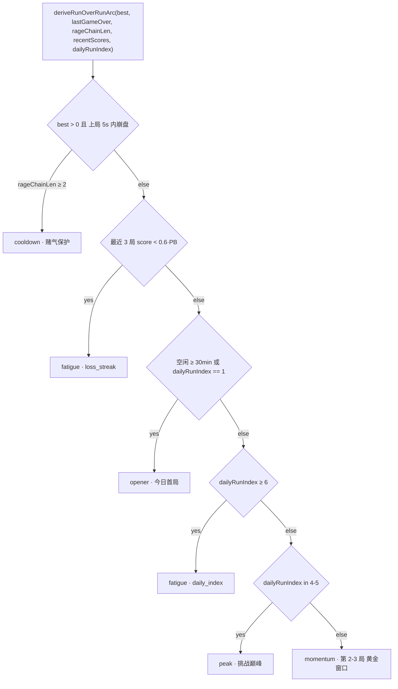
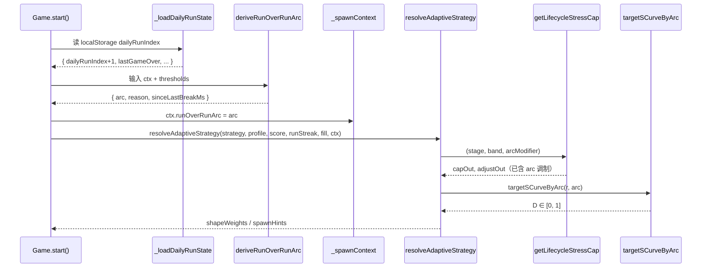

# 出块算法：算法工程师手册

> 本文是 OpenBlock **出块子系统**的算法侧统一手册。
> 范围：启发式与 SpawnPolicyNet 生成式双轨、共享上下文、护栏校验、训练/推理与数学化形式。
> 本手册是 OpenBlock 出块子系统的**统一权威文档**：在算法与模型工程主线（§1–§11）之外，已整合架构分层（§12）、出块建模与设计 rationale（§13）、难度调控与评估工具（§14）、参数寻优 SpawnParamTuner（§15）、局间难度 RoR（§十六）、温暖局 Warm Run（§十七）；运行时 10 信号融合与完整流水线深潜见 `ADAPTIVE_SPAWN.md`。
> 若需要横向理解 Spawn 与 RL、玩家画像、商业化、LTV、PCGRL 的模型契约，先读 [`MODEL_ENGINEERING_GUIDE.md`](./MODEL_ENGINEERING_GUIDE.md)。

---

## 目录

1. [问题形式化](#一问题形式化)
2. [双轨架构](#二双轨架构)
3. [规则引擎：约束 + 偏好分布](#三规则引擎约束-偏好分布)
4. [自适应映射：从画像到 stress](#四自适应映射从画像到-stress)
5. [SpawnTransformerV2 网络结构](#五spawntransformerv2-网络结构)
6. [SpawnTransformer 训练流程](#六spawntransformer-训练流程)
7. [SpawnTransformer 推理与回退](#七spawntransformer-推理与回退)
8. [SpawnPredictor：服务于 RL MCTS](#八spawnpredictor服务于-rl-mcts)
9. [完整公式速查](#九完整公式速查)
10. [完整参数表](#十完整参数表)
11. [演进与开放问题](#十一演进开放问题与-v3-落地)
   - 11.1 已识别的设计权衡
   - 11.2 候选改进 — 详细方案 × 实现（联合分布 / 风格化 / 真人接入 / PCGRL）
   - 11.3 开放研究点 — 实装方案（feasibility 嵌入 / LoRA / 多玩家迁移）
   - 11.4 训练 / 推理 / 部署 全链路
   - 11.5 完整损失公式
   - 11.6 实测参数与性能
   - 11.7 仍开放的研究问题
   - 11.8 文件入口速查
12. [出块算法架构总览（工程分层）](#十二出块算法架构总览工程分层)
13. [出块建模：双轨实现与设计 rationale](#十三出块建模双轨实现与设计-rationale)
14. [出块难度与评估](#十四出块难度与评估)
15. [出块参数寻优（SpawnParamTuner）](#十五出块参数寻优spawnparamtuner)
16. [局间难度（RoR）](#十六局间难度ror)
   - 16.1 为什么需要局间难度
   - 16.2 理论支撑与行业共识
   - 16.3 设计方案
   - 16.4 实现拆分
   - 16.5 模块契约与代码索引
   - 16.6 运营调参指南
   - 16.7 监控与回归
   - 16.8 回滚与降级策略
17. [温暖局（Warm Run）](#十七温暖局warm-run)
   - 17.1 设计目标与架构定位
   - 17.2 触发器矩阵
   - 17.3 三档强度
   - 17.4 预算管理与退出条件
   - 17.5 爽感主动编排
   - 17.6 出块后置校验
   - 17.7 intentResolver 集成
   - 17.8 配置、灰度与 AB 实验
   - 17.9 评估与观测
     - 17.9.1 面板可视化与决策透视（v1.70.1）
   - 17.10 模块契约与代码索引
   - 17.11 回滚与降级

---

> **快速定位**：如需端到端流水线全图，见下方架构图；
> 规则引擎细节见 §3，自适应映射见 §4，SpawnTransformer 见 §5。
>
> 
>
> 上图展示了 `generateDockShapes` 的 9 层全流水线：输入层（层 0）→ 盘面感知（层 1）→ 评分构建（层 2）→ 优先选拔（层 3）→ 加权补齐（层 4）→ 约束验证（层 5）→ 注入优化（层 6）→ 输出（层 7）→ 染色（层 8）。其中层 4 的 14 维权重链与 §3.2 的偏好分布函数直接对应；层 5 的约束校验与 §3.1 的硬约束集合完全吻合。

## 一、问题形式化

### 1.1 任务

每轮给玩家**三个不重复的形状** $(s_1, s_2, s_3)$，使得：

```
约束 (Hard Constraints):
  ∀ permutation π : 三块顺序放置都至少有一种存在解
  最低机动性 minMobility(fill) 满足
  形状唯一性 s_1 ≠ s_2 ≠ s_3

目标 (Soft Objectives):
  - 公平：玩家有合理概率消行
  - 心流：根据玩家状态调节难度
      - 爽感：把能力/心流/盘面机会转为多消、清屏兑现概率
  - 多样性：避免重复出现同类形状
  - 节奏：与 sessionPhase / runStreak 契合
```

### 1.2 数学化

形式化为**条件分布采样**：

$$
(s_1, s_2, s_3) \sim P(s_1, s_2, s_3 \mid \text{board}, \text{profile}, \text{history}) \cdot \mathbb{1}_{\mathcal{F}}
$$

- $\mathcal{F}$：可行域（满足硬约束）
- $P$：偏好分布（由策略组合编码）
- $\mathbb{1}_{\mathcal{F}}$：拒绝采样

### 1.3 不退化为单步问题的原因

如果只看"放第一块"，问题简化但不充分——**三块的协同**很重要：
- 三块都偏大 → 玩家很难放第三块
- 三块都偏小 → 玩家无法多消，节奏单调
- 三块都同色 → 偶然出现 bonus line，但缺乏多样性

→ 必须建模**联合分布**而非独立分布。

---

## 二、双轨架构

### 2.1 路线对比

| 路线 | 核心思想 | 优势 | 代价 |
|------|---------|------|------|
| **轨道一：启发式** | 手工特征 + 多层启发式 + 硬约束过滤 | 解释性强 / 可保证公平 / 零延迟 / 可兜底 | 规则复杂 / 风格难极致拟合 |
| **轨道二：生成式（SpawnPolicyNet）** | 学习 $P(s_1, s_2, s_3 \mid \text{ctx})$，带 feasibility、playstyle 与 LoRA 个性化 | 拟合真实玩家序列体验 / 支持个性化 | 需服务端模型 / 需前端护栏和回退 |

两条轨道共享 `buildSpawnModelContext()` 生成的上下文：难度模式、`AbilityVector`、`PlayerProfile` 实时状态、盘面拓扑、局内节奏、局间弧线、近期出块历史和规则轨 `spawnHints`。规则轨直接消费 `spawnHints`；生成式轨把同一份上下文编码为 `board/context/history/playstyle/targetDifficulty` 请求。

### 2.2 切换逻辑

`web/src/game.js` 根据 `getSpawnPolicyMode()` 在 `rule` 与 `model-v3` 间切换：

```js
function spawnNextBlocks() {
    const ctx = buildSpawnModelContext(grid, profile, adaptiveInsight);
    const ruleFallback = generateDockShapes(grid, layered, spawnContext);

    if (spawnMode === 'model-v3') {
        const result = await predictShapesV3(grid, profile, history, adaptiveInsight, ctx);
        if (result?.shapes && validateSpawnTriplet(grid, result.shapes).ok) {
            return result.shapes;
        }
        return ruleFallback; // 带 fallbackReason 记录到面板
    }
    return ruleFallback;
}
```

**回退原则**：服务不可用、输出不足 3 块、重复块、不可放、低机动性、危险填充下序贯不可解 → 自动用启发式，并记录 `fallbackReason` 供面板诊断。

### 2.3 部署位置

```
轨道一（启发式）：浏览器内 JS（web/src/adaptiveSpawn.js + web/src/bot/blockSpawn.js）
轨道二（生成式）：
  - 训练：rl_pytorch/spawn_model/（Python + PyTorch）
  - 推理：Flask `/api/spawn-model/v3/predict`
  - 真人网页主流程：`web/src/spawnModel.js` → `predictShapesV3()`
  - MCTS 出块预测（rl_pytorch/spawn_predictor.py）
```

---

## 三、规则引擎：约束 + 偏好分布

### 3.1 三层架构

```
Layer 1：盘面瞬时（几何 + 拓扑）
   ↓
Layer 2：局内体验（combo + 节奏 + 多样性）
   ↓
Layer 3：跨局/会话（热身 + 里程碑 + 冷却）
```

详见 [本手册 §12](#十二出块算法架构总览工程分层)。

### 3.2 算法核心

```python
def generateDockShapes(grid, profile, ctx, max_attempts=22):
    for attempt in range(max_attempts):
        # 1. 形状级评分
        for shape in all_28_shapes:
            features[shape] = analyze(grid, shape)  
            # gapFills, multiClear, holeReduce, mobility
            weight[shape] = base_weight(strategy) * augment_layers(features, profile)
        
        # 2. 两阶段构造 triplet
        triplet = []
        if clearGuarantee > 0:
            # 阶段 1：从能消行的子集占坑
            triplet += sample_from_clear_pool(weight, k=clearGuarantee)
        # 阶段 2：剩余槽位加权采样
        triplet += pick_weighted(remaining_pool, k=3 - len(triplet))
        
        # 3. 约束验证
        if not check_mobility(triplet, fill, attempt): continue
        if fill >= 0.52 and not triplet_sequentially_solvable(grid, triplet): continue
        
        # 4. 顺序随机化
        return fisher_yates_shuffle(triplet)
    
    # 失败：兜底简化路径
    return fallback_simple(grid)
```

### 3.2.1 Python RL 回退路径：`block_spawn.py` v2

当 `RL_SPAWN_ONLINE=0` 或 Node spawn-worker 不可用时，`rl_pytorch/simulator.py` 回退到 `rl_pytorch/block_spawn.py` 的启发式生成器。**v2** 升级在 v1 的机动性 + gap_fills 基础上，引入三层新能力：

**1. 盘面拓扑感知（`_BoardAnalysis`）**

利用 `fast_grid` 向量化特征提取，缓存当前盘面：空洞数、近满行列数、连通区域数、凹角数、列高标准差，计算综合 `board_quality ∈ [0, 1]`。

**2. 消行得分潜力评估**

| 函数 | 含义 |
|------|------|
| `_best_clear_count` | 该形状在所有合法位置的最大消行数 |
| `_avg_clear_count` | 能消行位置的平均消行数 |
| `_clear_position_ratio` | 能消行位置占所有合法位置的比例 |
| `_near_full_delta` | 放置后近满行列数的最大增量（造势能力） |
| `_scoring_potential` | 估算最大得分潜力（`base_unit × clears²`） |

**3. 产品目标对齐（`difficulty_target`）**

`_compute_shape_score` 综合权重公式：

```
total = base_weight
      × mobility_factor        (机动性保障，保留 v1)
      × clear_factor            (消行/得分潜力)
      × topology_factor         (盘面拓扑匹配)
      × size_mod               (difficulty_target 调制块大小偏好)
      × clear_emphasis          (relief→消行友好；pressure→约束空间)
      × gap_fill_bonus          (gap_fills × relief)
      × complement_factor       (dock 已选块互补)
```

`difficulty_target ∈ [0, 1]`：0.0 = 送爽（偏好消行友好 + 小块 + 高得分），0.5 = 标准均衡，1.0 = 加压（偏好大块 + 不规则块）。由 `simulator._difficulty_target_for_spawn()` 根据 `max_scd`（难度桶课程上限）、填充率（高填充减压）、得分进度（接近胜利加压）动态计算。

> **MLX 侧**：`rl_mlx/block_spawn.py` 已升级至 **v2-lite**（不依赖 `fast_grid` 的轻量版 v2）：支持 `difficulty_target ∈ [0,1]`、`pick_weighted` 边界修复、消行潜力评估（`_best_clear_count_pure` 纯 Python）、综合权重计算（`_compute_shape_score` 简化版）。`dock_color_bias.py` 已同步 web v1.60.26 拓宽（`empty ∈ [1, n-2]` + bias 衰减）。与 rl_pytorch v2+v3 相比缺少完整盘面拓扑分析（`_BoardAnalysis`）和构造式出块引擎（`spawn_construction.py`），如需同步需先移植 `fast_grid` 或提供等效接口。

### 3.2.2 构造式出块引擎：`spawn_construction.py` v1

v3 在 v2 加权采样之前，尝试通过**构造式搜索**直接生成满足特定产品目标的三块组合。当 `difficulty_target < 0.7` 时触发，使用独立 RNG 避免搜索消耗影响后续常规路径的随机性。

**四个构造器**（按触发优先级）：

| 构造器 | 触发条件 | 算法 | 产出 |
|--------|---------|------|------|
| `construct_perfect_clear` | `fill ≤ 0.35` 且 `occupied ≤ 20` 且 `relief > 0.4` | 反向构造启发 + 6 排列贪心验证 | 三块全放完后盘面为空 |
| `construct_mono_color` | 存在近满同色线且 `relief > 0.3` | 约束满足：精确填补空位 + 补齐可放三元组 | 触发 icon bonus 消行 |
| `construct_sequential_puzzle` | `fill ≥ 0.55` 且 `relief > 0.2` | 路径依赖：不可放块 B + 消行块 A → A 消行腾空间 → B 可放 | 必须按特定顺序放置 |
| `construct_multi_clear` | 通用兜底 | 随机采样 + 6 排列协同消行模拟 | 三块总消行 ≥ 阈值（relief > 0.5 时 ≥ 3，否则 ≥ 2） |

**关键设计决策**：

1. **协同消行 vs 独立消行**：构造器评估三块**序贯放置**的总消行数（`_sim_sequence_greedy`），而非单块在原始盘面上的独立消行能力。这更贴合实际游戏体验。
2. **搜索预算自适应**：`budget = 120 × (0.6 + 0.8 × relief)`，送爽时搜索更深。
3. **路径依赖安全性**：`sequential_puzzle` 返回的三块中可能有当前不可放置的块（需先消行腾空间），这在 OpenBlock 的 dock 机制中是允许的——玩家可以按任意顺序放块。

> **业界算法融合**：反向构造（Block Blast）、前向协同模拟（Tetris AI）、约束满足（Sturgeon / CSP）、路径依赖（Path Dependency PCG）。

### 3.2.3 拥挤多消（偶发性爽感兑现）v1.70

**产品意图**：爽感是游戏中**偶发性、关键性**的体验。当盘面又挤又乱、玩家快撑不住的紧张时刻，按一定概率「偶发」投放能一手多消（≥2 行/列）的块，让盘面瞬间变清爽 → 制造关键性爽感峰值。

**盘面拥挤复合分** `computeBoardCrowding(topo, fill) ∈ [0,1]`（web 主端，`blockSpawn.js`）：

```
crowding = clamp01(
    fill                              × 0.40   // 拥挤（空间密度）
  + min(1, contiguousRegions / 8)     × 0.25   // 杂乱（空格碎片化）
  + min(1, enclosedVoidCells / 10)    × 0.25   // 杂乱（被圈住的小空腔）
  + min(1, (rowTransitions+colTransitions) / 40) × 0.10  // 杂乱（轮廓锯齿度）
)
```

**触发链**（web `blockSpawn.generateDockShapes` 构造预扫描）：

```
启用 constructiveSpawn + adaptive 路径（pressurePhase 显式）
  且 constructCooldown == 0
  且 crowding ≥ crowdedMultiClearMinCrowding（默认 0.55）
  且 存在 multiClear≥2 的非 special 候选
  且 rng() < p
→ 标记最优多消块（multiClear 降序，并列大块优先）占 clearSeat，constructive.kind='multiClear'

p = min(pCap, pMultiClearCrowded × (0.5 + crowding) × (1 + delightBoost × 0.5))
  pMultiClearCrowded 默认 0.35，pCap 默认 0.85
```

**关键设计决策**：

1. **跨所有压力相位生效**：拥挤本身就是触发条件，高压盘面的多消兑现爽感最强；与 C1/C2/C3 **互斥**（命中即跳过其余构造分支，含高压顺序锚 C3）。
2. **接入既有爽感闭环**：`delightBoost`（来自 `adaptiveSpawn.deriveDelightTuning`，含 `isDelightStarved` 抬升）越高越易触发，玩家越「久旱」越倾向投放多消。
3. **防脚本感**：低基础概率（0.35）+ `cooldownDocks` 冷却（交付后 N dock 不重复强供），保证「偶发性」而非「系统连发喂解」。
4. **special 隔离**：候选池排除 12 个 special 形状（special 仅由 `_tryInjectSpecial` 事件注入）。

**多端一致性**：

| 端 | 实现 | 触发信号 |
|----|------|---------|
| web 主端 | `blockSpawn.js` `computeBoardCrowding` + 构造预扫描 `crowdMcFired` 分支 | `topo`（fill/contiguousRegions/enclosedVoidCells/transitions）+ `delightBoost` hint |
| Cocos / 小程序 | 机械同步 web `blockSpawn`（`engine/bot/blockSpawn.mjs` / `miniprogram/core/bot/blockSpawn.js`）+ `game_rules.json` | 同 web（逐字一致） |
| rl_pytorch（RL 离线回退） | `_BoardAnalysis.crowding` + `_try_constructive_spawn` 拥挤多消优先分支（优先级高于 sequential_puzzle） | `fill/contiguous_regions/concave_corners/holes`，`relief = 1 - difficulty_target` 作 delight 代理 |
| rl_mlx | 维持 v2-lite（无 `fast_grid`/构造引擎），不含拥挤多消构造 | — |

> **配置**：`shared/game_rules.json` → `adaptiveSpawn.constructiveSpawn`：`crowdedMultiClearMinCrowding` / `pMultiClearCrowded` / `pMultiClearCrowdedCap`。`enabled=false` 时与旧行为等价。

#### 3.2.3.1 高填充率成功率优化（v1.70.2）

v1.70 的拥挤多消有三处会导致**高填充率（fill ≥ 0.7）下命中率不达预期**的瓶颈，本版定向修复：

1. **采样器依赖瓶颈**：原实现 `scored.filter(s => s.multiClear ≥ 2)` 完全依赖采样器是否恰好生成了多消候选。高 fill 时大块在 augmentPool 被限流、补全块只能补单线 → scored 池常无 `multiClear ≥ 2` 候选 → 拥挤多消整段直接 fallback。
2. **高压相位无 C1 兜底**：原 v1.67 严格 `pressurePhase !== 'high'` 才进 C1 单线补全分支，高压在 crowdMc 未命中时**彻底没有构造爽感**。
3. **静态 crowding 阈值**：0.55 对"fill ≈ 0.7 但盘面相对整齐（contiguousRegions/voids 小）"的玩家不友好，明明很挤但不达阈值。

修复方案（保留概率式 + 冷却契约）：

| 优化 | 实现 | 影响 |
|---|---|---|
| **主动构造多消** | scored 池缺多消候选时，调用 `findMultiClearCompleter` 从**全词表**（过滤 special + canPlaceAnywhere + weights）搜索，把命中形状构造为最小 score 项 unshift 到 scored 头部，并标记 `_injected='multiClear'` | 拥挤多消不再 100% 依赖采样器，预期命中率 +15~25 个百分点 |
| **高压 C1 兜底 + 全词表回退** | `pCompleterHigh=0.15`（low 的 1/5）让 high 也能走 C1 单线补全；mid/high 在 scored 池找不到补全 id 时回退到全词表 + 注入 | 高压在 crowdMc 未命中时仍有"补单线"的爽感小路径 |
| **自适应阈值** | `isDelightStarved=true` → `-0.10`；`delightBoost ≥ 0.6` → `-0.05`；最低 0.30 防误触 | 爽感饥渴玩家的拥挤多消触发面扩大 ~30% |
| **诊断字段** | `constructive.kinds[]` / `injectedMultiClear` / `injectedCompleter` / `crowdThreshold` / `crowdStarved` | 完整还原构造决策链 |
| **adaptiveSpawn 透出 `_delightStarved`** | blockSpawn 内 profile 是 layered._xxx 重建的本地对象（无方法），必须通过 `strategyConfig._delightStarved` 字段读取 | 修复"profile.isDelightStarved 永远 undefined"的隐藏 bug |

**默认参数（`shared/game_rules.json → adaptiveSpawn.constructiveSpawn`）**：

```jsonc
{
  "pCompleterHigh": 0.15,
  "crowdedThresholdStarvedDelta": 0.10,
  "crowdedThresholdHighBoostDelta": 0.05,
  "injectMultiClearBudget": 4000
}
```

**单次 dock 决策开销**：`findMultiClearCompleter` budget=4000 + `findCompleterShapes` 全词表 budget=4000，加起来 < 5ms（在 8×8 + 40 形状词表上经验值），可放心默认开启。

#### 3.2.3.2 构造未达成续约 + maxEmpty 自适应（v1.70.3）

v1.70.2 的"主动注入"解决"候选不够"，但没有解决"候选够 + 概率没掷中"的失败。例如 `pMultiClearCrowded × scale = 0.46` 仍有 54% 概率掷不中——单 dock 体感"差一口气"。v1.70.3 引入两个机制再上一层：

| 机制 | 实现 | 设计动机 |
|---|---|---|
| **续约（retry）** | `ctx.constructiveRetry` 跨 dock 计数。上一轮未达成时 `commitSpawnContext` 累加；本轮 blockSpawn 给 `pComp/pMc` 概率叠加 `retryBoost`（默认 +0.25），最多续约 `retryMaxRounds`（默认 2）轮。达成或超限归零。 | 一次失败不至于直接归零成功率，给"差一口气"的玩家 1~2 轮兜底窗口；同时设上限避免长期叠 boost 失控。 |
| **maxEmpty 自适应** | `fill ≥ 0.55` 时 `effectiveMaxEmpty = maxEmptyHigh=3`，否则 2。让 `findCompleterShapes` / `findMultiClearCompleter` 在高 fill 时覆盖"差 3 格"的近满线。 | 高 fill 时 nearFull 线常分布更宽（多列被打散），原 maxEmpty=2 会漏掉很大一部分可补全的线；低 fill 维持 2 避免过早误报。 |

**续约触发条件（commitSpawnContext.js §8）**：
- 累加：`constructive.enabled=true && !cooldownActive && !delivered`，且 `(completerCount > 0) || (crowdMultiClearCount > 0) || (kind != null) || (injectedMultiClear > 0) || (injectedCompleter > 0)`（"有诚意但没成"）
- 归零：`delivered=true` 或 `retryCount > retryMaxRounds`
- 保持：`cooldownActive=true`（不累加不归零）

**面板可视化（v1.70.3 同步落地）**：
- `playerInsightPanel.spawnDecisionCard` 新增 6 cells：`构造（kinds+✓/○）` / `拥挤（crowding/threshold·饥）` / `注入（Mc/Cp）` / `续约（count+boost）` / `冷却` / `空格（≤N）`。
- `decisionFlowViz.hintEntries` 追加 5 个虚拟 hint：`constructiveKind` / `constructiveCrowd` / `constructiveRetry` / `constructiveInject` / `constructiveCooldown`，hover tip 含"含义 + 触发链 + 默认值"三段。

**默认配置**：

```jsonc
{
  "retryBoost": 0.25,
  "retryMaxRounds": 2,
  "maxEmptyHigh": 3,
  "maxEmptyFillThreshold": 0.55,
  "pCompleterHigh": 0.22,
  "pMultiClearCrowded": 0.45
}
```

### 3.3 加权抽样公式

```
P(shape_i selected) = w_i / Σ w_j

其中 w_i 是 base_weight × Π adjustments
adjustments 包括：
  - shapeWeights[category]            (策略基础)
  - mobility_factor                    (能放几次)
  - hole_reduction_bonus              (能补洞？)
  - multi_clear_bonus                 (能多消？)
  - delight_bonus                     (能力/心流驱动的爽感兑现)
  - perfect_clear_bonus               (清屏机会兑现)
  - icon_bonus_target                 (同 icon/同色 bonus 染色目标，game.js 消费)
  - combo_bonus                        (链 combo？)
  - sizePreference_factor             (适配大小偏好)
  - diversity_penalty                 (该类已用过？)
  - milestone_bonus                   (里程碑相关？)
```

### 3.4 序贯可解性

`tripletSequentiallySolvable(grid, triplet, budget)`:

```python
def solvable(grid, triplet, budget=300):
    # 对 6 种排列做 DFS
    for perm in permutations(triplet):
        if dfs_place(grid.copy(), perm, budget) == True:
            return True
    return False

def dfs_place(g, blocks, budget):
    if not blocks: return True
    if budget <= 0: return False
    block = blocks[0]
    for pos in g.legal_positions(block):
        g.place(pos)
        if dfs_place(g, blocks[1:], budget - 1):
            return True
        g.undo()
    return False
```

**复杂度**：最坏 $O(\text{positions}^3)$，一般 budget 早终止 → 实际 < 10ms。

### 3.5 危险态严格校验

```
fill ∈ [0.68, 0.75): 抬高 minMobility 与 budget × 1.5
fill ∈ [0.75, 0.88): budget × 2，预算耗尽即拒绝（不再放行）
fill ∈ [0.88, ∞]   : budget × 3，danger zone，最严格
```

---

## 四、自适应映射：从画像到 stress

### 4.1 stress 综合公式

`adaptiveSpawn.js` 的 `resolveAdaptiveStrategy`：

```js
stress = scoreStress           // 按个人百分位映射；远未达到 bestScore 时大幅衰减
       + difficultyBias        // easy(-0.22) / normal(0) / hard(+0.22)
       + skillAdjust           // 高技能加压
       + flowAdjust            // bored 加 / anxious 减
       + recoveryAdjust        // needsRecovery 减
       + frustRelief           // frustration ≥ 4 → -0.18
       + comboAdjust           // combo ≥ 3 → +0.06
       + nearMissAdjust        // hadRecentNearMiss → -0.10
       + feedbackBias          // 闭环反馈 ±0.10
       + trendAdjust           // trend 进步加压（×conf）
       + sessionArcAdjust      // warmup -0.08
       + holeReliefAdjust      // 不可覆盖空洞压力触发减压
       + boardRiskReliefAdjust // 高填充 + 空洞 + 能力风险综合减压
       + abilityRiskAdjust     // 玩家能力风险护栏
       + delightStressAdjust   // 高技能无聊轻加压；焦虑/恢复降压
        + friendlyBoardRelief;  // 清爽盘面 + 兑现期主动减压（≤ 0）

stress = clamp(stress, -0.2, 1);

// 拟人化对齐 — flow + payoff + 安全盘面时把 stress 软封顶到 tense 区上沿（默认 0.79）
if (flowState === 'flow' && rhythmPhase === 'payoff' && holes === 0
    && boardRisk < flowPayoffMaxBoardRisk) {
    stress = min(stress, flowPayoffStressCap);
}
```


### 4.1.x 跨局画像调制（生命周期 stage × 成熟度 band）

§4.1 公式得到 `rawStress` 后，进入 `clamp([-0.2, 1])` 之前，会再走一道**跨局画像驱动的硬调制**：

$$
\text{stress}_\text{final} = \text{clamp}\!\big(\min(\text{stress}_\text{raw},\ \text{cap}_{(s,b)}) + \delta_{(s,b)},\ -0.2,\ 1.0\big)
$$

其中 $(\text{cap}_{(s,b)},\ \delta_{(s,b)})$ 来自 `web/src/lifecycle/lifecycleStressCapMap.js` 的 17 项查表，索引 $s \in \{S_0..S_4\}$（生命周期阶段，由 `daysSinceInstall + totalSessions + daysSinceLastActive` 三项 AND 门派生）、$b \in \{M_0..M_4\}$（成熟度档位，由 maturity SkillScore 阈值 ≥90/80/60/40/<40 派生）。

**调制矩阵**：

|        | M0 | M1 | M2 | M3 | M4 |
|--------|----|----|----|----|----|
| **S0** | (0.50, −0.15) | — | — | — | — |
| **S1** | (0.60, −0.10) | (0.65, −0.05) | (0.70, 0) | — | — |
| **S2** | (0.65, −0.10) | (0.70, 0) | (0.75, +0.05) | (0.82, +0.10) | — |
| **S3** | — | (0.72, 0) | (0.78, +0.05) | (0.85, +0.10) | **(0.88, +0.12)** |
| **S4** | (0.55, −0.15) | (0.60, −0.10) | (0.70, 0) | (0.75, +0.05) | (0.80, +0.08) |

**两个维度的影响幅度**：

- **band 横向移动（同 stage）**：M0→M4 → cap 抬升 0.16~0.25 → 对应 §4.2 的 10 档 profile 的 **3–4 档**差距（profile_levels 跨度 0.4–0.6）；
- **stage 纵向移动（同 band）**：保护期 (S0/S4) vs 挑战期 (S2/S3) cap 差 0.10–0.30 → 同 band 下保护期玩家拿到的形状权重明显偏向 §4.2 的低 stress 档位。

**未在矩阵内的组合（如 S3·M0、S0·M3）**：`getLifecycleStressCap` 返回 `null`，本调制段直接跳过——产线分布极低（如 stability 期玩家的 SkillScore 不会还在 M0），仅由通用 stress 通路 + onboarding/winback 特例处理。

**关键设计：M-band SkillScore ≠ §4.1 公式中的 `skill_z`**：

| 字段 | 出处 | 时间窗 | 在算法中的作用 |
|---|---|---|---|
| `skill_z` (本节 §4.1) | `playerProfile.skill` → `AbilityVector.skillScore` | 局内每帧 EMA | 直接进 `skillAdjust = ±0.15·tanh(z)` |
| maturity SkillScore | `retention/playerMaturity.calculateSkillScore` | 跨局按天 EMA，仅在 `onSessionEnd` 写盘 | 仅决定 M-band → 进本节调制矩阵 |

二者**正交**——一个调"局内难度微调"，一个调"跨局难度上限"。详见 `playerAbilityModel.js` 与 `playerMaturity.js` 的 docstring 警示，以及 [`ADAPTIVE_SPAWN.md` §5.1.2](./ADAPTIVE_SPAWN.md#512-生命周期--成熟度-stress-调制v132)。


### 4.2 10 档 profile 插值

`shapeWeights` 在 10 档预设之间按 stress 线性插值：

```
profile_levels = [-0.2, -0.1, 0, 0.1, 0.2, 0.4, 0.6, 0.8, 0.9, 1.0]
         （每档对应一组 shapeWeights）

if stress ∈ [a, b]:
    t = (stress - a) / (b - a)
    weight[k] = profile_a[k] · (1 - t) + profile_b[k] · t
```

### 4.3 spawnHints

除了 stress（连续量），还输出离散结构：

```js
{
    clearGuarantee: 0|1|2|3,     // 必须消行的形状数
    sizePreference: -1..1,        // -1 偏小 / +1 偏大
    diversityBoost: 0|1|2,        // 多样性强度
    comboChain: bool,             // 是否鼓励连击
    multiClearBonus: bool,        // 是否鼓励大消
    delightBoost: 0..1,           // 能力/心流驱动的多消爽感兑现
    perfectClearBoost: 0..1,      // 清屏兑现强度
    iconBonusTarget: 0..1,        // 同 icon/同色 bonus 兑现强度
    targetSolutionRange: object,  // 解法数量目标区间
    holePressure: implicit,       // 来自 spawnContext.holes 的拓扑压力
    delightMode: string,          // challenge_payoff / flow_payoff / relief / neutral
    rhythmPhase: 'tension'|'release',
    milestoneEcho: 'pre'|'post'|null,
    spawnIntent: 'relief'|'engage'|'pressure'|'flow'|'harvest'|'maintain'  // 意图单一口径
}
```

`spawnIntent` 是所有"意图描述"的统一字段：
- `playerInsightPanel` 直接以「意图 X」pill 展示当前 spawnIntent。
- `stressMeter.buildStoryLine` 优先用 `SPAWN_INTENT_NARRATIVE[spawnIntent]` 作为叙事文案，仅在 `boardRisk≥0.6` 或挫败/恢复主导时被覆盖。
- `monetization/personalization.updateRealtimeSignals(profile, { spawnIntent })` 把意图带入商业化策略，回放标签同源。
- `spawnIntent = 'harvest'` 触发条件：`nearFullLines ≥ 2  OR  (pcSetup ≥ 1 AND fill ≥ PC_SETUP_MIN_FILL=0.45)`。同口径覆盖 `deriveRhythmPhase` 与所有"基于玩家状态升 payoff"的分支。

### 4.4 爽感兑现层

`adaptiveSpawn.js` 额外计算 `deriveDelightTuning()`，把 `skillLevel`、`flowState`、`momentum`、`needsRecovery` 与 `spawnContext.nearFullLines/pcSetup` 映射到三类信号：

- `challenge_payoff`：高技能且无聊时，略提高 stress，并提高 `delightBoost` / `multiLineTarget`，让难度上升同时给出多消回报。
- `flow_payoff`：玩家处于心流或释放期时，不强行升压，主要提高多消/清屏候选概率。
- `relief`：焦虑或恢复态时降低 stress、偏小块、提高消行保证，同时保留救援式多消机会。

`blockSpawn.js` 消费这些信号时只改变软权重：`pcPotential`、`multiClear`、`gapFills` 的排序和抽样倍率会上升；若存在一手清屏块，会优先占用一个出块槽位。但三连块仍必须通过 `minMobilityTarget`、序贯可解性和解法数量过滤，避免“为了爽感破坏公平”。

同 icon / 同色 bonus 不在 `blockSpawn.js` 里硬挑形状，而在 `game.js` 的 dock 颜色采样层实现：先用 `monoNearFullLineColorWeights(grid, skin)` 扫描差 1～2 格且已填部分同 icon/同色的行列，再按 `iconBonusTarget` 放大这些颜色的抽样权重。这样形状选择仍服务可放置性，颜色选择服务 bonus 兑现，两者各自可解释。

临消与多消机会采用 **可填充感知** 口径：`nearFullLines` / `close1` / `close2` 不只看行列还差几个空格，还要求这些缺口能被当前形状库的某个合法放置覆盖。不可覆盖空洞造成的“假近满行”不会再触发 payoff、多消或清屏兑现加权。

---

## 五、SpawnTransformerV2 网络结构

### 5.1 整体架构（`rl_pytorch/spawn_model/model.py`）

```
输入：
  board:    [B, 8, 8] float（占用 0/1）
  context:  [B, 24] float（玩家画像 + 实时信号）
  history:  [B, 3, 3] long（最近 3 轮的 3 个 shape_id）
  target_difficulty: [B, 1] float（0~1，可控压力）

编码层：
  state_token = LayerNorm(GELU(Linear(board.flat ⊕ context, d_model)))   # [B, 1, 128]
  diff_token  = LayerNorm(GELU(Linear(target_difficulty, d_model)))       # [B, 1, 128]
  history_emb = shape_embed(history.flat) + positional_embed              # [B, 9, 128]
  cls_token   = learnable_param                                           # [B, 1, 128]

序列：
  tokens = [CLS, state, diff, history_0, history_1, ..., history_8]       # [B, 12, 128]

Transformer Encoder：
  num_layers = 2
  nhead = 4
  dim_feedforward = 256
  activation = GELU
  → tokens_out [B, 12, 128]

输出头（从 CLS token）：
  cls_out = norm(tokens_out[:, 0])                                        # [B, 128]
  
  shape_logits_0 = head_0(cls_out)  # [B, NUM_SHAPES=40]（含 12 个 2-3 格新形状，详见 ADAPTIVE_SPAWN §10.7）
  shape_logits_1 = head_1(cls_out)
  shape_logits_2 = head_2(cls_out)
  
  diversity_logits = diversity_head(cls_out)  # [B, NUM_CATEGORIES * 3]
  difficulty_pred  = difficulty_head(cls_out) # [B, 1]
```

### 5.2 关键设计

#### 三个独立 shape head

```
head_0 / head_1 / head_2 各自输出 28 维 logits
```

**为什么不是 softmax 共享**？

- 三槽**不对称**：第一槽通常重要（玩家习惯先选）
- 各槽独立学的概率分布更精细
- 三槽分布**联合**才形成 dock，下游可做 max-product 联合采样

#### 难度条件化

```python
target_difficulty: [B, 1] in [0, 1]
diff_token = embed(target_difficulty)
```

推理时可**主动控制**：

```python
# 想要简单 dock：
predictor.predict(board, ctx, history, target_difficulty=torch.tensor([[0.2]]))
# 想要困难 dock：
predictor.predict(board, ctx, history, target_difficulty=torch.tensor([[0.8]]))
```

这使推理时可以主动控制难度分布。

#### 辅助 head：对抗"分数膨胀"

```
diversity_head:    预测三槽的品类分布（鼓励多样）
difficulty_head:   预测真实难度（监督训练防与 target_difficulty 偏离）
```

防止网络学到"反正怎么都给容易消行的块" 的捷径。

### 5.3 参数量

```
shape_embed:           29 × 128       =  3712
board_proj:            (64+24)×128 + 128×128 ≈ 27K
difficulty_proj:       1×128 + 128×128 ≈ 16K
history_pos:           9 × 128        =  1152
cls_token:             128
TransformerEncoder × 2: ~133K
norm:                  128 × 2        =  256
3 × shape_head:        128 × 28 × 3   =  10752
diversity_head:        128 × NUM_CAT × 3 ≈ 2.7K
difficulty_head:       128 × 1        =  128

总计 ≈ 195K-200K 参数
```

属于**轻量级 Transformer**，可在 CPU 实时推理（< 5ms）。

---

## 六、SpawnTransformer 训练流程

### 6.1 训练数据来源

```
来源 1：人类对局回放
   - 真实玩家 dock 选择（"专家示范"）
   - 训练目标：拟合真实玩家分布
   
来源 2：规则引擎对局
   - generateDockShapes 输出 + 同步 board context
   - 训练目标：让 ML 至少能复现规则的好性质
   
来源 3：自博弈生成
   - 用 RL Bot 玩规则引擎对局
   - 收集 (board, context, dock) 样本
```

### 6.2 数据格式

```python
sample = {
    'board':            (8, 8) int 0/1,
    'context':          (24,) float（player_profile + realtime signals）,
    'history':          (3, 3) int（前 3 轮 dock）,
    'target_dock':      (3,) int（实际给出的 shape_ids）,
    'difficulty':       float（实际难度估计）,
    'category_dist':    (NUM_CATEGORIES * 3,) float（三槽品类 one-hot 拼接）
}
```

### 6.3 24 维 context

| 索引 | 含义 |
|-----|------|
| 0-3 | profile.skillLevel, .historicalSkill, .trend, .confidence |
| 4-7 | profile.flowDeviation, .frustrationLevel, .momentum, .cognitiveLoad |
| 8-9 | profile.sessionPhase, .pacingPhase（one-hot 简化） |
| 10-13 | adaptive.scoreStress, .totalStress, .recoveryAdjust, .frustRelief |
| 14-17 | hints.clearGuarantee, .sizePreference, .diversityBoost, .comboChain |
| 18-21 | runStreak, gameOverCount, totalSpawns, sessionDuration |
| 22-23 | reserved |

### 6.4 损失函数

$$
\mathcal{L} = \mathcal{L}_{\text{shape}} + \alpha \cdot \mathcal{L}_{\text{div}} + \beta \cdot \mathcal{L}_{\text{diff}}
$$

#### Shape loss（主任务）

$$
\mathcal{L}_{\text{shape}} = -\sum_{i=0}^{2} \log P(s_i^* \mid \text{ctx})
$$

三个槽位的交叉熵之和。

#### Diversity loss（辅助）

$$
\mathcal{L}_{\text{div}} = \text{CrossEntropy}(\text{div\_logits}, \text{category\_dist}^*)
$$

让网络学会预测三槽的**品类分布**。

#### Difficulty loss（辅助）

$$
\mathcal{L}_{\text{diff}} = (\text{diff\_pred} - \text{difficulty}^*)^2
$$

训练时 `target_difficulty` 喂入，预测应 ≈ 真实难度。

#### 默认权重

```
α (diversity) = 0.1
β (difficulty) = 0.05
```

主任务为主，辅助为 regularization。

### 6.5 训练命令

```bash
python -m rl_pytorch.spawn_model.train \
    --data-path data/spawn_training.jsonl \
    --epochs 50 \
    --batch-size 256 \
    --lr 3e-4 \
    --output rl_checkpoints/spawn_v2.pt
```

### 6.6 训练监控

| 指标 | 健康值 |
|-----|-------|
| shape_loss | 下降到 < 1.5（28 类 random ~ ln 28 ≈ 3.3） |
| div_loss | 下降到 < 0.5 |
| diff_loss | 下降到 < 0.05 |
| top-1 acc per slot | > 25%（> uniform） |
| top-5 acc | > 65% |

---

## 七、SpawnTransformer 推理与回退

### 7.1 推理流程

```python
def predict_next_shapes(board, ctx, history, target_diff=0.5):
    with torch.no_grad():
        out = model(board, ctx, history, target_diff)
        # out = {logits: (l_0, l_1, l_2), div_logits, diff_pred}
    
    probs_0 = softmax(out.logits[0])  # [28]
    probs_1 = softmax(out.logits[1])
    probs_2 = softmax(out.logits[2])
    
    # 联合采样：避免重复
    s_0 = sample(probs_0)
    probs_1[s_0] = 0; probs_1 /= probs_1.sum()  # mask
    s_1 = sample(probs_1)
    probs_2[s_0] = 0; probs_2[s_1] = 0; probs_2 /= probs_2.sum()
    s_2 = sample(probs_2)
    
    return [s_0, s_1, s_2]
```

### 7.2 推理验证

```python
def validate(triplet, grid, profile):
    if len(set(triplet)) != 3: return False  # 不重复
    if not triplet_sequentially_solvable(grid, triplet): return False
    if not check_mobility(triplet, grid.fill_ratio): return False
    return True
```

**关键**：ML 输出的 dock 仍要过**规则引擎的硬约束**——避免给玩家不公平的死局。

### 7.3 回退策略

```
Step 1: 模型未加载 → 规则引擎
Step 2: 推理失败（OOM / NaN）→ 规则引擎
Step 3: 验证失败（不公平）→ 重采样 max 3 次 → 规则引擎
Step 4: 多次回退后 → 标记降级（log + metric）
```

### 7.4 性能

| 指标 | CPU | MPS/CUDA |
|-----|-----|---------|
| 单次推理 | 3-8 ms | < 1 ms |
| 内存 | ~50 MB | ~30 MB |
| ModelLoad | ~200 ms | ~150 ms |

---

## 八、SpawnPredictor：服务于 RL MCTS

### 8.1 用途

RL Bot 在 MCTS 模拟时面临一个困境：

```
MCTS 节点 N → 模拟 K 步
  当前 dock 是确定的 d
  但 K 步后玩家会消耗 d，下一轮 dock' 是哪 3 个？
```

**简单方案**：假设 dock' 与 d 相同（**乐观偏差**——不切实际）。  
**完美方案**：用 SpawnTransformer 预测 dock' 分布，对多个 sample 取期望 V。

### 8.2 SpawnPredictor 接口

```python
class SpawnPredictor:
    @classmethod
    def load(cls, ckpt_path, device):
        ...
    
    def predict_next_shapes(self, board, context, history) -> dict:
        """返回每槽的概率分布"""
        return { 'probs': [(28,), (28,), (28,)] }
    
    def sample_dock_from_distribution(self, distr, n_samples=4):
        """采样 n 组 dock"""
        return [[s_0, s_1, s_2], ...]
    
    def expected_value(self, sim, policy_net, n_samples=4):
        """对 n 组 dock 取平均 V(s)"""
        v_total = 0
        for dock_sample in self.sample_dock_from_distribution(...):
            sim_copy = copy(sim)
            sim_copy.set_dock(dock_sample)
            v = policy_net.forward_value(sim_copy.state)
            v_total += v
        return v_total / n_samples
```

### 8.3 在 MCTS 中的使用

```python
# rl_pytorch/mcts.py 节选
def expand_node(node, predictor, policy_net):
    if node.dock_consumed:  # 三块都用完了
        v_expected = predictor.expected_value(node.sim, policy_net, n_samples=4)
        node.value = v_expected
    else:
        node.value = policy_net.forward_value(node.state)
```

预期效果：
- 价值估计偏差 ↓
- MCTS 探索更准确
- 蒸馏到策略网络的 Q target 质量提升

### 8.4 与 RL 主线的解耦

```
SpawnTransformer 是"独立训练的辅助模型"：
  - 训练：spawn_model/train.py
  - checkpoint: rl_checkpoints/spawn_v2.pt
  - 加载：仅在 SpawnPredictor.load() 时

主 RL 训练循环 (rl_pytorch/train.py)：
  - 默认：assume next dock = current dock（简化）
  - 启用：SpawnPredictor 提升 MCTS 准确性
```

环境变量控制：

```bash
RL_SPAWN_PREDICTOR=1   # 启用
RL_SPAWN_MODEL_PATH=path/to/spawn.pt  # 自定义路径
```

---

## 九、完整公式速查

### 9.1 stress 综合

$$
\text{stress} = \text{clamp}\left(\sum_i \text{adjust}_i, -0.2, 1\right)
$$

### 9.2 profile 插值

$$
w_k = w_k^{(a)} \cdot (1 - t) + w_k^{(b)} \cdot t, \quad t = \frac{\text{stress} - \text{stress}_a}{\text{stress}_b - \text{stress}_a}
$$

### 9.3 加权抽样

$$
P(\text{shape}_i) = \frac{w_i \cdot \prod_j f_j(\text{shape}_i, \text{ctx})}{\sum_k w_k \cdot \prod_j f_j(\text{shape}_k, \text{ctx})}
$$

### 9.4 SpawnTransformer 损失

$$
\mathcal{L} = \sum_{i=0}^{2} \text{CE}(\text{logits}_i, s_i^*) + 0.1 \cdot \text{CE}(\text{div\_logits}, c^*) + 0.05 \cdot (\hat{d} - d^*)^2
$$

### 9.5 联合采样（避免重复）

$$
P(s_2 \mid s_0, s_1) = \frac{P(s_2)}{1 - P(s_0) - P(s_1)} \cdot \mathbb{1}_{s_2 \neq s_0, s_1}
$$

---

## 十、完整参数表

### 10.1 规则引擎

| 参数 | 默认 |
|------|------|
| `MAX_SPAWN_ATTEMPTS` | 22 |
| `SURVIVE_SEARCH_BUDGET` | 300 |
| `FILL_SURVIVABILITY_ON` | 0.52 |
| `DANGER_ZONE_FILL` | 0.68 |
| `STRICT_DANGER_FILL` | 0.75 |
| `EXTREME_DANGER_FILL` | 0.88 |
| 形状池大小 | **40**（原 28 + 12 个 2-3 格新形状，详见 [ADAPTIVE_SPAWN §10.7](./ADAPTIVE_SPAWN.md#107-形状池扩展v1600)） |
| dock 槽位 | 3 |

### 10.2 难度模式

| Mode | difficultyBias | initialFill |
|------|---------------|-------------|
| easy | -0.12 | 0.0 |
| normal | 0 | 0.20 |
| hard | +0.12 | 0.25 |

### 10.3 SpawnTransformerV2

| 参数 | 默认 |
|------|------|
| d_model | 128 |
| nhead | 4 |
| num_layers | 2 |
| dim_feedforward | 256 |
| dropout | 0.1 |
| NUM_SHAPES | 28 |
| CONTEXT_DIM | 24 |
| HISTORY_LEN | 3（轮）× 3（槽） |
| 总参数量 | ~200K |

### 10.4 训练

| 参数 | 默认 |
|------|------|
| epochs | 50 |
| batch_size | 256 |
| lr | 3e-4 |
| optimizer | Adam |
| α (diversity) | 0.1 |
| β (difficulty) | 0.05 |

---

## 十一、演进、开放问题与 V3 落地

下面表中的 4 个 V3 候选改进与 3 个开放研究点已全部完成第一版实装——汇总在 `SpawnPolicyNet` + `feasibility` + `lora` + `shape_proposer` 四组模块；本节给出深化设计 + 算法方案 + 实现路径。

### 11.1 已识别的设计权衡（保留）

| 决策 | 优势 | 代价 | V3 是否解决 |
|-----|------|-----|------------|
| 规则引擎为主 | 公平 + 可解 | 风格难极致拟合 | △（仍保留 fallback） |
| ML 仅做先验 / MCTS | 不影响真人公平性 | ML 价值受限 | ✅（服务真人，硬约束兜底） |
| 28 个固定形状 | 易测 / 易回放 | 多样性上限 | ✅（PCGRL 雏形作研究入口） |
| 三槽独立 head | 精度 | 联合分布建模弱 | ✅（改为 autoregressive） |

### 11.2 V3 候选改进 — 详细方案 × 实现

#### 11.2.1 联合分布建模 — Autoregressive joint decoding

**问题**：三槽独立 head 输出 $P(s_0)$、$P(s_1)$、$P(s_2)$，三者无条件依赖。但实际三块协同性极强（全大块/全小块/全同色都是糟糕组合）。

**方案**：把三槽改写为**自回归**生成

$$
P(s_0, s_1, s_2 \mid \text{ctx}) = P(s_0 \mid \text{ctx}) \cdot P(s_1 \mid \text{ctx}, s_0) \cdot P(s_2 \mid \text{ctx}, s_0, s_1)
$$

实现要点（`rl_pytorch/spawn_model/model_v3.py:SpawnPolicyNet`）：

- `head_0: Linear(d_model → 28)`
- `head_1: Linear(d_model + d_model → 28)`，输入拼接 `[CLS_out, embed(s_0) + slot_pos[0]]`
- `head_2: Linear(d_model + 2·d_model → 28)`，再拼上 `embed(s_1) + slot_pos[1]`
- 训练时用 **teacher forcing**：把 GT 的前两槽喂入 `prev_shapes`
- 推理用 **left-to-right 采样**：先抽 $s_0$，再抽 $s_1$，再抽 $s_2$（带去重 mask）

**代码入口**：

```python
# 训练（自回归 teacher forcing）
out = model(board, ctx, hist, target_diff,
            playstyle_id=ps, prev_shapes=targets[:, :2])
l0, l1, l2 = out['logits']
loss_ce = (CE(l0, t0) + CE(l1, t1) + CE(l2, t2)) / 3.0

# 推理（autoregressive sampling）
triplet = model.sample(board, ctx, hist, target_difficulty=0.5,
                       playstyle='balanced',
                       feasibility_mask=mask, top_k=8)
```

**为什么不用 Transformer decoder？** 我们试过 cross-attn decoder 但参数翻倍且显著拖慢推理；改成"hidden state 拼接 + 独立 head"在 28 类小词表上效果接近，CPU 推理 < 5 ms。

---

#### 11.2.2 风格化 dock — Playstyle conditioning

**问题**：玩家风格差异巨大（perfect_hunter 偏好长条整片消除；survival 偏好规整方块续命）。同一 ctx 给所有人同样 dock 等于"群体平均"。

**方案**：引入**风格 token**

- 5 类风格：`balanced / perfect_hunter / multi_clear / combo / survival`（与 `web/src/playerProfile.js#playstyle` 完全一致）
- `playstyle_embed = nn.Embedding(5, d_model)`
- 把 `style_token` 注入 transformer 输入序列：`[CLS, state, diff, style, hist]`
- 训练时从 `context` 启发式推断弱标签；推理时由前端显式传 `playstyle` 参数

**自监督副任务** — `style_head: Linear(d_model → 5)` 预测玩家风格。这给主任务一个"风格判别"梯度，迫使表示空间区分风格。

**实现**：

- 风格映射逻辑：`rl_pytorch/spawn_model/train_v3.py#_infer_playstyle_from_context`，与 web `playerProfile.js#playstyle` getter 规则对齐
- 损失：`L_style = CE(style_logits, style_targets)`，权重 0.15（默认 `--w-st`）

---

#### 11.2.3 真人对局 ML 接入路径

**问题**：生成式模型主要服务于 RL MCTS（仅作分布先验）。真人对局走规则引擎，ML 价值受限。

**方案**：新增 **V3 推理端点** `POST /api/spawn-model/v3/predict`，**默认开启硬约束**，可被真人玩法直接调用。

| 关卡 | 动作 |
|------|------|
| 1. 入参 | board / context / history / playstyle / userId / targetDifficulty |
| 2. 后端 | 用 board 算 `feasibility_mask`；若可行集合 < 3 → 拒绝并降级到规则引擎 |
| 3. 加载 | 若 userId 有 LoRA adapter，注入到 trunk 副本，否则用群体模型 |
| 4. 采样 | autoregressive + top-k + 去重 + feasibility-mask |
| 5. 返回 | `{shapes, modelVersion, personalized, feasibleCount}` |

前端入口：`web/src/spawnModel.js#predictShapesV3`，可在主出块流程中直接接入：

```js
const v3 = await predictShapesV3(grid, profile, recentHistory, adaptiveInsight, {
  playstyle: profile.playstyle,
  userId: currentUser?.id,
  enforceFeasibility: true,
});
if (v3 && validateTriplet(grid, v3.shapes)) {
  return v3.shapes;        // ← 走 V3
}
return generateDockShapes(grid, profile, ctx);  // ← 失败回退规则引擎
```

**关键安全策略**：

1. **硬约束兜底**：可行集合 < 3 → 422，立刻回退；
2. **二次验证**：即使 V3 给出 dock，仍要走 `triplet_sequentially_solvable`；
3. **降级 metric**：每次回退都打点（`spawn_v3_fallback_count`）。

---

#### 11.2.4 程序化形状生成 — PCGRL 雏形

**问题**：28 个固定形状是有限词典，无法支持季节限定 / 课程多样性 / RL 数据增强。

**方案**（`rl_pytorch/spawn_model/shape_proposer.py`）：

```
随机种点 → 4-邻域 random walk + 分支扩张 → 连通块
  → 修剪到最小包围盒 → 旋转/镜像签名去重
  → 评分（boxiness / elongation / cells / bbox）
```

接口：

```python
batch = propose_unique_batch(
    n=8, n_cells_dist={3: 0.2, 4: 0.5, 5: 0.3},
    existing_signatures=set_of_existing,  # 与现有 28 个去重
)
# 每个元素：{'shape': [[1,1,0],[0,1,1]], 'sig': '...', 'score': {...}}
```

**为什么不直接换主形状池？** 形状池更换会破坏：

- 训练数据兼容性（embedding(28+1) 维度变化）
- 回放系统（历史回放含旧 shape_id）
- A/B 实验（玩家社区认知断裂）

→ 因此 PCGRL 雏形定位为：**离线候选生成器**，由策划人工挑选后再正式接入。

后端入口：`POST /api/spawn-model/v3/propose-shapes` 直接返回候选 + 评分。

### 11.3 开放研究点 — 实装方案

#### 11.3.1 可解性嵌入网络（Feasibility-aware learning）

**问题**：数据驱动方法可能把概率质量放在不可放形状上 → 系统偏差。

**方案**：把可解性以**两条信号**注入：

| 信号 | 来源 | 用途 |
|------|------|------|
| **Hard mask** | `feasibility.build_feasibility_mask(board, vocab, smap)` | 推理前对不可放形状 logit 减 1e4 |
| **Aux head BCE** | `feasibility_head: Linear(d_model → 28)` + GT mask | 学习"内嵌 feasibility predictor"——离线设备无法实时算 mask 时使用 |
| **Soft penalty** | `-log(Σ P(s) · mask(s))` | 训练时把主分布从不可行集合拉走 |

数学：

$$
\mathcal{L}_{\text{feas}} = \text{BCE}(\sigma(\text{feas\_logits}), \text{mask}_{\text{GT}})
$$

$$
\mathcal{L}_{\text{soft\_infeas}} = -\frac{1}{3}\sum_{i=0}^{2} \log\!\Big(\sum_{j} P(s_i = j \mid \cdot) \cdot \text{mask}_{\text{GT}}(j)\Big)
$$

**复杂度**：每 batch 多 O(B × 28 × 8 × 8) ≈ 110K ops，CPU 训练 < 0.5 ms / batch；推理时 mask 计算 < 0.05 ms。

**消融建议**：v3 训练默认 `--w-feas 0.4 --w-si 0.2`；如发现主任务收敛过慢可降到 0.2 / 0.1。

---

#### 11.3.2 个性化 fine-tune — LoRA Adapter

**问题**：每玩家训练独立模型成本不可接受；统一模型丢失个性化。

**方案**：**LoRA**（Low-Rank Adaptation）

```
W' = W (frozen) + (α/r) · B · A,    A ∈ ℝ^(r×in),  B ∈ ℝ^(out×r),  r=4
```

实现（`rl_pytorch/spawn_model/lora.py`）：

- `LoRALinear(base_linear, r=4, α=8)`：包装 `nn.Linear`，旁路 `B·A` 残差
- `inject_lora_into_model(model, target_substrings=('head_', 'diversity', 'difficulty', 'style'))`：自动替换头部 Linear 为 LoRALinear，**保留 transformer 主干不变**
- `freeze_non_lora(model)`：冻结全部非 LoRA 参数
- `lora_state_dict / load_lora_state_dict`：仅持久化 LoRA 张量（每玩家 ~5K 参数）

参数量对比（实测）：

```
SpawnPolicyNet trunk: ~317K params
LoRA (r=4, 5 个头部 Linear): 5,568 params (~1.8%)
→ 100 名玩家全部存档 ≈ 550K params，比一份完整模型还小
```

**训练流水**（`rl_pytorch/spawn_model/personalize.py`）：

```
1. 加载 V3 trunk
2. inject_lora + freeze_non_lora
3. 用单玩家会话样本 fine-tune 10 epoch（仅 LoRA 参数反向）
4. 保存 lora_<user_id>.pt（含 r/α/base_ckpt 元信息）
```

**推理切换**（`server.py#_load_spawn_v3_model`）：

```python
trunk = _spawn_v3_cache  # 共享
if user_id:
    personalized = deepcopy(trunk)
    inject_lora_into_model(personalized, r, α)
    load_lora_state_dict(personalized, user_lora)
    return personalized
return trunk
```

---

#### 11.3.3 多玩家迁移 — Shared trunk + per-player adapter

**问题**：玩家社区有"长尾分布"——头部 1% 玩家有海量数据，长尾 99% 数据稀疏。两种极端均不适合：

- 群体模型：不个性化
- 独立模型：长尾过拟合

**方案**：与 11.3.2 同一架构的 **副产品**——

| 角色 | 加载策略 |
|------|---------|
| 新玩家 | 仅用 trunk（群体先验） |
| 活跃玩家（≥ 50 局） | trunk + 个人 LoRA |
| 跨玩家迁移 | trunk + LoRA 群体平均（kNN/聚类后取中心 LoRA） |

接口 `GET /api/spawn-model/v3/status` 返回 `personalizedUsers` 列表，便于前端做"今日个性化生效"提示。

后续工作（仍是 open question）：

- 学习"风格簇"代表性 LoRA（避免每玩家都训）
- 跨玩家 meta-learning：用 MAML / Reptile 优化 trunk 使新玩家少样本即可个性化
- 隐私：LoRA 权重的本地化部署 + 联邦学习

### 11.4 训练 / 推理 / 部署 全链路

模型消费 `behaviorContext(56)` 向量，显式包含基础画像、冷启动/样本量、拓扑难度、`AbilityVector`、`spawnTargets`、`spawnHints` 和 `spawnIntent` one-hot。前端仍保留 24 维 `context` 便于日志。

```
                     ┌────────────────────────┐
   离线训练流程      │  数据库 sessions       │
                     │  + move_sequences      │
                     └─────────┬──────────────┘
                               │
                               ▼
            ┌─────────────────────────────────────┐
            │  python -m rl_pytorch.spawn_model   │
            │             .train_v3                │
            │  L = ce + div + anti + diff         │
            │      + feas + soft_infeas           │
            │      + style + intent               │
            └─────────┬───────────────────────────┘
                      │  models/spawn_transformer_v3.pt
                      │
   在线推理流程       ▼
   ┌───────────────────────────────────────────┐
   │  POST /api/spawn-model/v3/predict         │
   │    1. 算 feasibility_mask                 │
   │    2. 加载 trunk + 可选 LoRA(user_id)      │
   │    3. autoregressive sampling             │
   │    4. 返回 dock + meta                    │
   └─────────┬─────────────────────────────────┘
             │
             ▼
   ┌─────────────────────────────────┐
   │  web/src/spawnModel.js          │
   │    predictShapesV3(...)         │
   │    validate / fallback to rules │
   └─────────────────────────────────┘

   离线个性化:
     POST /api/spawn-model/v3/personalize { userId }
       → models/lora_<userId>.pt

   形状候选生成:
     POST /api/spawn-model/v3/propose-shapes { n, nCellsDist }
       → 程序化候选 + 评分
```

### 11.5 完整损失公式

$$
\mathcal{L}_{\text{V3.1}} = \underbrace{w_{\text{ce}} \cdot \mathcal{L}_{\text{ce-AR}}}_{\text{自回归主损失}} + w_{\text{div}}\mathcal{L}_{\text{div}} + w_{\text{anti}}\mathcal{L}_{\text{anti}} + w_{\text{diff}}\mathcal{L}_{\text{diff}} + \underbrace{w_{\text{feas}}\mathcal{L}_{\text{feas}}}_{\text{BCE 监督}} + \underbrace{w_{\text{si}}\mathcal{L}_{\text{soft-infeas}}}_{\text{软不可行惩罚}} + \underbrace{w_{\text{st}}\mathcal{L}_{\text{style}}}_{\text{风格自监督}} + \underbrace{w_{\text{intent}}\mathcal{L}_{\text{intent}}}_{\text{意图自监督}}
$$

默认权重：`w_ce=1.0, w_div=0.3, w_anti=0.5, w_diff=0.1, w_feas=0.4, w_si=0.2, w_st=0.15, w_intent=0.10`

### 11.6 实测参数与性能

| 项 | 数值 |
|----|------|
| 模型参数（trunk） | 约 317K |
| LoRA 参数（r=4） | 5.6K（~1.8%） |
| 单次推理（含 mask） | 4-8 ms |
| feasibility_mask 计算（28 个 shape） | < 0.05 ms |
| LoRA 加载 + deepcopy | ~30 ms（仅切换玩家时一次性） |
| 端到端真人接入开销 | < 15 ms（与规则引擎相当） |

### 11.7 仍开放的研究问题

- **跨形状池迁移**：未来若主形状池扩大到 40+，如何最小化 retraining
- **离线奖励对齐**：用 RL Reward 校准 SpawnTransformer，而不仅仅模仿数据
- **可解释性**：把 feasibility_head 输出作为面板展示，让玩家"看见"为何这一组 dock 被选
- **联邦个性化**：LoRA 在玩家本地训练，仅上传聚合统计

### 11.8 文件入口速查

| 文件 | 角色 |
|------|------|
| `rl_pytorch/block_spawn.py` | **v2 启发式出块 + v3 构造式引擎集成**（盘面拓扑 + 消行得分 + `difficulty_target` 产品目标对齐 + 构造多消/清屏/同花/顺序约束 + **v1.70 拥挤多消爽感** `_BoardAnalysis.crowding`）；RL 训练 `RL_SPAWN_ONLINE=0` 回退路径 |
| `rl_pytorch/spawn_construction.py` | **构造式出块引擎 v1**：多消/清屏/同花消/顺序约束四构造器，前向协同模拟 + 反向构造 + 约束满足 + 路径依赖 |
| `rl_pytorch/spawn_model/model_v3.py` | 网络（behaviorContext + autoregressive + style/intent + LoRA-ready） |
| `rl_pytorch/spawn_model/feasibility.py` | feasibility mask / weight / torch helpers |
| `rl_pytorch/spawn_model/lora.py` | LoRALinear + inject / freeze / save / load |
| `rl_pytorch/spawn_model/shape_proposer.py` | PCGRL 雏形（连通 random walk + 签名去重 + 评分） |
| `rl_pytorch/spawn_model/train_v3.py` | 多任务训练（含 feasibility / playstyle / spawnIntent 损失） |
| `rl_pytorch/spawn_model/personalize.py` | LoRA 个性化微调脚本 |
| `rl_pytorch/spawn_model/test_v3.py` | 5 项端到端自检（feasibility / forward / sample / LoRA / shape_proposer / helpers） |
| `server.py` `/api/spawn-model/v3/*` | 状态 / 预测 / 训练 / 个性化 / 形状候选 4 个 RESTful 端点 |
| `web/src/spawnModel.js` | 前端 V3 客户端（`predictShapesV3` / `proposeShapes` / `startPersonalize`） |
| `rl_mlx/block_spawn.py` | **v2-lite 启发式出块**（消行潜力 + `difficulty_target` + 综合权重 + 边界修复）；无 `fast_grid` 依赖，纯 Python 消行评估 |
| `rl_mlx/dock_color_bias.py` | dock 颜色偏置（v1.60.26 拓宽，`empty ∈ [1, n-2]` + bias 衰减，与 web 同步） |
| `rl_pytorch/dock_color_bias.py` | dock 颜色偏置（v1.60.26 拓宽，与 web/rl_mlx 三端同步） |

---

## 十二、出块算法架构总览（工程分层）

> 整合：系统总览（L1/L2 双层叙事） + 三层架构算法（启发式规则） + 架构图生成 Prompt。
> 出块建模（SpawnPolicyNet 生成式）见 [本手册 §13](#十三出块建模双轨实现与设计-rationale)，
> 难度调控与评估见 [本手册 §14](#十四出块难度与评估)，
> 参数寻优见 [本手册 §15](#十五出块参数寻优spawnparamtuner)。

---

### 一、出块算法系统总览

> **定位**：出块算法的双层叙事入口，消除「神经版出块」与「参数寻优」的命名混淆。  
> **维护要求**：任何新增/重命名 `SpawnPolicy*` 或 `SpawnParam*` 角色时，必须同步本文 §一表与 §一术语词典。

#### 1.1 一图入门

出块算法分两层，沿不同轴独立演进：

```
┌────────────────────── L1 · SpawnPolicy 层 ──────────────────────┐
│  职责：给玩家产 dock triplet（3 个候选块）                        │
│  契约：board + ctx + history → {shape_id × 3}                    │
│                                                                  │
│    ├── SpawnPolicyRules     ◆ 当前权威主路径                      │
│    │     启发式规则 + 加权乘子 + 硬约束拒绝采样                    │
│    │     web/src/bot/blockSpawn.js · adaptiveSpawn.js            │
│    │                                                             │
│    └── SpawnPolicyNet       ◇ 可切换分支，失败自动回退 Rules       │
│          Transformer 学条件分布 P(s₁,s₂,s₃ | board, ctx₆₁, hist)  │
│          rl_pytorch/spawn_model/ · web/src/spawnModel.js         │
└──────────────────────────┬──────────────────────────────────────┘
                           │ 消费 9 维 θ
                           ▼
┌────────────────────── L2 · SpawnParam 层 ──────────────────────┐
│  职责：给 L1 挑参数 θ（不参与决策本身）                          │
│  契约：(ctx₅, θ₉) → d_curve₂₀                                    │
│                                                                  │
│    ├── HandTuned            ◆ 当前权威                          │
│    │     game_rules.json + DEFAULT_SPAWN_PARAMS_PB_CURVE 硬编码常数 │
│    │                                                            │
│    └── SpawnParamTuner      ◇ 工业化寻参                        │
│          ResNet-MLP 拟合 (ctx, θ) → d_curve + 梯度上升搜 θ*      │
│          rl_pytorch/spawn_tuning_v2/ · web/src/tuning/v2/        │
└─────────────────────────────────────────────────────────────────┘
```

#### 1.2 四个角色定义

| 角色 | 层 | 输入契约 | 输出契约 | 当前文件入口 | 详细文档 |
|------|-----|---------|---------|-------------|---------|
| **SpawnPolicyRules** | L1 | `grid + strategyConfig + spawnContext` | `{shape_id × 3} + _spawnDiagnostics` | `web/src/bot/blockSpawn.js` | 本文 §二 |
| **SpawnPolicyNet** | L1 | `board(64) + behaviorContext(63) + history(3×3)` | `{shape_id × 3}` | `rl_pytorch/spawn_model/` | 本手册 §13 §3 |
| **HandTuned** | L2 | — | θ ∈ `game_rules.json + DEFAULT_SPAWN_PARAMS_PB_CURVE` | `web/src/adaptiveSpawn.js` | ADAPTIVE_SPAWN.md |
| **SpawnParamTuner** | L2 | `(ctx₅, θ₉)` | `d_curve₂₀ + 4 辅助 head` → 反求 θ* | `rl_pytorch/spawn_tuning_v2/` | 本手册 §15 |

#### 1.3 常见误读 vs 正读

| ❌ 误读 | ✅ 正读 |
|---------|---------|
| SpawnParamTuner 是 SpawnPolicyNet 的下一代 | 二者层级不同，职责正交 |
| SpawnPolicyNet 替代了 SpawnPolicyRules | 同层互斥；Net 以 Rules 为回退兜底 |
| 调好 SpawnParamTuner 就能取代调 game_rules.json | 只搜 9 维 θ；其余参数仍需 HandTuned |

#### 1.4 术语词典

| 术语 | 中文 | 所属层 | 维度 |
|------|------|--------|------|
| SpawnPolicy | 出块策略 | L1 | Rules / Net |
| SpawnParam (θ) | 出块参数 | L1 输入 / L2 输出 | 9 |
| d_curve | 难度曲线 | L2 标签 | 20 |
| behaviorContext | L1 神经版输入 | L1 | 63 |
| spawnHints | L1 规则版软目标 | L1 | 字典 |
| spawnTargets | stress 投影多轴目标 | L1 | 6 |

#### 1.5 9 维 θ 契约

**组 A：个性化 + 选拔 (5 维)** — `spawnExperiments.js` 消费
- `personalizationStrength ∈ [0.05, 0.18]` 默认 0.10
- `temperature ∈ [0.03, 0.08]` 默认 0.05
- `surpriseBudgetGain ∈ [0.05, 0.10]` 默认 0.07
- `surpriseCooldown ∈ [4, 10]` 默认 6
- `maxEvaluatedTriplets ∈ {32,48,64,80,96,128}` 默认 80

**组 B：PB 双 S 曲线 (4 维)** — `adaptiveSpawn.js·derivePbCurve` 消费
- `pbTensionCenter ∈ [0.70, 0.92]` 默认 0.82
- `pbTensionWidth ∈ [0.04, 0.15]` 默认 0.08
- `pbBrakeCenter ∈ [0.98, 1.15]` 默认 1.05
- `pbBrakeWidth ∈ [0.03, 0.12]` 默认 0.06

#### 1.6 切换矩阵

| L1 选择 | L2 来源 | 触发方式 |
|---------|---------|----------|
| SpawnPolicyRules | HandTuned | 默认 |
| SpawnPolicyRules | SpawnParamTuner | policies.json 加载成功 |
| SpawnPolicyNet | HandTuned | getSpawnPolicyMode() === 'model-v3' |
| 任意失败 | — | 回退 Rules + HandTuned |

---

### 二、出块算法：三层架构

> 📍 **本文档定位**：L1 · SpawnPolicyRules（出块策略·规则版）
> 📐 **职责轴**：用启发式规则 + 加权乘子 + 硬约束直接产 3 块
> ⚠️ **不是**：SpawnPolicyNet（神经版）的前身/后续；也不是 SpawnParamTuner

#### 2.1 整体架构

出块算法采用三层架构，从即时盘面到跨局体验逐层叠加：

```
Layer 3: 局间体验 (Cross-Game) — session 弧线 · 里程碑 · 回流玩家热身
Layer 2: 局内体感 (Within-Game) — combo 链 · 爽感兑现 · 多消鼓励 · 节奏
Layer 1: 即时出块 (Immediate) — 盘面拓扑 · 多消潜力 · 空洞修复 · 反死局
```

#### 2.2 数据流

```
game.js → adaptiveSpawn.js（Layer 2/3 → stress → shapeWeights → spawnHints）
                    ↓
         blockSpawn.js · generateDockShapes（Layer 1 → 5 阶段流水线）
                    ↓
         _commitSpawn()（颜色分配）
```

##### 颜色采样

dock 颜色改为轻偏置随机：盘面存在近满且已同 icon/同色的行列时，提升相关色在候选块中的出现概率。采用无放回加权抽样而非硬指定。

#### 2.3 5 阶段出块流水线

`generateDockShapes` 不是一个 argmax 选择器，而是一个概率分布塑形 + 多层过滤过程：

```
[阶段 0] 解包 hints / shapeWeights / spawnTargets / ctx
[阶段 1] 候选池构建：28 个 shape 逐个评分，排序：清屏 > 多消 > 消行
[阶段 2] 清屏/消行优先槽位：clearGuarantee + comboChain → 决定占几槽
[阶段 3] 加权抽样补齐：30+ 条 hints 翻译为乘子，轮盘抽样
[阶段 4] 硬约束校验循环（最多 22 次）：机动性 · 序贯可解性 · 解法数量 · 顺序刚性
[阶段 5] 打乱顺序 → 写诊断 → 返回 3 个 Shape
```

#### 2.4 策略 → 出块翻译

按出块层消费方式分 3 类：

**A. 占位（阶段 2）**：clearGuarantee、perfectClearBoost、delightBoost、multiClearBonus

**B. 加权乘子（阶段 3）**：30+ 条应力信号经 interpolateProfileWeights → shapeWeights → 14 维乘子链叠乘。抽样动作：pickWeighted 轮盘抽样（非 argmax）。

**C. 硬约束（阶段 4）**：最低机动性、序贯可解性 (DFS)、targetSolutionRange、solutionSpacePressure、orderRigor

#### 2.5 Layer 2：局内体感

- **Combo 链催化**：comboChain → clearGuarantee 至少为 2
- **多消鼓励**：multiClearBonus 分段常数，与 multiLineTarget 分工
- **节奏相位**：setup/payoff/neutral，几何门控
- **爽感兑现**：deriveDelightTuning → delightBoost / perfectClearBoost / delightMode

#### 2.6 Layer 3：局间体验

- **Session 弧线**：warmup/peak/cooldown
- **分数里程碑**：50/100/150/200/300/500 分时庆祝出块
- **局间热身**：无步可走终局后，下局前几轮友好出块
- **跨局画像调制**：生命周期 S0-S4 + 成熟度 M0-M4 硬调制 stress cap/adj

#### 2.7 策略解释面板同步

投放区展示：连击、多消、多线、节奏、弧线、空洞、平整、近满、生命周期阶段、成熟度档位、stress 调制量。

出块诊断 `_spawnDiagnostics`：每轮记录 layer1/layer2/layer3 指标 + chosen 块及原因。

#### 2.8 难度调控杠杆（基于 SGAZ 实证）

| 优先级 | 杠杆 | 强度 | OpenBlock 现状 |
|--------|------|------|---------------|
| 1 | 候选块数 dock | ★★★ 最强 | 固定 3，从未浮动 |
| 2 | 形状库扩充 | ★★ 强 | 28→40 形状 |
| 3 | shapeWeights 插值 | 中 | 现行主路径 |
| 4 | 预览数 preview | ★ 弱 | 无 preview 机制 |

#### 2.9 SpawnTransformerV2

除了启发式规则，还提供基于 Transformer 的生成式模型架构（§9.1 - §9.9）。详见 本手册 §13。

#### 2.10 难度相对论：等体感选块接入点（θ⃗ × b⃗ × b*）（P-research，✅ 已落地·默认开 rollout 100%）

> **本节是算法侧实现清单**，对应策划契约 [`BEST_SCORE_CHASE_STRATEGY.md §4.17`](../player/BEST_SCORE_CHASE_STRATEGY.md)（难度相对论：体感难度不变量 × 客观难度个性化）。
>
> **不可动摇前提**：**S 形 stress 曲线仍是调控主线**，§2.3 五阶段流水线结构不变。本方案只在「体感目标 → 客观题目」之间插一层按玩家能力的标定，**不改 stress 计算链、不改硬约束、不改纪录线**。

> **🟢 落地状态（v-research P0~P5 + 激活链已实现并默认启用，`adaptiveSpawn.difficultyRelativity.enabled = true` / `rolloutPercent = 100`；`enabled=false` 时全链路恒等=现状）**
>
> ⚠️ **v-research §改进（恢复体感波动性）**：上线后实测「难度被钉在线上、爽块被等体感对齐确定性剔除、波动性/趣味下降」。已把等体感选块从**确定性 argmax** 改为**softmax 采样 + 爽点预算**，并把对齐锐度/个性化强度降为「温和偏置」。详见本节末「选块软化」小节与 [`BEST_SCORE_CHASE_STRATEGY.md §4.17`](../player/BEST_SCORE_CHASE_STRATEGY.md)。
>
> | 模块 | 文件 | 职责 |
> |---|---|---|
> | θ⃗ 贝叶斯标定器 | `web/src/playerLatentAbility.js` | 6 维潜在能力后验（μ/σ）+ 置信度 + 序列化；只吃行为质量不吃分数 |
> | b⃗ 投影 | `web/src/spawnStepDifficulty.js`（`projectDifficultyVector` / `difficultyVec`）| 把 6 项 terms 确定性投影成 6 维考点向量；标量分与 5 档桶口径不变 |
> | b* 反解 + 对齐乘子 | `web/src/difficultyRelativity.js`（`solveObjectiveTarget` / `alignmentMultiplier`）| λ=0 恒等于 stress；12 路 bypass；弱项加权对齐 |
> | 影子反解 | `web/src/adaptiveSpawn.js`（`resolveAdaptiveStrategy`）| finalStress 确定后追加 `_objectiveTarget`/`_relativityBypass`/`relativityDStar`，不回写 stress |
> | 等体感选块 | `web/src/bot/blockSpawn.js`（`generateDockShapes`）| 硬过滤通过后 best-of-K 缓冲；**`burstReleaseProb` 概率放行最偏离 b\* 的爆点、否则按 `softmax(align/alignTemperature)` 采样**（有 `ctx.rng` 时；无 rng 退回 argmax），`diagnostics.relativity` 落字段 |
> | 形状先验（阶段5） | `web/src/adaptiveSpawn.js`（`applyRelativityShapePrior`）| 按 `gap=b*−θ⃗` × `shapePrior.dimAffinity` 对 7 类形状权重做乘性偏置（distressed/救济帧禁用），与选块互补 |
> | 激活链 | `web/src/playerProfile.js` + `web/src/game.js` | θ⃗ 跨局持久化（`recordSessionEnd` 更新 / `toJSON·fromJSON`）+ spawnContext 注入 `latentCalibration` |
> | 配置 | `shared/game_rules.json`（`adaptiveSpawn.difficultyRelativity` + `spawnStepDifficulty.vectorWeights`）| `enabled/rolloutPercent/personalizationStrength/deltaCurriculumK/noiseAmp/minConfidence/candidateK/dimWeights/weaknessBoost/`**`alignSharpness/alignTemperature/burstReleaseProb`**`/shapePrior/latentAbility` |
>
> **验证清单（已通过）**：
> - 单元：`tests/playerLatentAbility.test.js`(8)、`tests/difficultyRelativity.test.js`(10)、`tests/spawnStepDifficulty.test.js`(18，含 difficultyVec)、`tests/difficultyRelativityShadow.test.js`(4)、`tests/difficultyRelativitySpawn.test.js`(4)、`tests/playerProfileLatent.test.js`(4)。
> - 退化保证：λ=0 → b* 各维=stress；`enabled=false`/低置信 θ⃗/救济·濒死·瓶颈·破纪录释放·warmup → bypass，`b*=null`，`generateDockShapes` 无 `diagnostics.relativity`，finalStress 开/关逐位一致。
> - 全量回归：`npx vitest run` 185 文件 / 3201 通过 + 1 skipped；`tests/test_spawn_step_difficulty.py`·`test_spawn_construction.py`(35) 通过（标量跨语言不变）。
> - 跨端同源：`npm run sync:core` + `npm run verify:cocos-core` 通过（新模块已加入 `scripts/sync-core.sh` 与 `scripts/sync-cocos-engine.mjs` 名单）。
>
> **已落地（增强）**：阶段5 构造算子 target-aware 形状先验（`applyRelativityShapePrior`，gap × dimAffinity 乘性偏置）。
> **未落地（观测，后续切片）**：阶段6a 玩家面板 θ⃗ 展示；6c 决策数据流派生；6d 出块信号透视仪；6e RL state / `bot/features.js` / 训练样本落 b⃗。

> **选块软化（v-research §改进，恢复爽感/波动性）**——`web/src/bot/blockSpawn.js generateDockShapes` 的 best-of-K 定稿：
> - **旧版**：`_pickBestAligned = argmax(align)`，确定性挑对齐度最高（=最贴 b\*）者 → 高 combo/perfectClear 爆点 `align` 最低 → 被系统性剔除 → 难度钉在线上、无爽点。
> - **新版**（有 `ctx.rng` 时）：① 以 `burstReleaseProb`(0.2) 概率直接放行**最偏离 b\* 的爆点**（`argmin(align)`，制造爽点节奏）；② 否则按 `softmax(align / alignTemperature(0.15))` **采样**而非取最大（保留次优候选、恢复难度方差）。无 `ctx.rng`（离线/无种子）退回 argmax，行为=现状、零漂移。
> - **对齐锐度配置化**：`alignmentMultiplier` 的 `exp(−λ·sharpness·dist)` 中 `sharpness` 由硬编码 `3` 改为读 `cfg.alignSharpness`（生产 `2.0`，更软）。
> - **参数温和化**：`personalizationStrength` 0.3→0.18、`weaknessBoost` 1.5→1.15、`candidateK` 4→3、`shapePrior.strength/cap` 0.6/0.30→0.4/0.20——把「等体感钳制」降为「温和偏置」，避免弱项被全程定向施压。
> - **不变量**：硬约束/救济/PEOG 仍全部先行；`enabled=false`/无 b\*/bypass 时整链恒等。回归 `tests/difficultyRelativitySpawn.test.js`(4)、`tests/difficultyRelativity.test.js`(10) 全绿。

**一句话接入**：S 曲线产出目标体感 `d* = stress`（不变）→ 按能力 θ⃗ 反解客观目标 `b* = θ⃗ ⊕ d* (+Δ⃗ 课程, +噪声)` → **阶段 1/3 候选评分新增对齐项 `−w·‖difficultyVec(候选) − b*‖`**（弱项维加大 w）→ 阶段 4 硬约束照旧兜底。同一 `d*` 对资深落到客观更难、对新手落到客观更易的题目（详见 §4.17 公式 `d_perceived≈b⊖θ`）。

**五阶段流水线接入点标注**（在 §2.3 基础上叠加，█ = 新增/改造，其余不变）：

```
[阶段 0] 解包 hints / shapeWeights / spawnTargets / ctx
         █ 额外解包 ctx.latentAbility(θ⃗) 与 ctx.perceivedTarget(d*=stress)
[阶段 1] 候选池构建：28 shape 逐个评分（清屏 > 多消 > 消行）
         █ 每个候选额外算 difficultyVec(b⃗)（来自 spawnStepDifficulty 扩展，见下）
[阶段 2] 清屏/消行优先槽位（clearGuarantee + comboChain）           ← 不变
[阶段 3] 加权抽样补齐：30+ hints → 乘子 → 轮盘抽样
         █ 乘子链叠加"等体感对齐项" exp(−w·‖b⃗(候选) − b*‖)
[阶段 4] 硬约束校验循环（机动性 · DFS 可解 · 解法数 · orderRigor）  ← 不变，且优先级高于对齐项
[阶段 5] 打乱 → 写诊断（█ 落 θ⃗/b⃗/b*/‖b⃗−b*‖）→ 返回 3 块
```

**改造点 × 文件 × 函数**（web 为源，标 ◆ 需 `npm run sync:core` 镜像到 `cocos/.../engine/*.mjs` + `miniprogram/core/*.js` + 跨语言契约测试）：

| # | 文件 / 函数 | 当前 | 改造 | 类型 |
|---|-------------|------|------|------|
| 1 | 新增 `web/src/playerLatentAbility.js` | — | 贝叶斯潜在能力 θ⃗=`{μ_d,σ_d}`（TrueSkill 风格），观测来自 `AbilityVector`/`playerAnalytics`，每局/里程碑段更新；导出 `getLatentAbility()` | 新增 |
| 2 ◆ | `web/src/spawnStepDifficulty.js → computeSpawnStepDifficulty` | 输出标量 + 4 维子向量 + 5 档桶 | 增导出考点向量 `b⃗={b_spatial,b_combo,b_order,b_recovery,b_tempo,b_clearEff}`；标量保持不变（契约测试不破） | 改造（扩展，兼容） |
| 3 ◆ | `web/src/adaptiveSpawn.js → resolveAdaptiveStrategy` | 算 `stress`（=d*）| **stress 链零改动**；末尾新增反解 `b* = clamp(θ⃗ ⊕ stress + Δ⃗ + noise)` 写入 `ctx`/输出；低置信 σ → 恒等（b*≈现状） | 改造（追加旁路） |
| 4 ◆ | `web/src/bot/blockSpawn.js → generateDockShapes`（阶段 1/3） | 候选评分 + 乘子轮盘抽样 | 候选附 `b⃗(候选)`，乘子链叠加等体感对齐项；强度受 `personalizationStrength` 限幅 | 改造（核心，最敏感） |
| 5 ◆ | `blockSpawn.js` 构造算子（`findMultiClearCompleter` 等） | 不感知能力 | 触发/yield 受 `b*` 弱项维约束（复用 PEOG yield cap 机制） | 改造 |
| 6 | `adaptiveSpawn.js → applySpawnPrior` | ±5~10% 风味偏置 | 升级为"客观目标 `b*` 的考点结构偏置"输入（§4.17 支柱⑤） | 改造 |
| 7 | `shared/game_rules.json` | — | 新增 `adaptiveSpawn.difficultyRelativity = { enabled, rolloutPercent, personalizationStrength, deltaCurriculumK, noiseAmp, dims, lowConfFallback }` | 新增配置 |
| 8 | `stressBreakdown` + 回放帧 `frames[].ps` + `web/src/audit/profileAuditContracts.js` | 记录 stress 分量 | 落 θ⃗/b⃗/b*/Δ⃗/‖b⃗−b*‖；新增契约：`d*` 不被个性化抬高、`b*` 随 θ⃗ 单调、救济期对齐项=0 | 新增可观测 |

**护栏顺序（与 §一硬约束集合、PEOG 12 路 bypass 同纪律，不可违背）**：

```
硬约束(阶段4: DFS可解/机动性)  >  救济链(recovery/nearMiss/bottleneck)  >  PEOG/warmup  >  等体感对齐项(b*)
```

任一上游触发 → 对齐项自动 bypass（个性化绝不制造死局、绝不绕过救济、绝不抬高目标体感 `d*`）。

**数据契约（最小新增字段）**：

```jsonc
// ctx 注入（game.js → _spawnContext）
{ "latentAbility": { "spatial": {mu, sigma}, "combo": {...}, ... },  // 来自 playerLatentAbility
  "perceivedTarget": 0.58 }                                          // = stress（d*），由 resolveAdaptiveStrategy 写回
// 候选诊断（_spawnDiagnostics / frames[].ps）
{ "b_vec": {...}, "b_star": {...}, "alignErr": 0.12, "personalizationLambda": 0.4 }
```

**最小落地切片（MVP，严格按 §4.17 落地阶段）**：

1. **切片 0（零线上风险）**：仅做改造点 1+2+8 —— 上线 θ⃗、b⃗、可观测，但 generateDockShapes **不消费**（影子）。离线用 `move_sequences` 验证 `θ⃗` 对未来 N 局表现的预测力优于 PB/skillLevel，并验证 `‖b⃗−b*‖` 与心流命中率相关。
2. **切片 1（灰度）**：接通改造点 3+4，仅高置信 θ⃗ 玩家、`personalizationStrength` 小幅起步、`rolloutPercent` 逐步放量；看板盯"等体感约束下 `b*` 随 θ⃗ 单调上移"与"救济 bypass 占比"。
3. **切片 2**：接改造点 5+6（构造算子 + applySpawnPrior 结构偏置），把"客观题目考点结构"按 archetype 差异化。

**回归红线**：人均时长 −3% / 心流偏离方差上升 / 救济 bypass 误伤 >15% / `d*` 被对齐项隐性抬高（体感主线被污染）→ 任一触发回滚灰度阶。

---

### 三、架构图生成 Prompt

> 可复用的「喂给大模型即生成出块算法架构图」的 Prompt 模板。
> 已生成图片：`docs/algorithms/assets/spawn-architecture.png`

#### 3.1 适用场景

- 技术文档配图
- 算法评审材料
- 新成员 onboarding

#### 3.2 设计原则

1. 语义优先：使用语义化中文描述，不暴露原始代码标识符
2. 八层流水线：从三路输入到三块输出+染色的完整 8 层
3. 同花顺三层不变式可读
4. 视觉层级清晰

#### 3.3 八层流水线

| 层 | 名称 | 职责 |
|----|------|------|
| 层 0 | 输入层 | 游戏棋盘 + 策略配置 + 出块调度参数 |
| 层 1 | 盘面感知层 | 填充率/临满行/空洞/平整度 + 清屏机会 + 同花顺信号 |
| 层 2 | 评分构建层 | 全形状 9 项指标真模拟打分 |
| 层 3 | 优先选拔层 | 消行/爽感类形状填入 1-3 个席位 |
| 层 4 | 加权补齐层 | 14 维权重乘法链加权抽样 |
| 层 5 | 约束验证层 | 22 次循环硬约束 |
| 层 6 | 注入优化层 | 救援/压力/多样化注入 |
| 层 7 | 输出层 | 三块候选组 + 选择元数据 |
| 染色层 | 颜色绑定 | 同花顺锁色 + 三色无放回抽样 |

完整 Prompt 全文见 `docs/algorithms/本手册 §12`（搜索 `## Prompt 全文`）。派生用法包括子图提取、Mermaid/HTML 版本、算法评审材料等。

---

### §2.10 / §4.17 难度相对论 — 系统性优化 五项系统性优化（v1.68）

> 📍 **背景**：commit `8ff29f4f` 引入难度相对论后实测出现"新手/高 PB 玩家前期出块碎、温暖局/构造式爽消被对齐评分挑掉"等 4 类体感回退。**五项系统性优化 不是开关**，而是把相对论与现有相位/状态机的耦合做架构级软化，让"等体感不变 × 客观个性化"只在该生效的相位生效。

#### 相位化对齐预算 相位化对齐预算（`resolveRelativityIntent`）

把"全开 / 关 / 半开"统一抽象为 4 档：

| intent | shapePrior（池微偏） | best-of-K（评分挑选） | 触发条件（优先级降序） |
|---|---|---|---|
| `off` | ❌ | ❌ | `bypass≠null` ∨ `needsRecovery` ∨ `hasBottleneckSignal` ∨ `hadRecentNearMiss` ∨ `inOnboarding` |
| `prior_only` | ✅ 轻微 | ❌ | `spawnIntent∈{harvest,engage,warm}` ∨ `sessionArc=warmup` ∨ `pbPhase∈{chase,release}` |
| `kbest_only` | ❌ | ✅ | （保留位，当前规则不主动派发） |
| `full` | ✅ | ✅ | 其它（mid 段 maintain/flow/sprint/pressure 默认） |

SSOT：`web/src/difficultyRelativity.js :: resolveRelativityIntent(ctx)`。透出到 `stressBreakdown.relativityIntent / _relativityIntent`，下游 `adaptiveSpawn.applyRelativityShapePrior` 门控 `_allowPrior`、`blockSpawn._alignActive` 门控 `_kbestAllowed`。

#### 相位化几何增益 相位化几何信号增益（`phaseGeomGain`）

`buildPlayerAbilityVector` 中由真实几何派生的**负向**项（`holePenalty / nearClearScore / lockRiskScore`）在低相位下按系数衰减：

```
phaseGeomGain = isInOnboarding ? 0.3 : warmRun.active ? 0.5 : 1.0
holePenalty *= g; nearClearScore *= g; lockRiskScore *= g
```

**正向** `spatialPlanningScore` 不受影响（保留"客观规划质量"信号）。修复"1 个 close1 就把 ability 中 riskLevel 拉高、形状先验滑向 t/z/小碎块"的新手早期僵化。

配置：`game_rules.json :: adaptiveSpawn.phaseGeomGain.{onboarding,warmRun,default}`。

#### PEOG 抗抖动 PEOG bottleneck/near_miss 延迟让位（持续阈值）

旧实现：单帧 `hasBottleneckSignal=true` 立刻 `_bypassNow("bottleneck")`，PB 加压窗口被瞬时几何谷值打断。
新实现：累计计数器 `_bottleneckHits / _nearMissHits`，连续 ≥ 阈值（默认 2）才让位；信号消失立即归零（防累积污染）。

配置：`game_rules.json :: adaptiveSpawn.earlyOvershootGuard.{bottleneckYieldHits, nearMissYieldHits}`。

#### difficultyVec 真实信号化 `difficultyVec` 真实化（三新 term + 缺省自动重分配）

为 6 维 `difficultyVec` 引入 3 个由 `solutionMetrics` 派生的真实信号：

| term | 计算 | 主消费维 |
|---|---|---|
| `clearPotential` | `clamp01(meanNearFullDelta / 2)` | `clearEff` 0.50 |
| `cleanPath` | `clamp01(1 − minHoleIncrement / 4)` | `recovery` 0.50 |
| `permVariance` | `clamp01(solutionDiversity)` | `combo` 0.40 / `order` 0.20 |

`projectDifficultyVector` 升级为"`null`/`NaN` 自动从加权和剔除"——`solutionMetrics.truncated=true`（DFS 不完整）时新 term 全 null，回退到原 5 项，scalar `stepDifficulty` 完全向后兼容。

#### b* 前期上界 b\* 早期上界（低 d\* 阶段保护高 θ 玩家）

低 d\* 阶段（`d* < earlyPhaseDStar=0.40`）即便 θ 极高，把任一维 b\* 钳制在 `d + earlyPhaseBStarCap=0.10` 以内。高 PB 玩家前期不被立刻喂到客观偏难三连，让分先立起来。中后段 `d* ≥ earlyPhaseDStar` 自动让位主公式。

配置：`game_rules.json :: adaptiveSpawn.difficultyRelativity.{earlyPhaseDStar, earlyPhaseBStarCap}`。

#### 数据流落库（pv=5+）

`game.js :: _captureAdaptiveInsight → insight.relativity` 新增字段：`intent / phaseGeomGain / earlyPhaseCapHit / peogYieldHits`。
经 `moveSequence.js` 落 `frames[].ps.adaptive.relativity.*`；
`derivation/selectors.js :: relativityViewFromInsight` 提供稳定纯函数视图（缺省 null/false）；
`REPLAY_METRICS` 新增 4 条 sparkline：`relativityIntent / phaseGeomGain / peogBottleneckHits / earlyPhaseCapHit`；
`playerInsightPanel / algorithmDynamicsCard / DFV / spawn-signal-explorer.html` 均消费上述字段（无口径漂移）。

#### RL 行为上下文（v1.68）

`SPAWN_MODEL_BEHAVIOR_CONTEXT_DIM` 由 72 → 78：尾部追加 `[72-75] intent one-hot + [76] phaseGeomGain + [77] earlyPhaseCapHit`。旧 0-71 含义不变；服务端按 dim mismatch 主动拒推，离线管线需重新冻结。

---

## 十三、出块建模：双轨实现与设计 rationale

> 📍 **本文档定位**：`L1 · SpawnPolicy` 双轨建模 rationale（`SpawnPolicyRules` 与 `SpawnPolicyNet`）  
> 📐 **职责轴**：仅覆盖「谁产 3 块」这一层；**不涉及**参数寻优（θ 寻参属于 `L2 · SpawnParamTuner`）  
> ⚠️ **不是**：`SpawnParamTuner`（详见 [本手册 §15](#十五出块参数寻优spawnparamtuner)）的前身或子模块；二者沿不同层独立演进  
> 🗺️ 双层总览与角色定义：[本手册 §12](#十二出块算法架构总览工程分层)

> 内部版本：1.6 | 更新：2026-05-29  
> 本文在实现细节之上，给出**可复用的设计 rationale**，并与 [本手册 §12](#十二出块算法架构总览工程分层)、[`ADAPTIVE_SPAWN.md`](./ADAPTIVE_SPAWN.md) 互补：后两者偏「模块说明与配置」，本文偏「问题形式化 + ML 侧数学结构」。  
> **角色映射**：本文 §2「规则引擎」= `SpawnPolicyRules`；§3「SpawnPolicyNet」= `SpawnPolicyNet`（其内部权重版本号 v3.1 用于 checkpoint 管理，不参与产品命名）。

---

### 1. 总览：L1 双轨出块

Open Block 的每轮出块要产出 **三个不重复形状**（dock triplet）。系统提供两条可切换路径：

| 路线 | 核心思想 | 优点 | 典型失败/代价 |
|------|----------|------|----------------|
| **规则引擎** | 手工特征 + 多层启发式权重 + **硬约束过滤** | 可解释、可保证公平性与可解性 | 规则复杂、跨用户风格难极致拟合 |
| **SpawnPolicyNet** | 从对局日志学习 **条件分布** \(P(s_1,s_2,s_3 \mid \text{board}, \text{behaviorContext}, \text{history})\) | 显式消费玩家行为、能力向量、盘面拓扑与策略意图 | 需数据、需防「分数膨胀」等捷径；权重与旧 V3 不兼容 |

运行时：`game.js` 根据 `getSpawnPolicyMode()` 选择 `_spawnBlocksWithModel` 或 `generateDockShapes`；模型推理失败时 **自动回退** 到规则路径（见 `web/src/game.js`）。

> **2026-05-23 代码事实补充**：规则主路径仍是线上权威；PB 双 S 曲线已进入 `adaptiveSpawn` 主规则轨并暴露诊断字段。P1/P2、个性化与惊喜预算当前先落在评估 / 优化器实验轨（`web/src/bot/spawnExperiments.js`、`web/src/bot/spawnEvaluation.js`、`web/spawn-eval.html`），不直接替换 `generateDockShapes()`。

---

### 2. 规则引擎路径（`blockSpawn.js` + `adaptiveSpawn.js`）

#### 2.1 建模思路

1. **问题分解（层次化贝叶斯式启发）**  
将「给怎样三块」拆成与决策频率匹配的三层（与 本手册 §12 一致）：
   - **Layer 1（盘面瞬时）**：当前网格上哪些形状「几何上可行」且「拓扑上有利」。
   - **Layer 2（局内体验）**：combo、节奏、多样性——控制短期情绪曲线。
   - **Layer 3（跨局/session）**：热身、里程碑、冷却——控制长期留存与挫败恢复。

   各层不直接优化单一标量，而是输出 **乘性权重修正** 与 **离散策略开关**（如 `clearGuarantee`），便于策划调参与 A/B。

2. **约束优先于偏好（Constrained sampling）**  
   先构造候选与权重（偏好），再通过 **拒绝采样** 保证不变量：
   - **机动性下限** `minMobilityTarget(fill, attempt)`：每块合法落点数下限随填充率升高；重试时逐步放宽。
   - **序贯可解性** `tripletSequentiallySolvable`：当 `fill ≥ 0.52` 时，在三块的所有放置顺序（6 种排列）下 DFS，要求存在一种顺序使三块均能落下（预算 `SURVIVE_SEARCH_BUDGET`）。这是对「不公平死局」的硬约束，近似于竞品常用的可解性校验。
   - **危险态严格校验**：当 `fill ≥ 0.68` 或 `roundsSinceClear ≥ 3` 时进入 danger zone；前 70% 重试尝试使用更高搜索预算，且预算耗尽**不再默认放行**，降低“看似可放、实际很快怼死”的三连块组合。

 因而规则路径在概念上是：**在可行域 \(\mathcal{F}\) 内对偏好分布 \(\pi(s_1,s_2,s_3)\) 做近似采样**，其中 \(\mathcal{F}\) 由上述约束隐式定义。

3. **自适应层作为上下文映射**  
   `adaptiveSpawn.js` 将玩家画像与实时状态映射为：
   - 连续量：`stress` → 在10 档 `shapeWeights` 间插值；
   - 离散/结构化量：`spawnHints`（`clearGuarantee`、`sizePreference`、`diversityBoost`、`comboChain`、`multiClearBonus`、`perfectClearBoost`、`iconBonusTarget`、`rhythmPhase`、session 相关字段等）。

   规则出块层 **不直接读画像**，只读 `strategyConfig`（权重 + hints），保证单一数据契约。

#### 2.2 优化目标（显式与隐式）

规则路径没有单一损失函数，但可归纳为 **多目标在权重中折衷**：

| 目标 | 含义 | 主要落实位置 |
|------|------|----------------|
| **公平 / 可玩** | 避免无解三连、高填充仍有一定落子自由度 | `minMobilityTarget`、`tripletSequentiallySolvable` |
| **救场与修形** | 减空洞、利用多消窗口 | `bestHoleReduction`、`bestMultiClearPotential`、拓扑特征 |
| **奖励兑现** | 提高玩家偏好的清屏、同 icon、多消概率 | `perfectClearBoost`、`iconBonusTarget`、`multiClearBonus` |
| **心流与挫败恢复** | 无消行后的救济、里程碑正反馈 | `spawnHints`（Layer 2/3）+ `augmentPool` 乘子 |
| **多样性** | 同轮去重、跨轮品类记忆、`diversityBoost` | `usedCategories`、`catFreq` 惩罚 |
| **与策略档位一致** | 低 stress 偏线条、高 stress 偏不规则 | `shapeWeights`（`adaptiveSpawn` 输出） |
| **多轴压力消费** | stress 不只映射块型，还映射到解空间、消行机会、空间压力、payoff 与新鲜度 | `spawnHints.spawnTargets` |

#### 2.3 方法（算法结构）

1. **形状级特征与先验排序**  
   对每个可放置形状计算：`gapFills`（`findGapPositions`：行/列 **1～4** 空格上的补洞潜力）、`placements`、`multiClear`（**始终**用 `bestMultiClearPotential` 计算）、`pcPotential`（疏板或 `pcSetup` 时评估一手清屏）、`holeReduce`（高填充且空洞多）、以及 `weight`。默认按 `pcPotential`、`multiClear`、`gapFills` 排序。

2. **两阶段构造 triplet**  
   - **阶段 1**：从「消行相关」子集占坑：`gapFills>0` **或** `multiClear≥1` **或** `pcPotential===2`＼�，再按 `clearGuarantee` / `effectiveClearTarget`；高 `multiClearBonus` 时排序偏向「多消 + 缺口 + 清屏」综合分。  
   - **阶段 2**：对剩余槽位做 **加权抽样** `pickWeighted(augmentPool(...))`，权重为多层乘子（机动性、空洞、多消、清屏、combo、节奏、`sizePreference`、多样性惩罚、里程碑等）。同 icon/同色 bonus 在 `game.js` 的 dock 染色层通过 `iconBonusTarget` 消费，不改变形状可解性判断。

3. **拒绝采样循环**  
   若 triplet 违反机动性或可解性，则 `attempt++` 重试，最多 `MAX_SPAWN_ATTEMPTS`；仍失败则走简化兜底路径。高填充区间的 `minMobilityTarget` 已提高（`0.68+`、`0.75+`、`0.88+` 三档更严格），优先选择合法落点更充足的组合。

4. **顺序随机化**  
   通过校验后对三块 **Fisher–Yates 打乱**，避免玩家从顺序推断内部「主块/辅块」优先级。

#### 2.4 特征设计（规则侧）

**A. 盘面拓扑（Layer 1标量）**

| 特征 | 构造要点 | 设计意图 |
|------|----------|----------|
| `holes` | 列上「上方已有块且当前为空」的格数累计 | 识别结构恶化 |
| `flatness` | \(1/(1+\mathrm{Var}(\text{colHeights}))\) | 表面起伏过大时倾向平衡型落子（通过形状权重间接作用） |
| `nearFullLines` | 行/列缺 1～2 格即满的数量 | 多消/setup机会信号 |
| `maxColHeight` | 列顶高度 | 危险度 |

**B. 形状级特征（与 grid 耦合）**

- `gapFills` / `countGapFills`：与即时消行强相关；阶段 1 与 `multiClear`、`pcPotential` **并列** gate（见 本手册 §12）。
- `placements`：合法位置计数，进入 \(\log\) 型机动性奖励。
- `multiClear`：`previewClearOutcome` 上的行列消除数上界（不再依赖 `gapFills` 才算）。
- `holeReduce`：仅在 `fill>0.5 && holes>2` 时深算，权衡算力。

**C. 上下文特征（`spawnContext` + hints）**  
跨轮状态如 `lastClearCount`、`roundsSinceClear`、`recentCategories`、`totalRounds`、`scoreMilestone` 等进入 Layer 2/3 行为；具体字段见 本手册 §12。

#### 2.5 降低怼死率的保命策略

近期的保命优化主要集中在 `web/src/bot/blockSpawn.js` 与 `web/src/adaptiveSpawn.js`，并同步到小程序 `miniprogram/core/`：

| 机制 | 触发 | 行为 |
|------|------|------|
| 危险态 `CRITICAL_FILL` | `fill ≥ 0.68` 或 `roundsSinceClear ≥ 3` | 提高三连块可解性搜索预算；严格模式下预算耗尽不再当作通过 |
| 机动性阈值提升 | `fill ≥ 0.68 / 0.75 / 0.88` | 提高每块最低合法落点数，减少“只有一两个落点”的窄路组合 |
| 连续无消行救援态 | `roundsSinceClear ≥ 2` | `clearGuarantee ≥ 2`，优先给可解压/可消行块 |
| 强救援态 | `roundsSinceClear ≥ 4` | `clearGuarantee ≥ 3` 且 `sizePreference ≤ -0.35`，倾向小块与消行块 |

这些机制不是降低全部难度，而是只在危险窗口内提高“可继续玩”的概率；正常低填充或心流阶段仍由原三层权重控制。

#### 2.6 「网络结构」（规则路径）

规则路径 **无神经网络**。其结构可类比为 **手工构建的浅层评分图（factor graph）**：节点为特征与张量乘子，边为「加权乘积 + 截断 + 约束过滤」。这与 ML 路径的 deep encoder 形成对照。

#### 2.7 PB 双 S 曲线与体验预算实验轨（P2）

OpenBlock 的核心长期目标是：**让玩家频繁接近个人最佳（PB），但不轻易突破；突破后给短暂释放，再快速防止分数膨胀**。因此压力更适合按 `score / bestScore` 的相对进度建模，而不是只看绝对分数。

当前代码中，PB 追逐已有多条规则轨实现：

- `adaptiveSpawn.js` 中的 `challengeBoost`、`farFromPBBoost`、`pbOvershootBoost`、`postPbReleaseWindow`、`expertEarlyBoost`；
- `orderRigor / orderMaxValidPerms` 在 PB 临界段和超 PB 段会提高顺序规划要求；
- `spawnHints` 会在远离 PB、突破后释放、超 PB 刹车等阶段调节 `clearGuarantee / sizePreference / multiClearBonus`。

> **双坐标设计**（自 起）：PB 追逐机制按"语义"分两套坐标——纪录线机制（`challengeBoost / pbOvershootBoost / postPbRelease / farFromPBBoost / derivePbCurve` 与 `best.gap.*`）吃 raw `score / bestScore`；难度线机制（`getSpawnStressFromScore / expertEarlyBoost`）吃 `score / deriveEffectivePb(bestScore)`。`effectivePB` 在新手抬 `noviceFloor=240`、在高手对数压 `expertSoftCap=1200` / `expertScale=600`，把"新手早熟"与"高手长铺垫"两端 corner 用同一条单调连续变换优雅修。详见 [ADAPTIVE_SPAWN §13.0 / §13.11 / §13.12](./ADAPTIVE_SPAWN.md#130-双坐标速览raw-pb-vs-effectivepb自-起) 与 [BEST_SCORE_CHASE_STRATEGY §3.2.1](../player/BEST_SCORE_CHASE_STRATEGY.md#321-难度坐标-vs-纪录坐标双坐标设计effectivepb)。

当前主规则轨已把这类设计抽象成双 S 曲线，并通过 `adaptiveSpawn.derivePbCurve()` 输出（**注意：`derivePbCurve` 用真实 PB，不走 effectivePB**——纪录线必须按真实进度演进，否则会出现"score=1800/PB=5000 误触发'接近最佳！'"的认知失谐）：

```text
pbRatio   = score / bestScore                  # ← raw PB（纪录坐标）
pbTension = sigmoid((pbRatio - 0.82) / 0.08)   # PB 前张力
pbBrake   = sigmoid((pbRatio - 1.05) / 0.06)   # PB 后刹车
pbRelease = postPbReleaseRemaining > 0 ? 1 : 0 # 突破释放窗口
```

这些曲线不直接选形状，而是映射到四类体验预算：

```text
survival  保活 / 可解性 / 首步自由
payoff    消行 / 多消 / 清屏 / 同花
pressure  形状复杂度 / 顺序刚性 / 空间压力
novelty   品类变化 / 低重复 / 趣味
```

实验轨的组合评分形式为：

```text
score(triplet) =
  survival * survivalScore(triplet)
+ payoff   * payoffScore(triplet)
+ pressure * pressureScore(triplet)
+ novelty  * noveltyScore(triplet)
```

其中：

- `survivalScore` 主要来自 `firstMoveFreedom / firstMoveSurvivorRatio / meanEndFillRatio`；
- `payoffScore` 来自消行潜力、精确卡入与奖励机会；
- `pressureScore` 来自总占格、形状复杂度和可解排列收窄；
- `noveltyScore` 来自品类多样性和复杂度。

实现位置：

- `web/src/bot/spawnExperiments.js`
  - `triplet-p1`：组合级候选评分；
  - `budget-p2`：在组合评分上叠加 `survival / payoff / pressure / novelty`；
  - 两阶段评估：先廉价扫描最多 `maxEvaluatedTriplets` 个组合，再只对 Top 8 做完整解法评估。
- `web/src/bot/spawnEvaluation.js`
  - 批量评估 `baseline / triplet-p1 / budget-p2`；
  - 输出 `budgetMean / evaluatedTripletsMean / deepEvaluatedTripletsMean / optimizerScore`。
- `web/src/spawnEval.worker.js`
  - Web Worker 执行评估，避免可视化工具阻塞 UI。

#### 2.8 个性化、受控随机与惊喜预算

P2 实验轨还支持轻量模型化参数，但仍遵守规则轨硬约束：

```text
personalizationStrength  个性化预算强度
temperature              Top 合法组合内的受控随机温度
surpriseBudgetGain       惊喜预算增长速度
surpriseCooldown         惊喜预算冷却轮次
```

玩家偏好向量采用 5 维估算：

```text
clearSeeker   直消偏好
comboPlanner  连锁偏好
survivalist   生存偏好
riskTaker     冒险偏好
noveltyLover  新鲜偏好
```

偏好只微调体验预算，不直接改 shape，不绕过约束：

```text
clearSeeker   → payoff +
comboPlanner  → payoff + novelty +
survivalist   → survival +
riskTaker     → pressure +
noveltyLover  → novelty +
```

受控随机只发生在合法 Top 组合中：

```text
softmax((score + jitter) / temperature)
```

这保证“偶然性”来自安全候选集合内部，而不是随机发不可解释块。

#### 2.9 DFV 与评估工具的解释口径

当前 DFV 已同步展示：

- baseline 主规则轨：玩家信号、压力、`spawnHints`、`spawnTargets`、调度参数、三块 `chosen` 与 `topDriver`；
- P1/P2 实验轨：`triplet-p1 / budget-p2` reason 和 driver path；
- P2 体验预算：`survival / payoff / pressure / novelty`、`personalizationStrength`、`surpriseBudget`、`evaluatedTriplets / deepEvaluatedTriplets`；
- PB 曲线解释：`pbTension / pbBrake / pbRelease`；
- 个性化偏好估算：`clearSeeker / comboPlanner / survivalist / riskTaker / noveltyLover`。

重要边界：

- DFV 中 PB 曲线来自主规则轨 `_lastAdaptiveInsight.pbCurve / pbTension / pbBrake / pbRelease / pbPhase`；
- 个性化偏好向量目前仍是解释层重建 / 估算；
- 若将 P2 切入主路径，应先把体验预算与偏好向量作为正式诊断字段输出，并同步更新小程序规则轨契约。

---

### 3. 学习路径：SpawnPolicyNet

当前实现为 **V3.1**：网络 `rl_pytorch/spawn_model/model_v3.py`（`SpawnPolicyNet`）、训练 `train_v3.py`、数据/特征 `dataset.py`、可行性 `feasibility.py`、个性化 `lora.py` / `personalize.py`；前端推理契约见 `web/src/spawnModel.js`。旧 V2（`model.py` / `train.py`，`SpawnTransformer` 三槽独立 head、无 AR/可行性/风格/意图）仅作历史 lineage 保留。
> **权威性**：线上默认仍是 `SpawnPolicyRules`（§2）；V3.1 是切换路径，推理失败 **自动回退** 规则轨（`web/src/game.js`）。`spawn_transformer_v3.pt` 与旧权重不兼容，扩形状池（28→40）后必须重训。

#### 3.1 建模思路

1. **行为克隆 + 自回归联合分布（U1）**  
   训练标签来自真实对局：每一帧 `spawn` 事件记录 dock 三块形状 ID。V2 用三个 **独立** head 近似 \(P(s_0)P(s_1)P(s_2)\)，联合建模弱；V3.1 改为 **autoregressive 分解**：
   \[
   P(s_0,s_1,s_2 \mid \text{ctx}) = P(s_0\mid\text{ctx})\cdot P(s_1\mid\text{ctx},s_0)\cdot P(s_2\mid\text{ctx},s_0,s_1)
   \]
   训练用 **teacher forcing**（`prev_shapes=targets[:, :2]`），推理逐槽采样并回填已选形状 embedding。条件信号为 **8×8 棋盘二值矩阵**、**57 维行为上下文**、**历史三连形状**。

2. **条件难度嵌入（Difficulty conditioning）**  
   标量 `target_difficulty ∈ [0,1]` 经 `difficulty_proj` 升维成一个 token，使推理时可 **显式拨动压力**（易 ↔ 难），与规则里 `stress` 语义对齐但参数化方式不同。

3. **风格条件 token（U2）**  
   `playstyle_id` 经 `playstyle_embed` 注入一个风格 token（`balanced / perfect_hunter / multi_clear / combo / survival`），推理时可指定，训练时由 `_infer_playstyle_from_context` 给出弱标签自监督。

4. **可行性辅助 + 软不可行约束（U3 + U4）**  
   - **可行性头**：对每个形状预测「当前 board 是否至少有一个合法落点」（`NUM_SHAPES` 维 sigmoid），用 GT mask 做 BCE 监督，得到可在 **无外部规则** 的设备上内嵌过滤的轻量 predictor；
   - **软不可行惩罚**：把 GT 可行性 mask 作为权重，惩罚主分布落在不可放集合上的概率质量，训练阶段就把概率从不可放区拉走（弥补 ML 路径不强保证 `tripletSequentiallySolvable`）。

5. **多任务辅助头：抑制捷径学习**  
   仅用 CE 模仿分布易导致 **捷径**（永远送易消块刷分）。因此叠加：
   - **多样性头**：预测每槽形状所属 **品类**（7 类），逼迫 CLS 表征捕捉「三块品类如何搭配」；
   - **难度回归头**：回归 `compute_target_difficulty(behavior_context)`，强化上下文与「挑战度」耦合；
   - **意图头（自监督）**：预测 `spawnIntent`（`relief/engage/harvest/pressure/flow/maintain/sprint`，新增 sprint 共 7 类），让生成分布学习策略语义；
   - **反膨胀损失**：在高技能且低填充时对「易形状」softmax 质量惩罚。

6. **LoRA-ready（U5）**  
   所有 `head_0/1/2`、`feasibility_head`、`style_head` 均为 `nn.Linear`，可被 `lora.inject_lora_into_model()` 识别，支撑 `userId` 维度的个性化微调路径。

7. **与规则的关系**  
   ML 路径 **不强保证** `tripletSequentiallySolvable`，靠数据分布 + 可行性损失塑形逼近；上线以规则为 **安全回退**，形成「探索（ML）+ 保险（规则）」产品策略。

#### 3.2 优化目标与损失函数

训练总损失为 **8 项多任务加权和**（`train_v3.py`）：

\[
\mathcal{L} =
w_{\mathrm{ce}}\mathcal{L}_{\mathrm{ce}}
+ w_{\mathrm{div}}\mathcal{L}_{\mathrm{div}}
+ w_{\mathrm{anti}}\mathcal{L}_{\mathrm{anti}}
+ w_{\mathrm{diff}}\mathcal{L}_{\mathrm{diff}}
+ w_{\mathrm{feas}}\mathcal{L}_{\mathrm{feas}}
+ w_{\mathrm{si}}\mathcal{L}_{\mathrm{si}}
+ w_{\mathrm{st}}\mathcal{L}_{\mathrm{style}}
+ w_{\mathrm{intent}}\mathcal{L}_{\mathrm{intent}}
\]

默认权重（命令行可调）：

| 权重 | 默认 | 损失项 | 作用 |
|------|------|--------|------|
| `w_ce` | **1.0** | \(\mathcal{L}_{\mathrm{ce}}\) | 自回归三槽分类（主目标） |
| `w_div` | **0.3** | \(\mathcal{L}_{\mathrm{div}}\) | 品类多样性 |
| `w_anti` | **0.5** | \(\mathcal{L}_{\mathrm{anti}}\) | 反分数膨胀 |
| `w_diff` | **0.1** | \(\mathcal{L}_{\mathrm{diff}}\) | 难度回归 |
| `w_feas` | **0.4** | \(\mathcal{L}_{\mathrm{feas}}\) | 可行性头 BCE 监督 |
| `w_si` | **0.2** | \(\mathcal{L}_{\mathrm{si}}\) | 主分布软不可行惩罚 |
| `w_st` | **0.15** | \(\mathcal{L}_{\mathrm{style}}\) | 风格自监督 CE |
| `w_intent` | **0.10** | \(\mathcal{L}_{\mathrm{intent}}\) | 出块意图自监督 CE |

> `w_feas > 0` 或 `w_si > 0` 才会在每个 batch 用 board 现算 GT 可行性 mask（`build_feasibility_batch`）；`w_st > 0` 才计算风格弱标签。

**（1）主分类 \(\mathcal{L}_{\mathrm{ce}}\)（自回归）**  

对三个槽位 logits \((l_0,l_1,l_2)\) 各做交叉熵后取均值，**再按样本权重 `weight` 加权**（`reduction='none'` 后 `(\cdot)\cdot\text{weight}` 再 `.mean()`）。其中 \(l_1\)、\(l_2\) 由 teacher forcing 的前序真值（`targets[:, :2]`）条件化，对应 §3.1 的 AR 分解。权重设计见 §3.3。  
直觉：在「高分且高消行质量」的局上更信任标签，减轻纯刷分轨迹对梯度的支配。

**（2）多样性 \(\mathcal{L}_{\mathrm{div}}\)**  

`diversity_head` 输出 `(B, 3, NUM_CATEGORIES)`，对每一槽与真实品类 `categories[:, slot]` 做 CE，再对三槽平均。  
直觉：迫使 CLS 表示捕获「这一轮三块在品类上如何搭配」，减少三槽独立 CE 带来的模式坍塌。

**（3）反膨胀 \(\mathcal{L}_{\mathrm{anti}}\)**  

令 `skill = context[:, 2]`，`fill = context[:, 1]`，触发强度：

\[
\text{trigger} =
\mathrm{clamp}((\mathrm{skill}-0.6)\cdot 5,\,0,\,1)
\cdot
\mathrm{clamp}((0.4-\mathrm{fill})\cdot 5,\,0,\,1)
\]

对三个槽位的 softmax，将 **易形状集合**（实现中为 `2x2`、`1x4`、`4x1`）概率质量求和，与 `trigger` 相乘后平均。  
直觉：在「高手 + 空板」区域压制「无脑送简单块」的捷径，与策划担心的分数膨胀一致。

**（4）难度回归 \(\mathcal{L}_{\mathrm{diff}}\)**  

目标由上下文解析（`compute_target_difficulty`）：

\[
d^\* = \mathrm{clamp}\bigl(
0.3 + 0.5\,\mathrm{skill} - 0.2\,\mathrm{frustration} + 0.15\,\mathrm{stress}
+ 0.08\,\mathrm{boardDifficulty} - 0.1\,\mathrm{boardRisk}
+ 0.06\,\mathrm{nearClear},\, 0,\,1
\bigr)
\]

其中 `boardDifficulty = clamp(fill + holePressure × 0.8, 0, 1)`，`holePressure = clamp(holes / 10, 0, 1)`。`stress` 在这里保持与规则轨一致：越高代表越强挑战目标；同样填充率下，holes 越多代表可修复性越差，因此目标难度上升。`boardRisk` 来自 `adaptiveSpawn._stressBreakdown.boardRisk`，仍作为保活护栏用于抵消过度挑战，避免模型轨在危险盘面继续硬加压。

规则轨还会读取 `spawnTargets`：

- `shapeComplexity`：控制品类复杂度，而不是只依赖 profile 形状权重。
- `solutionSpacePressure`：调节解法数量过滤和首手自由度。
- `clearOpportunity`：控制消行席位和 gap/multiClear 权重。
- `spatialPressure`：控制占格压力和大块/小块倾向。
- `payoffIntensity`：强化多消/清屏兑现。
- `novelty`：提高品类多样性、降低重复疲劳。

> 🔗 **与 L2 `SpawnParamTuner` 的唯一耦合通道**：当寻参 bundle（`policies.json`）部署后，B 组 4 个 PB 曲线 θ 经 `adaptiveSpawn.derivePbCurve()` 调制上面 `spawnTargets` 的 `solutionSpacePressure/clearOpportunity/spatialPressure/payoffIntensity/novelty`，而这 5 项正是 `behaviorContext[39–43]`——因此 **SpawnPolicyNet 的条件输入会随 θ 变化**（单向 L2→L1）。A 组 5 个 θ（personalization/temperature/surprise*/maxEvaluatedTriplets）只进规则实验轨，不进 Net。注意 `target_difficulty` 吃的 `stress` 在 `derivePbCurve` 之前已算定，**不携带 θ**，故耦合发生在 `spawnTargets` 而非难度回归目标。详见 [本手册 §12](#十二出块算法架构总览工程分层)。
>

对 `difficulty_head` 输出做 MSE，目标 `target_diff = compute_target_difficulty(behavior_context)`（57 维上下文走 `boardDifficulty=ctx[26] / boardRisk=ctx[37] / nearClear=clamp(ctx[29]+ctx[30])`；旧 24 维退化为裸 `fill`、risk=0）。推理时前端可用同一公式或手动指定 `targetDifficulty`。

**（5）可行性 BCE \(\mathcal{L}_{\mathrm{feas}}\)**  

每个 batch 用当前 board 现算 GT 可行性 mask \(m\in\{0,1\}^{\text{NUM\_SHAPES}}\)（`build_feasibility_mask`：形状在 board 上至少有 1 个合法落点则为 1），对 `feasibility_head` logits 做 `binary_cross_entropy_with_logits(feas\_logits, m)`。  
直觉：训练一个 **内嵌的轻量可行性 predictor**，使无外部规则可调用的设备也能内部过滤不可放形状。

**（6）软不可行 \(\mathcal{L}_{\mathrm{si}}\)**  

把同一 GT mask 作为权重，对三槽主分布求

\[
\mathcal{L}_{\mathrm{si}} = \frac{1}{3}\sum_{i=0}^{2}\Bigl[-\log\bigl(\textstyle\sum_j \mathrm{softmax}(l_i)_j\cdot m_j\bigr)\Bigr]
\]

直觉：直接把主分布的概率质量 **拉向可行集合**，弥补 ML 路径不强保证 `tripletSequentiallySolvable`。注意训练期用 **GT board** 的 mask（无法对每个生成 shape 重算 board 后的可行性）。

**（7）风格自监督 \(\mathcal{L}_{\mathrm{style}}\)**  

`style_head` logits 与启发式弱标签 `playstyle_id` 做 CE。弱标签 `_infer_playstyle_from_context`：`clearRate≥0.6 且 comboRate<0.4 → perfect_hunter`；`comboRate≥0.4 或 clearRate≥0.5 → multi_clear`；`recentCombo≥0.5 → combo`；`clearRate<0.25 → survival`；否则 `balanced`。

**（8）意图自监督 \(\mathcal{L}_{\mathrm{intent}}\)**  

`intent_head` logits 与意图弱标签 `intent_id` 做 CE。弱标签 `_infer_intent_from_behavior_context` 取行为上下文 `[48:55]` 的 7 维 `spawnIntent` one-hot argmax（无信号回退 `maintain=5`）。

**优化方法**

- 优化器：**AdamW**（`lr=3e-4` 默认，`weight_decay=1e-4`）
- 调度：**CosineAnnealingLR**，\(T_{\max}=\) `epochs`
- 批量/划分：`batch_size=64`、`drop_last=True`、10% 随机 val 划分
- 稳定技巧：**grad clip** 范数 1.0
- checkpoint：按 **最优 val_loss** 保存到 `models/spawn_transformer_v3.pt`
- 验证：仅监控 **无权重 CE**（AR，teacher forcing `prev_shapes=targets[:, :2]`；forward 不传 `target_difficulty` 用默认 0.5），同时统计三槽 argmax top-1 acc。

#### 3.3 特征设计（学习侧）

**（1）棋盘**  
`8×8` 二值矩阵（有块为 1），与规则层 `Grid` 对齐；展平为 64 维后与 context 拼接进入 `board_proj`。

**（2）63 维行为上下文向量**（`dataset._parse_behavior_context`）  

V3.1 仍保留前 24 维基础画像（`_parse_context`），后 37 维显式纳入最新用户行为、能力向量、拓扑、策略意图与 PB 曲线 θ：

| 索引 | 语义 | 说明 |
|------|------|------|
| 0–23 | 旧基础 context | 分数、填充率、技能、动量、情绪/认知、冷启动标志、窗口统计、长期能力、stress/flow/pacing/session |
| 24–31 | 数据可信度 + 拓扑 | `coldStart`、活跃样本量、`boardDifficulty`、holes、nearFull/close1/close2/solutionCount |
| 32–37 | `AbilityVector` | `skillScore`、`controlScore`、`clearEfficiency`、`boardPlanning`、`riskTolerance`、`riskLevel` |
| 38–47 | `spawnTargets` + hints | 复杂度、解空间、清行机会、空间压力、payoff、新鲜度、`clearGuarantee`、`sizePreference`、`multiClearBonus`、`orderRigor` |
| 48–54 | `spawnIntent` one-hot（**7 维**） | relief / engage / harvest / pressure / flow / maintain / **sprint** |
| 55–56 | 额外策略上下文 | `multiLineTarget`、`sessionArc` |
| 57–60 | **PB 曲线 θ 显式条件**＼� | `pbTensionCenter / pbTensionWidth / pbBrakeCenter / pbBrakeWidth`，按 `_PB_THETA_RANGES` 归一化；来源 `ps.adaptive.stressBreakdown.pbCurveParams`，缺省 → 默认 θ 域 |

枚举映射：`_FLOW_MAP`（bored/flow/anxious）、`_PACING_MAP`、`_SESSION_MAP`。前 24 维保留旧索引，便于反膨胀、playstyle/intent 弱标签等训练 helper 复用基础字段；V3.1 模型实际输入维度为 **`BEHAVIOR_CONTEXT_DIM=63`**（v1.66 P7：尾部 [61-62] 追加 2 维客观几何 `contiguousRegions/concaveCorners`，归一化 16/32，与 RL state 同源 boardTopology；θ 段 [57:61] 不变）。

> 🧭 **显式 θ 条件（把 L2→L1-Net 隐式耦合转为显式输入）**：把本帧实际生效的 4 个 PB 曲线 θ 直接喂进网络（[57–60]），让模型对 θ **泛化**而非把 θ 当作不可见的分布漂移源——这是消除「换 θ 不重训 → 行为克隆假设失效」退化的治本手段。配套样本元数据 `theta_regime`（int，不进网络）供**分层重训 / 漂移分组**；运行期分布漂移由 `rl_pytorch/spawn_model/drift.py`（`spawn_targets_drift / pb_theta_drift / assert_spawn_targets_drift`，PSI）做部署门禁兜底。

> ✅ **前后端契约已对齐（2026-06-03，63 维）**：前端 `web/src/spawnModel.js` 的 `SPAWN_MODEL_BEHAVIOR_CONTEXT_DIM=63`、`SPAWN_INTENT_VOCAB`（7 类含 `sprint`）、`SHAPE_VOCAB`（40）、`SPAWN_PB_THETA_RANGES`（4 维 θ 归一化区间）+ 2 维客观几何与 Python `dataset.py` 逐项一致，确保前端拼接维度与后端 `board_proj.in_features`（64+63=127）相符；服务端 `/api/spawn-model/v3/predict` 以 `BEHAVIOR_CONTEXT_DIM` 动态裁剪/补零。该契约由 `tests/spawnModelPythonParity.test.js` 静态钉死，任一侧漂移即测试失败。

**（3）历史三连形状**  
`history` 形状 `(3, 3)`：最近最多 `HISTORY_LEN=3` 轮，每轮3 个形状 ID；不足填0。嵌入为 `shape_embed` + **位置编码** `history_pos`（长度 `3×3=9`），使模型区分「上一轮第 2 块」与「上两轮第 1 块」等不同时间位置。

**（4）样本权重**

局级 `session_score` 与粗粒度 `clear_rate`（实现中用 place/spawn 计数比）：

\[
w = 0.6 \bigl(1 + \frac{\max(0,\,\text{score}-50)}{200}\bigr)
 + 0.4 \bigl(1 + \text{clearRate}\cdot 0.5\bigr)
\]

避免「高分但几乎不消行」的畸形局主导梯度。

**（5）品类标签**  
7 类：`lines/rects/squares/T/Z/L/J`，用于 `L_div`；与 `SHAPE_CATEGORY` 一致。

#### 3.4 网络结构（张量流）

**超参默认**：`d_model=128`，`nhead=4`，`num_layers=2`，`dim_ff=256`，`dropout=0.1`。

**Token 构造**（序列长度 \(\underbrace{1}_{\text{CLS}}+\underbrace{1}_{\text{state}}+\underbrace{1}_{\text{diff}}+\underbrace{1}_{\text{style}}+\underbrace{9}_{\text{history}}=13\)）：

1. **CLS**：可学习向量 `cls_token`，聚合全局表示。  
2. **State token**：`[board_flat(64) ; behaviorContext(63)]` → `board_proj = Linear(127→d_model)` + GELU + LayerNorm。  
3. **Difficulty token**：`target_difficulty (1)` → `difficulty_proj = Linear(1→d_model)` + GELU + LayerNorm；为 `None` 时填 0.5。  
4. **Style token**：`playstyle_id` → `Embedding(NUM_PLAYSTYLES=5, d_model)` + `style_pos`；为 `None` 时填零向量。  
5. **History tokens（9 个）**：每个 cell 为形状 ID → 共享 `shape_embed = Embedding(NUM_SHAPES+1, d_model, padding_idx=NUM_SHAPES)`，加 `history_pos`（长度 `3×3=9`）。注：`dataset` 对不足 3 轮的历史用 **0**（即 `1x4`）补位，而非 `padding_idx`；该 PAD 位仅在推理拼接 PAD 时生效。

**编码器**：`nn.TransformerEncoder`（`num_layers=2`，`batch_first=True`，激活 GELU），输出经 `LayerNorm`，取 **CLS 位置** `encoded[:, 0]` 作为 `cls_out`。

**输出头**（除 AR 形状头外均接在 `cls_out` 上）：

| 头 | 输入 | 维度 | 作用 |
|----|------|------|------|
| `head_0` | `cls_out` | `NUM_SHAPES`（**40**） | 第 0 槽 logits |
| `head_1` | `[cls_out ; emb(s_0)]`（`2·d_model`） | `NUM_SHAPES` | 第 1 槽 logits（AR 条件于 \(s_0\)） |
| `head_2` | `[cls_out ; emb(s_0) ; emb(s_1)]`（`3·d_model`） | `NUM_SHAPES` | 第 2 槽 logits（AR 条件于 \(s_0,s_1\)） |
| `diversity_head` | `cls_out` | `7 × 3` → reshape `(3, 7)` | 每槽品类 logits |
| `difficulty_head` | `cls_out` | `1` | 难度回归 |
| `feasibility_head` | `cls_out` | `NUM_SHAPES` | 每形状可放 logits（sigmoid→P(可放)） |
| `style_head` | `cls_out` | `NUM_PLAYSTYLES=5` | 风格自监督 |
| `intent_head` | `cls_out` | `NUM_SPAWN_INTENTS=7` | 出块意图自监督 |

> 前序槽位 embedding 复用 `shape_embed` 并加 `slot_pos`（区分 slot0/slot1）；训练 teacher forcing 用真值，推理用已采样结果。

**推理 `sample`（autoregressive）**：逐槽计算 logits → 可选 `feasibility_mask` 将不可放位置 logit 置 `-1e4` → 已选 ID 减 `1e4` 去重 → 除以 `temperature` → **top-k 多项式采样**（默认 `top_k=8`）。可指定 `playstyle` / `target_difficulty`。

**参数量级**：约数十万级（`count_params()`），适合 CPU 推理与快速迭代。

#### 3.5 数据管线与产物

- **来源**：SQLite `sessions ⨝ move_sequences.frames`（JSON），筛选 `status='completed'` 且 `score ≥ min_score`，**按分降序**取 `max_sessions`（默认 500）；少于 5 帧的对局丢弃。  
- **逐帧解析**（`extract_samples_from_session`）：`init`/`place` 维护 `last_grid`（`place` 用 `gridAfter` 更新），每个 `spawn` 帧产 1 条样本，标签为 dock 前 3 块形状 ID + 品类。  
- **样本权重**：局级 `clearRate = place 帧数 / spawn 帧数`，与分数共同决定 `weight`（公式见 §3.3-(4)），避免「高分但几乎不消行」的畸形局主导梯度。  
- **产物**：`models/spawn_transformer_v3.pt`（含 `model_state_dict`、`config` 超参、`model_version='v3.1-behavior'`、`context_dim=24`、`behavior_context_dim=63`、`num_shapes/num_categories/num_playstyles/num_spawn_intents`、`epoch/val_loss/val_acc`、还含 **`drift_reference`**（训练集 spawnTargets/PB θ 画像）与 **`theta_regimes`**（θ-regime 分布））；进度 JSON `models/spawn_train_status.json` 供训练面板展示。

> 🧩 配合 `PLAYER_STATE_SNAPSHOT_VERSION=4`（v1.66 P7：spawnGeo 增 `contiguousRegions/concaveCorners`），把"出块算法优化"真正需要的标签补齐——
> 1. **逐 triplet 因果结果** `outcome`（`OUTCOME_DIM=7`：消行数 / 得分增量 / 填充 delta / 空洞 delta / 落子数 / 单步最大消行 / 一手清屏），由 `_compute_spawn_outcome` 从 spawn→下一 spawn 间的 place 帧聚合；`weight` 叠加 `_outcome_weight_factor`（[0.5,1.8]）做因果微调，奖励消行/减洞、惩罚恶化盘面/弃块。`outcome` 已进 `SpawnDataset.__getitem__`，`train_v3` 可选作 reward/advantage 加权。
> 2. **近消行拓扑落库**：`spawnGeo.nearFullLines/close1/close2/maxColHeight` 此前 snapshot 未写 → `behaviorContext[28-30]` 恒 0，现已真实填充（`detectNearClears` 同源，索引不变）。
> 3. **PB 相对进度基线**：`ps.bestScore` / `ps.pbRatio`，让 `pbRatio=score/bestScore` 可离线重建。
> 4. **逐 spawn provenance**：`ps.provenance`（`spawnSource` rule/model-v3/rule-fallback、`modelVersion`、`fallbackReason`、`thetaSource`、`policyBundleSha/Version`、`rolloutPct`）+ spawn 帧 dock 逐块 `feat`（规则侧形状特征）+ 帧级 `spawnMeta`（拒绝采样 `attempt`/`solutionRejects`），供反事实 / 分组对比与"何种组合在何盘面被判不可行"的学习。
> 5. **终局 / 死亡标签**：`sessions.game_over_reason`（`jam` 被怼死 / `level_clear` / `level_fail` / `normal`）独立列 + `gameStats.finalBoard`/`deadDock` 死亡盘面，`load_training_data` 读出 `died` 元数据；保命 / 可解性优化与公平性回归用。
> 6. **会话级留存**：`load_session_retention()` join `player_visits` 算 `returned_24h/7d`、`played_next_session`、`next_gap_sec`，对齐"出块策略→留存"的优化目标。
>
> 🎲 ��训练样本里 PB 若是常量，模型只能学该 PB 档位的出块分布、换 PB 即 OOD。采样时让 PB 围绕"指定数值"（本局 run-start `bestScore` / 打包行 `pb_baseline`）上下波动（`PB_JITTER_DEFAULT=0.15` 域随机化），并把 **reward 计算口径绑定到采样到的 PB**（`_pb_reward`，与 `pbTension` 中心 0.82 同口径）：`r = 0.5·(分增/采样PB) + 0.2·tanh((pbRatio−0.82)/0.12) + 0.15·消行 + 0.25·清屏 − 盘面恶化/弃块`。样本新增 `pb_sampled / pb_ratio_sampled / reward`（`reward`、`pb_ratio_sampled` 进 `__getitem__`）；`pb_jitter=0` 退化为常量旧行为。逐 session 用派生子 `rng` 保证可复现。
>
> 🗄️ ��新增 `spawn_dataset_samples` 表，作为与 `sessions/move_sequences` **去耦**的训练资产：
> - **自动同步**：`put_move_sequence`（写帧）与会话结算（`patch_session` 完成 / `end_session`）经 `_sync_session_to_dataset` 幂等 `UPSERT`（`UNIQUE(session_id)`），随帧增长收敛到最终态；`/api/spawn-dataset/sync` 可回填存量，`/api/spawn-dataset/stats` 看概览。
> - **不支持删除（WORM）**：`BEFORE DELETE` 触发器 `RAISE(ABORT)` 阻断任何 DELETE；且故意不被 `/api/replay-sessions/delete`、`/api/user/data` 擦除路径触及 —— 即使原始对局被删，样本集仍完整（`payload` 存 `frames` 独立副本）。
> - **训练读取**：`load_packed_dataset()` 从该表抽样（删除安全，PB 中心优先取 `pb_baseline` 列）；`load_training_data(prefer_packed=True)` 默认优先样本集、回退 `sessions⨝move_sequences`。
> - 回归：`rl_pytorch/spawn_model/test_dataset_v163.py`（PB 波动/ reward 口径 / WORM / 去耦 / 打包加载，server 侧 Flask 缺失自动跳过）。

#### 3.6 个性化与可行性扩展（V3.1 配套）

- **LoRA 个性化**（`lora.py` / `personalize.py`）：对 `nn.Linear` 头注入低秩适配，支持按 `userId` 训练/加载个性化增量；前端 `predictSpawnV3` 传 `userId` 时走该路径。
- **可行性子系统**（`feasibility.py`）：`check_shape_feasibility` / `build_feasibility_mask` / `build_feasibility_weight` 既用于训练期 GT mask，也可在推理期由后端用 `board` 现算、屏蔽不可放形状（`enforceFeasibility`）。
- **形状提案**（`shape_proposer.py`）：与 `SHAPE_VOCAB`（40）配套的候选生成/校验工具。
- **分布漂移监控**：对 behaviorContext 的 `spawnTargets` 段（[38:44]）与 PB θ 段（[57:61]）计算 PSI（`population_stability_index`），`assert_spawn_targets_drift` 可作为重训/部署门禁（经验阈值 0.10 关注 / 0.25 重训）；配合显式 θ 条件防止 L2 换 θ 后 Net 的 OOD 退化。自检见 `test_drift.py`。
- **部署门禁 CLI**：`python -m rl_pytorch.spawn_model.drift_check --db <db> --ckpt <pt>` 用 checkpoint 内 baked-in 的 `drift_reference` 对照线上 behaviorContext，漂移超阈值退出码 1。这是**数据漂移门禁**，需线上 DB + ckpt，属**部署期/发布前**检查（不进 CI，因 CI 无生产数据）；npm 别名 `npm run spawn:drift-check -- --db <db> --ckpt <pt>`。训练侧 `train_v3.py` 会打印 θ-regime 分布并与上一版 ckpt 的参考画像做非致命漂移对照。
- **CI 回归门禁**：每次 push / PR 安装 CPU 版 torch + numpy 后跑 `test_drift`（PSI / θ 归一化 / 63 维契约 / 漂移参考构建）与 `test_v3`（63 维前向、`board_proj=127`、AR 头、LoRA 往返）。守护的是**逻辑与张量契约不回退**；web↔python 维度 parity 由 vitest 覆盖。本地等价命令：`npm run spawn:gate`。
- **显式 θ 日志就绪度门禁**：`python -m rl_pytorch.spawn_model.theta_readiness --db <db>`（npm 别名 `spawn:theta-readiness`）。重训**前置**检查 `ps.adaptive.stressBreakdown.pbCurveParams` 的三项指标：覆盖率、θ-regime 数、归一化后跨度。任一不达标（默认 80% / ≥2 / ≥0.05）→ 退出码 3，说明显式 θ 那 4 列接近常数、重训学不到 θ→出块映射（此时显式 θ 仅为安全网，需先让 L2 tuner 产出有差异的 PB 曲线 θ 并累计新日志）。属数据相关的部署/重训前门禁，不进 CI。

---

### 4. 规则 vs学习：选型建议

| 维度 | 规则 | SpawnPolicyNet |
|------|------|---------------------|
| 可解性保证 | 强（高填充 DFS） | 弱（数据+损失间接） |
| 可解释性 | 强（`_spawnDiagnostics`） | 弱（需归因工具） |
| 个性化 | 依赖画像→stress→权重 | 直接吃 57 维行为上下文 + 历史 + playstyle/LoRA |
| 冷启动 | 无数据即可 | 需足够 `spawn` 样本 |
| 运维 | 调 JSON与乘子 | 再训练、版本管理、回退 |

**推荐策略**：默认规则保证体验底线；积累会话数据后训练模型，在 A/B 中对比 **留存、局时长、挫败率** 再扩大流量。

---

### 5. 代码与文档索引

| 主题 | 路径 |
|------|------|
| 规则出块核心 | `web/src/bot/blockSpawn.js` |
| 自适应与 hints | `web/src/adaptiveSpawn.js` |
| 集成与模型分支 | `web/src/game.js` |
| 三层架构说明 | [本手册 §12](#十二出块算法架构总览工程分层) |
| 自适应系统设计 | [`ADAPTIVE_SPAWN.md`](./ADAPTIVE_SPAWN.md) |
| 数据集与特征 | `rl_pytorch/spawn_model/dataset.py` |
| 行为样本集（append-only/WORM） | `server.py`（`spawn_dataset_samples` 表 + `/api/spawn-dataset/sync\|stats`） |
| B.2 样本集库展示（行为集注入） | `backend/spawn_tuning_v2_backend.py`（`BEHAVIOR_SET_ID` 合成集）、`web/src/tuning/v2/dashboardV2.js` |
| 真实对局 → v2 寻参样本（转换器） | `rl_pytorch/spawn_tuning_v2/behavior_import.py`（`session_to_v2_sample`，复用 `extractor.extract_d_curve`）、端点 `POST /api/spawn-tuning-v2/import-behavior`、按钮「👤→📊 导入真实样本」 |
| 网络定义（V3.1） | `rl_pytorch/spawn_model/model_v3.py` |
| 训练（V3.1，8 项损失） | `rl_pytorch/spawn_model/train_v3.py` |
| 损失 helper（anti/diff/div） | `rl_pytorch/spawn_model/train.py` |
| 可行性子系统 | `rl_pytorch/spawn_model/feasibility.py` |
| 分布漂移监控 / 门禁 | `rl_pytorch/spawn_model/drift.py`、`drift_check.py` |
| LoRA 个性化 | `rl_pytorch/spawn_model/lora.py`、`personalize.py` |
| 网络定义（V2，历史） | `rl_pytorch/spawn_model/model.py` |
| 前端推理 | `web/src/spawnModel.js` |

---

### 附录：候选块概率图鉴

> 来源：Canvas `candidate-blocks.canvas.tsx`。说明候选块池、基础抽样概率、难度档位权重和运行时动态因子。

#### 基础概率公式

**基础概率 = 类别权重 / Σ(类别权重 × 类别成员数)**

| 类别 | 权重 | 成员数 | 占比含义 |
|------|------|--------|----------|
| 线条 | 1.40 | 4 | 一维延展块，填长缝和消线 |
| 矩形 | 1.20 | 2 | 块面积较大，填补大空区 |
| 方形 | 1.10 | 2 | 稳定填充，风险中等 |
| T 形 | 0.95 | 4 | 需局部结构匹配 |
| Z 形 | 0.90 | 4 | 依赖边缘和错位结构 |
| L 形 | 1.20 | 8 | 成员最多，单形状概率被稀释 |
| J 形 | 0.95 | 4 | 与 L 形互补 |

#### 难度权重矩阵

自适应引擎根据 stress ∈ [-0.2, 0.85] 在 10 档 profile 间插值；菜单难度 Easy/Normal/Hard 提供静态基线。

#### 运行时 12+ 动态因子

| 层级 | 因子 | 倍率 |
|------|------|------|
| Layer 1 | 完美清屏 | ×12.0 |
| Layer 1 | 清屏准备 | ×1-7 |
| Layer 1 | 多消潜力 | ×1.6-2.7 |
| Layer 1 | 机动性 | ×log(1+P) |
| Layer 1 | 空洞修复 | ×1-2 |
| Layer 2 | Combo 链 | ×1-1.8 |
| Layer 2 | 节奏 payoff | ×1.7 |
| Layer 3 | 里程碑 | ×1.3 |

#### 个性化影响

| 信号 | 概率变化 |
|------|----------|
| 回归暖启动 | 小块/可消行/多消友好块上升 |
| 可访问性负担 | 小块/高机动上升，复杂顺序下降 |
| 高手挑战 | 多样性/多消/顺序规划上升 |

### 6. 修订记录

| 日期 | 说明 |
|------|------|
| 2026-06-13 | **rl_mlx v2-lite 升级 + 三端同步 + special 形状隔离**：`rl_mlx/block_spawn.py` 从 v1 升级至 v2-lite（`difficulty_target` 支持 + `pick_weighted` 边界修复 + 消行潜力评估 `_best_clear_count_pure` + 综合权重 `_compute_shape_score` 简化版）；`dock_color_bias.py` 双端同步 web v1.60.26 拓宽（`empty ∈ [1, n-2]` + bias 衰减）；`rl_mlx/simulator.py` 新增 `_difficulty_target_for_spawn()`；`shapes_data.py` 双端新增 `SPECIAL_SHAPE_IDS`/`is_special_shape()`/`get_regular_shapes()`，出块候选池默认排除 12 个 special 形状（与 web `_passesShapeGate` 同口径），修复 P0 special 形状泄漏。§11.8 补充 rl_mlx 文件入口 |
| 2026-06-13 | **拥挤多消（偶发性爽感兑现）v1.70**：盘面又挤又乱（`computeBoardCrowding` 复合分 ≥ 0.55）的紧张时刻，按概率投放一手多消（≥2 行/列）块让盘面瞬间清爽 → 关键性爽感峰值。web `blockSpawn.generateDockShapes` 新增 `crowdMcFired` 构造预扫描分支（跨所有压力相位生效、与 C1/C2/C3 互斥、受 `cooldownDocks` 冷却约束），触发概率 `p = pMultiClearCrowded × (0.5 + crowding) × (1 + delightBoost×0.5)` clamp 到 `pMultiClearCrowdedCap`，接入既有爽感闭环（`delightBoost` 含 `isDelightStarved` 抬升）。`shared/game_rules.json` 新增 `crowdedMultiClearMinCrowding`/`pMultiClearCrowded`/`pMultiClearCrowdedCap`。Cocos/小程序机械同步；rl_pytorch 镜像 `_BoardAnalysis.crowding` + `_try_constructive_spawn` 拥挤多消优先分支（rl_mlx 维持 v2-lite 不含构造）。§3.2.3 新增详细说明 |
| 2026-06-13 | **构造式出块引擎 v1**（`spawn_construction.py`）：新增四构造器——多消（协同序贯模拟）、清屏（反向构造+前向验证）、同花消（约束满足精确填补）、顺序约束（路径依赖构造）。集成到 `block_spawn.py`（v3），`difficulty_target < 0.7` 时优先尝试构造式出块，使用独立 RNG 保证回退到加权采样时的随机性一致。§3.2.2 新增详细说明。业界算法融合：Block Blast 反向构造、Tetris AI 前向模拟、Sturgeon CSP 约束满足、Path Dependency PCG |
| 2026-06-13 | **`block_spawn.py` v2 升级**：Python RL 回退出块路径引入盘面拓扑感知（`_BoardAnalysis`：空洞/近满行列/连通区域/凹角/列高标准差）、消行得分潜力评估（`_best_clear_count` / `_scoring_potential` / `_near_full_delta` 等 5 项指标）、产品目标对齐（`difficulty_target ∈ [0,1]` 连续调制送爽↔加压偏好）。`simulator._difficulty_target_for_spawn()` 综合 `max_scd`、填充率、得分进度动态计算难度目标。§3.2.1 新增详细说明，§11.8 补充文件入口。MLX 侧保留 v1（缺 `fast_grid`）|
| 2026-05-29 | **下线合成「用户行为样本集 (自动同步)」哨兵集**(原 `BEHAVIOR_SET_ID=900000001`)。该集与 v2 寻参 `d_curve` schema 异构、不可参训也不可删, 在 B.2 里只是占位 → 直接移除(后端删除哨兵注入/详情/预览/下载/守卫与 `_behavior_*` 辅助, 前端删除其行渲染/专属预览/选择器过滤)。主库 `spawn_dataset_samples` WORM 原始档**保留**, 继续作为「用户行为样本集 (寻参可训)」的数据源。**寻参可训集删除后如何再生**:它是普通可变集, 整集可删; 删除后下次打开面板(`DOMContentLoaded` 静默 `import-behavior`)或点「👤→📊 同步用户行为样本」即按集名重建(新 `set_id`), 增量从主库回放转换, 质量门照常过滤废局 |
| 2026-05-29 | 真实样本集**自动增量同步 + 无效数据质量门**。`import-behavior` 改增量(每样本 `seed=session_id` 去重, 默认 `rebuild=false`), 前端 `DOMContentLoaded` 后台静默同步 → 「用户行为样本集 (寻参可训)」自动出现在 B.2 与训练选择器(普通可变集, 可删/可训)。**两类用户行为集职责分离**:① `BEHAVIOR_SET_ID=900000001`「(自动同步)」= 主库 `spawn_dataset_samples` WORM 原始档(append-only, 不可删, 预览/下载)②「(寻参可训)」= 整理后的 v2 `samples`(可变, full CRUD)。无效数据质量门(`is_valid_real_sample`: `survived_steps<5` / `n_bins_filled<2` / `final_score<1` → 废局)在导入时过滤 + 已入库清理, 自动同步下一致跳过不复活(实测 970→921, 滤除 49 废局) |
| 2026-05-29 | **真实对局作为 v2 寻参样本的「第二类数据源」**（构造样本 vs 玩家真实，本质同 schema）。新增转换器 `rl_pytorch/spawn_tuning_v2/behavior_import.py`：把主库 `spawn_dataset_samples` 的每局 frames → 1 条 v2 `samples` 行（5 维 context + 27 维 θ + 20 维 d_curve + 辅助标签）。d_curve **复用 `extractor.extract_d_curve`**（与 samplerV2/policyMetricsV2 同公式，跨语言一致）；`action_freedom` 未落库 → 由帧内 `grid.cells`+`dock`（`shared/shapes.json` 几何）**回放合法落子数/64** 重算；θ 取该局实际 `pbCurveParams`（4 维）叠默认 27 维；context 由 `provenance.spawnSource`→generator、`_v2_pb_bin(pb)`、`stressBreakdown.lifecycleStage`(S0–S4)→v2 四阶段 推导；死局补 `no_move` 步。端点 `POST /api/spawn-tuning-v2/import-behavior`（幂等全量重建）写入普通 sample_set（tag `real,field,behavior`，`algo_version=real-v1`），自动出现在 B.2 与训练选择器（标 👤真实），与构造样本无差别地进 d_curve 寻参训练/评估（实测 120 条真实样本可训，val_mae 0.15→0.11）。前端「👤→📊 导入真实样本」按钮。注：真实局多数 r=score/PB<0.5，高 r bin 由 `bin_counts` 置信加权 mask |
| 2026-05-29 | 校准 §3 至 V3.1 实现：自回归联合分布、8 项损失（新增 feasibility BCE / soft-infeasible / style / intent，并给出默认权重）、57 维上下文（sprint）、`model_v3/train_v3` 网络与头、`spawn_transformer_v3.pt` 产物、§3.6 LoRA/可行性，并修复前端 56→57 维不一致 |
| 2026-05-10 | V3.1：生成式模型升级为 56 维行为上下文，新增 `spawnIntent` 辅助头，旧 V3 权重不兼容 |
| 2026-04-17 | 初版：双轨建模、规则目标/特征、V2 损失与网络、数据与索引 |

---

## 十四、出块难度与评估

> 整合：解法数量难度 + 单步难度细化 + 评估与可视化工具。
> 出块算法架构见 [本手册 §12](#十二出块算法架构总览工程分层)，
> 自适应出块信号见 [`ADAPTIVE_SPAWN.md`](./ADAPTIVE_SPAWN.md)。

---

### 一、解法数量难度调控

#### 1.1 背景

`generateDockShapes` 在中高填充时仅靠两个信号：`tripletSequentiallySolvable`（bool，1 解或 100 解都「通过」）和 `countLegalPlacements`（单块局部），无法区分「唯一解」与「宽松解」局面。引入 **解法数量 (Solution Count)** 作为第三类难度信号。

#### 1.2 定义

三连块解法数：在当前盘面下，三连块的 6 种放置顺序中，能完整完成「逐块放下并应用消行」的位置组合叶子总数。

#### 1.3 stress → 解法区间映射

| 档位 | minStress | min | max | 体感 |
|------|-----------|-----|-----|------|
| 宽松 | -1.0 | 8 | ∞ | 起手/救场 |
| 舒适 | 0.0 | 4 | ∞ | 心流核心区 |
| 标准 | 0.35 | 2 | ∞ | 基本不限上限 |
| 紧张 | 0.6 | 1 | 32 | 解空间收窄 |
| 极限 | 0.8 | 1 | 12 | 唯一解附近 |

#### 1.4 算法

`dfsCountSolutions` 带剪枝枚举（leafCap=64, budget=8000）。
`evaluateTripletSolutions` 返回 validPerms, solutionCount, capped, truncated, firstMoveFreedom。

主循环集成：前 60% attempt 内软过滤，超过则降级；capped 视为通过 max，truncated 跳过过滤。

#### 1.5 配置

```json
"solutionDifficulty": {
  "enabled": true, "activationFill": 0.45,
  "leafCap": 64, "budget": 8000,
  "ranges": [ ... ]
}
```

#### 1.6 顺序刚性 (orderRigor)

把 `validPerms` 作为第二个软过滤维度，与 `solutionCount` 正交：
- `solutionCount` 区间调控解空间体量
- `validPerms` 上限调控顺序自由度

**派生公式**：`orderRigor = clamp01(stressTerm + skillTerm + modeBoost)`
**五重 bypass**：新手、救场、bottleneck、空洞>3、fill<0.5

#### 1.7 玩家面板可视化

4 个 Pill：解法 N[+] / 合法序 V/6 / 首手 K / 区间 标签 [min, max]

#### 1.8 测试

`tests/blockSpawn.test.js` — 解法计数 + 6 排列有效性；`tests/adaptiveSpawn.test.js` — 7 个 orderRigor 用例。

---

### 二、单步难度细化：指标提案 vs 系统现状与优化路线

> 本节沉淀一份外部「难度指标构建」提案（客观 + 表现共 61 个指标）与 OpenBlock 现有指标体系的**逐维度对照分析**，并据此给出去题目化的优化路线。
> 关联：盘面/组合几何见 [本手册 §13](#十三出块建模双轨实现与设计-rationale)，自适应 stress 信号见 [`ADAPTIVE_SPAWN.md`](./ADAPTIVE_SPAWN.md)，玩家行为遥测见 [`ALGORITHMS_PLAYER_MODEL.md`](./ALGORITHMS_PLAYER_MODEL.md)。

#### 2.1 核心问题

当前难度匹配在出块算法（strategy/policy）粒度调节，未细化到「盘面 × 三块组合」维度。同一算法产出的不同出块决策难度存在显著差异，但既未量化为统一难度分、也未落库、更未反向驱动匹配。

#### 2.2 前提修正：本项目无「题目」概念

外部提案以 `puzzle_id`（题目）为聚合主键，对「同题多次测量」求均值去噪。这一假设在 OpenBlock 不成立：

- 无尽模式是**连续演化盘面**，`(盘面 × 候选三块)` 几乎不复现 → **无 `puzzle_id`、无法跨记录聚合去噪**。
- 难度的最小单元应是**出块决策（spawn step）= 当前盘面 × 本轮候选三块**，由确定性特征**逐步算出**，而非"对同题求均值"。
- 由此对提案指标做三处重定义：
  - 客观 `avg_*`（题目级均值）→ **单步即时值**（确定性，无需均值）；
  - 表现 `global_avg_*` / `algo_avg_*`（题目级聚合）→ **`(算法 × 难度桶)` 聚合**；
  - 离散度 `think_cv` / `algo_score_spread` / `scd_range` → 本就是**算法产出难度分布的离散度**，无需题目即可计算。

#### 2.3 难度指标提案全景

**① 客观难度**（确定性、出题即可算）

| 维度 | 代表指标 | 物理含义 |
|------|----------|----------|
| 牌面结构 | `init_complexity` / `holes_cnt` / `contiguous_regions` / `blocks_cnt` / `concave_corners` | 盘面混乱度、空洞、碎片化、水位、陷阱位 |
| 方块组合 | `cell_count` / `is_killer` / `is_long_bar` / `shape_family` / `flexibility_score` / `combo_*` / `min_flexibility` | 体积、致命形状、长条刚性、家族同质、放置自由度（含短板） |
| 空间约束 | `scd_score = combo_total_cells / (64 - avg_occupied + ε)` / `scd_level` / `scd_range` | 空间约束密度与档位、算法跨度 |

**② 表现难度**（需玩家遥测）

| 维度 | 代表指标 | 物理含义 |
|------|----------|----------|
| 时间成本 | `time_think` / `time_diff` / `time_action` | 认知负荷、整体时间压力、操作熟练度 |
| 操作效率 | `block_step_cnt` / `is_exact_match` / `step4_plus_rate` / `exact_match_rate` | 步数效率、是否走设计最优解、挣扎信号 |
| 结果质量 | `blast_cnt` / `is_clean_screen` / `revive_*` / `no_blast_rate` / `multi_blast_rate` | 即时反馈、爽感、失败压力、垃圾时间 |
| 惩罚与偏离 | `think/steps/blast _exact·deviated` / `think_punish_index` / `max_punish_index` | 偏离最优解的认知与操作代价（陷阱深度） |
| 综合 / 标签 | `composite_difficulty_score` / `difficulty_sub_label` / `punishment_label` / `chain_label` | 统一难度坐标、五档分级、陷阱型、策略链层 |
| 离散度 | `think_cv` / `think_range` / `algo_score_spread` / `killer_range` / `scd_cv` | 算法内/跨算法的难度波动 |

#### 2.4 提案 vs 系统现状对照（盘点）

**总览（61 指标）**：已实现（口径基本一致）**12** · 部分对齐（命名/口径不同）**14** · 未实现（系统缺口）**35**。

**三条结构性差异**（解释了为何大量指标落「未实现」）：

1. **聚合维度缺失**：系统是**实时单局 / 滑窗**信号，没有 `puzzle_id × algo` 的跨记录聚合 → 所有 `avg_*` / `global_*` / `algo_*` / `*_range` / `*_cv` 无直接对应（按 §2.2 改为难度分桶聚合后可还原）。
2. **缺「设计最优解」基线**：系统从不记录每步的设计/最优落点 → `is_exact_match` 及其派生的**整个惩罚与偏离族**（`*_exact·deviated`、`think_punish_index`）无法直接计算。
3. **视角不同**：系统几何度量服务于**出块算法**（`spatialPressure` / `boardDifficulty` 由 stress 驱动），体验度量服务于**玩家能力/心流**（`skillLevel` / `cognitiveLoad`）；提案是**单步难度坐标**，三者目标不重合。

**客观难度对照**

| 关系 | 提案指标 → 系统对应 |
|------|----------------------|
| 强对齐 | `holes_cnt`（系统更细分三套口径）、`blocks_cnt` ＝ `fillRatio`、`cell_count`、`shape_family` |
| 口径需注意 | `is_long_bar`：系统里 `lines` 品类被当作**最低复杂度（偏易）**，与提案「易制造死局」语义**相反**。**已解决**：`spawnStepDifficulty.js` 把「生成多样性」与「难度约束」两套口径分离——生成侧 `categoryComplexity('lines')=0.15` 不变，难度侧 `isLongBar` 单独定义为约束抓手（见 §2.6 风险表） |
| 近似替代 | `init_complexity` → `boardDifficulty`；`min_flexibility` → `firstMoveFreedom`（短板逻辑一致） |
| ~~全缺~~ **已补齐** | `is_killer` / `combo_killer_cnt` / `is_long_bar` / `scd_score` 由 `spawnStepDifficulty.js` 实现并落库（见 §2.6 P0/P1）；**`contiguous_regions`（空白 4-连通分量数）/ `concave_corners`（凹角数）**由 `boardTopology.js` `countEmptyRegions`/`countConcaveCorners` 实现（Python 镜像 `fast_grid.py`），同时进 RL state（§3.7）、随 `spawnMeta.stepDifficulty` 落库、按难度桶聚合（P7）；题目级 `avg_*` 因无题目前提改为「难度桶 × 算法」聚合（P4） |

**表现难度对照**

| 关系 | 提案指标 → 系统对应 |
|------|----------------------|
| 强对齐 | `time_think` ＝ `thinkMs`、`block_step_cnt` ＝ `placements`、`blast_cnt`、`clean_screen_rate` / `multi_blast_rate` / `no_blast_rate`（均在 `aggregate-step-difficulty.mjs` 按难度桶产出，P7） |
| 口径需注意 | `time_action` → `pickToPlaceMs`（含定位决策，非纯拖拽段） |
| ~~全缺~~ **已补齐** | `is_exact_match` 及惩罚偏离族（P5 离线 `audit-exact-match.mjs`）；**`max_punish_index` / `punishment_label`（跨算法陷阱深度上限 + 三档标签）、`composite_difficulty_score` / `difficulty_sub_label`（表现×客观加权统一坐标 + 五档）、`chain_label`（策略链层分布）** 由 `audit-exact-match.mjs` 落地（P7）；`think_cv` / `think_range`（P3）；`*_spread` / `scd_cv` / `scd_range` / `killer_range`（P4/P7 离散度）；**`revive_show`→`struggle_rate` / `revive_rate`** 由 `revive.js` 打点 + `server.py /api/ops/dashboard` 聚合（P7）。仍未实现：题目级 `avg_*`（前提不符） |

#### 2.5 系统现有单步难度原语

系统**已有分散的单步难度原语**；本轮已由 `spawnStepDifficulty.js` consolidate 成统一难度分并落库（见 §2.6）：

| 原语 | 位置 | 现状用途 | consolidate 后 |
|------|------|----------|----------------|
| `boardDifficulty` | `adaptiveSpawn.js` | 仅作 `spatialPressure` 输入 | 作 `stepDifficulty` 的 board 项（权重 0.20） |
| DFS 解空间指标 | `blockSpawn.js` | 仅作软过滤 / 硬约束 | `solutionCount` 作 solution 稀缺项（权重 0.15）+ `firstMoveFreedom` 作 flexibility 项（0.20） |
| `d_step` / `state_d` | tuning/v2 | 仅汇成整局 `d_curve` | 暂保持独立（同源化为后续项） |
| `scd_score`（新） | `spawnStepDifficulty.js` | — | 空间约束密度项（权重 0.30） |
| `combo_killer_cnt`（新） | `spawnStepDifficulty.js` | — | killer 压力项（权重 0.15） |

#### 2.6 P0–P5 优化路线（去题目化）—— 已落地

下表 P0–P5 已实现（✅）。统一难度分由确定性评分器 `web/src/spawnStepDifficulty.js`
产出，随 spawn 帧 `spawnMeta.stepDifficulty` 落库（零 schema 变更），Python 镜像
`rl_pytorch/spawn_step_difficulty.py` 供 RL 数据集标注（跨语言契约测试保证两侧一致）。

> **P6 已落地（v1.65，理想态升级）**：单步难度的 4 维子向量
> `spawnStepDifficultyFeatures`（scdNorm / comboCellsNorm / comboKillerNorm / comboLongBarNorm）
> 已**正式拼入 RL 落子 state**（181 → 185，`features.js` / `features.py` 共同调用该 SSOT 函数）。
> 不顾虑旧 checkpoint 失效（resume 时 size-mismatch 自动回退从头训练）。详见
> [`ALGORITHMS_RL.md` §3.6](./ALGORITHMS_RL.md#36-单步出块难度spawn-step-difficulty正式进入-statev165理想态)。
>
> **P7 已落地（v1.66，11 项高 ROI 指标落地，理想态）**：按「干净、不顾虑兼容」一次性贯通
> 模型 / 打点 / 离线 / 面板四层：
> - **客观几何**：`contiguous_regions`（空白 4-连通分量数）、`concave_corners`（凹角数）由
>   `boardTopology.js` `countEmptyRegions`/`countConcaveCorners`（Python 镜像 `fast_grid.py`
>   `_contiguous_regions`/`_concave_corners`，跨语言逐位一致）产出；**进 RL state**（185 → 187，
>   见 [`ALGORITHMS_RL.md` §3.7](./ALGORITHMS_RL.md)）、随 `spawnMeta.stepDifficulty` 落库、
>   经 `analyzeBoardTopology` 进 DFV / 玩家洞察面板。
> - **离线惩罚/标签**：`audit-exact-match.mjs` 新增**按算法分组** → `max_punish_index` +
>   `punishment_label`（宽容/中等/致命）、`chain_label`（0 级并行 / 1 级单消 / 2 级多消嵌套 /
>   3 级清屏）分布、`composite_difficulty_score` + `difficulty_sub_label`（五档，表现 think/match/
>   punish/revive × 客观 killer/flex 加权；`--revive-rate` 注入复活率，缺省按 0 计）。
> - **离散度（零成本）**：`aggregate-step-difficulty.mjs` 新增 `scd_cv` / `scd_range` /
>   `killer_range` 与难度桶级 `cleanScreenRate` + 几何均值。
> - **失败压力打点**：新增 `revive_show`（濒死弹层）打点 → `server.py /api/ops/dashboard`
>   聚合 `struggle_rate` / `revive_rate`，运营看板新增对应指标卡。

| 优先级 | 优化点 | 状态 | 落地位置 |
|:------:|--------|:----:|----------|
| P0 | `scd_score` 空间约束密度（纯几何） | ✅ | `spawnStepDifficulty.js` `scdScore`/`scdLevel` |
| P1 | 统一 `is_killer`/`is_long_bar` 口径 + `combo_killer_cnt` | ✅ | `spawnStepDifficulty.js` `isKillerShape`/`isLongBar`/`classifyTriplet` |
| P2 | 确定性单步难度评分器 + 落库 | ✅ | `computeSpawnStepDifficulty` → `blockSpawn.js` diagnostics → `game.js` `_spawnMetaForFrame` → `move_sequences.frames[].spawnMeta.stepDifficulty` |
| P3 | `think_cv`/`think_range` + 难度分布 | ✅ | `moveSequence.js` `buildReplayAnalysis.metrics`（`think_cv`/`think_range`/`stepDifficulty{Mean,Peak,Cv,Buckets}`） |
| P4 | 难度分桶聚合（替代题目聚合） | ✅ | `scripts/aggregate-step-difficulty.mjs`（`难度桶 × 算法`，含 `algoScoreSpread`）；`npm run spawn:difficulty-agg` |
| P5 | `is_exact_match` + 惩罚偏离族 | ✅ | `scripts/audit-exact-match.mjs`（离线重建 + 贪心基线 → `exact_match_rate`/`think_punish_index`）；`npm run spawn:exact-match` |
| P7 | 客观几何 + 跨算法惩罚/标签 + 离散度 + 失败压力打点 | ✅ | `boardTopology.js`（`contiguous_regions`/`concave_corners` → state §3.7 + 落库）；`audit-exact-match.mjs`（`max_punish_index`/`punishment_label`/`chain_label`/`composite_difficulty_score`/`difficulty_sub_label`）；`aggregate-step-difficulty.mjs`（`scd_cv`/`scd_range`/`killer_range`/`cleanScreenRate`）；`revive.js`+`server.py`（`struggle_rate`/`revive_rate`） |

**配置**：`shared/game_rules.json` → `adaptiveSpawn.spawnStepDifficulty`（权重、scd 档位、killer 阈值等）；`featureEncoding.actionNorm.maxEmptyRegions`/`maxConcaveCorners`（几何归一化分母）。

**难度分合成公式**（0~1，各项 clamp01 后加权，权重见配置）：

```
stepDifficulty = 0.30·scdNorm + 0.20·boardDifficulty + 0.20·(1−flexNorm)
               + 0.15·solutionScarcity + 0.15·killerPressure
bucket ∈ {trivial(≤0.2), easy(≤0.4), standard(≤0.6), hard(≤0.8), extreme(>0.8)}
```

其中 `boardDifficulty = clamp01(fill + holePressure·0.8)`（与 `adaptiveSpawn.js` /
`spawn_model/dataset.py` 同源）；`solutionScarcity = 1 − solutionCount/solutionAbundant`
（capped/truncated 视为解充裕=0）；`flexNorm = minFlexibility/flexibilityFree`。

> **后续**：五档标签并入面板看板、单步难度驱动匹配下沉（收窄算法产出难度分布）。
> v2 `d_step` 与本难度分**同源化已落地（v1.66）**：真人局若 spawn 帧落库统一难度分
> `spawnMeta.stepDifficulty.stepDifficulty`（scd_score），`behavior_import` 经 `StepInfo.state_difficulty`
> 优先用它作 `d_curve` 的 `state_d`，与 RL state / 离线难度桶 / 回放同尺；缺该字段回退 fillRate/freedom/trend 代理
> （构造样本 / samplerV2.js 路径不变，跨语言 d_curve 契约不破）。统一难度分**接入 RL 落子 state 已完成**（181 → 185 → 187，见上 P6/P7）；
> Spawn V3 behaviorContext **61 → 63（v1.66 P7 已落地）**——新增 2 维客观几何
> `contiguousRegions/concaveCorners`（盘面**输入**属性，落子前可知，与 RL state 同源 boardTopology），
> 让生成式出块显式感知碎片化 / 凹角陷阱；而 scd/killer/longbar 仍**不入**网络（它们是候选三块=出块模型
> **输出**的属性，作为输入会泄漏标签），board 项 `board_difficulty[26]` 早已在位。

#### 2.7 风险与注意事项

1. **无题目概念**：难度的最小单元是 spawn step，确定性逐步算，不做"同题求均值"。
2. **难点在数据归因而非特征**：单步难度信号已有充足原语，缺的是 consolidate + 落库 + 归因。
3. **长条语义冲突**：提案视长条为高难，系统 `lines` 品类视为偏易——落地评分器需显式定义口径。
4. **复活信号**：`revive_show`（濒死弹层）与 `revive_used`（实际复活）均已打点，聚合为
   `struggle_rate` / `revive_rate`（见 P7）；composite 的 revive 项需 `--revive-rate` 注入，
   缺省按 0 计并在报告中标注。
5. **最优解成本**：`is_exact_match` 依赖设计/最优落点，需离线 DFS 回算，非实时。
6. **硬护栏不可破**：任何难度下沉都保留 `validateSpawnTriplet` 硬可解性护栏。
7. **先观测后干预**：先落库观测难度分布，再开匹配下沉，避免盲调。

---

### 三、出块评估与可视化工具

#### 3.1 CLI

```bash
npm run spawn:eval -- --sessions 120 --strategies easy,normal,hard --policies random,clear-greedy,survival
```

常用参数：`--sessions`, `--max-steps`, `--out`, `--spawn-generators` (baseline/triplet-p1/budget-p2)

#### 3.2 可视化页面

`http://localhost:3000/spawn-eval.html` — 策略参数优化器，含自动寻优、参数持久化（SQLite / localStorage 降级）。

#### 3.3 Bot 分层

- `random`：随机合法落子，代表低规划玩家
- `clear-greedy`：优先消行，代表普通玩家
- `survival`：保留机动性，代表高规划玩家

#### 3.4 核心指标

scoreMean/P50/P90, stepsMean, noMoveRate, terminalFillMean, clearInterval, multiClearRate, perfectClearRate, fallbackRate, firstMoveFreedomMean, solutionCountMean。

派生指标：naturalFairnessGap, skillScoreLift, rewardAgencyGap

#### 3.5 P1：组合级候选评分

三块选择从单块评分后拼接推进到候选 triplet 组合级评分。枚举最多 max-triplets 组，用廉价特征筛 Top 8 再深度评估。仅在评估轨使用。

#### 3.6 P2：体验预算模型

出块意图拆为四类预算：survival / payoff / pressure / novelty，由 `personalizationStrength` + `temperature` + `surpriseBudgetGain` 调制。

#### 3.7 切主路径门槛

- noMoveRate 不高于 baseline
- rewardAgencyGap 高于 baseline
- 对移动端性能可接受

---

### 14.四 空间规划度量（Spatial Planning，v1.67）

> SSOT：`web/src/spatialPlanning.js`（Python 镜像 `rl_pytorch/spatial_planning.py`，廉价 3 维逐位一致）。
> 配置：`shared/game_rules.json → spatialPlanning`。

#### 动机：填充率的片面性

填充率只衡量"占了多少"，无法区分"占得整齐"（一整片开放空间）与"占得稀碎"（被切成一堆难用小腔）。
两块盘面填充率可能都是 0.5，但一块还能放下任意大块/长条、另一块只剩单格缝隙。空间规划度量从
**拓扑结构、熵增、形状词表机动性**三个互补视角刻画"盘面被推向多可用的状态"，既评单步，也评三块序列后的终局结构。

#### 与现有指标的同质性分析（去重结论）

| 提案视角 | 现有实现 | 处置 |
|----------|----------|------|
| 顺序规划 order/path/payoffRegret | `roundQuality.js` 已逐字实现 | 完全同质，复用，不新增 |
| validPerms / solutionCount / endState | `blockSpawn.evaluateTripletSolutions` | 完全同质，复用 |
| dock 三块可放性 totalLegal/minLegal | `computeCandidatePlacementMetric` / `placementQuality.unlocking` | dock 维度同质，复用 |
| holes/flatness 增量 | `placementQuality.holeSafety/tidiness` | 部分同质；缺 concave/regions/transitions/wells 统一 Δ → `computeTopologyDelta` 补齐 |
| **区域尺寸熵 / 选项熵** | 无任何熵指标 | **纯新增** |
| **形状词表机动性 familyCoverage/largeShapeCompat** | 无（现有只看当前 dock） | **纯新增** |

#### 三层结构（与 spawnStepDifficulty「廉价特征 vs 全枚举」同构）

1. **廉价层** `spatialPlanningFeatures(grid)` —— 纯几何、单次 BFS、O(n²)、无形状扫描，可进 RL 热路径：
   - `regionEntropy` = ShannonEntropy(空白连通分量尺寸) / ln(空格数) —— 越高越碎
   - `largestRegionRatio` = 最大空白连通区 / 总空格 —— 越高开放空间越整片
   - `smallRegionCellRatio` = ≤4 格小死腔的空格 / 总空格 —— 越高越糟

   去向：RL 落子 `state` 标量 [47-49]（state 187→**204**），生成式出块 `behaviorContext` [63-65]（63→**66**）。

2. **完整层** `computeVocabularyMobility(grid)` —— 对**整个常规 28 形状词表**算可放性（每 spawn 一次，非 MCTS 每节点）：
   - `vocabMobility` = 还能至少放下一处的形状占比
   - `familyCoverage` = 还有合法落点的形状家族占比
   - `largeShapeCompat` = ≥5 格大形状中仍可放的占比
   - `optionEntropy` = 各家族合法落点分布的归一化熵（选项是否均衡）

3. **序列层** `computeTopologyDelta(before, after)` —— 消费两次 `analyzeBoardTopology` 的全部几何信号
   （holes/enclosedVoid/concave/regions/transitions/wells），合成带符号的"结构损伤/保全"分，用于落子与三块序列质量。

#### 算法集成点

- **出块难度**：`spawnStepDifficulty` 新增 `fragmentation` 项 = `regionEntropy×0.6 + smallRegionCellRatio×0.4`，
  权重重平衡为 scd0.26 / board0.18 / flex0.18 / solution0.13 / killer0.13 / **fragmentation0.12**（缺省时该权重按比例重分配）。
  让"难度"不再只由 fill/scd 决定 —— 这一处自动流向 RL `spawn_diff_aux`、难度桶、面板、透视仪。
- **玩家能力**：`playerAbilityModel.boardPlanning` 升级为 5 维，新增 `spatialPlanning` 项（权重 0.18），
  由 `computeSpatialPlanningScore`（保全 + 词表机动性 + 开放空间整片度 + 家族覆盖 + 选项熵）合成。
- **AI Bot 架构**：RL state / behaviorContext 扩维（旧 checkpoint 因尺寸不符自动从零重训，符合"不考虑兼容性"）；
  几何 SSOT 跨语言一致（`spatialPlanning.js` ↔ `spatial_planning.py` ↔ `fast_grid`/mlx 镜像）。
- **观测面**：玩家面板新增 sparkline（区域熵 / 最大开放区 / 小死腔）+ 诊断 pill（机动 / 熵）；
  DFV 新增 `regionEntropy` sparkline；信号透视仪新增 `sp_*` 信号条目与两条 FLOW_CHAINS。

---

## 十五、出块参数寻优（SpawnParamTuner）

> 整合：算法原理（全 ML 管线） + 用户操作手册。
> 双层总览与角色定义见 [本手册 §12](#十二出块算法架构总览工程分层)。

---

### 一、算法原理

> 定位：L2 · SpawnParamTuner（出块参数·寻优器）
> 职责：给 L1 · SpawnPolicyRules 拟合 9 维 θ；不替换出块决策本身，不直接产 3 块
> 不是：SpawnPolicyNet 的前身或替代品；二者层级正交、独立演进

#### 1.1 核心命题

| 命题 | 量化 |
|------|------|
| 接近 PB 时加压 | D(r≈0.95) - D(r≈0.5) ≥ 0.20 |
| 破 PB 后持续加压 | D̄(r≥1.0) ≥ D̄(r∈[0.9, 1.0)) 单调非降 |
| 甜区破 PB 率 | P(reach r=1.0) ≈ 18% (10-25%) |
| 偶尔惊喜 | ~7% 步触发 d_step < 0.30 |

#### 1.2 S 形难度曲线

`target_S_curve(r)` 分段：gentle (0-0.5) → mid (0.5-0.7) → brake sigmoid (0.7-1.1) → overshoot exp (1.1-2.0)。跨度 0.90 (D=0.10 → 1.00) 是唯一 target。

#### 1.3 系统架构

四层闭环：**采样 → 训练 → 推断 → 部署 → 真实玩家反馈 → 调整**

#### 1.4 特征与模型

**5 维 ctx**：difficulty, generator, bot_policy, pb_bin, lifecycle_stage（共 360 场景）
**9 维 θ**：A 组 5（个性化/选拔）+ B 组 4（PB 曲线）
**模型**：ResNet-MLP (326K 参数) 或 Transformer (407K)，预测 `d_curve_20` + 4 辅助 head

#### 1.5 损失函数

`L = w_target·L_target_fit + w_endpoint·L_endpoint + w_var·L_var + w_anchor·L_anchor`

#### 1.6 部署

`build-and-export` — 对 360 ctx 跑 surrogate Adam 优化找 best θ* → PAVA 单调投影 → 输出 policies.json + policies.meta.json + 小程序 CJS。灰度比例可控。

#### 1.7 闭环迭代

1. 采集（围绕 deployed θ* 抖动加密）
2. 训练新模型
3. 导出 bundle（勾选优化 θ 寻参）
4. 对比 baseline vs best θ* MAE

收敛目标：val_ideal_mae < 0.05。

---

### 二、用户操作手册

#### 2.1 启动

```bash
python server.py          # 后端 (端口 5000)
npm run dev               # 前端 (vite)
open http://localhost:5173/spawn-tuning-v2-dashboard.html
```

#### 2.2 看板 5-Tab 工作流

| Tab | 功能 |
|-----|------|
| ① 总览 | 系统状态 + 当前 deployed model |
| ② 样本构建 | 创建样本集 + chips 加权采集 + 质量分析 |
| ③ 训练 | 提交训练任务 + 曲线 + 参数推荐 |
| ④ 模型库 | 模型列表 + d_curve 推断 + 对比 |
| ⑤ 部署 | 一键 build+export bundle + 灰度 |

#### 2.3 端到端流程

**Step 1 — 采集**：新建样本集 → 配置 5 维 chips → 5000+ 样本 → 质量分析（综合评分 > 0.7）
**Step 2 — 训练**：选 ResNet/Transformer → 自动推荐参数 → 提交 → 关注 val_ideal_mae (< 0.05)
**Step 3 — 对比**：≥2 模型叠加 d_curve 图 + metric 对比表
**Step 4 — 部署**：勾选「训完自动部署」或手动 → 勾选「优化 θ 寻参」→ 导出 4 文件
**Step 5 — 闭环**：围绕 deployed θ* 抖动采集 → 迭代精化

#### 2.4 CLI 工具

```bash
python -m rl_pytorch.spawn_tuning_v2.train --db ... --sample-sets 6 --epochs 30
python -m rl_pytorch.spawn_tuning_v2.repair_dcurves --db ... --set-id 6 --apply
python -m rl_pytorch.spawn_tuning_v2.optimize_theta --checkpoint ... --output ...
```

#### 2.5 FAQ

- **模型预测曲线水平** → 90% 数据问题，质量分析 < 0.4 需重采
- **val_curve_mae 卡在 0.07-0.10** → 理论下界（label 含 state_offset 噪声），看 val_ideal_mae
- **Transformer 退化解** → 降 lr，check val_curve_var > 0.1
- **v3 方向**：RL bot 替代规则 bot、真实玩家数据 fine-tune、多步 lookahead

## 十六、局间难度（RoR）

> v1.68 引入。把"今天第几局/距离上次休息多久"作为独立维度叠加在原"单局 S 曲线"
> 与"S×M 生命周期表"之上，让休闲方块游戏的难度系统从**单局形态**升级为
> **局间 × 局内 × 生命周期** 三层立方。
> 架构分层见 [本手册 §12](#十二出块算法架构总览工程分层)，自适应出块信号见 [`ADAPTIVE_SPAWN.md`](./ADAPTIVE_SPAWN.md)。

### 16.1 为什么需要局间难度

OpenBlock 在 v1.68 之前的难度体系如下：

| 维度 | 实现 | 文件 |
|---|---|---|
| 单局 S 曲线 | `targetSCurve(r = score/PB)`，gentle→mid→brake→overshoot | `web/src/tuning/v2/targetSCurve.js` |
| 生命周期×成熟度 | 25 格 `(stage·band)` stress cap/adjust 表 | `web/src/lifecycle/lifecycleStressCapMap.js` |
| 跨局连战 | `runDifficulty`：每局 +0.045 stress、+1% fill，cap=6 | `shared/game_rules.json` |
| 首局保护 | `firstSessionStressOverride = −0.15` | `adaptiveSpawn.js` |
| 末段救济 | `endSessionDistress`（cooldown × 强负 momentum） | `adaptiveSpawn.js` |

**问题**：原系统假设"再来一局就该更难"，但没有区分

- 主动挑战回合 vs 被坏盘 KO 后的赌气回合；
- 今天第 1 局 vs 今天第 8 局；
- 5 分钟一局的休闲玩家 vs 不间断爆肝 1 小时的耐力玩家。

业界共识（详见 §二）：**首局必须易、第 2–3 局是黄金窗口、第 N≥5 局必须给 breather**。
原 `runStreak` 单调线性加压恰好与之相反 —— 越打越累、越累越压、越压越死，违反 King
长达十年的 A/B 沉淀（"retention always wins"）。

### 16.2 理论支撑与行业共识

| 来源 | 核心结论 | 对 RoR 的影响 |
|---|---|---|
| King / Candy Crush A/B（mobilegamer.biz 2024） | "crazy hard levels never pay off, at least in the long term" | 第 ≥5 局强制 breather，禁止单调加压 |
| RMH Research 2025（"Adaptive Difficulty & Retention"，n=240） | Predictive DDA D7 留存 **78%** vs reactive **64%** vs static-easy 46% | RoR 由"反应式"升级为"今日累计形态预测式" |
| MDPI 2025 *Engagement-Oriented DDA* | 用"单位时间内的 churn 倾向"反向调难 | 引入 `cooldown` arc：5s 内崩盘重开链 ≥2 → 强保护 |
| Deconstructor of Fun 2025（hybrid-casual puzzle） | 难度过山车：每 3-4 局必有 breather | 驼峰曲线 `stressBonusByStreak = [0, 0.03, 0.05, 0.05, 0.02, -0.05, -0.10]` |
| AAAI Tetris CBR (Romero et al.) | 前 10 步聚类（新手/普通/专家），但单局保持档位 | `dailyRunIndex` 让聚类按"今天的累计形态"重置，而非全生涯 |
| Supersonic blog "Cracking the Puzzle" | 难度循环：mechanic→test→breather→mid-test | 5 档 arc `opener / momentum / peak / fatigue / cooldown` 即一个完整循环 |

### 16.3 设计方案

#### 16.3.1 维度立方

```
单局 r (score/PB)  ─┐
                    │       ┌── 单局 S 曲线（v2.6 红线，4 段分段）
RoR arc            ─┼──────┤   × dScale, +dShift, brakeShift
(opener/momentum/  │       │
 peak/fatigue/     │       └── runStreak humped 曲线 [0,+0.03,+0.05,+0.05,+0.02,-0.05,-0.10]
 cooldown)         │
                    │       ┌── lifecycleStressCapMap (S×M 25 格)
生命周期×成熟度    ─┘       └── × ARC capScale / + adjustDelta
```

三层独立可关，每层都有 fallback：

- 关 `runOverRunArc.enabled` → 退化为 v1.67 行为
- `runDifficulty.curve` 改回 `'linear'` → 走旧 `maxStreak / fillBonusPerGame`
- arc 字段为 `null` → `getLifecycleStressCap` / `targetSCurveByArc` 透明降级

#### 16.3.2 RoR 五档 arc 推导规则（优先级从高到低）



#### 16.3.3 三层调制矩阵（含数值）

##### 16.3.3.1 `runDifficulty` humped 曲线

| runStreak | 0 | 1 | 2 | 3 | 4 | 5 | 6+ |
|---|---:|---:|---:|---:|---:|---:|---:|
| `stressBonus` | 0 | +0.03 | **+0.05** | **+0.05** | +0.02 | −0.05 | −0.10 |
| `fillDelta` | 0 | +0.01 | **+0.02** | **+0.02** | +0.01 | −0.01 | −0.03 |
| 玩家体感 | 起步 | 升温 | 峰值挑战 | 峰值挑战 | 缓降 | breather | 强 breather |

##### 16.3.3.2 lifecycleStressCap arc 乘性调制

| arc | `capScale` | `adjustDelta` | 语义 |
|---|---:|---:|---|
| `opener` | 0.85 | −0.05 | 今日第 1 局或久未玩，整体 ×0.85 防"开局就被按头"
| `momentum` | 1.00 | 0.00 | 第 2-3 局黄金窗口，原 S×M 表原值
| `peak` | 1.00 | 0.00 | 第 4-5 局挑战巅峰，允许触顶
| `fatigue` | 0.80 | −0.10 | 第 6+ 局或连败 3 次，cap 砍 20% + 整体减压
| `cooldown` | 0.70 | −0.15 | 5s 内崩盘重开链 ≥2，最强保护

例：`S3·M3` 原 `cap=0.85, adjust=+0.10`。叠加 `cooldown` modifier：
- `capOut = 0.85 × 0.70 = 0.595`
- `adjustOut = 0.10 + (−0.15) = −0.05`

##### 16.3.3.3 D 曲线 arc-aware 形变

| arc | `dScale` | `dShift` | `brakeShift` | r=1 时的 D 值（基线 0.896） |
|---|---:|---:|---:|---:|
| `opener` | 0.90 | 0.00 | 0.00 | ~0.806（封顶 0.9）
| `momentum` | 1.00 | 0.00 | 0.00 | 0.896
| `peak` | 1.00 | 0.00 | 0.00 | 0.896
| `fatigue` | 0.85 | −0.03 | 0.15 | ~0.15（brake 右移到 [0.80, 1.30]，r=1 仍在 mid 段）
| `cooldown` | 0.75 | −0.05 | 0.20 | ~0.085（brake 右移到 [0.85, 1.35]，全段强压低）

#### 16.3.4 D 曲线五档可视化

```
D = target_S_curve_by_arc(r, arc)

D
1.0 ┤            ╭───── momentum / peak ─── opener ──    (基线 + 0.9 封顶)
0.9 ┤           ╱      ╱─                              
0.8 ┤          ╱      ╱     
0.7 ┤         ╱      ╱           ╭────── fatigue ──
0.6 ┤        ╱      ╱           ╱             
0.5 ┤       ╱      ╱           ╱                       
0.4 ┤      ╱      ╱           ╱       ╭── cooldown ──
0.3 ┤     ╱      ╱           ╱       ╱
0.2 ┤────╱──────╱───────────╱───────╱
0.1 ┤──────────────────────────────
    └────┬──────┬──────┬───────┬──────┬──── r = score/PB
       0.45    0.65   1.0     1.3    1.5

         gentle  mid   brake     brake右移
```

要点：
- **fatigue/cooldown**：brake 段右移 0.15/0.20，让"接近 PB 才感到压力"语义生效；
  在 r=1.0（玩家以为快破纪录了）时 D 仍很低，**让破 PB 体验本身成为奖励**。
- **opener**：纯 dScale=0.90，曲线形状不变只是整体压低，避免今日首局即遭遇 D≥0.9 高压。

#### 16.3.5 端到端调用顺序



### 16.4 实现拆分

#### 派生模块 + 上下文埋点（零行为变更）

| 改动 | 文件 |
|---|---|
| 新增 RoR 派生函数与默认阈值 | `web/src/retention/runOverRunArc.js` |
| 在 `game.js` 注入 `dailyRunIndex` / `lastGameOver` 持久化 | `web/src/game.js` `_loadDailyRunState` / `_saveDailyRunState` |
| `start()` 时派生 arc 写入 `_spawnContext` | `web/src/game.js` `start()` |
| `endGame()` 时落 `lastGameOver` + recentRunScores | `web/src/game.js` `endGame()` |
| `analyticsTracker.track('run_over_run_arc_observed', ...)` | `web/src/game.js` |
| 单测 | `tests/runOverRunArc.test.js`（16 用例） |

#### humped runDifficulty + arc-modulated lifecycleStressCap

| 改动 | 文件 |
|---|---|
| `runDifficulty.curve='humped'` + `stressBonusByStreak` / `fillBonusByStreak` 表 | `shared/game_rules.json` |
| 新建 `runOverRunArc` 配置块（阈值 + `lifecycleCapModifier`） | `shared/game_rules.json` |
| `getRunDifficultyModifiers` 支持双曲线（向后兼容） | `web/src/difficulty.js` |
| `resolveLayeredStrategy` 的 fillRatio / stress 加 `Math.max(0, …)` 下界 | `web/src/difficulty.js` |
| `getLifecycleStressCap` 增加可选 `arcModifier` 参数 | `web/src/lifecycle/lifecycleStressCapMap.js` |
| 新建 `resolveArcLifecycleModifier(arc, cfg)` | 同上 |
| `adaptiveSpawn.js` 调用点改为传入 arcMod | `web/src/adaptiveSpawn.js` |
| stressBreakdown 暴露 `runOverRunArc / capScale / adjustDelta` | 同上 |
| 单测：humped 表 + 5×5×5 立方 | `tests/runOverRunDifficulty.test.js`（18 用例） |

#### `targetSCurveByArc` 跨语言

| 改动 | 文件 |
|---|---|
| JS：`ARC_MODIFIERS`、`getArcModifier`、`targetSCurveByArc` | `web/src/tuning/v2/targetSCurve.js` |
| Python：`ARC_MODIFIERS`、`get_arc_modifier`、`target_S_curve_by_arc` | `rl_pytorch/spawn_tuning_v2/target_curve.py` |
| JS 单测扩展 | `tests/tuning/v2/targetSCurve.test.js`（新增 7 用例） |
| Python 单测扩展 | `tests/spawn_tuning_v2/test_target_curve.py`（新增 8 用例） |
| 跨语言锚点 grep 测试 | `tests/spawn_tuning_v2/test_cross_lang_arc_curve.py`（新增） |
| 顺手修复 v2.3 → v2.6 旧锚点 | `tests/spawn_tuning_v2/test_cross_lang.py`（7 用例修复） |

#### 多端同步

| 端 | 同步方式 | 行为 |
|---|---|---|
| miniprogram | `bash scripts/sync-core.sh` → `miniprogram/core/difficulty.js` | 自动获得 humped 曲线；lifecycleStressCap 走 stub（返回 null，等价旧行为） |
| cocos creator | 同步脚本生成 `cocos/assets/scripts/engine/*.mjs` | 同上 |
| cocos lifecycle 子系统 | 不分发 → 生成 stub `getLifecycleStressCap() { return null; }` | arc 调制层透明降级，humped 曲线照样生效 |

### 16.5 模块契约与代码索引

| 模块 | 公开 API | 跨语言对齐 |
|---|---|---|
| `web/src/retention/runOverRunArc.js` | `deriveRunOverRunArc(ctx)` / `resolveArcThresholds(cfg)` / `describeRunOverRunArc(info)` / `RUN_OVER_RUN_ARCS` / `DEFAULT_ARC_THRESHOLDS` | — (Python 端目前不需要，未来 RL 训练若需感知 arc 再补) |
| `web/src/lifecycle/lifecycleStressCapMap.js` | `getLifecycleStressCap(stage, band, arcModifier?)` / `resolveArcLifecycleModifier(arc, cfg)` | — |
| `web/src/tuning/v2/targetSCurve.js` | `targetSCurve(r)` / `targetSCurveByArc(r, arc)` / `ARC_MODIFIERS` / `getArcModifier(arc)` | `rl_pytorch/spawn_tuning_v2/target_curve.py` 同名/snake_case |
| `shared/game_rules.json` | `runDifficulty.curve / stressBonusByStreak / fillBonusByStreak` + `runOverRunArc.*` | 单一真源；sync-core.sh / sync-cocos-engine.mjs 自动分发 |

### 16.6 运营调参指南

所有可调参数均落在 `shared/game_rules.json`：

```json
"runDifficulty": {
  "curve": "humped",
  "stressBonusByStreak": [0, 0.03, 0.05, 0.05, 0.02, -0.05, -0.10],
  "fillBonusByStreak":   [0, 0.01, 0.02, 0.02, 0.01, -0.01, -0.03]
},
"runOverRunArc": {
  "enabled": true,
  "openerIdleMs": 1800000,
  "fatigueLossStreak": 3,
  "rageMinChainLen": 2,
  "lifecycleCapModifier": {
    "opener":   { "capScale": 0.85, "adjustDelta": -0.05 },
    "fatigue":  { "capScale": 0.80, "adjustDelta": -0.10 },
    "cooldown": { "capScale": 0.70, "adjustDelta": -0.15 }
  }
}
```

常见调参场景：

| 目标 | 改哪 |
|---|---|
| 让 "breather 局" 来得更早（核心玩家爆肝场景） | `runDifficulty.stressBonusByStreak[4]` 调为负 |
| 关闭 RoR 但保留 humped 曲线 | `runOverRunArc.enabled = false`（adaptiveSpawn 收到 null modifier） |
| 完全回滚到 v1.67 | `runDifficulty.curve = "linear"` + 同上 |
| 让 cooldown 来得更敏感 | `runOverRunArc.rageMinChainLen = 1` |

### 16.7 监控与回归

#### 16.7.1 推荐黄金指标

| 指标 | 期望 | 实现位置 |
|---|---|---|
| `dailyRun_1_endRate` | 今日首局 game-over 率 ≤ 今日平均 × 0.8 | `run_over_run_arc_observed` 事件 + 后端聚合 |
| `dailyRun_breather_quitRate` | breather 局后立即退出比例 ↓ | 同上 |
| `rageRestart_chain_len` | 赌气重开链中位数 ≤ 2 | 同上 |
| `arc_transition_heatmap` | `opener→momentum→peak→fatigue→cooldown` 单调性 | dashboard B.3 新增 tab |

#### 16.7.2 已有单测覆盖（共 60 用例）

- `tests/runOverRunArc.test.js` — 派生表 / 阈值覆写 / 五档全枚举 / 优先级矩阵
- `tests/runOverRunDifficulty.test.js` — humped 曲线 / fillRatio 双夹紧 / arcModifier / 5×5×5 立方
- `tests/tuning/v2/targetSCurve.test.js` — arc-aware 形变 / 五档单调 / null 透明 / 锚点
- `tests/spawn_tuning_v2/test_target_curve.py` — Python 端镜像（同上）
- `tests/spawn_tuning_v2/test_cross_lang_arc_curve.py` — `ARC_MODIFIERS` JS↔Python 文本级 grep 对齐

#### 16.7.3 profileAudit 契约（建议后续添加）

```js
// scripts/audit-profile.mjs 新契约
{
  id: 'daily-fatigue-breather',
  expect: (events) => {
    // fatigue 局必须出现 ≥1 个 stress 显著回落事件（lifecycleCapAdjust < -0.05）
  }
}
```

### 16.8 回滚与降级策略

| 故障 | 自动行为 | 手动止血 |
|---|---|---|
| `runOverRunArc.js` 抛错 | `try/catch` 吞掉，`runOverRunArc = null`，adaptiveSpawn 走 null modifier（即旧行为） | 无需操作 |
| `localStorage` 被禁/满 | `_loadDailyRunState` 返回空状态，每局都按 `opener` 处理（保守） | 无需操作 |
| `lifecycleCapModifier` JSON 字段缺失 | `resolveArcLifecycleModifier` 返回 null，`getLifecycleStressCap` 仍返回原值 | 无需操作 |
| humped 曲线导致体验异常 | — | `runDifficulty.curve = "linear"` 一行回退 |
| arc 形变曲线导致训练异常 | — | `ARC_MODIFIERS` 五档全部改为 `{1, 0, 0}` 等价基线 |

---

## 十七、温暖局（Warm Run）

> **v1.70** —— 对**新手、回流、连续受挫**玩家释放「人群保护」级别的温暖局：前期多出大方块/长方形等规则块、降低难度、主动编排多消/同花/清屏等爽感事件，提升关键人群的留存与转化。

### 17.1 设计目标与架构定位

**三大目标**：

1. **大幅释放温暖局**：前期多出大方块（2×2 / 2×3 / 3×3）、长方形（1×3 ~ 1×5）等规则块，抑制 T / Z / J 折角块。
2. **降低难度**：保证三连必有 1~2 块即时可消（`clearGuarantee ≥ 1`），棋盘 `fill ≤ 0.30` 时优先 setup-payoff。
3. **制造爽感局**：multiClear / monoFlush / perfectClear 在前 6 步内必触发 1 次。

**架构定位（modulator，非 replacement）**：

温暖局作为 **钳制器（modulator）** 接在 `adaptiveSpawn.resolveAdaptiveStrategy` 之后，**不替代主管线**：

```
game.js
  ├─ resolveAdaptiveStrategy(ctx)            // 既有 17 信号 + 10 档 profile 插值
  │     └─ ★ applyWarmRun(enhancedConfig, ctx) // 仅当 ctx.warmRunState.active=true 时介入
  └─ generateDockShapes(grid, enhancedConfig)  // 既有出块管线自然消费温暖 hint
```

| 特性 | 说明 |
|------|------|
| 零侵入主算法 | 不改 adaptiveSpawn 内部 17 信号合成与 10 档 profile 插值 |
| fail-open | 钳制/编排/后置替换失败均退回主管线原结果 |
| 开关即透传 | `warmRun.enabled=false` 时 `applyWarmRun` 直接返回原配置，零额外成本 |
| 三端一致 | 真源 `web/src/spawn/warmRun.js`，经 `sync-core.sh` / `sync-cocos-engine.mjs` 分发 |

**与既有系统的关系**：

> **温暖局** = `spawnIntent='warm'`（步级新增，priority **115**）+ `applyWarmRun` 钳制 + `_enforceWarmRunConstraints` 后置校验 + `Delight Choreographer`（主动编排 multi/mono/perfect）+ `warmBudget`（防过度温暖）+ 7 个触发器。
>
> **复用**：lifecycleSignals、constructiveSpawn、SPECIAL_RELIEF_SHAPES、tripletSequentiallySolvable、adaptiveSpawn.profiles。

### 17.2 触发器矩阵

配置于 `shared/game_rules.json` 的 `adaptiveSpawn.warmRun.triggers`：

| ID | 触发器 | 强度 | 阈值（默认） |
|----|--------|------|--------------|
| **T1** | `T1_newbie` | `warm_strong` | `lifetimePlacements < 60` 且 `lifetimeGames < 3` |
| **T2** | `T2_returning` | `warm_rescue` | 沉默 ≥ 3 天后首 2 局 |
| **T3** | `T3_frustration_run` | `warm_strong` | 单局 `consecutiveNonClears ≥ 6` 或 `frustrationLevel ≥ 5` |
| **T4** | `T4_frustration_session` | `warm_strong` | 最近 3 局得分 < 历史均值 60% 且 ≥ 2 局 < 30 步即结束 |
| **T5** | `T5_churn_imminent` | `warm_mild` | `churnRisk ≥ 0.75` |
| **T6** | `T6_winback_pack` | `warm_rescue` | `winbackProtection` 激活 |
| **T7** | `T7_manual_remote` | 可配置 | 远端实验组强制 |

**多触发器命中**：取强度最高者（`rescue > strong > mild`）。灰度分桶按 `userId` / `installTs` 稳定哈希，`rolloutPercent < 100` 时同一玩家始终在同一组。

**调用链**（`game.js` 局开始时）：

1. `onSessionStart` 后调用 `evaluateWarmTriggers(profile, runCtx)`。
2. 命中则 `buildWarmBudget(intensity)` 写入 `_spawnContext.warmRunState`。
3. 每次消行后 `consumeWarmBudget` + `shouldExitWarmRun`；满足退出条件则清空 `warmRunState`。

### 17.3 三档强度

| 字段 | warm_mild | warm_strong | warm_rescue |
|------|-----------|-------------|-------------|
| `stressCap`（raw 域） | ≤ +0.05 | ≤ -0.10 | ≤ -0.20 |
| `clearGuaranteeMin` | 1 | 1 | 2 |
| `sizePreferenceMin` | 0.10 | 0.20 | 0.30 |
| `multiClearBonusMin` | 0.45 | 0.65 | 0.80 |
| `monoFlushBonusMin` (→ iconBonusTarget) | 0.20 | 0.35 | 0.50 |
| `perfectClearBoostMin` | 0.10 | 0.30 | 0.50 |
| `lines` 权重 | 3.0 | 3.5 | 4.0 |
| `rects` 权重 | 2.6 | 3.0 | 3.5 |
| `squares` 权重 | 2.4 | 2.8 | 3.2 |
| `tshapes` / `zshapes` 权重 | 0.30 / 0.20 | 0.10 / 0.05 | 0 / 0 |
| `forbidJagged` | false | true | true |
| `largeBlockMinRatio` | 0.50 | 0.65 | 0.80 |
| `specialReliefInjectRate` | 0.10 | 0.18 | 0.30 |
| `guaranteedDelights`（mc/mf/pc） | 1/0/0 | 2/1/1 | 3/2/2 |
| `maxSpawns` | 18 | 24 | 30 |

`applyWarmRun` 钳制内容：`shapeWeights` 整段覆盖、`forbidJagged` 时 T/Z 压到 ≤ 0.05、`spawnHints` 各下限抬升、`stress` 钳到 `stressCap`、写入 `spawnHints.warmRun.*` 元数据。

### 17.4 预算管理与退出条件

**warmBudget 结构**：

```js
warmBudget = {
  intensity: 'warm_strong',
  maxSpawns: 24,
  spawnsUsed: 0,
  phaseSplit: [0.33, 0.45, 0.22],   // early / mid / late
  phaseStrength: { early: 1.0, mid: 0.7, late: 0.4 },
  consumedDelights: { multiClear: 0, monoFlush: 0, perfectClear: 0 },
  guaranteedDelights: { multiClear: 2, monoFlush: 1, perfectClear: 1 },
  hintIgnoreStreak: 0,
}
```

**三段渐退**（`getWarmPhase(budget)`）：

| 阶段 | 预算占比 | 钳制强度 | 体验意图 |
|------|---------|---------|---------|
| `early` | 前 ~33% | 100% | 密集送爽、大块/规则块拉满 |
| `mid` | 中 ~45% | 70% | 仍偏温暖，开始混入标准 relief |
| `late` | 末 ~22% | 40% | 平滑过渡回 normal |

**退出条件**（`shouldExitWarmRun`，任一满足）：

| 退出原因 | 条件 |
|---------|------|
| `budget-exhausted` | `spawnsUsed >= maxSpawns` |
| `perfect-clear-hit` | `consumedDelights.perfectClear >= 1` 且 `spawnsUsed >= 6` |
| `multi-clear-hit` | `consumedDelights.multiClear >= 2` 且 `spawnsUsed >= 6` |
| `hint-ignored` | `hintIgnoreStreak >= 3`（防反向操控） |
| `t1-runs-exhausted` | T1 类：`lifetimeGames >= 3` |
| `t2-runs-exhausted` | T2 类：`runsAfterReturn >= 2` |

### 17.5 爽感主动编排（Delight Choreographer）

`pickWarmTarget(grid, budget)` 根据棋盘与预算返回本三连的目标，写入 `spawnHints.warmRun.target`：

| target | 触发条件 | 编排策略 |
|--------|---------|----------|
| `perfect_clear` | 棋盘剩余空格 ≤ 15 且 `guaranteedDelights.perfectClear > consumed` | `constructiveSpawn.findPerfectClearTriplet` |
| `multi_clear_now` | 检测到 ≥ 2 条近满线 | `findMultiClearCompleter` 选能引爆 ≥ 2 行的形状 |
| `setup_for_multi` | 低填充（`fill ≤ 0.30`）+ early 阶段 | 布置铺垫块，下一三连兑现多消 |
| `mono_flush` | 棋盘存在 ≥ 6 格同 icon 簇 | 同色着色 → `clearScoring.detectBonusLines` |
| `comfort_flow` | 默认 / late 阶段 | 顺手的大块流，平稳过渡 |

**constructiveSpawn 新增 API**（v1.70）：

| API | 用途 |
|-----|------|
| `findMultiClearCompleter(grid, catalog, opts)` | 找能同时补满 ≥ minClears 条候选线的形状 |
| `findPerfectClearTriplet(grid, catalog, opts)` | 在剩余空格 ≤ maxRemaining 时搜清屏三连 |
| `findLargeBlockCompleter(grid, catalog, opts)` | 找面积 ≥ minSize 的可放置大块（后置校验补块） |

### 17.6 出块后置校验

主管线产出 triplet 后，`blockSpawn._enforceWarmRunConstraints` 加最后一道防线（仅 `warmRunActive=true` 时）：

1. **大块比例校验**：若 triplet 中面积 ≥ 4 的形状数 < `ceil(largeBlockMinRatio × 3)`，调用 `findLargeBlockCompleter` 替换最小面积位置。
2. **折角块清除**：若 `forbidJagged=true` 且存在 T/Z 块，调用 `findLargeBlockCompleter` 替换。
3. **失败 fail-open**：任何替换失败保留原 triplet，记 `diagnostics.warmRunPostCheck`。

### 17.7 intentResolver 集成

温暖局新增 intent 规则（`web/src/derivation/intentResolver.js`），**优先级 115，高于 pb_chase_pressure(102) 与 relief(100)**：

| id | priority | spawnIntent | guard |
|----|----------|-------------|-------|
| `warm_run` | **115** | `warm` | `s.warmRunActive === true` |
| `pb_chase_pressure` | 102 | `pressure` | … |
| `relief` | 100 | `relief` | … |
| `delight_starved` | 95 | `relief` | … |
| `engage` | 90 | `engage` | … |
| `harvest` | 80 | `harvest` | … |
| `pressure` | 70 | `pressure` | … |
| `sprint` | 60 | `sprint` | … |
| `flow` | 50 | `flow` | … |
| `maintain` | 0 | `maintain` | true |

温暖局激活时无视 PB 追击与 relief，强制走 `warm` intent。`INTENT_IDS` 由 9 项扩展为 10 项（契约测试 `tests/derivationContracts.test.js` 锁定）。

### 17.8 配置、灰度与 AB 实验

完整配置见 `shared/game_rules.json` 的 `adaptiveSpawn.warmRun` 节点。远端可通过 `remote_config.warmRun.enabled` 与 `warmRun.rolloutPercent` 控制灰度。

**AB 实验设计**：

| 组 | 配置 | 主指标 |
|----|------|--------|
| 对照 | `warmRun.enabled=false` | 次留、3日留、平均局时长 |
| 实验 A | `warmRun.enabled=true`，仅 T1+T2 触发 | 新手次留 +5%、回流 D1 召回率 |
| 实验 B | `warmRun.enabled=true`，全触发 | 受挫流失率 -8%、单局 WOW 事件数 ≥ 1.5 |
| 实验 C | `warmRun.enabled=true`，全 rescue | 校验过度温暖反伤（局时长是否反降） |

**熔断条件**：实验组平均局时长比对照下降 > `telemetry.healthBreakerSessionDurationDrop`（默认 15%）时自动回退。

**灰度计划**：内部 → 5% → 20% → 50% → 100%，每档观察 3 天。

### 17.9 评估与观测

**trace**：`formatWarmRunTrace(state)` 输出可直接写入 `spawnIntentTrace`。

**session 评估**（`buildSessionEvalRecord` → `warmRunContext`）：

```json
{
  "triggered": true,
  "intensity": "warm_strong",
  "triggerIds": ["T1_newbie", "T3_frustration_run"],
  "spawnsApplied": 18,
  "delightsHit": { "multiClear": 2, "monoFlush": 1, "perfectClear": 1 },
  "exitReason": "perfect-clear-hit"
}
```

`server.py` `/api/evaluation/session` 将整段 record 落入 `payload` JSON 列（无需 schema 迁移）。

**前端埋点**：

| 事件 | 时机 | 关键字段 |
|------|------|---------|
| `warm_run_started` | 局开始命中触发器 | `intensity`, `triggerIds`, `triggerReasons` |
| `warm_run_exited` | 退出温暖局 | `reason`, `intensity`, `triggerIds`, `budgetSnapshot` |

**关键指标目标**：

| 指标 | 目标 | 来源 |
|------|------|------|
| 新手首日通关率（首日 ≥ 3 局占比） | **+20%** | `evaluation/session` |
| 回流 D1 再访率 | **+15%** | `lifecycleSignals` |
| 受挫挽留率（frustrationLevel≥5 后 24h 内再开） | **+25%** | 埋点 |
| 温暖局内 WOW 事件密度 | **≥ 1 / 8 步** | `delight` 埋点 |
| 温暖局误触率（高熟玩家命中 warm） | **< 1%** | trace |
| 温暖局退出健康度（hintIgnoreStreak 退出占比） | **< 10%** | trace |

#### 17.9.1 面板可视化与决策透视（v1.70.1）

`warm` 已作为新 `spawnIntent` 注册到全链路展示位，色族用 **温暖橙金 `#fb923c`**（介于 relief 青 `#22d3ee` 与 harvest 粉 `#f472b6` 之间，单独一族避免与单帧救济/兑现混淆）：

| 位置 | 注册项 | 备注 |
|------|--------|------|
| `shared/intent_lexicon.json` | `intents.warm`（zh/en 局内叙事 + 出局推送 + 任务文案） | tone=protective |
| `web/src/stressMeter.js` `SPAWN_INTENT_NARRATIVE` | `warm: '为你释放一段温暖局：多大块、强清行、易爽感'` | 局内中性温暖文案，不暴露策略术语 |
| `web/src/derivation/presentationReducer.js` `SPAWN_INTENT_COLOR / LABEL` | `warm: '#fb923c' / '温暖局'` | 决策快照/算法动态卡共用 |
| `web/src/decisionFlowViz.js` `SPAWN_INTENT_COLOR / DESC` | 同源色 + `'温暖局（人群保护）'` | DFV 中央球 / intent 节点正确染色 |
| `web/src/decisionFlowViz.js` `HINT_CN / HINT_SHORT_CN / HINT_TIP` | `warmRun: '温暖局' / '温暖' / 长解释` | hints 节点可解释 |

**playerInsightPanel 决策快照卡片**：当 `spawnHints.warmRun.active === true` 时，在 `📷 Rn spawn 决策快照` 区内、紧跟 `意图` 之后追加 5 个 cell（每个 cell 都带 hover 完整解释，来自 `SPAWN_TOOLTIP.warmRun*`）：

| Cell | 取值 | 含义 |
|------|------|------|
| **温暖** | 轻度 / 强释放 / 救援 | `warmRun.intensity`（warm_mild / warm_strong / warm_rescue） |
| **暖段** | 前期 100% / 中期 70% / 后期 40% | `warmRun.phase`（early/mid/late 三段渐退） |
| **编排** | 清屏 / 多消 / 搭建 / 同色 | `warmRun.target`（pickWarmTarget 选择的爽感导向） |
| **触发** | newbie / returning / frustration_run … | `warmRun.triggerIds` 去前缀简称，hover 看完整命中列表 |
| **预算** | `12/24 · mc2/mf1/pc0` | `spawnsUsed/maxSpawns` + 已发生的多消/同色/清屏次数 |

**决策数据流（warm intent 端到端时序）**：

```
playerProfile + dailyRunState
  └─ game.startNewGame
      └─ evaluateWarmTriggers(profile, runCtx) → { intensity, hits, lifecycle }
          ↓ 命中即写入 _spawnContext.warmRunState = { active, intensity, budget, triggerIds }
          ↓
          每帧 spawn：
              resolveAdaptiveStrategy(ctx)              // 17 信号 + 10 档插值
                └─ _intentInputs += warmRunActive/Intensity/Phase/Triggers
                    └─ intentResolver → 命中 warm_run（priority 115，最高）
                        └─ spawnIntent = 'warm'
                └─ applyWarmRun(enhancedConfig, ctx, { grid })
                    ├─ shapeWeights 整段覆盖（intensities[intensity].shapeWeights）
                    ├─ forbidJagged → tshapes/zshapes ≤ 0.05
                    ├─ stress 钳制到 intensCfg.stressCap
                    └─ spawnHints.warmRun = { intensity, phase, target, triggerIds, budgetSnapshot, … }
                └─ blockSpawn.generate
                    └─ _enforceWarmRunConstraints（大块比例 + 折角强制替换）
          ↓
          每次落子后：
              ├─ 消行 → consumeWarmBudget({ multiClear, monoFlush, perfectClear, hintIgnored: false })
              └─ 未消行 → consumeWarmBudget({ hintIgnored: true })          // v1.70.1 修复
              └─ shouldExitWarmRun(budget, runCtx) → 命中即清空 warmRunState + 埋点 warm_run_exited
```

**透视工具入口**：

- **DFV**（`Ctrl+D`）：中央 stress 球颜色 → 温暖橙金；intent 节点显示 `温暖局（人群保护）`；hints 区可见 `warmRun` 节点带完整 tooltip。
- **playerInsightPanel**：spawn 决策快照卡的 5 个温暖 cell 实时反映 `phase` 衰减 / `budget` 进度 / `target` 切换。
- **算法动态卡**（algorithmDynamicsCard）：spawnIntent='warm' 时自动套用 `presentationReducer.SPAWN_INTENT_COLOR.warm`。
- **session 评估**：本地 ledger 的 `warmRunContext` 通过 `/api/evaluation/session` 落入后端 `payload` JSON 列，可在运营仪表盘按 `triggerIds / exitReason` 聚合命中率与健康度。

### 17.10 模块契约与代码索引

| 模块 | 公开 API | 说明 |
|------|----------|------|
| `web/src/spawn/warmRun.js` | `evaluateWarmTriggers` / `buildWarmBudget` / `applyWarmRun` / `pickWarmTarget` / `shouldExitWarmRun` / `consumeWarmBudget` / `formatWarmRunTrace` | 钳制器主模块 |
| `web/src/adaptiveSpawn.js` | `resolveAdaptiveStrategy` return 前调用 `applyWarmRun` | 钳制层接入点 |
| `web/src/derivation/intentResolver.js` | `warm_run` 规则 priority=115 | intent 最高优先级 |
| `web/src/bot/blockSpawn.js` | `_enforceWarmRunConstraints` | 后置大块/折角校验 |
| `web/src/bot/constructiveSpawn.js` | `findMultiClearCompleter` / `findPerfectClearTriplet` / `findLargeBlockCompleter` | 爽感编排 API |
| `web/src/playerProfile.js` | `recentSessionStats(n)` | T4 跨局连挫数据 |
| `web/src/evaluation/sessionEvaluator.js` | `warmRunContext` | session 评估上报 |
| `web/src/game.js` | 局开始评估 + 消行后预算消耗 | 生命周期驱动 |
| `cocos/.../playerContext.ts` | `warmRunState` / `setWarmRunState` | Cocos 跨轮上下文 |
| `shared/game_rules.json` | `adaptiveSpawn.warmRun.*` | 配置真源 |
| `tests/warmRun.test.js` | 29 用例 | 触发/预算/钳制/集成/退出全链路 |

**多端同步**：

| 端 | 路径 | 同步方式 |
|----|------|---------|
| web | `web/src/spawn/warmRun.js` | 真源 |
| miniprogram | `miniprogram/core/spawn/warmRun.js` | `sync-core.sh` |
| cocos | `cocos/assets/scripts/engine/spawn/warmRun.mjs` | `sync-cocos-engine.mjs` |

### 17.11 回滚与降级

| 故障 / 需求 | 自动行为 | 手动止血 |
|---|---|---|
| `applyWarmRun` 抛错 | `try/catch` 退回未钳制 `_preWarmReturn` | 无需操作 |
| `warmRun.enabled=false` | `evaluateWarmTriggers` 直接返回 null | 一行配置关闭 |
| 体验过度温暖 | — | 调低 `intensities.*.multiClearBonusMin` 或缩短 `maxSpawnsByIntensity` |
| 误触率高熟玩家 | — | 收紧 T1/T3 阈值或降低 `rolloutPercent` |
| 平均局时长下降 > 15% | — | 熔断回退对照组；或 `warmRun.enabled=false` |
| RL 训练数据污染 | — | 过滤 `warmRunContext.triggered=true` 的 session |

### 17.12 与 PEOG（PB 早期超越守卫）的协作（v1.71）

温暖局是「人群保护」级别的钳制（释放大块 / multiClear / perfectClear），但对**中高 PB 段玩家**（`bestScore ≥ 1200`）的 T3/T4/T5 触发场景，整段释放可能在开局前 6~8 个 spawn 内让玩家超越 PB——进而触发 §三.7.3 新纪录烟花、随后被 `pbOvershootBoost` 推到高压硬挺直至崩盘——本质是"温暖过度反向变成生命透支"。

PEOG（PB Early-Overshoot Guard）在温暖局**之后、blockSpawn 之前**插入一层 spawnHints / 构造算子 yield cap：

```
adaptiveSpawn.resolveAdaptiveStrategy
  ├─ applyWarmRun(enhancedConfig, ctx)            // 写入温暖 hints
  │    ├─ pickWarmTarget(grid, budget, { peogState })
  │    │     PERFECT_CLEAR  → MULTI_CLEAR_NOW     // PEOG active 时降级
  │    │     MULTI_CLEAR_NOW → SETUP_FOR_MULTI    // PEOG active 时降级
  │    └─ guaranteedDelights 由 buildWarmBudget 在 peogIntensity 注入时
  │          重新配比（perfectClear:0）
  └─ applyPeogSpawnHintsCap(hints, peogState)     // ★ v1.71 新增；v-research §改进=按 headroom 门控
       /* 仅当 nearCeiling（remaining < PB × hintsCapHeadroomRatio=0.25）才封顶机会面，
        * 额度充裕（局初）时透传 multiClear/perfectClear/sizePreference（恢复爽块）。 */
       remaining = PB × pbApproachCeiling − consumedYield
       nearCeiling 时：
         multiClearBonus ≤ 0.60 (mild) / ≤ 0.45 (strong)
         perfectClearBoost ≤ 0.35 (mild) / ≤ 0.15 (strong)
         sizePreference ≤ 0.60 (mild) / ≤ 0.50 (strong)
       iconBonusTarget ≥ 0.55 / clearGuarantee ≥ 1（始终）

blockSpawn.generateDockShapes
  └─ 构造算子返回后 applyPeogYieldCap()
       /* v-research §改进：逐帧限速 → 累计不超越 ceiling 的预算。 */
       单帧 cap = max( PB × maxYieldPerSpawnRatio[单帧下限],
                       PB × pbApproachCeiling − consumedYield[剩余额度] )
       maxYieldPerSpawnRatio 下限：mild=0.16 / strong=0.10
```

**约束**：PEOG **不修改** warmBudget 本身（`spawnsUsed` / `consumedDelights` / `hintIgnoreStreak` 等），只钳制每帧机会面。§17.4 的退出条件（`perfectClearExitCount` / `multiClearExitCount` 等）仍按温暖局原意工作；PEOG 只让"达成退出"的速度更慢，让温暖期与冲分期之间多一个平滑过渡段。

> **v-research §改进（恢复高 PB 局初得分率）**：旧版 PEOG 是「逐帧限速」（单帧 yield ≤ PB×0.08 恒成立），导致高 PB 玩家**局初得分率被钉死、爆块（多消/清屏/大块）几乎被抽干 → 冲 PB 过慢**。改进后 PEOG 改用「累计不超越 `pbApproachCeiling` 的预算」：`applyPeogYieldCap` 单帧 cap 取 `max(PB×maxYieldPerSpawnRatio[下限], remaining)`，局初 `remaining` 充裕 → 爆点照常放行，仅累计逼近 ceiling 才收紧到下限；`applyPeogSpawnHintsCap` 同步改为「仅 `remaining < PB×hintsCapHeadroomRatio` 才封顶机会面」。守卫的硬下线仍由 `evaluatePeogActive` 的 `approach_handoff(pct≥ceiling)` 兜底（不会越权推过纪录线）。配置见 `shared/game_rules.json adaptiveSpawn.pbChase.earlyOvershootGuard`（`hintsCapHeadroomRatio` / 放宽后的 `maxYieldPerSpawnRatio` 与各 `spawnHints` cap）。回归：`tests/peog.test.js`(47) 全绿。

**12 路 bypass 优先级**：与 §4.2 challengeBoostBypass 同纪律，详见 `docs/player/BEST_SCORE_CHASE_STRATEGY.md §4.16`。

**模块契约**：

| 文件 | 职责 |
|------|------|
| `web/src/spawn/peog.js` | 核心模块（同步到 mini/cocos）|
| `web/src/game.js` start() | `buildPeogState`（一次性） + analytics `peog_engaged` |
| `web/src/game.js` 每 spawn 前 | `evaluatePeogActive` + emit `lifecycle:peog_overshoot_prevented` |
| `web/src/game.js` onPlace | `consumePeogOnPlace`（累计 yield + 升级判定） |
| `web/src/adaptiveSpawn.js` 末尾 | `applyPeogSpawnHintsCap` + 写 `stressBreakdown.peog*` |
| `web/src/bot/blockSpawn.js` | `applyPeogYieldCap` 接入 `findMultiClearCompleter` / `findLargeBlockCompleter` |
| `web/src/spawn/warmRun.js` | `pickWarmTarget(grid, budget, { peogState })` + `buildWarmBudget(intensity, { peogIntensity })` |

---

## 关联文档

| 文档 | 关系 |
|------|------|
| [`ALGORITHMS_HANDBOOK.md`](./ALGORITHMS_HANDBOOK.md) | 总索引 |
| 本手册 §12 出块算法架构总览 | 工程分层（原 本手册 §12） |
| [`ADAPTIVE_SPAWN.md`](./ADAPTIVE_SPAWN.md) | 信号矩阵 |
| 本手册 §13 出块建模 | 设计 rationale（原 本手册 §13） |
| [`DIFFICULTY_MODES.md`](../product/DIFFICULTY_MODES.md) | 三档难度 |
| [`REALTIME_STRATEGY.md`（玩法偏好识别与出块联动）](./REALTIME_STRATEGY.md#玩法偏好识别与出块联动) | 玩法风格 → dock 调整 |
| [`ALGORITHMS_RL.md`](./ALGORITHMS_RL.md) | RL 与 SpawnPredictor 接口 |
| 本手册 §17 温暖局（Warm Run） | 新手/回流/连挫人群保护（v1.70） |

---

> 维护：算法工程团队
