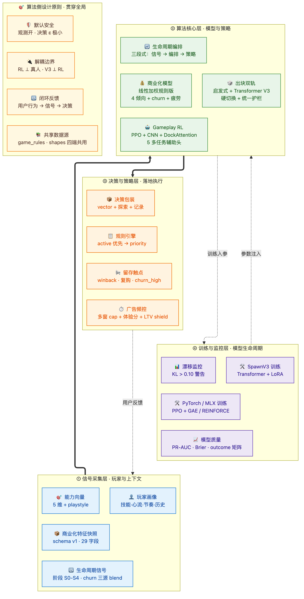
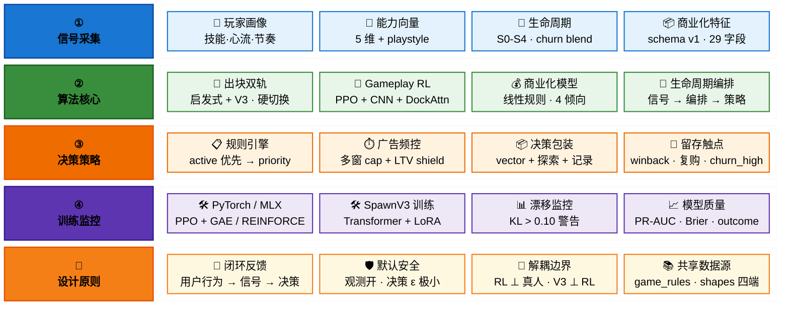
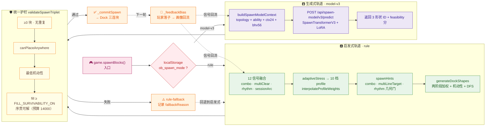
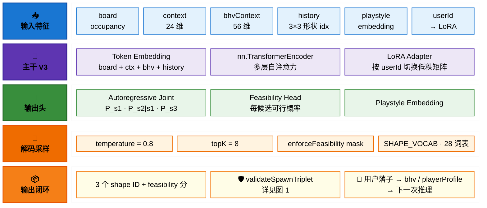
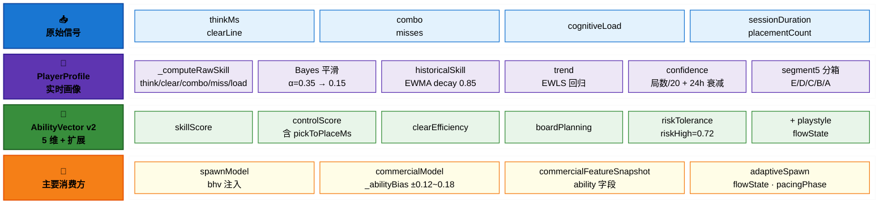
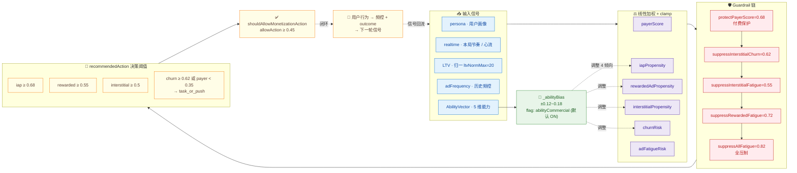
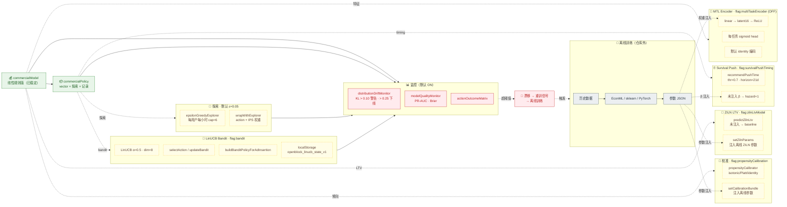
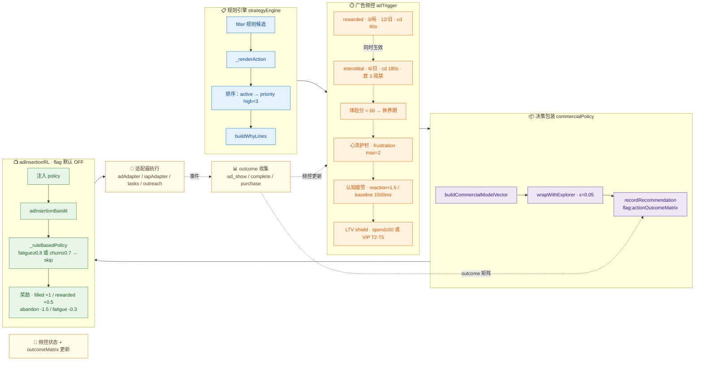
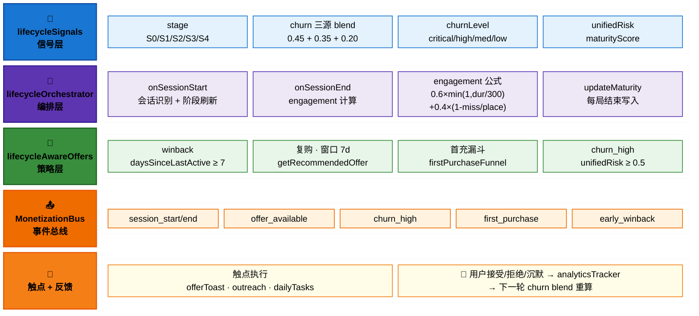

# OpenBlock 算法与策略架构图

> **定位**：以「设计参考视图 + 紧凑概念视图 + 8 张算法子图」覆盖 OpenBlock
> 全部算法栈与策略决策路径，作为
> [`ALGORITHMS_HANDBOOK.md`](./ALGORITHMS_HANDBOOK.md) 的可视化伴随文档。
>
> **范围**：六层结构（数据输入 / 核心模型 / 决策输出 / 训练与优化 / 支撑 /
> 反馈闭环）、七大具名子模型（PlayerProfile · AbilityVector ·
> CommercialPolicy · AdTrigger · AdInsertionRL · LifecycleOrchestrator ·
> ActionOutcomeMetrics）+ 中央融合决策引擎；下沉到子图层即覆盖出块双轨、
> Gameplay RL、商业化决策与 ML scaffolding、生命周期编排。
>
> **生成方式**：紧凑概念图与 8 张子图依据
> [`ALGORITHM_DIAGRAM_PROMPT.md`](./ALGORITHM_DIAGRAM_PROMPT.md)
> 的事实包与约束生成；如需重生成，按照该 prompt 喂给大模型即可。设计参考
> 视图为产品 / 算法评审稿，对应 `algorithm-architecture.png`。
>
> **维护约定**：图中模型与阈值必须能在
> [`ALGORITHMS_HANDBOOK.md`](./ALGORITHMS_HANDBOOK.md)、
> [`ALGORITHMS_SPAWN.md`](./ALGORITHMS_SPAWN.md)、
> [`ALGORITHMS_RL.md`](./ALGORITHMS_RL.md)、
> [`ALGORITHMS_MONETIZATION.md`](./ALGORITHMS_MONETIZATION.md)、
> [`COMMERCIAL_MODEL_DESIGN_REVIEW.md`](./COMMERCIAL_MODEL_DESIGN_REVIEW.md)
> 中找到原文；scaffolding / opt-in 模块必须用虚线或 `flag:` 边标签标注，
> 不允许画成已稳定上线。

## 阅读顺序

| 图 | 回答的问题 | 适合角色 |
|---|---|---|
| [总览图](#总览图算法栈分层--反馈环) | 算法栈整体长什么样？信号怎么回流？视图 A 给六层 / 七子模型设计参考稿，视图 B 给紧凑概念图 | 全角色 / 新算法成员入门 |
| [图 1](#图-1出块双轨决策架构) | 出块怎么决策？V3 失败怎么办？ | 出块算法 / 玩法 |
| [图 2](#图-2spawntransformerv3-网络与推理流) | V3 内部结构？怎么个性化？ | 出块算法 / ML |
| [图 3](#图-3gameplay-rl-训练栈ppo--gae--eval-gate) | RL 怎么训？怎么上线？ | RL / 训练平台 |
| [图 4](#图-4玩家画像与能力评估) | 画像怎么算？能力多少维？ | 玩家系统 / 体验 |
| [图 5](#图-5商业化核心决策线性规则--guardrail--abilitybias) | 规则版决策怎么走？哪些 guardrail？ | 商业化 / 数据 |
| [图 6](#图-6商业化-ml-scaffolding-栈opt-in) | ML 这一组现在在哪？ | 商业化 / ML / 分析 |
| [图 7](#图-7决策与执行管线rule--freq--policy--adinsertion) | 决策怎么落到广告/IAP？ | 商业化 / 客户端 |
| [图 8](#图-8生命周期信号--编排--策略) | 留存触点是怎么编排的？ | 留存运营 / 数据 |

---

## 总览图：算法栈分层 + 反馈环

> **回答的问题**：OpenBlock 由哪些算法、各算法做什么、信号如何回流？
>
> 本节给出 **设计参考视图 + 紧凑概念视图** 两种总览：前者偏产品 / 评审 /
> 培训语言，覆盖六层 + 反馈闭环 + 七大子模型；后者用 Mermaid + ELK 渲染，
> 与下方 8 张子图保持同一抽象层级，便于追溯到代码、阈值、API。

### 视图 A：设计参考图（六层 + 七子模型 + 反馈闭环）


> 上图为评审 / 培训 / 对外宣讲使用的设计参考稿，把整个算法栈拆为六层
> + 一条独立的"反馈闭环"流水线，并把核心模型层的七个具名子模型围绕"融合
> 决策引擎"展开。表格映射六层与代码 / 文档锚点：

| 层 | 作用 | 关键模块 / 文档 |
|---|---|---|
| ① **数据输入层** | 玩家行为 / 环境状态 / 特征快照 / 历史数据等多源信号 | `playerProfile.js` · `commercialFeatureSnapshot.js` · [SQLITE_SCHEMA](../engineering/SQLITE_SCHEMA.md) |
| ② **核心模型层** | 七大子模型协同：`PlayerProfile` · `AbilityVector` · `CommercialPolicy` · `AdTrigger` · `AdInsertionRL` · `LifecycleOrchestrator` · `ActionOutcomeMetrics`，外加居中的"融合决策引擎"做加权融合 / 规则约束 / 冲突协调 / 风险控制 | [ALGORITHMS_HANDBOOK](./ALGORITHMS_HANDBOOK.md) · [MODEL_SYSTEMS_FOUR_MODELS](./MODEL_SYSTEMS_FOUR_MODELS.md) · [COMMERCIAL_MODEL_DESIGN_REVIEW](./COMMERCIAL_MODEL_DESIGN_REVIEW.md) |
| ③ **决策输出层** | 推荐行动集合 · 执行指令 · 策略解释 · 日志记录 | `commercialPolicy.js` · `strategyEngine.js` · [事件契约](../architecture/MONETIZATION_EVENT_BUS_CONTRACT.md) |
| ④ **训练与优化层** | 数据存储 → 离线训练 → 在线学习 → 评估与验证 → 模型更新；底部一条"奖励信号（多目标优化）"带：收益 / 留存 / 满意度 / 风险 / 生态健康 | [ALGORITHMS_RL](./ALGORITHMS_RL.md) · [RL_PYTORCH_SERVICE](./RL_PYTORCH_SERVICE.md) · `quality/modelQualityMonitor.js` |
| ⑤ **支撑层** | 特征工程平台 · 模型服务平台 · 实验平台 · 监控与告警，所有 ML 子系统的共享基座 | [PROJECT.md](../engineering/PROJECT.md) · [OBSERVABILITY](../operations/OBSERVABILITY.md) · `experimentPlatform.js` · `quality/distributionDriftMonitor.js` |
| ⑥ **反馈闭环** | 效果反馈 → 归因分析 → 策略改进 → 模型迭代，把上线效果回灌到 ① 数据输入与 ④ 训练优化 | `actionOutcomeMatrix.js` · [LIFECYCLE_DATA_STRATEGY_LAYERING](../architecture/LIFECYCLE_DATA_STRATEGY_LAYERING.md) |

> **诚实标注**：图中"七大子模型"覆盖**已稳定上线**与**opt-in scaffolding**两类；
> calibration / explorer ε / LinUCB bandit / MTL / ZILN / survival / drift 等仍以
> 默认 identity / baseline 入库（`flag` 默认 OFF），具体 flag 默认值与上线状态
> 见下方 8 张展开图与 [ALGORITHMS_HANDBOOK](./ALGORITHMS_HANDBOOK.md)。

### 视图 B：紧凑概念图（与 8 张子图同抽象层级）



> 上图为 ELK 渲染的离线静态视图，便于在 GitHub / 不支持 Mermaid 的阅读器
> 中直出。下方 ` ```mermaid ` 块是同源源码，文档门户与 mermaid.live 可
> 实时重渲染（缩放更清晰）。视图 B 按 "信号采集 → 算法核心 → 决策与策略
> → 训练与监控" 四层 + 1 行算法侧设计原则带组织，与下方 8 张展开图保持
> 同一节点 / 边粒度，方便逐图深入。
>
> **渲染方案**：使用 mermaid 11 的 `block-beta` 网格语法，**不依赖 ELK
> CDN 加载**（避免浏览器 15s 超时），层间垂直堆叠隐含"信号 → 决策"流向，
> 反馈环用文字下方"反馈环"小节补述（block-beta 语法不支持箭头）。



**反馈环**（block-beta 不支持箭头，文字补述）：

- ① 信号采集 → ② 算法核心 → ③ 决策策略（垂直主流向）
- ② 算法核心 ⇄ ④ 训练监控（训练入参 / 参数注入双向）
- ③ 决策策略 → 用户行为 → ① 信号采集（外部闭环）

**层级与反馈环解读**：

| 层 | 关键约束 |
|---|---|
| ① 信号采集 | 玩家画像贝叶斯快收敛；能力向量 5 维 + flowState；生命周期 churn 三源 blend（predictor 0.45 / maturity 0.35 / commercial 0.20） |
| ② 算法核心 | 出块双轨**硬切换**（无加权融合）；Gameplay RL 与 SpawnV3 是两个独立模型；商业化模型为**线性规则版**，**非**深度学习 |
| ③ 决策与策略 | 频控含日/局/会话 3 窗 cap、心流 / 认知疲劳 / LTV shield；广告插入 RL 实质为规则 scaffolding |
| ④ 训练与监控 | RL checkpoint `.pt`；ONNX 仓库内未实现；漂移 KL / 质量 PR-AUC 监控默认 ON |

**反馈环**（虚线）：策略层 → 用户反应 → 信号采集层；训练监控 ⇄ 算法核心层（参数注入与训练入参）。

> **下一步**：如需了解每个算法的内部结构与阈值，请继续阅读下方 8 张详细图。

---

## 图 1：出块双轨决策架构

> **回答的问题**：每一轮出块的两条轨道分别是怎么决策的？V3 失败怎么回退？
> 切换是怎么发生的？
>
> **渲染方案**：`flowchart LR`（横向 4 段：入口 → 双轨 → 护栏 → 提交），
> 节点 ID 避免 `switch` 等保留字（旧版触发解析死循环）。



**解读**：
- 切换是**硬切换**（`localStorage:ob_spawn_mode`），**没有运行时加权融合，没有独立置信度门**；模型轨"置信度"等价于"V3 HTTP 成功 + `validateSpawnTriplet` 通过"。
- 启发式轨核心阈值：`MAX_SPAWN_ATTEMPTS=22`、`FILL_SURVIVABILITY_ON=0.52`、`SURVIVE_SEARCH_BUDGET=14000`、`CRITICAL_FILL=0.68`、`PC_SETUP_MIN_FILL=0.45`。
- V3 失败的处理是**回退到启发式轨**而不是抛异常；失败原因写入 `fallbackReason`，可作漂移信号。
- 反馈环：用户落子 → `_feedbackBias` → `playerProfile` 与 `behaviorContext` 双向回流，下一轮再驱动两条轨道。

---

## 图 2：SpawnTransformerV3 网络与推理流

> **回答的问题**：V3 的网络结构是什么？输入特征怎么组织？解码怎么保证可行性？
> 怎么按用户做个性化（LoRA）？
>
> **渲染方案**：`block-beta` 网格（同视图 B），4 行结构（输入 → 主干 →
> 输出头 → 解码采样），每行内多节点横排；流向 / 反馈环用文字补述
> （block-beta 不支持箭头，但避免了浏览器渲染超时）。



**推理流向**（block-beta 不支持箭头，文字补述）：

- 输入特征 → 主干 V3 → 输出头 → 解码采样 → 输出（5 行垂直堆叠隐含主流向）
- 主干内部：`b1 Token Embedding → b2 TransformerEncoder → b3 LoRA Adapter`
- 反馈闭环：输出 → 用户落子 → bhv / playerProfile → 下一次推理回到输入特征

**解读**：
- 主干用 `nn.TransformerEncoder`，**与 Gameplay RL 的 `ConvSharedPolicyValueNet` 完全独立**——不要混淆为同一个模型。
- LoRA 按 `userId` 切换低秩矩阵，实现轻量级用户级个性化；不写时退化为基础参数。
- 解码是**自回归** joint：先采 s₁，再条件采 s₂、s₃；每步用 `feasibility mask` 屏蔽不可放置的形状候选。
- 采样默认 `temperature=0.8`、`topK=8`；服务端可通过请求体覆写。
- 闭环：用户落子结果回流到 `behaviorContext`（含 `AbilityVector`），下一轮再驱动 V3。

---

## 图 3：Gameplay RL 训练栈（PPO + GAE + Eval Gate）

> **回答的问题**：RL 在训什么、用什么算法、怎么探索、怎么评估、怎么上线？
>
> **渲染方案**：`flowchart LR`，6 段横向流水线（数据 → 主干 → 多任务头 →
> 训练 → 评估门 → 上线）+ 闭环；多任务头并列展开。

```mermaid
---
config:
  flowchart:
    nodeSpacing: 24
    rankSpacing: 36
    curve: basis
---
flowchart LR
  classDef data fill:#e3f2fd,stroke:#1976d2,color:#0d47a1
  classDef net fill:#ede7f6,stroke:#5e35b1,color:#311b92
  classDef head fill:#e8f5e9,stroke:#388e3c,color:#1b5e20
  classDef train fill:#fff3e0,stroke:#ef6c00,color:#e65100
  classDef gate fill:#ffebee,stroke:#c62828,color:#b71c1c
  classDef serve fill:#fffde7,stroke:#f57f17,color:#5d4037

  subgraph DATA["📥 数据来源"]
    direction TB
    da1["simulator self-play"]
    da2["replay buffer<br/>POST /api/rl/train_episode"]
    da3["shared/game_rules.json<br/>shared/shapes.json"]
  end
  class da1,da2,da3 data

  subgraph NET["🧠 主干 · ConvSharedPolicyValueNet"]
    direction TB
    n1["CNN 棋盘编码<br/>state dim = 181"]
    n2["DockBoardAttention<br/>Cross-attention"]
    n3["DockPointEncoder<br/>PointNet 风格"]
    n1 --> n2 --> n3
  end
  class n1,n2,n3 net

  subgraph HEADS["🎯 多任务头"]
    direction TB
    head1["policy · 15 维"]
    head2["value · outcome 混合"]
    head3["board_quality"]
    head4["feasibility"]
    head5["survival"]
    head6["topology_aux"]
    head7["clear_pred"]
  end
  class head1,head2,head3,head4,head5,head6,head7 head

  subgraph TR["🛠️ 训练管线 PPO"]
    direction TB
    t1["GAE λ + outcome 混合 value"]
    t2["PPO 多 epoch + clipping"]
    t3["探索：温度 + Dirichlet 噪声"]
    t4["辅助监督头联合损失"]
    t1 --> t2 --> t3 --> t4
  end
  class t1,t2,t3,t4 train

  subgraph EVAL["🚦 EvalGate"]
    direction TB
    e1["Ranked Reward<br/>对历史 ckpt 排名"]
    e2["KPI 守门<br/>不通过 → 不上线"]
    e1 --> e2
  end
  class e1,e2 gate

  subgraph SERVE["🚀 上线"]
    direction TB
    sv1["openblock_rl.pt<br/>checkpoint"]
    sv2["POST /api/rl/select_action<br/>HTTP 推理"]
    sv3["replay 上报<br/>/api/rl/train_episode"]
    sv1 --> sv2
    sv2 -.玩家行为回流.-> sv3
  end
  class sv1,sv2,sv3 serve

  loop["🔁 自博弈对局<br/>→ 下一轮数据"]:::serve

  DATA --> NET --> HEADS --> TR --> EVAL
  EVAL -- 通过 --> SERVE
  SERVE -.闭环.-> loop
  loop -.数据回灌.-> DATA
  sv3 -.replay flush.-> da2
```



**解读**：
- **算法家族**：主路径 **PPO + GAE**（`rl_pytorch/train.py` + `rl_backend.py`）；MLX 路径 **REINFORCE + value baseline**；DQN/SAC **未采用**；MCTS / AlphaZero **可选**。
- **主干 ≠ Transformer**：Gameplay RL 用 `ConvSharedPolicyValueNet`（CNN + DockBoardAttention + DockPointEncoder）；TransformerEncoder **仅** SpawnV3 用，两者完全解耦。
- **多任务头**：5 个辅助头与 policy/value 共享主干，做联合监督，提升样本利用率。
- **探索**：softmax 温度 + Dirichlet 噪声（**非** ε-greedy）。
- **EvalGate**：Ranked Reward 不通过则不上线；上线即写入 `openblock_rl.pt`，HTTP 暴露给浏览器与训练栈。
- **闭环**：浏览器对局 → replay flush → 下一轮 PPO 数据。

---

## 图 4：玩家画像与能力评估

> **回答的问题**：技能与能力是怎么从原始行为算出来的？信号怎么回流？
>
> **渲染方案**：`block-beta` 网格，4 行结构（原始信号 → PlayerProfile →
> AbilityVector → 消费方），PlayerProfile 6 步流水线横排展示；流向 / 反馈
> 用文字补述。



**计算与反馈流向**（block-beta 不支持箭头，文字补述）：

- ① 原始信号 → ② PlayerProfile → ③ AbilityVector → ④ 消费方（4 行垂直堆叠隐含主流向）
- PlayerProfile 内部流水线：`_computeRawSkill → Bayes 平滑 → historicalSkill → trend → confidence → segment5`
- 反馈环：消费方 → 用户落子 / 决策结果 → `recordSpawn` / `place` / `_feedbackBias` → 下一步更新原始信号

**解读**：
- 画像设计为**前期快收敛 + 后期慢平滑**：前 5 步用大 α（`fastConvergenceAlpha=0.35`），之后切换为 `smoothingFactor=0.15`，避免新玩家被冷启动卡住。
- 长周期：会话均值 EWMA(`0.85`) → EWLS 回归 trend → confidence 由局数/20 与 24h 衰减叠加；分档为 segment5 规则分箱（**非** K-Means 在线聚类）。
- 能力向量是**统一消费层**：spawnModel 通过 `behaviorContext(56)` 注入，commercialModel 通过 `_abilityBias` 微调四个倾向，commercialFeatureSnapshot 持久化。
- IRT 模型在仓库内**未实现**。
- 反馈环：`recordSpawn` / `place` / `_feedbackBias` 产生的新信号闭环回 `_computeRawSkill`。

---

## 图 5：商业化核心决策（线性规则 + guardrail + abilityBias）

> **回答的问题**：规则版商业化模型怎么从信号算出 `recommendedAction`？
> Guardrail 是怎么压制激进决策的？
>
> **渲染方案**：`flowchart LR`，5 段横向（输入 → 线性加权 → guardrail
> → 决策阈值 → 放行）+ abilityBias 旁路注入。



**解读**：
- 规则版核心是**线性加权 + clamp**，**非深度学习**——这是诚实事实，不要画成 ML 决策。
- AbilityVector 通过 `_abilityBias` 微调四个倾向（±0.12~0.18），由 `flag:abilityCommercial`（默认 ON）控制开关。
- Guardrail 链按"付费保护 → 流失 / 疲劳分级压制 → 全局疲劳"五段顺序裁剪激进决策；任何一段命中即影响最终倾向。
- `recommendedAction` 阈值：`iap≥0.68` / `rewarded≥0.55` / `interstitial≥0.5` / `churn≥0.62 或 payer<0.35 → task_or_push`。
- `shouldAllowMonetizationAction` 默认放行阈值 `0.45`，用于二次门控。
- 反馈环：决策结果 → 频控状态 + actionOutcomeMatrix → 下一轮 `realtime / adFrequency` 重算。

---

## 图 6：商业化 ML Scaffolding 栈（opt-in）

> **回答的问题**：哪些 ML 能力已经入库为骨架？哪些默认开关？怎么注入离线
> 训练好的参数？
>
> **渲染方案**：`flowchart LR`，"稳定核心 → scaffolding 扇出 → 监控 →
> 离线训练 → 参数回灌"，6 个 scaffolding 子图横向并列；scaffolding
> classDef 用虚线边框（`stroke-dasharray:4 3`）显式区分稳定 vs opt-in。



**解读**：
- **稳定（实线）**：`commercialModel`、`commercialPolicy` 是当前默认决策路径。
- **Scaffolding（虚线 + flag）**：`propensityCalibration` / `bandit` / `zilnLtvModel` / `survivalPushTiming` / `multiTaskEncoder` 都以"骨架 + 推理路径 + 默认参数（identity / baseline）"形式入库——**真训练在仓库外离线完成后通过 setter 注入**。
- **常驻监控（默认 ON）**：drift monitor (KL `>0.10` 警告)、quality monitor (PR-AUC / Brier)、actionOutcomeMatrix——观测路径默认开启，决策路径默认关闭，符合"默认安全"原则。
- 闭环：监控超阈值 → 离线训练流水线 → 参数 JSON → setter 注入对应模块 → 下一窗口生效。

---

## 图 7：决策与执行管线（rule + freq + policy + adInsertion）

> **回答的问题**：从规则决策到广告 / IAP / 任务的最终落地，途中经过哪些
> 层、有哪些频控？
>
> **渲染方案**：`flowchart LR`，5 段横向（规则 → 频控 → 决策包装 →
> 广告插入 → 执行）+ 频控级联用虚线表示同层"或"关系。



**解读**：
- 规则引擎排序逻辑：先按 `active` 优先（`when` 命中或满足广告类型阈值），再按 `priority`（high=3）。
- 频控不是单一窗口，而是**多窗 cap + 体验分 + 心流 + 认知疲劳 + LTV shield** 的级联——任一档命中即压制；图中用虚线表示同层"或"关系。
- `adInsertionRL` 实际是**规则版 scaffolding**（`flag:adDecisionEngine` 默认 OFF），上线时的"RL"等价于规则裁决；reward 公式记录在那里，等真训练接入时复用。
- 反馈环：广告 / IAP / 任务事件 → 频控状态更新（rewarded/interstitial 各 cap） + actionOutcomeMatrix 记录，下一次决策即用新状态。

---

## 图 8：生命周期信号 → 编排 → 策略

> **回答的问题**：留存运营是怎么从 5 阶段 + churn blend 编排到 winback /
> 复购 / churn_high 的？
>
> **渲染方案**：`block-beta` 网格，4 行严格分层（信号 → 编排 → 策略 → 总线）
> + 触点执行；体现"三段式"分层；流向 / 反馈用文字补述。



**编排流向与反馈环**（block-beta 不支持箭头，文字补述）：

- ① 信号 → ② 编排 → ③ 策略 → ④ 事件总线 → ⑤ 触点（5 行垂直堆叠隐含三段式严格分层；任何反向调用属于违规）
- 反馈环：用户对 offer 的反应 → analyticsTracker → 下一轮 churn blend / maturity 重算回到信号层

**解读**：
- **三段式**严格分层：`lifecycleSignals`（数据） → `lifecycleOrchestrator`（编排） → `lifecycleAwareOffers / offerToast / lifecycleOutreach`（策略）；任何反向调用属于违规。
- churn 是**三源 blend**：`predictor 0.45 + maturity 0.35 + commercial 0.20`（默认权重）；`commercial` 来自 `commercialModel.churnRisk`，权重最低，避免商业化倾向反向支配留存判断。
- engagement 公式以"会话长度（封顶 5 分钟）"与"放置成功率"加权，体现"耗时 ≠ 体验"。
- 事件全部走 `MonetizationBus`，订阅方零侵入；详细事件契约见
  [`MONETIZATION_EVENT_BUS_CONTRACT.md`](../architecture/MONETIZATION_EVENT_BUS_CONTRACT.md)。
- 反馈环：用户对 offer 的反应 → analyticsTracker → 下一轮 churn blend 与 maturity 重算。

---

## 自检结果

- [x] 1 张总览图 + 8 张算法子图全部产出，且每张图前有问题陈述、后有解读
- [x] 所有模型 / 算法 / 阈值 / 路由都能在 [`ALGORITHM_DIAGRAM_PROMPT.md`](./ALGORITHM_DIAGRAM_PROMPT.md) §2 找到原文
- [x] scaffolding 模块（calibration / explorer / bandit / ZILN / survival / MTL）全部用虚线 + `flag:` 标注，未画成已稳定
- [x] 每张子图都画出反馈回流边
- [x] 出块双轨标注硬切换（不是加权融合）+ 统一护栏 + rule-fallback
- [x] Gameplay RL 与 SpawnV3 在图中是两个独立模型，没有共享主干（图 2 vs 图 3）
- [x] 商业化决策图（图 5）体现 guardrail 链 + abilityBias
- [x] 生命周期图（图 8）体现三段式 + churn blend 默认权重 0.45/0.35/0.20
- [x] 全部 Mermaid 图本地 `mermaid.parse` 通过

## 关联文档

- [`ALGORITHM_DIAGRAM_PROMPT.md`](./ALGORITHM_DIAGRAM_PROMPT.md) —— 本图集的生成 prompt（事实包 + 输出规范）
- [`ALGORITHMS_HANDBOOK.md`](./ALGORITHMS_HANDBOOK.md) —— 算法手册主入口
- [`ALGORITHMS_SPAWN.md`](./ALGORITHMS_SPAWN.md) —— 出块算法权威源（图 1 / 图 2）
- [`ALGORITHMS_RL.md`](./ALGORITHMS_RL.md) —— RL 训练栈权威源（图 3）
- [`ALGORITHMS_MONETIZATION.md`](./ALGORITHMS_MONETIZATION.md) —— 商业化算法手册（图 5 / 图 6 / 图 7）
- [`COMMERCIAL_MODEL_DESIGN_REVIEW.md`](./COMMERCIAL_MODEL_DESIGN_REVIEW.md) —— 商业化模型架构设计
- [`SPAWN_ALGORITHM.md`](./SPAWN_ALGORITHM.md) —— 出块算法三层模型
- [`../architecture/SYSTEM_ARCHITECTURE_DIAGRAMS.md`](../architecture/SYSTEM_ARCHITECTURE_DIAGRAMS.md) —— 系统架构图（系统侧的姊妹篇）
