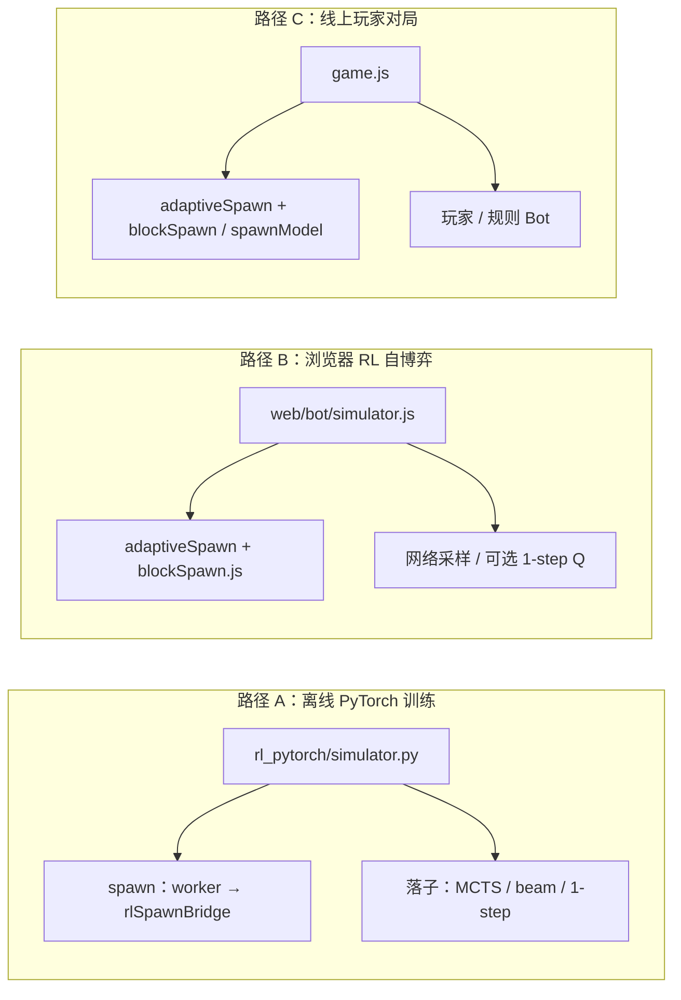

# RL 文档与契约

> 本文是强化学习栏目的统一入口文档，聚合了阅读指南、RL 与主玩法的契约边界，以及 PyTorch 在线/离线服务的完整说明。
> 算法公式和训练流程见 [`ALGORITHMS_RL.md`](./ALGORITHMS_RL.md)。

## 一、阅读入口

### 1.1 快速导航

| 需求 | 先读 |
|------|------|
| 理解当前 RL 算法、状态/动作、奖励、网络、训练和推理 | [`ALGORITHMS_RL.md`](./ALGORITHMS_RL.md) |
| 理解 RL 与玩法规则、出块、计分的边界 | [`RL_AND_GAMEPLAY.md`](./RL_AND_GAMEPLAY.md) |
| 搞清离线 MCTS / 浏览器训练 / 线上对局差在哪 | 本文 [§2.6](#26-rl-训练机制三条路径对照权威) |
| 部署或排查 `/api/rl/*`、离线训练、贪心评估 | [`RL_PYTORCH_SERVICE.md`](./RL_PYTORCH_SERVICE.md) |
| 看训练曲线、判断训练是否正常 | [`RL_TRAINING_DASHBOARD_TRENDS.md`](./RL_TRAINING_DASHBOARD_TRENDS.md) |
| 排查 Lv 爆炸、loss 抖动、回报尺度异常 | [`RL_TRAINING_NUMERICAL_STABILITY.md`](./RL_TRAINING_NUMERICAL_STABILITY.md) |

### 1.2 文档分层

**当前权威**

| 文档 | 维护内容 |
|------|----------|
| [`ALGORITHMS_RL.md`](./ALGORITHMS_RL.md) | PPO/GAE/辅助头/search teacher/浏览器 fallback/服务化推理的统一说明 |

**契约与服务**

| 文档 | 维护内容 |
|------|----------|
| 本文 | RL 与主玩法的解耦边界、共享 JSON、模拟器一致性、特征维度失效规则、Flask 在线训练、离线训练、HTTP 评估、批量 PPO 与 search replay |
| [`RL_PYTORCH_SERVICE.md`](./RL_PYTORCH_SERVICE.md) | （已被本文合并，历史版本保留） |

**训练观测与排障**

| 文档 | 维护内容 |
|------|----------|
| [`RL_TRAINING_DASHBOARD_FLOW.md`](./RL_TRAINING_DASHBOARD_FLOW.md) | 训练看板数据从哪里来、何时刷新、如何自检 |
| [`RL_TRAINING_DASHBOARD_TRENDS.md`](./RL_TRAINING_DASHBOARD_TRENDS.md) | 八图趋势解读、异常研判、调参优先级 |
| [`RL_TRAINING_NUMERICAL_STABILITY.md`](./RL_TRAINING_NUMERICAL_STABILITY.md) | 回报裁剪、GAE delta 裁剪、loss 幅值、环境变量 |

**分析与实验记录**

| 文档 | 用途 |
|------|------|
| [`RL_ANALYSIS.md`](./RL_ANALYSIS.md) | 复杂度分析、瓶颈诊断、优化候选池 |
| [`RL_ALPHAZERO_OPTIMIZATION.md`](./RL_ALPHAZERO_OPTIMIZATION.md) | AlphaZero/MCTS 对比和搜索蒸馏思路 |

### 1.3 维护原则

- 算法公式、网络结构、状态/动作维度、奖励口径只在 `ALGORITHMS_RL.md` 维护。
- **三条路径训练机制对照**（离线 / 浏览器 / 线上）只在本文 **§2.6** 维护；其他文档引用或摘要，不复制整张表。
- 玩法规则、得分、形状、特征维度以 `shared/game_rules.json` 和 `shared/shapes.json` 为准。
- 看板字段和曲线口径只在 dashboard 相关文档维护。
- 历史实验文档可以保留失败原因和取舍结论，但不要把旧版本号写成当前状态。

## 二、RL 契约：玩法边界与共享规则

> 当前定位：维护 RL 与主玩法之间的契约边界，包括共享配置、模拟器一致性和特征维度失效规则。

### 2.1 单一数据源

| 内容 | 文件 | 说明 |
|------|------|------|
| 难度、得分、棋盘宽高、胜局分、RL 训练用策略 id、特征维度与归一化常数、**统一消行计分** `clearScoring`、**RL 奖励塑形** `rlRewardShaping`、**RL 与主局对齐的 bonus icon/染色** `rlBonusScoring` | `shared/game_rules.json` | 改玩法优先只改此处 |
| 多连块几何 | `shared/shapes.json` | 与 `web` / `rl_pytorch` / `rl_mlx` 共用 |

### 2.2 分层

1. **规则与数据**：上述 JSON。
2. **环境（对局动力学）**：`web/src/bot/simulator.js`、`rl_pytorch/simulator.py`、`rl_mlx/simulator.py` 等实现落子、消除、得分、**每轮 dock 三色采样**；须与主游戏 `Grid` / `clearScoring` 逻辑一致。
   - **得分**：消行前 `detectBonusLines` → `computeClearScore`，与主局公式相同；bonus 倍率由 `shared/game_rules.json` → **`clearScoring.iconBonusLineMult`** 统一提供。**连击倍数 v1.66+**：`clearScoring.comboMultiplier`（默认 ≥ 3 连 ×2 cap）也由同一 JSON 提供，浏览器主局 / 无头模拟器 / PyTorch / MLX 用同公式 `_clear_score_gain(... combo_streak=_clear_streak)` 累乘到 `clearScore`，RL 奖励信号天然包含 combo 倍数。训练路径不用玩家当前皮肤，icon 语义只读取 **`rlBonusScoring.blockIcons`**；为空时浏览器无头局、PyTorch、MLX 都退化为**同色整线** bonus，不再从 canonical 皮肤回退。
   - **dock 染色偏置**：依据盘面近满线几何 + `rlBonusScoring` 调用 `monoNearFullLineColorWeights` / `pickThreeDockColors`（与 `web/src/bot/simulator.js` 一致）；观测 φ **不得**含 spawnHints 等出块内部状态。
   - **出块形状（v1.68+）**：
     - **浏览器 RL**（`OpenBlockSimulator`）：`resolveAdaptiveStrategy` + `generateDockShapes`，与真人规则轨一致。
     - **Python 离线训练**（默认）：`scripts/rl-spawn-worker.mjs`（Vite SSR）→ `web/src/bot/rlSpawnBridge.js`，与线上一致；维护 `spawnContext` + `PlayerProfileLite`。环境变量 **`RL_SPAWN_ONLINE=0`** 或 worker 不可用时回退 `rl_pytorch/block_spawn.py`（**v2+v3**：启发式 + 盘面拓扑分析 + 消行得分 + `difficulty_target` 产品目标对齐 + 构造式出块引擎 `spawn_construction.py` 四构造器；非线上分布但出块质量优于 v1）。
     - **策略条件化**：`featureEncoding.strategyIds` 的 **3 维 one-hot** 拼入 state 标量尾；**训练**每局从 `rlTraining.strategyIds` 均匀采样；**推理**（面板「评估一局」等）使用界面所选 `game.strategy`。
3. **观测编码（与策略网络绑定）**：`web/src/bot/features.js`、`rl_pytorch/features.py`；向量维度与语义由 `featureEncoding` 约束（**v1.68：190 维 state** = 51 标量[含 **3 维策略 one-hot**] + 64 棋盘 + 75 dock；**phi=205**）。**若改 stateDim/actionDim 或特征公式，旧 checkpoint 失效，需重训。**
4. **RL 训练入口（不直接碰棋盘）**：`web/src/bot/gameEnvironment.js` 的 `RlGameplayEnvironment`、`web/src/bot/trainer.js` 中的自博弈循环。

### 2.3 自适应出块（网页端）

网页端真人主流程现在有两种可选出块模式：`启发式`（`adaptiveSpawn.js` + `blockSpawn.js`）与 `生成式`（`spawnModel.js` 调用 SpawnPolicyNet）。两者共享同一份出块上下文：难度模式、`AbilityVector`、玩家实时状态、盘面拓扑、局内节奏、局间弧线、近期出块历史和启发式轨 `spawnHints`。生成式必须通过前端 `validateSpawnTriplet()` 护栏；模型不可用、输出非法或不可解时回退启发式并记录原因。

浏览器 RL 与 Python 离线训练（worker 开启时）均走 **adaptiveSpawn + blockSpawn**；观测向量仍**不**含 `spawnHints` 内部权重，仅含 **策略 ID one-hot** 与盘面/dock 可见量。生成式 spawn 模型（V3）与真人画像持久化**不**进入 RL 训练环境。

#### 2.3.1 spawnIntent 单一口径

- 网页端 `adaptiveSpawn` 输出 `spawnHints.spawnIntent ∈ { relief, engage, pressure, flow, harvest, maintain }`，并通过 `_lastAdaptiveInsight.spawnIntent` 暴露给所有展示层。
- **拟人化叙事 / 商业化策略 / 回放标签**都从 spawnIntent 派生，不再在各自模块里做"信号解读"。
- **几何近满 → spawnIntent**：`boardTopology.detectNearClears()` 是「近完整行/列」检测的单一来源，被 `analyzeBoardTopology`（panel / stress 信号）与 `bot/blockSpawn.analyzePerfectClearSetup`（pcSetup）共享，避免同盘面下两侧给出不同近满计数。
- **占用率衰减**：低占用盘面（`fill < 0.5`）的正向 stress 按 `clamp(fill/0.5, 0.4, 1.0)` 衰减后再 smoothing，杜绝 fill=0.39 时 stress=0.89 的伪高压。

#### 2.3.2 harvest / payoff 几何兜底 + 词义解耦

`spawnIntent` 统一为 6 值枚举，但 `pcSetup ≥ 1` 在低占用盘面是噪声候选。`spawnIntent='harvest'` 以及 `rhythmPhase='payoff'` 的触发统一收紧到几何条件：

- 模块常量 `PC_SETUP_MIN_FILL = 0.45` + 条件 `canPromoteToPayoff = nearFullLines ≥ 1 || multiClearCands ≥ 1 || (pcSetup ≥ 1 && fill ≥ PC_SETUP_MIN_FILL)`。
- `spawnIntent='harvest'` 要求 `nearFullLines ≥ 2 || (pcSetup ≥ 1 && fill ≥ PC_SETUP_MIN_FILL)`。
- `deriveRhythmPhase` 与所有升 payoff 的分支（`pcSetup` 主路径、`delight.mode='challenge_payoff'/'flow_payoff'`、`playstyle='multi_clear'`、`afkEngage`）都通过 `canPromoteToPayoff` 兜底。
- `clearGuarantee = 3` 在 `multiClearCandidates < 2 && nearFullLines < 2` 时回钳到 `2`。
- UI 词义解耦：`PlayerProfile.pacingPhase`（tension/release）的展示文案为 **「Session 张弛」**；`spawnHints.rhythmPhase`（setup/payoff/neutral）称 **「节奏相位」**。
- `strategyAdvisor` 互斥：`rhythmPhase==='payoff'` 或 `spawnIntent==='harvest'` 或 `fill < 0.18` 时不再追加「提升挑战 → 3 行+」卡。

完整设计文档见 **[`ADAPTIVE_SPAWN.md`](./ADAPTIVE_SPAWN.md)** 与 **[`ALGORITHMS_SPAWN.md`](./ALGORITHMS_SPAWN.md)**。

### 2.4 修改玩法时建议顺序

- 只调难度/分数字段：编辑 `shared/game_rules.json`（必要时同步检查 Python/JS 模拟器是否仍适用同一套 `scoring` 键名映射）。
- 改方块集合：编辑 `shared/shapes.json`，并确认各端 `shapes_data` / `shapes.js` 能加载（无需改 trainer）。
- 改观测或网络输入维度：改 `featureEncoding` + `features.js` / `features.py` + 模型与权重。

### 2.5 PyTorch 与浏览器线性模型：收敛速度差异（简析）

| 因素 | 线性 `LinearAgent` | PyTorch `PolicyValueNet` / `SharedPolicyValueNet` |
|------|---------------------|---------------------------------------------------|
| 参数量 | 205（策略 φ）+190（价值 state），随 `featureEncoding` 变化 | 默认以 `rl_pytorch/model.py` 和 checkpoint meta 为准（可调 `--width` / `--*-depth`） |
| 每局梯度步数 | `reinforceUpdate` 对轨迹**逐步**更新 | `train.py` 默认对**整局**一次 `backward`（等价 batch 更大、步长相对小） |
| 回报与价值 | 蒙特卡洛回报，无缩放 | `RL_RETURN_SCALE`（代码默认 **1.0**；当前 `conv-shared` 离线栈用 **1.0 + 裁剪式稳定**，配 `--value-huber-beta=1`）+ GAE + `smooth_l1` 价值头 |
| 探索 | 温度 softmax | 温度衰减 + Dirichlet + 熵 bonus，利于探索但有效策略更新更「钝」 |
| 动作空间 | 同环境：每步大量合法放置 | 高方差策略梯度；**shared** 架构减轻重复编码 φ 的开销 |

**调参建议**：当前一键离线栈（`train_full_mcts.sh`）默认 `--arch conv-shared --width 128`、`--lr 3e-4`，并显式 pin **`RL_RETURN_SCALE=1.0`** + 裁剪式稳定（`RL_VALUE_TARGET_CLIP=512`、`RL_GAE_DELTA_CLIP=80`、`--grad-clip 1.0`），与 `--value-huber-beta=1` 配套——**不要**沿用旧 `shared/width256` 时代的 `RL_RETURN_SCALE=0.032`（会把回报压扁 30×、advantage 退化、价值头失配）。旧 checkpoint 加载时仍以 **checkpoint 内 meta** 为准，勿混用结构。需要复现旧 `shared` 行为时可显式 `RL_ARCH=shared RL_WIDTH=256 RL_RETURN_SCALE=0.032`。

### 2.6 RL 训练机制：三条路径对照（权威）

> **维护口径**：以仓库当前代码为准；与「样本从哪来、环境如何出块、谁选落子、策略 ID 如何进网络」相关的**事实表只在本节维护**，`ALGORITHMS_RL.md` §2.1 为摘要并链回此处。  
> **v1.68**：Python 离线默认经 `scripts/rl-spawn-worker.mjs` 走与线上一致的 `adaptiveSpawn` + `blockSpawn`；state **190 维**含策略 one-hot；训练每局随机 `strategyId`，推理用界面所选难度。

#### 2.6.1 总览

OpenBlock 与 RL 相关的运行形态可归纳为三条路径——**不是**三种独立算法，而是**同一套规则与特征契约**下的不同**采样与部署**入口：



| 路径 | 典型入口 | 是否更新 RL 权重 |
|------|----------|------------------|
| **A 离线** | `sh scripts/train_full_mcts.sh` → `python -m rl_pytorch.train` | ✅ 主训练栈 |
| **B 浏览器 RL** | 训练面板 → `trainSelfPlay({ useBackend: true })` | ✅ 经 `/api/rl/train_episode` |
| **C 线上** | `game.start()` → `spawnBlocks()` | ❌（行为日志可喂 spawn 模型等） |

路径 A 与 B **共享** checkpoint（`rl_checkpoints/*.pt`），但**不应同时写盘**；路径 C 为产品真相源，RL 部署后在该环境上推理。

#### 2.6.2 对照表（环境 · 出块 · 落子 · 样本）

| 维度 | A 离线 MCTS 训练 | B 浏览器 RL 自博弈 | C 线上玩家对局 |
|------|------------------|-------------------|----------------|
| **入口** | `scripts/train_full_mcts.sh` | `trainer.js` + `rl_backend.py` | `game.js` 正常开局 |
| **模拟器** | `rl_pytorch/simulator.py` | `web/src/bot/simulator.js`（同名类，实现不同） | `Grid` + `Game` 生命周期 |
| **策略 ID** | 每局 `sample_rl_training_strategy_id()`；写入 state **3 维 one-hot** | 训练：同上随机；**评估一局**：`game.strategy` | 用户所选 `strategy`（easy/normal/hard） |
| **开局盘面** | `Grid.init_board(fill_ratio, shape_weights)` | 同左（`getStrategy`） | 同左；关卡模式另有初始盘 |
| **出块** | 默认 **Node worker** → `rlSpawnBridge`（与 B 同源）；`RL_SPAWN_ONLINE=0` → `block_spawn.py` 启发式回退 | `resolveAdaptiveStrategy` + `generateDockShapes` | 同 B；另可 `spawn_model` v3 |
| **PlayerProfile** | `PlayerProfileLite` + worker 内 `PlayerProfile.fromJSON` | 完整 `PlayerProfile`，每局 `recordNewGame` | 持久化画像 + 会话/商业化钩子 |
| **BlockPool 新鲜度** | 无 | 训练模拟器未包 `blockPool.wrap` | `main.js` 对 `generateDockShapes` 包装 |
| **RL 落子** | 当前 net + **MCTS 优先**（脚本 `RL_MCTS=1`）；其次 beam3/2ply、1-step | 默认 **策略采样**；勾选 lookahead → **1-step Q**（`q_teacher`） | 玩家手动；Bot 走各自逻辑 |
| **MCTS / 重搜索** | 有（`lightMCTS`、`visit_pi` 蒸馏） | **无**（服务端不做 MCTS） | 无 |
| **SpawnPredictor** | 仅 `RL_MCTS_STOCHASTIC=1` 时参与 MCTS 展开；脚本默认关 | 无 | 可选 spawn 模型路径 |
| **胜局门槛 / 课程** | `train_loop`：quantile / linear / adaptive（脚本默认 quantile） | `rlWinThresholdForEpisode` + 后端同一套 `rl_curriculum` | 固定或模式相关 |
| **样本形态** | `collect_episode` → `trajectory`（`state`、`phi`、`reward`、`visit_pi`/`q_vals`、监督信号） | HTTP `train_episode`；可选 `q_teacher` | `frames` 行为日志（spawn/place） |
| **参数更新** | 本地 PPO + searchReplay + rankedReward 等 | 浏览器攒批 → 服务端 PPO（`RL_BATCH_SIZE` 等） | 不直接更新 RL |
| **与 C 一致性** | 出块≈线上（worker 开）；落子**强于**真人；无 BlockPool | 出块≈线上；落子**弱于** A；无 BlockPool | **产品真相源** |

#### 2.6.3 分模块说明

**出块（环境给谁块）**

| | A 离线 Py | B 浏览器 RL / C 线上（规则轨） |
|--|-----------|-------------------------------|
| 调用链 | `_spawn_dock()` → `spawn_online.spawn_dock_online()` 或 `block_spawn.generate_*` | `_spawnDock()` → `resolveAdaptiveStrategy` → `generateDockShapes` |
| 构造式 v1.67 等 | 经 worker 与 `blockSpawn.js` 一致 | 已接入 `constructiveSpawn.js` |
| 观测是否含 spawnHints | **否**（仅策略 one-hot + 盘面/dock） | **否** |

**落子（机器人怎么下）**

| | A 离线 | B 浏览器 RL |
|--|--------|-------------|
| Teacher 强度 | MCTS `visit_pi` + Q/beam 蒸馏（覆盖率高） | 无 MCTS；可选弱 teacher：`q_teacher = r + γV(s')` |
| 探索 | 前若干步无 lookahead + Dirichlet；MCTS 温度 | 温度衰减 + 熵 bonus（`RL_ENTROPY_*`） |
| `train_full_mcts.sh` 默认 | `RL_MCTS=1`、`--mcts`、`--beam3ply`（MCTS 盖住 beam） | — |

**训练目标（样本如何进 loss）**

三者共享 **`shared/game_rules.json` → `rlRewardShaping`** 的主体设计（势函数、Q/`visit_pi` 蒸馏、searchReplay、辅助头等），但：

- **仅 A** 在采集时稳定产出 **`visit_pi`** 与完整 beam Q；
- **B** 默认无 search teacher；勾选 lookahead 且 `eval_values` 成功才有 `q_teacher`；
- **C** 不进入 RL loss，仅用于产品与 spawn 模型数据。

#### 2.6.4 结论（给产品与调参）

1. **部署 Bot 时的环境**：推理应使用界面 **`game.strategy`**（已编码进 state one-hot）；出块分布仍由线上 adaptive 决定，与训练 worker **接近**，但与「无 BlockPool 的训练局」仍有细微差。
2. **「浏览器训」≠「MCTS 训」**：B 与 A 出块可一致，但 **teacher 与课程能力不对等**；看板 `teacher_q_coverage` 长期为 0 时，应切 A 或开 B 的 lookahead。
3. **`train_full_mcts.sh` 训的是什么**：在 **随机 strategyId × 线上同源出块（默认）× MCTS 落子 × quantile 课程** 下的策略；**旧 187 维 checkpoint 与当前 190 维不兼容**，须重训。
4. **仍可能存在的分布差**：训练无 `blockPool`、Bot 无人类 `thinkMs` 画像、C 可走 spawn 模型 v3——若要对齐，需单独产品决策（非 RL 契约默认范围）。

#### 2.6.5 代码锚点

| 能力 | 路径 A | 路径 B / C |
|------|--------|------------|
| 采集主循环 | `rl_pytorch/train.py` → `collect_episode` | `web/src/bot/trainer.js` → `runSelfPlayEpisode` |
| 模拟器 | `rl_pytorch/simulator.py` | `web/src/bot/simulator.js` |
| 线上出块桥 | `scripts/rl-spawn-worker.mjs`、`web/src/bot/rlSpawnBridge.js` | `web/src/adaptiveSpawn.js`、`web/src/bot/blockSpawn.js` |
| 特征 / 策略 one-hot | `rl_pytorch/features.py`、`strategy_features.py` | `web/src/bot/features.js`、`strategyFeatures.js` |
| 环境包装 | — | `web/src/bot/gameEnvironment.js` |
| 线上 spawn 主路径 | — | `web/src/game.js` → `spawnBlocks()` |
| MCTS | `rl_pytorch/mcts.py` | — |
| HTTP 服务 | — | `backend/rl_backend.py` |

## 三、PyTorch RL：在线服务与离线评估

> 当前定位：维护 Flask `/api/rl/*` 在线训练、`python -m rl_pytorch.train` 离线训练和贪心评估的服务化说明。

### 3.1 两条训练路径

> 环境出块、策略 ID、与线上对局的三者差异见 [§2.6](#26-rl-训练机制三条路径对照权威)；本节只对比 **A 离线** 与 **B 浏览器** 的 **训练服务与 teacher**。

| 路径 | 采样来源 | Teacher（q_vals / visit_pi） | Search replay（困难局混合） | v11 闭环课程 |
|------|-----------|------------------------------|-----------------------------|-----------------|
| **离线** `python -m rl_pytorch.train` | Python `OpenBlockSimulator` + `collect_episode` | 可有（beam / MCTS / 1-step，依 `game_rules`） | 有（`train_loop` 内） | ✅ `--adaptive-curriculum`（或 `RL_ADAPTIVE_CURRICULUM=1`） |
| **在线** 浏览器 → `/api/rl/train_episode` | 浏览器仿真 + POST 轨迹 | **可有**：侧栏 **勾选「1-step lookahead」** 时，每步用 `r + γ V(s')` 选步并 POST **`q_teacher`**；服务端写入 `q_vals` 参与 **Q 蒸馏**（弱 teacher，**不是** MCTS）。未勾选时每步走 **`select_action`**，轨迹无 teacher。**visit_pi** 仍仅在离线或未来协议扩展时出现 | **有**（批量 flush 时与 `train_loop` 对齐，见 §2） | ❌ 仅 `rlCurriculum`（线性 ramp），`adaptiveCurriculum` 在线路径不生效 |

结论：`teacher_q_coverage` / `loss_q_distill` 在在线路径上**可以为正**，前提是 **`game_rules.rlRewardShaping.qDistillation` 启用**、侧栏 **勾选 lookahead**、且 **`/api/rl/eval_values` 成功**（合法动作 ≤120 时启用 lookahead 分支）。程序化调用：`trainSelfPlay({ useBackend: true, useLookahead: true })`；未传 **`useLookahead`** 时默认 **`false`**（与侧栏默认一致）。若关闭 lookahead 或 `eval_values` 失败/响应非法，则 **回退 `select_action`**，该步无 `q_teacher`。

### 3.2 两栈选择建议（v11.1）

| 现象 | 现状（在线浏览器训练） | 建议切换到离线训练 |
|---|---|---|
| **看板 teacher 覆盖率长期为 0** | lookahead 未勾选 / `eval_values` 静默回退 | 离线默认开 MCTS visit_pi teacher，覆盖率稳定 ≥80% |
| **win_rate 长期 ≥ 90%** + **mean_score 远高于 `winThresholdEnd`** | 线性 ramp 课程被穿透，无反馈出口 | v11 四档闭环（accel / hold / pause / rollback / severe），自动控住 win_rate ≈ 50% |
| **Lv 高位震荡（20+）** + **return 不再增长** | 单局 PPO + 无 baseline normalize | 多 worker GAE + Dirichlet root noise，value 头更易拟合 |
| **想保持低延迟实时观察** | 浏览器看板每局推送 | 离线训练写 `training.jsonl`，刷新看板查看；不实时但稳定 |

**一键启动离线训练**（v11.1 推荐，含 MCTS + Dirichlet + v11 闭环 + 3-ply beam）：

```bash
./scripts/train_full_mcts.sh                  # 默认 50k ep，自动选 mps/cuda
RESUME=1 ./scripts/train_full_mcts.sh         # 从 rl_checkpoints/full_mcts.pt 续训
EPISODES=20000 ./scripts/train_full_mcts.sh   # 短跑 20k 试验
```

脚本内启用的关键环境变量：`RL_MCTS=1`、`RL_ADAPTIVE_CURRICULUM=1`、`RL_MCTS_REUSE=1`、`RL_ZOBRIST_SHARED=1`、`DIRICHLET_EPSILON=0.20`；与 `shared/game_rules.json` 中 `winThresholdEnd=600`（v11.1）配套，让自适应课程有真正的爬升空间。脚本与浏览器训练**互斥**——同时跑两个会互相覆盖 checkpoint。

### 3.3 侧栏 UI 与训练循环行为

- **复选框**：`web/index.html` → **`1-step lookahead`**（`#rl-lookahead`），**默认不勾选**；勾选后「开始训练」「评估一局」均会在 PyTorch 后端路径下启用 lookahead。
- **`trainSelfPlay` / `runSelfPlayEpisode`**（`web/src/bot/trainer.js`）：未传 **`useLookahead`** 时默认为 **`false`**（在线后端路径）。
- **`startBatch`**（`web/src/bot/rlPanel.js`）：使用 **`try/catch/finally`**，训练异常或刷新失败时仍恢复按钮状态，并将错误摘要写入 **「训练进展」**。

### 3.4 浏览器 POST 字段

- **`q_teacher`**：`number[]`，长度等于该步 `phi` 行数，与合法动作顺序一致（由 `pytorchBackend.js` → `trainEpisodeRemote` 序列化）。
- **`visit_pi`**：在线默认不传；需要与离线一致的 MCTS 访问分布时仍应用 **`python -m rl_pytorch.train`**。

### 3.5 `/api/rl/eval_values` 前端校验与回退

- **`evalValuesRemote`**（`web/src/bot/pytorchBackend.js`）：要求响应体含 **`values`**，且 **数组长度与请求的 `states` 条数一致**；将元素剥嵌套后转为 **`number`**。不满足则抛错。
- **`_selectWithLookahead`**（`web/src/bot/trainer.js`）：请求失败或返回值长度与合法动作数不一致时，**回退 `select_action`**，并返回 **`qTeacher: null`**（该步不参与 Q 蒸馏）。

### 3.6 服务端：`q_teacher` → `q_vals` 与单局日志

- **`_convert_episode_for_ppo`**（`backend/rl_backend.py`）：若某步含 **`q_teacher`** 且长度与 `phi` 行数一致，写入该步 **`q_vals`**，供 `_reevaluate_and_update` 与离线一致的 Q 蒸馏逻辑使用。
- **`RL_BATCH_SIZE=1`**（`backend/rl_backend.py` → **`_rl_train_episode_inner`**）：步上含 **`q_teacher`** 时同样计算 Q 蒸馏项；`training.jsonl` 的 **`train_episode`** 事件可含 **`loss_q_distill`、`q_distill_coef`、`teacher_q_coverage`**，与批量 flush 日志字段对齐。
- **模块头注释**：`backend/rl_backend.py` 顶部环境变量说明中含 **`q_teacher`** 语义摘要。

### 3.7 在线批量 PPO 与 search replay（已实现）

当 `RL_BATCH_SIZE`（默认 32）> 1 且轨迹攒满缓冲时，服务端调用与离线相同的 `_reevaluate_and_update`。

- **`shared/game_rules.json` → `rlRewardShaping.searchReplay`**：控制是否启用、抽样比例、`minPriority`、`keepPerBatch` 等。
- 环境变量 **`RL_SEARCH_REPLAY=0`** 可关闭（与 `train.py` 一致）。
- 服务端维护内存队列 **`search_replay_buffer`**：每次 flush 后把本批高优先级局写入，下次 flush 按 `sampleRatio` / `maxSamples` 混入更新；日志中的 **`replay_steps` / replay ratio** 将反映混合批次（需缓冲非空且启用 searchReplay）。

单局 `RL_BATCH_SIZE=1` 时仍走轻量 `train_episode` 路径，**无**上述 search replay 混合；若轨迹含 **`q_teacher`**，仍可有 **Q 蒸馏** 与 **`teacher_q_coverage`**（见 §1.4）。

### 3.8 轨迹字段：`steps_to_end`

在线转换轨迹时，服务端会按轨迹长度重写每步 **`steps_to_end`**，与离线 `collect_episode` 一致，便于 **survival** 辅助头目标正确。

### 3.9 独立评估（与看板滑动窗分离）

#### 3.9.1 命令行：`npm run rl:eval` / `python3 -m rl_pytorch.eval_cli`

对 checkpoint 做 **多轮随机种子** 的模拟器贪心（或低温度） rollout，输出 **胜率 / 均分 / 标准差**，**不依赖** `training.jsonl` 里的滑动统计。

```bash
npm run rl:eval -- --checkpoint rl_checkpoints/bb_policy.pt --n-games 128 --rounds 3
python3 -m rl_pytorch.eval_cli --checkpoint rl_checkpoints/bb_policy.pt --json
```

常用参数：`--device`、`--temperature`、`--win-threshold`、`--seed-base`。

#### 3.9.2 HTTP：`POST /api/rl/eval_greedy`

在 **已启动 `server.py` 且 PyTorch 可用** 的前提下，对**当前内存中加载的权重**跑评估，并 **追加一行** `training.jsonl`（`event: "eval_greedy"`），便于与训练事件对照时间线。

Body 可选字段：`n_games`、`rounds`、`temperature`、`win_threshold`、`seed_base`。

前端封装：`web/src/bot/pytorchBackend.js` → **`evalGreedyRemote(opts)`**。

### 3.10 吞吐与批次

- **`RL_BATCH_SIZE`**：在线攒批大小；更大则更接离线 PPO，但 **单次 flush 延迟**更高。
- **`RL_PPO_EPOCHS_ONLINE`**：每批 PPO epoch 数。
- 手动 **`POST /api/rl/flush_buffer`**：未满批也可触发更新（与 `flushBufferRemote()` 对应）。

### 3.11 推荐阅读顺序

1. [RL 算法手册 §14](./ALGORITHMS_RL.md#14-推理流程与服务化) — API 总览
2. [RL 训练看板趋势](./RL_TRAINING_DASHBOARD_TRENDS.md) — 指标口径
3. [测试指南](../engineering/TESTING.md) — 提交前命令
