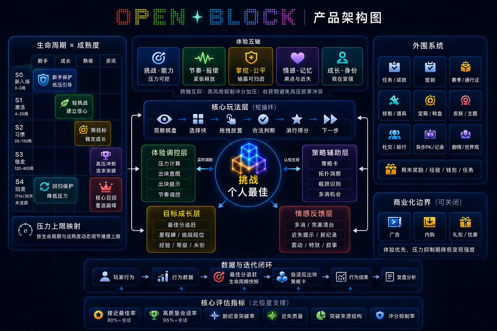

# OpenBlock 产品架构图

> **定位**：把 OpenBlock 的产品形态从「玩家视角」沿着`挑战个人最佳 → 5 层游戏化结构 → 生命周期 × 成熟度差异化 → 北极星闭环`一根弦串到底，作为
> [`BEST_SCORE_CHASE_STRATEGY.md`](../player/BEST_SCORE_CHASE_STRATEGY.md)、
> [`EXPERIENCE_DESIGN_FOUNDATIONS.md`](../player/EXPERIENCE_DESIGN_FOUNDATIONS.md)、
> [`PLAYER_LIFECYCLE_MATURITY_BLUEPRINT.md`](../operations/PLAYER_LIFECYCLE_MATURITY_BLUEPRINT.md)
> 三份主策划契约的可视化伴随文档。
>
> **范围**：核心主线（PB 追逐）、体验五轴、5 层游戏化结构（核心玩法 / 体验调控 / 策略辅助 / 目标成长 / 情感反馈）、生命周期 × 成熟度 25 格压力上限映射、外围系统（任务 / 签到 / 赛季 / 通行证 / 社交 / 异步 PK / 局末奖励 / 皮肤）、商业化边界（广告 / 内购 / 礼包，可关闭）、数据与迭代闭环、北极星指标。
>
> **维护约定**：图中每一块都必须能追到具体代码文件 + 一句话定位；标注为「仅文档 / 未落地」的项不允许在面板与营销话术中作为"已上线能力"使用；新增产品形态需先扩展本文档与
> [`BEST_SCORE_CHASE_STRATEGY.md`](../player/BEST_SCORE_CHASE_STRATEGY.md)
> 的 §4 改进项编号，再提交代码 PR。
>
> **诚实标注前置**：本文档严格区分"已实现"与"仅文档 / 未落地"两类——商业化触发护栏、外围系统中的剧情 / 世界观模块、北极星 6 项细指标的 SQL 落地等均存在不同程度的"文档先行 / 实现待补"情况，详见 §11 与 §12。

## 阅读顺序

| 节 | 回答的问题 | 适合角色 |
|---|---|---|
| [§ 0 核心主线](#-0-核心主线挑战个人最佳) | OpenBlock 的玩法目标是什么？为什么"PB 追逐"可以贯穿 5 层结构？ | 主策划、产品总监、新人破冰 |
| [§ 1 体验五轴](#-1-体验五轴挑战能力--节奏报偿--掌控公平--情感记忆--成长身份) | 产品如何把"体验"分解为可观察的 5 条通路？ | 产品策划、体验设计 |
| [§ 2 生命周期 × 成熟度 25 格](#-2-生命周期--成熟度-25-格压力上限映射) | 同一棋盘上，不同玩家凭什么得到不同的难度曲线？ | 主策划、运营、算法 |
| [§ 3 核心玩法层（短循环 6 步）](#-3-核心玩法层短循环-6-步) | 玩家每一回合的 6 步操作分别落在哪个文件？ | 产品、QA、新工程师 |
| [§ 4 体验调控层](#-4-体验调控层实时调制) | 压力 / 出块意图 / 出块提示 / 节奏 4 条调制通路在哪？ | 产品、算法 |
| [§ 5 策略辅助层](#-5-策略辅助层认知支持) | 策略卡 / 拓扑洞察 / 瓶颈识别 / 多消机会如何被生成？ | 产品、算法 |
| [§ 6 目标成长层](#-6-目标成长层长期动机) | PB 追赶 / 里程碑 / 段位 / 经验 / 关卡 5 条长期动机如何叠加？ | 主策划、运营 |
| [§ 7 情感反馈层](#-7-情感反馈层情绪闭环) | 多消 / 完美清台 / 近失 / 新纪录 / 震动 / 特效 / 叙事如何被触发？ | 产品、体验、QA |
| [§ 8 外围系统（可关闭）](#-8-外围系统可关闭不抢戏) | 任务 / 签到 / 赛季 / 通行证 / 社交 / 异步 PK 入口在哪？ | 产品、运营 |
| [§ 9 商业化边界（可关闭）](#-9-商业化边界可关闭体验优先) | 广告 / 内购 / 礼包如何在不损害体验前提下接入？ | 商业化、运营 |
| [§ 10 数据与迭代闭环](#-10-数据与迭代闭环) | 玩家行为 → 行为数据 → 决策调整 → 行为结果如何形成正反馈？ | 产品、数据、算法 |
| [§ 11 核心评估指标（北极星）](#-11-核心评估指标北极星) | "调到追逐 PB 但不轻易超越 PB"的甜区如何被量化？ | 产品总监、运营、数据 |
| [§ 12 设计哲学](#-12-设计哲学与行业默认做法不同的具体选择) | 产品层面与行业默认做法不同的 4 处具体选择是什么？ | 全角色 |

---

## 总览图：5 层结构 + 25 格矩阵 + 北极星闭环

> **回答的问题**：OpenBlock 作为一个"PB 追逐型休闲解谜"产品，由哪些产品能力组成？这些能力如何围绕一根唯一主线、按 25 格差异化、并被北极星指标量化？
>
> 本图是**最高层的产品视角**：不出现具体代码模块，把整个产品浓缩为一根核心主线 + 5 层游戏化结构 + 25 格压力调制矩阵 + 一组北极星指标。下方 §0–§11 把图中每一块映射到具体的代码入口与文档锚点。



| 区块 | 在图中的位置 | 一句话定位 |
|---|---|---|
| 🎯 **核心主线** | 中央 | 唯一可被全角色复述的玩法目标 |
| 🪟 **体验五轴** | 顶部中央 | 把"体验"分解为 5 条互不重复、可观察的通路 |
| 🗺️ **生命周期 × 成熟度** | 左栏 | 25 格压力上限映射，按 S0–S4 × M0–M4 做差异化 |
| 🎮 **核心玩法层** | 中央偏上 | 6 步短循环，每回合从棋盘观察到下一组三连块 |
| 🎛️ **体验调控层** | 中央偏左 | 实时调制：压力计算 / 出块意图 / 出块提示 / 节奏调控 |
| 🧭 **策略辅助层** | 中央偏右 | 认知支持：策略卡 / 拓扑洞察 / 瓶颈识别 / 多消机会 |
| 🪜 **目标成长层** | 中央偏下偏左 | 长期动机：最佳分追赶 / 里程碑 / 段位 / 经验 / 关卡 |
| 💖 **情感反馈层** | 中央偏下偏右 | 情绪闭环：多消 / 完美清台 / 近失 / 新纪录 / 震动 / 特效 / 叙事 |
| 🎪 **外围系统** | 右栏 | 任务 / 成就 / 签到 / 赛季 / 通行证 / 技能 / 道具 / 宝箱 / 转盘 / 皮肤 / 社交 / 异步 PK / 局末奖励 |
| 💰 **商业化边界** | 右下 | 广告 / 内购 / 礼包，体验优先、压力抑制期降变现 |
| 🔁 **数据与迭代闭环** | 底部 | 玩家行为 → 行为数据 → PB 追赶 → 自适应出块 → 行为结果 → 复盘 |
| 🌟 **核心评估指标** | 底部 | 6 项北极星指标量化产品是否调到"追逐 PB 但不轻易超越 PB"的甜区 |

---

## § 0 核心主线：挑战个人最佳

> **回答的问题**：OpenBlock 的玩法目标是什么？为什么"PB 追逐"足够作为唯一主线？

| 事实 | 代码 / 配置入口 |
|---|---|
| PB 按难度档分桶（easy / normal / hard） | `web/src/bestScoreBuckets.js`：`getBestByStrategy` / `submitBestByStrategy` |
| 周期 PB（weekly / monthly） | `web/src/bestScoreBuckets.js`：`getPeriodBests` / `submitPeriodBest`，按 ISO 周 / 自然月 key |
| 跨设备 PB 同步 | `web/src/localStorageStateSync.js` `CORE_KEYS` 含 `openblock_best_by_strategy_v1` 与 `openblock_period_best_v1` |
| PB 庆祝（最多 3 次 / 局，破纪录释放窗口）  | `web/src/game.js`：`_maybeCelebrateNewBest` + `_startPostPbReleaseWindow` |
| PB 接近提示（gap warmup gate） | `web/src/game.js`：`updateUI` 中 `best.gap` 在 `gameStats.placements < 3` 时不显示，`best.gap.far` D0 远征 3 文案池轮转 |
| PB 异常分守卫 | `web/src/game.js`：`endGame` 中按 `bestScoreSanity.multiplier` 判定，疑似异常时不持久化到后端、只更新内存与发 `lifecycle:suspicious_pb` 事件；阈值在 `shared/game_rules.json` `bestScoreSanity` |
| PB 生命周期事件总线 | `web/src/monetization/MonetizationBus.js` 发布 4 条事件：`lifecycle:new_personal_best` / `:near_personal_best` / `:period_best` / `:suspicious_pb` |
| PB 与压力的耦合（B 类挑战加压） | `web/src/adaptiveSpawn.js` `isBClassChallenge` 在 `currentScore / bestScore ≥ 0.8` 时触发 `challengeBoost`；8 段 bypass 见 §4 |
| 二度里程碑（破 PB 后动态注入 +10% / +25%） | `web/src/adaptiveSpawn.js` `deriveScoreMilestones(bestScore, currentScore)` |
| pbChase 策略卡（D3.close / D3.victory / D4） | `web/src/strategyAdvisor.js` 新增 `pbChase` 类别，根据 `currentScore / bestScore` 比与 `postPbReleaseActive` 切档 |

**单元测试**：`tests/bestScoreChaseStrategy.test.js`（50 个用例覆盖 §4.1–§4.13）+ `tests/gameBestScore.test.js`。

**文档锚点**：[最佳分追逐策略](../player/BEST_SCORE_CHASE_STRATEGY.md) §4 改进项 13 项已全部交付（v1.55）。

---

## § 1 体验五轴：挑战能力 / 节奏报偿 / 掌控公平 / 情感记忆 / 成长身份

> **回答的问题**：把"体验"翻译成 5 条互不重复的通路，每条通路有什么具体特征字段？

| 轴 | 在图中的位置 | 代表特征 / 通路 | 代码事实 |
|---|---|---|---|
| 🎯 **挑战·能力**（压力可控） | 五轴 ① | `flowDeviation` / `flowState` / `challengeBoost` | `web/src/playerProfile.js` `flowDeviation`、`web/src/playerAbilityModel.js` `flowDeviation` / `clearEfficiency`、`web/src/adaptiveSpawn.js` `flowDev` / `challengeBoost` |
| 🎵 **节奏·报偿**（紧张释放） | 五轴 ② | `pacingPhase` / `rhythmPhase` / `pacingAdjust` | `web/src/playerProfile.js` `pacingPhase`、`web/src/adaptiveSpawn.js` `deriveRhythmPhase` / `pacingAdjust` / `spawnHints.rhythmPhase`、`web/src/moveSequence.js` 回放标注 |
| ⚖️ **掌控·公平**（输赢可归因） | 五轴 ③ | `spawnHints.orderRigor` / `orderMaxValidPerms` / 合法落子吸附 | `web/src/adaptiveSpawn.js` `spawnHints.orderRigor` / `orderMaxValidPerms`、`web/src/grid.js` `canPlace` / `pickSmartHoverPlacement`（**注**：图中"公平"概念未对应单一 `fairnessVerdict` 符号，散落在 spawnHints 与盘面合法性约束中） |
| 💖 **情感·记忆**（爽点与近失） | 五轴 ④ | `nearMissAdjust` / `_maybeCelebrateNewBest` / `buildStoryLine` | `web/src/adaptiveSpawn.js` `nearMissAdjust`、`web/src/nearMissPlaceFeedback.js` `shouldShowNearMissPlaceFeedback`、`web/src/game.js` `_maybeCelebrateNewBest` / `playClearEffect` / `showFloatScore`、`web/src/stressMeter.js` `buildStoryLine`（**注**：图中"叙事"概念未对应单一 `narrationBus` 模块，由 `buildStoryLine` 与 i18n 文案池承载） |
| 🌱 **成长·身份**（我在变强） | 五轴 ⑤ | `segment5` / `playstyle` / SkillScore / M-band | `web/src/playerProfile.js` `segment5` / `playstyle`、`web/src/retention/playerMaturity.js` `SkillScore` 与 `getMaturityBand`（阈值 ≥90→M4 / 80→M3 / 60→M2 / 40→M1 / 其余 M0）（**注**：图中"身份"概念未对应单一 `identityMetrics` 符号，由 `segment5` + `playstyle` + `M-band` 三件套承载） |

**跨轴互抑**：高风险抑制冲分加压、收获期避免高压叙事冲突。文档锚点 [体验设计基石](../player/EXPERIENCE_DESIGN_FOUNDATIONS.md) Part C / C.2 + [实时策略系统](../player/REALTIME_STRATEGY.md) §3.7。代码示例：

- `web/src/adaptiveSpawn.js` 内 `challengeBoost` × `friendlyBoardRelief`、`reactionAdjust` × `nearMissAdjust`、`bottleneckRelief` × `challengeBoost` 折扣等。
- v1.55 新增 `postPbReleaseStressAdjust`：破 PB 后 3 个 spawn 内 stress × 0.7（**raw 域系数**；对外 stress 口径见 [自适应出块 §3.5](../algorithms/ADAPTIVE_SPAWN.md#35-stress-域口径v15517)）+ clearGuarantee+1，破纪录与情感释放轴不与下一轮挑战加压冲突。

---

## § 2 生命周期 × 成熟度 25 格压力上限映射

> **回答的问题**：在同一份棋盘代码下，OpenBlock 凭什么让 S0·M0（新手保护）与 S3·M4（核心冲分）得到完全不同的难度曲线？

| 事实 | 代码入口 |
|---|---|
| 25 格压力上限映射 | `web/src/lifecycle/lifecycleStressCapMap.js` `LIFECYCLE_STRESS_CAP_MAP`（v1.55 已补齐全部 25 格） |
| 生命周期 S0–S4 派生 | `web/src/retention/playerLifecycleDashboard.js` `getPlayerLifecycleStage` + `web/src/lifecycle/lifecycleSignals.js` `mapStageToStageCode` |
| 成熟度 M0–M4 派生 | `web/src/retention/playerMaturity.js` `getMaturityBand`（阈值 ≥90/80/60/40） |
| 编排器写回 | `web/src/lifecycle/lifecycleOrchestrator.js` `updateMaturity` + session 钩子 |
| 出块消费 | `web/src/adaptiveSpawn.js` `getLifecycleStressCap(stage, band)` → 先 cap 裁剪 raw stress、再累加 `adjust`，写入 `stressBreakdown.lifecycle*` |

**25 格 cap × adjust 矩阵**（以 `web/src/lifecycle/lifecycleStressCapMap.js` 为准；**数值为 raw 域**，对外面板 stress 经 `(raw + 0.2) / 1.2` 归一化为 `[0, 1]`，例如 cap 0.85 raw ≈ norm 0.875；详见 [自适应出块 §3.5 stress 域口径](../algorithms/ADAPTIVE_SPAWN.md#35-stress-域口径v15517)）：

| Stage \ Band | M0（新手） | M1（成长） | M2（熟练） | M3（资深） | M4（核心） |
|---|---|---|---|---|---|
| **S0**（新入场） | 0.50 / −0.15 | 0.55 / −0.12 | 0.58 / −0.10 | 0.62 / −0.08 | 0.65 / −0.05 |
| **S1**（激活） | 0.60 / −0.10 | 0.65 / −0.05 | 0.70 / 0.00 | 0.75 / +0.04 | 0.78 / +0.06 |
| **S2**（习惯） | 0.65 / −0.10 | 0.70 / 0.00 | 0.75 / +0.05 | 0.82 / +0.10 | 0.85 / +0.11 |
| **S3**（稳定） | 0.65 / −0.05 | 0.72 / 0.00 | 0.78 / +0.05 | 0.85 / +0.10 | 0.88 / +0.12 |
| **S4**（回流） | 0.55 / −0.15 | 0.60 / −0.10 | 0.70 / 0.00 | 0.75 / +0.05 | 0.80 / +0.08 |

> **设计原则**（与文件 docstring 一致）：
>
> 1. **行内单调**：同 stage 内 M0→M4 cap 与 adjust 单调递增，"成长有奖励"；
> 2. **列内分层**：S0 / S4 弱保护（cap ≤ 0.65 / 0.80）、S2 / S3 强承受（cap 可达 0.88），反映生命周期价值曲线；
> 3. **S0 行整体钳制 cap ≤ 0.65**：即便高 M-band 玩家在 onboarding 期也不应被压制；
> 4. **新格线性插值**：v1.55 补齐的 8 格在相邻已知格之间插值，不破坏原有梯度。

**单元测试**：`tests/bestScoreChaseStrategy.test.js` §4.1（覆盖 25 格非 null + 行内单调 + 行内 cap ≤ 0.88）+ `tests/challengeDesignOptimization.test.js`。

**文档锚点**：[生命周期与成熟度蓝图](../operations/PLAYER_LIFECYCLE_MATURITY_BLUEPRINT.md) + [最佳分追逐策略 §4.1](../player/BEST_SCORE_CHASE_STRATEGY.md)。

---

## § 3 核心玩法层（短循环 6 步）

> **回答的问题**：玩家每一回合的 6 步操作分别落在哪个文件？

| 短循环步骤 | 代码入口 |
|---|---|
| ① **观察棋盘** | `web/src/renderer.js`（盘面渲染）+ `web/src/boardTopology.js` `analyzeBoardTopology`（拓扑分析，供策略辅助层消费） |
| ② **选块**（dock 三连块） | `web/src/game.js` `populateDockUI` / `spawnBlocks` / `_spawnBlocksWithModel`；形状池在 `web/src/bot/blockSpawn.js`、`web/src/shapes.js` |
| ③ **拖拽** | `web/src/game.js` `startDrag` / `updateGhostPosition` / `ghostAimOnGrid` / `onMove` / `onEnd` |
| ④ **合法判断 + 智能吸附** | `web/src/grid.js` `canPlace` / `pickSmartHoverPlacement`，由 `game.js` `onEnd` 调用 |
| ⑤ **写入与消行** | `web/src/grid.js` `place` / `checkLines`；可选关卡规则注入 `ClearRuleEngine`（`game.js` `_clearEngine`） |
| ⑥ **得分 + 下一组三连块** | `web/src/clearScoring.js` `computeClearScore` / `PERFECT_CLEAR_MULT` + `game.js` `playClearEffect` + `spawnBlocks`（dock 清空后下一轮） |

短循环不进行 ML 推理，所有 ML / 自适应决策发生在 ② 选块前与 ⑥ 下一组前，由下方 §4–§5 调制。

---

## § 4 体验调控层（实时调制）

> **回答的问题**：压力 / 出块意图 / 出块提示 / 节奏 4 条调制通路在哪？

| 通路 | 代码入口 |
|---|---|
| **压力计算（多信号 stress 合成）** | `web/src/adaptiveSpawn.js` `stressBreakdown` 字典全量分项：`scoreStress` / `challengeBoost` / `recoveryAdjust` / `bottleneckRelief` / `sessionArcAdjust` / `postPbReleaseStressAdjust` / `lifecycleCapAdjust` / `lifecycleBandAdjust` / `winbackStressCap` 等 |
| **出块意图（spawnIntent）** | `web/src/adaptiveSpawn.js` `spawnIntent`：`relief`（救济） / `flowPayoff`（爽感兑现） / `challenge`（挑战） / `practice`（练习）等 |
| **出块提示（spawnHints）** | `web/src/adaptiveSpawn.js` `spawnHints`：`clearGuarantee` / `sizePreference` / `multiClearBonus` / `spatialPressure` / `orderRigor` / `rhythmPhase` 等 |
| **节奏调控** | `web/src/playerProfile.js` `pacingPhase` 慢变量 + `web/src/adaptiveSpawn.js` `deriveRhythmPhase` / `pacingAdjust`（**注**：仓库内无独立 `rhythmController.js`，节奏由这两个文件协同完成） |

**finalStress 合成顺序**（均在 `web/src/adaptiveSpawn.js` 同一函数链路内）：

1. 各分项合成 `stressBreakdown.rawStress`
2. `getLifecycleStressCap`：`lifecycleCapAdjust`（超 cap 压低）+ `lifecycleBandAdjust`（±adjust）
3. onboarding：`firstSessionStressOverride`
4. `getActiveWinbackPreset`：`winbackStressCap` min
5. `challengeBoost`（B 类近 PB，含 `challengeBoostBypass` 8 段互斥）
6. 全局 clamp / `occupancyDamping` / `smoothStress` / `minStress` floor / `flowPayoffCap`
7. `postPbReleaseActive`：正向 stress × 0.7
8. 写入 `stressBreakdown.finalStress`

**双面板同步**：`web/src/stressMeter.js` `getStressDisplay` / `buildStressBreakdownPills` / `buildStoryLine`；`web/src/decisionFlowViz.js` 把 `stressBreakdown` / `spawnHints` / `spawnIntent` 全量字段映射到 DFV 节点字典。

**文档锚点**：[自适应出块](../algorithms/ADAPTIVE_SPAWN.md) + [实时策略系统](../player/REALTIME_STRATEGY.md)。

---

## § 5 策略辅助层（认知支持）

> **回答的问题**：策略卡 / 拓扑洞察 / 瓶颈识别 / 多消机会如何被生成？

| 能力 | 代码入口 |
|---|---|
| **策略卡** | `web/src/strategyAdvisor.js` `buildStrategyTipsFromInsight`（读 `spawnHints` / `scoreMilestone` / `sessionArc` / `comboChain` / `lifecycle` / `pbContext`）；v1.55 新增 `pbChase` 类别，根据 `currentScore / bestScore` 比与 `postPbReleaseActive` 在 D3.close / D3.victory / D4 间切档 |
| **拓扑洞察** | `web/src/boardTopology.js` `analyzeBoardTopology`：空洞 / 近满线 / 角落孤岛识别（**注**：仓库内无 `topologyInsight.js`，逻辑由 `boardTopology.js` 承载） |
| **瓶颈识别** | `web/src/game.js` `_updateBottleneckTrough` / `_resetBottleneckTrough`：写入 `_spawnContext.bottleneckTrough` / `bottleneckSamples`，供 `adaptiveSpawn.js` `bottleneckRelief` 消费 |
| **多消机会** | 目标侧：`web/src/adaptiveSpawn.js` `deriveSpawnTargets` 含 `clearOpportunity`；bot 加权：`web/src/bot/blockSpawn.js` + `web/src/bot/spawnLayers.js` |
| **面板装配** | `web/src/playerInsightPanel.js` 把 `analyzeBoardTopology` 结果 + `_countLiveMultiClearCandidates` + `getCachedLifecycleSnapshot` + `pbContext` 拼装为 `gridInfo` 喂给 `strategyAdvisor` |

---

## § 6 目标成长层（长期动机）

> **回答的问题**：PB 追赶 / 里程碑 / 段位 / 经验 / 关卡 5 条长期动机如何叠加？

| 动机 | 代码入口 |
|---|---|
| **最佳分追赶** | §0 已展开（`bestScoreBuckets.js` + `_maybeCelebrateNewBest`） |
| **分数里程碑（含 v1.55 二度里程碑）** | `web/src/adaptiveSpawn.js` `deriveScoreMilestones(bestScore, currentScore)` / `checkScoreMilestone`；破 PB 后动态注入 `bestScore × 1.10` 与 `bestScore × 1.25` 两档 |
| **成熟度里程碑** | `web/src/retention/maturityMilestones.js`（与分数里程碑分列，按 SkillScore 触发） |
| **挑战段位** | `web/src/playerProfile.js` `segment5`（按 SkillScore + lifecycle 分段） |
| **赛季阶梯** | `web/src/monetization/seasonPass.js` + `web/src/seasonPass.js` + `web/src/daily/seasonPassEntry.js` |
| **经验 / 等级** | `web/src/progression.js` `computeXpGain` / `applyGameEndProgression` / `getLevelFromTotalXp` |
| **关卡** | `web/src/level/levelManager.js` |

**注**：图中"最佳分追赶"为本层唯一可被全角色复述的主线；其余 4 条（里程碑 / 段位 / 经验 / 关卡）均作为 PB 主线的进度叙事载体，不允许独立成为玩法目标。

---

## § 7 情感反馈层（情绪闭环）

> **回答的问题**：多消 / 完美清台 / 近失 / 新纪录 / 震动 / 特效 / 叙事如何被触发？

| 事件 | 代码入口 |
|---|---|
| **多消 / 完美清台** | `web/src/game.js` `playClearEffect` / `showFloatScore`（combo / perfect / scoreMilestone）+ `web/src/clearScoring.js` `PERFECT_CLEAR_MULT` |
| **近失提示** | `web/src/nearMissPlaceFeedback.js` `shouldShowNearMissPlaceFeedback` + `web/src/grid.js` `getBlockedEdgeCellsNearMissForPlacementForFeedback` |
| **新纪录庆祝** | `web/src/game.js` `_maybeCelebrateNewBest`（v1.55.11：单局只 1 次完整烟花 + "🏆 刷新最佳！"，后续刷新只静默更新 `bestScore`；Hard 模式 hardScale × 1.3） |
| **破纪录释放窗口** | `web/src/game.js` `_startPostPbReleaseWindow` + `_commitSpawn` 计数 + `web/src/adaptiveSpawn.js` `postPbReleaseStressAdjust` |
| **震动** | `web/src/effects/audioFx.js` `play` / `vibrate` / `setHaptic`（**注**：仓库内无 `hapticBus.js`，震动由 `audioFx.js` 承载） |
| **粒子 / 特效** | `web/src/renderer.js` + `web/src/optimizedParticles.js`，由 `game.js` `renderer.addParticles` 调用 |
| **叙事** | `web/src/stressMeter.js` `buildStoryLine`（一句话压力叙事）+ i18n 文案池（`web/src/i18n/locales/{zh-CN,en}.js` 中 `best.gap.far.*` / `effect.newRecord.*` / `dfv.contrib.*` 等） |

---

## § 8 外围系统（可关闭，不抢戏）

> **回答的问题**：任务 / 签到 / 赛季 / 通行证 / 社交 / 异步 PK 入口在哪？

| 系统 | 代码入口 |
|---|---|
| **任务** | `web/src/monetization/dailyTasks.js` + `weeklyChallenge.js` + `miniGoals.js` |
| **成就** | `web/src/database.js` `checkAndUnlockAchievements` + `web/src/achievements/extremeAchievements.js` |
| **签到 / 登录连击** | `web/src/checkin/checkInPanel.js` + `loginStreak.js` + `monthlyMilestone.js` + `checkinSync.js` |
| **赛季 / 通行证** | `web/src/monetization/seasonPass.js` + `web/src/seasonPass.js` + `web/src/daily/seasonPassEntry.js` |
| **技能 / 道具** | `web/src/skills/wallet.js` + `web/src/skills/skillBar.js` + `bomb` / `rainbow` / `undo` / `reroll` / `preview.js` 等 |
| **宝箱 / 转盘** | `web/src/rewards/endGameChest.js` + `luckyWheel.js` + `seasonChest.js` |
| **皮肤 / 主题** | `web/src/skins.js` + `web/src/monetization/skinUnlock.js` + `web/src/effects/ambientParticles.js` |
| **皮肤叙事** | `web/src/lore/skinLore.js`（注：图中"剧情 / 世界观"模块仅在皮肤叙事层有承载，**全局世界观模块未实现**） |
| **社交 / 排行** | `web/src/monetization/socialLeaderboard.js` + `leaderboard.js` + `web/src/social/socialManager.js` |
| **异步 PK / 回放** | `web/src/social/asyncPk.js` + `replayAlbum.js` + `replayAlbumStub.js` + `replayUI.js` |
| **局末奖励** | `web/src/rewards/endGameChest.js`（与其他结算 toast 共存） |

**契约**：所有外围系统在 `web/src/main.js` / `initDeferredPanels.js` / `moduleLazyLoader.js` 处声明，可通过 `web/src/monetization/featureFlags.js` 关闭；任务 / 排行榜 / 皮肤 / 通行证 / 分享默认开启但走"成就 / 自我表达"路径，不阻断主线。

---

## § 9 商业化边界（可关闭，体验优先）

> **回答的问题**：广告 / 内购 / 礼包如何在不损害体验前提下接入？

| 能力 | 代码入口 |
|---|---|
| **广告适配器** | `web/src/monetization/adAdapter.js`（showRewarded / Interstitial） |
| **广告触发护栏** | `web/src/monetization/adTrigger.js` `_isInFlow` / `_isCognitivelyFatigued` + 频次控制 |
| **广告决策引擎** | `web/src/monetization/ad/adDecisionEngine.js` + `ad/adInsertionRL.js`（opt-in RL） |
| **内购** | `web/src/monetization/iapAdapter.js` + `paymentManager.js` |
| **礼包 / 优惠** | `web/src/monetization/offerToast.js` + `lifecycleAwareOffers.js`（按生命周期触发） |
| **商业化策略** | `web/src/monetization/commercialModel.js` + `personalization.js` + `strategyEngine.js` |
| **特征开关** | `web/src/monetization/featureFlags.js`：默认关闭广告 / IAP / Push；任务 / 排行榜 / 皮肤 / 通行证 / 分享 / Stub / 体验面板 / 生命周期 Toast 默认开启 |

**体验优先契约**：

- **心流期降权**：`adTrigger.js` `_isInFlow` 命中时广告频次按比例降低；
- **认知疲劳降权**：`adTrigger.js` `_isCognitivelyFatigued` 命中时跳过当帧插播；
- **压力抑制期降变现强度**：与 §4 `postPbReleaseStressAdjust` 协同——破 PB 后 3 个 spawn 内不应插播打断；
- **PB 异常分守卫**：与 §0 `endGame` sanity guard 协同——疑似异常分不计入 LTV 计算口径。

**注**：商业化触发护栏的"压力抑制期降变现强度"在文档与 `adTrigger.js` 中有概念定义，**但与 `postPbReleaseActive` 的直接耦合点尚未在代码中显式接线**，目前依赖 `_isInFlow` 间接保护，属"文档先行 / 实现待补"事项，记入 [BEST_SCORE_CHASE_STRATEGY](../player/BEST_SCORE_CHASE_STRATEGY.md) 后续迭代项。

---

## § 10 数据与迭代闭环

> **回答的问题**：玩家行为 → 行为数据 → 决策调整 → 行为结果如何形成正反馈？

```
玩家行为 → 行为数据 → 最佳分追赶 / 生命周期信号 → 自适应出块 → 行为结果 → 复盘分析 → 玩家行为
```

| 环节 | 代码入口 |
|---|---|
| **玩家行为采集** | `web/src/game.js` `logBehavior` + `web/src/monetization/analyticsTracker.js` `trackEvent` + `web/src/moveSequence.js`（局内逐 move 序列） |
| **行为数据落库** | `web/src/database.js` 本地 IndexedDB + `web/src/services/backendSync.js` flush 到后端 + `server.py`（sessions / behaviors / user_stats 表，详见 [SQLITE_SCHEMA](../engineering/SQLITE_SCHEMA.md)） |
| **PB 追赶闭环** | §0 已展开 |
| **生命周期信号** | `web/src/lifecycle/lifecycleSignals.js` `getUnifiedLifecycleSnapshot` |
| **自适应出块** | `web/src/adaptiveSpawn.js` + `web/src/bot/blockSpawn.js` |
| **行为结果（动作结果矩阵）** | `web/src/monetization/quality/actionOutcomeMatrix.js`（opt-in） |
| **留存分析** | `web/src/monetization/retentionAnalyzer.js`（本地化 cohort） |
| **复盘分析** | `web/src/moveSequence.js` `buildReplayAnalysis`（**注**：仓库内无独立 `reviewPanel.js`，复盘 UI 由 `replayUI.js` + `replayAlbum.js` 承载） |
| **事件总线** | `web/src/monetization/MonetizationBus.js` 是商业化与生命周期事件的**唯一总线**，事件全集见 [MonetizationBus 事件契约](./MONETIZATION_EVENT_BUS_CONTRACT.md) |

---

## § 11 核心评估指标（北极星）

> **回答的问题**："调到追逐 PB 但不轻易超越 PB"的甜区如何被量化？

**6 项北极星指标**（按图中标注，对应 [PLAYER_LIFECYCLE_MATURITY_BLUEPRINT.md §0](../operations/PLAYER_LIFECYCLE_MATURITY_BLUEPRINT.md) 与 [OPS_DASHBOARD_METRICS_AUDIT.md](../operations/OPS_DASHBOARD_METRICS_AUDIT.md)）：

| 指标 | 目标值 | 设计意图 | 实现状态 |
|---|---|---|---|
| **接近最佳率** | ≥ 80% 会话 | 追逐 PB 的玩家比例足够高 | ⚠️ 文档规划 / SQL 口径未落地 |
| **高质量会话率** | ≥ 95% 会话 | 短局败局率受控、体验劣化罕见 | ⚠️ 文档规划 / SQL 口径未落地 |
| **新纪录突破率** | 不爆表 | 与"接近最佳率"互制衡——破 PB 不易但可达 | ⚠️ 文档规划 / SQL 口径未落地 |
| **近失质量** | 提升 | 近失发生在"差一格 / 差一手"而非"差一万分" | ⚠️ 文档规划 / SQL 口径未落地 |
| **突破来源结构** | 健康分布 | PB 突破来自 challengeBoost / postPbRelease / pbChase 卡的分布 | ⚠️ 文档规划 / SQL 口径未落地 |
| **冲分抑制率** | 与流失率反相关 | "B 类挑战 + bypass 8 段"是否真的减少了流失 | ⚠️ 文档规划 / SQL 口径未落地 |

**已实现的底层数据基础**：

| 能力 | 代码入口 |
|---|---|
| **看板前端** | `web/src/opsDashboard.js` + `web/public/ops-dashboard.html` |
| **后端聚合 API** | `server.py` `GET /api/ops/dashboard` 返回 `coreMetrics` / `businessMetrics`（DAU / 留存 stub / crash / jank / `best_score` Top 等） |
| **会话指标基础** | `web/src/game.js` `saveSession` 写入 `gameStats.replayAnalysis` + `lifecycle` |
| **复盘 rating / tags** | `web/src/moveSequence.js` `buildReplayAnalysis` 产出 rating / tags |
| **PB 主线事件** | `MonetizationBus` 4 条 lifecycle:* 事件已上线，可作为 SQL 计算口径的原始事件源 |

**诚实标注**：6 项北极星指标的 SQL 落地（`best_80_rate` / `near_best_quality` / `best_break_source` / `chase_suppression_rate` 等列）目前**仅在 `OPS_DASHBOARD_METRICS_AUDIT.md` 文档中规划**，`server.py` / `opsDashboard.js` / `database.js` 中尚未检出实现。建议下一迭代按"`MonetizationBus` 事件 → SQL 聚合视图 → opsDashboard 字段"三段式落地。

---

## § 12 设计哲学：与行业默认做法不同的具体选择

OpenBlock 在产品层面与行业默认做法不同的 4 处具体选择：

**①「核心主线唯一可复述」而非"多支线并行"**

- **非默认选择**：所有外围系统的奖励、任务、签到，最终都要回到「让我离 PB 更近一步」这一根叙事弦上；不允许独立成为玩法目标。
- **代价**：任务 / 签到 / 通行证的设计师需要先想清楚"它如何指向 PB"，初期沟通成本上升。
- **回报**：玩家在 5 分钟试玩、客服投诉、应用商店评分等场景下，都能用同一句话描述"我在玩什么"；产品迭代不会因多支线撕扯。
- **验证**：每一条 i18n toast 在 PR 评审时被要求显式回答"它和 PB 主线有何关系"；与之无关的玩法点放进 `archive/` 而非主线。

**②「难度按 25 格映射」而非"单一全局曲线"**

- **非默认选择**：`LIFECYCLE_STRESS_CAP_MAP` 25 格独立定义 `{cap, adjust}`；S0·M0 与 S3·M4 在同一棋盘上得到完全不同的出块与节奏。
- **代价**：调难度档要改 25 格里的具体格子，而不是改一个全局倍率；策划需要理解 S × M 两轴的派生逻辑。
- **回报**：新人 / 回流 / 核心三类玩家可以在同一份代码下并存，而不是被同一条曲线强行拉到中间。
- **验证**：`tests/bestScoreChaseStrategy.test.js` §4.1 强制要求 25 格非 null、行内单调；任何调表 PR 都会被这组单测拦截。

**③「外围 / 商业化都可关闭」而非"打开默认"**

- **非默认选择**：`featureFlags.js` 默认关闭广告 / IAP / Push；任务 / 排行榜 / 皮肤 / 通行证 / 分享默认开启但走"成就 / 自我表达"路径。
- **代价**：要为"商业化关闭"与"商业化开启"两种产品形态各跑一遍 QA。
- **回报**：开发者可以用同一份代码上线"纯体验 demo"与"完整商业化版本"；面对监管收紧（如 GDPR / 国内未成年人保护）的策略响应延迟从月级降到分钟级。
- **验证**：`tests/monetization*.test.js` 多个套件覆盖 flag on/off 两种路径；`docs/operations/COMPLIANCE_AND_SOPS.md` 提供合规 SOP。

**④「北极星指标支撑"追逐 PB 而不轻易超越 PB"」而非"破纪录率最大化"**

- **非默认选择**：核心评估指标按"接近最佳率 / 高质量会话率 / 新纪录突破率 / 近失质量 / 突破来源结构 / 冲分抑制率"6 项组织；其中"接近最佳率"与"新纪录突破率"被设计为相互制衡——前者高且后者**不**爆表才证明产品调到了甜区。
- **代价**：不能用"破纪录率最大化"这种单一指标做 A/B 测试；运营报表需要同时看 6 项指标的组合。
- **回报**：避免"产品调到玩家轻松破纪录 → 短期 DAU 飙升 → 长期失去追逐感 → 流失"的反模式；让"挑战自我"在数值上有可证伪的定义。
- **验证**：详见 §11 实现状态与待补项。

---

## 维护约定

1. **代码事实优先**：本图中每一块都必须能追到具体代码文件 + 一句话定位；标注为"仅文档 / 未落地"的项不允许在面板与营销话术中作为"已上线能力"使用。
2. **诚实标注**：实现状态分为「已实现」「opt-in flag 默认 OFF」「仅文档 / 未落地」三档，调表 / 调参 PR 必须显式声明会改动哪一档。
3. **与上游契约同步**：本文档与
   - [`BEST_SCORE_CHASE_STRATEGY.md`](../player/BEST_SCORE_CHASE_STRATEGY.md)（§4 改进项编号）
   - [`EXPERIENCE_DESIGN_FOUNDATIONS.md`](../player/EXPERIENCE_DESIGN_FOUNDATIONS.md)（Part C 互抑表）
   - [`PLAYER_LIFECYCLE_MATURITY_BLUEPRINT.md`](../operations/PLAYER_LIFECYCLE_MATURITY_BLUEPRINT.md)（25 格矩阵 + 6 项北极星）
   - [`MONETIZATION_EVENT_BUS_CONTRACT.md`](./MONETIZATION_EVENT_BUS_CONTRACT.md)（lifecycle:* 事件）
   
   三者+1必须保持单向引用：本文档作为"产品视角伴随",上述四份契约作为单一事实源。
4. **新增产品形态先扩展文档**：任何新增的外围系统 / 商业化触发 / 北极星指标都要先在本文档 + 上游契约里登记，再进入代码实现；避免"实现先行 / 文档追赶"的反模式。
5. **图源**：`assets/product-architecture.png` 为评审 / 培训 / 对外宣讲使用的设计参考稿；如需调整结构，建议先在 [`ARCHITECTURE_DIAGRAM_PROMPT.md`](./ARCHITECTURE_DIAGRAM_PROMPT.md) 同源 prompt 模板里登记调整意图，再重渲染。

## 横向参照

- [系统架构图（业务架构 + 全栈分层 + 6 子图）](./SYSTEM_ARCHITECTURE_DIAGRAMS.md)：本图的"系统对偶"——产品架构看"玩家旅程"，系统架构看"代码与部署形态"。
- [算法架构图（设计参考 + 紧凑概念图 + 8 子图）](../algorithms/ALGORITHM_ARCHITECTURE_DIAGRAMS.md)：本图的"算法对偶"——产品架构看"5 层游戏化结构"，算法架构看"信号 → 决策 → 训练 6 层工序"。
- [最佳分追逐策略](../player/BEST_SCORE_CHASE_STRATEGY.md)：本图核心主线 §0 的**主策划契约**，13 项改进项（§4.1–§4.13）已在 v1.55 全部交付。
- [生命周期与成熟度蓝图](../operations/PLAYER_LIFECYCLE_MATURITY_BLUEPRINT.md)：本图 §2 的**双轴契约**，25 格压力上限映射 + 6 项北极星指标的权威定义。
- [体验设计基石](../player/EXPERIENCE_DESIGN_FOUNDATIONS.md)：本图 §1 体验五轴的**心理学根据 + 跨轴互抑表**。
- [实时策略系统](../player/REALTIME_STRATEGY.md)：本图 §4–§5 的**指标字典 + L1–L4 管线 + 策略卡生成**。
- [MonetizationBus 事件契约](./MONETIZATION_EVENT_BUS_CONTRACT.md)：本图 §0 PB 事件总线与 §10 数据闭环的**事件全集与 payload 契约**。
- [生命周期数据→策略分层](./LIFECYCLE_DATA_STRATEGY_LAYERING.md)：本图 §10 数据闭环的**三段式架构与单向依赖约束**。
