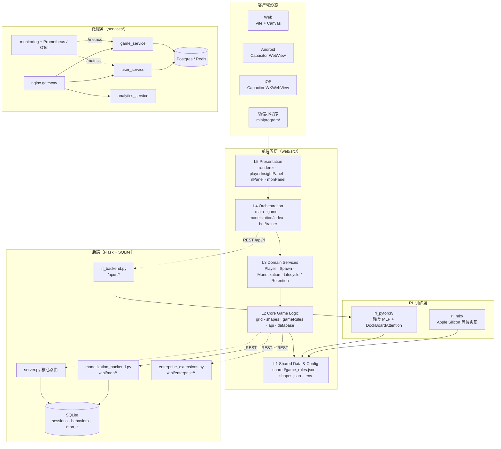
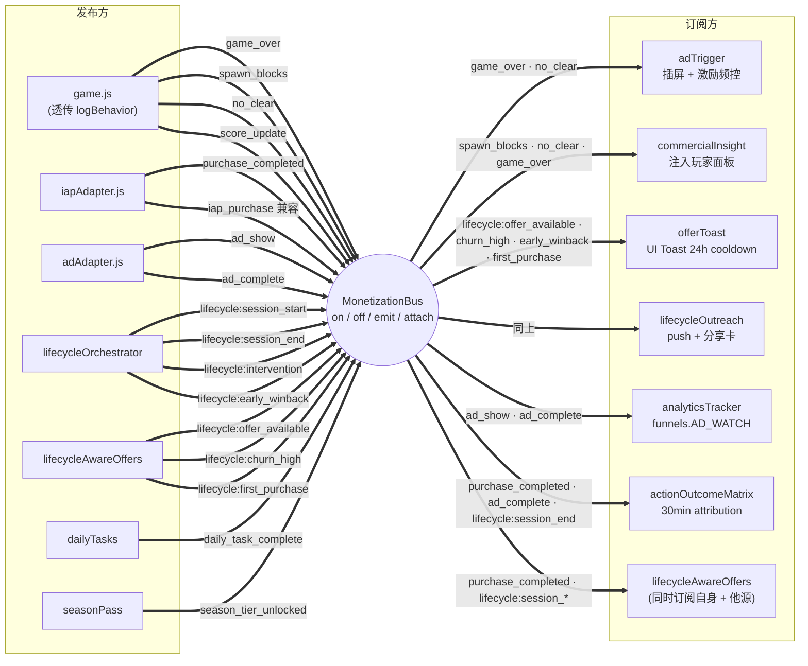
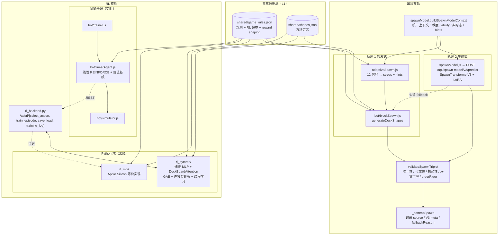
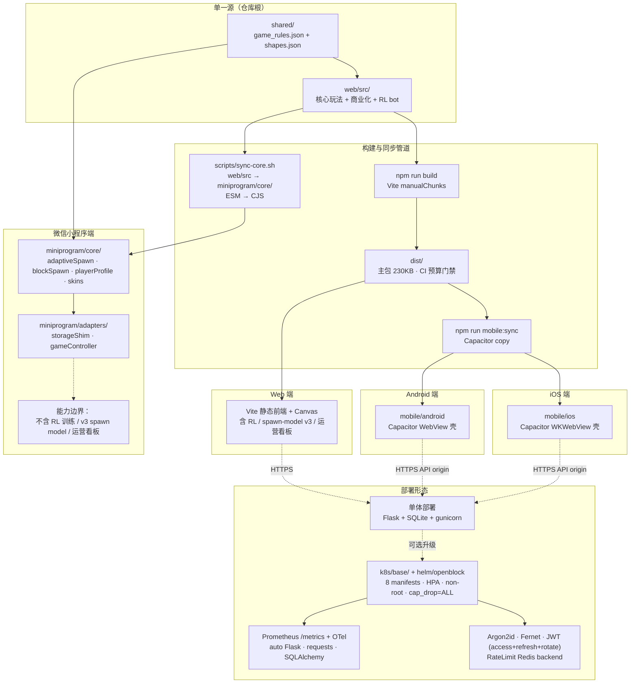

# OpenBlock 系统架构图

> **定位**：以 6 张 Mermaid 图覆盖 OpenBlock 全栈结构，作为
> [`ARCHITECTURE.md`](../../ARCHITECTURE.md) 的可视化伴随文档。
> **范围**：四端形态、前端五层、L3 业务子系统、MonetizationBus 事件总线、
> 出块 / RL 双轨、后端路由 / 数据持久化、四端同步与部署拓扑。
> **生成方式**：所有图依据
> [`ARCHITECTURE_DIAGRAM_PROMPT.md`](./ARCHITECTURE_DIAGRAM_PROMPT.md)
> 的事实包与约束生成；如需重生成，按照该 prompt 喂给大模型即可。
> **维护约定**：图中模块名必须能在
> [`engineering/PROJECT.md`](../engineering/PROJECT.md)、
> [`MONETIZATION_EVENT_BUS_CONTRACT.md`](./MONETIZATION_EVENT_BUS_CONTRACT.md) 或
> [`LIFECYCLE_DATA_STRATEGY_LAYERING.md`](./LIFECYCLE_DATA_STRATEGY_LAYERING.md)
> 中找到原文；不允许出现已归档模块和 sprint / 版本号语言。

## 阅读顺序

| 图 | 回答的问题 | 适合角色 |
|---|---|---|
| [图 1](#图-1宏观分层c4-容器视图) | 整个项目长什么样？ | 全角色 |
| [图 2](#图-2l3-domain-services-组件图) | 前端业务子系统怎么拆？ | 算法、前端、商业化 |
| [图 3](#图-3monetizationbus-事件总线) | 谁发什么事件、谁订什么？ | 商业化、生命周期、数据 |
| [图 4](#图-4出块双轨--rl-双轨融合) | 算法系统怎么收敛？ | 算法、出块、RL |
| [图 5](#图-5后端路由--数据持久化) | 接口与表怎么映射？ | 后端、SRE、数据 |
| [图 6](#图-6四端同步与部署拓扑) | 一份代码怎么覆盖四端？ | 架构、平台、运维 |

---

## 图 1：宏观分层（C4 容器视图）

> 整个项目长什么样？四端形态、前端五层、后端、RL 训练、微服务的容器级关系。



**解读**：四端共享 `web/src` 与 `shared/` 的核心逻辑；前端五层严格自顶向下
依赖；后端有"单体 Flask（4 入口）+ 微服务（4 服务 + nginx + 共享 PG/Redis）"
两种部署形态可选；RL 训练层独立运行，仅通过 `/api/rl` 与浏览器/服务端解耦，
并复用 L1 的同一份规则数据源。

---

## 图 2：L3 Domain Services 组件图

> 前端业务子系统怎么拆？Player、Spawn、Monetization、Lifecycle / Retention
> 四块如何协作。

```mermaid
flowchart LR
  subgraph playerSys["Player System"]
    playerProfile["playerProfile.js<br/>实时画像"]
    abilityModel["playerAbilityModel.js<br/>5 维 ability"]
    progression["progression.js<br/>XP / 等级 / 连签"]
    personalization["personalization.js<br/>实时信号 → 商业策略"]
    insightPanel["playerInsightPanel.js"]
  end

  subgraph spawnEngine["Spawn Engine"]
    adaptiveSpawn["adaptiveSpawn.js<br/>12 信号 → stress + spawnHints"]
    difficulty["difficulty.js<br/>score → stress 基础映射"]
    blockSpawn["bot/blockSpawn.js<br/>三连块生成 + 护栏"]
    spawnModel["spawnModel.js<br/>SpawnTransformerV3 + LoRA"]
  end

  subgraph lifecycle["Lifecycle / Retention"]
    orchestrator["lifecycle/lifecycleOrchestrator.js"]
    signals["lifecycle/lifecycleSignals.js"]
    dashboard["retention/playerLifecycleDashboard.js"]
    maturity["retention/playerMaturity.js"]
    churn["retention/churnPredictor.js"]
    funnel["retention/firstPurchaseFunnel.js"]
    winback["retention/winbackProtection.js"]
    vip["retention/vipSystem.js"]
  end

  subgraph monFW["Monetization Framework"]
    bus(["MonetizationBus<br/>事件总线"])
    flags["featureFlags.js"]
    commercialModel["commercialModel.js<br/>+ snapshot + abilityBias"]
    commercialPolicy["commercialPolicy.js<br/>推理 + 探索 + AOM 三合一"]
    adAdapter["adAdapter.js + adTrigger.js<br/>+ ad/adDecisionEngine + ad/adInsertionRL"]
    iapAdapter["iapAdapter.js + paymentManager.js"]
    offers["lifecycleAwareOffers.js<br/>offerToast / lifecycleOutreach"]
    tasks["dailyTasks.js · seasonPass.js · leaderboard.js"]
    algo["calibration · explorer · ml/* · quality/*<br/>opt-in scaffolding"]
  end

  playerProfile --> personalization
  abilityModel --> personalization
  playerProfile --> adaptiveSpawn
  difficulty --> adaptiveSpawn
  adaptiveSpawn --> blockSpawn
  spawnModel -.->|可选生成式轨道| blockSpawn
  abilityModel --> spawnModel

  signals --> orchestrator
  dashboard --> signals
  maturity --> signals
  churn --> signals
  orchestrator --> bus
  funnel --> orchestrator
  winback --> orchestrator
  vip --> orchestrator

  bus ==> offers
  bus ==> commercialPolicy
  flags -.-> commercialPolicy
  flags -.-> adAdapter
  personalization --> commercialModel
  commercialModel --> commercialPolicy
  algo -.-> commercialPolicy
  commercialPolicy --> adAdapter
  commercialPolicy --> iapAdapter
  commercialPolicy --> offers
  bus ==> tasks
  insightPanel <-- commercialModel
```

**解读**：`personalization` 是 Player ↔ Monetization 的桥；`adaptiveSpawn`
接收 `playerProfile` 后输出 stress + spawnHints 给 `blockSpawn`，`spawnModel`
作为可选生成式轨道并行存在；Lifecycle 子系统遵循"信号源 → orchestrator →
总线 emit → 策略消费"的单向链；`commercialPolicy` 作为决策包装层把
`commercialModel + algo/* + adapter` 串成一条线，`featureFlags` 以虚线门控。

---

## 图 3：MonetizationBus 事件总线

> 谁发什么事件、谁订什么？事件契约的可视化版本，详细 payload 与触发时机见
> [`MONETIZATION_EVENT_BUS_CONTRACT.md`](./MONETIZATION_EVENT_BUS_CONTRACT.md)。



**解读**：`game.js` 通过 `attach(game)` 包装 `logBehavior`，把游戏事件**零侵
入**透传到总线；显式事件分四组（IAP / 广告 / 生命周期 / 任务赛季），其中
`purchase_completed` 与 `iap_purchase` 双 emit 兼容旧订阅；
`lifecycleAwareOffers` 既是发布方也是订阅方（典型的"先 emit 信号、再聚合
决策"模式）；`actionOutcomeMatrix` 自动接 IAP / 广告 / 会话结束三类事件做
归因。

---

## 图 4：出块双轨 + RL 双轨融合

> 算法系统怎么收敛？双轨出块如何 fallback、RL 双轨如何共享数据源。



**解读**：双轨出块共享 `buildSpawnModelContext` 上下文，生成式失败时自动降级
到启发式轨道，所有出块结果统一过 `validateSpawnTriplet` 五层护栏；RL 双轨中
浏览器线性 agent 与 PyTorch/MLX 离线训练通过 `rl_backend.py` 解耦；
`shared/game_rules.json + shapes.json` 是出块和 RL 共四套实现的**单一数据源
**，确保前端实时玩法、训练环境、模型推理三者特征对齐。

---

## 图 5：后端路由 + 数据持久化

> 接口与表怎么映射？单体 Flask 与微服务两种部署形态如何并存。

```mermaid
flowchart LR
  subgraph monolith["单体 Flask（开箱即用）"]
    server["server.py<br/>核心路由"]
    monBackend["monetization_backend.py<br/>Blueprint /api/mon/*"]
    rlBackend["rl_backend.py<br/>/api/rl/*"]
    enterprise["enterprise_extensions.py<br/>/api/enterprise/*"]
  end

  subgraph routesCore["server.py 路由分组"]
    sessionR["/api/session<br/>/api/behavior<br/>/api/score · /api/stats"]
    contentR["/api/leaderboard · /achievement<br/>/api/replays · /move-sequence"]
    spawnR["/api/spawn-model/v3/<br/>{status, predict, train, reload, personalize}"]
    sysR["/api/health · /api/export<br/>/docs · /ops"]
  end

  subgraph routesMon["monetization_backend.py"]
    monProfile["/api/mon/user-profile/<userId>"]
    monAgg["/api/mon/aggregate"]
    monModel["/api/mon/model/config (GET/PUT)"]
    monLog["/api/mon/strategy/log"]
  end

  subgraph routesRl["rl_backend.py"]
    rlAct["/api/rl/select_action<br/>/api/rl/train_episode"]
    rlState["/api/rl/status<br/>/save · /load · /training_log"]
  end

  subgraph routesEnt["enterprise_extensions.py"]
    entCfg["/api/enterprise/remote-config<br/>/experiments · /live-ops"]
    entPay["/api/payment/verify<br/>/api/enterprise/ad-impression"]
    entComp["/api/compliance/{consent,export,delete}"]
  end

  subgraph dbCore[("SQLite 核心表")]
    tSessions[("sessions<br/>+ attribution JSON")]
    tBehaviors[("behaviors")]
    tScores[("scores")]
    tStats[("user_stats")]
    tAch[("achievements")]
    tReplays[("replays · move_sequences")]
    tClient[("client_strategies")]
  end

  subgraph dbMon[("商业化表")]
    tSeg[("mon_user_segments<br/>whale/dolphin/minnow")]
    tCfg[("mon_model_config")]
    tLog[("mon_strategy_log")]
  end

  subgraph microservices["微服务（services/，可选）"]
    nginx["nginx<br/>limit_req · auth_request · TLS"]
    userSvc["user_service<br/>+ openapi · SqlUserRepository"]
    gameSvc["game_service"]
    analyticsSvc["analytics_service"]
    monSvc["monitoring<br/>/metrics · OTel"]
    pgRedis[("Postgres + Redis<br/>USE_POSTGRES=true 热切")]
  end

  server --> routesCore
  monBackend --> routesMon
  rlBackend --> routesRl
  enterprise --> routesEnt

  sessionR --> tSessions
  sessionR --> tBehaviors
  contentR --> tScores
  contentR --> tStats
  contentR --> tAch
  contentR --> tReplays
  routesMon --> tSeg
  routesMon --> tCfg
  routesMon --> tLog

  nginx --> userSvc
  nginx --> gameSvc
  nginx --> analyticsSvc
  userSvc --> pgRedis
  gameSvc --> pgRedis
  analyticsSvc --> pgRedis
  monSvc -.->|拉取| userSvc
  monSvc -.->|拉取| gameSvc
```

**解读**：后端两套形态并存——单体 Flask 把 4 个入口（核心 / 商业化 / RL /
企业）挂在同一个 app，便于本地与小型部署；微服务形态把 user / game /
analytics / monitoring 拆开，统一过 nginx 网关，后端持久化 PG/Redis
（`USE_POSTGRES=true` 热切）；`sessions.attribution` 是跨端归因的关键 JSON
字段；`mon_*` 表族支撑分群、模型配置和策略日志，独立于核心表族。

---

## 图 6：四端同步与部署拓扑

> 一份代码怎么覆盖四端？同步管道、能力边界与部署形态。



**解读**：`shared/` + `web/src/` 是四端的**唯一源头**，Web/Android/iOS 走
`Vite build → dist → Capacitor sync` 同一条流水线，小程序走 `sync-core.sh`
把 ESM 转 CJS 落到 `miniprogram/core/`；小程序通过 `storageShim` 把
`wx.*StorageSync` 桥成 `localStorage`，但**显式不包含** RL 训练 / v3 推理 /
运营看板；部署侧从单体 Flask 一键起步，可平滑升级到 k8s + Helm + 自动
Prometheus/OTel + 全套安全加固。

---

## 维护规约

1. **代码事实优先**：图中模块名必须能在
   [`engineering/PROJECT.md`](../engineering/PROJECT.md) 与 §2 事实包追溯到
   实际文件；新增模块同步加入。
2. **单向依赖红线**：L5 → L4 → L3 → L2 → L1；Monetization / Lifecycle /
   Retention 不得反向调用 `game.js` / `grid.js`。
3. **不写中间态**：禁止在图标签里出现 `Phase X / v1.49.x / 已完成 /
   规划中` 等 sprint 节奏语言；状态信息进 [`CHANGELOG.md`](../../CHANGELOG.md)。
4. **重生成流程**：架构发生结构性变化时，更新
   [`ARCHITECTURE_DIAGRAM_PROMPT.md`](./ARCHITECTURE_DIAGRAM_PROMPT.md) 的事实
   包，再用大模型重生成本文档。
5. **渲染验证**：所有 Mermaid 图须能在 mermaid.live 直接渲染；CI 可用
   [`scripts/check_docs_registered.py`](../../scripts/check_docs_registered.py)
   保证注册到文档中心。

## 关联文档

- [`../../ARCHITECTURE.md`](../../ARCHITECTURE.md) —— 文字版完整架构（含 ADR）
- [`./ARCHITECTURE_DIAGRAM_PROMPT.md`](./ARCHITECTURE_DIAGRAM_PROMPT.md) —— 重生成本文档的 prompt 模板
- [`./MONETIZATION_EVENT_BUS_CONTRACT.md`](./MONETIZATION_EVENT_BUS_CONTRACT.md) —— 事件总线 payload / 订阅方契约
- [`./LIFECYCLE_DATA_STRATEGY_LAYERING.md`](./LIFECYCLE_DATA_STRATEGY_LAYERING.md) —— 数据 → 编排 → 策略三段式
- [`../engineering/PROJECT.md`](../engineering/PROJECT.md) —— 模块字典与职责
- [`../algorithms/COMMERCIAL_MODEL_DESIGN_REVIEW.md`](../algorithms/COMMERCIAL_MODEL_DESIGN_REVIEW.md) —— 商业化算法层设计
