# OpenBlock 系统架构图

> **定位**：以「业务架构 → 全栈分层 → 6 张 Mermaid 子图」三层视图覆盖
> OpenBlock 从产品形态到技术实现的完整架构，作为
> [`ARCHITECTURE.md`](../../ARCHITECTURE.md) 的可视化伴随文档。
> **范围**：业务四支柱与统一生态、四端形态、前端五层、L3 业务子系统、
> MonetizationBus 事件总线、出块 / RL 双轨、后端路由 / 数据持久化、四端
> 同步与部署拓扑。
> **生成方式**：技术分层视图与 6 张子图依据
> [`ARCHITECTURE_DIAGRAM_PROMPT.md`](./ARCHITECTURE_DIAGRAM_PROMPT.md)
> 的事实包与约束生成；如需重生成，按照该 prompt 喂给大模型即可。
> **维护约定**：图中模块名必须能在
> [`engineering/PROJECT.md`](../engineering/PROJECT.md)、
> [`MONETIZATION_EVENT_BUS_CONTRACT.md`](./MONETIZATION_EVENT_BUS_CONTRACT.md) 或
> [`LIFECYCLE_DATA_STRATEGY_LAYERING.md`](./LIFECYCLE_DATA_STRATEGY_LAYERING.md)
> 中找到原文；不允许出现已归档模块和 sprint / 版本号语言。

## 阅读顺序

| 图 | 回答的问题 | 适合角色 |
|---|---|---|
| [业务架构](#业务架构总览四支柱--统一生态) | OpenBlock 是一个什么样的产品？四个能力如何串成一个生态？ | 全角色 / 对外宣讲 / 新人破冰 |
| [总览图](#总览图全栈分层--设计原则) | 一图看懂从端到云的整体技术架构 | 全角色 / 新人入门 |
| [图 1](#图-1宏观分层c4-容器视图) | 整个项目长什么样？ | 全角色 |
| [图 2](#图-2l3-domain-services-组件图) | 前端业务子系统怎么拆？ | 算法、前端、商业化 |
| [图 3](#图-3monetizationbus-事件总线) | 谁发什么事件、谁订什么？ | 商业化、生命周期、数据 |
| [图 4](#图-4出块双轨--rl-双轨融合) | 算法系统怎么收敛？ | 算法、出块、RL |
| [图 5](#图-5后端路由--数据持久化) | 接口与表怎么映射？ | 后端、SRE、数据 |
| [图 6](#图-6四端同步与部署拓扑) | 一份代码怎么覆盖四端？ | 架构、平台、运维 |

---

## 业务架构总览：四支柱 + 统一生态

> **回答的问题**：OpenBlock 作为一个"游戏 + AI + RL + 商业化"的开源平台，
> 究竟由哪些产品能力组成？这些能力之间如何形成正反馈闭环？
>
> 本图是**最高层的产品视角**：不涉及代码模块、不出现技术名词，把整个项目
> 浓缩为四个产品支柱 + 一个共享数据 / 统一生态中枢。下方的"技术总览图"
> 与 6 张展开图，本质上都是这四个支柱在不同抽象层次上的细化。

| 支柱 | 一句话定位 | 关键能力 | 对应技术文档 |
|---|---|---|---|
| 🎮 **Games Engine** | 多端方块益智核心玩法 | Web / Android / iOS / 微信小程序四端体验一致 | [图 6: 四端同步与部署拓扑](#图-6四端同步与部署拓扑) · [MOBILE_CLIENTS](../platform/MOBILE_CLIENTS.md) |
| 🧠 **Adaptive Spawning AI** | 心流 / 技能 / 节奏驱动的智能出块 | 双轨出块（启发式 + Transformer V3）+ 统一护栏 + 多样可玩三连块 | [图 4: 出块 / RL 双轨](#图-4出块双轨--rl-双轨融合) · [ALGORITHMS_SPAWN](../algorithms/ALGORITHMS_SPAWN.md) |
| 🤖 **Reinforce Learning Trainer** | 神经网络训练平台 | PyTorch / MLX 双引擎 + PPO + GAE + EvalGate + 自博弈 | [ALGORITHMS_RL](../algorithms/ALGORITHMS_RL.md) · [RL_PYTORCH_SERVICE](../algorithms/RL_PYTORCH_SERVICE.md) |
| 💰 **Monetization Framework** | 可插拔商业化框架 | 广告 / IAP / 个性化推荐三类适配器 + MonetizationBus 零侵入接入 | [图 3: MonetizationBus](#图-3monetizationbus-事件总线) · [MONETIZATION](../operations/MONETIZATION.md) |
| 🗄️ **Shared Data Source** | 单一数据源 / 共享配置 | `shared/game_rules.json` + `shapes.json` + SQLite 行为库四端共用 | [图 5: 后端路由 + 持久化](#图-5后端路由--数据持久化) · [SQLITE_SCHEMA](../engineering/SQLITE_SCHEMA.md) |
| 🔁 **Unified Ecosystem** | 闭环正反馈 | 玩家行为 → 数据 → AI 决策 → 体验 → 行为 | [LIFECYCLE_DATA_STRATEGY_LAYERING](./LIFECYCLE_DATA_STRATEGY_LAYERING.md) |

> **下一步**：业务上明白后，接着看下方"全栈分层"总览了解技术形态；
> 主策划 / 玩法设计师可直接跳到
> [OpenBlock 产品架构图](./PRODUCT_ARCHITECTURE_DIAGRAMS.md) 看 "玩家旅程视角"；
> 算法工程师可直接跳到
> [算法架构图](../algorithms/ALGORITHM_ARCHITECTURE_DIAGRAMS.md)。

---

## 总览图：全栈分层 + 设计原则

> **回答的问题**：OpenBlock 由哪些层、各层做什么、有什么贯穿全局的约束？
>
> 本节给出**一图概览 + 紧凑版 Mermaid 概念图**两种视图：图集中描述能力
> 与边界，**不绑定具体代码文件**。如需追溯到模块、契约、路由、表的细节，
> 参见下方 6 张展开图。

### 视图 A：设计参考图

> 上图为完整的设计参考视觉稿：每层右侧附"层内约束"，底部一条带列出
> 6 条贯穿全局的设计原则，便于在评审、培训、对外宣讲时使用。

### 视图 B：紧凑概念图（一屏可视）

> 用 mermaid 11 的 **`block-beta`** 网格语法，可精确指定每行列数，
> 把 6 层 + 1 设计原则带渲染为 7 行水平条带，整体宽高比 ≈ 4:3。
> 相较 `flowchart` + `direction LR`（dagre / ELK 在嵌套 subgraph
> 内无视 LR、把每层挤成 2×N 网格的"法棍"形态），`block-beta` 不依赖
> 自动布局算法去"猜"方向，所见即所得。
>
> 注意：`block-beta` 不支持箭头，层间关系靠从上到下的垂直堆叠
> 自然表达；如需查看显式数据流，参见下方 6 张展开图。

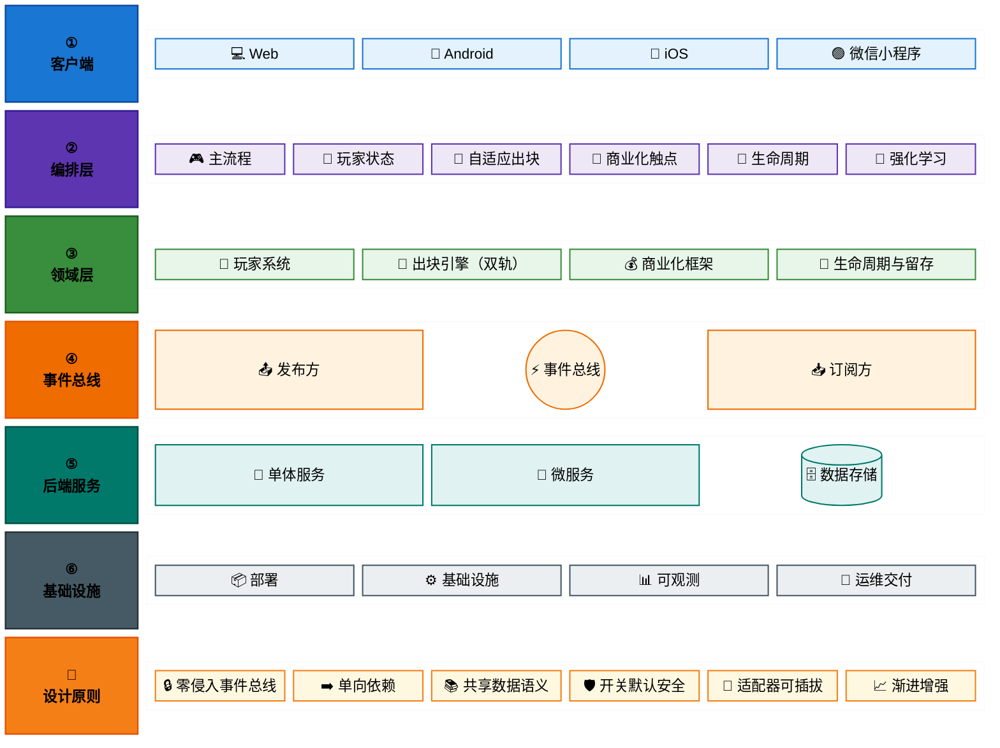

### 层级与原则解读

| 层级 | 职责 | 层内约束 |
|---|---|---|
| ① 客户端（四端） | 跨平台一致的玩家入口 | 共享同一套规则与数据语义；进度·成就·故障跨端同步；渐进增强 |
| ② 应用编排层 | 局内流程与体验编排 | 数据 → 编排 → 策略；零侵入；特性开关按需开启能力模块 |
| ③ 领域服务层 | 沉淀业务能力 | 玩家 / 出块 / 商业化 / 留存四子系统协同；商业化结果回流玩家画像 |
| ④ 事件总线层 | 零侵入的事件分发 | 统一事件语义；松耦合发布 / 订阅；隐私合规·最小化 |
| ⑤ 后端服务层 | 能力 API + 数据持久化 | 单体（轻量形态）与微服务（生产形态）双形态并存；网关统一安全 |
| ⑥ 基础设施层 | 部署、运维与交付 | 自动化运维与交付；可观测·可追溯；安全合规·稳健可靠 |

| 设计原则 | 解释 |
|---|---|
| 🔒 零侵入事件总线 | 只观察不预设核心心流，保障系统边界清晰 |
| ➡️ 单向依赖 | 体验层 → 领域层 → 数据层 → 基础设施层，层次清晰 |
| 📚 共享数据语义 | 规则与玩法数据为训练 / 玩法 / 分析共享语义，体验一致 |
| 🛡️ 开关默认安全 | 观测路径默认开启，决策路径默认关闭、按需放量 |
| 🔌 适配器可插拔 | 广告与支付等能力可热插拔，支持多平台与多供应商 |
| 📈 渐进增强 | 离线完整可玩，在线解锁更多能力与个性化体验 |

> **下一步**：如需了解具体模块、契约、路由与表，请继续阅读下方 6 张展开图。

---

## 图 1：宏观分层（C4 容器视图）

> 整个项目长什么样？四端形态、前端五层、后端、RL 训练、微服务的
> 容器级关系。本节给出**两张紧凑视图**：上方"容器构成"用 block-beta
> 网格强制 4:3 横向布局（一屏可视所有容器），下方"关键数据流"用
> 小型 flowchart 保留 REST 调用方向。

### 1.1 容器构成（紧凑横向）

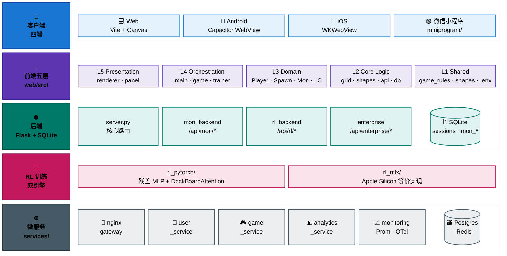

### 1.2 关键数据流（REST · 文件依赖）

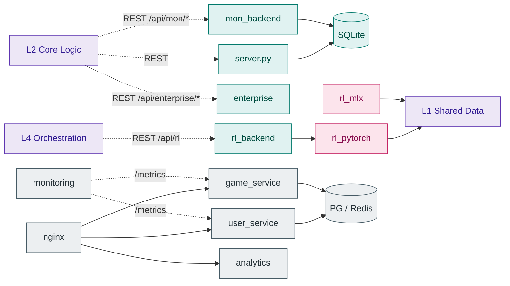

**解读**：四端共享 `web/src` 与 `shared/` 的核心逻辑；前端五层严格自顶向下
依赖；后端有"单体 Flask（4 入口）+ 微服务（4 服务 + nginx + 共享 PG/Redis）"
两种部署形态可选；RL 训练层独立运行，仅通过 `/api/rl` 与浏览器/服务端解耦，
并复用 L1 的同一份规则数据源。

---

## 图 2：L3 Domain Services 组件图

> 前端业务子系统怎么拆？Player、Spawn、Monetization、Lifecycle / Retention
> 四块如何协作。本节给出**两张紧凑视图**：上方 2.1 用 block-beta 网格
> 列出所有模块，下方 2.2 用 flowchart 画跨子系统的关键协作关系。

### 2.1 组件构成（紧凑横向）

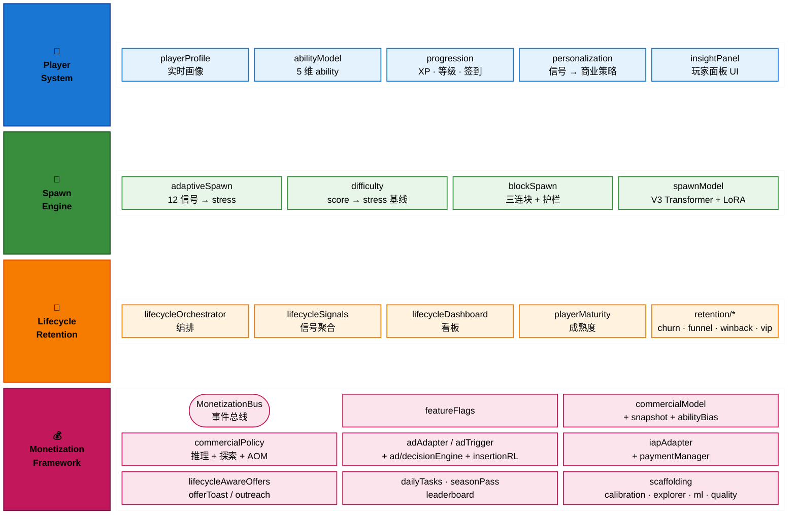

### 2.2 关键跨子系统协作（数据流）

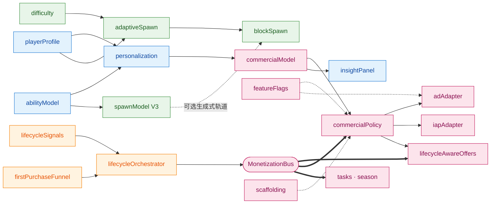

**解读**：`personalization` 是 Player ↔ Monetization 的桥；`adaptiveSpawn`
接收 `playerProfile` 后输出 stress + spawnHints 给 `blockSpawn`，`spawnModel`
作为可选生成式轨道并行存在；Lifecycle 子系统遵循"信号源 → orchestrator →
总线 emit → 策略消费"的单向链；`commercialPolicy` 作为决策包装层把
`commercialModel + algo/* + adapter` 串成一条线，`featureFlags` 以虚线门控。

---

## 图 3：MonetizationBus 事件总线

> 谁发什么事件、谁订什么？事件契约的可视化版本，详细 payload 与触发时机见
> [`MONETIZATION_EVENT_BUS_CONTRACT.md`](./MONETIZATION_EVENT_BUS_CONTRACT.md)。
>
> 布局：**三栏 LR（发布方 ｜ 总线 ｜ 订阅方）**——把扇入扇出全部拉直
> 成水平流，事件名压成精简前缀（按事件家族归并），整体宽 > 高接近 4:3。

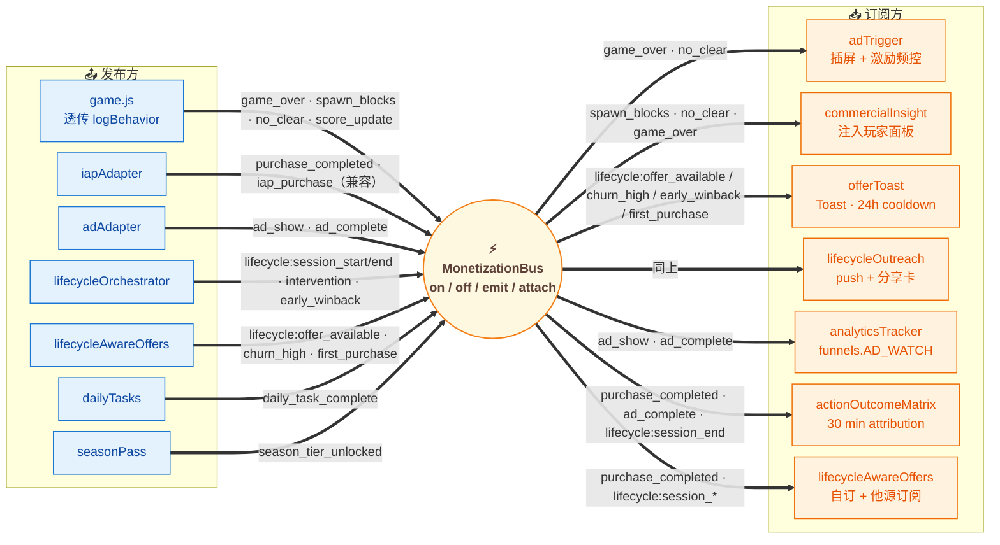

**解读**：`game.js` 通过 `attach(game)` 包装 `logBehavior`，把游戏事件**零侵
入**透传到总线；显式事件分四组（IAP / 广告 / 生命周期 / 任务赛季），其中
`purchase_completed` 与 `iap_purchase` 双 emit 兼容旧订阅；
`lifecycleAwareOffers` 既是发布方也是订阅方（典型的"先 emit 信号、再聚合
决策"模式）；`actionOutcomeMatrix` 自动接 IAP / 广告 / 会话结束三类事件做
归因。

---

## 图 4：出块双轨 + RL 双轨融合

> 算法系统怎么收敛？双轨出块如何 fallback、RL 双轨如何共享数据源。
>
> 布局：**LR 三段式**——左侧"共享数据源（L1）"作为入口、中段"出块双轨"
> 主流程横向走、右侧"RL 双轨"做训练/推理；色块按子系统分组。

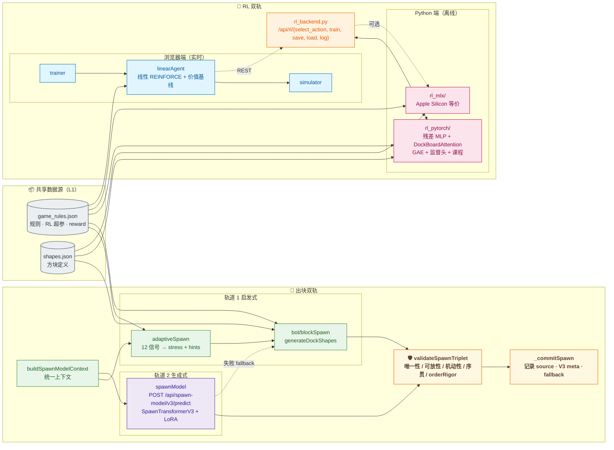

**解读**：双轨出块共享 `buildSpawnModelContext` 上下文，生成式失败时自动降级
到启发式轨道，所有出块结果统一过 `validateSpawnTriplet` 五层护栏；RL 双轨中
浏览器线性 agent 与 PyTorch/MLX 离线训练通过 `rl_backend.py` 解耦；
`shared/game_rules.json + shapes.json` 是出块和 RL 共四套实现的**单一数据源
**，确保前端实时玩法、训练环境、模型推理三者特征对齐。

---

## 图 5：后端路由 + 数据持久化

> 接口与表怎么映射？单体 Flask 与微服务两种部署形态如何并存。本节
> 给出**两张紧凑视图**：5.1 用 block-beta 列出所有路由分组与表，
> 5.2 用 flowchart 画"路由 → 表"的映射关系。

### 5.1 单体路由 + 表 · 微服务（紧凑横向）

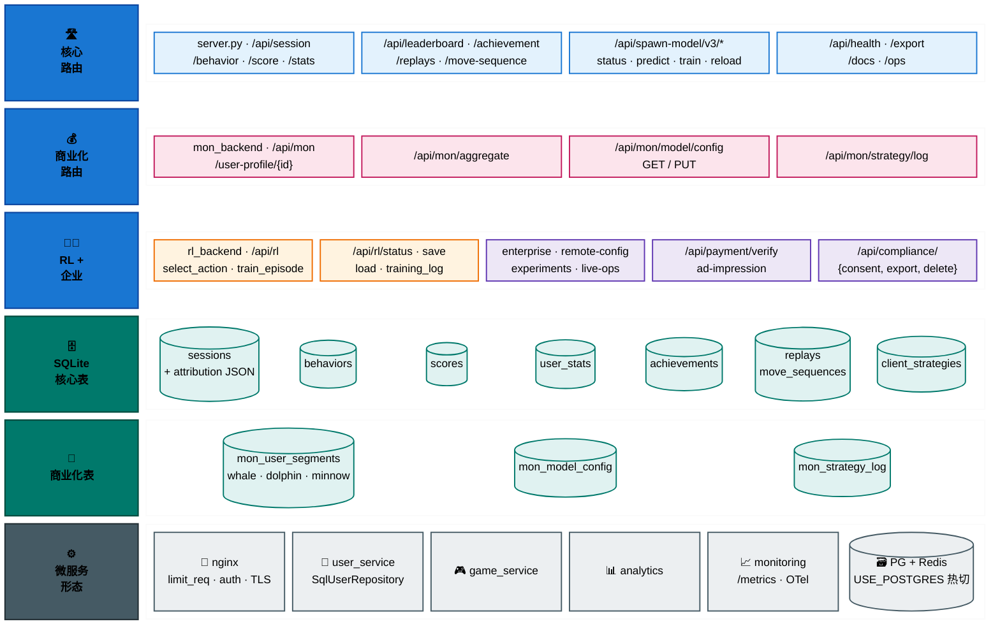

### 5.2 路由 → 表映射（数据持久化路径）

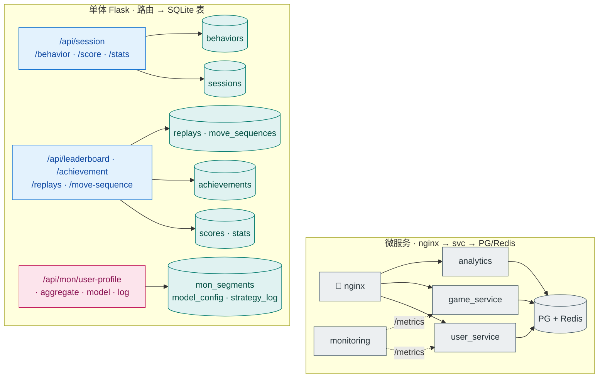

**解读**：后端两套形态并存——单体 Flask 把 4 个入口（核心 / 商业化 / RL /
企业）挂在同一个 app，便于本地与小型部署；微服务形态把 user / game /
analytics / monitoring 拆开，统一过 nginx 网关，后端持久化 PG/Redis
（`USE_POSTGRES=true` 热切）；`sessions.attribution` 是跨端归因的关键 JSON
字段；`mon_*` 表族支撑分群、模型配置和策略日志，独立于核心表族。

---

## 图 6：四端同步与部署拓扑

> 一份代码怎么覆盖四端？同步管道、能力边界与部署形态。本节给出**两张
> 紧凑视图**：6.1 用 block-beta 列出"源 ｜ 四端形态 ｜ 部署形态"，
> 6.2 用紧凑 LR flowchart 画"同步流水线 + 部署关系"。

### 6.1 四端形态 + 部署形态（紧凑横向）

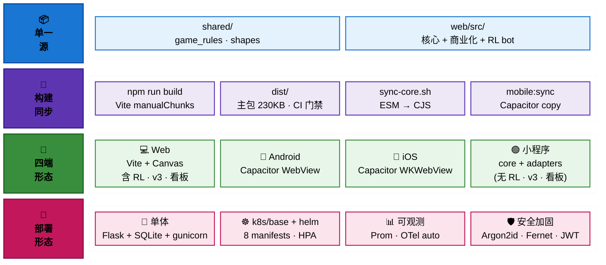

### 6.2 同步流水线 + 部署关系

> 本图本质是 TB 顺序流水线（源 → 构建 → 端 → 部署），自然偏纵向。
> 想看四端 / 部署形态的横向构成对比，请回看 [§6.1](#61-四端形态--部署形态紧凑横向)。

```mermaid
---
config:
  flowchart:
    nodeSpacing: 18
    rankSpacing: 32
    htmlLabels: true
    curve: basis
---
flowchart TB
  classDef src   fill:#e3f2fd,stroke:#1976d2,color:#0d47a1
  classDef build fill:#ede7f6,stroke:#5e35b1,color:#311b92
  classDef ep    fill:#e8f5e9,stroke:#388e3c,color:#1b5e20
  classDef dep   fill:#fce4ec,stroke:#c2185b,color:#880e4f

  %% 三个内部 LR 的 subgraph 上下叠：第一段是源+构建串，第二段四端横排，
  %% 第三段部署横排；跨段箭头展示同步管道与 HTTPS 调用
  subgraph SRC_BUILD["📦 单一源 + 🔧 构建/同步"]
    direction LR
    sharedDir["shared/<br/>game_rules · shapes"]:::src
    webSrc["web/src/"]:::src
    syncCore["sync-core.sh<br/>ESM → CJS"]:::build
    viteBuild["Vite build"]:::build
    distDir["dist/"]:::build
    mobileSync["mobile:sync<br/>Capacitor copy"]:::build

    sharedDir --> webSrc
    webSrc --> viteBuild
    webSrc --> syncCore
    viteBuild --> distDir
    distDir --> mobileSync
  end

  subgraph EP["📱 四端形态"]
    direction LR
    webApp["💻 Web"]:::ep
    androidApp["📱 Android"]:::ep
    iosApp["📱 iOS"]:::ep
    miniCore["🟢 小程序 core"]:::ep
  end

  subgraph DEP["🚀 部署形态"]
    direction LR
    monoDeploy["🧱 单体 Flask<br/>+ SQLite + gunicorn"]:::dep
    k8sDeploy["☸️ k8s + Helm<br/>HPA · 安全加固"]:::dep
  end

  distDir --> webApp
  mobileSync --> androidApp
  mobileSync --> iosApp
  syncCore --> miniCore
  sharedDir --> miniCore

  webApp -. HTTPS .-> monoDeploy
  androidApp -. HTTPS .-> monoDeploy
  iosApp -. HTTPS .-> monoDeploy
  monoDeploy -. 可选升级 .-> k8sDeploy
```

**解读**：`shared/` + `web/src/` 是四端的**唯一源头**，Web/Android/iOS 走
`Vite build → dist → Capacitor sync` 同一条流水线，小程序走 `sync-core.sh`
把 ESM 转 CJS 落到 `miniprogram/core/`；小程序通过 `storageShim` 把
`wx.*StorageSync` 桥成 `localStorage`，但**显式不包含** RL 训练 / v3 推理 /
运营看板；部署侧从单体 Flask 一键起步，可平滑升级到 k8s + Helm + 自动
Prometheus/OTel + 全套安全加固。

---

## 维护规约

1. **代码事实优先**：图中模块名必须能在
   [`engineering/PROJECT.md`](../engineering/PROJECT.md) 与 §2 事实包追溯到
   实际文件；新增模块同步加入。
2. **单向依赖红线**：L5 → L4 → L3 → L2 → L1；Monetization / Lifecycle /
   Retention 不得反向调用 `game.js` / `grid.js`。
3. **不写中间态**：禁止在图标签里出现 `Phase X / v1.49.x / 已完成 /
   规划中` 等 sprint 节奏语言；状态信息进 [`CHANGELOG.md`](../../CHANGELOG.md)。
4. **重生成流程**：架构发生结构性变化时，更新
   [`ARCHITECTURE_DIAGRAM_PROMPT.md`](./ARCHITECTURE_DIAGRAM_PROMPT.md) 的事实
   包，再用大模型重生成本文档。
5. **渲染验证**：所有 Mermaid 图须能在 mermaid.live 直接渲染；CI 可用
   [`scripts/check_docs_registered.py`](../../scripts/check_docs_registered.py)
   保证注册到文档中心。

## 关联文档

- [`../../ARCHITECTURE.md`](../../ARCHITECTURE.md) —— 文字版完整架构（含 ADR）
- [`./ARCHITECTURE_DIAGRAM_PROMPT.md`](./ARCHITECTURE_DIAGRAM_PROMPT.md) —— 重生成本文档的 prompt 模板
- [`./MONETIZATION_EVENT_BUS_CONTRACT.md`](./MONETIZATION_EVENT_BUS_CONTRACT.md) —— 事件总线 payload / 订阅方契约
- [`./LIFECYCLE_DATA_STRATEGY_LAYERING.md`](./LIFECYCLE_DATA_STRATEGY_LAYERING.md) —— 数据 → 编排 → 策略三段式
- [`../engineering/PROJECT.md`](../engineering/PROJECT.md) —— 模块字典与职责
- [`../algorithms/COMMERCIAL_MODEL_DESIGN_REVIEW.md`](../algorithms/COMMERCIAL_MODEL_DESIGN_REVIEW.md) —— 商业化算法层设计
