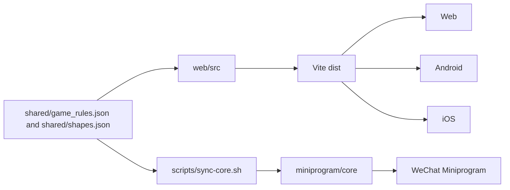

# Android / iOS 客户端外壳说明

## 1. 当前定位

`mobile/` 是 OpenBlock 的 Android / iOS 客户端外壳目录，采用 Capacitor WebView / WKWebView 承载现有 Web 构建产物。

该目录只负责移动端打包、平台工程和真机部署，不复制、不改写 `web/src` 的核心玩法逻辑。Web、Android、iOS 三端运行同一份 Vite 构建结果；微信小程序继续使用 `miniprogram/` 的轻量实现，并通过 `shared/` 与同步脚本保持规则一致。

首版客户端能力：

- 离线核心对局：游戏主体、棋盘、候选块、计分、皮肤、音效等随 `dist/` 一起打包。
- 后端 API：通过构建环境变量注入设备可访问的 API origin。
- 平台外壳：Android Studio / Xcode 原生工程由 Capacitor 维护。

不包含：

- 原生重写的 Canvas 游戏逻辑。
- React Native / Flutter 等第二套 UI 运行时。
- RL 训练、模型状态看板或运营后台。
- 原生广告、IAP、推送 SDK 的正式接入；这些能力后续通过平台插件或原生桥扩展。

## 2. 目录结构

```text
mobile/
├── README.md
├── package.json
├── capacitor.config.json
├── android/
└── ios/
```

| 路径 | 说明 |
|------|------|
| `mobile/capacitor.config.json` | App ID、App 名称、`webDir`、Android/iOS 平台路径 |
| `mobile/package.json` | 使 `mobile/` 成为 Capacitor 可识别的独立 npm 包根 |
| `mobile/android/` | Capacitor 生成的 Android WebView 工程 |
| `mobile/ios/` | Capacitor 生成的 iOS WKWebView 工程 |
| `dist/` | Web 构建产物；由根目录 `npm run build` 生成，再同步进平台工程 |

`mobile/android/app/src/main/assets/public/` 和 `mobile/ios/App/App/public/` 是 Capacitor 复制出的静态资源目录，属于生成产物，已在 `.gitignore` 中忽略。

## 3. 构建与打开

从仓库根目录执行：

```bash
npm run mobile:build
```

该命令会先运行 Web 构建，再执行 Capacitor 同步，将最新 `dist/` 写入 Android / iOS 工程。

常用命令：

```bash
npm run build          # 只构建 Web 静态产物
npm run mobile:sync    # 同步已有 dist 到 Android / iOS
npm run mobile:copy    # 只复制 Web 静态资源
npm run mobile:android # 打开 Android Studio 工程
npm run mobile:ios     # 打开 Xcode 工程
```

Android 使用 Android Studio 打开 `mobile/android`。iOS 使用 Xcode 打开 `mobile/ios/App/App.xcodeproj`。

## 4. API 与离线边界

移动端包内的核心对局不依赖后端，离线状态下仍可启动游戏并完成本地对局。

需要排行榜、会话、商业化或服务端统计时，必须在打包前提供真机可访问的 API 地址。例如：

```bash
VITE_API_BASE_URL=https://api.example.com npm run mobile:build
```

注意事项：

- 打包后的 Android / iOS 不使用 Vite dev proxy。
- 真机上的 `127.0.0.1` 指向手机自身，不是开发机。
- 正式包建议使用 HTTPS API；如需 HTTP 或自签证书，需要额外配置 Android network security config 或 iOS ATS。
- API 请求体、会话归因字段和商业化占位字段应继续与 Web 保持一致。

## 5. 四端同步关系



维护原则：

- Web、Android、iOS 的玩法修改从 `web/src` 进入，由 `npm run build` 生成同一份 `dist/`。
- 规则和形状数据从 `shared/game_rules.json`、`shared/shapes.json` 进入。
- 微信小程序通过 `scripts/sync-core.sh` 生成 `miniprogram/core/gameRulesData.js` 和 `miniprogram/core/shapesData.js`。
- 不在 `mobile/` 中新增玩法分支；平台差异只放在 Capacitor 配置、原生权限、插件和打包脚本中。

## 6. 验证

移动端外壳或四端同步相关改动至少运行：

```bash
npm run build
npm run mobile:sync
npm test
```

提交前建议额外检查：

- Android Studio 能打开 `mobile/android`。
- Xcode 能打开 `mobile/ios/App/App.xcodeproj`。
- 离线状态可进入核心对局。
- 配置线上 API 后，真机能访问后端接口。
- `docs/platform/SYNC_CONTRACT.md` 与本文描述保持一致。

## 7. 已知边界

- 当前 Android / iOS 是 WebView 外壳，不提供独立原生渲染管线。
- 商店发布所需图标、启动图、签名、包名、隐私权限文案仍需按渠道补齐。
- 原生广告、IAP、推送、Deep Link 等能力需要后续插件接入，并与 Web 事件总线和后端校验契约对齐。
- 若未来要支持远程热更新或远程加载 JS，需要单独评估应用商店政策、安全校验和回滚机制。
